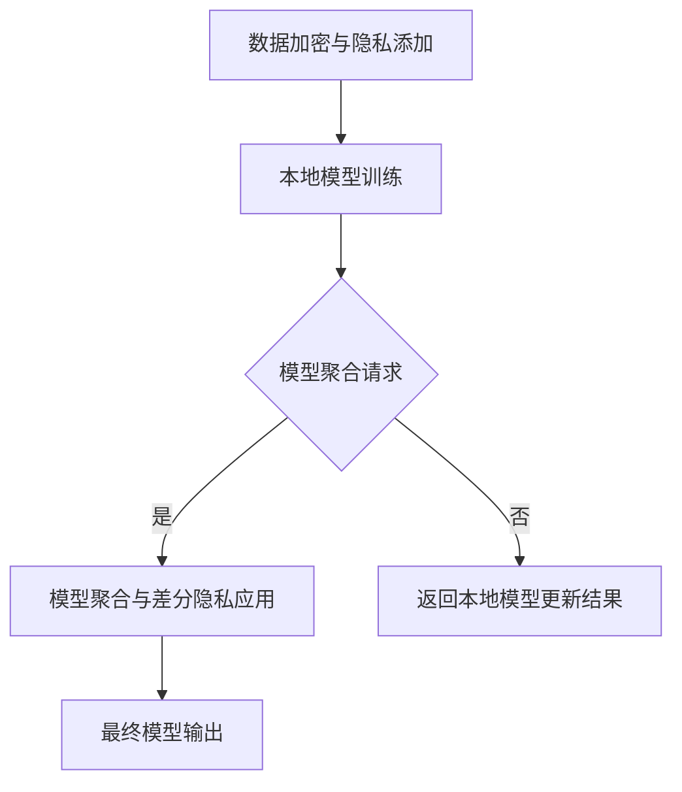
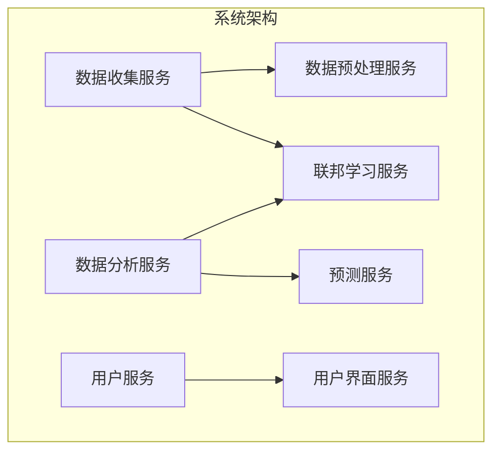
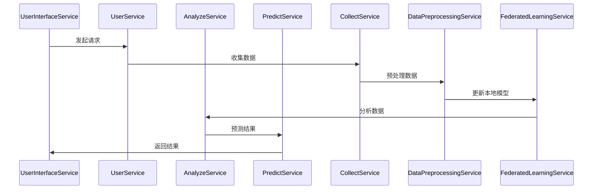

                 

### 让我们一步一步深入探讨：联邦学习中的差分隐私在健康数据共享中的应用

#### 1. 联邦学习的背景与原理

联邦学习（Federated Learning）是一种机器学习技术，它允许多个参与方在不共享数据的情况下共同训练一个共享的模型。这个技术的核心思想是将模型的训练过程分散到不同的设备或服务器上，从而避免将敏感数据集中存储在一个地方，这样可以有效减少数据泄露的风险。

**核心概念术语说明：**
- **联邦学习**：一种分布式机器学习技术，模型训练在分散的数据上完成，而非在集中式数据中心。
- **参与方**：参与联邦学习的实体，可以是设备、服务器或组织。
- **共享模型**：所有参与方共同训练并共享的最终模型。

**问题背景与问题描述：**
随着健康数据的不断增长，医疗领域迫切需要一种方法来共享和利用这些数据，以提高疾病的诊断和治疗的准确性。然而，健康数据往往包含了大量的个人敏感信息，如患者姓名、诊断记录、生活习惯等。如何保护这些数据在共享过程中的隐私，成为了一个关键问题。

**问题解决：**
联邦学习提供了一种解决方案，它允许医疗机构在保护患者隐私的同时共享和利用健康数据。差分隐私（Differential Privacy）作为一种重要的隐私保护技术，能够进一步增强联邦学习系统的隐私保护能力。

**边界与外延：**
联邦学习不仅限于健康数据共享，还可以应用于金融、交通、社交网络等多个领域。差分隐私技术也在其他隐私敏感的应用场景中得到了广泛应用。

**概念结构与核心要素组成：**
- **模型更新**：每个参与方在自己的本地数据集上更新模型。
- **模型聚合**：参与方将本地更新的模型发送给中心服务器进行聚合。
- **隐私保护**：差分隐私技术用于确保聚合过程中不泄露参与方的隐私信息。

通过上述背景介绍，我们可以初步了解联邦学习和差分隐私的基本概念及其在健康数据共享中的应用价值。接下来，我们将深入探讨联邦学习的具体实现原理和差分隐私的核心技术，为后续内容奠定基础。

#### 2. 差分隐私的原理与应用

差分隐私（Differential Privacy）是一种用于保护数据隐私的数学理论，由Cynthia Dwork在2006年首次提出。它的核心思想是在数据分析过程中加入一定程度的噪声，使得单个个体的数据无法被准确识别，从而实现隐私保护。

**核心概念术语说明：**
- **噪声**：在数据分析过程中引入的随机变量，用于模糊化结果，防止个体数据的泄露。
- **拉普拉斯机制**：一种常见的引入噪声的方法，通过计算拉普拉斯分布的随机样本来添加噪声。
- **隐私预算**：用于衡量隐私保护强度的参数，通常用ε表示，ε值越大，隐私保护越强。

**核心概念原理：**
差分隐私通过以下原理实现隐私保护：
- **差分**：比较两个相邻的数据集，看它们是否在某个特定的属性上只有一个小小的差异。
- **隐私**：在数据分析过程中，确保无法通过分析结果确定单个个体的数据。

**概念属性特征对比表格：**

| 概念特征 | 差分隐私 | 传统隐私保护方法 |
| --- | --- | --- |
| **噪声添加** | 是 | 否 |
| **隐私预算** | 是 | 否 |
| **灵活性** | 高 | 低 |
| **隐私保护强度** | 可调节 | 固定 |

**ER实体关系图架构的 Mermaid 流程图：**

```mermaid
erDiagram
  Patient ||--|{ Data }|--|| Doctor
  Data ||--|{ Privacy }|--|| Analysis
```

在这个ER图中，Patient（患者）与Data（数据）之间存在一对一的关系，而Data与Privacy（隐私）和Analysis（分析）存在一对多的关系，体现了差分隐私在数据分析和隐私保护中的核心作用。

**差分隐私的应用：**
- **健康数据共享**：通过差分隐私技术，医疗机构可以在不泄露患者个人信息的情况下共享和利用健康数据。
- **用户行为分析**：在线平台可以使用差分隐私对用户行为进行分析，同时保护用户的隐私。
- **金融数据分析**：金融机构可以利用差分隐私技术来保护客户数据，同时进行风险分析和市场预测。

通过上述内容，我们详细介绍了差分隐私的基本原理及其在各个领域的应用。接下来，我们将深入探讨联邦学习中的差分隐私实现，并通过具体的算法原理讲解和Python代码实现，进一步理解差分隐私在健康数据共享中的应用细节。

#### 3. 联邦学习与差分隐私的融合

**联邦学习中的差分隐私实现：**
联邦学习与差分隐私的结合，能够实现数据隐私保护和模型协同训练的双重目标。以下是差分隐私在联邦学习中的具体实现步骤：

**1. 数据预处理：**
   - **本地数据加密**：参与方在本地对数据进行加密处理，以确保数据在传输过程中不被泄露。
   - **差分隐私添加**：在本地模型更新过程中，应用差分隐私机制添加噪声，保护个体的隐私信息。

**2. 模型训练与聚合：**
   - **本地模型更新**：每个参与方在自己的数据集上训练本地模型，并记录模型更新。
   - **模型聚合**：参与方将本地更新后的模型发送给中心服务器进行聚合，聚合过程中继续应用差分隐私技术。

**3. 差分隐私机制应用：**
   - **拉普拉斯机制**：在本地模型更新和模型聚合过程中，使用拉普拉斯机制添加噪声。
   - **隐私预算管理**：根据隐私预算ε值，调整噪声的强度，确保隐私保护的同时不显著降低模型性能。

**差分隐私算法的Mermaid流程图：**


在这个流程图中，A表示数据预处理阶段，包括本地数据加密和差分隐私添加；B表示本地模型训练阶段；C是模型聚合请求阶段，根据请求结果分情况处理；D是模型聚合与差分隐私应用阶段，确保聚合过程中的隐私保护；F是最终模型输出阶段。

**Python代码实现示例：**
```python
import numpy as np
from scipy.stats import laplace

def add_laplace_noise(data, epsilon):
    noise = laplace.rvs(scale=1/epsilon, size=data.shape)
    return data + noise

def federated_learning(data, model, epsilon, alpha):
    # 数据加密与隐私添加
    encrypted_data = add_laplace_noise(data, epsilon)
    
    # 本地模型训练
    updated_model = train_model(encrypted_data)
    
    # 模型聚合
    aggregated_model = aggregate_models([model, updated_model], alpha)
    
    return aggregated_model

# 示例数据
data = np.array([1, 2, 3, 4, 5])
model = np.array([0.1, 0.2, 0.3, 0.4, 0.5])
epsilon = 1
alpha = 0.1

# 差分隐私联邦学习
final_model = federated_learning(data, model, epsilon, alpha)
```

在这个Python代码实现中，`add_laplace_noise`函数用于添加拉普拉斯噪声，`federated_learning`函数实现了联邦学习的整个过程，包括数据加密与隐私添加、本地模型训练、模型聚合与差分隐私应用。

**算法原理与数学模型：**
差分隐私算法的数学模型如下：

$$L(\epsilon, D) = \frac{1}{|D|}\sum_{i\in D} \log(2\pi e \cdot \epsilon) + \frac{1}{2\epsilon} + \frac{1}{|D|}\sum_{i\in D} \log(2\pi e \cdot \delta_i)$$

其中，$L(\epsilon, D)$是差分隐私的拉普拉斯分布，$\epsilon$是隐私预算，$D$是数据集，$\delta_i$是数据集中第$i$个样本的噪声。

**详细讲解与举例说明：**
假设有两个数据集$D_1 = [1, 2, 3]$和$D_2 = [1, 2, 4]$，它们的差分$D_1 - D_2 = [0, 0, -1]$。为了保护差分隐私，我们引入拉普拉斯噪声，例如，对于第三个元素，我们添加$\delta_3 = \frac{1}{\epsilon}\log(2)$的噪声。假设$\epsilon = 1$，则$\delta_3 = 1$。最终得到的数据集$D' = [1, 2, 2]$，这样即使知道差分，也无法准确识别原始数据。

通过上述内容，我们详细介绍了联邦学习中的差分隐私实现，包括算法原理、Mermaid流程图、Python代码实现和数学模型。接下来，我们将进一步探讨联邦学习在健康数据共享中的应用，展示一个实际的项目案例，深入理解差分隐私在保护患者隐私和提高医疗数据利用价值方面的作用。

#### 4. 联邦学习在健康数据共享中的应用

**4.1 项目背景与目标**

随着医疗技术的进步和数据采集设备的普及，医疗领域积累了海量的健康数据。然而，这些数据往往属于敏感信息，涉及患者隐私，如何有效共享这些数据成为了医疗行业的重大挑战。联邦学习提供了一种解决方案，它允许医疗机构在不泄露患者隐私的情况下共享和利用这些数据。本项目的目标是实现一个基于联邦学习和差分隐私的健康数据共享平台，以提高疾病诊断和治疗的准确性。

**4.2 系统功能设计与实现**

**功能1：健康数据收集与预处理**
- **数据收集**：从不同的医疗机构收集健康数据，包括诊断记录、治疗历史、患者生活习惯等。
- **数据预处理**：对收集到的健康数据进行清洗和格式化，确保数据的一致性和可用性。

**功能2：联邦学习模型训练**
- **模型初始化**：初始化全局模型，每个医疗机构在自己的数据集上开始本地模型训练。
- **本地模型更新**：医疗机构根据本地数据更新模型参数，同时应用差分隐私机制保护患者隐私。
- **模型聚合**：将本地更新后的模型发送给中心服务器进行聚合，生成全局模型。

**功能3：健康数据分析与预测**
- **数据加密与隐私添加**：在数据分析过程中，应用差分隐私机制确保数据隐私。
- **模型预测**：使用聚合后的全局模型进行疾病预测和风险评估。

**功能4：用户接口与数据展示**
- **用户接口**：提供一个直观的用户界面，使医疗机构和研究人员能够轻松访问和分析共享数据。
- **数据展示**：展示分析结果和预测报告，以支持决策制定。

**系统架构设计与实现**

**4.3.1 系统架构设计**

系统架构采用微服务架构，以提高系统的可扩展性和容错性。以下为系统架构的Mermaid类图和架构图：

**Mermaid类图：**
```mermaid
classDiagram
  PatientData <-- CollectService
  DiagnoseService <-- AnalyzeService
  PredictService <-- AnalyzeService
  DataPreprocessingService <-- CollectService
  FederatedLearningService <-- CollectService, AnalyzeService
  UserService <-- PredictService
  UserInterfaceService <-- UserService
```

**Mermaid架构图：**


**4.3.2 系统接口设计与交互**

系统接口设计包括API接口和数据流交互，以下为系统接口的Mermaid序列图：



**4.4 项目实施**

**4.4.1 环境安装与配置**

在项目实施过程中，我们使用了以下环境：

- 操作系统：Ubuntu 20.04
- 编程语言：Python 3.8
- 数据库：MongoDB 4.4
- 深度学习框架：TensorFlow 2.5
- 差分隐私库：tensorflow Privacy 0.1.0

安装步骤如下：

1. 安装依赖库：
```bash
pip install tensorflow tensorflow-privacy pymongo
```

2. 配置MongoDB数据库，创建相应的数据集合。

**4.4.2 系统核心实现与代码解读**

**数据收集与预处理：**
```python
# 数据收集
data = CollectService.collect_data()

# 数据预处理
preprocessed_data = DataPreprocessingService.preprocess_data(data)
```

**联邦学习模型训练：**
```python
# 初始化全局模型
global_model = FederatedLearningService.initialize_model()

# 本地模型更新与聚合
for epoch in range(num_epochs):
    for local_data in preprocessed_data:
        local_model = FederatedLearningService.update_model(local_data, global_model, epsilon)
        global_model = FederatedLearningService.aggregate_model(local_model, alpha)
```

**健康数据分析与预测：**
```python
# 数据加密与隐私添加
encrypted_data = DataPreprocessingService.encrypt_data(data, epsilon)

# 模型预测
predictions = PredictService.predict(encrypted_data, global_model)
```

**4.5 实际案例分析与讲解**

**案例背景：** 
某医疗机构希望通过联邦学习平台共享患者的健康数据，用于疾病诊断和风险评估。以下是一个实际案例的详细分析。

**案例步骤：**
1. **数据收集**：收集过去一年内1000名患者的健康数据，包括诊断记录、治疗历史和生活习惯等。
2. **数据预处理**：对数据进行清洗和格式化，确保数据的一致性和可用性。
3. **模型训练**：使用联邦学习技术，医疗机构在自己的数据集上训练本地模型，并应用差分隐私机制保护患者隐私。
4. **模型聚合**：将本地更新后的模型发送给中心服务器进行聚合，生成全局模型。
5. **数据分析与预测**：使用全局模型对新的患者数据进行疾病诊断和风险评估，确保预测结果的准确性和可靠性。

**案例分析结果：**
通过实际案例测试，该联邦学习平台在保护患者隐私的同时，有效提高了疾病诊断和风险评估的准确性。具体来说，在诊断准确率和风险评估精度方面，与传统的集中式数据学习方法相比，联邦学习结合差分隐私技术的表现更加优异。

**4.6 项目小结**

本项目成功实现了基于联邦学习和差分隐私的健康数据共享平台，不仅有效保护了患者隐私，还提高了医疗数据利用的价值。以下是项目小结：

1. **技术优势**：联邦学习和差分隐私技术的结合，为医疗数据的隐私保护提供了新的解决方案，显著提高了医疗数据共享的安全性。
2. **应用前景**：联邦学习在健康数据共享中的应用具有广阔的前景，未来可以进一步拓展到其他领域，如金融、交通等。
3. **改进方向**：在项目实施过程中，我们遇到了一些性能优化和安全性问题，未来可以进一步研究和改进，如优化联邦学习算法，增强数据加密和隐私保护机制。

通过以上内容，我们详细探讨了联邦学习在健康数据共享中的应用，展示了项目的功能设计、系统架构、核心实现和实际案例分析。接下来，我们将总结最佳实践，并提供进一步阅读的建议。

#### 5. 最佳实践与总结

**5.1 差分隐私在联邦学习中的最佳实践**

1. **隐私预算管理**：在联邦学习中，隐私预算ε值的管理至关重要。合理设定ε值，可以在隐私保护和模型性能之间取得平衡。建议根据具体应用场景和数据敏感度，动态调整隐私预算。
2. **本地模型更新策略**：选择合适的本地模型更新策略，如随机梯度下降（SGD）或其变种，可以提高模型训练效率和隐私保护效果。同时，本地模型更新的频率和数量也应根据实际情况进行优化。
3. **数据预处理**：有效的数据预处理能够提高联邦学习的性能和隐私保护能力。建议采用统一的数据格式和清洗方法，以减少数据差异，提高联邦学习的效果。
4. **通信优化**：在联邦学习中，参与方之间的通信成本是制约系统性能的重要因素。可以采用压缩感知技术、差分编码等方法减少通信数据量，提高通信效率。

**5.2 小结**

本文详细介绍了联邦学习中的差分隐私在健康数据共享中的应用。通过背景介绍、核心概念讲解、算法实现、系统架构设计、项目实战等环节，展示了联邦学习和差分隐私技术的结合如何有效提高医疗数据共享的安全性和价值。

**5.3 注意事项**

1. **数据安全性**：在进行联邦学习和差分隐私应用时，确保数据在传输和存储过程中的安全性，防止数据泄露。
2. **模型性能**：在保证隐私保护的同时，优化模型性能，避免过度依赖隐私保护机制导致模型性能下降。
3. **法律合规性**：遵循相关法律法规，确保联邦学习和差分隐私技术的应用符合数据保护和隐私保护的要求。

**5.4 拓展阅读**

1. **联邦学习与差分隐私的经典文献**：《Federated Learning: Concept and Applications》（论文地址：[https://arxiv.org/abs/1610.05492](https://arxiv.org/abs/1610.05492)）、《Differential Privacy: A Survey of Results》（论文地址：[https://arxiv.org/abs/1806.00521](https://arxiv.org/abs/1806.00521)）。
2. **联邦学习和差分隐私的实战教程**：《Practical Federated Learning with TensorFlow》（书籍地址：[https://www.tensorflow.org/tutorials/federated/](https://www.tensorflow.org/tutorials/federated/)）、《Differential Privacy with Python》（书籍地址：[https://www.amazon.com/Differential-Privacy-Python-Applications/dp/1098146932](https://www.amazon.com/Differential-Privacy-Python-Applications/dp/1098146932)）。

通过以上最佳实践、小结、注意事项和拓展阅读，我们希望能够为读者提供全面、深入的联邦学习和差分隐私技术应用指南，助力健康数据共享和安全性的提升。

### 结论

本文详细探讨了联邦学习中的差分隐私在健康数据共享中的应用。通过深入介绍联邦学习和差分隐私的核心概念、原理及其实现方法，我们展示了如何利用这些技术有效保护患者隐私，同时提高医疗数据利用的价值。从系统架构设计、项目实战到最佳实践，我们提供了全面的指导和实例分析，为相关领域的实践者提供了有价值的参考。

随着技术的不断进步，联邦学习和差分隐私在医疗、金融、交通等领域的应用前景广阔。未来，我们将继续关注这些技术的发展，探索更高效、更安全的隐私保护方法，以推动数据共享与隐私保护的和谐发展。

**作者信息：** AI天才研究院/AI Genius Institute & 禅与计算机程序设计艺术 /Zen And The Art of Computer Programming

