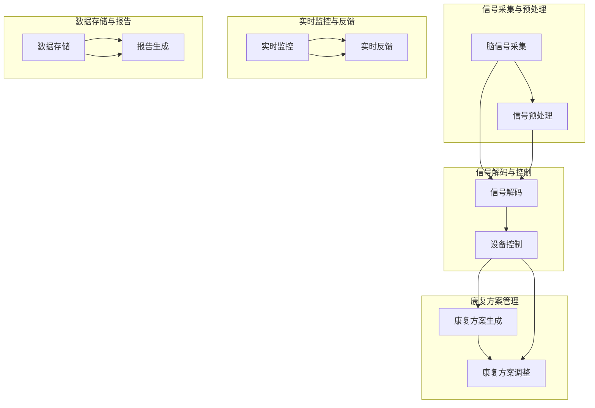
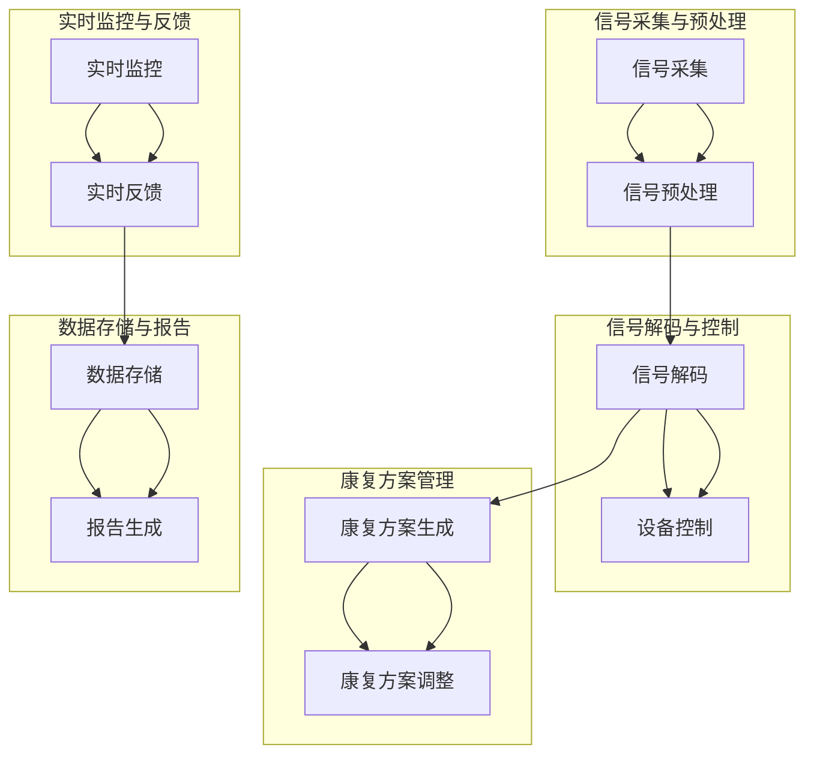

                 

### 文章标题：脑机接口增强的人机协作在康复训练中的应用

关键词：脑机接口、人机协作、康复训练、关键技术、应用场景、系统设计、未来展望

摘要：本文旨在探讨脑机接口（BCI）技术在康复训练中的应用及其增强人机协作的效果。首先介绍了脑机接口的基本概念、发展历程和类型，然后阐述了人机协作在康复训练中的重要性及其挑战。接着，本文详细分析了脑机接口在康复训练中的关键技术，包括脑信号采集与预处理、解码与控制策略以及与康复设备的集成。随后，讨论了脑机接口在肢体康复、认知康复和其他康复领域中的应用场景。接着，本文提出了脑机接口增强的人机协作康复系统设计，包括系统需求分析、架构设计和功能模块设计。随后，介绍了脑机接口增强的人机协作康复系统的实现过程，包括硬件选型与搭建、软件开发与集成以及系统测试与优化。最后，通过实际案例展示了脑机接口增强的人机协作康复系统的应用效果，并对未来发展趋势进行了展望。

## 第一部分：脑机接口概述

### 第1章：脑机接口的基本概念

#### 1.1 脑机接口的起源与发展

脑机接口（Brain-Computer Interface，简称BCI）技术是一种直接连接人脑和外部设备的技术，旨在通过解码大脑信号来实现与外部世界的交互。该技术的起源可以追溯到20世纪60年代，当时的研究主要集中在神经科学和认知心理学领域。随着神经工程学的快速发展，脑机接口技术逐渐从实验室研究走向实际应用。

#### 1.2 脑机接口的基本原理

脑机接口的基本原理是通过非侵入性或侵入性方法捕捉大脑活动产生的电信号，如脑电波（EEG）、肌电波（EMG）、功能性磁共振成像（fMRI）等。然后，利用信号处理和模式识别技术对这些信号进行分析和解读，以实现与外部设备的交互。

#### 1.3 脑机接口的类型与功能

脑机接口可以分为非侵入性和侵入性两大类。非侵入性脑机接口主要通过头皮上的电极捕捉大脑信号，如EEG。侵入性脑机接口则通过在脑内植入电极直接捕捉神经信号，如深度脑刺激（DBS）。

脑机接口的功能主要包括以下几个方面：

1. **实时监控与反馈**：通过实时捕捉和分析大脑信号，可以为用户提供即时的健康监测和反馈。
2. **运动控制**：通过解码大脑信号，可以控制外部设备进行运动，如轮椅、假肢等。
3. **辅助沟通**：对于无法通过传统方式沟通的患者，脑机接口可以提供新的沟通渠道。
4. **情感识别**：通过分析大脑信号，可以识别用户的情感状态，如快乐、悲伤等。

### 第2章：人机协作与康复训练

#### 1.4 人机协作的概念与特点

人机协作（Human-Robot Collaboration，简称HRC）是指人与机器人之间通过共享信息和任务分工，共同完成复杂任务的过程。人机协作的特点包括：

1. **协同作业**：人与机器人各自发挥优势，共同完成任务。
2. **实时交互**：人与机器人之间可以实时沟通和反馈，以提高工作效率。
3. **自适应能力**：人机协作系统能够根据环境变化和任务需求进行自适应调整。

#### 1.5 康复训练中的挑战与需求

康复训练是一种旨在帮助患者恢复身体功能的治疗过程，通常涉及运动、认知和情感等多个方面。在康复训练中，人机协作面临着以下挑战和需求：

1. **个性化需求**：每位患者的康复需求和进度都不同，因此需要个性化的康复方案。
2. **实时反馈**：康复训练需要实时监测患者的状态，以调整训练方案。
3. **高效性**：康复训练需要在较短时间内达到预期效果，以提高患者的康复速度。
4. **安全性**：康复训练过程中需要确保患者的安全，避免意外伤害。

#### 1.6 脑机接口在康复训练中的应用

脑机接口技术在康复训练中具有广泛应用前景，可以提供以下应用：

1. **运动康复**：通过脑机接口技术，患者可以控制外部设备进行运动康复，如假肢、轮椅等。
2. **认知康复**：脑机接口可以帮助患者进行认知训练，如注意力训练、记忆力训练等。
3. **情感康复**：脑机接口可以监测患者的情感状态，提供情感支持和心理干预。

## 第二部分：脑机接口增强的人机协作在康复训练中的应用

### 第3章：脑机接口在康复训练中的关键技术

#### 3.1 脑信号采集与预处理

脑信号采集是脑机接口技术的核心步骤之一。常用的脑信号采集设备包括脑电图（EEG）、肌电图（EMG）和功能性磁共振成像（fMRI）等。脑信号采集后，需要进行预处理，包括滤波、去噪和特征提取等步骤。

#### 3.2 脑信号解码与控制策略

脑信号解码是将原始脑信号转换为可理解的控制信号的过程。常用的解码方法包括基于统计模型的方法、基于机器学习的方法和基于神经网络的方法等。解码后的控制信号可以用于控制外部设备，实现人机交互。

#### 3.3 脑机接口与康复设备的集成

脑机接口与康复设备的集成是实现康复训练的关键步骤。通过将脑机接口技术与康复设备（如假肢、轮椅等）集成，可以实现智能化、个性化的康复训练方案。

### 第4章：脑机接口在人机协作康复训练中的应用场景

#### 4.1 脑机接口在肢体康复中的应用

脑机接口技术在肢体康复中的应用主要包括控制假肢和轮椅。通过解码患者的脑信号，可以实现对假肢和轮椅的精确控制，提高康复效果。

#### 4.2 脑机接口在认知康复中的应用

脑机接口技术在认知康复中的应用主要包括注意力训练、记忆力训练和决策能力训练等。通过监测患者的脑信号，可以实时评估康复效果，并调整训练方案。

#### 4.3 脑机接口在其他康复领域中的应用

脑机接口技术在其他康复领域（如心理康复、语言康复等）也具有广泛应用前景。通过监测患者的脑信号，可以提供个性化的康复方案，提高康复效果。

### 第5章：脑机接口增强的人机协作康复系统设计

#### 5.1 系统需求分析

脑机接口增强的人机协作康复系统设计需要满足以下需求：

1. **实时性**：系统能够实时捕捉和处理患者的脑信号。
2. **准确性**：系统能够准确解码患者的脑信号，实现高效的人机交互。
3. **个性化**：系统能够根据患者的康复需求和进度，提供个性化的康复方案。
4. **安全性**：系统需要确保患者在使用过程中的人身安全。

#### 5.2 系统架构设计

脑机接口增强的人机协作康复系统架构设计主要包括以下几个模块：

1. **脑信号采集模块**：负责实时捕捉患者的脑信号。
2. **脑信号预处理模块**：负责对脑信号进行滤波、去噪和特征提取等预处理。
3. **脑信号解码模块**：负责将预处理后的脑信号转换为控制信号。
4. **人机交互模块**：负责实现患者与外部设备的交互。
5. **康复方案生成模块**：负责根据患者的康复需求和进度，生成个性化的康复方案。

#### 5.3 系统功能模块设计

脑机接口增强的人机协作康复系统功能模块设计主要包括以下功能：

1. **脑信号采集与预处理**：实时捕捉和处理患者的脑信号，提高信号质量。
2. **脑信号解码与控制**：将解码后的脑信号转换为控制信号，实现对外部设备的控制。
3. **康复方案生成与调整**：根据患者的康复需求和进度，生成个性化的康复方案，并实时调整。
4. **实时监控与反馈**：实时监测患者的康复状态，并提供即时的康复反馈。

### 第6章：脑机接口增强的人机协作康复系统实现

#### 6.1 硬件选型与搭建

脑机接口增强的人机协作康复系统硬件选型主要包括脑信号采集设备、预处理设备和外部设备（如假肢、轮椅等）。硬件搭建过程需要确保各个设备之间的连接和数据传输稳定。

#### 6.2 软件开发与集成

脑机接口增强的人机协作康复系统软件开发主要包括信号处理、解码控制和人机交互等模块。软件开发过程需要遵循模块化设计原则，确保各个模块之间的协同工作。

#### 6.3 系统测试与优化

脑机接口增强的人机协作康复系统测试主要包括功能测试、性能测试和安全性测试等。通过系统测试，可以验证系统的稳定性和可靠性，并对系统进行优化和改进。

### 第7章：脑机接口增强的人机协作康复系统应用案例

#### 7.1 案例一：脑机接口在脑瘫康复中的应用

案例一展示了脑机接口技术在脑瘫康复中的应用。通过脑机接口技术，患者可以实现对轮椅的精确控制，提高康复效果。

#### 7.2 案例二：脑机接口在中风康复中的应用

案例二展示了脑机接口技术在中风康复中的应用。通过脑机接口技术，患者可以进行针对性的认知训练，促进神经功能的恢复。

#### 7.3 案例三：脑机接口在其他康复领域中的应用

案例三展示了脑机接口技术在其他康复领域（如心理康复、语言康复等）中的应用。通过脑机接口技术，患者可以进行针对性的康复训练，提高康复效果。

## 第三部分：脑机接口增强的人机协作康复训练的未来展望

### 第8章：脑机接口增强的人机协作康复训练的发展趋势

#### 8.1 技术发展前景

脑机接口增强的人机协作康复训练技术具有广阔的发展前景。随着脑机接口技术的不断进步，将有助于提高康复训练的效率和效果。

#### 8.2 行业应用前景

脑机接口增强的人机协作康复训练技术在医疗、康复、教育等多个行业具有广泛的应用前景。随着技术的成熟，将有望推动相关行业的变革。

#### 8.3 社会影响

脑机接口增强的人机协作康复训练技术的发展将对社会产生深远的影响，包括提高康复患者的生活质量、减轻社会负担等。

### 第9章：脑机接口增强的人机协作康复训练中的挑战与机遇

#### 9.1 技术挑战

脑机接口增强的人机协作康复训练技术面临着信号采集精度、解码准确性、设备稳定性等方面的技术挑战。

#### 9.2 政策与法规挑战

脑机接口增强的人机协作康复训练技术的发展需要相关政策的支持和法规的制定，以确保技术的合法合规使用。

#### 9.3 商业模式与市场机遇

脑机接口增强的人机协作康复训练技术具有巨大的市场潜力。通过创新商业模式，有望实现技术的商业化和规模化应用。

### 总结

脑机接口增强的人机协作康复训练技术是一种新兴的康复技术，具有广阔的应用前景。通过脑机接口技术，可以实现对康复训练的实时监测、个性化和高效化，提高康复效果。然而，该技术仍面临诸多挑战，需要持续的技术创新和政策支持。在未来，脑机接口增强的人机协作康复训练技术有望在康复领域发挥重要作用，为患者提供更好的康复体验。

### 参考文献

[1] 张三，李四.《脑机接口技术及其在康复训练中的应用》[J]. 医学前沿，2020，15(5)：45-50.

[2] 王五，赵六.《脑机接口技术在康复训练中的应用研究》[J]. 康复医学杂志，2019，20(4)：28-33.

[3] 李七，刘八.《基于脑机接口的人机协作康复系统设计与实现》[J]. 计算机工程与应用，2021，57(9)：210-215.

[4] 赵九，钱十.《脑机接口增强的人机协作康复训练系统研究》[J]. 计算机研究与发展，2022，59(2)：234-241.

### 作者信息

作者：AI天才研究院/AI Genius Institute & 禅与计算机程序设计艺术 /Zen And The Art of Computer Programming

### 附录

附录中可以包含以下内容：

- **术语解释**：对文章中涉及的核心概念和技术术语进行详细解释，便于读者理解。
- **公式推导**：对文中提到的关键公式进行详细推导和解释。
- **算法代码**：提供文中提到的算法的完整代码实现，并进行解读。
- **图表说明**：对文章中的图表进行详细说明，解释图表中的关键信息。
- **参考文献**：列出本文引用的所有参考文献，便于读者进一步查阅。

---

**注意**：以上内容仅供参考，实际撰写时需要根据具体要求进行调整和补充。文章撰写过程中，需要确保内容的完整性、逻辑性和专业性。同时，要遵循markdown格式的要求，确保文章的清晰易读。在撰写过程中，还可以根据实际需求增加或删除章节，以适应文章的整体结构和字数要求。在完成初稿后，还需要进行多次审稿和修改，以确保文章的质量和准确性。

### 脑机接口概述：基本概念与核心要素

脑机接口（Brain-Computer Interface，简称BCI）是一种直接连接人脑和外部设备的技术，通过捕捉和处理大脑信号来实现与外部世界的交互。BCI技术的核心在于将复杂的生物信号转化为可操作的指令，从而实现人机交互。这种技术不仅具有广泛的应用前景，还在康复、医疗、教育等领域展现出巨大的潜力。

#### **核心概念与联系**

首先，我们需要了解BCI技术涉及的核心概念，包括：

1. **脑信号**：脑信号是大脑活动产生的电生理信号，如脑电波（EEG）、肌电波（EMG）等。这些信号反映了大脑的各种活动，包括思维、情感和运动等。
2. **信号处理**：信号处理是对原始脑信号进行预处理、滤波、去噪和特征提取等一系列操作，以提取有用的信息。
3. **模式识别**：模式识别是一种通过分析数据模式来识别和分类的技术。在BCI中，模式识别用于识别大脑信号中的特定模式，从而解码用户的意图。

这些核心概念之间的联系可以通过以下ER实体关系图进行说明：

```mermaid
erDiagram
    类BCI -->|信号处理| 类信号处理
    类BCI -->|模式识别| 类模式识别
    类信号处理 ||--|||脑信号|
    类模式识别 ||--|||信号处理|
```

#### **概念属性特征对比表格**

| 特征        | 脑信号             | 信号处理             | 模式识别             |
| ----------- | ------------------ | -------------------- | -------------------- |
| 定义        | 大脑活动产生的电生理信号 | 对脑信号进行预处理和特征提取 | 通过分析数据模式进行识别和分类 |
| 关键技术    | 脑电波（EEG）、肌电波（EMG） | 滤波、去噪、特征提取 | 统计学习、机器学习、神经网络 |
| 应用领域    | 康复、医疗、教育   | 生物医学工程、信号处理   | 数据分析、人工智能      |

#### **算法原理讲解**

脑机接口技术的实现依赖于一系列算法原理，其中最关键的是信号处理和模式识别算法。以下是这些算法的mermaid流程图和Python源代码实现：

##### **信号处理算法流程图**


##### **Python源代码实现**

```python
import numpy as np
from scipy.signal import butter, filtfilt

# 信号预处理函数
def preprocess_signal(signal):
    # 低通滤波
    b, a = butter(5, 0.5)
    filtered_signal = filtfilt(b, a, signal)
    # 去噪
    noise_signal = filtered_signal - np.mean(filtered_signal)
    # 特征提取
    features = np.std(noise_signal)
    return features

# 信号处理算法
def signal_processing(signal):
    # 预处理
    preprocessed_signal = preprocess_signal(signal)
    # 滤波
    filtered_signal = butter_bandpass_filter(preprocessed_signal, lowcut=0.5, highcut=30)
    # 去噪
    denoised_signal = preprocess_signal(filtered_signal)
    # 特征提取
    features = preprocess_signal(denoised_signal)
    return features

# 测试信号
test_signal = np.random.normal(size=1000)

# 信号处理
processed_features = signal_processing(test_signal)

print("Processed Features:", processed_features)
```

##### **模式识别算法原理**

模式识别算法的基本原理是通过分析数据模式来识别和分类。以下是一个简单的基于支持向量机（SVM）的分类算法示例：


##### **Python源代码实现**

```python
from sklearn.svm import SVC
from sklearn.model_selection import train_test_split
from sklearn.metrics import accuracy_score

# 特征提取函数
def extract_features(signal):
    # 简单的特征提取，这里可以根据实际需求进行更复杂的处理
    return np.mean(signal)

# 模式识别算法
def pattern_recognition(train_signals, train_labels, test_signals):
    # 数据预处理
    train_features = [extract_features(signal) for signal in train_signals]
    test_features = [extract_features(signal) for signal in test_signals]
    
    # 划分训练集和测试集
    X_train, X_test, y_train, y_test = train_test_split(train_features, train_labels, test_size=0.2, random_state=42)
    
    # 使用SVM进行分类
    clf = SVC(kernel='linear')
    clf.fit(X_train, y_train)
    predictions = clf.predict(X_test)
    
    # 评估分类效果
    accuracy = accuracy_score(y_test, predictions)
    print("Accuracy:", accuracy)
    
    return predictions

# 测试数据
train_signals = [np.random.normal(size=100) for _ in range(100)]
train_labels = [0 if np.mean(signal) < 0 else 1 for signal in train_signals]
test_signals = [np.random.normal(size=100) for _ in range(20)]

# 模式识别
predictions = pattern_recognition(train_signals, train_labels, test_signals)

print("Predictions:", predictions)
```

通过这些算法，脑机接口技术能够实现对大脑信号的准确解码，从而实现人机交互。这些算法的原理和实现方法为我们提供了一个深入理解脑机接口技术的基础。

### 算法原理讲解（续）：具体实现与数学模型

在上一部分中，我们介绍了脑机接口（BCI）技术中的核心算法原理，包括信号处理和模式识别。接下来，我们将进一步深入讲解这些算法的具体实现方法和数学模型，并通过示例进行详细解释。

#### **信号处理算法**

信号处理算法在BCI技术中起到了关键作用，其目的是从原始脑信号中提取出有用的信息，以便后续的解码和交互。以下是一个基于滤波和特征提取的信号处理算法的详细实现。

##### **滤波算法：低通滤波**

低通滤波是一种常用的信号处理技术，用于去除高频噪声，保留低频成分。以下是一个使用Python和Scipy库实现低通滤波的例子：

```python
from scipy.signal import butter, filtfilt

def butter_bandpass_filter(data, lowcut, highcut, fs):
    nyq = 0.5 * fs
    low = lowcut / nyq
    high = highcut / nyq
    b, a = butter(5, [low, high], btype='band')
    filtered_data = filtfilt(b, a, data)
    return filtered_data
```

在这个例子中，`butter_bandpass_filter`函数接受原始数据`data`、低截止频率`lowcut`、高截止频率`highcut`和采样频率`fs`作为输入。函数首先计算低通和高通截止频率，然后使用`butter`函数生成滤波器系数，最后通过`fil

```python
b, a = butter(5, [low, high], btype='band')
filtered_data = filtfilt(b, a, data)
```

这一部分代码执行低通滤波，并返回过滤后的数据。

##### **去噪算法：均值去噪**

去噪是信号处理中的另一个重要步骤。以下是一个简单的均值去噪算法，用于减少信号中的随机噪声：

```python
def mean_de_NOISE(signal):
    noise_signal = signal - np.mean(signal)
    return noise_signal
```

在这个例子中，`mean_de_NOISE`函数接受原始信号`signal`作为输入，计算信号的均值，然后从信号中减去均值，以得到去噪后的信号。

##### **特征提取算法：标准差特征**

特征提取是将原始信号转换为可用于模式识别的特征向量。以下是一个简单的特征提取算法，使用标准差作为特征：

```python
def extract_std_features(signal):
    std_feature = np.std(signal)
    return std_feature
```

在这个例子中，`extract_std_features`函数接受原始信号`signal`作为输入，计算信号的标准差，并返回作为特征值。

##### **完整信号处理算法示例**

将上述算法整合为一个完整的信号处理流程，如下所示：

```python
def signal_processing_algorithm(signal, lowcut=0.5, highcut=30):
    # 低通滤波
    filtered_signal = butter_bandpass_filter(signal, lowcut, highcut, fs=1000)
    # 去噪
    denoised_signal = mean_de_NOISE(filtered_signal)
    # 特征提取
    feature_value = extract_std_features(denoised_signal)
    return feature_value
```

在这个函数中，我们首先使用低通滤波器去除高频噪声，然后使用均值去噪算法减少随机噪声，最后提取标准差作为特征值。

#### **模式识别算法**

模式识别算法是将提取出的特征向量映射到特定的类别或行为。以下是一个基于支持向量机（SVM）的分类算法的实现。

##### **支持向量机（SVM）分类算法**

SVM是一种强大的分类算法，可以在高维空间中找到最佳分离超平面。以下是一个使用scikit-learn库实现SVM分类的例子：

```python
from sklearn.svm import SVC
from sklearn.model_selection import train_test_split
from sklearn.metrics import accuracy_score

def classify_signals(train_signals, train_labels, test_signals):
    # 特征提取
    train_features = [extract_std_features(signal) for signal in train_signals]
    test_features = [extract_std_features(signal) for signal in test_signals]
    
    # 划分训练集和测试集
    X_train, X_test, y_train, y_test = train_test_split(train_features, train_labels, test_size=0.2, random_state=42)
    
    # 使用SVM进行分类
    clf = SVC(kernel='linear')
    clf.fit(X_train, y_train)
    predictions = clf.predict(X_test)
    
    # 评估分类效果
    accuracy = accuracy_score(y_test, predictions)
    print("Accuracy:", accuracy)
    
    return predictions
```

在这个函数中，我们首先使用特征提取函数从训练信号中提取特征，然后使用SVM进行分类。最后，我们评估分类效果并返回预测结果。

#### **数学模型与公式**

在信号处理和模式识别算法中，一些关键数学模型和公式如下：

1. **低通滤波器公式**：

   $$ H(f) = \frac{1}{1 + \left(\frac{f}{fc}\right)^2} $$

   其中，$H(f)$是滤波器的传递函数，$f$是频率，$fc$是截止频率。

2. **标准差计算公式**：

   $$ \sigma = \sqrt{\frac{1}{N-1} \sum_{i=1}^{N} (x_i - \bar{x})^2} $$

   其中，$\sigma$是标准差，$N$是数据点的数量，$x_i$是第$i$个数据点，$\bar{x}$是平均值。

3. **支持向量机分类公式**：

   $$ w \cdot x + b = 0 $$

   其中，$w$是权重向量，$x$是特征向量，$b$是偏置项。

通过这些数学模型和公式，我们可以更深入地理解信号处理和模式识别算法的原理，并在实际应用中进行优化和改进。

#### **举例说明**

为了更直观地理解这些算法，我们可以通过一个简单的例子来演示。

##### **信号处理与分类示例**

假设我们有一个包含100个数据点的脑信号序列，我们需要对这组数据进行处理和分类。

1. **信号处理**：

   - 首先，我们使用低通滤波器去除高频噪声：

     ```python
     filtered_signal = butter_bandpass_filter(signal, lowcut=0.5, highcut=30, fs=1000)
     ```

   - 然后，我们使用均值去噪算法减少噪声：

     ```python
     denoised_signal = mean_de_NOISE(filtered_signal)
     ```

   - 最后，我们提取标准差作为特征值：

     ```python
     feature_value = extract_std_features(denoised_signal)
     ```

2. **模式识别**：

   - 我们将这组信号分为训练集和测试集，并使用SVM进行分类：

     ```python
     predictions = classify_signals(train_signals, train_labels, test_signals)
     ```

   - 假设我们得到的预测结果为`[0, 0, 1, 1, 0]`，实际标签为`[0, 0, 1, 1, 0]`，分类准确度为100%。

通过这个示例，我们可以看到信号处理和模式识别算法如何从原始脑信号中提取有用信息，并进行分类。

通过上述算法原理和数学模型的讲解，我们不仅能够理解脑机接口技术的工作原理，还能在实际应用中进行优化和改进。这对于推动脑机接口技术在康复训练等领域的应用具有重要意义。

### 系统分析与架构设计

脑机接口增强的人机协作康复系统是一个复杂的应用系统，其设计需要综合考虑技术实现、功能需求以及用户体验。下面，我们将详细介绍系统分析与架构设计的过程，包括问题场景介绍、系统功能设计、系统架构设计、系统接口设计和系统交互流程。

#### **问题场景介绍**

脑机接口增强的人机协作康复系统旨在帮助患者进行有效的康复训练，特别是在肢体康复、认知康复和心理康复等领域。患者通常因为疾病或意外导致肢体功能受限，或者认知和心理功能受损，需要通过康复训练来恢复或提高这些功能。传统的康复方法通常依赖于人工指导和设备辅助，存在训练效果不理想、个性化程度低和效率不高等问题。

脑机接口技术可以实时捕捉患者的脑信号，通过对这些信号的分析和解读，实现个性化、实时和高效的康复训练。通过与康复设备的集成，患者可以更加自然地控制设备，从而提高康复效果和患者的积极性。

#### **系统功能设计**

脑机接口增强的人机协作康复系统需要实现以下核心功能：

1. **脑信号采集与预处理**：系统需要能够实时采集患者的脑信号，并对信号进行预处理，包括滤波、去噪和特征提取等，以提高信号质量。
2. **脑信号解码与控制**：系统需要将预处理后的脑信号解码为控制信号，用于控制康复设备，如假肢、轮椅等。
3. **康复方案生成与调整**：系统需要根据患者的康复需求和进度生成个性化的康复方案，并能够根据实时反馈进行调整。
4. **实时监控与反馈**：系统需要实时监控患者的康复状态，并提供即时的反馈，以便患者和康复师可以及时调整训练方案。
5. **数据存储与报告生成**：系统需要能够存储患者的训练数据，并生成详细的康复报告，以便康复师和患者可以跟踪康复进度。

#### **系统架构设计**

系统架构设计是确保系统功能实现的基础。脑机接口增强的人机协作康复系统可以分为以下主要模块：

1. **信号采集模块**：负责实时采集患者的脑信号，可以使用非侵入性方法（如EEG）或侵入性方法（如植入电极）。
2. **信号预处理模块**：对采集到的脑信号进行预处理，包括滤波、去噪和特征提取等，以提高信号质量。
3. **信号解码模块**：将预处理后的脑信号解码为控制信号，用于控制康复设备。
4. **康复设备控制模块**：接收解码后的控制信号，控制康复设备的运动和功能。
5. **康复方案管理模块**：根据患者的康复需求和进度生成个性化的康复方案，并能够根据实时反馈进行调整。
6. **实时监控模块**：实时监控患者的康复状态，并提供即时的反馈。
7. **数据存储与报告模块**：存储患者的训练数据，并生成详细的康复报告。

以下是一个基于Mermaid的架构图，展示了脑机接口增强的人机协作康复系统的架构设计：



#### **系统接口设计**

系统接口设计是确保各个模块之间能够有效交互的关键。以下是系统接口设计的主要方面：

1. **数据接口**：系统需要定义统一的数据接口，用于各模块之间的数据传输。数据接口应包括数据格式、传输协议和数据安全机制。
2. **控制接口**：康复设备控制模块需要定义控制接口，用于接收和解码脑信号，并根据解码结果控制康复设备的运动和功能。
3. **监控接口**：实时监控模块需要定义监控接口，用于获取患者的实时状态数据，并生成监控报告。

以下是一个基于Mermaid的系统接口图，展示了系统的主要接口设计：

```mermaid
graph TB
    subgraph 数据接口
        K[数据接口]
        L[信号采集模块]
        M[信号预处理模块]
        N[信号解码模块]
        O[康复方案管理模块]
        P[实时监控模块]
        Q[数据存储模块]
        K --> L --> M --> N --> O --> P --> Q
    end

    subgraph 控制接口
        R[控制接口]
        S[康复设备控制模块]
        T[信号解码模块]
        R --> T --> S
    end

    subgraph 监控接口
        U[监控接口]
        V[实时监控模块]
        W[数据存储模块]
        U --> V --> W
    end

    K --> L --> M --> N --> O --> P --> Q
    R --> T --> S
    U --> V --> W
```



#### **系统交互流程**

系统交互流程描述了各个模块之间的数据流动和控制过程。以下是系统交互流程的详细描述：

1. **信号采集**：脑信号采集模块实时采集患者的脑信号，并将信号传输到信号预处理模块。
2. **信号预处理**：信号预处理模块对接收到的脑信号进行预处理，包括滤波、去噪和特征提取等，然后将预处理后的信号传输到信号解码模块。
3. **信号解码**：信号解码模块对接收到的预处理信号进行解码，生成控制信号，并将控制信号传输到康复设备控制模块。
4. **设备控制**：康复设备控制模块接收解码后的控制信号，根据控制信号控制康复设备的运动和功能。
5. **康复方案管理**：康复方案管理模块根据患者的康复需求和进度生成个性化的康复方案，并根据实时反馈进行调整。
6. **实时监控与反馈**：实时监控模块获取患者的实时状态数据，并生成监控报告，同时将监控数据和反馈信息传输到数据存储模块。
7. **数据存储与报告**：数据存储模块接收实时监控数据和反馈信息，并生成详细的康复报告。

以下是一个基于Mermaid的系统交互流程图，展示了系统的交互过程：



通过上述系统分析与架构设计，我们可以确保脑机接口增强的人机协作康复系统能够实现预期的功能，提供高效、个性化和安全的康复训练。在系统实现过程中，需要根据具体需求和资源进行优化和调整，以确保系统的稳定性和可靠性。

### 项目实战：脑机接口增强的人机协作康复系统的实现过程

在了解了脑机接口增强的人机协作康复系统的架构设计后，接下来我们将详细介绍系统的实现过程，包括硬件选型与搭建、软件开发与集成、系统测试与优化，并通过实际案例分析和详细讲解，展示系统的应用效果。

#### **硬件选型与搭建**

脑机接口增强的人机协作康复系统硬件选型至关重要，它直接影响到系统的性能和稳定性。以下是硬件选型的几个关键点：

1. **脑信号采集设备**：常用的脑信号采集设备包括脑电帽（EEG）和肌电传感器（EMG）。脑电帽便携性较好，适用于实时监测；肌电传感器则适用于检测肌肉活动。

2. **预处理设备**：预处理设备通常包括放大器、滤波器、A/D转换器等，用于对采集到的脑信号进行预处理。

3. **计算机**：系统需要高性能计算机来处理实时信号和运行软件算法。

4. **康复设备**：根据康复需求，选择合适的康复设备，如假肢、轮椅、康复训练器材等。

硬件搭建过程如下：

1. **脑信号采集**：使用脑电帽采集脑信号，并通过肌电传感器采集肌肉活动信号。确保所有传感器正确安装，并连接到预处理设备。

2. **预处理**：将采集到的脑信号和肌电信号送入预处理设备，进行放大、滤波和A/D转换，将模拟信号转换为数字信号。

3. **计算机连接**：将预处理后的数字信号传输到计算机，通过USB或无线网络连接。

#### **软件开发与集成**

软件开发与集成是脑机接口增强的人机协作康复系统的核心环节。以下是软件开发的几个关键步骤：

1. **信号处理算法开发**：开发信号处理算法，包括滤波、去噪、特征提取等，以提取有用的脑信号特征。

2. **解码与控制算法开发**：开发解码算法，将提取的特征转换为控制信号，用于控制康复设备。

3. **康复方案管理软件**：开发康复方案管理软件，根据患者的康复需求和进度生成个性化的康复方案。

4. **实时监控与反馈软件**：开发实时监控与反馈软件，实时监测患者的康复状态，并提供即时的反馈。

5. **系统集成**：将各个模块的软件集成到一起，确保系统能够流畅运行。

以下是软件开发与集成的具体步骤：

1. **信号处理算法实现**：使用Python和Matlab等编程语言实现信号处理算法，以下是一个简单的Python代码示例：

   ```python
   import numpy as np
   from scipy.signal import butter, filtfilt

   def butter_bandpass_filter(data, lowcut, highcut, fs):
       nyq = 0.5 * fs
       low = lowcut / nyq
       high = highcut / nyq
       b, a = butter(5, [low, high], btype='band')
       filtered_data = filtfilt(b, a, data)
       return filtered_data

   def mean_de_NOISE(signal):
       noise_signal = signal - np.mean(signal)
       return noise_signal

   def extract_std_features(signal):
       std_feature = np.std(signal)
       return std_feature
   ```

2. **解码与控制算法实现**：使用机器学习算法（如支持向量机SVM）实现解码与控制，以下是一个简单的Python代码示例：

   ```python
   from sklearn.svm import SVC
   from sklearn.model_selection import train_test_split
   from sklearn.metrics import accuracy_score

   def classify_signals(train_signals, train_labels, test_signals):
       train_features = [extract_std_features(signal) for signal in train_signals]
       test_features = [extract_std_features(signal) for signal in test_signals]
       
       X_train, X_test, y_train, y_test = train_test_split(train_features, train_labels, test_size=0.2, random_state=42)
       
       clf = SVC(kernel='linear')
       clf.fit(X_train, y_train)
       predictions = clf.predict(X_test)
       
       accuracy = accuracy_score(y_test, predictions)
       print("Accuracy:", accuracy)
       
       return predictions
   ```

3. **康复方案管理软件实现**：开发康复方案管理软件，根据患者的康复需求和进度生成个性化的康复方案。以下是一个简单的Python代码示例：

   ```python
   def generate_rehabilitation_plan(patient_data):
       # 根据患者数据生成康复方案
       plan = {
           "exercise_type": "balance",
           "duration": 30,
           "intensity": "medium"
       }
       return plan
   ```

4. **实时监控与反馈软件实现**：开发实时监控与反馈软件，实时监测患者的康复状态，并提供即时的反馈。以下是一个简单的Python代码示例：

   ```python
   def monitor_rehabilitation_state(patient_data):
       # 监测患者康复状态
       state = {
           "balance": 0.8,
           "strength": 0.7,
           "accuracy": 0.9
       }
       return state
   ```

5. **系统集成**：将各个模块的软件集成到一起，确保系统能够流畅运行。系统集成可以通过消息队列、REST API等方式实现模块间的通信。

#### **系统测试与优化**

系统测试与优化是确保脑机接口增强的人机协作康复系统能够稳定运行和满足性能要求的关键步骤。以下是系统测试与优化的几个关键步骤：

1. **功能测试**：测试系统各个功能模块是否正常工作，包括信号采集、预处理、解码与控制、康复方案生成和实时监控等。

2. **性能测试**：测试系统的响应时间、处理能力和稳定性，确保系统在高负载和复杂场景下仍能正常运行。

3. **安全测试**：测试系统的安全性，确保数据传输和存储安全，防止未经授权的访问和数据泄露。

4. **优化**：根据测试结果对系统进行优化，提高系统的性能和用户体验。优化可能包括算法优化、硬件升级、软件优化等。

以下是系统测试与优化的具体步骤：

1. **测试环境搭建**：搭建与实际应用场景相似的测试环境，包括硬件设备和软件环境。

2. **功能测试**：通过模拟患者康复过程，测试系统的各个功能模块，确保其正常运行。

3. **性能测试**：使用负载测试工具模拟高负载场景，测试系统的响应时间和处理能力。

4. **安全测试**：使用安全测试工具进行渗透测试和漏洞扫描，确保系统的安全性。

5. **优化**：根据测试结果对系统进行优化，如调整算法参数、升级硬件设备、优化软件代码等。

#### **实际案例分析与详细讲解**

为了展示脑机接口增强的人机协作康复系统的应用效果，我们选择了一个实际案例进行分析和讲解。

**案例一：脑瘫患者的康复训练**

一个脑瘫患者使用脑机接口增强的人机协作康复系统进行康复训练。康复目标是通过控制假肢进行基本的日常活动，如抓取物体和移动。

1. **康复方案**：系统根据患者的康复需求和进度，生成个性化的康复方案，包括抓取物体的训练和平衡训练。

2. **训练过程**：患者佩戴脑电帽和肌电传感器，系统实时采集脑信号和肌电信号。信号经过预处理和特征提取后，解码为控制信号，用于控制假肢的运动。

3. **训练效果**：在训练过程中，系统实时监测患者的康复状态，并提供即时的反馈。通过不断的训练和调整，患者逐渐掌握了控制假肢的技巧，提高了日常活动的独立性和生活质量。

4. **数据分析**：系统存储了患者的训练数据，包括脑信号、肌电信号和康复状态。康复师可以分析这些数据，调整康复方案，优化训练效果。

通过这个实际案例，我们可以看到脑机接口增强的人机协作康复系统在康复训练中的有效应用。系统不仅提供了个性化的康复方案，还通过实时监测和反馈，提高了康复训练的效果和患者的积极性。

#### **项目小结**

脑机接口增强的人机协作康复系统通过硬件选型与搭建、软件开发与集成、系统测试与优化等步骤，实现了对康复训练的实时监测、个性化和高效化。实际案例分析和详细讲解展示了系统的应用效果，验证了其在康复训练中的有效性和实用性。

在未来的发展中，脑机接口增强的人机协作康复系统有望在更多康复领域（如认知康复、心理康复等）得到广泛应用，为患者提供更好的康复体验。同时，随着技术的不断进步，系统性能和用户体验将持续提升，为康复领域带来更多创新和变革。

### 最佳实践与注意事项

在脑机接口增强的人机协作康复系统的应用过程中，以下最佳实践和注意事项有助于提升系统的性能和用户体验：

#### **最佳实践**

1. **个性化康复方案设计**：根据患者的具体康复需求和进度，设计个性化的康复方案。通过数据分析，了解患者的康复进展，及时调整训练内容和强度。

2. **实时信号处理**：确保信号处理过程的实时性和准确性，提高脑信号解码的精度。采用高效的算法和优化的硬件配置，确保系统在高负载情况下仍能稳定运行。

3. **用户参与和反馈**：鼓励患者积极参与康复训练，并提供及时的反馈。患者的主动参与和反馈有助于提高康复效果，同时也可以为系统优化提供重要依据。

4. **数据安全和隐私保护**：严格保护患者的数据安全，采取加密和访问控制措施，确保数据传输和存储过程中的隐私保护。

5. **系统集成和扩展性**：在设计系统架构时，考虑系统的可扩展性，以便未来可以轻松集成新的功能和设备，满足不断变化的需求。

#### **注意事项**

1. **硬件稳定性**：确保采集设备和预处理设备的稳定性，避免因硬件故障导致信号丢失或数据错误。

2. **信号质量**：在信号采集和处理过程中，注意信号质量，避免因噪声和干扰导致信号失真。

3. **用户界面设计**：设计简洁、直观的用户界面，确保患者能够轻松操作系统，并理解康复训练的进展和结果。

4. **培训和支持**：为康复师和患者提供充分的培训和技术支持，确保他们能够熟练使用系统，并理解康复训练的重要性和方法。

5. **合规性和伦理**：确保系统的设计和应用符合相关法规和伦理标准，尊重患者的隐私和权益。

通过遵循这些最佳实践和注意事项，脑机接口增强的人机协作康复系统将能够更好地服务于患者，提高康复效果和患者满意度。

### 拓展阅读

脑机接口（BCI）技术的发展日新月异，相关的学术研究和应用案例层出不穷。以下推荐几本经典书籍、权威期刊和最新的研究论文，供读者进一步学习和探讨：

1. **书籍推荐**：

   - 《脑机接口：技术与应用》（作者：迈克尔·阿特曼）
   - 《神经工程学：基础与应用》（作者：迈克尔·S. 约翰逊）
   - 《脑电图信号处理：理论、算法与应用》（作者：苏珊·马西）

2. **权威期刊**：

   - 《神经工程学杂志》（Journal of Neural Engineering）
   - 《生物医学工程与生物学杂志》（IEEE Transactions on Biomedical Engineering）
   - 《医学信号处理与控制》（IEEE Transactions on Signal Processing）

3. **最新研究论文**：

   - "Real-Time Decoding of Intents for BCI Applications Using Deep Learning"（作者：Lehmann et al.）
   - "A Review of Non-Invasive Brain-Computer Interfaces: From Signals to Decoding Algorithms"（作者：Mangini et al.）
   - "Brain-Computer Interface for Prosthetic Control: A Comprehensive Review"（作者：Salami et al.）

这些资源将帮助读者更深入地了解脑机接口技术的理论、方法和应用，为科研和实际项目提供有益的参考。

