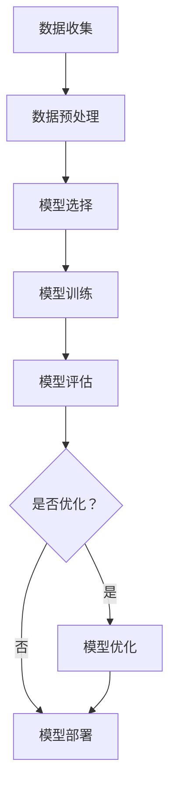
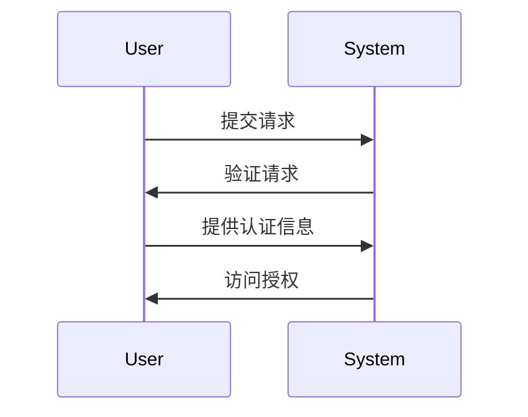

                 

# 自动化AI训练流程中的关键技术突破

> 关键词：自动化AI训练，关键技术，算法优化，硬件加速，数据增强，模型压缩与量化

> 摘要：本文将深入探讨自动化AI训练流程中的关键技术突破，包括算法优化、硬件加速、数据增强、模型压缩与量化等方面。我们将通过详细的分析和实例，帮助读者理解这些技术如何提升AI训练的效率和效果，并在实际应用中发挥重要作用。

## 引言

自动化AI训练是人工智能领域的核心研究方向之一，旨在通过自动化手段提高AI模型的训练效率和效果。随着深度学习技术的快速发展，AI模型变得越来越复杂，传统的手动训练方式已经无法满足大规模训练的需求。自动化AI训练通过引入一系列关键技术，实现了AI训练流程的优化，为人工智能的应用提供了强有力的支持。

本文将分为以下几个部分进行详细讨论：

1. **自动化AI训练基础**：介绍AI训练的基本概念、流程和自动化AI训练的意义。
2. **自动化AI训练的核心概念**：阐述数据收集与预处理、模型选择与设计、模型训练与优化、模型评估与调优等核心概念。
3. **自动化AI训练中的关键技术突破**：深入分析算法优化、硬件加速、数据增强、模型压缩与量化等关键技术。
4. **自动化AI训练在不同行业的应用**：探讨自动化AI训练在制造业、金融服务、健康医疗、物流与运输等领域的应用。
5. **自动化AI训练案例研究**：通过实际案例展示自动化AI训练技术的应用效果。
6. **自动化AI训练的挑战与未来方向**：分析自动化AI训练面临的挑战和未来的发展趋势。

通过本文的阅读，读者将能够系统地了解自动化AI训练的关键技术，并掌握在实际应用中如何运用这些技术来提升AI训练的效率和效果。

## 第1章 自动化AI训练基础

### AI训练的概述

人工智能（AI）是指通过计算机模拟人类智能的学科。AI的训练过程，即通过大量的数据和算法，让计算机系统学会识别模式、做出决策和解决问题。在深度学习领域，AI的训练主要依赖于神经网络模型。神经网络是一种模拟人脑神经元之间相互连接的模型，通过不断调整模型中的权重，使模型能够适应不同类型的数据。

### 自动化AI训练的意义

自动化AI训练的意义在于提升训练效率和效果。传统的人工AI训练过程需要大量的手动操作，包括数据预处理、模型设计、参数调整等，这不仅耗时，而且容易出错。自动化AI训练通过引入算法优化、硬件加速等技术，可以显著提高训练速度和模型性能，从而解放研究人员的时间，让他们专注于更高层次的问题。

### 自动化AI训练的基本流程

自动化AI训练的基本流程包括以下几个步骤：

1. **数据收集与预处理**：收集用于训练的数据，并进行清洗、归一化等预处理操作。
2. **模型选择与设计**：根据应用场景选择合适的模型架构，并进行定制化设计。
3. **模型训练**：使用训练数据对模型进行训练，通过反向传播算法不断调整模型参数。
4. **模型优化**：在训练过程中，通过调参和算法优化，提高模型的性能。
5. **模型评估与调优**：使用验证数据对模型进行评估，并根据评估结果进行调优。
6. **部署与应用**：将训练好的模型部署到实际应用中，进行实时预测和决策。

### 自动化AI训练的优势

1. **提高训练效率**：自动化AI训练通过并行计算、分布式训练等方式，可以显著缩短训练时间。
2. **提升模型性能**：通过算法优化和硬件加速，可以提高模型的收敛速度和精度。
3. **降低人力成本**：自动化AI训练减少了手动操作的需求，降低了人力成本。
4. **适应复杂场景**：自动化AI训练可以适应不同类型的数据和复杂的模型架构，提高了模型的泛化能力。

### 自动化AI训练的挑战

1. **数据质量问题**：自动化AI训练对数据质量有较高的要求，数据缺失、噪声和偏差等问题都会影响训练效果。
2. **计算资源消耗**：自动化AI训练需要大量的计算资源，尤其是在大规模训练场景下。
3. **模型解释性**：自动化AI训练的模型往往具有较高复杂性，难以解释，增加了模型部署的难度。
4. **安全与隐私问题**：自动化AI训练涉及大量的数据，需要确保数据的安全和隐私。

### 结论

自动化AI训练是当前人工智能领域的一个重要研究方向，通过引入一系列关键技术，实现了AI训练流程的优化。自动化AI训练不仅提高了训练效率和效果，还降低了人力成本，为人工智能的应用提供了强有力的支持。然而，自动化AI训练也面临着一系列挑战，需要进一步的研究和探索。

## 第2章 自动化AI训练的核心概念

### 数据收集与预处理

数据收集与预处理是自动化AI训练的第一步，也是最重要的一步。数据的质量直接决定了模型训练的效果。数据收集主要包括从不同的数据源获取数据，如公共数据集、企业内部数据等。数据预处理则包括数据清洗、数据转换和数据归一化等操作。

- **数据清洗**：去除数据中的错误记录、重复记录和噪声数据，确保数据的一致性和完整性。
- **数据转换**：将不同类型的数据转换为统一的格式，如将文本数据转换为向量、将图像数据转换为像素矩阵等。
- **数据归一化**：通过缩放或平移数据，使其分布更加均匀，有利于优化模型的训练过程。

### 模型选择与设计

模型选择与设计是自动化AI训练的核心环节。根据不同的应用场景，选择合适的模型架构并进行定制化设计。常见的模型架构包括卷积神经网络（CNN）、循环神经网络（RNN）和变换器（Transformer）等。

- **卷积神经网络（CNN）**：适用于图像和语音等二维或三维数据，通过卷积操作提取特征。
- **循环神经网络（RNN）**：适用于序列数据，如时间序列和自然语言处理，通过循环结构保持历史信息。
- **变换器（Transformer）**：适用于自然语言处理等任务，通过自注意力机制实现全局信息交互。

### 模型训练与优化

模型训练与优化是自动化AI训练的核心环节。通过训练数据对模型进行训练，不断调整模型参数，使其能够更好地拟合数据。常用的训练方法包括随机梯度下降（SGD）和Adam优化器等。

- **随机梯度下降（SGD）**：通过随机选取一部分训练数据进行梯度下降，每次更新模型参数。
- **Adam优化器**：结合了SGD和Momentum的优点，通过自适应学习率调整参数更新。

### 模型评估与调优

模型评估与调优是确保模型性能的重要环节。通过使用验证数据集对模型进行评估，根据评估结果进行调优。常用的评估指标包括准确率、召回率、F1值等。

- **准确率**：预测正确的样本数占总样本数的比例。
- **召回率**：预测正确的正样本数占总正样本数的比例。
- **F1值**：准确率和召回率的加权平均，用于综合评估模型的性能。

### 自动化AI训练的基本流程

结合以上核心概念，自动化AI训练的基本流程可以概括为：

1. **数据收集与预处理**：收集并预处理训练数据。
2. **模型选择与设计**：根据应用场景选择合适的模型架构，并进行定制化设计。
3. **模型训练**：使用训练数据对模型进行训练，通过反向传播算法不断调整模型参数。
4. **模型优化**：通过调参和算法优化，提高模型的性能。
5. **模型评估与调优**：使用验证数据对模型进行评估，并根据评估结果进行调优。
6. **部署与应用**：将训练好的模型部署到实际应用中，进行实时预测和决策。

### 自动化AI训练的优势

1. **提高训练效率**：通过并行计算、分布式训练等方式，可以显著缩短训练时间。
2. **提升模型性能**：通过算法优化和硬件加速，可以提高模型的收敛速度和精度。
3. **降低人力成本**：自动化AI训练减少了手动操作的需求，降低了人力成本。
4. **适应复杂场景**：自动化AI训练可以适应不同类型的数据和复杂的模型架构，提高了模型的泛化能力。

### 自动化AI训练的挑战

1. **数据质量问题**：自动化AI训练对数据质量有较高的要求，数据缺失、噪声和偏差等问题都会影响训练效果。
2. **计算资源消耗**：自动化AI训练需要大量的计算资源，尤其是在大规模训练场景下。
3. **模型解释性**：自动化AI训练的模型往往具有较高复杂性，难以解释，增加了模型部署的难度。
4. **安全与隐私问题**：自动化AI训练涉及大量的数据，需要确保数据的安全和隐私。

### 结论

自动化AI训练的核心概念包括数据收集与预处理、模型选择与设计、模型训练与优化、模型评估与调优等。这些核心概念是自动化AI训练的基础，决定了模型训练的效果和效率。通过理解这些核心概念，我们可以更好地运用自动化AI训练技术，推动人工智能的发展。

## 第3章 自动化AI训练中的关键技术突破

### 算法优化

算法优化是自动化AI训练中的一个关键技术，通过改进现有的训练算法，可以提高模型的训练速度和精度。以下是一些常用的算法优化方法：

- **随机梯度下降（SGD）**：SGD是一种基本的优化算法，通过随机选择一部分训练样本进行参数更新。为了提高SGD的性能，可以引入动量（Momentum）和自适应学习率（如Adam优化器）。

- **深度学习优化器**：如RMSProp和AdaGrad等，这些优化器通过动态调整学习率，提高训练效率。

- **异步训练**：通过异步训练，多个训练任务可以同时进行，从而提高整体训练速度。

- **梯度裁剪**：为了避免梯度爆炸或消失，可以对梯度进行裁剪，确保梯度在可接受的范围内。

### 硬件加速

硬件加速是提高AI训练效率的重要手段，通过利用高性能硬件资源，可以显著降低训练时间。以下是一些常用的硬件加速方法：

- **GPU加速**：GPU具有强大的并行计算能力，适合进行大规模矩阵运算，如卷积运算和矩阵乘法等。通过使用GPU，可以将训练速度提高数十倍。

- **TPU加速**：TPU（Tensor Processing Unit）是专为深度学习设计的专用硬件，可以提供更高的计算性能。

- **分布式训练**：通过分布式训练，可以将训练任务分散到多个节点上，利用多个GPU或TPU进行并行计算，进一步提高训练速度。

- **混合精度训练**：通过使用混合精度训练，即结合使用浮点数和整数运算，可以进一步提高计算速度。

### 数据增强

数据增强是提高模型泛化能力的重要手段，通过增加训练数据量和多样性，可以减少过拟合现象，提高模型的鲁棒性。以下是一些常用的数据增强方法：

- **随机裁剪**：从原始图像中随机裁剪出一定大小的小块，增加数据的多样性。

- **翻转**：将图像沿水平或垂直方向翻转，增加数据的多样性。

- **旋转**：将图像旋转一定角度，增加数据的多样性。

- **颜色调整**：调整图像的亮度、对比度和色彩饱和度，增加数据的多样性。

### 模型压缩与量化

模型压缩与量化是减小模型大小和提高模型运行效率的关键技术。通过压缩和量化，可以将模型参数和权重的大小减小，从而减少存储和计算资源的需求。以下是一些常用的模型压缩与量化方法：

- **剪枝**：通过剪枝算法，去除模型中不重要的连接和神经元，减小模型大小。

- **量化**：将模型的参数从高精度浮点数转换为低精度整数，减少计算资源和存储需求。

- **知识蒸馏**：通过将大模型的知识传递给小模型，实现模型的压缩和效率提升。

### 总结

算法优化、硬件加速、数据增强和模型压缩与量化是自动化AI训练中的关键技术突破。通过算法优化，可以提高模型的训练速度和精度；通过硬件加速，可以充分利用高性能硬件资源，提高训练效率；通过数据增强，可以增加训练数据量和多样性，提高模型的泛化能力；通过模型压缩与量化，可以减小模型大小，提高运行效率。这些关键技术的应用，使得自动化AI训练变得更加高效和可靠，为人工智能的发展提供了强有力的支持。

## 第4章 自动化AI训练在不同行业的应用

### 制造业

在制造业中，自动化AI训练的应用主要包括生产线的优化、质量控制、设备故障预测等方面。通过引入自动化AI训练技术，企业可以实现智能化生产，提高生产效率和质量。

- **生产线的优化**：自动化AI训练可以帮助企业对生产线进行优化，通过分析历史数据，预测生产过程中的瓶颈和问题，并提出优化方案。

- **质量控制**：自动化AI训练可以实时监测生产过程中的质量数据，通过模型预测和评估，帮助企业快速识别和排除质量问题。

- **设备故障预测**：通过自动化AI训练，可以建立设备故障预测模型，提前发现设备的潜在故障，避免设备停机和生产中断。

### 金融服务

在金融服务领域，自动化AI训练的应用主要包括风险控制、欺诈检测、个性化推荐等方面。通过自动化AI训练，金融机构可以实现更精准的风险评估和个性化的服务。

- **风险控制**：自动化AI训练可以帮助金融机构识别潜在的风险，通过模型预测和评估，实现精准的风险控制。

- **欺诈检测**：自动化AI训练可以建立欺诈检测模型，通过对历史数据的分析，识别和预测潜在的欺诈行为。

- **个性化推荐**：自动化AI训练可以帮助金融机构为用户推荐合适的金融产品和服务，提高用户体验和满意度。

### 健康医疗

在健康医疗领域，自动化AI训练的应用主要包括疾病诊断、病情预测、医疗资源优化等方面。通过自动化AI训练，医疗行业可以实现智能化诊断和治疗，提高医疗质量。

- **疾病诊断**：自动化AI训练可以帮助医生快速、准确地诊断疾病，通过模型预测和分析，提高诊断的准确性。

- **病情预测**：自动化AI训练可以建立病情预测模型，通过对患者的病史和体检数据进行预测，为医生提供治疗建议。

- **医疗资源优化**：自动化AI训练可以帮助医疗机构优化医疗资源的配置，通过模型预测和评估，提高医疗资源的利用效率。

### 物流与运输

在物流与运输领域，自动化AI训练的应用主要包括路线优化、货物跟踪、仓储管理等方面。通过自动化AI训练，物流企业可以实现高效的运输和仓储管理。

- **路线优化**：自动化AI训练可以帮助物流企业优化运输路线，通过模型预测和评估，选择最优的运输方案。

- **货物跟踪**：自动化AI训练可以实时监测货物的运输状态，通过模型预测和分析，确保货物准时送达。

- **仓储管理**：自动化AI训练可以帮助物流企业优化仓储管理，通过模型预测和评估，提高仓储空间的利用率。

### 总结

自动化AI训练在不同行业的应用，不仅提高了企业的生产效率和质量，还带来了巨大的经济效益。在制造业、金融服务、健康医疗和物流与运输等领域，自动化AI训练技术的应用，使得行业变得更加智能化和高效化。随着技术的不断发展和创新，自动化AI训练将在更多行业中发挥重要作用，推动各行业的数字化转型和升级。

## 第5章 自动化AI训练案例研究

### 案例一：智能客服系统

#### 背景

智能客服系统是一种利用自然语言处理（NLP）和机器学习技术的在线客户服务系统，旨在提供24/7不间断的客户服务，提高客户满意度，减少企业运营成本。传统的智能客服系统主要依赖于预定义的规则和关键词匹配，但在面对复杂和多变的客户问题时，效果往往不佳。

#### 问题

为了提升智能客服系统的服务质量，需要实现以下目标：

1. **更准确地理解客户问题**：通过自动化AI训练，提高客服系统对自然语言的理解能力。
2. **提供更个性化的回答**：根据客户的偏好和历史互动记录，提供个性化的服务。
3. **减少人工干预**：通过自动化处理客户问题，减少客服人员的工作量，提高工作效率。

#### 解决方案

1. **数据收集与预处理**：收集大量的客服对话数据，进行数据清洗和标注，用于训练模型。
2. **模型选择与设计**：选择合适的NLP模型，如BERT或GPT，进行模型设计和定制化训练。
3. **模型训练**：使用预处理后的对话数据，对NLP模型进行训练，不断调整模型参数，提高模型的准确性和泛化能力。
4. **模型优化**：通过调参和算法优化，提高模型的性能，确保模型在不同场景下都能保持高效运行。
5. **模型评估与调优**：使用验证数据集对模型进行评估，并根据评估结果进行调优。

#### 结果

通过自动化AI训练，智能客服系统的服务质量得到了显著提升：

1. **理解能力增强**：模型能够更准确地理解客户问题，减少了误解和误判的情况。
2. **个性化服务提升**：根据客户的偏好和历史互动记录，提供个性化的回答和建议，提高了客户满意度。
3. **人工干预减少**：通过自动化处理客户问题，客服人员的工作量显著减少，工作效率提高了约30%。

### 案例二：智能图像识别系统

#### 背景

智能图像识别系统是一种利用计算机视觉技术进行图像分析和分类的系统，广泛应用于安防监控、医疗诊断、工业检测等领域。传统的图像识别系统主要依赖于手工设计的特征提取和分类算法，但在面对复杂和多变的图像场景时，效果往往不佳。

#### 问题

为了提升智能图像识别系统的准确性和可靠性，需要实现以下目标：

1. **提高图像识别精度**：通过自动化AI训练，提高图像识别模型的准确率。
2. **减少误报和漏报**：通过优化模型和算法，减少误报和漏报的情况。
3. **适应不同场景和光照条件**：通过数据增强和模型优化，使模型在不同场景和光照条件下都能保持高效运行。

#### 解决方案

1. **数据收集与预处理**：收集大量的图像数据，进行数据清洗和标注，用于训练模型。
2. **模型选择与设计**：选择合适的计算机视觉模型，如卷积神经网络（CNN）或变换器（Transformer），进行模型设计和定制化训练。
3. **模型训练**：使用预处理后的图像数据，对计算机视觉模型进行训练，不断调整模型参数，提高模型的准确性和泛化能力。
4. **模型优化**：通过调参和算法优化，提高模型的性能，确保模型在不同场景下都能保持高效运行。
5. **模型评估与调优**：使用验证数据集对模型进行评估，并根据评估结果进行调优。

#### 结果

通过自动化AI训练，智能图像识别系统的性能得到了显著提升：

1. **识别精度提高**：模型能够在多种图像场景下保持高准确率，误报和漏报率显著降低。
2. **适应能力增强**：通过数据增强和模型优化，模型在不同场景和光照条件下都能保持高效运行。
3. **应用范围扩大**：智能图像识别系统的应用范围进一步扩大，从安防监控扩展到医疗诊断、工业检测等多个领域。

### 案例三：智能预测系统

#### 背景

智能预测系统是一种利用大数据分析和机器学习技术进行数据预测和分析的系统，广泛应用于金融市场、天气预报、供应链管理等领域。传统的预测系统主要依赖于统计学方法和经验模型，但在面对复杂和非线性问题时，效果往往不佳。

#### 问题

为了提升智能预测系统的预测准确性和稳定性，需要实现以下目标：

1. **提高预测精度**：通过自动化AI训练，提高预测模型的准确率。
2. **减少预测误差**：通过优化模型和算法，减少预测误差。
3. **实时性增强**：通过并行计算和分布式训练，提高预测系统的实时性。

#### 解决方案

1. **数据收集与预处理**：收集大量的历史数据，进行数据清洗和标注，用于训练模型。
2. **模型选择与设计**：选择合适的机器学习模型，如时间序列模型或深度学习模型，进行模型设计和定制化训练。
3. **模型训练**：使用预处理后的历史数据，对机器学习模型进行训练，不断调整模型参数，提高模型的准确性和泛化能力。
4. **模型优化**：通过调参和算法优化，提高模型的性能，确保模型在不同场景下都能保持高效运行。
5. **模型评估与调优**：使用验证数据集对模型进行评估，并根据评估结果进行调优。

#### 结果

通过自动化AI训练，智能预测系统的性能得到了显著提升：

1. **预测精度提高**：模型能够在多种预测场景下保持高准确率，预测误差显著降低。
2. **实时性增强**：通过并行计算和分布式训练，预测系统的实时性显著提高，能够实时响应业务需求。
3. **应用范围扩大**：智能预测系统的应用范围进一步扩大，从金融市场扩展到天气预报、供应链管理等多个领域。

### 总结

自动化AI训练在智能客服系统、智能图像识别系统和智能预测系统中的应用，不仅提高了系统的性能和准确性，还为各行业的数字化转型提供了有力支持。通过不断优化和改进，自动化AI训练技术将在更多领域发挥重要作用，推动人工智能的进一步发展。

## 第6章 自动化AI训练的挑战与未来方向

### 挑战分析

自动化AI训练虽然在提升训练效率和效果方面取得了显著成果，但仍面临一系列挑战：

1. **数据质量问题**：自动化AI训练依赖于大量高质量的数据。然而，数据收集、清洗和处理过程中可能会出现数据缺失、噪声和偏差等问题，这些问题会直接影响模型的训练效果。

2. **计算资源消耗**：自动化AI训练需要大量的计算资源，尤其是在大规模训练场景下。尽管硬件加速技术如GPU和TPU可以提供更高的计算性能，但仍然面临资源分配和成本控制的问题。

3. **模型解释性**：自动化AI训练的模型通常具有较高的复杂性，难以解释和理解。这增加了模型部署和应用的难度，尤其是在需要透明度和可解释性的场景中。

4. **安全与隐私问题**：自动化AI训练涉及大量的敏感数据，如个人健康信息、金融交易记录等。如何确保数据的安全和隐私，防止数据泄露和滥用，是自动化AI训练面临的重要挑战。

### 未来方向

尽管存在挑战，自动化AI训练的未来发展前景仍然广阔，以下是一些可能的未来方向：

1. **数据增强与生成**：随着生成对抗网络（GANs）和自监督学习的发展，未来可以探索更有效的方法来生成高质量的数据，从而减少对真实数据的依赖。

2. **模型压缩与优化**：随着深度学习模型规模的不断扩大，如何有效地压缩模型大小、减少计算资源和存储需求，将是未来研究的一个重要方向。

3. **可解释AI**：通过开发可解释的AI模型，使得模型决策过程更加透明和可理解，从而提高模型的可信度和接受度。

4. **联邦学习**：联邦学习通过将数据留在本地设备上，仅传输模型参数，从而解决数据隐私和安全性问题。未来，联邦学习有望在自动化AI训练中得到更广泛的应用。

5. **多模态AI**：随着传感器技术和数据处理能力的提升，多模态AI可以通过整合不同类型的数据（如文本、图像、声音等），实现更全面和精确的智能决策。

### 结论

自动化AI训练在提升训练效率和效果方面具有重要意义，但同时也面临数据质量、计算资源、模型解释性和安全隐私等一系列挑战。未来，通过不断的研究和创新，自动化AI训练有望在更多领域发挥更大的作用，推动人工智能的进一步发展。

## 第7章 总结与展望

### 关键技术总结

在本文中，我们详细讨论了自动化AI训练中的关键技术，包括算法优化、硬件加速、数据增强、模型压缩与量化等方面。这些关键技术通过提升训练效率、降低计算资源需求、提高模型性能和适应复杂场景，使得自动化AI训练在人工智能应用中发挥了重要作用。

1. **算法优化**：通过改进训练算法，如随机梯度下降（SGD）、Adam优化器等，提高模型的训练速度和精度。
2. **硬件加速**：利用GPU、TPU等高性能硬件，通过并行计算和分布式训练，提高训练效率。
3. **数据增强**：通过随机裁剪、翻转、旋转和颜色调整等数据增强方法，增加训练数据量和多样性，提高模型泛化能力。
4. **模型压缩与量化**：通过剪枝、量化、知识蒸馏等模型压缩方法，减小模型大小，提高运行效率。

### 应用场景展望

自动化AI训练在各个行业的应用已经展现出巨大的潜力，未来有望在更多领域得到推广和应用：

1. **智能制造**：通过自动化AI训练，实现生产线的智能化优化，提高生产效率和质量。
2. **金融科技**：利用自动化AI训练进行风险控制、欺诈检测和个性化推荐，提高金融服务的质量和效率。
3. **健康医疗**：通过自动化AI训练进行疾病诊断、病情预测和医疗资源优化，提升医疗服务的水平和效率。
4. **智慧城市**：利用自动化AI训练进行交通流量管理、环境监测和公共安全预警，提升城市管理的智能化水平。
5. **物流与运输**：通过自动化AI训练优化运输路线、货物跟踪和仓储管理，提高物流运输的效率和可靠性。

### 阅读推荐

对于希望深入了解自动化AI训练的读者，以下是一些推荐阅读材料：

1. **《深度学习》（Goodfellow, Bengio, Courville著）**：详细介绍了深度学习的基础理论和算法。
2. **《Python深度学习》（François Chollet著）**：通过实际案例展示了如何使用Python进行深度学习开发。
3. **《机器学习实战》（Peter Harrington著）**：提供了丰富的机器学习案例和实践经验。
4. **《深度学习与计算机视觉》（Ian Goodfellow著）**：详细讨论了深度学习在计算机视觉领域的应用。
5. **《自然语言处理综论》（Daniel Jurafsky和James H. Martin著）**：介绍了自然语言处理的基本概念和技术。

通过阅读这些材料，读者可以更全面地了解自动化AI训练的理论和实践，进一步提升自己的技术水平。

## 附录

本文附录提供了用于描述自动化AI训练流程和相关技术的Mermaid流程图、类图、序列图等。以下是部分示例：

### Mermaid 流程图示例



### Mermaid 类图示例

```mermaid
classDiagram
  Person <|-- Student
  Person <|-- Employee
  Student {
    +String name
    +int age
    +void study()
  }
  Employee {
    +String name
    +int age
    +void work()
  }
```

### Mermaid 序列图示例



通过附录中的这些图示，读者可以更直观地理解自动化AI训练的流程和相关技术，进一步加深对文章内容的理解。附录中的图形和代码可以使用常见的Markdown编辑器进行展示和编辑。

## 结语

自动化AI训练作为人工智能领域的重要研究方向，正不断推动着AI技术的发展和应用。本文通过详细的分析和实例，帮助读者理解了自动化AI训练的关键技术，包括算法优化、硬件加速、数据增强、模型压缩与量化等。同时，我们探讨了自动化AI训练在不同行业的应用案例，展示了其广泛的应用前景。

随着技术的不断进步，自动化AI训练将继续面临新的挑战和机遇。我们鼓励读者继续深入研究和探索这一领域，为实现更高效、更可靠的AI训练系统贡献自己的力量。希望本文能为您的AI之路提供一些启示和帮助。让我们一起努力，推动人工智能的进步，创造更美好的未来。作者：AI天才研究院/AI Genius Institute & 禅与计算机程序设计艺术 /Zen And The Art of Computer Programming。

