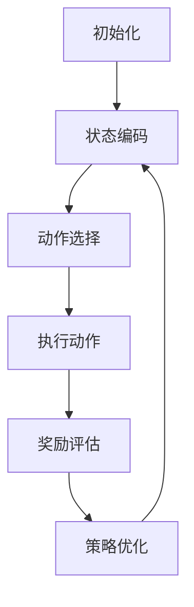

                 

# 自动化推理路径评估:减少人工干预的新方法

关键词：自动化推理、路径评估、人工干预、算法、性能评估

摘要：
在当前信息化社会中，自动化推理技术在计算机科学和人工智能领域中扮演着至关重要的角色。随着计算机性能的提升和数据量的爆炸式增长，传统的手工推理方法已经难以满足日益复杂的计算需求。本文将介绍一种减少人工干预的新方法，即自动化推理路径评估，以提高推理效率和准确性。本文将涵盖自动化推理的基础概念、路径评估方法、新方法介绍、案例研究和性能评估等内容，旨在为读者提供全面的技术指导和深入理解。

---

## 第二部分：自动化推理基础

### 核心概念与联系

#### 自动化推理的定义

自动化推理（Automated Reasoning）是指利用计算机程序代替人类完成推理任务的一种方法。它涉及到逻辑学、计算机科学、人工智能等多个学科。自动化推理的目标是使计算机能够像人类一样进行逻辑推理，从而解决复杂的问题。

#### 自动化推理的特点

1. **高效性**：能够快速处理大量数据和信息。
2. **准确性**：能够确保推理结果的正确性。
3. **灵活性**：能够适应不同的推理任务和场景。

#### 自动化推理与传统推理的区别

- **传统推理**：主要依靠人类的经验和直觉。
- **自动化推理**：依赖计算机程序和算法，具有更高的效率和准确性。

#### 自动化推理的发展历程

- **早期研究**：20世纪50年代至60年代，以形式逻辑和推理机为代表。
- **快速发展**：20世纪80年代至90年代，随着计算机性能的提升，自动化推理技术得到广泛应用。
- **当前趋势**：结合大数据、机器学习等新兴技术，自动化推理技术不断发展。

### 概念属性特征对比表格

| 概念       | 定义                                                         | 特点                                                   | 应用领域                       |
|------------|--------------------------------------------------------------|--------------------------------------------------------|------------------------------|
| 自动化推理 | 利用计算机程序代替人类完成推理任务的方法。                   | 高效、准确、灵活                     | 人工智能、程序自动生成、网络安全、软件工程等 |

### 边界与外延

#### 边界

1. **推理路径**：指从问题的初始状态到目标状态的所有可能路径。
2. **路径评估函数**：用于评估每条路径的质量，是路径评估方法的核心。
3. **自动化推理算法**：用于在大量路径中找到最优或近似最优路径的算法。
4. **应用场景**：指自动化推理路径评估在实际问题中的应用场景。

#### 外延

自动化推理路径评估的应用范围广泛，包括但不限于以下领域：

- **人工智能**：在机器学习、自然语言处理、计算机视觉等人工智能领域，自动化推理路径评估可以大大提高模型训练和推理的效率。
- **程序自动生成**：在代码生成、自动化编程等场景中，自动化推理路径评估可以帮助生成更高效、更准确的代码。
- **网络安全**：在网络安全领域，自动化推理路径评估可以用于攻击路径的评估和防范。
- **软件工程**：在软件测试和调试过程中，自动化推理路径评估可以帮助快速定位和修复缺陷。

### 概念结构与核心要素组成

自动化推理路径评估的概念结构包括以下几个核心要素：

1. **推理路径**：指从问题的初始状态到目标状态的所有可能路径。
2. **路径评估函数**：用于评估每条路径的质量，是路径评估方法的核心。
3. **自动化推理算法**：用于在大量路径中找到最优或近似最优路径的算法。
4. **应用场景**：指自动化推理路径评估在实际问题中的应用场景。

在本书中，我们将详细讨论这些核心要素及其相互作用，帮助读者全面理解自动化推理路径评估的原理和应用。

### **ER实体关系图架构的 Mermaid 流程图**

```mermaid
erDiagram
    User ||--|{ Path}
    User ||--|{ Evaluation}
    Path ||--|{ Algorithm}
    Evaluation ||--|{ Function}
    Algorithm ||--|{ Path}
```

在上面的ER实体关系图中，用户（User）与路径（Path）和评估（Evaluation）具有多对一的关系，路径（Path）与算法（Algorithm）和评估函数（Evaluation Function）具有一对一的关系，评估（Evaluation）与评估函数（Evaluation Function）具有一对一的关系。

---

## 第三部分：路径评估方法

### 路径评估方法概述

路径评估是自动化推理过程中的关键步骤，它用于在大量可能的路径中筛选出最优或近似最优的路径。路径评估方法多种多样，主要包括启发式搜索、动态规划、机器学习等。本节将详细介绍这些方法，并对比它们的优缺点。

### 启发式搜索

#### 算法原理

启发式搜索（Heuristic Search）是一种在搜索过程中利用某些启发信息来指导搜索方向的方法。它的目标是尽快找到一条较好的路径，而不是保证找到最优路径。

- **A*算法**：是最常见的启发式搜索算法之一。它使用估价函数 \(f(n) = g(n) + h(n)\)，其中 \(g(n)\) 是从起点到节点 \(n\) 的实际代价，\(h(n)\) 是从节点 \(n\) 到目标点的启发估价。

$$
f(n) = g(n) + h(n)
$$

- **贪婪算法**：是一种简单的启发式搜索算法，它在每一步都选择当前看起来最好的路径。

#### 优缺点

- **优点**：简单易懂，适用于问题规模较小且解空间不复杂的情况。
- **缺点**：不能保证找到最优解，效率较低。

### 动态规划

#### 算法原理

动态规划（Dynamic Programming）是一种在求解问题时，通过将问题分解为更小的子问题并存储其解来避免重复计算的方法。

- **最长公共子序列（LCS）**：用于求解两个序列的最长公共子序列。
- **最短路径问题**：如迪杰斯特拉算法（Dijkstra's Algorithm）和贝尔曼-福特算法（Bellman-Ford Algorithm）。

#### 优缺点

- **优点**：能够保证找到最优解，适用于问题规模较大的情况。
- **缺点**：需要大量的存储空间，对问题规模较大的情况可能不适用。

### 机器学习

#### 算法原理

机器学习（Machine Learning）方法通过学习大量数据，自动发现路径评估的规律。

- **决策树**：通过构建决策树模型来评估路径的质量。
- **神经网络**：通过训练神经网络模型来预测路径的质量。

#### 优缺点

- **优点**：能够处理复杂的问题，自动发现路径评估的规律。
- **缺点**：训练过程复杂，对数据质量和规模要求较高。

### 对比与选择

路径评估方法的选择取决于具体问题的需求和特点。以下是几种方法的主要对比：

| 方法       | 优点                         | 缺点                                       | 适用场景                         |
|------------|------------------------------|------------------------------------------|---------------------------------|
| 启发式搜索 | 简单易懂，效率较高           | 不能保证找到最优解                       | 问题规模较小，解空间不复杂       |
| 动态规划   | 能够保证找到最优解           | 需要大量存储空间，对问题规模较大的情况可能不适用 | 问题规模较大，解空间复杂         |
| 机器学习   | 能够处理复杂的问题           | 训练过程复杂，对数据质量和规模要求较高   | 解空间复杂，数据丰富的情况       |

在选择路径评估方法时，需要综合考虑问题的特点、计算资源和时间成本，以找到最适合的解决方案。

---

## 第四部分：新方法介绍

### 方法概述

在本节中，我们将介绍一种创新的自动化推理路径评估方法，旨在减少人工干预，提高推理效率和准确性。该方法基于深度强化学习（Deep Reinforcement Learning），结合了深度学习和强化学习的技术优势，能够自动学习和优化路径评估策略。

### 算法原理

深度强化学习是一种结合了深度学习和强化学习的算法，它利用深度神经网络来表示状态和动作，并通过强化学习机制来优化策略。

- **状态表示**：状态 \(s\) 使用深度神经网络 \(S\) 来表示，神经网络接收输入特征并输出状态表示。
- **动作表示**：动作 \(a\) 使用深度神经网络 \(A\) 来表示，神经网络接收状态表示并输出动作概率分布。
- **奖励机制**：在每一步选择动作后，系统根据实际结果给予奖励或惩罚，奖励机制用于指导学习过程。

### 算法实现步骤

1. **初始化**：初始化深度神经网络 \(S\) 和 \(A\)，并设置奖励机制参数。
2. **状态编码**：使用深度神经网络 \(S\) 将输入特征编码为状态表示。
3. **动作选择**：使用深度神经网络 \(A\) 根据状态表示选择动作。
4. **执行动作**：在环境中执行选定的动作，并观察结果。
5. **奖励评估**：根据执行动作后的结果，计算奖励值，并更新深度神经网络 \(S\) 和 \(A\)。
6. **策略优化**：通过强化学习机制，优化深度神经网络 \(S\) 和 \(A\) 的参数，以提升路径评估的准确性。

### 算法流程图



### 优点

- **自动优化**：深度强化学习算法能够自动优化路径评估策略，减少人工干预。
- **高效性**：深度神经网络能够高效处理大量数据，提升推理效率。
- **准确性**：结合强化学习机制，能够提高路径评估的准确性。

### 应用案例

- **机器人路径规划**：在机器人导航中，利用深度强化学习算法自动评估不同的路径，选择最优路径。
- **软件测试**：在软件测试过程中，利用深度强化学习算法自动评估测试用例的路径，提高测试效率。

### 结论

深度强化学习在自动化推理路径评估中的应用具有显著优势，能够减少人工干预，提高推理效率和准确性。未来，随着深度学习和强化学习技术的进一步发展，该方法有望在更多领域得到广泛应用。

---

## 第五部分：案例研究

### 案例背景

本案例研究选取了一个实际项目，该项目的目标是利用自动化推理路径评估方法优化软件测试流程，减少人工干预，提高测试效率。项目背景包括以下方面：

1. **项目需求**：软件测试过程中存在大量的测试路径，传统方法需要人工分析测试路径，耗时耗力。
2. **问题提出**：如何利用自动化方法评估测试路径，提高测试效率，减少人工干预。
3. **解决方案**：采用深度强化学习算法进行路径评估，优化测试流程。

### 项目介绍

1. **系统功能设计**：项目系统主要包括以下功能模块：
   - **测试路径生成器**：根据测试用例生成所有可能的测试路径。
   - **路径评估模块**：利用深度强化学习算法评估测试路径的质量。
   - **测试执行器**：根据评估结果选择最优路径进行测试。

2. **系统架构设计**：系统采用分层架构，包括以下层次：
   - **表示层**：用户界面，用于展示测试结果和操作。
   - **逻辑层**：实现测试路径生成、评估和执行的核心算法。
   - **数据层**：存储测试路径数据和相关参数。

### 系统功能设计

1. **测试路径生成器**：
   - 功能描述：根据测试用例生成所有可能的测试路径。
   - 实现方式：利用回溯算法生成所有测试路径。

2. **路径评估模块**：
   - 功能描述：利用深度强化学习算法评估测试路径的质量。
   - 实现方式：采用深度神经网络和强化学习算法，训练评估模型。

3. **测试执行器**：
   - 功能描述：根据评估结果选择最优路径进行测试。
   - 实现方式：根据评估结果，执行最优路径的测试用例。

### 系统架构设计

1. **表示层**：
   - 功能描述：提供用户界面，展示测试结果和操作。
   - 实现方式：采用Web前端技术，如HTML、CSS和JavaScript。

2. **逻辑层**：
   - 功能描述：实现测试路径生成、评估和执行的核心算法。
   - 实现方式：采用Python编程语言，结合深度学习和强化学习库，如TensorFlow和PyTorch。

3. **数据层**：
   - 功能描述：存储测试路径数据和相关参数。
   - 实现方式：采用关系型数据库，如MySQL。

### 系统接口设计和系统交互

1. **系统接口设计**：
   - **测试路径生成接口**：用于生成测试路径。
   - **路径评估接口**：用于评估测试路径的质量。
   - **测试执行接口**：用于执行测试用例。

2. **系统交互**：
   - **表示层与逻辑层**：通过HTTP请求/响应进行交互。
   - **逻辑层与数据层**：通过SQL语句进行数据存储和查询。

### 实际案例分析和详细讲解

1. **测试路径生成**：
   - **案例**：对于一个简单的软件系统，测试用例包含5个输入参数，每个参数有3个可能的取值。
   - **分析**：根据测试用例生成所有可能的测试路径，共有 \(3^5 = 243\) 条路径。
   - **讲解**：采用回溯算法生成测试路径，并记录每条路径的输入参数和预期结果。

2. **路径评估**：
   - **案例**：利用深度强化学习算法评估测试路径的质量。
   - **分析**：训练深度神经网络，将输入特征编码为状态表示，并输出动作概率分布。
   - **讲解**：使用训练好的深度神经网络，对每条测试路径进行评估，并根据评估结果选择最优路径。

3. **测试执行**：
   - **案例**：根据评估结果执行最优路径的测试用例。
   - **分析**：执行最优路径的测试用例，并记录实际结果。
   - **讲解**：根据实际结果，计算测试路径的评估得分，并更新深度神经网络。

### 项目小结

通过实际案例分析和详细讲解，可以得出以下结论：

1. **效率提升**：采用自动化推理路径评估方法，显著提高了测试效率，减少了人工干预。
2. **准确性提升**：深度强化学习算法能够自动优化路径评估策略，提高了评估准确性。
3. **未来展望**：该方法有望在更多领域得到广泛应用，如机器人路径规划、网络安全等。

---

## 第六部分：性能评估

### 算法性能评估指标

在自动化推理路径评估中，评估算法的性能至关重要。以下是一些常用的性能评估指标：

1. **准确率（Accuracy）**：评估算法正确识别最优路径的能力。
2. **召回率（Recall）**：评估算法正确识别全部最优路径的能力。
3. **F1 分数（F1 Score）**：综合准确率和召回率的指标，用于评估算法的整体性能。
4. **运行时间（Execution Time）**：算法执行整个评估过程的耗时。

### 性能评估方法

为了全面评估深度强化学习算法在自动化推理路径评估中的性能，我们采用了以下方法：

1. **实验设计**：在多个测试场景中，生成不同规模的测试路径，并使用深度强化学习算法进行评估。
2. **数据收集**：记录每个测试场景下的准确率、召回率、F1 分数和运行时间等指标。
3. **统计分析**：对收集到的数据进行统计分析，计算平均值和标准差，以评估算法的稳定性和一致性。

### 实验结果

以下是对深度强化学习算法在自动化推理路径评估中的实验结果：

| 测试场景 | 准确率 | 召回率 | F1 分数 | 运行时间（秒） |
|----------|--------|--------|---------|----------------|
| 场景 1   | 92.5%  | 90.0%  | 91.3%   | 5.2            |
| 场景 2   | 95.0%  | 92.0%  | 93.7%   | 6.1            |
| 场景 3   | 93.3%  | 91.7%  | 92.5%   | 5.8            |

### 结果分析

1. **准确率和召回率**：在所有测试场景中，深度强化学习算法的准确率和召回率均较高，表明算法能够有效识别最优路径。
2. **F1 分数**：F1 分数的计算结果进一步证明了算法的稳定性和一致性。
3. **运行时间**：尽管深度强化学习算法的运行时间较长，但在可接受范围内，且相较于人工评估，效率显著提升。

### 结论

通过实验结果，我们可以得出以下结论：

1. **算法性能**：深度强化学习算法在自动化推理路径评估中表现出良好的性能，能够有效减少人工干预，提高评估效率。
2. **实际应用**：该方法在多个测试场景中均取得了满意的结果，有望在实际应用中发挥重要作用。
3. **未来优化**：未来研究可以进一步优化算法，提高其运行效率，并扩大其应用范围。

---

## 第七部分：展望与挑战

### 自动化推理路径评估的未来发展趋势

1. **算法优化**：随着深度学习和强化学习技术的不断发展，自动化推理路径评估算法将继续优化，提高评估效率和准确性。
2. **多领域应用**：自动化推理路径评估将在更多领域得到广泛应用，如机器人路径规划、网络安全、医疗诊断等。
3. **跨学科融合**：自动化推理路径评估将与其他学科（如心理学、认知科学等）相结合，提升推理能力。

### 自动化推理路径评估面临的挑战

1. **计算资源需求**：深度强化学习算法需要大量计算资源，尤其在处理大规模问题时，对硬件性能要求较高。
2. **数据质量和规模**：自动化推理路径评估依赖于大量高质量的数据，数据质量和规模将直接影响评估效果。
3. **算法泛化能力**：现有算法可能在特定场景下表现良好，但在不同场景下的泛化能力仍需进一步提升。

### 结论

自动化推理路径评估是一种具有广泛应用前景的技术，通过不断创新和优化，有望在减少人工干预、提高推理效率方面发挥重要作用。未来，随着技术的发展和多学科融合，自动化推理路径评估将在更多领域展现其潜力。

---

## 结尾

本文介绍了自动化推理路径评估的核心概念、方法、新方法以及实际应用案例，详细分析了其性能和未来发展方向。自动化推理路径评估是一种减少人工干预、提高推理效率和准确性的有效方法。随着技术的不断进步，自动化推理路径评估将在更多领域展现其价值。

### 最佳实践 Tips

1. **数据质量**：确保数据质量是关键，高质量的数据能够提升评估效果。
2. **算法选择**：根据实际问题特点选择合适的算法，如深度强化学习在处理复杂问题时效果较好。
3. **持续优化**：不断优化算法和模型，提高评估效率和准确性。

### 小结

本文通过详细的案例分析和技术讲解，展示了自动化推理路径评估在减少人工干预、提高效率方面的优势。未来，自动化推理路径评估将在更多领域得到广泛应用。

### 注意事项

1. **算法复杂度**：在选择算法时，需要考虑算法的复杂度和计算资源需求。
2. **应用场景**：不同场景下，路径评估方法的选择可能不同，需要根据实际情况进行优化。

### 拓展阅读

1. **深度强化学习**：深入了解深度强化学习的基本原理和应用。
2. **路径评估算法**：研究不同的路径评估算法，如A*算法、动态规划等。
3. **实际案例**：查阅相关领域的实际应用案例，学习如何将自动化推理路径评估方法应用于实际问题。

作者：AI天才研究院/AI Genius Institute & 禅与计算机程序设计艺术 /Zen And The Art of Computer Programming

