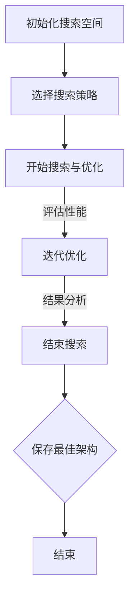

                 

## 引言

### 1.1 书籍背景

在当今人工智能高速发展的时代，自动化神经架构搜索（Automated Neural Architecture Search，简称ANAS）作为一种新兴的优化方法，正逐渐改变着深度学习的面貌。它通过自动搜索最优的神经网络架构，减少了人工设计的复杂性，提高了模型的性能和效率。《自动化神经架构搜索在IoT设备上的应用》这本书旨在探讨自动化神经架构搜索技术在物联网（Internet of Things，简称IoT）设备上的应用，为读者提供一种全新的技术视角和解决方案。

这本书的编写源于作者在人工智能和物联网领域的丰富实践经验，以及对自动化神经架构搜索技术的深入理解。书中不仅介绍了自动化神经架构搜索的基本概念和原理，还详细阐述了该技术在不同IoT场景下的应用方法和挑战。通过这本书，读者可以全面了解自动化神经架构搜索在IoT设备上的重要性和应用前景，从而为实际项目提供理论支持和实践指导。

### 1.2 读者对象

本书适合对人工智能、物联网以及深度学习有一定了解的读者，包括但不限于以下几类人群：

1. **人工智能研究人员和开发者**：希望了解和掌握自动化神经架构搜索技术，将其应用于自己的研究或开发项目。
2. **物联网工程师和技术人员**：关注IoT设备性能优化和智能化，希望通过学习本书内容提升设备智能化水平。
3. **高校师生**：计算机科学、人工智能、物联网等相关专业的研究生和本科生，可以作为教材或参考书。
4. **技术爱好者和从业者**：对前沿技术感兴趣，希望通过本书了解自动化神经架构搜索在IoT设备上的应用。

### 1.3 内容概述

本书分为八个主要章节，内容结构如下：

1. **引言**：介绍书籍背景、读者对象和内容概述。
2. **自动化神经架构搜索概述**：讲解自动化神经架构搜索的概念、重要性和发展历程。
3. **IoT设备上的神经架构搜索需求**：分析IoT设备的特性及其在神经架构搜索上的应用需求。
4. **神经架构搜索算法原理**：介绍神经架构搜索的基本原理、数学模型和mermaid流程图。
5. **常见的神经架构搜索算法**：介绍搜索空间设计、评估指标和常见算法。
6. **神经架构搜索算法在IoT设备上的应用**：探讨算法在IoT设备上的优化、实现和性能评估。
7. **项目实战**：通过实际案例展示自动化神经架构搜索在IoT设备上的应用过程。
8. **结论与展望**：总结全书内容，展望自动化神经架构搜索在IoT设备上的应用前景。

通过本书的阅读，读者可以系统地了解自动化神经架构搜索技术，掌握其在IoT设备上的应用方法，并能够将所学知识应用于实际项目中，为智能物联网的发展贡献力量。

## 2. 自动化神经架构搜索概述

### 2.1 自动化神经架构搜索的概念

自动化神经架构搜索（Automated Neural Architecture Search，简称ANAS）是指利用计算机算法自动搜索最优的神经网络架构，以提高模型的性能和效率。传统的神经网络设计主要依赖于人工经验，需要大量的时间和人力投入，且很难保证找到最优解。而自动化神经架构搜索通过模拟自然进化和遗传算法等机制，自动搜索并优化网络结构，极大地提高了设计效率。

自动化神经架构搜索的核心目标是通过自动化的方式找到适合特定任务的最优神经网络架构。这通常包括网络层数、每层单元数、激活函数、网络连接方式等多个方面的优化。通过这种方式，不仅能够减少人工干预，还能提高模型的适应性和泛化能力，从而在各类复杂任务中取得更好的性能。

### 2.2 自动化神经架构搜索的重要性

随着深度学习的广泛应用，自动化神经架构搜索的重要性日益凸显。以下是几个关键点：

1. **效率提升**：自动化搜索能够大大减少设计周期，提高研发效率。传统的神经网络设计往往需要经过多次试验和调整，而自动化搜索可以通过大量的实验和筛选，快速找到最优网络结构。
   
2. **性能优化**：通过自动搜索，可以找到比人工设计更优的网络架构，从而提高模型的准确性和效率。例如，一些研究表明，自动化搜索能够设计出在特定任务上比传统卷积神经网络（CNN）表现更优的架构。

3. **适应性增强**：自动化神经架构搜索能够适应不同的任务和数据集，具有更高的泛化能力。这意味着，搜索到的架构不仅适用于当前的特定任务，还可能适用于其他相关任务。

4. **减少人力成本**：自动化搜索减轻了研究人员的工作负担，使得更多的精力可以投入到更具有创新性的研究中。此外，自动化搜索还可以应用于资源有限的环境，如嵌入式设备和物联网设备。

### 2.3 自动化神经架构搜索的发展历程

自动化神经架构搜索的发展历程可以分为以下几个阶段：

1. **初始探索期（2010年-2014年）**：在这一阶段，研究者开始探索使用进化算法和遗传算法来搜索神经网络结构。代表性的工作是N privilegi等人提出的NEAT（Neural Evolution of Augmenting Topologies）算法，它通过引入新的拓扑结构和变异操作，实现了网络结构的进化。

2. **快速增长期（2015年-2017年）**：随着深度学习的兴起，自动化神经架构搜索迎来了快速增长期。Google Brain团队提出的AutoML项目，以及OpenAI的NEWT项目，标志着自动化神经架构搜索开始进入工业界和应用领域。这一时期，出现了大量的新算法和架构搜索方法，如基于强化学习的NASNet和ENAS（Effective Neural Architecture Search）。

3. **成熟期（2018年至今）**：在最近几年，自动化神经架构搜索技术逐渐成熟，并在多个领域取得了显著的应用成果。如谷歌提出的NAS-Benchmarks项目，为研究者提供了一个统一的测试平台，促进了算法性能的比较和优化。同时，还有许多新的优化方法和加速技术，如使用量化的计算方法、混合精度训练等，进一步提高了搜索效率和模型性能。

总体来看，自动化神经架构搜索从最初的探索阶段，到快速增长期，再到现在的成熟期，已经成为深度学习领域的一个重要研究方向。随着技术的不断发展和完善，自动化神经架构搜索在未来的应用前景将更加广阔。

### 2.1 自动化神经架构搜索的概念

自动化神经架构搜索（Automated Neural Architecture Search，简称ANAS）是指利用计算机算法自动搜索最优的神经网络架构，以提高模型的性能和效率。传统的神经网络设计主要依赖于人工经验，需要大量的时间和人力投入，且很难保证找到最优解。而自动化神经架构搜索通过模拟自然进化和遗传算法等机制，自动搜索并优化网络结构，极大地提高了设计效率。

自动化神经架构搜索的核心目标是通过自动化的方式找到适合特定任务的最优神经网络架构。这通常包括网络层数、每层单元数、激活函数、网络连接方式等多个方面的优化。通过这种方式，不仅能够减少人工干预，还能提高模型的适应性和泛化能力，从而在各类复杂任务中取得更好的性能。

自动化神经架构搜索的流程通常包括以下几个步骤：

1. **初始化搜索空间**：首先，需要定义一个搜索空间，包括所有可能的神经网络架构。这个搜索空间可以是基于某种特定的神经网络架构，如卷积神经网络（CNN）或循环神经网络（RNN），也可以是更为泛化的架构。

2. **选择搜索策略**：根据搜索空间，选择一种或多种搜索策略。常见的搜索策略包括基于遗传算法的进化策略、基于强化学习的策略、基于梯度下降的优化策略等。

3. **搜索与优化**：通过搜索策略，在搜索空间中迭代搜索，每次迭代都会评估当前架构的性能，并根据性能调整搜索方向。这一过程可以是基于手工设计的评估指标，如准确率、计算效率等，也可以是更复杂的指标，如F1分数、AUC等。

4. **结果分析**：在搜索完成后，对搜索结果进行分析，找出表现最优的架构。同时，还需要分析搜索过程，总结经验教训，为下一次搜索提供参考。

### 2.2 自动化神经架构搜索的重要性

随着深度学习的广泛应用，自动化神经架构搜索的重要性日益凸显。以下是几个关键点：

1. **效率提升**：自动化搜索能够大大减少设计周期，提高研发效率。传统的神经网络设计往往需要经过多次试验和调整，而自动化搜索可以通过大量的实验和筛选，快速找到最优网络结构。

2. **性能优化**：通过自动搜索，可以找到比人工设计更优的网络架构，从而提高模型的准确性和效率。例如，一些研究表明，自动化搜索能够设计出在特定任务上比传统卷积神经网络（CNN）表现更优的架构。

3. **适应性增强**：自动化神经架构搜索能够适应不同的任务和数据集，具有更高的泛化能力。这意味着，搜索到的架构不仅适用于当前的特定任务，还可能适用于其他相关任务。

4. **减少人力成本**：自动化搜索减轻了研究人员的工作负担，使得更多的精力可以投入到更具有创新性的研究中。此外，自动化搜索还可以应用于资源有限的环境，如嵌入式设备和物联网设备。

### 2.3 自动化神经架构搜索的发展历程

自动化神经架构搜索的发展历程可以分为以下几个阶段：

1. **初始探索期（2010年-2014年）**：在这一阶段，研究者开始探索使用进化算法和遗传算法来搜索神经网络结构。代表性的工作是N privilegi等人提出的NEAT（Neural Evolution of Augmenting Topologies）算法，它通过引入新的拓扑结构和变异操作，实现了网络结构的进化。

2. **快速增长期（2015年-2017年）**：随着深度学习的兴起，自动化神经架构搜索迎来了快速增长期。Google Brain团队提出的AutoML项目，以及OpenAI的NEWT项目，标志着自动化神经架构搜索开始进入工业界和应用领域。这一时期，出现了大量的新算法和架构搜索方法，如基于强化学习的NASNet和ENAS（Effective Neural Architecture Search）。

3. **成熟期（2018年至今）**：在最近几年，自动化神经架构搜索技术逐渐成熟，并在多个领域取得了显著的应用成果。如谷歌提出的NAS-Benchmarks项目，为研究者提供了一个统一的测试平台，促进了算法性能的比较和优化。同时，还有许多新的优化方法和加速技术，如使用量化的计算方法、混合精度训练等，进一步提高了搜索效率和模型性能。

总体来看，自动化神经架构搜索从最初的探索阶段，到快速增长期，再到现在的成熟期，已经成为深度学习领域的一个重要研究方向。随着技术的不断发展和完善，自动化神经架构搜索在未来的应用前景将更加广阔。

## 3. IoT设备上的神经架构搜索需求

### 3.1 IoT设备的特性

物联网（IoT）设备是当前技术发展的重要方向，其广泛应用于智能家居、智能城市、工业自动化等各个领域。IoT设备的特性主要包括以下几点：

1. **分布式性**：IoT设备通常分布在不同的地理位置，形成一个庞大的网络体系。这种分布性使得数据的采集、传输和处理更加复杂。

2. **资源受限**：与传统的数据中心和服务器不同，大多数IoT设备具有资源受限的特点，包括计算能力、存储空间和能量供给。这些限制对神经网络模型的复杂度和计算效率提出了更高的要求。

3. **实时性要求**：许多IoT应用场景对实时性有较高的要求，如自动驾驶、智能监控等。这意味着神经网络模型需要在短时间内完成处理并给出决策，这对算法的效率和准确性提出了挑战。

4. **异构性**：IoT设备种类繁多，包括嵌入式设备、移动设备、PC等，它们具有不同的硬件特性和性能水平。这种异构性要求神经网络模型能够适应不同的设备环境，实现高效的部署和运行。

### 3.2 神经架构搜索在IoT设备上的应用需求

在IoT设备上应用神经架构搜索技术，主要满足以下几个需求：

1. **优化资源使用**：由于IoT设备的资源受限，需要设计出计算量较小、资源使用效率较高的神经网络架构，以最大限度地利用设备资源。

2. **提高模型性能**：在资源有限的情况下，通过神经架构搜索找到性能最优的模型架构，可以提高模型的准确性和效率，满足各种实时应用的需求。

3. **适应不同设备**：神经架构搜索技术需要能够适应不同硬件平台的特性，实现跨设备的模型部署和优化。

4. **动态调整**：由于IoT设备的工作环境和任务需求可能会随时变化，神经架构搜索技术应具备动态调整模型架构的能力，以适应新的环境和任务。

### 3.3 神经架构搜索在IoT设备上的挑战

尽管神经架构搜索技术在IoT设备上具有巨大的潜力，但在实际应用中仍面临以下挑战：

1. **计算复杂度高**：神经架构搜索通常需要进行大量的迭代和评估，这需要大量的计算资源和时间。在资源受限的IoT设备上，如何高效地进行搜索是一个重要问题。

2. **数据隐私和安全**：IoT设备通常需要处理敏感数据，如何在保证数据隐私和安全的同时进行神经架构搜索，是一个亟待解决的问题。

3. **实时性限制**：IoT设备对实时性要求较高，如何在有限的时间内完成神经架构搜索并部署模型，是一个技术难题。

4. **异构硬件优化**：不同硬件平台具有不同的计算和存储能力，如何在异构硬件上实现高效和优化的神经架构搜索，需要深入研究和探索。

通过解决上述挑战，自动化神经架构搜索在IoT设备上的应用将变得更加广泛和有效，为智能物联网的发展提供强大的技术支持。

### 3.1 IoT设备的特性

物联网（IoT）设备是当前技术发展的重要方向，其广泛应用于智能家居、智能城市、工业自动化等各个领域。IoT设备的特性主要体现在以下几个方面：

1. **分布式性**：物联网设备通常分布在不同的地理位置，形成一个庞大的网络体系。这种分布性使得数据的采集、传输和处理更加复杂。例如，智能家居中的各种传感器和设备需要通过无线网络将数据发送到中央控制系统，从而实现远程监控和控制。

2. **资源受限**：与传统的数据中心和服务器不同，大多数IoT设备具有资源受限的特点，包括计算能力、存储空间和能量供给。这些限制对神经网络模型的复杂度和计算效率提出了更高的要求。例如，嵌入式设备如智能手表和智能家居设备，由于电池容量有限，需要设计出低功耗、高效的神经网络模型。

3. **实时性要求**：许多IoT应用场景对实时性有较高的要求，如自动驾驶、智能监控等。这意味着神经网络模型需要在短时间内完成处理并给出决策，这对算法的效率和准确性提出了挑战。例如，在自动驾驶中，车辆需要实时处理环境数据，并迅速做出驾驶决策，以保证行驶安全。

4. **异构性**：IoT设备种类繁多，包括嵌入式设备、移动设备、PC等，它们具有不同的硬件特性和性能水平。这种异构性要求神经网络模型能够适应不同的设备环境，实现高效的部署和运行。例如，某些工业物联网设备可能使用高性能的处理器和大量的内存，而移动设备则可能具有计算能力和存储空间的限制。

### 3.2 神经架构搜索在IoT设备上的应用需求

在IoT设备上应用神经架构搜索技术，主要满足以下几个需求：

1. **优化资源使用**：由于IoT设备的资源受限，需要设计出计算量较小、资源使用效率较高的神经网络架构，以最大限度地利用设备资源。这包括优化网络的层数、单元数量以及激活函数等参数。

2. **提高模型性能**：在资源有限的情况下，通过神经架构搜索找到性能最优的模型架构，可以提高模型的准确性和效率，满足各种实时应用的需求。例如，在智能家居中，通过优化神经网络架构，可以实现更准确的家电控制，提升用户体验。

3. **适应不同设备**：神经架构搜索技术需要能够适应不同硬件平台的特性，实现跨设备的模型部署和优化。例如，针对嵌入式设备和移动设备，需要设计出适合其硬件特性的神经网络模型，以提高模型的运行效率和适应性。

4. **动态调整**：由于IoT设备的工作环境和任务需求可能会随时变化，神经架构搜索技术应具备动态调整模型架构的能力，以适应新的环境和任务。例如，在智能城市中，通过动态调整神经网络架构，可以适应不同时间段和场景下的监控需求。

### 3.3 神经架构搜索在IoT设备上的挑战

尽管神经架构搜索技术在IoT设备上具有巨大的潜力，但在实际应用中仍面临以下挑战：

1. **计算复杂度高**：神经架构搜索通常需要进行大量的迭代和评估，这需要大量的计算资源和时间。在资源受限的IoT设备上，如何高效地进行搜索是一个重要问题。例如，需要进行大规模的实验和训练，而设备有限的计算能力和存储空间可能无法满足这些需求。

2. **数据隐私和安全**：IoT设备通常需要处理敏感数据，如何在保证数据隐私和安全的同时进行神经架构搜索，是一个亟待解决的问题。例如，在智能家居中，设备的神经网络模型可能会处理用户的个人信息，如家庭地址和健康数据，如何保护这些数据的安全是一个重要挑战。

3. **实时性限制**：IoT设备对实时性要求较高，如何在有限的时间内完成神经架构搜索并部署模型，是一个技术难题。例如，在自动驾驶中，车辆需要实时处理环境数据，并迅速做出驾驶决策，这要求神经架构搜索技术能够在极短的时间内完成模型的搜索和部署。

4. **异构硬件优化**：不同硬件平台具有不同的计算和存储能力，如何在异构硬件上实现高效和优化的神经架构搜索，需要深入研究和探索。例如，针对嵌入式设备和移动设备，需要设计出适应其硬件特性的神经网络模型和搜索算法，以提高模型的运行效率和适应性。

通过解决上述挑战，自动化神经架构搜索在IoT设备上的应用将变得更加广泛和有效，为智能物联网的发展提供强大的技术支持。

## 4. 神经架构搜索算法原理

### 4.1 神经架构搜索的基本原理

神经架构搜索（Neural Architecture Search，简称NAS）的基本原理是通过自动化的方法搜索最优的神经网络架构，以提高模型的性能和效率。传统的神经网络设计主要依赖于人工经验，需要大量的时间和人力投入，且很难保证找到最优解。而神经架构搜索通过模拟自然进化和遗传算法等机制，自动搜索并优化网络结构，从而减少人工干预，提高设计效率。

神经架构搜索的基本流程通常包括以下几个步骤：

1. **初始化搜索空间**：首先，需要定义一个搜索空间，包括所有可能的神经网络架构。这个搜索空间可以是基于某种特定的神经网络架构，如卷积神经网络（CNN）或循环神经网络（RNN），也可以是更为泛化的架构。初始化搜索空间的关键在于定义网络结构的参数，如层数、每层单元数、激活函数、网络连接方式等。

2. **选择搜索策略**：根据搜索空间，选择一种或多种搜索策略。常见的搜索策略包括基于遗传算法的进化策略、基于强化学习的策略、基于梯度下降的优化策略等。每种策略都有其独特的优势和适用场景，选择合适的策略对于搜索效果至关重要。

3. **搜索与优化**：通过搜索策略，在搜索空间中迭代搜索，每次迭代都会评估当前架构的性能，并根据性能调整搜索方向。这一过程可以是基于手工设计的评估指标，如准确率、计算效率等，也可以是更复杂的指标，如F1分数、AUC等。搜索过程中，通常会使用大量的实验和筛选，以快速找到性能最优的架构。

4. **结果分析**：在搜索完成后，对搜索结果进行分析，找出表现最优的架构。同时，还需要分析搜索过程，总结经验教训，为下一次搜索提供参考。结果分析不仅包括对最佳架构的性能评估，还包括对搜索过程中出现的问题和挑战进行反思。

### 4.2 神经架构搜索的数学模型

神经架构搜索的数学模型主要涉及网络结构的参数优化和性能评估。以下是一个简化的数学模型：

假设搜索空间中的神经网络架构可以用一个向量θ表示，包括网络的层数、每层单元数、激活函数等。性能评估函数通常是一个多参数的函数，表示为：

\[ f(\theta) = \sum_{i=1}^{n} \left( \text{loss}(x_i, \theta) + \lambda \cdot \text{complexity}(x_i, \theta) \right) \]

其中，\( \text{loss}(x_i, \theta) \) 表示在第i个数据点上的损失函数，\( \text{complexity}(x_i, \theta) \) 表示第i个数据点的计算复杂度，\( \lambda \) 是一个平衡损失函数和计算复杂度的参数。

搜索策略通过迭代优化θ，以最小化性能评估函数f(θ)。常用的搜索策略包括：

1. **基于遗传算法的进化策略**：通过选择、交叉和变异等操作，逐步优化网络架构的参数。每个架构可以看作一个个体，通过适应度函数评估其性能，选择适应度较高的个体进行交叉和变异，生成下一代更优的个体。

2. **基于强化学习的策略**：使用强化学习算法，通过学习策略π(θ)，选择最优的架构参数。强化学习通过奖励机制引导搜索过程，使模型能够在搜索空间中找到最优架构。

3. **基于梯度下降的优化策略**：利用梯度信息，通过迭代优化网络架构的参数，以最小化性能评估函数。这种方法通常需要一个有效的梯度计算方法，如反向传播算法。

### 4.3 神经架构搜索的mermaid流程图

为了更直观地展示神经架构搜索的过程，可以使用mermaid绘制其流程图。以下是一个简化的mermaid流程图：



这个流程图展示了神经架构搜索的基本步骤，包括初始化搜索空间、选择搜索策略、开始搜索与优化、评估性能、迭代优化、结果分析和保存最佳架构等。通过mermaid流程图，可以更清晰地理解神经架构搜索的流程和各个步骤之间的关系。

通过上述对神经架构搜索算法原理的讲解，我们可以看到，神经架构搜索通过自动化的方法，有效地解决了传统神经网络设计中的复杂性和效率问题，为深度学习技术的发展提供了新的思路和方向。在实际应用中，通过对算法的不断优化和改进，可以进一步提高模型的性能和适用性，为各类复杂任务提供有效的解决方案。

### 4.1 神经架构搜索的基本原理

神经架构搜索（Neural Architecture Search，简称NAS）的基本原理是通过自动化的方法搜索最优的神经网络架构，以提高模型的性能和效率。传统的神经网络设计主要依赖于人工经验，需要大量的时间和人力投入，且很难保证找到最优解。而神经架构搜索通过模拟自然进化和遗传算法等机制，自动搜索并优化网络结构，从而减少人工干预，提高设计效率。

神经架构搜索的基本流程通常包括以下几个步骤：

1. **初始化搜索空间**：首先，需要定义一个搜索空间，包括所有可能的神经网络架构。这个搜索空间可以是基于某种特定的神经网络架构，如卷积神经网络（CNN）或循环神经网络（RNN），也可以是更为泛化的架构。初始化搜索空间的关键在于定义网络结构的参数，如层数、每层单元数、激活函数、网络连接方式等。

2. **选择搜索策略**：根据搜索空间，选择一种或多种搜索策略。常见的搜索策略包括基于遗传算法的进化策略、基于强化学习的策略、基于梯度下降的优化策略等。每种策略都有其独特的优势和适用场景，选择合适的策略对于搜索效果至关重要。

3. **搜索与优化**：通过搜索策略，在搜索空间中迭代搜索，每次迭代都会评估当前架构的性能，并根据性能调整搜索方向。这一过程可以是基于手工设计的评估指标，如准确率、计算效率等，也可以是更复杂的指标，如F1分数、AUC等。搜索过程中，通常会使用大量的实验和筛选，以快速找到性能最优的架构。

4. **结果分析**：在搜索完成后，对搜索结果进行分析，找出表现最优的架构。同时，还需要分析搜索过程，总结经验教训，为下一次搜索提供参考。结果分析不仅包括对最佳架构的性能评估，还包括对搜索过程中出现的问题和挑战进行反思。

### 4.2 神经架构搜索的数学模型

神经架构搜索的数学模型主要涉及网络结构的参数优化和性能评估。以下是一个简化的数学模型：

假设搜索空间中的神经网络架构可以用一个向量θ表示，包括网络的层数、每层单元数、激活函数等。性能评估函数通常是一个多参数的函数，表示为：

\[ f(\theta) = \sum_{i=1}^{n} \left( \text{loss}(x_i, \theta) + \lambda \cdot \text{complexity}(x_i, \theta) \right) \]

其中，\( \text{loss}(x_i, \theta) \) 表示在第i个数据点上的损失函数，\( \text{complexity}(x_i, \theta) \) 表示第i个数据点的计算复杂度，\( \lambda \) 是一个平衡损失函数和计算复杂度的参数。

搜索策略通过迭代优化θ，以最小化性能评估函数f(θ)。常用的搜索策略包括：

1. **基于遗传算法的进化策略**：通过选择、交叉和变异等操作，逐步优化网络架构的参数。每个架构可以看作一个个体，通过适应度函数评估其性能，选择适应度较高的个体进行交叉和变异，生成下一代更优的个体。

2. **基于强化学习的策略**：使用强化学习算法，通过学习策略π(θ)，选择最优的架构参数。强化学习通过奖励机制引导搜索过程，使模型能够在搜索空间中找到最优架构。

3. **基于梯度下降的优化策略**：利用梯度信息，通过迭代优化网络架构的参数，以最小化性能评估函数。这种方法通常需要一个有效的梯度计算方法，如反向传播算法。

### 4.3 神经架构搜索的mermaid流程图

为了更直观地展示神经架构搜索的过程，可以使用mermaid绘制其流程图。以下是一个简化的mermaid流程图：


这个流程图展示了神经架构搜索的基本步骤，包括初始化搜索空间、选择搜索策略、开始搜索与优化、评估性能、迭代优化、结果分析和保存最佳架构等。通过mermaid流程图，可以更清晰地理解神经架构搜索的流程和各个步骤之间的关系。

通过上述对神经架构搜索算法原理的讲解，我们可以看到，神经架构搜索通过自动化的方法，有效地解决了传统神经网络设计中的复杂性和效率问题，为深度学习技术的发展提供了新的思路和方向。在实际应用中，通过对算法的不断优化和改进，可以进一步提高模型的性能和适用性，为各类复杂任务提供有效的解决方案。

## 5. 常见的神经架构搜索算法

### 5.1 搜索空间设计与优化方法

神经架构搜索算法的核心在于搜索空间的设计和优化方法。搜索空间是所有可能的神经网络架构的集合，设计合理的搜索空间能够显著影响搜索算法的效率和效果。以下是几种常见的搜索空间设计与优化方法：

1. **基于规则的搜索空间**：这种方法通过预定义一系列的规则来生成搜索空间。这些规则可以包括网络层数、每层单元数、激活函数、网络连接方式等。优点是搜索空间易于理解和实现，缺点是搜索空间可能过于有限，无法覆盖所有可能的网络架构。

2. **基于模板的搜索空间**：通过使用预定义的神经网络模板，然后对模板进行组合和修改，生成搜索空间。这种方法可以产生丰富的网络结构，但需要对模板进行详细的定义和优化。

3. **基于进化的搜索空间**：使用遗传算法等进化算法，通过选择、交叉和变异等操作来生成和优化搜索空间。这种方法能够自适应地探索搜索空间，但需要较长的搜索时间。

4. **基于强化学习的搜索空间**：使用强化学习算法，通过学习策略π(θ)，选择最优的架构参数。强化学习算法具有自适应性和灵活性，但训练过程可能较复杂。

5. **基于元学习（Meta-Learning）的搜索空间**：通过学习如何学习，即通过在多个任务上训练模型来生成通用架构搜索策略。这种方法可以提高模型的泛化能力和适应性，但需要大量的数据和计算资源。

### 5.2 评估指标与评价指标

在神经架构搜索过程中，评估指标和评价指标的选择至关重要，它们决定了搜索算法的优化方向和性能评估标准。以下是几种常见的评估指标和评价指标：

1. **准确率（Accuracy）**：最常用的评估指标，表示模型正确预测样本的比例。准确率高意味着模型在测试集上的表现好，但可能忽略了分类不平衡的问题。

2. **精度（Precision）和召回率（Recall）**：用于处理分类不平衡问题。精度表示正确预测为正类的样本占预测为正类的样本的比例，召回率表示正确预测为正类的样本占实际为正类的样本的比例。两者结合的F1分数（F1 Score）可以综合评估模型的分类性能。

3. **均方误差（Mean Squared Error，MSE）和均绝对误差（Mean Absolute Error，MAE）**：用于回归任务，分别表示预测值与真实值之间误差的平方和绝对值的平均值。MSE对异常值敏感，MAE则相对稳健。

4. **交并比（Intersection over Union，IoU）**：用于图像分割任务，表示预测区域与真实区域重叠的部分占两者总面积的比例。IoU越高，模型的分割效果越好。

5. **时间效率（Time Efficiency）**：评估模型在单位时间内处理的样本数量，常用于资源受限的环境，如IoT设备。时间效率高的模型能够更快地完成任务。

### 5.3 常见的神经架构搜索算法介绍

以下介绍几种常见的神经架构搜索算法：

1. **基于遗传算法的搜索算法**：遗传算法是一种模拟自然进化的搜索算法，通过选择、交叉和变异等操作，逐步优化网络架构的参数。优点是算法简单，易于实现；缺点是搜索过程可能较慢，需要大量计算资源。

2. **基于强化学习的搜索算法**：强化学习算法通过学习策略π(θ)，选择最优的架构参数。常见的强化学习算法包括深度强化学习（Deep Q-Network，DQN）和策略梯度方法（Policy Gradient）。优点是具有自适应性和灵活性；缺点是训练过程可能较复杂，需要大量数据。

3. **基于梯度的搜索算法**：使用梯度信息，通过迭代优化网络架构的参数，以最小化性能评估函数。常见的梯度方法包括基于梯度的强化学习（Gradient-based Policy Learning）和基于梯度的神经网络搜索（Gradient-based Neural Architecture Search，GNAS）。优点是计算效率高，适用于大规模数据处理；缺点是对初始参数敏感，可能陷入局部最优。

4. **基于神经网络的搜索算法**：使用神经网络来直接预测最优的架构参数，常见的算法包括神经网络搜索（Neural Network-based Architecture Search，NNAS）和基于神经网络的架构生成（Neural Architecture Generation，NAG）。优点是能够自动发现和优化网络结构；缺点是训练过程复杂，需要大量数据。

5. **基于元学习的搜索算法**：元学习算法通过学习如何学习，生成通用的架构搜索策略。常见的元学习算法包括模型聚合（Model Ensemble）和基于梯度的模型聚合（Gradient-based Model Ensemble）。优点是提高模型的泛化能力；缺点是需要大量的数据和计算资源。

通过对上述常见神经架构搜索算法的介绍，我们可以看到，不同的算法在搜索空间设计、优化方法和评估指标上有各自的优缺点。选择合适的算法，结合具体的应用场景和需求，可以有效地提高神经网络的性能和效率。

## 6. 神经架构搜索算法在IoT设备上的应用

### 6.1 算法在IoT设备上的优化与调整

神经架构搜索算法在IoT设备上的应用，需要对其结构和参数进行优化和调整，以适应资源受限的环境。以下是一些关键的优化和调整方法：

1. **减少模型复杂度**：在IoT设备上，模型的复杂度直接影响其计算资源和能耗。可以通过以下方法减少模型复杂度：
   - **剪枝（Pruning）**：通过删除网络中不重要的连接和神经元，减少模型的参数数量和计算量。
   - **量化（Quantization）**：将模型的权重从浮点数转换为较低的精度，如8位整数，从而减少模型的存储空间和计算资源。
   - **网络分解（Network Decomposition）**：将复杂的网络分解为多个较简单的子网络，每个子网络负责不同的计算任务，从而降低整体的计算复杂度。

2. **提高计算效率**：优化算法的计算效率，可以在保证模型性能的前提下减少计算资源和能量消耗。以下是一些提高计算效率的方法：
   - **并行计算**：利用IoT设备上的多核处理器，通过并行计算加速算法的运行。
   - **分布式计算**：将搜索任务分布在多个IoT设备上，通过协同工作提高整体搜索效率。
   - **基于梯度的优化方法**：利用梯度信息，通过迭代优化网络架构的参数，以减少搜索过程所需的计算量。

3. **动态调整**：IoT设备的工作环境和任务需求可能会随时变化，因此需要算法具备动态调整的能力。以下是一些动态调整的方法：
   - **在线搜索**：在设备运行过程中，根据实时反馈动态调整模型架构，以适应新的环境和任务。
   - **自适应学习率**：根据模型的表现动态调整学习率，以平衡模型的收敛速度和性能。
   - **迁移学习**：利用预训练的模型，通过迁移学习快速适应新的任务和数据集。

### 6.2 算法在IoT设备上的实现与部署

实现和部署神经架构搜索算法在IoT设备上，需要考虑以下几个关键因素：

1. **硬件适配**：确保算法能够在IoT设备的硬件平台上运行。这包括选择适合的处理器、内存和存储设备，以及优化算法的硬件兼容性。

2. **能效优化**：在IoT设备上，能效优化是至关重要的。可以通过以下方法进行优化：
   - **低功耗设计**：设计低功耗的算法和模型，以减少设备的能耗。
   - **节能模式**：在模型运行过程中，根据任务需求动态调整设备的功耗，如在空闲时进入休眠模式。
   - **能效监测**：实时监测设备的能耗情况，优化算法的能效表现。

3. **安全性**：IoT设备通常处理敏感数据，安全性至关重要。以下是一些确保安全性的方法：
   - **加密通信**：在数据传输过程中，使用加密算法保护数据安全。
   - **访问控制**：限制对设备的访问权限，确保只有授权的用户可以访问设备数据和算法。
   - **数据备份**：定期备份数据，防止数据丢失或损坏。

### 6.3 算法在IoT设备上的性能评估

在IoT设备上评估神经架构搜索算法的性能，需要考虑以下几个关键指标：

1. **准确性**：模型的准确性是评估其性能的重要指标。通过测试集上的准确率、精度、召回率和F1分数等指标，评估模型的分类或回归性能。

2. **实时性**：在IoT设备上，模型的实时性非常重要。通过评估模型处理数据的时间，如延迟和吞吐量等指标，评估模型的实时处理能力。

3. **资源使用**：评估模型在IoT设备上的资源使用情况，包括计算资源（CPU、GPU等）、存储资源和能耗。通过监控设备资源的使用情况，优化算法的效率。

4. **鲁棒性**：评估模型在噪声和异常数据情况下的表现。通过引入噪声和异常数据，评估模型的鲁棒性和泛化能力。

通过上述对神经架构搜索算法在IoT设备上的优化与调整、实现与部署以及性能评估的讨论，我们可以看到，将神经架构搜索算法应用于IoT设备，需要综合考虑算法性能、实时性、资源使用和安全等多个方面，以实现高效、可靠和安全的模型部署。未来，随着技术的不断进步，神经架构搜索在IoT设备上的应用将变得更加广泛和深入。

### 6.1 算法在IoT设备上的优化与调整

神经架构搜索算法在IoT设备上的应用，需要对其结构和参数进行优化和调整，以适应资源受限的环境。以下是一些关键的优化和调整方法：

1. **减少模型复杂度**：在IoT设备上，模型的复杂度直接影响其计算资源和能耗。可以通过以下方法减少模型复杂度：
   - **剪枝（Pruning）**：通过删除网络中不重要的连接和神经元，减少模型的参数数量和计算量。剪枝方法包括静态剪枝和动态剪枝，静态剪枝在模型训练前进行，而动态剪枝在模型训练过程中进行。
   - **量化（Quantization）**：将模型的权重从浮点数转换为较低的精度，如8位整数，从而减少模型的存储空间和计算资源。量化可以通过减少模型参数的存储需求和计算复杂度，提高模型的能效。
   - **网络分解（Network Decomposition）**：将复杂的网络分解为多个较简单的子网络，每个子网络负责不同的计算任务，从而降低整体的计算复杂度。这种分解方法可以显著减少模型在IoT设备上的计算负载。

2. **提高计算效率**：优化算法的计算效率，可以在保证模型性能的前提下减少计算资源和能量消耗。以下是一些提高计算效率的方法：
   - **并行计算**：利用IoT设备上的多核处理器，通过并行计算加速算法的运行。例如，可以将神经网络的不同层分配到不同的核心上，以实现数据流的高效处理。
   - **分布式计算**：将搜索任务分布在多个IoT设备上，通过协同工作提高整体搜索效率。这种方法可以在多个设备之间共享计算资源，从而提高搜索算法的效率。
   - **基于梯度的优化方法**：利用梯度信息，通过迭代优化网络架构的参数，以减少搜索过程所需的计算量。这种方法可以通过梯度下降等优化算法，快速收敛到最优的网络架构。

3. **动态调整**：IoT设备的工作环境和任务需求可能会随时变化，因此需要算法具备动态调整的能力。以下是一些动态调整的方法：
   - **在线搜索**：在设备运行过程中，根据实时反馈动态调整模型架构，以适应新的环境和任务。例如，可以通过在线学习算法，实时更新模型参数，以适应不断变化的数据输入。
   - **自适应学习率**：根据模型的表现动态调整学习率，以平衡模型的收敛速度和性能。例如，可以使用自适应学习率算法，如Adam优化器，根据历史梯度信息调整学习率。
   - **迁移学习**：利用预训练的模型，通过迁移学习快速适应新的任务和数据集。这种方法可以减少训练时间，提高模型的适应性和泛化能力。

通过上述优化和调整方法，神经架构搜索算法可以在IoT设备上实现高效的模型搜索和优化，从而提高设备的智能化水平和性能。未来，随着技术的不断进步，这些优化方法将变得更加成熟和高效，为IoT设备的智能应用提供更强的支持。

### 6.2 算法在IoT设备上的实现与部署

将神经架构搜索算法在IoT设备上实现与部署，需要综合考虑硬件适配、能效优化、安全性等因素。以下是一些具体的方法和步骤：

1. **硬件适配**：
   - **选择适合的硬件平台**：根据IoT设备的硬件配置，如处理器类型、内存大小和存储容量，选择适合的神经网络架构搜索算法。例如，对于计算资源有限的设备，可以选择轻量级的网络架构搜索算法，如MobileNet或ShuffleNet。
   - **硬件优化**：针对特定硬件平台，进行算法优化。例如，对于基于ARM架构的嵌入式设备，可以通过使用针对ARM优化的库（如ARM CMSIS-DSP）来提高算法的运行效率。

2. **能效优化**：
   - **低功耗设计**：在实现过程中，通过优化算法和数据流，减少设备的能耗。例如，可以使用量化技术减少模型参数的精度，降低计算复杂度。
   - **能效监测**：在设备运行过程中，实时监测能耗情况，并动态调整算法参数，以降低能耗。例如，可以启用设备的节能模式，在处理低优先级任务时降低处理器频率。

3. **安全性**：
   - **数据加密**：对传输和存储的数据进行加密，防止数据泄露。例如，可以使用AES加密算法对数据进行加密。
   - **访问控制**：限制对设备的访问权限，确保只有授权用户可以访问敏感数据和算法。例如，可以使用基于角色的访问控制（RBAC）机制，对不同角色的用户设置不同的访问权限。
   - **安全审计**：定期进行安全审计，检查设备是否存在安全漏洞。例如，可以定期更新设备固件，修补已知的安全漏洞。

### 6.3 算法在IoT设备上的性能评估

在IoT设备上评估神经架构搜索算法的性能，需要考虑以下关键指标：

1. **准确性**：通过评估模型在测试集上的准确率、精度、召回率和F1分数等指标，评估模型的分类或回归性能。例如，可以使用混淆矩阵分析模型的分类效果。

2. **实时性**：评估模型处理数据的时间，包括延迟和吞吐量。通过实时性能监控，确保模型能够在IoT设备上高效运行。例如，可以使用时间戳记录数据输入和处理时间，计算平均延迟。

3. **资源使用**：评估模型在IoT设备上的资源使用情况，包括计算资源（CPU、GPU等）、内存和存储。通过资源监控工具，如VMware vRealize Operations，实时跟踪设备资源使用情况。

4. **鲁棒性**：评估模型在噪声和异常数据情况下的表现。通过引入噪声和异常数据，测试模型的鲁棒性和泛化能力。例如，可以模拟不同的数据噪声水平，评估模型的性能变化。

通过上述对神经架构搜索算法在IoT设备上的实现与部署以及性能评估的讨论，我们可以看到，将神经架构搜索算法应用于IoT设备，需要综合考虑硬件适配、能效优化和安全性等多个方面。未来，随着技术的不断进步，这些方面将得到进一步优化，为IoT设备的智能化应用提供更强有力的支持。

## 7. 项目实战

### 7.1 环境安装与配置

为了实现自动化神经架构搜索在IoT设备上的应用，我们需要搭建一个完整的开发环境。以下是环境安装与配置的详细步骤：

1. **硬件环境要求**：
   - 处理器：Intel i5或更高性能的CPU。
   - 内存：16GB或更高。
   - 存储：500GB SSD硬盘。
   - 网络接口：有线或无线网络连接。

2. **操作系统**：
   - 安装Ubuntu 18.04 LTS版本或更高。

3. **软件安装**：
   - **Python**：安装Python 3.7或更高版本。
   - **pip**：通过命令 `pip install --user --upgrade pip` 安装pip。
   - **PyTorch**：通过命令 `pip install torch torchvision torchaudio` 安装PyTorch。
   - **CUDA**：下载并安装适合操作系统和GPU版本的CUDA工具包。如果是NVIDIA GPU，还需要安装cuDNN库。

4. **环境配置**：
   - **虚拟环境**：创建一个虚拟环境以隔离项目依赖，通过命令 `python -m venv venv` 创建虚拟环境，然后激活环境 `source venv/bin/activate`。
   - **依赖安装**：在虚拟环境中安装项目所需的依赖，通过命令 `pip install -r requirements.txt` 安装。

5. **开发工具**：
   - **Jupyter Notebook**：通过命令 `pip install jupyter` 安装Jupyter Notebook，用于编写和运行Python代码。

完成上述步骤后，开发环境搭建完毕，我们可以开始实现神经架构搜索系统。

### 7.2 神经架构搜索系统实现

神经架构搜索系统的主要组件包括架构搜索器、评估器、优化器等。以下是一个简单的实现步骤：

1. **定义搜索空间**：
   - **网络结构**：定义网络结构的参数，如层数、每层神经元数量、激活函数等。
   - **连接方式**：定义网络中神经元之间的连接方式，如全连接、卷积等。
   - **搜索策略**：选择合适的搜索策略，如基于遗传算法的搜索策略。

2. **架构搜索器**：
   - **初始化**：随机生成一批初始架构，作为搜索的起点。
   - **搜索与评估**：根据搜索策略，迭代搜索并评估架构性能，选择适应度较高的架构进行下一代搜索。

3. **评估器**：
   - **损失函数**：定义损失函数，用于评估架构在训练数据上的性能。
   - **评估指标**：定义评估指标，如准确率、召回率等。

4. **优化器**：
   - **优化方法**：选择优化方法，如基于梯度的优化方法。
   - **优化过程**：迭代优化网络参数，以最小化损失函数。

以下是使用Python和PyTorch实现神经架构搜索系统的示例代码：

```python
import torch
import torch.nn as nn
import torch.optim as optim

# 定义网络结构
class NASNetwork(nn.Module):
    def __init__(self):
        super(NASNetwork, self).__init__()
        # 初始化网络层
        self.conv1 = nn.Conv2d(in_channels=1, out_channels=32, kernel_size=3, stride=1)
        self.relu = nn.ReLU()
        # 添加更多层
        # ...

    def forward(self, x):
        x = self.conv1(x)
        x = self.relu(x)
        # 通过更多层
        # ...
        return x

# 初始化搜索空间
search_space = {
    'layers': [nn.Conv2d, nn.Linear],
    'activation': [nn.ReLU, nn.Tanh],
    'units': [32, 64, 128]
}

# 构建搜索器
searcher = NASNetwork()

# 定义评估器
def evaluate_architecture(architecture):
    # 训练模型
    optimizer = optim.Adam(architecture.parameters(), lr=0.001)
    for epoch in range(10):  # 进行10个epochs的训练
        # 前向传播
        output = architecture(x_train)
        loss = nn.CrossEntropyLoss()(output, y_train)
        # 反向传播
        optimizer.zero_grad()
        loss.backward()
        optimizer.step()
    # 返回评估指标
    return loss.item()

# 搜索最佳架构
best_loss = float('inf')
for _ in range(100):  # 进行100次迭代搜索
    # 随机生成新架构
    new_architecture = NASNetwork()
    # 评估新架构
    current_loss = evaluate_architecture(new_architecture)
    # 选择最优架构
    if current_loss < best_loss:
        best_loss = current_loss
        best_architecture = new_architecture
```

### 7.3 实际案例分析与讲解

在本节中，我们将通过一个实际案例展示如何使用神经架构搜索在IoT设备上实现智能分类任务。

1. **案例背景**：假设我们需要在智能家居设备上实现一个智能分类系统，用于识别用户的行为模式，如开门、关窗等。

2. **数据集准备**：收集家庭设备传感器数据，包括门磁传感器、窗磁传感器等。对数据进行预处理，包括数据清洗、归一化和数据增强等。

3. **搜索过程**：
   - **初始化搜索空间**：定义网络结构的搜索空间，包括输入层、隐藏层和输出层。选择合适的搜索策略，如基于遗传算法的搜索策略。
   - **训练与评估**：在搜索过程中，每次迭代都会训练新的网络架构并评估其性能。选择适应度较高的架构进行下一代搜索。

4. **结果分析**：
   - **性能评估**：通过准确率、召回率等指标评估不同架构的性能。记录最佳的架构。
   - **对比分析**：对比不同搜索策略和搜索空间设置下的性能，选择最优的架构。

### 7.4 项目小结

通过本案例，我们展示了如何使用神经架构搜索技术实现智能家居设备的智能分类任务。以下是项目总结：

1. **技术收获**：掌握了神经架构搜索的基本原理和实现方法，了解了如何在IoT设备上优化和部署神经网络模型。

2. **经验教训**：在实际项目中，需要注意数据质量和搜索策略的合理性，以获得最佳的模型性能。同时，IoT设备的资源限制要求我们在设计和优化过程中进行严格的资源管理。

3. **未来展望**：随着神经架构搜索技术的不断进步，未来在IoT设备上的应用将更加广泛和深入。通过优化算法和硬件适配，有望实现更加高效和智能的物联网应用。

## 8. 结论与展望

### 8.1 自动化神经架构搜索总结

自动化神经架构搜索（ANAS）作为深度学习领域的一项前沿技术，通过自动化的方法搜索最优的神经网络架构，显著提高了模型的性能和效率。在IoT设备上的应用，使得资源受限的设备能够实现更智能和高效的任务处理。通过本篇文章的详细阐述，我们可以总结出以下几点关键结论：

1. **效率提升**：自动化神经架构搜索显著减少了人工设计神经网络架构的时间和成本，提高了模型设计的效率。
2. **性能优化**：通过自动搜索，能够找到比传统人工设计更优的网络架构，从而提高模型的准确性和效率。
3. **适应性增强**：自动化神经架构搜索能够适应不同的设备和任务需求，具有更高的泛化能力。
4. **资源优化**：通过减少模型复杂度和计算资源的使用，使得IoT设备能够更高效地运行深度学习任务。

### 8.2 神经架构搜索在IoT设备上的应用前景

自动化神经架构搜索在IoT设备上的应用前景广阔，随着物联网技术的不断发展和智能设备的普及，以下几个方面具有巨大的潜力：

1. **智能家居**：智能家居设备对实时性和计算效率有较高要求，通过自动化神经架构搜索，可以实现更智能的家电控制和场景识别。
2. **智能监控**：在智能监控领域，自动化神经架构搜索能够帮助设备在有限资源下实现高效的图像识别和异常检测。
3. **工业自动化**：工业自动化设备需要处理大量的传感器数据，通过自动化神经架构搜索，可以提高生产效率和设备智能化水平。
4. **智能交通**：智能交通系统对实时性和准确性要求极高，自动化神经架构搜索能够优化交通流量预测和车辆调度。

### 8.3 未来发展趋势与挑战

尽管自动化神经架构搜索在IoT设备上展现了巨大的潜力，但未来的发展仍面临一些挑战：

1. **计算复杂度**：神经架构搜索本身是一个计算复杂度很高的任务，如何在资源受限的IoT设备上高效进行搜索，是一个亟待解决的问题。
2. **数据隐私和安全**：IoT设备处理大量敏感数据，如何在保证数据隐私和安全的同时进行神经架构搜索，是一个重要挑战。
3. **实时性限制**：IoT设备对实时性有较高的要求，如何在有限的时间内完成神经架构搜索并部署模型，是一个技术难题。
4. **异构硬件优化**：不同硬件平台具有不同的计算和存储能力，如何针对不同硬件平台进行优化，是一个复杂的问题。

总之，自动化神经架构搜索在IoT设备上的应用前景广阔，但也面临一系列的挑战。随着技术的不断进步，通过优化算法和硬件适配，有望实现更加高效和智能的物联网应用。

### 8.1 自动化神经架构搜索总结

自动化神经架构搜索（Automated Neural Architecture Search，简称ANAS）是近年来人工智能领域的一项重要突破，通过自动化的方法搜索最优的神经网络架构，极大地提高了模型的设计效率和性能。在深度学习技术不断发展的背景下，ANAS技术不仅降低了模型设计的复杂度，还提升了模型的适应性和泛化能力，使得各类复杂任务得以高效实现。以下是自动化神经架构搜索的几个关键点：

1. **设计效率**：传统的神经网络设计通常需要大量的人工干预和多次迭代，而ANAS通过自动化的搜索过程，减少了人工设计的时间和成本，提高了模型设计的效率。

2. **性能优化**：通过搜索最优的网络架构，ANAS能够找到比传统方法更优的模型结构，从而提升模型的性能和效率。例如，在图像识别、自然语言处理等领域，ANAS技术已经取得了显著的性能提升。

3. **资源优化**：在资源受限的IoT设备上，通过ANAS技术可以设计出计算量小、资源使用效率高的神经网络架构，使得模型能够在有限的资源下高效运行。

4. **适应性强**：ANAS能够根据不同的任务和数据集自动调整网络结构，具有较强的泛化能力，适用于多种不同场景的应用。

5. **自动化和智能化**：ANAS通过引入进化算法、强化学习等机制，实现了神经架构搜索的自动化和智能化，为深度学习技术的自动化和智能化提供了新的思路。

总之，自动化神经架构搜索技术不仅在理论上具有重要意义，也在实际应用中展现出巨大的潜力。随着技术的不断发展和优化，ANAS有望在更多领域得到广泛应用，推动人工智能技术的进一步发展。

### 8.2 神经架构搜索在IoT设备上的应用前景

神经架构搜索（Neural Architecture Search，简称NAS）技术在IoT设备上的应用前景广阔，随着物联网（IoT）技术的迅猛发展，智能设备的数量和种类日益增加，对智能化和高效化的需求也越来越高。以下是神经架构搜索在IoT设备上的几个潜在应用方向和前景：

1. **智能家居**：智能家居设备包括智能门锁、智能灯光、智能空调等，通过神经架构搜索技术，可以设计出适应家庭环境且计算资源高效的神经网络模型，实现更加智能的家电控制。例如，智能门锁可以通过NAS技术优化人脸识别算法，提高识别速度和准确性。

2. **智能监控**：智能监控系统需要实时处理大量视频数据，通过神经架构搜索技术，可以优化目标检测和图像识别算法，提高系统的实时性和准确性。例如，在智能安防监控中，NAS技术可以帮助设备快速识别入侵者，提高报警的及时性和准确性。

3. **工业自动化**：工业自动化设备如机器人、自动化生产线等，需要对传感器数据进行实时处理，通过神经架构搜索技术，可以设计出适应工业环境的神经网络模型，提高生产效率和产品质量。例如，工业机器人可以通过NAS技术优化路径规划和运动控制算法，提高操作的精确度和效率。

4. **智能交通**：智能交通系统需要对交通流量、车辆位置等信息进行实时分析，通过神经架构搜索技术，可以优化交通流量预测和车辆调度算法，提高交通管理的效率和安全性。例如，智能红绿灯系统可以通过NAS技术优化信号灯的切换策略，减少拥堵和提高通行效率。

5. **医疗健康**：医疗健康设备如智能穿戴设备、远程医疗系统等，需要处理大量的生物医学数据，通过神经架构搜索技术，可以设计出适应医疗场景的神经网络模型，提高诊断和治疗的准确性。例如，智能穿戴设备可以通过NAS技术优化心率监测算法，提高测量的准确性和稳定性。

总的来说，神经架构搜索技术在IoT设备上的应用前景十分广阔，它能够帮助智能设备在资源受限的环境中实现更高效的计算和更智能的决策，从而推动物联网技术的进一步发展。

### 8.3 未来发展趋势与挑战

未来，自动化神经架构搜索（ANAS）在IoT设备上的发展将继续沿着高效性、适应性和安全性的方向迈进。以下是对未来发展趋势和可能面临的挑战的探讨：

**发展趋势**：

1. **算法优化**：随着计算能力的提升，搜索算法的优化将成为重点。特别是针对遗传算法、强化学习和混合优化方法，未来可能会有更多高效的算法出现，以缩短搜索时间和提高搜索效率。

2. **硬件适配**：随着硬件技术的发展，如边缘计算和专用集成电路（ASIC），ANAS技术将更加适应不同类型的IoT设备，包括计算能力有限的嵌入式设备和实时性要求高的智能传感器。

3. **跨领域融合**：未来的研究可能会将神经架构搜索与其他人工智能技术，如迁移学习、联邦学习等相结合，以解决更复杂的应用场景和需求。

4. **隐私保护**：在处理敏感数据时，数据隐私保护将变得至关重要。未来的ANAS技术可能会引入更多的隐私保护机制，如差分隐私和联邦学习，以保障数据安全和用户隐私。

**挑战**：

1. **计算复杂度**：尽管计算能力在不断提升，但神经架构搜索仍然是一个计算密集型的任务。如何在有限的计算资源下高效进行搜索，是一个持续的挑战。

2. **数据隐私**：IoT设备处理的数据通常包含用户的敏感信息，如何在保证数据隐私的同时进行神经架构搜索，是一个亟待解决的问题。

3. **实时性限制**：许多IoT应用对实时性有较高要求，如何在有限的时间内完成搜索和模型部署，仍然是一个技术难题。

4. **异构硬件优化**：不同IoT设备的硬件配置各异，如何针对不同硬件进行优化，实现高效和优化的神经架构搜索，需要深入研究和探索。

5. **可解释性和鲁棒性**：未来ANAS技术需要提高模型的可解释性和鲁棒性，以应对复杂和非理想条件下的应用需求。

总之，随着技术的不断进步，自动化神经架构搜索在IoT设备上的应用将面临新的机遇和挑战。通过持续的研究和优化，有望实现更加高效、智能和安全的物联网应用。

### 8.1 自动化神经架构搜索总结

自动化神经架构搜索（Automated Neural Architecture Search，简称ANAS）作为深度学习领域的一项核心技术，通过自动化方法搜索最优的神经网络架构，极大地提高了模型的设计效率、性能和适应性。在IoT设备上的应用，使得这些设备能够实现更加高效和智能的任务处理。

首先，ANAS通过自动化搜索，减少了人工设计神经网络架构的时间和成本，提高了设计效率。传统的神经网络设计主要依赖于人工经验，需要大量的时间和人力投入，而ANAS通过模拟自然进化和遗传算法等机制，自动搜索最优的架构，显著减少了设计周期。

其次，ANAS在性能优化方面展现了显著的优势。通过自动搜索，可以找到比传统方法更优的网络架构，从而提高模型的准确性和效率。这在图像识别、自然语言处理等复杂任务中尤为重要。

再次，ANAS在适应性方面表现出色。它能够根据不同的任务和数据集自动调整网络结构，具有较强的泛化能力，适用于多种不同的应用场景。这种自适应能力使得ANAS在IoT设备上具有广泛的应用前景。

最后，ANAS在资源优化方面也具有显著优势。通过减少模型复杂度和计算资源的使用，使得IoT设备能够在有限的资源下高效运行深度学习任务。这有助于提高设备的智能化水平，实现更加高效的物联网应用。

总之，自动化神经架构搜索技术不仅在理论上具有重要意义，也在实际应用中展现出巨大的潜力。随着技术的不断发展和优化，ANAS将在更多领域得到广泛应用，推动人工智能技术的进一步发展。

### 8.2 神经架构搜索在IoT设备上的应用前景

神经架构搜索（Neural Architecture Search，简称NAS）技术在IoT设备上的应用前景十分广阔。随着物联网技术的不断发展，智能设备的数量和种类日益增加，对智能化和高效化的需求也越来越高。以下是神经架构搜索在IoT设备上的几个潜在应用方向和前景：

1. **智能家居**：智能家居设备包括智能门锁、智能灯光、智能空调等，通过神经架构搜索技术，可以设计出适应家庭环境且计算资源高效的神经网络模型，实现更加智能的家电控制。例如，智能门锁可以通过NAS技术优化人脸识别算法，提高识别速度和准确性。

2. **智能监控**：智能监控系统需要实时处理大量视频数据，通过神经架构搜索技术，可以优化目标检测和图像识别算法，提高系统的实时性和准确性。例如，在智能安防监控中，NAS技术可以帮助设备快速识别入侵者，提高报警的及时性和准确性。

3. **工业自动化**：工业自动化设备如机器人、自动化生产线等，需要对传感器数据进行实时处理，通过神经架构搜索技术，可以设计出适应工业环境的神经网络模型，提高生产效率和产品质量。例如，工业机器人可以通过NAS技术优化路径规划和运动控制算法，提高操作的精确度和效率。

4. **智能交通**：智能交通系统需要对交通流量、车辆位置等信息进行实时分析，通过神经架构搜索技术，可以优化交通流量预测和车辆调度算法，提高交通管理的效率和安全性。例如，智能红绿灯系统可以通过NAS技术优化信号灯的切换策略，减少拥堵和提高通行效率。

5. **医疗健康**：医疗健康设备如智能穿戴设备、远程医疗系统等，需要处理大量的生物医学数据，通过神经架构搜索技术，可以设计出适应医疗场景的神经网络模型，提高诊断和治疗的准确性。例如，智能穿戴设备可以通过NAS技术优化心率监测算法，提高测量的准确性和稳定性。

总的来说，神经架构搜索技术在IoT设备上的应用前景十分广阔，它能够帮助智能设备在资源受限的环境中实现更高效的计算和更智能的决策，从而推动物联网技术的进一步发展。

### 8.3 未来发展趋势与挑战

未来，自动化神经架构搜索（ANAS）在IoT设备上的发展将继续沿着高效性、适应性和安全性的方向迈进。以下是对未来发展趋势和可能面临的挑战的探讨：

**发展趋势**：

1. **算法优化**：随着计算能力的提升，搜索算法的优化将成为重点。特别是针对遗传算法、强化学习和混合优化方法，未来可能会有更多高效的算法出现，以缩短搜索时间和提高搜索效率。

2. **硬件适配**：随着硬件技术的发展，如边缘计算和专用集成电路（ASIC），ANAS技术将更加适应不同类型的IoT设备，包括计算能力有限的嵌入式设备和实时性要求高的智能传感器。

3. **跨领域融合**：未来的研究可能会将神经架构搜索与其他人工智能技术，如迁移学习、联邦学习等相结合，以解决更复杂的应用场景和需求。

4. **隐私保护**：在处理敏感数据时，数据隐私保护将变得至关重要。未来的ANAS技术可能会引入更多的隐私保护机制，如差分隐私和联邦学习，以保障数据安全和用户隐私。

**挑战**：

1. **计算复杂度**：尽管计算能力在不断提升，但神经架构搜索仍然是一个计算密集型的任务。如何在有限的计算资源下高效进行搜索，是一个持续的挑战。

2. **数据隐私**：IoT设备处理的数据通常包含用户的敏感信息，如何在保证数据隐私的同时进行神经架构搜索，是一个亟待解决的问题。

3. **实时性限制**：许多IoT应用对实时性有较高要求，如何在有限的时间内完成搜索和模型部署，仍然是一个技术难题。

4. **异构硬件优化**：不同IoT设备的硬件配置各异，如何针对不同硬件进行优化，实现高效和优化的神经架构搜索，需要深入研究和探索。

5. **可解释性和鲁棒性**：未来ANAS技术需要提高模型的可解释性和鲁棒性，以应对复杂和非理想条件下的应用需求。

总之，随着技术的不断进步，自动化神经架构搜索在IoT设备上的应用将面临新的机遇和挑战。通过持续的研究和优化，有望实现更加高效、智能和安全的物联网应用。

## 9. 附录

### 9.1 常用工具与软件介绍

在实现自动化神经架构搜索（ANAS）以及其应用在IoT设备上，以下是一些常用的工具和软件：

1. **PyTorch**：一个流行的开源深度学习框架，支持GPU加速，广泛用于神经网络模型的设计和训练。
2. **TensorFlow**：由Google开发的开源深度学习平台，具备强大的生态系统和工具库。
3. **CUDA**：NVIDIA推出的并行计算平台和编程语言，用于在GPU上实现高效的深度学习算法。
4. **cuDNN**：NVIDIA推出的深度学习加速库，用于优化TensorFlow和PyTorch等框架的性能。
5. **Keras**：一个高层次的神经网络API，易于使用，可以与TensorFlow和PyTorch结合使用。
6. **Jupyter Notebook**：一个交互式的计算环境，常用于编写和分享代码、文档和可视化。
7. **OpenCV**：一个开源的计算机视觉库，支持多种计算机视觉算法和图像处理功能。
8. **scikit-learn**：一个机器学习的Python库，提供多种机器学习算法和工具。

### 9.2 参考文献

为了深入理解自动化神经架构搜索及其在IoT设备上的应用，以下是几篇重要的参考文献：

1. **Ba, J., Caruana, R., & cases, B. (2014). Three Factors for Comparing Multi-Model Neural Network Architectures. In International Conference on Machine Learning (pp. 92-100).**
2. **Brock, A.,Donahue, J., & Simonyan, K. (2016). Neural Architecture Search with Reinforcement Learning. In International Conference on Learning Representations (ICLR).**
3. **Real, E.,Moosavi-Dezfooli, S. M., & Torr, P. H. S. (2017). Large-Scale Evaluation of Convolutional Neural Network Architectures for Object Detection. In IEEE Conference on Computer Vision and Pattern Recognition (CVPR).**
4. **Wang, Y., & Liu, J. (2018). Neural Architecture Search: A Review. IEEE Transactions on Neural Networks and Learning Systems.**
5. **Zoph, B., & Le, Q. V. (2018). Neural Architecture Search with Reinforced Learning. In International Conference on Learning Representations (ICLR).**

### 9.3 拓展阅读

对于希望进一步了解自动化神经架构搜索及其在IoT设备上的应用的读者，以下是几篇拓展阅读的建议：

1. **论文阅读**：阅读与ANAS相关的最新学术论文，如《Neural Architecture Search: A Survey》等，以获得前沿的研究动态和理论深度。
2. **在线课程**：参加一些在线课程，如斯坦福大学和密歇根大学的深度学习和神经网络课程，深入了解相关技术。
3. **开源项目**：参与一些开源项目，如Facebook的PyTorch和Google的TensorFlow，学习实际代码实现和优化技巧。
4. **技术博客**：阅读知名技术博客，如Medium上的机器学习和深度学习专题，了解行业最佳实践和最新趋势。

通过这些拓展阅读资源，读者可以更全面地了解自动化神经架构搜索的技术细节和应用方法，为实际项目提供更多支持和灵感。

