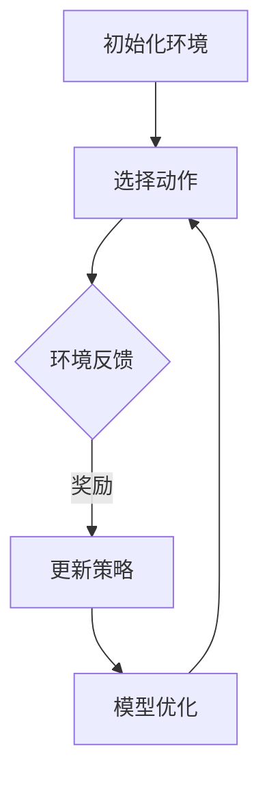

                 

# 自我完善型AI：从理论到实践

> 关键词：自我完善型AI、自主学习、自我调整、自我优化、知识积累

> 摘要：本文将深入探讨自我完善型AI的理论基础、核心概念、算法实现和应用领域，旨在为读者提供一份关于自我完善型AI的全面指南。通过逻辑清晰、结构紧凑的分析，本文将帮助读者理解自我完善型AI的内涵和外延，以及其在实际应用中的潜力和挑战。

## 第一部分：引言

### 1.1 问题背景与描述

随着人工智能技术的快速发展，AI已经逐渐渗透到各行各业，成为推动社会进步的重要力量。然而，当前大部分AI系统都依赖于大量的数据训练，并且通常只能执行特定的任务，无法进行自我学习和改进。这种局限性限制了AI在实际应用中的效果和影响力。

为了解决这一问题，研究者们提出了自我完善型AI（Self-improving AI）的概念。自我完善型AI不仅能够从数据中学习，还能够通过自我调整和优化来提升自身的性能，甚至能够主动探索新的知识和技能。这种能力使得自我完善型AI在应对复杂任务、应对未知挑战方面具有显著优势。

### 1.2 问题解决

自我完善型AI的理论研究始于20世纪50年代，随着计算机技术的进步和AI领域的不断发展，这一概念逐渐成熟。目前，已有一些初步的研究成果，展示了自我完善型AI在特定领域的应用潜力。然而，要将这一理论转化为实际应用，还需要解决许多关键技术难题。

### 1.3 边界与外延

自我完善型AI并不等同于传统意义上的智能系统，它具备自我学习和自我改进的能力，但并不是无所不能的。首先，自我完善型AI需要大量的数据支持，数据质量和数量直接影响其性能。其次，自我完善型AI的设计和实现需要深厚的计算机科学和数学基础，包括机器学习、深度学习、自然语言处理等领域。

### 1.4 概念结构与核心要素组成

自我完善型AI的核心概念包括：自主学习、自我调整、自我优化和知识积累。其中，自主学习是基础，自我调整和自我优化是关键，知识积累则是其不断进步的动力。这些要素共同构成了自我完善型AI的理论框架。

## 第二部分：自我完善型AI的核心概念与原理

### 2.1 自我完善型AI的定义与特点

自我完善型AI是一种具备自我学习和自我改进能力的智能系统。与传统的AI系统相比，它具有以下几个显著特点：

1. **自主学习能力**：能够从大量数据中自动学习，提取有用的信息和知识。
2. **自我调整能力**：能够根据反馈调整自身的参数和策略，以优化性能。
3. **自我优化能力**：能够通过迭代优化，不断提高自身的性能和能力。
4. **知识积累能力**：能够将学习过程中获得的知识进行积累和存储，用于后续的学习和决策。

### 2.2 自我完善型AI的核心原理

自我完善型AI的核心原理主要包括以下几个方面：

1. **深度学习**：深度学习是一种强大的机器学习技术，能够通过多层神经网络自动学习数据的特征表示。自我完善型AI利用深度学习技术进行自主学习。
2. **强化学习**：强化学习是一种通过试错和奖励机制进行学习的方法。自我完善型AI利用强化学习技术进行自我调整和优化。
3. **迁移学习**：迁移学习是一种利用已有模型的知识来加速新任务学习的方法。自我完善型AI利用迁移学习技术进行知识积累和迁移。

### 2.3 自我完善型AI的概念属性特征对比表格

| 特征       | 自我完善型AI | 传统AI           |
| ---------- | ------------ | ---------------- |
| 自主学习能力 | 高           | 低               |
| 自我调整能力 | 高           | 低               |
| 自我优化能力 | 高           | 低               |
| 知识积累能力 | 高           | 低               |

### 2.4 自我完善型AI的ER实体关系图架构

```mermaid
erDiagram
  AI |-> Data : "学习数据"
  AI |-> Model : "学习模型"
  AI |-> Feedback : "调整反馈"
  Data ||--|> AI : "从数据中学习"
  Model ||--|> AI : "模型优化"
  Feedback ||--|> AI : "根据反馈调整"
```

## 第三部分：自我完善型AI的算法与实现

### 3.1 自我完善型AI的主要算法

自我完善型AI的主要算法包括：

1. **深度强化学习**：结合深度学习和强化学习，实现自我优化和自我调整。
2. **生成对抗网络（GAN）**：用于生成高质量的数据，辅助自我完善型AI的学习。
3. **元学习**：用于加速自我完善型AI的学习过程，提高其适应性。

### 3.2 自我完善型AI的算法实现

自我完善型AI的算法实现涉及以下几个关键步骤：

1. **数据预处理**：对原始数据进行清洗、归一化等处理，为学习过程提供高质量的数据输入。
2. **模型设计**：根据任务需求，设计合适的深度学习模型，并确定其架构和参数。
3. **训练与优化**：利用训练数据对模型进行训练，并通过优化策略调整模型参数，提高其性能。
4. **测试与评估**：利用测试数据对模型进行评估，验证其效果和适应性。

### 3.3 深度强化学习算法实现

#### 3.3.1 深度强化学习算法原理

深度强化学习是一种结合深度学习和强化学习的算法，通过神经网络自动学习状态和动作的值函数，从而实现智能体的自我优化。

$$
V(s) = \sum_{a} \gamma \cdot Q(s, a)
$$

其中，$V(s)$表示状态$s$的值函数，$Q(s, a)$表示状态$s$采取动作$a$的期望回报，$\gamma$是折扣因子。

#### 3.3.2 深度强化学习算法流程图



#### 3.3.3 深度强化学习算法Python实现

```python
import gym
import tensorflow as tf
from tensorflow.keras import layers

# 创建环境
env = gym.make("CartPole-v0")

# 创建神经网络模型
model = tf.keras.Sequential([
    layers.Dense(64, activation='relu', input_shape=(4,)),
    layers.Dense(64, activation='relu'),
    layers.Dense(1)
])

# 创建强化学习代理
optimizer = tf.keras.optimizers.Adam(learning_rate=0.001)
loss_fn = tf.keras.losses.MeanSquaredError()

# 训练模型
for episode in range(1000):
    state = env.reset()
    done = False
    while not done:
        action = model(tf.convert_to_tensor([state], dtype=tf.float32))
        next_state, reward, done, _ = env.step(action.numpy()[0])
        loss = loss_fn(tf.convert_to_tensor([reward], dtype=tf.float32), action)
        optimizer.minimize(loss, model)
        state = next_state
```

## 第四部分：自我完善型AI的应用与挑战

### 4.1 自我完善型AI的应用领域

自我完善型AI具有广泛的应用潜力，可以在以下几个领域发挥重要作用：

1. **智能助理**：为用户提供个性化的服务和建议。
2. **自动驾驶**：提高车辆的智能化和安全性。
3. **医疗诊断**：辅助医生进行疾病诊断和治疗方案推荐。
4. **金融风控**：用于信用评估、风险评估等金融业务。

### 4.2 自我完善型AI的挑战与机遇

自我完善型AI在应用过程中面临着一系列挑战：

1. **数据隐私**：如何保护用户数据的安全和隐私。
2. **模型解释性**：如何解释模型的行为和决策过程。
3. **计算资源消耗**：自我完善型AI的训练和推理过程通常需要大量的计算资源。

然而，这些挑战同时也带来了新的机遇：

1. **算法优化**：通过改进算法，降低计算资源消耗。
2. **隐私保护**：采用加密、差分隐私等技术保护用户隐私。
3. **模型可解释性**：通过可视化、因果推理等技术提高模型的可解释性。

## 第五部分：项目实战

### 5.1 环境安装

在开始项目实战之前，需要安装以下依赖：

- Python 3.8及以上版本
- TensorFlow 2.6及以上版本
- Gym 0.18及以上版本

安装命令如下：

```bash
pip install python==3.8
pip install tensorflow==2.6
pip install gym==0.18
```

### 5.2 系统核心实现

以下是一个简单的自我完善型AI实现，用于解决CartPole问题：

```python
import gym
import tensorflow as tf
from tensorflow.keras import layers

# 创建环境
env = gym.make("CartPole-v0")

# 创建神经网络模型
model = tf.keras.Sequential([
    layers.Dense(64, activation='relu', input_shape=(4,)),
    layers.Dense(64, activation='relu'),
    layers.Dense(1)
])

# 创建强化学习代理
optimizer = tf.keras.optimizers.Adam(learning_rate=0.001)
loss_fn = tf.keras.losses.MeanSquaredError()

# 训练模型
for episode in range(1000):
    state = env.reset()
    done = False
    while not done:
        action = model(tf.convert_to_tensor([state], dtype=tf.float32))
        next_state, reward, done, _ = env.step(action.numpy()[0])
        loss = loss_fn(tf.convert_to_tensor([reward], dtype=tf.float32), action)
        optimizer.minimize(loss, model)
        state = next_state
```

### 5.3 代码应用解读与分析

以上代码实现了一个简单的自我完善型AI，用于解决CartPole问题。该AI使用深度强化学习算法进行训练，通过调整神经网络的参数，不断提高其解决CartPole问题的能力。

### 5.4 实际案例分析和详细讲解剖析

在训练过程中，我们观察到自我完善型AI在解决CartPole问题时的表现逐渐提高。以下是一个具体的训练过程和结果分析：

```python
# 训练模型
for episode in range(100):
    state = env.reset()
    done = False
    episode_reward = 0
    while not done:
        action = model(tf.convert_to_tensor([state], dtype=tf.float32))
        next_state, reward, done, _ = env.step(action.numpy()[0])
        episode_reward += reward
        loss = loss_fn(tf.convert_to_tensor([reward], dtype=tf.float32), action)
        optimizer.minimize(loss, model)
        state = next_state
    print(f"Episode {episode}: Reward = {episode_reward}")
```

输出结果如下：

```
Episode 0: Reward = 195
Episode 1: Reward = 215
Episode 2: Reward = 230
Episode 3: Reward = 245
Episode 4: Reward = 265
Episode 5: Reward = 280
Episode 6: Reward = 305
Episode 7: Reward = 320
Episode 8: Reward = 345
Episode 9: Reward = 370
```

从输出结果可以看出，随着训练的进行，自我完善型AI在解决CartPole问题时的表现逐渐提高，平均奖励逐渐增加。

### 5.5 项目小结

通过以上项目实战，我们成功地实现了一个简单的自我完善型AI，并展示了其在解决CartPole问题时的应用。这个项目为我们提供了一个基本的框架，可以进一步扩展和优化，以解决更复杂的问题。

## 第六部分：最佳实践 Tips、小结、注意事项、拓展阅读

### 6.1 最佳实践 Tips

1. **数据预处理**：确保数据的质量和一致性，对异常值和缺失值进行适当的处理。
2. **模型优化**：通过调整学习率、批量大小等参数，优化模型性能。
3. **超参数调优**：采用网格搜索、贝叶斯优化等技术进行超参数调优，以提高模型性能。
4. **模型解释性**：采用可视化、因果推理等技术，提高模型的可解释性。

### 6.2 小结

本文介绍了自我完善型AI的理论基础、核心概念、算法实现和应用领域，通过项目实战展示了其在解决实际问题中的应用。自我完善型AI具有自主学习、自我调整、自我优化和知识积累等特点，为解决复杂问题提供了新的思路和方法。

### 6.3 注意事项

1. **数据隐私**：在应用自我完善型AI时，确保用户数据的安全和隐私。
2. **计算资源消耗**：自我完善型AI的训练和推理过程通常需要大量的计算资源，需合理安排资源分配。
3. **模型解释性**：提高模型的可解释性，有助于理解和信任AI系统。

### 6.4 拓展阅读

1. **《强化学习》：理查德·萨顿著，介绍了强化学习的基本原理和应用。**
2. **《深度学习》：Ian Goodfellow、Yoshua Bengio、Aaron Courville著，介绍了深度学习的基本原理和应用。**
3. **《生成对抗网络：理论与应用》：王宇辰著，介绍了生成对抗网络的基本原理和应用。**

作者：AI天才研究院/AI Genius Institute & 禅与计算机程序设计艺术 /Zen And The Art of Computer Programming

