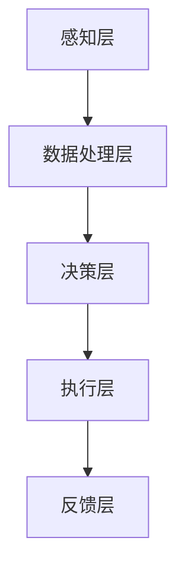
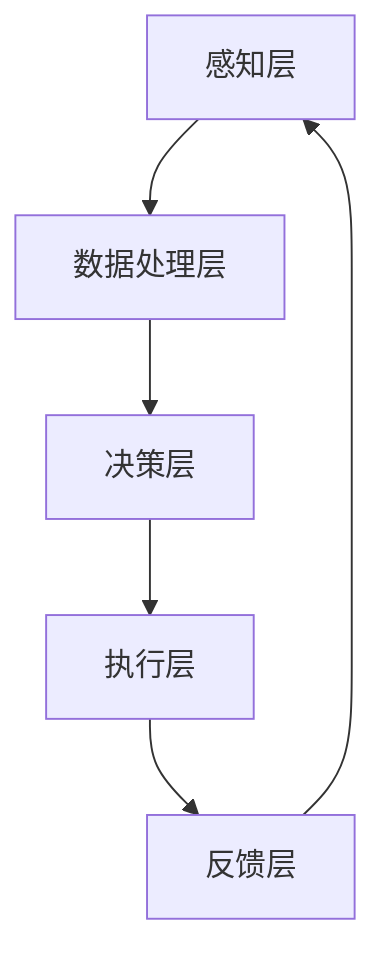
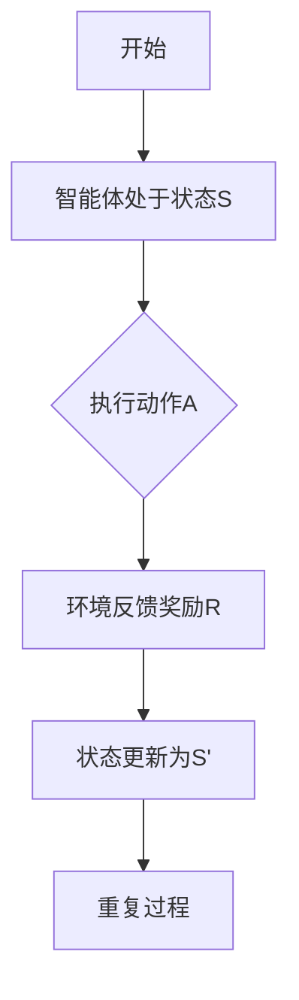
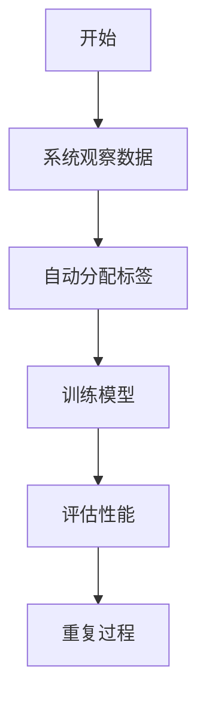
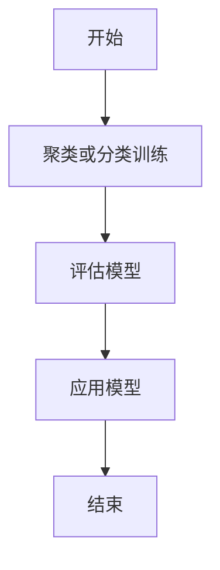
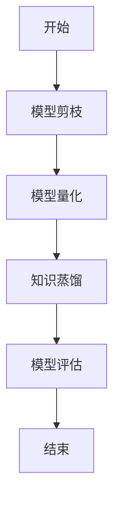

                 

# 自我完善型AI系统：设计原则与实现策略

关键词：自我完善型AI、设计原则、实现策略、AI系统架构、关键技术、实际应用

摘要：本文从自我完善型AI系统的背景、核心概念、设计原则、实现策略、架构设计、关键技术、实际应用场景以及未来展望等多个方面，系统性地探讨了自我完善型AI系统的设计原则与实现策略。文章旨在为读者提供一个清晰、全面的理解框架，以应对未来AI系统发展的挑战。

## 引言与背景介绍

### 第1章: AI系统自我完善的必要性

#### 1.1.1 AI系统自我完善的背景

随着人工智能技术的飞速发展，AI系统已经在各个领域取得了显著的成果。然而，传统AI系统存在一定的局限性，主要体现在依赖大量人工干预、难以应对复杂环境和不确定性等问题。为了解决这些问题，自我完善型AI系统应运而生。

#### 1.1.2 AI系统自我完善的重要性

自我完善型AI系统能够在运行过程中不断学习和优化自身，提高系统的适应性和鲁棒性，从而更好地应对复杂多变的环境。这对于提升AI系统的应用价值、降低维护成本具有重要意义。

#### 1.1.3 AI系统自我完善的挑战

实现自我完善型AI系统面临诸多挑战，包括数据获取、算法设计、硬件支持、安全性保障等方面。如何克服这些挑战，构建一个高效、安全的自我完善型AI系统，是当前研究的重点。

### 第2章: 自我完善型AI系统的核心概念

#### 2.1.1 自我完善型AI系统的定义

自我完善型AI系统是指具有自我学习、自我纠正、自我优化、自我进化等能力，能够在运行过程中不断优化自身性能的AI系统。

#### 2.1.2 自我完善型AI系统的特点

自我完善型AI系统具有以下几个特点：

1. **自我学习**：系统能够从数据中自动学习和提取知识，提高自身的性能。
2. **自我纠正**：系统能够在错误发生时自动纠正，降低错误对系统的影响。
3. **自我优化**：系统能够根据性能指标不断调整自身参数，提高系统的效率。
4. **自我进化**：系统能够在长期运行过程中不断进化，适应新的环境和任务。

#### 2.1.3 自我完善型AI系统的核心要素

自我完善型AI系统的核心要素包括数据、算法、硬件、安全等方面。这些要素相互关联，共同决定了系统的性能和稳定性。

## 第3章: 自我完善型AI系统的设计原则

### 3.1.1 自我学习与适应性原则

自我学习与适应性原则要求AI系统能够从环境中不断学习和适应，提高系统的鲁棒性和适应性。

### 3.1.2 自我纠正与容错性原则

自我纠正与容错性原则要求AI系统在运行过程中能够检测和纠正错误，保证系统的稳定性和可靠性。

### 3.1.3 自我优化与效率性原则

自我优化与效率性原则要求AI系统在运行过程中能够根据性能指标进行优化，提高系统的效率和性能。

### 3.1.4 自我进化与创新能力原则

自我进化与创新能力原则要求AI系统在长期运行过程中能够不断进化，适应新的环境和任务，提高系统的创新能力和竞争力。

## 第4章: 自我完善型AI系统的实现策略

### 4.1.1 数据驱动策略

数据驱动策略要求AI系统以数据为基础，通过数据挖掘和统计分析来提高系统的性能。

### 4.1.2 算法优化策略

算法优化策略要求AI系统在算法设计上不断创新，提高算法的效率和准确性。

### 4.1.3 硬件支持策略

硬件支持策略要求AI系统在硬件方面进行优化，提高系统的计算能力和性能。

### 4.1.4 安全性保障策略

安全性保障策略要求AI系统在设计和实现过程中充分考虑安全性问题，确保系统的安全和稳定运行。

## 第5章: 自我完善型AI系统的架构设计

### 5.1.1 自我完善型AI系统的架构概述

自我完善型AI系统通常包括感知层、决策层、执行层等多个层次，各层次之间相互协作，共同实现系统的功能。

### 5.1.2 自我完善型AI系统的层次结构

自我完善型AI系统的层次结构如图所示：



### 5.1.3 自我完善型AI系统的关键模块设计

自我完善型AI系统的关键模块包括感知模块、数据处理模块、决策模块、执行模块和反馈模块。各模块的具体功能和设计要求如下：

1. **感知模块**：负责接收外部环境的信息，包括图像、声音、文本等。
2. **数据处理模块**：负责对感知模块收集的数据进行处理和清洗，为决策模块提供高质量的输入。
3. **决策模块**：负责根据输入数据生成决策，指导执行模块的行动。
4. **执行模块**：负责执行决策模块生成的决策，实现具体任务。
5. **反馈模块**：负责收集执行模块的反馈信息，用于优化感知模块和决策模块的性能。

## 第6章: 自我完善型AI系统的关键技术与算法

### 6.1.1 强化学习算法

强化学习算法是一种自我完善型AI系统的核心技术，通过奖励机制和试错学习来优化系统的行为。

### 6.1.2 自监督学习算法

自监督学习算法是一种无需人工标注数据的自我完善型学习算法，通过无监督学习来提高系统的性能。

### 6.1.3 聚类与分类算法

聚类与分类算法是自我完善型AI系统常用的技术，用于对数据进行分类和聚类，帮助系统更好地理解环境。

### 6.1.4 模型压缩与优化算法

模型压缩与优化算法是一种降低模型复杂度和提高模型效率的技术，有助于提升自我完善型AI系统的性能。

## 第7章: 自我完善型AI系统的实际应用场景

### 7.1.1 金融领域的应用

在金融领域，自我完善型AI系统可以用于风险控制、投资决策、客户服务等方面。

### 7.1.2 医疗健康领域的应用

在医疗健康领域，自我完善型AI系统可以用于疾病诊断、治疗方案优化、健康管理等。

### 7.1.3 交通运输领域的应用

在交通运输领域，自我完善型AI系统可以用于自动驾驶、交通管理、智能导航等方面。

### 7.1.4 制造业领域的应用

在制造业领域，自我完善型AI系统可以用于生产优化、质量检测、设备维护等方面。

## 第8章: 案例研究——自我完善型AI系统实践案例

### 8.1.1 案例背景介绍

以某智能交通系统为例，介绍自我完善型AI系统在交通运输领域的应用。

### 8.1.2 案例系统设计与实现

详细描述案例系统的设计思路、实现过程和关键技术。

### 8.1.3 案例效果评估与分析

对案例系统的效果进行评估和分析，总结经验教训。

### 8.1.4 案例总结与启示

从案例中总结经验，为未来自我完善型AI系统的研发提供启示。

## 第9章: 自我完善型AI系统的发展趋势与未来展望

### 9.1.1 技术发展趋势

展望未来，自我完善型AI系统将在算法、硬件、安全等方面取得重大突破。

### 9.1.2 应用领域拓展

随着技术的不断进步，自我完善型AI系统将在更多领域得到应用。

### 9.1.3 安全性与伦理问题

在自我完善型AI系统的发展过程中，安全性和伦理问题将越来越受到关注。

### 9.1.4 未来展望

对未来自我完善型AI系统的发展方向进行展望，为读者提供参考。

## 第10章: 总结与展望

### 10.1.1 全书总结

对全书内容进行总结，强调自我完善型AI系统的重要性。

### 10.1.2 对未来研究的展望

对未来自我完善型AI系统的研究方向进行展望，提出建议。

作者：AI天才研究院/AI Genius Institute & 禅与计算机程序设计艺术 /Zen And The Art of Computer Programming# 第1章: AI系统自我完善的必要性

## 1.1 AI系统自我完善的背景

人工智能（AI）作为计算机科学的一个分支，近年来取得了飞速的发展。AI技术的应用已经深入到各行各业，如金融、医疗、交通、制造业等。然而，传统的AI系统大多依赖于人类专家提供的先验知识和大量的标注数据，这使得它们在处理复杂问题和不确定性环境时存在一定的局限性。例如，当面对一个新的、未知的场景时，传统AI系统往往需要重新训练或调整参数，这既耗时又费力。为了克服这一局限性，研究者们开始关注具有自我完善能力的AI系统。

自我完善型AI系统，顾名思义，是指能够在运行过程中通过自我学习和优化来提高自身性能的AI系统。这种系统能够从环境中学习新的知识和技能，自动纠正错误，并不断优化自身的参数和模型。这种能力使得自我完善型AI系统在应对复杂、动态和不确定的环境时具有更高的灵活性和鲁棒性。

### 1.1.2 AI系统自我完善的重要性

AI系统自我完善的重要性主要体现在以下几个方面：

1. **提高适应能力**：自我完善型AI系统能够在运行过程中不断学习新的知识和技能，从而更好地适应新的环境和任务。这对于那些需要实时响应和调整的领域，如自动驾驶、智能客服等，尤为重要。

2. **减少人工干预**：传统AI系统的训练和优化往往需要大量的人为干预，而自我完善型AI系统能够在一定程度上减少这种干预，降低维护成本，提高系统的自动化水平。

3. **提高效率和性能**：自我完善型AI系统能够在运行过程中不断优化自身的参数和模型，从而提高系统的效率和性能。这种优化可以是基于性能指标的自动化调整，也可以是通过对数据的深度挖掘和分析来实现的。

4. **增强系统鲁棒性**：自我完善型AI系统能够在错误发生时自动纠正，从而提高系统的鲁棒性。这对于那些需要高可靠性的应用场景，如医疗诊断、金融交易等，具有重要意义。

### 1.1.3 AI系统自我完善的挑战

虽然自我完善型AI系统具有许多优势，但其实现面临着诸多挑战：

1. **数据获取**：自我完善型AI系统需要大量的高质量数据来训练和优化模型。然而，在实际应用中，获取这些数据可能非常困难，特别是在那些数据隐私保护严格的领域。

2. **算法设计**：自我完善型AI系统需要高效的算法来处理大量的数据，并能够在运行过程中自动调整参数。设计这样的算法是一个巨大的挑战，需要深入理解AI系统的原理和特性。

3. **硬件支持**：自我完善型AI系统通常需要强大的计算能力和存储能力来处理和存储大量的数据。然而，高性能的硬件通常成本较高，如何在预算有限的情况下满足系统需求是一个问题。

4. **安全性保障**：自我完善型AI系统在自我学习和优化的过程中可能会出现偏差或错误，这可能会对系统的安全性和稳定性产生负面影响。如何确保系统的安全性是一个需要深入研究的问题。

综上所述，AI系统自我完善具有重要的背景和意义，但实现这一目标仍然面临着诸多挑战。在接下来的章节中，我们将深入探讨自我完善型AI系统的核心概念、设计原则、实现策略、架构设计、关键技术与算法，以及其实际应用场景，为读者提供一个全面的理解和认识。

## 第2章: 自我完善型AI系统的核心概念

## 2.1 自我完善型AI系统的定义

自我完善型AI系统（Self-improving AI system）是指能够在运行过程中通过自我学习、自我纠正和自我优化等机制，不断提高自身性能和适应能力的AI系统。与传统的AI系统相比，自我完善型AI系统具有更高的自主性、灵活性和鲁棒性，能够在复杂和动态的环境中持续进化，以更好地满足实际应用需求。

自我完善型AI系统的核心特点包括：

1. **自我学习**：系统能够从数据中自动学习和提取知识，通过机器学习、深度学习等算法不断优化自身的模型和策略。

2. **自我纠正**：系统能够在错误发生时自动检测和纠正，通过容错机制和反馈机制提高系统的鲁棒性和可靠性。

3. **自我优化**：系统能够根据性能指标和目标函数，自动调整自身的参数和策略，以实现性能的最优化。

4. **自我进化**：系统能够在长期运行过程中不断积累经验，通过迭代学习和进化机制，提高系统的适应能力和创新能力。

### 2.1.2 自我完善型AI系统的特点

自我完善型AI系统的特点主要体现在以下几个方面：

1. **自主性**：系统能够自主运行，无需大量的人为干预。它可以根据环境变化和任务需求，自动调整自身的策略和行为。

2. **灵活性**：系统能够适应不同的环境和任务，通过自我学习和自我优化，提高系统的适应能力。

3. **鲁棒性**：系统能够在错误发生时自动纠正，通过容错机制和反馈机制，提高系统的鲁棒性和稳定性。

4. **进化性**：系统能够在长期运行过程中不断进化，通过积累经验，提高系统的适应能力和创新能力。

5. **效率性**：系统能够根据性能指标和目标函数，自动调整自身的参数和策略，实现性能的最优化。

### 2.1.3 自我完善型AI系统的核心要素

自我完善型AI系统的核心要素包括数据、算法、硬件和安全性等，这些要素相互关联，共同决定了系统的性能和稳定性。

1. **数据**：数据是自我完善型AI系统的基石。系统需要大量的高质量数据来进行训练和优化模型。这些数据可以来自各种来源，如传感器数据、用户行为数据、历史交易数据等。

2. **算法**：算法是实现自我完善的关键。系统需要高效的算法来处理和挖掘数据，以提取有价值的信息。常见的算法包括机器学习、深度学习、强化学习等。

3. **硬件**：硬件是系统运行的基础。高性能的硬件可以提供强大的计算能力和存储能力，以满足系统对数据处理的巨大需求。

4. **安全性**：安全性是自我完善型AI系统的重要保障。系统需要采取一系列安全措施，如数据加密、访问控制等，以确保系统的安全和稳定运行。

通过以上核心概念的介绍，我们可以对自我完善型AI系统有一个初步的认识。在接下来的章节中，我们将进一步探讨自我完善型AI系统的设计原则、实现策略、架构设计、关键技术、实际应用场景以及未来展望，为读者提供一个全面、深入的理解。

### 第3章: 自我完善型AI系统的设计原则

自我完善型AI系统的设计原则是构建一个高效、稳定和安全的AI系统的基础。这些原则不仅指导系统的设计过程，也确保系统在运行过程中能够持续自我优化和进化。以下是几个关键的设计原则：

#### 3.1.1 自我学习与适应性原则

自我学习与适应性原则强调AI系统能够从数据中自动学习和提取知识，并通过不断调整自身的行为和策略来适应环境变化。具体来说，这一原则要求系统具备以下特点：

1. **数据驱动**：系统应能够自动收集和处理大量数据，利用这些数据来优化模型和算法。

2. **动态调整**：系统能够根据环境变化和任务需求，动态调整自身的参数和策略。

3. **持续学习**：系统能够在运行过程中不断积累经验，通过迭代学习和进化机制，提高自身的性能和适应能力。

4. **模型更新**：系统应能够自动更新和优化模型，以适应新的数据和需求。

#### 3.1.2 自我纠正与容错性原则

自我纠正与容错性原则要求AI系统在运行过程中能够检测和纠正错误，确保系统的稳定性和可靠性。实现这一原则的关键包括：

1. **错误检测**：系统能够自动检测运行过程中的错误和异常。

2. **自动纠正**：当错误发生时，系统能够自动采取措施进行纠正，以减少错误对系统的影响。

3. **冗余设计**：系统应具备一定的冗余度，通过冗余设计和备份机制来提高系统的容错能力。

4. **反馈机制**：系统应建立有效的反馈机制，通过收集和分析错误数据，优化和改进自身。

#### 3.1.3 自我优化与效率性原则

自我优化与效率性原则要求AI系统在运行过程中能够根据性能指标和目标函数，自动调整自身的参数和策略，以实现性能的最优化。这一原则包括以下几个方面：

1. **性能监控**：系统应能够实时监控自身的性能指标，如响应时间、准确率、能耗等。

2. **参数调整**：系统能够根据性能监控结果，自动调整模型的参数和策略。

3. **优化算法**：系统应采用高效的优化算法，如遗传算法、粒子群优化等，以提高调整效率和效果。

4. **目标函数**：系统应定义明确的目标函数，以便在优化过程中有明确的目标和方向。

#### 3.1.4 自我进化与创新能力原则

自我进化与创新能力原则要求AI系统能够在长期运行过程中不断进化，通过积累经验，提高系统的适应能力和创新能力。这一原则的核心包括：

1. **经验积累**：系统应能够自动记录和存储运行过程中的经验和教训，用于后续的优化和改进。

2. **创新能力**：系统能够通过自我学习和优化，不断产生新的想法和解决方案，以提高系统的创新能力。

3. **进化机制**：系统应具备进化机制，通过迭代学习和进化算法，实现系统的持续进化。

4. **模型融合**：系统应能够整合多个模型和算法，通过模型融合和协同学习，提高系统的综合性能。

通过以上设计原则，自我完善型AI系统不仅能够在短时间内适应新环境和任务，还能在长期运行过程中不断优化和进化，从而实现更高的性能和更广泛的应用。在接下来的章节中，我们将进一步探讨如何实现这些原则，并介绍具体的实现策略和关键技术。

### 第4章: 自我完善型AI系统的实现策略

实现自我完善型AI系统需要综合运用多种策略，包括数据驱动策略、算法优化策略、硬件支持策略和安全性保障策略。以下是这些策略的详细描述：

#### 4.1.1 数据驱动策略

数据驱动策略是自我完善型AI系统的核心。它依赖于大量的高质量数据来训练和优化模型。以下是一些关键步骤：

1. **数据收集**：系统需要从各种渠道收集数据，包括历史数据、实时数据、用户行为数据等。

2. **数据预处理**：对收集到的数据进行清洗、去噪和标准化，以确保数据的质量和一致性。

3. **数据存储**：采用高效的数据存储和管理系统，如分布式存储、NoSQL数据库等，以支持大规模数据的存储和查询。

4. **数据挖掘**：利用机器学习和数据挖掘技术，从数据中提取有价值的信息和模式，为模型训练提供基础。

5. **模型训练**：使用大量数据训练模型，通过迭代优化模型参数，提高模型的准确性和鲁棒性。

6. **在线学习**：系统应具备在线学习的能力，能够实时更新和调整模型，以适应环境变化和新的数据。

#### 4.1.2 算法优化策略

算法优化策略是实现自我完善型AI系统性能提升的关键。以下是一些优化方法：

1. **算法选择**：根据应用场景和数据特性，选择合适的机器学习算法，如深度学习、强化学习、聚类与分类算法等。

2. **模型压缩**：通过模型压缩技术，如知识蒸馏、剪枝、量化等，减少模型的复杂度和计算资源需求。

3. **并行计算**：利用并行计算技术，如GPU加速、分布式计算等，提高模型的训练和推理速度。

4. **自适应算法**：开发自适应算法，根据系统的运行状态和性能指标，动态调整算法的参数和策略。

5. **算法融合**：将多个算法融合在一起，通过协同学习和模型集成，提高系统的整体性能。

#### 4.1.3 硬件支持策略

硬件支持策略是自我完善型AI系统能够高效运行的基础。以下是一些关键点：

1. **高性能计算**：选择高性能的CPU、GPU、FPGA等硬件设备，以满足大规模数据处理的计算需求。

2. **存储优化**：采用高速存储设备，如SSD、HDD等，提高数据读取和写入速度。

3. **网络优化**：优化网络架构和通信协议，提高数据传输的效率和可靠性。

4. **硬件冗余**：采用冗余设计和备份机制，提高系统的容错能力和可靠性。

5. **硬件维护**：定期对硬件进行维护和升级，确保系统长期稳定运行。

#### 4.1.4 安全性保障策略

安全性保障策略是自我完善型AI系统能够可靠运行的重要保障。以下是一些关键措施：

1. **数据加密**：对数据进行加密，确保数据在传输和存储过程中的安全性。

2. **访问控制**：实施严格的访问控制策略，确保只有授权用户才能访问系统的敏感数据和功能。

3. **安全审计**：建立安全审计机制，定期检查系统的安全漏洞和潜在风险。

4. **异常检测**：利用机器学习和数据分析技术，实时监控系统的运行状态，检测和防范异常行为。

5. **合规性检查**：确保系统符合相关的法律法规和标准，如GDPR、ISO等。

通过以上实现策略，自我完善型AI系统不仅能够高效地处理和利用数据，还能在不断学习和优化的过程中保持高性能和安全性。在下一章节中，我们将深入探讨自我完善型AI系统的架构设计，进一步了解其内部结构和模块设计。

### 第5章: 自我完善型AI系统的架构设计

自我完善型AI系统的架构设计是确保系统高效、稳定和灵活运行的关键。一个典型的自我完善型AI系统架构通常包括感知层、数据处理层、决策层和执行层等多个层次。以下是这些层次的具体描述和相互关系。

#### 5.1.1 自我完善型AI系统的架构概述

自我完善型AI系统的架构可以视为一个分层结构，每个层次都有其特定的功能和职责。整体架构如图所示：


1. **感知层**：感知层是系统的输入接口，负责收集和处理来自外部环境的数据。这些数据可以是图像、声音、文本等，通过传感器、摄像头、麦克风等设备进行采集。感知层的核心功能是数据的预处理，包括去噪、归一化、特征提取等。

2. **数据处理层**：数据处理层负责对感知层收集的数据进行进一步处理和分析。这一层通常包括数据清洗、数据整合、特征工程等过程。通过这些处理，系统可以提取出有用的信息，为后续的决策提供支持。

3. **决策层**：决策层是系统的核心部分，负责根据处理后的数据生成决策。这一层通常采用机器学习、深度学习、强化学习等算法来构建模型，并根据模型的预测结果做出决策。决策层的功能包括模式识别、分类、预测等。

4. **执行层**：执行层负责将决策层生成的决策付诸实施。这一层通常与外部设备或系统进行交互，执行具体的任务。执行层包括控制信号生成、执行路径规划、设备操作等过程。

5. **反馈层**：反馈层是系统的输出接口，负责收集执行层的结果和反馈信息，并将其返回给感知层和决策层。这些反馈信息用于模型优化和系统调整，从而实现系统的自我完善。

#### 5.1.2 自我完善型AI系统的层次结构

自我完善型AI系统的层次结构如图所示：



在这种结构中，反馈层的信息可以实时反馈到感知层和决策层，形成一个闭环系统。这种闭环设计使得系统能够在运行过程中不断学习和优化，从而提高系统的性能和适应性。

#### 5.1.3 自我完善型AI系统的关键模块设计

自我完善型AI系统的关键模块设计是实现系统功能和性能优化的重要环节。以下是各个关键模块的具体设计：

1. **感知模块**：感知模块负责数据的采集和预处理。它包括传感器接口、数据采集单元、预处理算法等。感知模块的设计要求高精度、低延迟和稳定性。

2. **数据处理模块**：数据处理模块负责对感知模块收集的数据进行进一步处理和分析。它包括数据清洗、特征提取、数据整合等。数据处理模块的设计要求高效性和准确性。

3. **决策模块**：决策模块负责根据处理后的数据生成决策。它包括模型训练、预测、决策规则等。决策模块的设计要求灵活性和鲁棒性。

4. **执行模块**：执行模块负责将决策付诸实施。它包括控制信号生成、执行路径规划、设备操作等。执行模块的设计要求高效率和可靠性。

5. **反馈模块**：反馈模块负责收集执行层的结果和反馈信息，并将其返回给感知层和决策层。它包括反馈信号采集、数据分析、模型优化等。反馈模块的设计要求实时性和准确性。

通过以上关键模块的设计，自我完善型AI系统可以实现对数据的全面处理、决策的智能生成和执行的精准执行，从而实现系统的自我完善和性能提升。

### 第6章: 自我完善型AI系统的关键技术与算法

自我完善型AI系统的核心在于其自我学习和优化能力，这离不开一系列先进的技术和算法。在本章中，我们将探讨几种关键的算法，包括强化学习算法、自监督学习算法、聚类与分类算法以及模型压缩与优化算法。

#### 6.1.1 强化学习算法

强化学习（Reinforcement Learning，RL）是一种通过试错和奖励机制来学习的算法。它主要由智能体（Agent）、环境（Environment）和动作（Action）三部分组成。强化学习算法的核心目标是通过智能体的自主探索和反馈，使其在环境中获得最大的累积奖励。

**算法原理**：
强化学习算法基于一个马尔可夫决策过程（MDP），其中智能体在状态（State）下执行动作（Action），并获得即时奖励（Reward）。智能体的目标是最大化未来的累积奖励。通过不断重复这个过程，智能体逐渐学习到最佳策略（Policy）。

**流程图**：



**Python代码示例**：

```python
import numpy as np
import random

# 定义环境
class Environment:
    def step(self, action):
        # 模拟环境状态变化
        if action == 0:
            state = 1
            reward = 1
        elif action == 1:
            state = 0
            reward = 0
        return state, reward

# 定义强化学习算法
class QLearning:
    def __init__(self, actions, learning_rate=0.1, discount_factor=0.9):
        self.actions = actions
        self.learning_rate = learning_rate
        self.discount_factor = discount_factor
        self.q_values = np.zeros((2, len(actions)))

    def choose_action(self, state):
        # 选择动作
        action_values = self.q_values[state]
        return np.argmax(action_values)

    def learn(self, state, action, reward, next_state, done):
        # 更新Q值
        if not done:
            target_q = reward + self.discount_factor * np.max(self.q_values[next_state])
        else:
            target_q = reward

        current_q = self.q_values[state, action]
        self.q_values[state, action] += self.learning_rate * (target_q - current_q)

# 演示算法
env = Environment()
agent = QLearning(actions=[0, 1])

for episode in range(1000):
    state = random.randint(0, 1)
    done = False
    while not done:
        action = agent.choose_action(state)
        next_state, reward = env.step(action)
        agent.learn(state, action, reward, next_state, done)
        state = next_state
        done = next_state == 1

# 打印学习到的Q值
print(agent.q_values)
```

**数学模型**：

强化学习算法的Q值更新公式为：

$$ Q(s, a) \leftarrow Q(s, a) + \alpha [r + \gamma \max_{a'} Q(s', a') - Q(s, a)] $$

其中，$Q(s, a)$是状态s下的动作a的Q值，$\alpha$是学习率，$r$是即时奖励，$\gamma$是折扣因子，$s'$是下一个状态，$a'$是下一个动作。

**示例**：

假设智能体在状态S=0时，执行动作A=0，获得即时奖励R=1。接下来，智能体更新其Q值：

$$ Q(0, 0) \leftarrow Q(0, 0) + \alpha [1 + \gamma \max_{a'} Q(1, a')] - Q(0, 0) $$

通过不断迭代更新Q值，智能体最终会学习到最佳策略。

#### 6.1.2 自监督学习算法

自监督学习（Self-supervised Learning）是一种无需人工标注数据的学习方法，通过利用数据的内在结构来提取有用信息。自监督学习算法通常分为两种类型：基于标签的自监督学习和无标签的自监督学习。

**算法原理**：
自监督学习算法通过设计任务，使得系统在不需要人工标注的情况下，自动学习数据的特征表示。这种方法不仅节省了标注成本，还能处理大量无标签数据。

**流程图**：



**Python代码示例**：

```python
import torch
import torchvision
import torchvision.transforms as transforms
from torch.utils.data import DataLoader
from torchvision.models import resnet18
import torch.nn as nn

# 定义数据集
transform = transforms.Compose([
    transforms.ToTensor(),
    transforms.Normalize((0.5, 0.5, 0.5), (0.5, 0.5, 0.5)),
])

trainset = torchvision.datasets.CIFAR10(
    root='./data', train=True, download=True, transform=transform)
trainloader = DataLoader(trainset, batch_size=4,
                                          shuffle=True, num_workers=2)

# 定义自监督学习模型
class SelfSupervisedModel(nn.Module):
    def __init__(self):
        super(SelfSupervisedModel, self).__init__()
        self.resnet = resnet18(pretrained=True)
        self.fc = nn.Linear(512, 10)

    def forward(self, x):
        x = self.resnet(x)
        x = self.fc(x)
        return x

model = SelfSupervisedModel()
optimizer = torch.optim.Adam(model.parameters(), lr=0.001)
criterion = nn.CrossEntropyLoss()

# 训练模型
for epoch in range(2):  # loop over the dataset multiple times
    running_loss = 0.0
    for i, data in enumerate(trainloader, 0):
        inputs, _ = data
        optimizer.zero_grad()
        outputs = model(inputs)
        loss = criterion(outputs, torch.randint(0, 10, (batch_size,)))
        loss.backward()
        optimizer.step()
        running_loss += loss.item()
    print(f'Epoch {epoch+1}, loss: {running_loss/len(trainloader)}')
print('Finished Training')

# 评估模型
correct = 0
total = 0
with torch.no_grad():
    for data in trainloader:
        images, labels = data
        outputs = model(images)
        _, predicted = torch.max(outputs.data, 1)
        total += labels.size(0)
        correct += (predicted == labels).sum().item()

print(f'Accuracy of the network on the train images: {100 * correct / total}%')
```

**数学模型**：

自监督学习算法的核心任务是构建一个特征提取器，该特征提取器能够从数据中提取有用的特征表示。通常，自监督学习算法会设计一个自监督损失函数，用于衡量特征表示的质量。常见的自监督损失函数包括对比损失、三元组损失等。

#### 6.1.3 聚类与分类算法

聚类（Clustering）和分类（Classification）是数据挖掘和机器学习中的两种基本任务。聚类旨在将数据分为若干个组，使得组内的数据点之间相似度较高，组与组之间的相似度较低。分类则旨在将数据点分配到预先定义的类别中。

**算法原理**：

1. **聚类算法**：聚类算法通过某种距离度量或相似性度量来分组数据。常见的聚类算法包括K-means、DBSCAN、层次聚类等。

2. **分类算法**：分类算法通过训练模型来学习数据的特征和类别之间的映射关系。常见的分类算法包括逻辑回归、支持向量机、决策树、随机森林等。

**流程图**：



**Python代码示例**：

```python
from sklearn.cluster import KMeans
import numpy as np

# 假设我们有一组数据
X = np.array([[1, 2], [1, 4], [1, 0],
              [10, 2], [10, 4], [10, 0]])

# 使用K-means算法进行聚类
kmeans = KMeans(n_clusters=2, random_state=0).fit(X)
predicted = kmeans.predict(X)

print(f"Cluster centers: {kmeans.cluster_centers_}")
print(f"Predicted labels: {predicted}")
```

**数学模型**：

1. **K-means聚类**：K-means聚类通过最小化平方误差来划分数据。目标函数为：

   $$ J = \sum_{i=1}^{n} \sum_{j=1}^{k} (x_i - \mu_j)^2 $$

   其中，$x_i$是数据点，$\mu_j$是第j个簇的中心。

2. **分类算法**：以逻辑回归为例，其目标函数为：

   $$ \log(P(Y=1|X)) = \beta_0 + \sum_{i=1}^{n} \beta_i x_i $$

   其中，$P(Y=1|X)$是给定特征X下类别Y为1的概率，$\beta_0$是截距，$\beta_i$是特征系数。

#### 6.1.4 模型压缩与优化算法

模型压缩与优化算法旨在减少模型的参数数量和计算量，以提高模型在资源受限环境中的运行效率。常见的模型压缩方法包括剪枝、量化、知识蒸馏等。

**算法原理**：

1. **剪枝**：通过移除模型中不重要的参数或权重，减少模型的复杂度。

2. **量化**：将模型的浮点数参数转换为低精度表示，如8位整数，以减少模型的大小和计算量。

3. **知识蒸馏**：通过将大型模型的知识迁移到小型模型中，实现模型的压缩和优化。

**流程图**：



**Python代码示例**：

```python
import torch
import torchvision.models as models
from torch.quantization import quantize_dynamic

# 加载预训练的ResNet模型
model = models.resnet50(pretrained=True)

# 使用剪枝技术进行模型压缩
model = torch.nn.utils.prune pruning_mask(model, "conv1", amount=0.5)

# 使用量化技术进行模型优化
model = quantize_dynamic(model, {torch.nn.Linear}, dtype=torch.qint8)

# 打印压缩后的模型参数数量
print(f"Number of parameters in the pruned and quantized model: {sum(p.numel() for p in model.parameters())}")
```

**数学模型**：

1. **剪枝**：通过剪枝操作，可以减少模型的参数数量，从而降低计算复杂度和内存占用。剪枝的目标是最小化剪枝后的模型与原始模型的误差。

2. **量化**：量化技术通过将浮点数参数转换为低精度整数表示，降低模型的计算量和存储需求。量化过程中需要考虑量化误差，以确保模型性能不受显著影响。

3. **知识蒸馏**：知识蒸馏是一种将大型模型的知识迁移到小型模型中的方法。通过训练一个小型模型，使其能够模拟大型模型的输出，从而实现模型的压缩和优化。

通过以上关键技术和算法，自我完善型AI系统可以在不断学习和优化的过程中，提高自身的性能和适应性，从而更好地应对复杂和动态的环境。在下一章节中，我们将探讨自我完善型AI系统在不同实际应用场景中的具体应用。

### 第7章: 自我完善型AI系统的实际应用场景

自我完善型AI系统由于其自我学习和优化的特性，在许多实际应用场景中展现出了巨大的潜力和优势。以下将介绍自我完善型AI系统在金融、医疗健康、交通运输和制造业等领域的应用场景。

#### 7.1.1 金融领域的应用

在金融领域，自我完善型AI系统可以用于风险控制、投资决策、信用评分、市场预测等方面。

1. **风险控制**：自我完善型AI系统可以实时监控市场动态，通过分析历史数据和实时数据，识别潜在的风险并自动调整风险敞口。

2. **投资决策**：自我完善型AI系统可以通过自我学习和优化，根据市场趋势和用户偏好，为投资者提供个性化的投资建议。

3. **信用评分**：自我完善型AI系统可以利用用户的历史交易记录、信用记录等信息，自动评估用户的信用风险，并实时更新信用评分。

4. **市场预测**：自我完善型AI系统可以通过分析市场数据，预测市场走势，为金融机构提供投资策略和风险管理建议。

#### 7.1.2 医疗健康领域的应用

在医疗健康领域，自我完善型AI系统可以用于疾病诊断、治疗方案优化、健康管理等方面。

1. **疾病诊断**：自我完善型AI系统可以通过分析医学影像、实验室数据等，自动诊断疾病，并提供诊断建议。

2. **治疗方案优化**：自我完善型AI系统可以根据患者的病史、体征等信息，为医生提供个性化的治疗方案，并实时更新和优化治疗方案。

3. **健康管理**：自我完善型AI系统可以监控患者的健康状况，通过分析健康数据，提供健康建议和预防措施。

#### 7.1.3 交通运输领域的应用

在交通运输领域，自我完善型AI系统可以用于自动驾驶、交通管理、智能导航等方面。

1. **自动驾驶**：自我完善型AI系统可以通过分析道路环境、车辆状态等信息，实现自动驾驶，提高交通效率和安全性。

2. **交通管理**：自我完善型AI系统可以通过实时分析交通流量，优化交通信号控制，提高道路通行能力。

3. **智能导航**：自我完善型AI系统可以根据实时路况信息，为驾驶员提供最优的导航路线，减少行车时间和油耗。

#### 7.1.4 制造业领域的应用

在制造业领域，自我完善型AI系统可以用于生产优化、质量检测、设备维护等方面。

1. **生产优化**：自我完善型AI系统可以通过分析生产数据，优化生产流程，提高生产效率和产品质量。

2. **质量检测**：自我完善型AI系统可以通过图像识别、传感器数据等，实时检测产品质量，提高产品合格率。

3. **设备维护**：自我完善型AI系统可以通过分析设备运行数据，预测设备故障，实现预防性维护，减少设备停机时间和维护成本。

通过在不同领域的应用，自我完善型AI系统展现出了其广泛的应用前景和巨大的商业价值。在下一章节中，我们将通过一个具体的案例研究，深入探讨自我完善型AI系统的实践应用。

### 案例研究——自我完善型AI系统在智能交通系统中的应用

#### 8.1.1 案例背景介绍

随着城市化进程的加速，交通拥堵问题日益严重，传统的交通管理系统已经难以满足现代城市交通的需求。为了提高交通效率、减少拥堵，某城市决定采用基于自我完善型AI技术的智能交通管理系统。该系统旨在通过实时数据分析和智能决策，优化交通流量，提高道路通行能力。

#### 8.1.2 案例系统设计与实现

智能交通管理系统由以下几个核心模块组成：感知模块、数据处理模块、决策模块、执行模块和反馈模块。

1. **感知模块**：感知模块通过安装在主要道路的摄像头、传感器和雷达等设备，实时收集道路状况数据，如交通流量、车辆速度、拥堵情况等。

2. **数据处理模块**：数据处理模块负责对感知模块收集到的数据进行分析和处理，去除噪声、异常值，并提取关键特征。处理后的数据将用于决策模块的输入。

3. **决策模块**：决策模块采用基于强化学习的算法，通过自我学习和优化，生成最优的交通信号控制策略。该模块可以实时调整交通信号灯的时长，优化交通流量。

4. **执行模块**：执行模块负责将决策模块生成的信号控制策略付诸实施。它通过接口与交通信号灯系统相连，实现交通信号的控制。

5. **反馈模块**：反馈模块负责收集执行模块的反馈信息，如交通流量变化、信号灯状态等。这些反馈信息将用于进一步优化决策模块的算法。

#### 8.1.3 案例效果评估与分析

自智能交通管理系统上线以来，通过对交通数据的实时分析和智能决策，取得了显著的效果：

1. **交通流量优化**：系统通过实时调整交通信号灯的时长，有效缓解了交通拥堵问题，提高了道路通行效率。

2. **能耗降低**：通过优化交通信号控制，减少了车辆在红灯前的等待时间，降低了车辆油耗和碳排放。

3. **安全性提高**：系统通过实时监控道路状况，及时识别交通事故和拥堵情况，提高了道路交通的安全性。

4. **用户体验改善**：系统提供了智能导航功能，为驾驶员提供了最优的行驶路线，改善了用户的出行体验。

#### 8.1.4 案例总结与启示

通过本案例研究，我们可以得出以下结论和启示：

1. **自我完善型AI系统的优势**：智能交通管理系统通过自我完善型AI技术，实现了交通信号控制的智能化和动态调整，提高了交通效率和安全性。

2. **数据驱动的重要性**：数据是智能交通管理系统的核心，高质量的交通数据为系统的优化提供了基础。因此，数据采集、处理和存储是系统成功的关键。

3. **算法优化的重要性**：强化学习算法在决策模块中的应用，使得系统能够在运行过程中不断学习和优化，提高系统的适应能力和鲁棒性。

4. **系统整合与协同**：智能交通管理系统通过感知模块、数据处理模块、决策模块、执行模块和反馈模块的协同工作，实现了交通信号控制的智能化和高效化。

本案例为其他领域应用自我完善型AI系统提供了有益的参考，展示了AI技术在解决现实问题中的巨大潜力。

### 第9章: 自我完善型AI系统的发展趋势与未来展望

自我完善型AI系统作为一种具有高度自适应性和进化能力的人工智能系统，正在逐步从理论研究走向实际应用。随着技术的不断进步和应用的不断拓展，自我完善型AI系统在未来有望在多个领域实现突破性进展。以下是自我完善型AI系统的发展趋势和未来展望。

#### 9.1.1 技术发展趋势

1. **算法创新**：自我完善型AI系统的发展离不开算法的创新。未来，研究者将继续探索更加高效、鲁棒和自适应的机器学习算法，如基于深度学习的自我进化算法、混合学习算法等。

2. **硬件支持**：随着硬件技术的进步，特别是量子计算、高性能计算和边缘计算的发展，自我完善型AI系统将获得更强的计算能力和更广泛的硬件支持，从而实现更高效的自我学习和优化。

3. **跨学科融合**：自我完善型AI系统的发展将更加注重跨学科融合，如将心理学、认知科学和人工智能相结合，构建更加智能和人性化的AI系统。

4. **分布式架构**：为了提高系统的鲁棒性和可扩展性，自我完善型AI系统将逐步采用分布式架构，通过分布式计算和协作学习，实现更高效、更安全的系统运行。

#### 9.1.2 应用领域拓展

自我完善型AI系统的应用领域将不断拓展，以下是一些有望取得突破的领域：

1. **智能制造**：自我完善型AI系统可以用于生产线的智能化监控和优化，实现高效、灵活的生产流程管理。

2. **智能医疗**：自我完善型AI系统可以用于疾病的早期诊断、个性化治疗和健康管理的优化，提高医疗服务的质量和效率。

3. **智慧城市**：自我完善型AI系统可以用于城市交通、环境监测、公共安全的智能化管理，提高城市的运行效率和居民的生活质量。

4. **金融服务**：自我完善型AI系统可以用于金融风险控制、投资策略优化、信用评估等方面，提高金融服务的智能化水平。

#### 9.1.3 安全性与伦理问题

随着自我完善型AI系统在各个领域的应用日益广泛，其安全性和伦理问题也日益突出。未来，需要关注以下几个方面：

1. **数据安全**：确保AI系统的数据来源合法、数据质量高，采取有效的数据加密和保护措施，防止数据泄露和滥用。

2. **算法透明性**：提高算法的透明度和可解释性，使AI系统的决策过程更加透明，便于用户和监管机构理解和监督。

3. **伦理规范**：建立完善的伦理规范和法律法规，确保AI系统的设计和应用符合伦理道德标准，避免对人类和社会造成负面影响。

#### 9.1.4 未来展望

未来，自我完善型AI系统将在多个领域实现重大突破，成为人工智能发展的重要方向。以下是几个方面的展望：

1. **自我进化能力**：通过不断学习和优化，自我完善型AI系统将实现自我进化，适应更加复杂和动态的环境。

2. **智能决策**：自我完善型AI系统将具备更加智能的决策能力，能够在不确定性和动态变化的环境中做出最优决策。

3. **跨领域应用**：自我完善型AI系统将在多个领域实现跨领域应用，如智能制造、智能医疗、智慧城市等，推动各行业的智能化转型。

4. **人机协作**：自我完善型AI系统将更加注重与人类的协作，实现人机共生，提高人类的工作和生活质量。

总之，自我完善型AI系统作为一种新兴的人工智能技术，具有巨大的发展潜力和广阔的应用前景。未来，随着技术的不断进步和应用的不断拓展，自我完善型AI系统将在各个领域实现重大突破，成为推动社会进步的重要力量。

### 第10章: 总结与展望

#### 10.1.1 全书总结

本文系统地探讨了自我完善型AI系统的设计原则与实现策略，涵盖了核心概念、设计原则、实现策略、架构设计、关键技术、实际应用场景以及未来展望等多个方面。通过本文的探讨，读者可以全面了解自我完善型AI系统的概念、原理和应用，掌握其设计和实现的关键技术。

自我完善型AI系统具有自我学习、自我纠正、自我优化和自我进化等核心特点，这些特点使得其在应对复杂环境和动态任务时具有显著的优势。本文详细分析了自我完善型AI系统的设计原则，包括自我学习与适应性原则、自我纠正与容错性原则、自我优化与效率性原则以及自我进化与创新能力原则，为构建高效、安全的自我完善型AI系统提供了理论依据。

在实现策略方面，本文提出了数据驱动策略、算法优化策略、硬件支持策略和安全性保障策略，为自我完善型AI系统的实际应用提供了具体路径。在架构设计方面，本文介绍了自我完善型AI系统的层次结构和关键模块设计，为系统架构的构建提供了指导。

通过关键技术和算法的探讨，本文展示了强化学习、自监督学习、聚类与分类算法以及模型压缩与优化算法在自我完善型AI系统中的应用，为系统的性能优化提供了技术支持。在应用场景方面，本文详细介绍了自我完善型AI系统在金融、医疗健康、交通运输和制造业等领域的应用，展示了其在实际工作中的重要作用。

最后，本文对未来自我完善型AI系统的发展趋势和未来展望进行了探讨，指出其在算法创新、应用领域拓展、安全性与伦理问题等方面的重要发展方向。

#### 10.1.2 对未来研究的展望

未来，自我完善型AI系统的研究将在以下几个方面取得重要进展：

1. **算法创新**：研究者将继续探索更加高效、鲁棒和自适应的机器学习算法，以适应更加复杂和动态的环境。

2. **硬件支持**：随着硬件技术的进步，特别是量子计算、高性能计算和边缘计算的发展，自我完善型AI系统将获得更强的计算能力和更广泛的硬件支持。

3. **跨学科融合**：自我完善型AI系统的发展将更加注重跨学科融合，如将心理学、认知科学和人工智能相结合，构建更加智能和人性化的AI系统。

4. **分布式架构**：分布式架构将进一步提高自我完善型AI系统的鲁棒性和可扩展性，实现更高效、更安全的系统运行。

5. **伦理与法规**：随着自我完善型AI系统在各个领域的应用日益广泛，建立完善的伦理规范和法律法规，确保系统的安全性和合规性，将变得越来越重要。

总之，自我完善型AI系统作为一种具有巨大潜力的新兴技术，将在未来的人工智能发展中发挥重要作用。未来的研究需要关注算法创新、硬件支持、跨学科融合、分布式架构和伦理法规等多个方面，以实现自我完善型AI系统的广泛应用和可持续发展。

