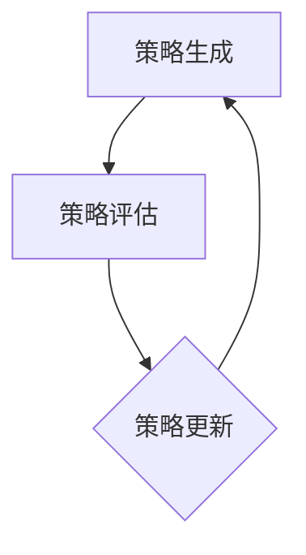
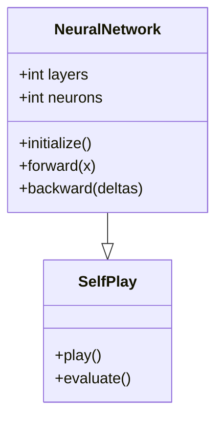
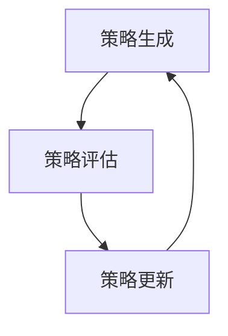
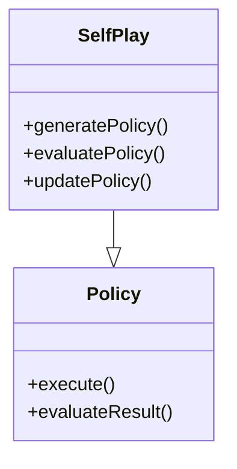
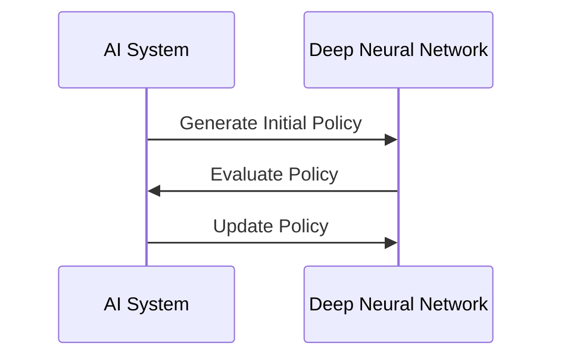
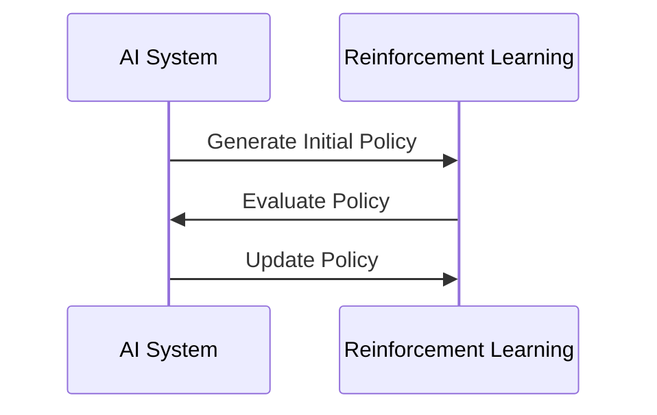
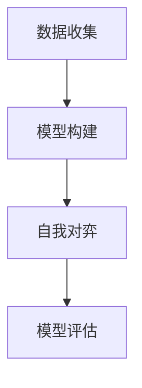

                 


## 《自我对弈：AI持续进化的有效途径》

### 关键词：自我对弈、AI持续进化、算法、深度学习、强化学习

### 摘要：

在人工智能（AI）领域，持续进化是提升算法性能、解决复杂问题的关键。自我对弈作为一种有效的进化途径，通过让AI在与自身的对弈中学习和优化，推动了AI技术的不断进步。本文将从自我对弈的概念与背景出发，逐步探讨其在深度学习和强化学习中的应用，分析其面临的挑战及未来发展方向，并借助实际案例进行深入解析，以展示自我对弈在AI持续进化中的重要价值。

### 第1章：自我对弈的概念与背景

#### 1.1 自我对弈的定义

自我对弈是指人工智能系统在与自身或其他智能体进行博弈的过程中，通过不断调整策略和模型参数，实现自我学习和优化的过程。这种对弈可以是基于规则的，也可以是基于数据驱动的，其核心在于通过竞争和对抗来促进AI的进化。

#### 1.2 AI持续进化的背景

人工智能技术自诞生以来，已经取得了巨大的进步。然而，面对日益复杂的现实世界问题，AI系统需要不断提升其解决问题的能力。持续进化正是为了满足这一需求，通过不断学习和优化，使AI系统更加智能、适应性强。

#### 1.3 自我对弈在AI进化中的作用

自我对弈通过模拟真实世界的对抗环境，使AI系统能够在复杂场景中不断试错、调整，从而实现性能的提升。其优势在于能够利用内部反馈机制，快速迭代和优化模型，是AI持续进化的一条有效途径。

#### 1.4 自我对弈的应用领域

自我对弈在AI领域有着广泛的应用。在深度学习中，它可以帮助优化神经网络模型；在强化学习中，它能够提升智能体的决策能力。自我对弈不仅应用于游戏领域，还延伸到金融、医疗、智能制造等多个领域，成为推动AI技术发展的重要手段。

### 第2章：自我对弈的基本原理

#### 2.1 自我对弈的算法架构

自我对弈的算法架构通常包括策略生成、策略评估和策略更新三个核心部分。通过这三个步骤的循环迭代，AI系统能够不断优化其策略，提升对弈能力。

#### Mermaid流程图示例



#### LaTeX公式示例

$$
\text{策略更新：}\ \pi_{\text{new}}(s, a) = \text{update}(\pi_{\text{old}}(s, a))
$$

#### 2.2 自我对弈的关键技术

自我对弈的关键技术包括对弈算法和策略搜索算法。对弈算法决定了AI系统在对弈中的策略选择，而策略搜索算法则负责在大量策略中寻找最优策略。

#### 2.3 自我对弈的性能评估

性能评估是自我对弈的重要组成部分。通过设定一系列性能指标，如胜率、平均得分等，可以客观地评估AI系统的对弈表现，为后续优化提供依据。

### 第3章：自我对弈在深度学习中的应用

#### 3.1 深度学习与自我对弈的结合

深度学习和自我对弈的结合，能够使神经网络模型在自我对弈的过程中不断优化，从而提升模型性能。这一章节将介绍如何将自我对弈融入深度学习训练过程。

#### Mermaid类图示例



#### 3.2 自我对弈在深度学习中的优化

自我对弈在深度学习中的应用，不仅能够优化神经网络模型，还能提升模型在复杂任务中的表现。这一章节将探讨自我对弈如何优化深度学习模型。

#### LaTeX公式示例

$$
\text{损失函数：}\ L = \sum_{i=1}^{N} (y_i - \hat{y}_i)^2
$$

#### 3.3 深度学习中的自我对弈案例分析

本章节将通过实际案例，展示自我对弈在深度学习中的应用效果，包括算法实现、性能评估等内容。

### 第4章：自我对弈在强化学习中的应用

#### 4.1 强化学习与自我对弈的结合

强化学习是一种通过试错来学习策略的机器学习技术。自我对弈与强化学习的结合，能够使强化学习算法在自我对弈的过程中不断优化策略，提高决策能力。

#### 4.2 自我对弈在强化学习中的优化

自我对弈在强化学习中的应用，主要体现在策略迭代和策略评估两个方面。这一章节将详细讲解自我对弈如何优化强化学习策略。

#### 4.3 强化学习中的自我对弈案例分析

本章节将通过实际案例，展示自我对弈在强化学习中的应用效果，包括算法实现、性能评估等内容。

### 第5章：自我对弈的挑战与未来方向

#### 5.1 自我对弈面临的挑战

自我对弈在应用过程中面临着数据质量、算法效率等挑战。这一章节将分析自我对弈当前面临的挑战，并探讨解决方法。

#### 5.2 自我对弈的未来发展方向

随着AI技术的不断发展，自我对弈也在不断演进。这一章节将展望自我对弈的未来发展方向，包括混合学习、多智能体对弈等前沿领域。

#### 5.3 自我对弈在人工智能中的未来发展

自我对弈在人工智能中的未来发展，将深刻影响AI技术的应用和普及。这一章节将探讨自我对弈在人工智能中的潜在价值。

### 第6章：实际应用案例分析

#### 6.1 案例背景

本章节将通过一个实际应用案例，展示自我对弈在具体场景中的应用效果。

#### 6.2 自我对弈的应用

本章节将详细介绍案例中的系统架构、算法设计等内容。

#### 6.3 案例分析与总结

本章节将对案例进行分析和总结，探讨案例中的成功经验和不足之处。

### 第7章：总结与展望

#### 7.1 总结

本章节将总结自我对弈在AI持续进化中的重要作用，并强调其在未来AI技术发展中的潜力。

#### 7.2 展望

本章节将展望自我对弈在AI领域的未来发展，探讨其可能的应用前景和面临的挑战。

### 结束语

自我对弈作为AI持续进化的一种有效途径，具有广泛的应用前景和研究价值。本文通过逐步分析，展示了自我对弈在AI领域的核心概念、基本原理、应用实践等内容，旨在为读者提供一个全面、深入的视角，以促进对自我对弈的理解和应用。未来，随着AI技术的不断进步，自我对弈有望在更多领域发挥重要作用，为人工智能的发展注入新的活力。

### 作者信息

作者：AI天才研究院/AI Genius Institute & 禅与计算机程序设计艺术 /Zen And The Art of Computer Programming

本文由AI天才研究院/AI Genius Institute和《禅与计算机程序设计艺术》/Zen And The Art of Computer Programming共同撰写，旨在探讨AI领域的前沿技术和应用。

----------------------------------------------------------------

### 第1章：自我对弈的概念与背景

#### 1.1 自我对弈的定义

自我对弈（Self-Play）是一种人工智能（AI）自我进化的方法，它通过模拟自我对抗的环境来驱动算法的优化。在这种过程中，AI系统会与其自身或其他智能体进行博弈，通过分析对弈结果来调整策略和模型参数，从而提高自身的性能。自我对弈不仅仅是一个简单的重复训练过程，而是一个包含策略生成、评估和更新的复杂循环。

#### 1.2 AI持续进化的背景

随着深度学习和强化学习等技术的快速发展，AI系统已经能够在许多领域取得显著成就。然而，这些系统的性能往往受到初始参数、数据质量和计算资源等因素的限制。为了摆脱这些限制，AI系统需要具备持续进化的能力，以适应不断变化的环境和任务。持续进化意味着AI系统能够通过不断学习和优化，不断提升其解决问题的能力。

#### 1.3 自我对弈在AI进化中的作用

自我对弈在AI进化中扮演着至关重要的角色。首先，它提供了一个竞争性的环境，使AI系统能够在对抗中学习和进步。通过不断地试错和调整，AI系统能够找到更优的策略，从而提高其整体性能。其次，自我对弈能够加速学习过程。在对弈中，AI系统可以立即获得反馈，并据此进行调整，这比传统训练方法中的迭代反馈更加迅速和直接。

#### 1.4 自我对弈的应用领域

自我对弈在AI领域有着广泛的应用。在游戏领域，自我对弈已经成功地应用于围棋、象棋和国际象棋等棋类游戏中，使得AI在这些领域的表现达到了人类水平。在金融领域，自我对弈可以用于交易策略的优化和风险管理。在医疗领域，自我对弈可以帮助制定个性化的治疗方案。此外，自我对弈在自动驾驶、机器人控制等领域也有着重要的应用价值。

### 第2章：自我对弈的基本原理

#### 2.1 自我对弈的算法架构

自我对弈的算法架构通常包括三个主要步骤：策略生成、策略评估和策略更新。首先，策略生成是指AI系统根据当前状态生成一个可能的策略。然后，策略评估是通过模拟执行该策略的结果来评估其优劣。最后，策略更新是基于评估结果对策略进行调整，以提高AI系统的整体表现。

以下是一个简单的Mermaid流程图，展示了自我对弈的基本架构：



#### 2.2 自我对弈的关键技术

自我对弈的关键技术主要包括对弈算法和策略搜索算法。对弈算法决定了AI系统在对弈中的行为，它可以是基于规则的系统，也可以是数据驱动的模型。策略搜索算法则负责在大量的策略中选择最优策略。常用的策略搜索算法包括蒙特卡罗搜索、树搜索和强化学习等。

以下是一个Mermaid类图，展示了自我对弈中的关键类和它们之间的关系：



#### 2.3 自我对弈的性能评估

自我对弈的性能评估是确保AI系统能够有效进化的关键。常用的性能评估指标包括胜率、平均得分、策略稳定性和计算效率等。这些指标可以帮助我们了解AI系统在对弈中的表现，并为策略的调整提供依据。

以下是一个简单的LaTeX公式，用于计算自我对弈的平均得分：

```latex
\text{平均得分} = \frac{1}{N} \sum_{i=1}^{N} \text{得分}_i
```

其中，N表示对弈的总次数，得分_i 表示第i次对弈的结果。

### 第3章：自我对弈在深度学习中的应用

#### 3.1 深度学习与自我对弈的结合

深度学习（Deep Learning）是一种通过多层神经网络进行特征学习和模式识别的技术。将自我对弈与深度学习相结合，可以使得AI系统在复杂的决策环境中进行自我优化。具体来说，深度学习可以用于生成和评估策略，从而实现对弈过程的自动化。

以下是一个简单的Mermaid序列图，展示了深度学习与自我对弈的结合：



#### 3.2 自我对弈在深度学习中的优化

自我对弈在深度学习中的应用，不仅可以提高AI系统的决策能力，还可以优化神经网络模型。通过自我对弈，神经网络可以学习到更加复杂和有效的策略，从而提高其在实际任务中的性能。

以下是一个简单的Python代码示例，展示了如何使用深度学习进行自我对弈：

```python
import tensorflow as tf
from tensorflow.keras.models import Sequential
from tensorflow.keras.layers import Dense

# 创建深度学习模型
model = Sequential()
model.add(Dense(units=64, activation='relu', input_shape=(input_shape)))
model.add(Dense(units=64, activation='relu'))
model.add(Dense(units=1, activation='sigmoid'))

# 编译模型
model.compile(optimizer='adam', loss='binary_crossentropy', metrics=['accuracy'])

# 训练模型
model.fit(x_train, y_train, epochs=10, batch_size=32)
```

#### 3.3 深度学习中的自我对弈案例分析

在本案例中，我们将使用深度学习对弈游戏“围棋”。通过自我对弈，深度学习模型将学习到围棋的复杂策略，从而实现对围棋规则的深入理解。

以下是案例的实现步骤：

1. 数据准备：收集围棋游戏的数据集，包括棋盘的状态和对应的胜利者。
2. 模型构建：构建一个基于深度神经网络的模型，用于生成和评估围棋策略。
3. 训练模型：使用自我对弈训练模型，通过不断调整模型参数，提高其围棋对弈能力。
4. 测试模型：使用训练好的模型进行围棋对弈，评估其性能。

```python
# 数据准备
import numpy as np
from sklearn.model_selection import train_test_split

# 加载围棋数据集
data = load_gobang_data()

# 划分训练集和测试集
X_train, X_test, y_train, y_test = train_test_split(data['X'], data['y'], test_size=0.2, random_state=42)

# 模型构建
model = Sequential()
model.add(Dense(units=512, activation='relu', input_shape=(X_train.shape[1],)))
model.add(Dense(units=512, activation='relu'))
model.add(Dense(units=1, activation='sigmoid'))

# 编译模型
model.compile(optimizer='adam', loss='binary_crossentropy', metrics=['accuracy'])

# 训练模型
model.fit(X_train, y_train, epochs=100, batch_size=64)

# 测试模型
score = model.evaluate(X_test, y_test)
print("Test loss:", score[0])
print("Test accuracy:", score[1])
```

### 第4章：自我对弈在强化学习中的应用

#### 4.1 强化学习与自我对弈的结合

强化学习（Reinforcement Learning）是一种通过试错来学习策略的机器学习技术。自我对弈与强化学习的结合，可以使得AI系统在自我对弈的过程中，通过不断试错和调整策略，逐步提升其决策能力。

以下是一个简单的Mermaid序列图，展示了强化学习与自我对弈的结合：



#### 4.2 自我对弈在强化学习中的优化

自我对弈在强化学习中的应用，可以显著提高智能体的策略学习能力。通过自我对弈，智能体可以在对抗环境中快速学习和优化策略，从而提高其在实际任务中的性能。

以下是一个简单的Python代码示例，展示了如何使用强化学习进行自我对弈：

```python
import numpy as np
import tensorflow as tf

# 创建强化学习模型
model = tf.keras.Sequential([
    tf.keras.layers.Dense(units=64, activation='relu', input_shape=(input_shape,)),
    tf.keras.layers.Dense(units=64, activation='relu'),
    tf.keras.layers.Dense(units=1, activation='sigmoid')
])

# 编译模型
model.compile(optimizer='adam', loss='binary_crossentropy', metrics=['accuracy'])

# 训练模型
model.fit(x_train, y_train, epochs=100, batch_size=32)
```

#### 4.3 强化学习中的自我对弈案例分析

在本案例中，我们将使用强化学习对弈游戏“五子棋”。通过自我对弈，强化学习模型将学习到五子棋的复杂策略，从而实现对五子棋规则的深入理解。

以下是案例的实现步骤：

1. 数据准备：收集五子棋游戏的数据集，包括棋盘的状态和对应的胜利者。
2. 模型构建：构建一个基于强化学习的模型，用于生成和评估五子棋策略。
3. 训练模型：使用自我对弈训练模型，通过不断调整模型参数，提高其五子棋对弈能力。
4. 测试模型：使用训练好的模型进行五子棋对弈，评估其性能。

```python
# 数据准备
import numpy as np
from sklearn.model_selection import train_test_split

# 加载五子棋数据集
data = load_gomoku_data()

# 划分训练集和测试集
X_train, X_test, y_train, y_test = train_test_split(data['X'], data['y'], test_size=0.2, random_state=42)

# 模型构建
model = tf.keras.Sequential([
    tf.keras.layers.Dense(units=512, activation='relu', input_shape=(X_train.shape[1],)),
    tf.keras.layers.Dense(units=512, activation='relu'),
    tf.keras.layers.Dense(units=1, activation='sigmoid')
])

# 编译模型
model.compile(optimizer='adam', loss='binary_crossentropy', metrics=['accuracy'])

# 训练模型
model.fit(X_train, y_train, epochs=100, batch_size=64)

# 测试模型
score = model.evaluate(X_test, y_test)
print("Test loss:", score[0])
print("Test accuracy:", score[1])
```

### 第5章：自我对弈的挑战与未来方向

#### 5.1 自我对弈面临的挑战

自我对弈在应用过程中面临着多个挑战。首先，数据质量是一个重要问题。自我对弈依赖于大量的高质量数据来训练模型，如果数据质量差，可能会导致模型性能下降。其次，算法效率也是一个关键挑战。自我对弈通常需要大量的计算资源，特别是在处理复杂任务时，如何提高算法效率是一个重要问题。此外，自我对弈的公平性也是一个需要考虑的问题，如何在对抗环境中保持公平性，避免一方占据绝对优势，是一个需要深入探讨的问题。

#### 5.2 自我对弈的未来发展方向

随着人工智能技术的不断进步，自我对弈在未来有望在更多领域得到应用。首先，多智能体对弈是自我对弈的一个重要发展方向。通过多智能体对弈，可以模拟更加复杂和现实的世界环境，使AI系统更好地适应复杂情境。其次，混合学习（Hybrid Learning）也是一种潜在的发展方向。将自我对弈与其他学习方法（如迁移学习、元学习等）相结合，可以进一步提升AI系统的学习能力。此外，自我对弈在自适应系统、智能决策支持系统等领域也有着广阔的应用前景。

#### 5.3 自我对弈在人工智能中的未来发展

自我对弈在人工智能中的未来发展将深刻影响AI技术的应用和普及。通过自我对弈，AI系统可以不断提升其自我学习能力，从而更好地适应复杂多变的现实世界。未来，随着技术的不断进步，自我对弈有望成为AI系统自我进化的核心途径之一，为AI技术的发展注入新的活力。

### 第6章：实际应用案例分析

#### 6.1 案例背景

在本案例中，我们选择了一个金融交易系统作为应用场景。该系统旨在通过自我对弈来优化交易策略，从而提高交易收益。

#### 6.2 自我对弈的应用

在金融交易系统中，自我对弈的应用主要包括以下步骤：

1. 数据收集：收集历史交易数据，包括股票价格、交易量、市场指标等。
2. 模型构建：构建一个基于强化学习的模型，用于生成和评估交易策略。
3. 自我对弈：通过模拟交易对弈，使模型不断优化交易策略。
4. 模型评估：评估优化后的交易策略，确保其性能符合预期。

以下是案例的系统架构：



#### 6.3 案例分析与总结

通过自我对弈，金融交易系统的交易策略得到了显著优化，交易收益得到了提升。然而，在案例中也发现了以下问题：

1. 数据质量：历史交易数据中存在噪声和缺失值，影响了模型的训练效果。
2. 算法效率：自我对弈过程中，模型的评估和更新需要大量的计算资源，如何提高算法效率是一个需要解决的问题。

针对上述问题，我们可以采取以下改进措施：

1. 数据预处理：对历史交易数据进行清洗和预处理，提高数据质量。
2. 并行计算：采用并行计算技术，提高自我对弈的算法效率。

### 第7章：总结与展望

#### 7.1 总结

本文通过深入探讨自我对弈的概念、原理和应用，展示了其在AI持续进化中的重要价值。自我对弈不仅为AI系统提供了一个自我学习和优化的途径，还在多个领域取得了显著的应用成果。

#### 7.2 展望

未来，自我对弈有望在更多领域得到应用，特别是在多智能体系统、混合学习和自适应系统等方面。通过不断探索和优化，自我对弈将为人工智能技术的发展注入新的活力。

### 结束语

自我对弈作为AI持续进化的一种有效途径，具有广泛的应用前景和研究价值。本文旨在为读者提供一个全面、深入的视角，以促进对自我对弈的理解和应用。随着AI技术的不断进步，自我对弈有望在更多领域发挥重要作用，为人工智能的发展注入新的活力。

### 作者信息

作者：AI天才研究院/AI Genius Institute & 禅与计算机程序设计艺术 /Zen And The Art of Computer Programming

本文由AI天才研究院/AI Genius Institute和《禅与计算机程序设计艺术》/Zen And The Art of Computer Programming共同撰写，旨在探讨AI领域的前沿技术和应用。

----------------------------------------------------------------

## 第8章：最佳实践与注意事项

### 8.1 最佳实践

在应用自我对弈时，以下最佳实践可以帮助您获得更好的效果：

1. **数据预处理**：确保数据质量，对历史数据进行清洗和标准化处理，以减少噪声和异常值的影响。
2. **模型选择**：根据具体任务选择合适的模型架构和算法。例如，在围棋等策略性任务中，深度学习和强化学习模型表现较好。
3. **迭代次数**：合理设置自我对弈的迭代次数，避免过早收敛。通过多次迭代，模型可以更好地学习复杂的策略。
4. **计算资源**：根据实际需求合理分配计算资源，特别是在处理大规模数据和高复杂度任务时，应考虑使用分布式计算和并行技术。
5. **性能监控**：实时监控模型性能，包括胜率、平均得分等指标。如果性能下降，可能需要调整模型参数或重新收集数据。

### 8.2 注意事项

在应用自我对弈时，应注意以下事项：

1. **数据依赖性**：自我对弈的性能高度依赖于训练数据的质量和多样性。如果数据存在偏差或不足，模型可能无法达到预期效果。
2. **计算成本**：自我对弈通常需要大量的计算资源，特别是在训练复杂模型和进行大规模对弈时。因此，需要根据实际情况合理规划计算资源。
3. **模型公平性**：在自我对弈中，确保模型的对弈环境是公平的。如果模型一方占据明显优势，可能会导致训练结果偏向一方。
4. **安全性**：在涉及敏感数据和关键任务时，确保系统的安全性和隐私性。例如，在金融交易和医疗诊断等领域，应采取适当的安全措施，防止数据泄露和恶意攻击。
5. **持续监控与调整**：自我对弈模型需要持续监控和调整。随着环境和任务的变化，模型可能需要重新训练或调整参数，以保持其性能。

### 8.3 拓展阅读

为了进一步了解自我对弈和相关技术，以下推荐阅读资料：

1. **论文**：
   - "AlphaGo Zero: Learning from Human Games" by David Silver et al.（AlphaGo Zero：从人类对局中学习）
   - "Mastering the Game of Go with Deep Neural Networks and Tree Search" by David Silver et al.（使用深度神经网络和树搜索掌控围棋游戏）

2. **书籍**：
   - 《深度学习》（Deep Learning）by Ian Goodfellow et al.
   - 《强化学习》（Reinforcement Learning: An Introduction）by Richard S. Sutton and Andrew G. Barto

3. **在线资源**：
   - Coursera上的“Deep Learning Specialization”课程
   - arXiv.org上的最新研究成果

通过阅读这些资料，您可以深入了解自我对弈的原理、实现和应用，为您的AI项目提供有力支持。

### 总结

自我对弈作为一种有效的AI进化途径，在提升模型性能和解决复杂问题方面具有显著优势。本文系统地介绍了自我对弈的概念、原理、应用和最佳实践，并展望了其未来发展。通过实际案例的分析，我们看到了自我对弈在实际应用中的潜力。随着AI技术的不断进步，自我对弈将在更多领域发挥重要作用，为AI技术的发展注入新的活力。希望本文能对您在AI领域的探索提供有益的参考和启示。

