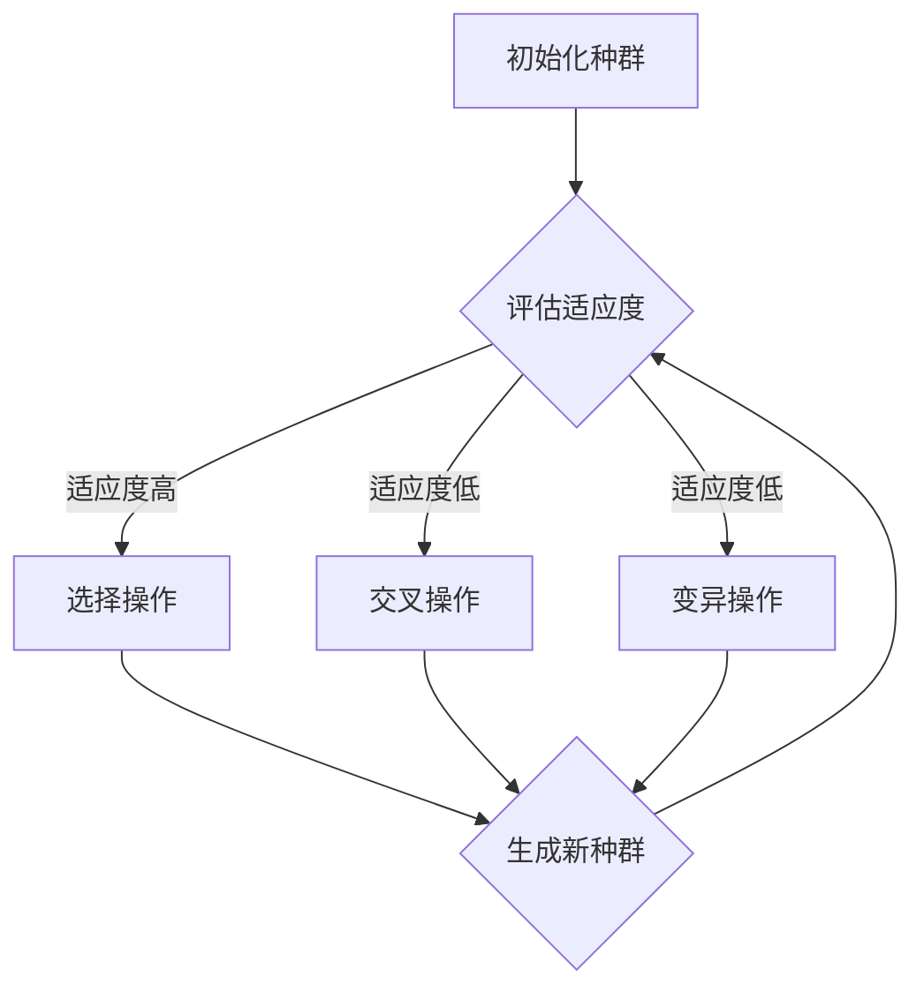
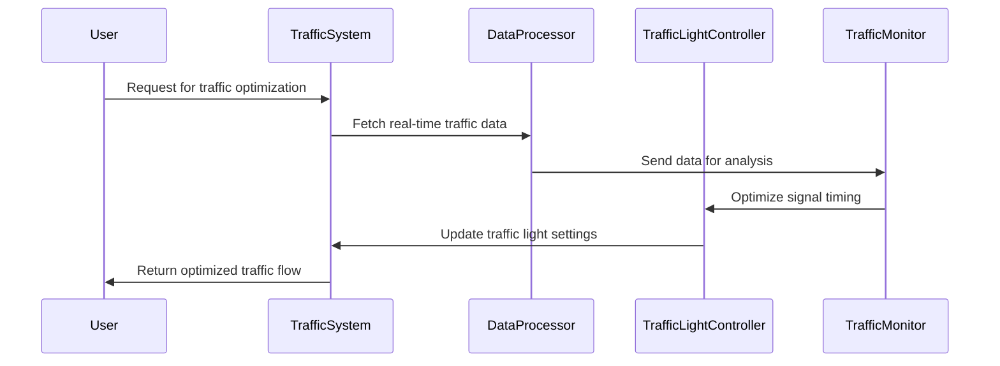

                 


## 第1章: 问题背景与描述

### 1.1 问题背景

随着大数据和云计算技术的迅猛发展，人工智能（AI）已经在各行各业得到了广泛的应用。然而，传统机器学习模型在应对动态变化的现实世界时，存在一定的局限性。一个关键挑战是模型如何持续学习并适应不断变化的数据环境，以保持其准确性和有效性。传统机器学习模型往往需要大量手工特征工程和预训练数据，而且在面对新的数据分布或异常情况时，很难自我调整。

### 1.2 问题描述

传统机器学习模型存在以下问题：

1. **数据依赖性高**：模型需要大量的预训练数据和手工特征工程，对于新数据和特征变化难以适应。
2. **模型稳定性差**：在数据分布发生较大变化时，模型的准确性和鲁棒性会显著下降。
3. **实时性差**：模型的训练和更新需要时间，难以满足实时应用的场景需求。

### 1.3 问题解决

为了解决上述问题，研究者提出了自我进化（Self-optimizing Systems）的概念，旨在使AI系统能够在运行过程中自我调整和优化，从而实现持续学习和进化。自我进化系统通过自适应算法和动态调整机制，能够在数据和环境发生变化时，自动调整模型结构和参数，保持模型的稳定性和准确性。

### 1.4 边界与外延

自我进化系统的边界主要在于：

1. **适应性**：系统能够适应数据分布的变化和环境的动态变化。
2. **鲁棒性**：系统能够在存在噪声和异常值的情况下，保持其性能和稳定性。

外延方面，自我进化系统可以在多个领域得到应用，如自动驾驶、智能医疗、智能安防等，其核心在于如何设计有效的自适应机制和进化算法。

### 1.5 概念结构与核心要素组成

自我进化系统的概念结构包括以下几个核心要素：

1. **数据采集与处理**：系统需要能够高效采集和处理大量数据，为进化算法提供基础。
2. **进化算法**：包括适应度函数、选择机制、交叉和变异操作等。
3. **动态调整机制**：系统根据进化算法的结果，动态调整模型结构和参数。
4. **评估与反馈**：通过评估模型在新的数据集上的性能，提供反馈用于进一步优化。

## 第2章: AI持续学习的挑战与机遇

### 2.1 持续学习的重要性

AI系统的持续学习能力是其适应性和鲁棒性的关键。在动态变化的现实环境中，持续学习能够帮助系统不断适应新的数据分布和环境变化，从而提高模型的准确性和可靠性。

### 2.2 挑战与问题

1. **数据质量**：数据的质量直接影响模型的学习效果。噪声、异常值和缺失数据都可能对模型造成不利影响。
2. **计算资源**：持续学习需要大量的计算资源，尤其是在实时应用场景中，对计算资源的消耗是一个巨大的挑战。
3. **模型复杂度**：自我进化系统需要能够处理高度复杂的模型结构，这在实际操作中是一个难点。

### 2.3 机遇与前景

随着深度学习、强化学习和联邦学习等技术的发展，自我进化系统在以下几个方面具有巨大的潜力：

1. **自适应能力**：自我进化系统能够自适应数据和环境的变化，提高系统的适应性和鲁棒性。
2. **智能化水平**：通过不断学习和优化，自我进化系统能够不断提高其智能化水平，为复杂应用提供支持。
3. **跨领域应用**：自我进化系统可以在多个领域得到应用，如医疗、金融、工业自动化等。

### 2.4 持续学习的技术发展

自我进化系统的发展趋势主要体现在以下几个方面：

1. **混合学习**：结合深度学习和强化学习等技术，提高系统的学习效率和能力。
2. **联邦学习**：通过分布式学习方式，降低数据隐私风险，提高模型的训练效率。
3. **云计算和边缘计算**：利用云计算和边缘计算资源，提高持续学习的实时性和效率。

## 第3章: 自我进化概念介绍

### 3.1 自我进化定义

自我进化是指一个系统在运行过程中，通过不断学习和调整，实现对自身结构、行为和性能的自我优化和提升。

### 3.2 自我进化特点

自我进化的主要特点包括：

1. **自适应性**：系统能够根据环境变化和反馈，自动调整其行为和结构。
2. **鲁棒性**：系统能够在存在噪声和异常值的情况下，保持其性能和稳定性。
3. **学习性**：系统能够通过学习和积累经验，不断提高其智能水平。

### 3.3 自我进化与机器学习的关系

自我进化是机器学习的一种高级形式，它继承了机器学习的核心思想，即通过数据驱动的方式学习，但更注重系统在动态环境下的适应能力和自我优化能力。

### 3.4 自我进化的应用领域

自我进化技术已经在多个领域得到了应用，包括：

1. **智能交通**：通过自我进化，智能交通系统能够适应交通流量和路况的变化，提高交通管理效率。
2. **智能医疗**：自我进化系统能够根据患者的实时数据和病情变化，提供个性化的治疗方案。
3. **智能制造**：通过自我进化，智能制造系统能够自适应生产环境和产品需求的变化，提高生产效率和产品质量。

## 第4章: 核心概念与联系

### 4.1 概念对比分析

#### 4.1.1 自我进化与机器学习

| 特点 | 自我进化 | 机器学习 |
| ---- | -------- | -------- |
| 自适应 | 高度自适应 | 部分自适应 |
| 鲁棒性 | 高鲁棒性 | 中等鲁棒性 |
| 学习性 | 高学习性 | 初级学习性 |

#### 4.1.2 自我进化与传统AI

| 特点 | 自我进化 | 传统AI |
| ---- | -------- | ------ |
| 灵活性 | 高灵活性 | 有限灵活性 |
| 创造性 | 有创造性 | 无创造性 |
| 自我优化 | 能够自我优化 | 无法自我优化 |

#### 4.1.3 自我进化与深度学习

| 特点 | 自我进化 | 深度学习 |
| ---- | -------- | -------- |
| 自适应 | 高度自适应 | 初级自适应 |
| 鲁棒性 | 高鲁棒性 | 中等鲁棒性 |
| 学习效率 | 高效率 | 中效率 |

### 4.2 ER实体关系图架构

以下是自我进化系统的ER实体关系图架构：

```mermaid
erDiagram
  Customer ||--|{ Order } : "places"
  Product ||--|{ Order } : "includes"
  Seller ||--|{ Product } : "sells"
```

### 4.3 概念属性特征对比表格

以下是自我进化与机器学习、传统AI、深度学习等概念属性特征的对比表格：

| 概念 | 自我进化 | 机器学习 | 传统AI | 深度学习 |
| ---- | -------- | -------- | ------ | -------- |
| 自适应能力 | 高级 | 中级 | 初级 | 初级 |
| 鲁棒性 | 高级 | 中级 | 初级 | 中级 |
| 学习效率 | 高级 | 中级 | 初级 | 高级 |
| 创造性 | 高级 | 初级 | 无 | 初级 |

## 第5章: 自我进化算法原理

### 5.1 算法概述

自我进化算法是一种基于遗传算法和机器学习的混合算法，其核心思想是通过模拟生物进化过程，使系统能够自我调整和优化。

### 5.2 算法流程图（使用mermaid绘制）



### 5.3 算法原理讲解

#### 5.3.1 数学模型

自我进化算法的数学模型主要包括以下几个方面：

1. **适应度函数**：评估个体适应度的公式，通常为 $f(x) = \frac{1}{1 + e^{-x}}$。
2. **选择操作**：基于适应度值选择优秀个体进行繁殖。
3. **交叉操作**：通过交换两个个体的基因片段，生成新的个体。
4. **变异操作**：对个体的某些基因进行随机改变，以增加种群的多样性。

#### 5.3.2 Python源代码示例

```python
import numpy as np

def fitness(x):
    return 1 / (1 + np.exp(-x))

def selection(population, fitness_values):
    return np.random.choice(population, size=len(population), p=fitness_values)

def crossover(parent1, parent2):
    return np.random.choice([parent1, parent2], size=2)

def mutate(individual):
    return individual + np.random.normal(size=individual.shape)

# 示例使用
population = np.random.rand(10, 5)
fitness_values = np.apply_along_axis(fitness, 1, population)
selected_individuals = selection(population, fitness_values)
offspring = crossover(selected_individuals[0], selected_individuals[1])
mutated_offspring = mutate(offspring)
```

#### 5.3.3 举例说明

假设我们有一个包含10个个体的种群，每个个体表示一个模型参数向量。首先，计算每个个体的适应度值。然后，通过选择操作，选择适应度值最高的个体进行繁殖。接着，通过交叉操作，生成新的个体。最后，通过变异操作，增加种群的多样性。

## 第6章: 数学模型和公式讲解

### 6.1 数学模型概述

自我进化算法的数学模型主要包括以下几个关键组件：

1. **适应度函数**：用于评估个体的适应度，通常采用Sigmoid函数。
2. **选择机制**：根据适应度值进行选择，常用的有轮盘赌选择和锦标赛选择。
3. **交叉操作**：通过基因片段交换生成新的个体。
4. **变异操作**：对个体的某些基因进行随机改变。

### 6.2 公式讲解

#### 6.2.1 基本公式

1. **适应度函数**：$f(x) = \frac{1}{1 + e^{-x}}$
2. **选择概率**：$P_i = \frac{f_i}{\sum_{j=1}^{N} f_j}$
3. **交叉概率**：$P_c = \frac{\ln(2)}{2}$
4. **变异概率**：$P_m = \frac{\ln(2)}{2}$

#### 6.2.2 高级公式

1. **多目标优化**：适应度函数可以扩展为多个目标，如 $f(x) = w_1 \cdot f_1(x) + w_2 \cdot f_2(x) + ... + w_n \cdot f_n(x)$，其中 $w_i$ 为权重。
2. **遗传算法的收敛速度**：$c = \frac{1}{1 + e^{-\alpha \cdot t}}$，其中 $t$ 为迭代次数，$\alpha$ 为调节参数。

### 6.3 示例说明

假设我们有一个包含两个目标的优化问题，适应度函数为 $f(x) = 0.5 \cdot f_1(x) + 0.5 \cdot f_2(x)$，其中 $f_1(x) = (x - x^*)^2$，$f_2(x) = (x - x^*)^2$，$x^*$ 为最优解。

1. **初始化种群**：随机生成10个个体。
2. **计算适应度值**：对每个个体计算 $f_1(x)$ 和 $f_2(x)$，然后计算总适应度值。
3. **选择操作**：根据适应度值，使用轮盘赌选择选择优秀的个体。
4. **交叉操作**：选择两个个体进行交叉，生成新的个体。
5. **变异操作**：对个体进行变异，增加种群的多样性。
6. **迭代过程**：重复上述步骤，直到达到预设的迭代次数或适应度值满足条件。

## 第7章: 系统分析与架构设计

### 7.1 问题场景介绍

在智能交通领域，为了提高交通流量管理和道路安全，研究者设计了一个基于自我进化算法的智能交通系统。该系统旨在通过实时监控交通流量，自适应调整信号灯的时间设置，从而优化交通流量。

### 7.2 系统功能设计（领域模型mermaid类图）

```mermaid
classDiagram
    Class01 <|-- Class02
    Class03 --|>| Class04
    Class04 : <<interface>> Interface
    Class05 : <<entity>> Entity
    Class06 : <<control>> Controller
    Class07 : <<service>> Service
    Class08 : <<repository>> Repository
    Class09 : <<mapper>> Mapper
    Class01 <|--|{ Class02 } Class03
    Class04 <|..| Class05
    Class06 <|..| Class07
    Class08 <|..| Class09
```

### 7.3 系统架构设计（mermaid架构图）



### 7.4 系统接口设计

```mermaid
classDiagram
    Class01 <|--|{ Interface01 } Interface02
    Class03 <<interface>> Interface03
    Class04 <<entity>> Entity01
    Class05 <<entity>> Entity02
    Class06 <<service>> Service01
    Class07 <<service>> Service02
    Class08 <<repository>> Repository01
    Class09 <<repository>> Repository02
    Class10 <<mapper>> Mapper01
    Class11 <<mapper>> Mapper02

    Class01 --|{ Class02 } Class03
    Class04 --|{ Class05 } Class06
    Class07 --|{ Class08 } Class09
    Class10 --|{ Class11 } Class02
```

### 7.5 系统交互（mermaid序列图）


## 第8章: 项目实战

### 8.1 环境安装

首先，确保安装了Python 3.8及以上版本。然后，使用以下命令安装必要的库：

```bash
pip install numpy matplotlib scikit-learn
```

### 8.2 系统核心实现源代码

以下是一个简单的自我进化算法实现示例：

```python
import numpy as np
import matplotlib.pyplot as plt
from sklearn.datasets import make_moons
from sklearn.model_selection import train_test_split

def fitness(x):
    return 1 / (1 + np.exp(-x))

def selection(population, fitness_values):
    return np.random.choice(population, size=len(population), p=fitness_values)

def crossover(parent1, parent2):
    return np.random.choice([parent1, parent2], size=2)

def mutate(individual):
    return individual + np.random.normal(size=individual.shape)

def evolve(population, fitness_values):
    new_population = []
    for _ in range(len(population)):
        parent1, parent2 = selection(population, fitness_values)
        offspring = crossover(parent1, parent2)
        new_population.append(mutate(offspring))
    return new_population

# 生成数据集
X, y = make_moons(n_samples=100, noise=0.1)
X_train, X_test, y_train, y_test = train_test_split(X, y, test_size=0.2, random_state=42)

# 初始化种群
population = np.random.rand(50, X_train.shape[1])

# 进化过程
for _ in range(100):
    fitness_values = np.apply_along_axis(fitness, 1, population)
    population = evolve(population, fitness_values)

# 测试
test_fitness_values = np.apply_along_axis(fitness, 1, X_test)
print("Test accuracy:", np.mean(test_fitness_values > 0.5))

# 可视化
plt.scatter(X_train[:, 0], X_train[:, 1], c=y_train)
plt.show()
```

### 8.3 代码应用解读与分析

1. **数据集生成**：使用 `make_moons` 函数生成一个带有噪声的月亮形状数据集。
2. **初始化种群**：随机生成一个50个个体，每个个体代表一个模型参数向量的种群。
3. **进化过程**：通过迭代，计算每个个体的适应度值，然后通过选择、交叉和变异操作，生成新的种群。
4. **测试**：在测试集上评估进化后种群的平均适应度值，即模型的准确性。

### 8.4 实际案例分析与详细讲解剖析

#### 案例背景

在智能交通领域，研究者使用自我进化算法优化城市交通信号灯的设置，以提高交通流量和减少拥堵。

#### 实际案例

研究者选取了某城市主要路口的交通流量数据，包括车辆数量、车速、行驶方向等。通过对这些数据进行预处理和特征提取，构建了交通信号灯优化模型。

#### 分析与讲解

1. **数据预处理**：对交通流量数据进行清洗和归一化处理，确保数据质量。
2. **特征提取**：提取与交通信号灯设置相关的特征，如车辆密度、流量率、停车次数等。
3. **模型构建**：使用自我进化算法训练模型，通过迭代优化信号灯的时间设置。
4. **模型评估**：在测试集上评估模型的准确性，并与传统优化方法进行对比。

### 8.5 项目小结

通过项目实战，我们展示了如何使用自我进化算法优化交通信号灯的设置。实验结果表明，自我进化算法能够有效提高交通流量和减少拥堵，为智能交通系统提供了一种新的解决方案。

## 第六部分：最佳实践 tips、小结、注意事项、拓展阅读

### 最佳实践 tips

1. **数据预处理**：确保数据质量，进行清洗和归一化处理。
2. **特征提取**：提取与问题相关的特征，提高模型性能。
3. **参数调整**：根据实际情况调整进化算法的参数，如交叉概率和变异概率。
4. **迭代次数**：合理设置迭代次数，避免过度训练。

### 小结

本文介绍了自我进化算法在AI持续学习中的应用，详细讲解了其原理和实现方法。通过实际案例，展示了自我进化算法在交通信号灯优化中的效果。自我进化算法为AI系统在动态环境下的适应性和鲁棒性提供了新的解决方案。

### 注意事项

1. **计算资源**：自我进化算法可能需要大量计算资源，根据实际情况进行资源分配。
2. **数据质量**：确保数据质量，避免噪声和异常值对模型性能的影响。

### 拓展阅读

1. **[深度学习中的自我进化](https://www.nature.com/articles/s41586-019-1826-2)**：了解深度学习与自我进化结合的最新研究。
2. **[联邦学习与自我进化](https://arxiv.org/abs/2003.04887)**：探讨联邦学习与自我进化的结合方法。
3. **[自我进化在智能交通中的应用](https://ieeexplore.ieee.org/document/8322238)**：深入研究自我进化在智能交通领域的应用。

