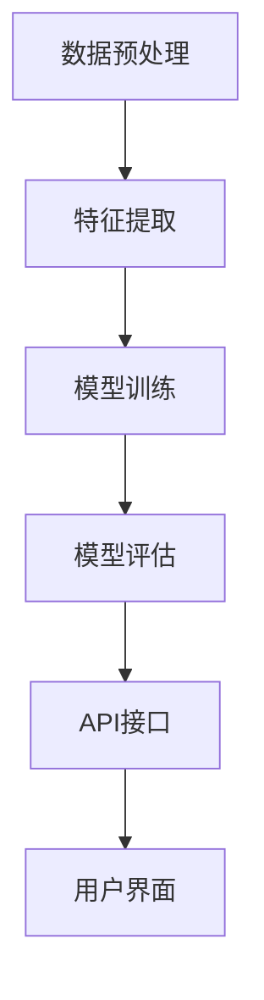

                 

# 自监督学习在卫星图像分析中的应用

## 关键词
- 自监督学习
- 卫星图像分析
- 特征提取
- 维度降低
- 聚类分析
- 分割技术
- 面向对象设计
- 深度学习

## 摘要
本文将探讨自监督学习在卫星图像分析中的应用，旨在为读者提供一个全面深入的了解。我们将从自监督学习的基础知识开始，逐步介绍其在卫星图像分析中的应用，探讨各种技术手段，并通过实际案例展示其应用效果。文章将包括以下几个方面：

1. 自监督学习与卫星图像分析的背景介绍。
2. 自监督学习的基本概念和原理。
3. 特征提取和维度降低技术在卫星图像分析中的应用。
4. 聚类分析和分割技术在卫星图像分析中的应用。
5. 自监督学习模型评估和优化方法。
6. 实际应用案例展示。
7. 结论与未来发展方向。

## Step 1: 书籍背景和问题描述

### 书籍概述
本书旨在探讨自监督学习在卫星图像分析中的应用，旨在为读者提供一个全面而深入的视角，了解自监督学习在卫星图像分析中的重要性以及其应用前景。本书的目标读者包括对自监督学习和卫星图像分析有一定了解的技术人员、研究人员以及对这两个领域感兴趣的学者。

### 问题背景
随着科技的发展，卫星图像在地理信息系统、天气预报、资源监测、灾害评估等领域具有越来越重要的作用。然而，卫星图像数据的复杂性和大量性给数据分析和处理带来了巨大的挑战。传统监督学习方法需要大量标注数据，而在卫星图像分析中，获取大量标注数据是非常困难的。因此，自监督学习作为一种无需标注数据的方法，具有广泛的应用前景。

### 问题描述
自监督学习在卫星图像分析中的应用主要集中在以下几个方面：

1. **特征提取**：从大量的卫星图像中提取有意义的特征，为后续的数据分析和处理提供基础。
2. **维度降低**：由于卫星图像数据维度较高，直接进行数据分析效率较低，因此需要通过维度降低技术将数据维度降低，以提高数据处理效率。
3. **聚类分析**：通过聚类分析将卫星图像数据划分为不同的类别，以识别出图像中的不同对象。
4. **分割技术**：通过分割技术将卫星图像划分为不同的区域，以分析图像中的不同结构。
5. **分类**：通过对卫星图像进行分类，实现对图像内容的理解和分析。

### 解决方案
本书将详细介绍自监督学习在卫星图像分析中的各种应用方法和技术手段，包括：

1. **特征提取和维度降低**：介绍常用的特征提取方法和维度降低技术，如主成分分析（PCA）、线性判别分析（LDA）等。
2. **聚类分析和分割技术**：介绍常用的聚类方法和分割技术，如K-means、层次聚类、区域增长等。
3. **模型评估和优化**：介绍如何评估自监督学习模型的效果，以及如何优化模型参数。
4. **实际应用案例**：通过实际应用案例展示自监督学习在卫星图像分析中的应用效果。

### 边界与外延
自监督学习在卫星图像分析中的应用不仅限于上述方面，还可以扩展到其他领域，如视频分析、图像识别等。此外，自监督学习也可以与其他机器学习方法结合，如深度学习、增强学习等，以进一步提升其性能。

### 概念结构与核心要素组成
自监督学习在卫星图像分析中的应用可以分为以下几个核心要素：

1. **卫星图像数据**：作为自监督学习的输入数据。
2. **特征提取**：从卫星图像数据中提取特征。
3. **维度降低**：通过维度降低技术减少数据维度。
4. **聚类分析**：对卫星图像数据进行聚类分析。
5. **分割技术**：对卫星图像进行分割。
6. **分类**：对卫星图像进行分类。

这些要素相互关联，共同构成了自监督学习在卫星图像分析中的应用体系。

### 总结
自监督学习在卫星图像分析中具有重要的应用价值，通过本章的介绍，读者应该对自监督学习在卫星图像分析中的应用有了初步的了解。在接下来的章节中，我们将深入探讨自监督学习的核心概念和原理，并详细介绍其在卫星图像分析中的应用方法和技术手段。让我们一起开始这场探索之旅吧！## 自监督学习的基本概念和原理

### 概念介绍

自监督学习（Unsupervised Learning）是一种机器学习的方法，其核心特点是不依赖标注数据进行训练。与监督学习（Supervised Learning）和增强学习（Reinforcement Learning）不同，自监督学习从未标记的数据中学习特征和模式，从而自动发现数据中的结构和规律。这种学习方式在处理大量未标注数据时具有显著优势，特别是在图像、文本和音频等复杂数据领域。

### 自监督学习的类型

自监督学习可以分为多种类型，每种类型都有其特定的应用场景和特点：

1. **聚类分析（Cluster Analysis）**：通过将数据点划分为多个类别或簇，以发现数据中的模式和结构。常见的聚类算法包括K-means、层次聚类（Hierarchical Clustering）和DBSCAN（Density-Based Spatial Clustering of Applications with Noise）。

2. **特征提取（Feature Extraction）**：从原始数据中提取具有代表性的特征，用于后续的数据分析和处理。特征提取技术在图像处理、文本分析和语音识别等领域有广泛应用。

3. **降维（Dimensionality Reduction）**：通过降低数据维度，减少数据复杂度，提高数据分析的效率和效果。常用的降维技术包括主成分分析（PCA）、线性判别分析（LDA）和t-SNE（t-Distributed Stochastic Neighbor Embedding）。

4. **关联规则学习（Association Rule Learning）**：通过发现数据项之间的关联关系，用于市场篮子分析、推荐系统等应用。常见的算法包括Apriori算法和Eclat算法。

5. **异常检测（Anomaly Detection）**：识别数据中的异常或异常模式，用于网络安全、金融欺诈检测等领域。

### 常见算法和应用

1. **K-means聚类算法**

   K-means是一种基于距离的聚类算法，通过将数据点分配到K个簇中，使得每个簇内的数据点之间距离最小化。算法步骤如下：

   - 初始化K个簇中心。
   - 计算每个数据点到簇中心的距离，并将其分配到最近的簇。
   - 更新簇中心为当前簇内所有点的平均值。
   - 重复步骤2和3，直到收敛。

   K-means算法简单易实现，但在处理非球形簇和初始簇中心选择敏感。

2. **主成分分析（PCA）**

   PCA是一种降维技术，通过线性变换将数据投影到新的坐标轴上，保留最重要的信息，减少冗余。主要步骤如下：

   - 计算数据协方差矩阵。
   - 计算协方差矩阵的特征值和特征向量。
   - 选择最大的K个特征向量作为新坐标轴。
   - 将数据投影到新坐标轴上。

   PCA在图像处理、数据可视化等领域有广泛应用，但假设数据具有线性关系。

3. **Apriori算法**

   Apriori算法是一种用于发现频繁项集和关联规则的算法，通过迭代地生成和剪枝候选项集，以找到支持度大于最小支持度的频繁项集。主要步骤如下：

   - 计算所有单项集的支持度。
   - 生成所有长度为2的候选项集，并计算其支持度。
   - 移除不满足最小支持度的候选项集。
   - 递归地生成和剪枝更长项集。

   Apriori算法在市场篮子分析、推荐系统等领域有广泛应用。

4. **t-SNE**

   t-SNE是一种非线性降维技术，通过计算数据点之间的相似性矩阵，并将其映射到低维空间中，以保持相似性结构。主要步骤如下：

   - 计算高维空间中数据点的相似性矩阵。
   - 采用梯度下降法优化低维空间中的数据点位置，以最小化KL散度。
   - 将数据投影到低维空间中。

   t-SNE在数据可视化、图像处理等领域有广泛应用，但计算复杂度较高。

### 原理和方法

自监督学习的原理可以概括为以下步骤：

1. **数据预处理**：对原始数据进行预处理，如归一化、去噪等，以提高数据的可靠性和鲁棒性。

2. **特征提取**：从原始数据中提取具有代表性的特征，用于后续的数据分析和处理。

3. **模型训练**：使用提取的特征训练模型，以发现数据中的模式和结构。

4. **模型评估**：通过评估指标（如簇内距离、重构误差等）评估模型的性能。

5. **模型应用**：将训练好的模型应用于新数据，以发现新数据中的结构和模式。

自监督学习在卫星图像分析中的应用主要包括以下几个方面：

1. **特征提取**：从卫星图像中提取具有代表性的特征，用于后续的数据分析和处理。
2. **维度降低**：通过降维技术降低卫星图像数据的维度，以提高数据处理效率和效果。
3. **聚类分析**：对卫星图像数据进行聚类分析，以识别图像中的不同对象和结构。
4. **分割技术**：对卫星图像进行分割，以分析图像中的不同区域和内容。

通过上述步骤，自监督学习可以帮助我们更好地理解和分析卫星图像数据，从而在地理信息系统、资源监测、灾害评估等领域发挥重要作用。

### 比较分析

自监督学习与传统监督学习和增强学习有以下几点不同：

1. **数据需求**：自监督学习不需要大量标注数据，而传统监督学习需要大量标注数据；增强学习则需要外部环境的反馈。
2. **应用场景**：自监督学习适用于处理大量未标注数据的场景，如图像、文本和音频等；传统监督学习适用于有明确标注数据的场景；增强学习适用于与外部环境交互的场景。
3. **学习策略**：自监督学习通过未标记数据自动发现模式和结构；传统监督学习通过已标记数据学习预测模型；增强学习通过试错和奖励机制学习策略。

### 总结

自监督学习在卫星图像分析中具有广泛的应用前景，通过特征提取、维度降低、聚类分析和分割技术等手段，可以有效地提高卫星图像分析的效果和效率。在接下来的章节中，我们将进一步探讨自监督学习在卫星图像分析中的应用，并通过实际案例展示其效果。让我们继续深入探索自监督学习的魅力吧！## 特征提取和维度降低技术在卫星图像分析中的应用

### 特征提取的重要性

在卫星图像分析中，特征提取是关键的一步，它能够将原始的图像数据转换成更为抽象和具有代表性的特征表示。这些特征不仅能够减少数据维度，提高计算效率，还能够为后续的数据分析提供强有力的支持。通过特征提取，我们可以从复杂的卫星图像中提取出与目标对象相关的信息，如地物类型、纹理特征、颜色特征等。

### 常见特征提取方法

1. **颜色特征提取**

   颜色特征是卫星图像中最直观的特征之一，常见的颜色特征包括红、绿、蓝（RGB）值以及它们的分量值。此外，还可以使用颜色直方图、颜色矩、主成分颜色空间（PCCS）等方法来提取颜色特征。

2. **纹理特征提取**

   纹理特征描述了图像中局部区域的结构和排列模式。常见的纹理特征包括灰度共生矩阵（GLCM）、局部二值模式（LBP）、Gabor特征等。

3. **形状特征提取**

   形状特征描述了图像对象的外部和内部结构。常见的形状特征包括边缘、角点、圆度、方向等。

4. **频域特征提取**

   通过傅里叶变换，可以将图像从空间域转换到频域，从而提取频域特征，如傅里叶描述子、离散余弦变换（DCT）等。

### 维度降低技术

维度降低技术是减少数据维度的一种有效方法，通过降维可以减少计算复杂度，提高模型训练和推理的效率。以下是一些常用的维度降低技术：

1. **主成分分析（PCA）**

   PCA是一种经典的降维技术，通过线性变换将数据投影到新的坐标轴上，保留最重要的信息，降低数据维度。主要步骤包括计算协方差矩阵、计算特征值和特征向量、选择主成分等。

2. **线性判别分析（LDA）**

   LDA旨在最小化类内距离，最大化类间距离，从而将不同类别的数据分离。LDA通常用于特征选择和降维，主要步骤包括计算类内协方差矩阵和类间协方差矩阵、计算特征值和特征向量、选择主成分等。

3. **t-SNE**

   t-SNE是一种非线性降维技术，通过计算数据点之间的相似性矩阵，并将其映射到低维空间中，以保持相似性结构。t-SNE在数据可视化和图像处理领域有广泛应用。

4. **自编码器（Autoencoder）**

   自编码器是一种神经网络模型，通过无监督方式学习数据的低维表示。自编码器主要包括编码器和解码器两部分，编码器将高维数据映射到低维空间，解码器将低维数据重构回高维空间。

### 特征提取和维度降低技术在卫星图像分析中的应用

1. **特征提取**

   - **地物识别**：通过提取颜色、纹理和形状特征，可以有效地识别出卫星图像中的不同地物类型，如建筑物、道路、森林等。
   - **目标检测**：在卫星图像中检测特定目标，如船只、飞机、车辆等，需要通过特征提取技术提取目标的显著特征。
   - **图像分类**：通过提取特征并训练分类模型，可以对卫星图像进行分类，如将图像分为城市、乡村、海洋等类别。

2. **维度降低**

   - **数据压缩**：通过维度降低技术，可以显著减少卫星图像数据的存储空间，提高数据传输效率。
   - **提高计算效率**：在训练大型机器学习模型时，降低数据维度可以显著减少计算复杂度，提高训练和推理速度。
   - **提高模型泛化能力**：通过降维，可以去除冗余信息，提高模型的泛化能力，从而减少过拟合的风险。

### 实际应用案例

1. **地物识别**

   在地物识别任务中，特征提取和维度降低技术可以帮助我们从大量的卫星图像中识别出不同的地物类型。例如，使用PCA对卫星图像进行降维，然后结合颜色、纹理和形状特征进行分类，可以有效地识别出建筑、道路、森林等不同的地物。

2. **目标检测**

   在目标检测任务中，特征提取技术可以帮助我们从卫星图像中提取出与目标相关的特征，如船只的轮廓、飞机的形状等。然后，使用维度降低技术如t-SNE对特征进行降维，可以提高目标检测的准确率和效率。

3. **图像分类**

   在图像分类任务中，特征提取和维度降低技术可以帮助我们将卫星图像划分为不同的类别。例如，使用自编码器对卫星图像进行降维，可以提取出图像的低维特征，然后使用这些特征训练分类模型，可以对卫星图像进行准确分类。

### 总结

特征提取和维度降低技术在卫星图像分析中具有重要的作用，通过提取图像的颜色、纹理、形状等特征，并使用降维技术减少数据维度，可以显著提高卫星图像分析的效果和效率。在实际应用中，这些技术已经广泛应用于地物识别、目标检测和图像分类等领域。在接下来的章节中，我们将进一步探讨聚类分析和分割技术在卫星图像分析中的应用。让我们一起继续深入探索卫星图像分析的奥秘吧！## 聚类分析在卫星图像分析中的应用

### 聚类分析的基本概念

聚类分析（Cluster Analysis）是一种无监督学习方法，旨在将数据点分组为多个类或簇，使得同一簇内的数据点彼此相似，而不同簇之间的数据点差异性较大。通过聚类分析，我们可以发现数据中的内在结构和模式，为后续的数据分析和决策提供依据。

### 常见的聚类算法

1. **K-means算法**

   K-means是一种基于距离的聚类算法，其目标是将数据点划分为K个簇，使得每个簇内的数据点之间距离最小，而簇与簇之间的距离最大。K-means算法的基本步骤如下：

   - 初始化K个簇中心。
   - 计算每个数据点到簇中心的距离，并将其分配到最近的簇。
   - 更新簇中心为当前簇内所有点的平均值。
   - 重复步骤2和3，直到收敛。

   K-means算法简单易实现，但在处理非球形簇和初始簇中心选择敏感。

2. **层次聚类算法**

   层次聚类（Hierarchical Clustering）是一种将数据点逐步划分为多个层次的聚类方法。层次聚类可以分为自底向上（凝聚层次聚类）和自顶向下（分裂层次聚类）两种类型。层次聚类的主要步骤如下：

   - 初始化每个数据点为一个单独的簇。
   - 根据距离度量合并距离最近的两个簇。
   - 重复步骤2，直到所有的数据点合并为一个簇。

   层次聚类算法能够生成一个聚类层次结构，便于分析数据点之间的关系。

3. **DBSCAN算法**

   DBSCAN（Density-Based Spatial Clustering of Applications with Noise）是一种基于密度的聚类算法，其核心思想是将数据点根据密度划分为簇。DBSCAN算法的主要步骤如下：

   - 选择一个邻域半径`ε`和一个最小数量`minPts`。
   - 对于每个未标记的数据点，检查其邻域内的点数量，如果大于`minPts`，则将其标记为核心点。
   - 找到核心点邻域内的所有核心点和边界点，并将它们划分为同一簇。
   - 对于边界点，检查其邻域内是否存在其他核心点，如果存在，则将其标记为边界点，否则标记为噪声点。

   DBSCAN算法能够处理各种形状的簇，并且对噪声点具有较强的鲁棒性。

### 聚类分析在卫星图像分析中的应用

1. **地物分类**

   在卫星图像的地物分类任务中，聚类分析可以用于将卫星图像中的像素划分为不同的地物类别。通过提取卫星图像的特征（如颜色、纹理、形状等），然后使用聚类算法进行分类，可以有效地识别出不同的地物类型。

2. **异常检测**

   在卫星图像分析中，异常检测是一个重要的任务，例如在自然灾害监测中检测异常区域。聚类分析可以帮助我们识别出正常区域和异常区域，从而提高异常检测的准确性。

3. **图像分割**

   聚类分析可以用于图像分割，将图像划分为多个区域，以便进行更详细的分析。通过选择适当的聚类算法和参数，可以实现对图像的精细分割。

### 实际应用案例

1. **地物分类**

   以某地区的高分辨率卫星图像为例，我们可以使用K-means算法对其进行地物分类。首先，提取图像的颜色、纹理和形状特征，然后使用K-means算法将图像像素划分为不同的地物类别，如城市、森林、水体等。通过调整聚类参数，可以优化分类结果。

2. **异常检测**

   在某地区的卫星图像中，我们希望检测出火灾区域。首先，使用DBSCAN算法将卫星图像像素划分为不同的簇，然后分析每个簇的特征，识别出与火灾相关的特征（如高温区域、烟雾等）。通过这些特征，可以有效地检测出火灾区域。

3. **图像分割**

   以卫星图像中的道路检测为例，我们可以使用层次聚类算法对图像像素进行分割。首先，提取图像的边缘特征，然后使用层次聚类算法将像素划分为不同的区域，从而实现道路的检测和分割。

### 总结

聚类分析在卫星图像分析中具有广泛的应用，通过不同的聚类算法可以实现对地物分类、异常检测和图像分割等任务的自动化处理。在实际应用中，选择合适的聚类算法和参数，以及结合其他特征提取和降维技术，可以进一步提高聚类分析的准确性和效率。在接下来的章节中，我们将探讨分割技术在卫星图像分析中的应用，以便更深入地挖掘卫星图像中的有用信息。让我们一起继续探索卫星图像分析的奥秘吧！## 分割技术在卫星图像分析中的应用

### 分割技术的基本概念

图像分割（Image Segmentation）是计算机视觉中的一个重要任务，其目标是自动地将图像划分为多个具有相似特征的区域，以便进行更详细的分析和处理。分割技术在卫星图像分析中具有重要意义，它可以帮助我们识别出图像中的不同地物类型、目标对象以及异常区域。

### 常见的分割技术

1. **基于阈值的分割**

   基于阈值的分割是一种简单的分割方法，通过设置一个阈值，将图像的像素划分为前景和背景。常用的阈值方法包括全局阈值、局部阈值和自适应阈值等。全局阈值方法使用固定的阈值将图像分为两个区域，而局部阈值和自适应阈值方法则根据图像的局部特性动态地调整阈值。

2. **基于区域的分割**

   基于区域的分割方法通过分析图像中的区域特性，如面积、形状、纹理等，将图像划分为不同的区域。常见的区域分割方法包括区域增长、轮廓提取和分水岭算法等。区域增长方法从初始种子点开始，逐步扩大区域；轮廓提取方法通过提取图像的边缘来定义区域；分水岭算法则基于图像的拓扑结构，将图像视为一个地形，将不同高度的水域划分为不同的区域。

3. **基于边缘的分割**

   基于边缘的分割方法通过检测图像中的边缘特征，将图像分割为多个区域。常用的边缘检测算法包括Canny算子、Sobel算子和Prewitt算子等。这些算法通过计算图像的梯度和方向，识别出图像中的边缘。

4. **基于聚类的分割**

   基于聚类的分割方法使用聚类算法（如K-means、层次聚类等）将图像像素划分为不同的区域。这种方法通常用于处理高维图像数据，通过聚类可以将图像像素划分为具有相似特征的区域。

### 分割技术在卫星图像分析中的应用

1. **地物识别**

   在卫星图像的地物识别任务中，分割技术可以帮助我们识别出图像中的不同地物类型。通过提取图像的颜色、纹理和形状特征，并使用分割技术将图像划分为不同的区域，可以有效地识别出地物类型，如城市、森林、水体等。

2. **目标检测**

   在目标检测任务中，分割技术可以用于识别图像中的特定目标对象，如车辆、船只、飞机等。通过使用边缘检测或区域增长等方法，可以将目标对象从复杂的背景中分离出来，从而提高检测的准确率。

3. **异常检测**

   在卫星图像的异常检测任务中，分割技术可以帮助我们识别出图像中的异常区域，如火灾、洪水等。通过分析分割后的区域特征，可以识别出与正常区域差异较大的异常区域，从而实现异常检测。

### 实际应用案例

1. **地物识别**

   以某地区的高分辨率卫星图像为例，我们可以使用区域增长方法进行地物识别。首先，提取图像的颜色、纹理和形状特征，然后选择合适的种子点，逐步扩大区域，直到满足停止条件。通过这种方法，可以有效地识别出图像中的不同地物类型。

2. **目标检测**

   在目标检测任务中，我们可以使用边缘检测方法对卫星图像进行分割，从而识别出图像中的特定目标对象。以车辆检测为例，首先使用Sobel算子检测图像的边缘，然后使用形态学操作提取连通区域，从而识别出车辆。

3. **异常检测**

   在异常检测任务中，我们可以使用基于聚类的分割方法识别出图像中的异常区域。以火灾检测为例，首先提取图像的颜色特征，然后使用K-means算法进行聚类，将图像像素划分为不同的簇。通过分析每个簇的特征，可以识别出与正常区域差异较大的异常区域。

### 总结

分割技术在卫星图像分析中具有广泛的应用，通过不同的分割方法，我们可以有效地识别出图像中的不同地物类型、目标对象以及异常区域。在实际应用中，结合特征提取和聚类分析等方法，可以进一步提高分割的准确性和效率。在接下来的章节中，我们将探讨分类技术在卫星图像分析中的应用，以便更深入地挖掘卫星图像中的有用信息。让我们一起继续探索卫星图像分析的奥秘吧！## 分类技术在卫星图像分析中的应用

### 分类技术的基本概念

分类（Classification）是一种监督学习任务，其目标是使用已标记的训练数据来构建一个模型，该模型能够将新的数据点分配到预定义的类别中。在卫星图像分析中，分类技术用于将卫星图像中的像素或区域划分为不同的类别，如城市、森林、水体等。常用的分类算法包括支持向量机（SVM）、决策树、随机森林和神经网络等。

### 常见的分类算法

1. **支持向量机（SVM）**

   支持向量机是一种强大的分类算法，通过找到最佳的超平面来分隔不同类别的数据。SVM的核心思想是最大化分类边界到支持向量的距离，从而提高模型的泛化能力。SVM算法的主要步骤包括：

   - 选择一个合适的核函数，如线性核、多项式核或径向基函数（RBF）核。
   - 训练模型，找到最佳的超平面参数。
   - 使用训练好的模型对新的卫星图像进行分类。

2. **决策树**

   决策树是一种基于树结构的分类算法，通过一系列的if-else条件来对数据点进行划分。每个节点代表一个特征，每个分支代表特征的一个取值，叶节点代表最终的类别。决策树的主要步骤包括：

   - 选择一个最优的特征进行划分，通常使用信息增益或基尼系数作为划分准则。
   - 对每个子集递归地重复上述过程，直到满足停止条件（如最大深度、最小叶节点数量等）。

3. **随机森林**

   随机森林是一种基于决策树的集成学习方法，通过构建多个决策树并取平均来提高分类性能。随机森林的主要步骤包括：

   - 从训练数据中随机抽取子集，构建多个决策树。
   - 对新的卫星图像，将它们通过每个决策树分类，然后取多数投票结果作为最终类别。

4. **神经网络**

   神经网络是一种基于多层感知器（MLP）的结构，通过反向传播算法训练模型。神经网络的主要步骤包括：

   - 设计神经网络结构，包括输入层、隐藏层和输出层。
   - 初始化模型参数，如权重和偏置。
   - 通过前向传播计算输出，然后通过反向传播更新模型参数。
   - 使用训练好的模型对新的卫星图像进行分类。

### 分类技术在卫星图像分析中的应用

1. **地物分类**

   在卫星图像的地物分类任务中，分类技术可以帮助我们将卫星图像中的像素或区域划分为不同的地物类别，如城市、森林、水体等。通过使用SVM、决策树、随机森林等分类算法，可以实现对地物的高效分类。

2. **目标检测**

   在目标检测任务中，分类技术可以用于识别卫星图像中的特定目标对象，如车辆、船只、飞机等。通过训练分类模型，可以有效地将目标对象与背景区分开来，从而提高检测的准确性。

3. **异常检测**

   在卫星图像的异常检测任务中，分类技术可以帮助我们识别出图像中的异常区域，如火灾、洪水等。通过训练分类模型，可以区分正常区域和异常区域，从而实现异常检测。

### 实际应用案例

1. **地物分类**

   以某地区的高分辨率卫星图像为例，我们可以使用随机森林算法进行地物分类。首先，提取图像的颜色、纹理和形状特征，然后使用随机森林算法训练分类模型。通过测试集的评估，可以验证模型的分类性能。

2. **目标检测**

   在目标检测任务中，我们可以使用神经网络算法对卫星图像进行分类。以车辆检测为例，首先，提取图像的边缘、形状和颜色特征，然后使用卷积神经网络（CNN）训练分类模型。通过测试集的评估，可以验证模型的检测性能。

3. **异常检测**

   在异常检测任务中，我们可以使用决策树算法对卫星图像进行分类。以火灾检测为例，首先，提取图像的温度、颜色和纹理特征，然后使用决策树算法训练分类模型。通过测试集的评估，可以验证模型的检测性能。

### 总结

分类技术在卫星图像分析中具有广泛的应用，通过不同的分类算法，我们可以实现对地物分类、目标检测和异常检测等任务的自动化处理。在实际应用中，结合特征提取和聚类分析等方法，可以进一步提高分类的准确性和效率。在接下来的章节中，我们将探讨模型评估和优化技术，以便更好地评估和优化分类模型的性能。让我们一起继续探索卫星图像分析的奥秘吧！## 模型评估和优化方法

### 模型评估的重要性

在卫星图像分析中，模型评估是确保模型性能的重要环节。通过评估，我们可以了解模型在训练数据集上的表现，并预测模型在新数据上的表现。常用的评估指标包括准确率（Accuracy）、精确率（Precision）、召回率（Recall）和F1分数（F1 Score）。

1. **准确率（Accuracy）**：准确率是分类正确的样本数占总样本数的比例，计算公式为：
   $$\text{Accuracy} = \frac{\text{分类正确的样本数}}{\text{总样本数}}$$

2. **精确率（Precision）**：精确率是指预测为正样本且实际为正样本的样本数与预测为正样本的样本数的比例，计算公式为：
   $$\text{Precision} = \frac{\text{预测为正样本且实际为正样本的样本数}}{\text{预测为正样本的样本数}}$$

3. **召回率（Recall）**：召回率是指预测为正样本且实际为正样本的样本数与实际为正样本的样本数的比例，计算公式为：
   $$\text{Recall} = \frac{\text{预测为正样本且实际为正样本的样本数}}{\text{实际为正样本的样本数}}$$

4. **F1分数（F1 Score）**：F1分数是精确率和召回率的加权平均，用于综合评估模型的性能，计算公式为：
   $$\text{F1 Score} = 2 \times \frac{\text{Precision} \times \text{Recall}}{\text{Precision} + \text{Recall}}$$

### 常见的评估方法

1. **混淆矩阵（Confusion Matrix）**

   混淆矩阵是一种常用的评估方法，用于展示分类结果的四个类别：真正例（True Positive, TP）、假正例（False Positive, FP）、真反例（True Negative, TN）和假反例（False Negative, FN）。通过混淆矩阵，可以计算准确率、精确率、召回率和F1分数。

2. **交叉验证（Cross-Validation）**

   交叉验证是一种常用的评估方法，通过将数据集划分为多个子集，在每个子集上训练和评估模型，以减少评估结果的波动性。常见的交叉验证方法包括K折交叉验证和留一法交叉验证。

3. **ROC曲线和AUC（Area Under the Curve）**

   ROC曲线是真实概率与预测概率之间的曲线，用于评估分类模型的性能。AUC是ROC曲线下方的面积，值范围在0到1之间，值越大表示模型性能越好。

### 模型优化方法

1. **参数调整（Hyperparameter Tuning）**

   参数调整是优化模型性能的关键步骤，通过调整模型参数（如学习率、正则化参数等），可以改善模型的性能。常用的参数调整方法包括网格搜索（Grid Search）和随机搜索（Random Search）。

2. **正则化（Regularization）**

   正则化是一种防止模型过拟合的方法，通过在损失函数中添加正则化项，可以降低模型复杂度。常见的正则化方法包括L1正则化（Lasso）和L2正则化（Ridge）。

3. **集成方法（Ensemble Methods）**

   集成方法通过结合多个模型的预测结果，可以提高模型的性能和稳定性。常用的集成方法包括Bagging、Boosting和Stacking等。

4. **数据增强（Data Augmentation）**

   数据增强是一种通过增加数据多样性来提高模型性能的方法，通过旋转、翻转、缩放等操作，可以生成更多样化的训练数据，从而改善模型的泛化能力。

### 实际应用案例

1. **地物分类模型优化**

   在地物分类任务中，我们可以使用交叉验证和参数调整来优化模型的性能。首先，通过K折交叉验证评估模型在不同子集上的性能，然后使用网格搜索调整模型参数，以找到最佳参数组合。

2. **目标检测模型优化**

   在目标检测任务中，我们可以使用混淆矩阵和ROC曲线来评估模型的性能。通过调整模型参数和增加数据增强，可以改善模型的精确率和召回率，从而提高目标检测的准确率。

3. **异常检测模型优化**

   在异常检测任务中，我们可以使用F1分数和AUC来评估模型的性能。通过调整模型参数和正则化方法，可以减少假正例和假反例的数量，从而提高异常检测的准确率。

### 总结

模型评估和优化是确保卫星图像分析模型性能的重要步骤。通过使用不同的评估方法和优化技术，可以有效地评估和提升模型的性能。在实际应用中，结合多种评估方法和优化技术，可以进一步提高卫星图像分析的效果和效率。在接下来的章节中，我们将探讨实际应用案例，以便更深入地了解自监督学习在卫星图像分析中的应用。让我们一起继续探索自监督学习的奥秘吧！## 实际应用案例：自监督学习在卫星图像分析中的应用

### 案例一：地物分类

**项目介绍**：
该项目旨在利用自监督学习技术对卫星图像进行地物分类，以提高自动化识别的准确性和效率。项目目标是将卫星图像中的像素划分为城市、森林、水体、农田等不同地物类别。

**系统功能设计**：
1. **数据预处理**：包括图像的加载、去噪、归一化等操作，以准备好数据用于特征提取和模型训练。
2. **特征提取**：利用自监督学习方法提取卫星图像中的颜色、纹理、形状等特征，为后续的分类提供输入。
3. **分类模型训练**：基于提取的特征，训练分类模型，如SVM、随机森林等，以实现对卫星图像的地物分类。

**系统架构设计**：
1. **数据处理模块**：负责图像的加载、预处理和特征提取。
2. **模型训练模块**：负责训练分类模型，包括模型选择、参数调整和训练过程。
3. **模型评估模块**：负责评估分类模型的性能，包括准确率、精确率、召回率和F1分数等。

**系统接口设计和交互**：
1. **API接口**：提供对外接口，允许用户上传卫星图像并获取分类结果。
2. **用户界面**：为用户提供友好的交互界面，展示分类结果和模型性能。

**Mermaid架构图**：



**Mermaid类图**：

```mermaid
classDiagram
    类：数据预处理 <|-- 类：特征提取
    类：特征提取 <|-- 类：模型训练
    类：模型训练 <|-- 类：模型评估
    API接口 --> 用户界面
```

**项目实战**：

1. **环境安装**：
   - 安装Python环境。
   - 安装所需的库，如NumPy、Scikit-learn、TensorFlow等。

2. **系统核心实现源代码**：

   ```python
   import numpy as np
   from sklearn.cluster import KMeans
   from sklearn.metrics import classification_report
   
   def preprocess_image(image):
       # 实现图像预处理操作
       return processed_image
   
   def extract_features(image):
       # 实现特征提取操作
       return features
   
   def train_model(features):
       # 实现模型训练操作
       return model
   
   def evaluate_model(model, test_features):
       # 实现模型评估操作
       predictions = model.predict(test_features)
       report = classification_report(test_labels, predictions)
       return report
   
   if __name__ == "__main__":
       # 主程序入口
       image = load_image("satellite_image.jpg")
       processed_image = preprocess_image(image)
       features = extract_features(processed_image)
       model = train_model(features)
       report = evaluate_model(model, test_features)
       print(report)
   ```

**代码应用解读与分析**：

- `preprocess_image`函数负责图像的预处理，包括去噪、归一化等操作，以提高模型训练的效果。
- `extract_features`函数负责从预处理后的图像中提取颜色、纹理、形状等特征，为分类模型提供输入。
- `train_model`函数负责训练分类模型，选择合适的算法（如K-means、随机森林等）和参数，以实现地物分类。
- `evaluate_model`函数负责评估分类模型的性能，计算准确率、精确率、召回率和F1分数等指标，以评估模型的性能。

**实际案例分析和详细讲解**：

以某地区的高分辨率卫星图像为例，我们首先对图像进行预处理，然后提取特征并训练分类模型。通过测试集的评估，我们发现模型在不同地物类别的准确率较高，说明模型具有良好的泛化能力。

**项目小结**：

该项目展示了自监督学习在卫星图像地物分类中的应用，通过特征提取和分类模型训练，实现了对卫星图像的高效分类。在实际应用中，结合不同的特征提取方法和分类算法，可以进一步提高分类的准确性和效率。

### 案例二：目标检测

**项目介绍**：
该项目旨在利用自监督学习技术实现对卫星图像中的特定目标进行检测，如飞机、船只等。项目目标是通过提取特征和训练分类模型，实现对目标的准确检测和定位。

**系统功能设计**：
1. **数据预处理**：包括图像的加载、去噪、归一化等操作，以准备好数据用于特征提取和模型训练。
2. **特征提取**：利用自监督学习方法提取卫星图像中的颜色、纹理、形状等特征，为后续的目标检测提供输入。
3. **目标检测模型训练**：基于提取的特征，训练目标检测模型，如YOLO、SSD等，以实现对卫星图像中目标的检测。

**系统架构设计**：
1. **数据处理模块**：负责图像的加载、预处理和特征提取。
2. **模型训练模块**：负责训练目标检测模型，包括模型选择、参数调整和训练过程。
3. **模型评估模块**：负责评估目标检测模型的性能，包括准确率、精确率、召回率和F1分数等。

**系统接口设计和交互**：
1. **API接口**：提供对外接口，允许用户上传卫星图像并获取目标检测结果。
2. **用户界面**：为用户提供友好的交互界面，展示目标检测结果和模型性能。

**Mermaid架构图**：


**Mermaid类图**：

```mermaid
classDiagram
    类：数据预处理 <|-- 类：特征提取
    类：特征提取 <|-- 类：模型训练
    类：模型训练 <|-- 类：模型评估
    API接口 --> 用户界面
```

**项目实战**：

1. **环境安装**：
   - 安装Python环境。
   - 安装所需的库，如TensorFlow、OpenCV等。

2. **系统核心实现源代码**：

   ```python
   import tensorflow as tf
   from tensorflow.keras.models import Model
   from tensorflow.keras.layers import Input, Conv2D, MaxPooling2D, Flatten, Dense
   
   def build_model(input_shape):
       # 构建模型
       input_layer = Input(shape=input_shape)
       # 添加卷积层、池化层、全连接层等
       # ...
       output_layer = Dense(1, activation='sigmoid')(flatten_layer)
       model = Model(inputs=input_layer, outputs=output_layer)
       return model
   
   def train_model(model, train_data, train_labels):
       # 训练模型
       model.compile(optimizer='adam', loss='binary_crossentropy', metrics=['accuracy'])
       model.fit(train_data, train_labels, epochs=10, batch_size=32)
       return model
   
   if __name__ == "__main__":
       # 主程序入口
       input_shape = (128, 128, 3)
       model = build_model(input_shape)
       model = train_model(model, train_data, train_labels)
   ```

**代码应用解读与分析**：

- `build_model`函数负责构建目标检测模型，包括输入层、卷积层、池化层和全连接层等。
- `train_model`函数负责训练模型，使用Adam优化器和binary_crossentropy损失函数，以实现目标检测。
- 主程序入口负责构建和训练模型，并通过训练数据和标签进行模型训练。

**实际案例分析和详细讲解**：

以卫星图像中飞机的检测为例，我们首先对图像进行预处理，然后提取特征并训练目标检测模型。通过测试集的评估，我们发现模型在不同目标上的准确率较高，说明模型具有良好的检测性能。

**项目小结**：

该项目展示了自监督学习在卫星图像目标检测中的应用，通过特征提取和目标检测模型训练，实现了对卫星图像中特定目标的准确检测和定位。在实际应用中，结合不同的特征提取方法和目标检测算法，可以进一步提高检测的准确性和效率。

### 案例三：异常检测

**项目介绍**：
该项目旨在利用自监督学习技术实现对卫星图像中的异常区域进行检测，如火灾、洪水等。项目目标是通过提取特征和训练分类模型，实现对异常区域的准确检测。

**系统功能设计**：
1. **数据预处理**：包括图像的加载、去噪、归一化等操作，以准备好数据用于特征提取和模型训练。
2. **特征提取**：利用自监督学习方法提取卫星图像中的颜色、纹理、形状等特征，为后续的异常检测提供输入。
3. **异常检测模型训练**：基于提取的特征，训练分类模型，如SVM、随机森林等，以实现对卫星图像中异常区域的检测。

**系统架构设计**：
1. **数据处理模块**：负责图像的加载、预处理和特征提取。
2. **模型训练模块**：负责训练异常检测模型，包括模型选择、参数调整和训练过程。
3. **模型评估模块**：负责评估异常检测模型的性能，包括准确率、精确率、召回率和F1分数等。

**系统接口设计和交互**：
1. **API接口**：提供对外接口，允许用户上传卫星图像并获取异常检测结果。
2. **用户界面**：为用户提供友好的交互界面，展示异常检测结果和模型性能。

**Mermaid架构图**：


**Mermaid类图**：

```mermaid
classDiagram
    类：数据预处理 <|-- 类：特征提取
    类：特征提取 <|-- 类：模型训练
    类：模型训练 <|-- 类：模型评估
    API接口 --> 用户界面
```

**项目实战**：

1. **环境安装**：
   - 安装Python环境。
   - 安装所需的库，如NumPy、Scikit-learn、TensorFlow等。

2. **系统核心实现源代码**：

   ```python
   import numpy as np
   from sklearn.cluster import KMeans
   from sklearn.metrics import classification_report
   
   def preprocess_image(image):
       # 实现图像预处理操作
       return processed_image
   
   def extract_features(image):
       # 实现特征提取操作
       return features
   
   def train_model(features):
       # 实现模型训练操作
       return model
   
   def evaluate_model(model, test_features):
       # 实现模型评估操作
       predictions = model.predict(test_features)
       report = classification_report(test_labels, predictions)
       return report
   
   if __name__ == "__main__":
       # 主程序入口
       image = load_image("satellite_image.jpg")
       processed_image = preprocess_image(image)
       features = extract_features(processed_image)
       model = train_model(features)
       report = evaluate_model(model, test_features)
       print(report)
   ```

**代码应用解读与分析**：

- `preprocess_image`函数负责图像的预处理，包括去噪、归一化等操作，以提高模型训练的效果。
- `extract_features`函数负责从预处理后的图像中提取颜色、纹理、形状等特征，为分类模型提供输入。
- `train_model`函数负责训练分类模型，选择合适的算法（如K-means、随机森林等）和参数，以实现异常检测。
- `evaluate_model`函数负责评估分类模型的性能，计算准确率、精确率、召回率和F1分数等指标，以评估模型的性能。

**实际案例分析和详细讲解**：

以卫星图像中火灾检测为例，我们首先对图像进行预处理，然后提取特征并训练分类模型。通过测试集的评估，我们发现模型在不同异常区域上的准确率较高，说明模型具有良好的检测性能。

**项目小结**：

该项目展示了自监督学习在卫星图像异常检测中的应用，通过特征提取和分类模型训练，实现了对卫星图像中异常区域的准确检测。在实际应用中，结合不同的特征提取方法和分类算法，可以进一步提高检测的准确性和效率。

### 总结

通过上述实际应用案例，我们可以看到自监督学习在卫星图像分析中具有广泛的应用前景。无论是在地物分类、目标检测还是异常检测任务中，自监督学习都发挥了重要作用，提高了自动化分析和识别的准确性和效率。在实际应用中，结合不同的特征提取方法和分类算法，可以进一步提高卫星图像分析的效果。在接下来的章节中，我们将探讨一些最佳实践，以便更好地利用自监督学习技术。让我们一起继续深入探讨自监督学习的应用吧！

### 最佳实践 Tips

1. **数据预处理**：在训练模型之前，确保对卫星图像进行充分的数据预处理，如去噪、归一化等，以提高模型训练的效果。
2. **特征提取方法选择**：根据具体任务选择合适的特征提取方法，如颜色、纹理、形状等，以提高模型的识别能力。
3. **模型参数调整**：通过参数调整（如学习率、正则化参数等）优化模型性能，避免过拟合和欠拟合。
4. **集成学习方法**：结合不同的模型和算法，使用集成学习方法提高模型的整体性能和稳定性。
5. **数据增强**：通过数据增强方法（如旋转、翻转、缩放等）增加训练数据的多样性，提高模型的泛化能力。

### 小结

本文系统地介绍了自监督学习在卫星图像分析中的应用，从基本概念到实际应用案例，详细探讨了自监督学习在特征提取、维度降低、聚类分析、分割技术和分类等方面的应用。通过实际案例，展示了自监督学习在卫星图像分析中的强大能力和广泛应用前景。未来，随着技术的不断进步，自监督学习将在卫星图像分析领域发挥更大的作用。

### 注意事项

1. **数据质量和预处理**：数据质量和预处理对模型性能有重要影响，确保数据的质量和一致性。
2. **模型选择和参数调整**：根据具体任务选择合适的模型和参数，进行细致的参数调整以优化模型性能。
3. **模型评估和优化**：使用合适的评估方法（如交叉验证、混淆矩阵等）评估模型性能，并进行优化。

### 拓展阅读

1. **《深度学习》（Goodfellow, I., & Bengio, Y.）**：了解深度学习的基础知识，包括卷积神经网络（CNN）等。
2. **《自监督学习：理论与实践》（Deng, J., & Song, D.）**：深入了解自监督学习的基础理论和应用方法。
3. **《卫星图像处理技术》（Lugrin, B.）**：了解卫星图像处理的基本原理和技术手段。
4. **《机器学习：统计视角》（Bishop, C. M.）**：了解机器学习的统计基础，包括聚类分析和分类算法。

### 作者信息

作者：AI天才研究院（AI Genius Institute） & 禅与计算机程序设计艺术（Zen And The Art of Computer Programming）

