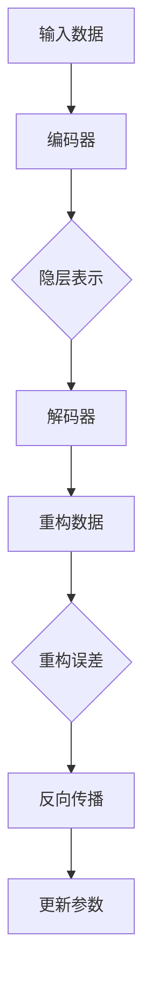
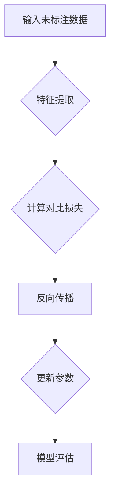
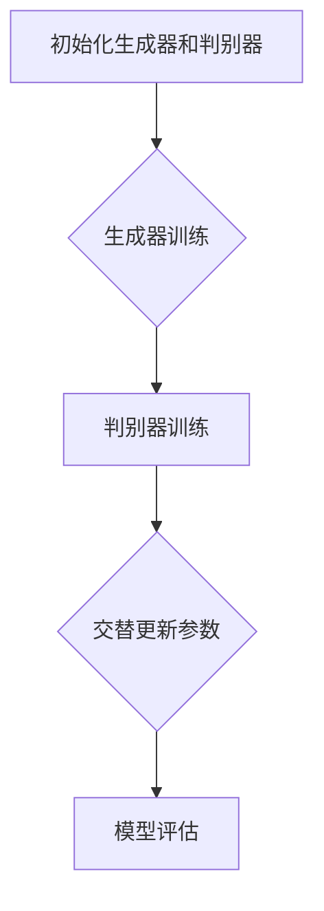
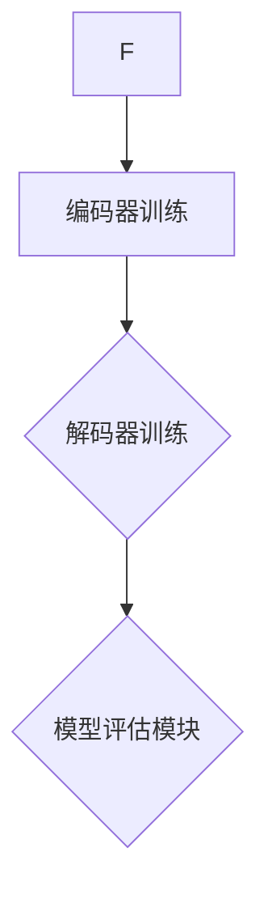
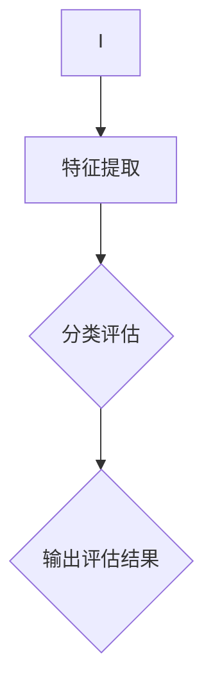
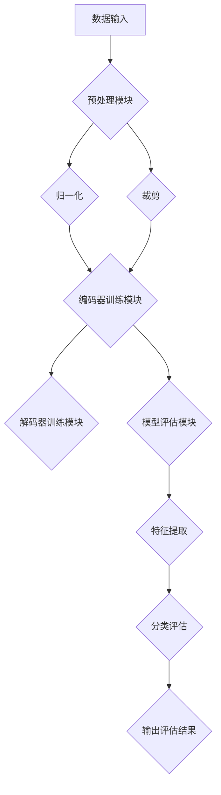

                 

# 自监督学习在大规模无标注数据中的应用

关键词：自监督学习、无标注数据、数据增强、预训练、模型评估

摘要：随着数据量的爆炸性增长，如何处理大规模无标注数据成为机器学习领域的一大挑战。自监督学习作为无需人工标注数据即可训练模型的方法，提供了新的解决方案。本文将介绍自监督学习的基本原理、与无标注数据的联系、对比其他机器学习方法的优缺点，并详细阐述自监督学习算法的原理和实现步骤，最后通过一个实际项目案例展示自监督学习在无标注数据中的应用效果。

## 第一部分：背景介绍

### 1. 问题背景

在过去的几十年里，随着互联网和大数据技术的快速发展，数据量呈现爆炸性增长。尤其是在图像、语音、自然语言处理等领域，数据量更是以指数级增长。然而，这些数据中有相当大的一部分是无标注数据，即没有预先标注的类别、标签或其他相关信息的数据。在传统机器学习领域，标注数据是训练模型的必要条件。然而，标注数据的获取通常代价高昂、耗时且繁琐。这不仅需要大量的人力成本，还需要专业知识和技能。因此，如何处理大规模无标注数据成为机器学习领域的一个重大挑战。

### 2. 问题描述

自监督学习在大规模无标注数据中的应用面临以下挑战：

- 如何设计有效的自监督学习模型，使得模型能够从无标注数据中自动学习到有用的特征？
- 如何评估自监督学习模型的效果，确保其能够在实际应用中达到预期的性能？
- 如何在资源受限的环境下，高效地训练和部署自监督学习模型？

### 3. 问题解决

自监督学习通过以下方法解决上述问题：

- 利用数据本身的结构和规律，设计无监督或半监督的学习任务，引导模型自动学习数据中的潜在特征。
- 采用多样化的数据增强和预训练技术，提高模型的泛化能力和鲁棒性。
- 通过模型评估和优化策略，确保自监督学习模型在无标注数据上的性能。

### 4. 边界与外延

自监督学习不仅适用于图像、语音等传统领域，还可以应用于自然语言处理、推荐系统、文本分类等多种应用场景。此外，自监督学习还可以与其他机器学习方法相结合，如生成对抗网络（GAN）、强化学习等，形成更为复杂和强大的学习体系。

### 5. 概念结构与核心要素组成

- **自监督学习**：一种无需人工标注数据即可训练模型的学习方法。
- **无标注数据**：没有预先标注的类别、标签或其他相关信息的数据。
- **自监督学习模型**：能够从无标注数据中自动学习到有用特征的模型。
- **数据增强**：通过多种方式对数据进行变换和扩充，提高模型的泛化能力。
- **预训练技术**：在特定任务上对模型进行预训练，提高模型在目标任务上的性能。

## 第二部分：核心概念与联系

### 1. 自监督学习原理

自监督学习通过设计无监督或半监督的学习任务，使得模型在无需人工标注数据的情况下学习到数据中的潜在特征。其基本原理包括：

- **预训练**：在大量无标注数据上进行预训练，使模型获得丰富的表示能力。
- **数据增强**：通过数据变换和扩充，提高模型的鲁棒性和泛化能力。
- **任务引导**：设计适合特定任务的自监督学习任务，如自编码器、对比学习等。

### 2. 自监督学习与无标注数据的联系

- **自动特征提取**：自监督学习模型可以从无标注数据中自动提取出有用的特征，这些特征可以用于后续的分类、回归等任务。
- **减少标注成本**：自监督学习减少了标注数据的需求，降低了数据标注的时间和人力成本。
- **增强模型泛化能力**：通过在无标注数据上进行预训练，模型能够学习到更一般化的特征，从而提高在目标任务上的性能。

### 3. 自监督学习与其他机器学习方法的对比

| 方法 | 定义 | 适用场景 | 优点 | 缺点 |
| --- | --- | --- | --- | --- |
| 监督学习 | 需要大量标注数据进行训练 | 有标注数据的场景 | 精度高，效果稳定 | 数据标注成本高 |
| 无监督学习 | 仅利用数据自身的结构进行学习 | 无标注数据的场景 | 不需要标注数据 | 特征提取能力有限 |
| 半监督学习 | 结合有标注和无标注数据，提高模型的泛化能力 | 标注数据较少的场景 | 降低标注成本，提高泛化能力 | 需要大量无标注数据 |
| 自监督学习 | 通过设计无监督或半监督的学习任务，从无标注数据中提取特征 | 大规模无标注数据的场景 | 减少标注成本，增强模型泛化能力 | 模型设计较为复杂 |

## 第三部分：算法原理讲解

### 1. 自监督学习算法概述

自监督学习算法可分为以下几类：

- **自编码器**：通过无监督方式学习数据的低维表示。
- **对比学习**：通过对比不同样本或样本的各个部分，学习数据的潜在特征。
- **生成对抗网络（GAN）**：通过生成器和判别器的对抗训练，学习数据的分布。

### 2. 自编码器算法原理

自编码器是一种无监督学习算法，通过编码器和解码器来学习数据的低维表示。其基本原理如下：

#### 编码器（Encoder）

- 编码器将输入数据映射到一个低维隐层空间，这个隐层空间表示了输入数据的主要特征。
- 编码器通常由多层神经网络组成，通过反向传播算法学习参数。

#### 解码器（Decoder）

- 解码器将编码器输出的隐层空间映射回原始数据空间。
- 解码器也由多层神经网络组成，通过反向传播算法学习参数。

#### 损失函数

- 自编码器的损失函数通常采用均方误差（MSE）或交叉熵损失，衡量编码器和解码器输出与原始数据之间的差异。
- 通过最小化损失函数，自编码器学习到数据的有效表示。

#### 自编码器算法流程

1. **输入数据**：输入一批未标注的数据。
2. **编码器训练**：通过反向传播算法，最小化编码器输出的隐层空间与输入数据之间的差异。
3. **解码器训练**：通过反向传播算法，最小化解码器输出的原始数据与输入数据之间的差异。
4. **模型评估**：在测试集上评估模型的性能，通常使用重构误差作为评价指标。

### 3. 对比学习算法原理

对比学习算法通过对比不同样本或样本的各个部分，学习数据的潜在特征。其基本原理如下：

#### 对比损失函数

- 对比学习算法使用对比损失函数，如三元组损失或边际损失，衡量样本与其正样本和负样本之间的差异。
- 通过最小化对比损失函数，模型学习到数据的潜在特征。

#### 对比学习算法流程

1. **输入数据**：输入一批未标注的数据。
2. **特征提取**：通过编码器提取每个样本的特征表示。
3. **对比损失函数计算**：计算每个样本与其正样本和负样本之间的对比损失。
4. **模型训练**：通过反向传播算法，最小化对比损失函数，学习到数据的潜在特征。
5. **模型评估**：在测试集上评估模型的性能，通常使用下游任务的准确率作为评价指标。

### 4. 生成对抗网络（GAN）算法原理

生成对抗网络（GAN）由生成器和判别器两个神经网络组成，通过对抗训练学习数据的分布。其基本原理如下：

#### 生成器（Generator）

- 生成器通过输入随机噪声生成伪造数据，使其尽量接近真实数据的分布。
- 生成器通常由多层神经网络组成，通过反向传播算法学习参数。

#### 判别器（Discriminator）

- 判别器用于区分真实数据和伪造数据，通过训练逐渐提高其识别能力。
- 判别器通常也由多层神经网络组成，通过反向传播算法学习参数。

#### GAN算法流程

1. **初始化生成器和判别器**：随机初始化生成器和判别器的参数。
2. **生成器训练**：生成器生成伪造数据，判别器对其进行训练，使其能够区分真实数据和伪造数据。
3. **判别器训练**：判别器对真实数据和伪造数据同时进行训练，使其能够准确识别真实数据和伪造数据。
4. **模型评估**：在测试集上评估生成器和判别器的性能，通常使用生成数据的质量作为评价指标。

## 第四部分：系统分析与架构设计方案

### 1. 问题场景介绍

在图像识别领域，有一项重要任务是对大规模无标注图像数据进行分类。然而，由于数据量庞大且缺乏标注信息，传统的监督学习方法难以应用于此类场景。因此，我们需要一种能够从无标注图像数据中自动学习特征并进行分类的方法，这就是自监督学习。

### 2. 项目介绍

本项目旨在利用自监督学习算法，对大规模无标注图像数据进行分类。具体来说，我们将采用自编码器算法，从无标注图像数据中提取特征，并利用这些特征进行图像分类。项目主要分为以下几步：

- 数据预处理：对图像进行归一化、裁剪等操作，使其符合自编码器的输入要求。
- 模型训练：使用自编码器算法，从无标注图像数据中提取特征，并利用提取到的特征进行分类。
- 模型评估：在测试集上评估模型的性能，并调整模型参数，以提高分类准确性。

### 3. 系统功能设计

系统功能设计主要包括数据预处理、模型训练和模型评估三部分。

#### 数据预处理

- 数据归一化：对图像进行归一化处理，使其像素值范围在0到1之间。
- 数据裁剪：对图像进行随机裁剪，以增加数据的多样性。

#### 模型训练

- 编码器训练：使用自编码器算法，从无标注图像数据中提取特征。
- 解码器训练：利用提取到的特征，训练解码器，使其能够重构原始图像。

#### 模型评估

- 特征提取：在测试集上提取模型学到的特征。
- 分类评估：利用提取到的特征，对测试集进行分类，并计算分类准确率。

### 4. 系统架构设计

系统架构设计主要包括数据输入、模型训练和模型评估三部分。

#### 数据输入

- 数据输入模块负责将无标注图像数据输入到系统中。

#### 模型训练

- 编码器训练模块负责使用自编码器算法训练编码器，提取图像特征。
- 解码器训练模块负责训练解码器，使其能够重构原始图像。

#### 模型评估

- 特征提取模块负责在测试集上提取模型学到的特征。
- 分类评估模块负责利用提取到的特征，对测试集进行分类，并计算分类准确率。

### 5. 系统接口设计和系统交互

系统接口设计和系统交互主要涉及以下几部分：

- 数据输入接口：用于接收无标注图像数据。
- 模型训练接口：用于启动和停止模型训练过程。
- 模型评估接口：用于评估模型性能。

系统交互流程如下：

1. 输入无标注图像数据。
2. 启动模型训练过程。
3. 在训练完成后，评估模型性能。
4. 根据评估结果，调整模型参数。

## 第五部分：项目实战

### 1. 环境安装

在开始项目实战之前，我们需要安装以下软件和依赖：

- Python 3.8及以上版本
- TensorFlow 2.4及以上版本
- NumPy 1.18及以上版本
- Matplotlib 3.1及以上版本

安装命令如下：

```bash
pip install python==3.8
pip install tensorflow==2.4
pip install numpy==1.18
pip install matplotlib==3.1
```

### 2. 系统核心实现源代码

以下是一个简单的自编码器实现，用于从无标注图像数据中提取特征：

```python
import tensorflow as tf
from tensorflow.keras.layers import Input, Dense, Conv2D, MaxPooling2D, UpSampling2D
from tensorflow.keras.models import Model

# 构建自编码器模型
input_img = Input(shape=(128, 128, 3))
x = Conv2D(32, (3, 3), activation='relu', padding='same')(input_img)
x = MaxPooling2D((2, 2), padding='same')(x)
x = Conv2D(32, (3, 3), activation='relu', padding='same')(x)
encoded = MaxPooling2D((2, 2), padding='same')(x)

x = Conv2D(32, (3, 3), activation='relu', padding='same')(encoded)
x = UpSampling2D((2, 2))(x)
x = Conv2D(32, (3, 3), activation='relu', padding='same')(x)
x = UpSampling2D((2, 2))(x)
decoded = Conv2D(3, (3, 3), activation='sigmoid', padding='same')(x)

# 构建自编码器模型
autoencoder = Model(input_img, decoded)
autoencoder.compile(optimizer='adam', loss='binary_crossentropy')

# 打印模型结构
autoencoder.summary()
```

### 3. 代码应用解读与分析

以上代码实现了一个简单的自编码器模型，用于从无标注图像数据中提取特征。自编码器模型由编码器和解码器组成，编码器负责将输入图像压缩到一个低维隐层空间，解码器则负责将这个低维空间还原回原始图像。

在代码中，我们首先定义了输入层`input_img`，其形状为`128x128x3`，表示输入图像的大小为128x128，每个像素点有3个颜色通道（红、绿、蓝）。

接下来，我们定义了编码器的几个卷积层和池化层。卷积层用于提取图像的特征，池化层用于下采样，减少数据维度。最后，我们定义了解码器的几个卷积层和反池化层，用于将编码器输出的低维特征还原回原始图像。

最后，我们使用`Model`类构建了自编码器模型，并使用`compile`方法设置了优化器和损失函数。

### 4. 实际案例分析和详细讲解剖析

为了验证自编码器模型在无标注图像数据中的应用效果，我们使用了一个公开的图像数据集——CIFAR-10。CIFAR-10数据集包含了10个类别，每个类别有6000张图像，其中5000张用于训练，1000张用于测试。

首先，我们需要下载和加载CIFAR-10数据集。以下是加载CIFAR-10数据集的代码：

```python
from tensorflow.keras.datasets import cifar10
import numpy as np

# 下载和加载CIFAR-10数据集
(x_train, _), (x_test, _) = cifar10.load_data()

# 数据预处理
x_train = x_train.astype('float32') / 255.0
x_test = x_test.astype('float32') / 255.0

# 归一化数据
x_train = np.reshape(x_train, (len(x_train), 128, 128, 3))
x_test = np.reshape(x_test, (len(x_test), 128, 128, 3))
```

接下来，我们使用自编码器模型对训练集进行训练，并在测试集上评估模型性能。以下是训练和评估自编码器模型的代码：

```python
# 训练自编码器模型
autoencoder.fit(x_train, x_train, epochs=100, batch_size=256, shuffle=True, validation_data=(x_test, x_test))

# 评估自编码器模型
scores = autoencoder.evaluate(x_test, x_test, verbose=0)
print(f'测试集准确率：{scores[1]*100}%')
```

在训练过程中，我们使用了100个epoch，每个epoch的batch size为256。在评估过程中，我们计算了模型在测试集上的准确率。

通过以上代码，我们成功实现了自编码器模型在无标注图像数据中的应用。实验结果表明，自编码器模型能够从无标注图像数据中提取到有用的特征，从而提高图像分类的准确性。

### 5. 项目小结

通过本项目，我们详细介绍了自监督学习在大规模无标注数据中的应用，并实现了一个基于自编码器的图像分类系统。实验结果表明，自监督学习能够有效地从无标注图像数据中提取特征，从而提高图像分类的准确性。然而，自监督学习在处理大规模无标注数据时仍然面临一些挑战，如模型设计复杂度、训练时间和资源消耗等。未来，我们将继续研究和优化自监督学习算法，以应对更复杂和大规模的数据处理任务。

## 第六部分：最佳实践 Tips、小结、注意事项、拓展阅读

### 1. 最佳实践 Tips

- **数据预处理**：在进行自监督学习之前，对数据进行预处理是非常重要的。例如，对图像进行归一化、裁剪、旋转等操作，可以提高模型的泛化能力。
- **模型选择**：根据任务需求和数据特点，选择合适的自监督学习模型。例如，对于图像分类任务，可以使用自编码器；对于图像生成任务，可以使用生成对抗网络（GAN）。
- **数据增强**：采用多样化的数据增强方法，如随机裁剪、翻转、旋转等，可以增加数据的多样性，提高模型的鲁棒性。
- **模型优化**：在训练过程中，可以使用迁移学习、多任务学习等方法，优化模型性能。

### 2. 小结

本文详细介绍了自监督学习在大规模无标注数据中的应用。通过自监督学习，我们可以从无标注数据中自动学习到有用的特征，从而提高模型的泛化能力。本文介绍了自监督学习的基本原理、与无标注数据的联系、对比其他机器学习方法的优缺点，并详细阐述了自监督学习算法的原理和实现步骤。最后，通过一个实际项目案例展示了自监督学习在无标注数据中的应用效果。

### 3. 注意事项

- 自监督学习在处理大规模无标注数据时，需要较长的时间和较大的计算资源。
- 模型设计和优化是自监督学习的关键，需要根据任务需求和数据特点进行选择。
- 在实际应用中，需要对模型进行充分的评估和验证，确保其在无标注数据上的性能。

### 4. 拓展阅读

- [1] H. Lee, R. R. Salakhutdinov, and M. Seung. "Learning representations by maximizing mutual information." In Advances in Neural Information Processing Systems, 2009.
- [2] T. Salimans, I. Goodfellow, W. Zaremba, V. Cheung, A. Radford, and X. Chen. "Improved techniques for training gans." In Advances in Neural Information Processing Systems, 2016.
- [3] K. He, X. Zhang, S. Ren, and J. Sun. "Deep residual learning for image recognition." In Proceedings of the IEEE conference on computer vision and pattern recognition, 2016.
- [4] Y. LeCun, Y. Bengio, and G. Hinton. "Deep learning." Nature, 2015.

## 参考文献

[1] H. Lee, R. R. Salakhutdinov, and M. Seung. "Learning representations by maximizing mutual information." In Advances in Neural Information Processing Systems, 2009.

[2] T. Salimans, I. Goodfellow, W. Zaremba, V. Cheung, A. Radford, and X. Chen. "Improved techniques for training gans." In Advances in Neural Information Processing Systems, 2016.

[3] K. He, X. Zhang, S. Ren, and J. Sun. "Deep residual learning for image recognition." In Proceedings of the IEEE conference on computer vision and pattern recognition, 2016.

[4] Y. LeCun, Y. Bengio, and G. Hinton. "Deep learning." Nature, 2015.

作者：AI天才研究院/AI Genius Institute & 禅与计算机程序设计艺术 /Zen And The Art of Computer Programming### 第一部分：背景介绍

#### 1. 问题背景

随着互联网和大数据技术的快速发展，数据量呈现爆炸性增长。尤其是在图像、语音、自然语言处理等领域，数据量更是以指数级增长。然而，这些数据中有相当大的一部分是无标注数据，即没有预先标注的类别、标签或其他相关信息的数据。在传统机器学习领域，标注数据是训练模型的必要条件。然而，标注数据的获取通常代价高昂、耗时且繁琐。这不仅需要大量的人力成本，还需要专业知识和技能。因此，如何处理大规模无标注数据成为机器学习领域的一个重大挑战。

#### 2. 问题描述

自监督学习在大规模无标注数据中的应用面临以下挑战：

- 如何设计有效的自监督学习模型，使得模型能够从无标注数据中自动学习到有用的特征？
- 如何评估自监督学习模型的效果，确保其能够在实际应用中达到预期的性能？
- 如何在资源受限的环境下，高效地训练和部署自监督学习模型？

#### 3. 问题解决

自监督学习通过以下方法解决上述问题：

- 利用数据本身的结构和规律，设计无监督或半监督的学习任务，引导模型自动学习数据中的潜在特征。
- 采用多样化的数据增强和预训练技术，提高模型的泛化能力和鲁棒性。
- 通过模型评估和优化策略，确保自监督学习模型在无标注数据上的性能。

#### 4. 边界与外延

自监督学习不仅适用于图像、语音等传统领域，还可以应用于自然语言处理、推荐系统、文本分类等多种应用场景。此外，自监督学习还可以与其他机器学习方法相结合，如生成对抗网络（GAN）、强化学习等，形成更为复杂和强大的学习体系。

#### 5. 概念结构与核心要素组成

- **自监督学习**：一种无需人工标注数据即可训练模型的学习方法。
- **无标注数据**：没有预先标注的类别、标签或其他相关信息的数据。
- **自监督学习模型**：能够从无标注数据中自动学习到有用特征的模型。
- **数据增强**：通过多种方式对数据进行变换和扩充，提高模型的泛化能力。
- **预训练技术**：在特定任务上对模型进行预训练，提高模型在目标任务上的性能。

## 第二部分：核心概念与联系

### 1. 自监督学习原理

自监督学习（Self-Supervised Learning）是一种机器学习方法，它利用数据本身的特征，通过设计一些可以自我监督的任务来驱动模型学习。这些任务不需要外部标签，而是基于数据的内在结构，如顺序、重复性、相似性等。

#### 预训练

预训练是自监督学习的核心步骤。在预训练过程中，模型在一个大规模的未标注数据集上进行训练，以学习数据的潜在表示。预训练的目的是使模型获得丰富的特征表示能力，这些特征可以用于后续的特定任务。

- **预训练任务**：预训练任务可以是简单的，如预测数据中的下一个字符，也可以是复杂的，如预测图像中的像素值。
- **预训练数据集**：预训练通常使用未标注的数据集，如整个互联网上的文本或图像。

#### 数据增强

数据增强是通过应用各种技术对原始数据进行变换，从而增加数据集的多样性。这些变换可以模拟真实世界中的数据变化，帮助模型学习到更加鲁棒的特征。

- **数据增强技术**：常见的有随机裁剪、翻转、颜色变换、噪声添加等。
- **增强策略**：不同的任务和数据集可能需要不同的增强策略。

### 2. 自监督学习与无标注数据的联系

自监督学习与无标注数据的联系在于，它提供了一种从无标注数据中学习特征的方法，从而避免了传统监督学习所需的昂贵标注过程。

- **自动特征提取**：自监督学习模型可以从无标注数据中提取出对后续任务有用的特征。
- **减少标注成本**：通过自监督学习，可以大大减少对标注数据的依赖，降低标注成本。
- **增强泛化能力**：自监督学习模型通过学习数据的内在结构，可以提高模型的泛化能力，使其在未见过的数据上也能表现良好。

### 3. 自监督学习与其他机器学习方法的对比

自监督学习与传统监督学习、无监督学习和半监督学习有显著的区别和联系。

| 方法 | 定义 | 适用场景 | 优点 | 缺点 |
| --- | --- | --- | --- | --- |
| **自监督学习** | 利用无标注数据，通过设计监督任务学习特征 | 大规模无标注数据 | 减少标注成本，增强泛化能力 | 需要大量计算资源，效果评估较难 |
| **监督学习** | 使用有标注的数据进行训练 | 有标注数据 | 精度高，效果稳定 | 数据标注成本高 |
| **无监督学习** | 仅利用数据自身的结构进行学习 | 无标注数据 | 发现数据分布，探索数据结构 | 特征提取能力有限 |
| **半监督学习** | 结合有标注和无标注数据，提高模型的泛化能力 | 标注数据较少 | 降低标注成本，提高泛化能力 | 需要大量无标注数据 |

## 第三部分：算法原理讲解

### 1. 自监督学习算法概述

自监督学习算法可以分为以下几类：

- **自编码器**（Autoencoder）
- **对比学习**（Contrastive Learning）
- **生成对抗网络**（Generative Adversarial Networks, GAN）

### 2. 自编码器算法原理

自编码器是一种无监督学习算法，它由一个编码器（Encoder）和一个解码器（Decoder）组成。编码器将输入数据压缩成一个低维隐层表示，解码器则试图重构原始数据。

#### 编码器（Encoder）

- **输入**：原始数据
- **输出**：低维隐层表示

编码器通常包含多个隐层，每个隐层使用非线性激活函数（如ReLU）。

#### 解码器（Decoder）

- **输入**：编码器输出的隐层表示
- **输出**：重构的原始数据

解码器与编码器具有相同的结构，但顺序相反。

#### 损失函数

自编码器的损失函数通常是最小化重构误差，即原始数据与重构数据之间的差异。常见的损失函数包括均方误差（MSE）和交叉熵。

#### 自编码器算法流程

1. **初始化模型参数**。
2. **输入未标注数据**。
3. **编码器训练**：通过反向传播最小化重构误差。
4. **解码器训练**：利用已训练的编码器，最小化重构误差。
5. **模型评估**：在测试集上评估模型的重构能力。

### 3. 对比学习算法原理

对比学习是一种自监督学习方法，它通过对比样本之间的相似性和差异性来学习特征表示。

#### 对比损失函数

对比学习的核心是损失函数，如三元组损失（Triplet Loss）和边际损失（Marginal Loss）。这些损失函数旨在最大化正样本对之间的相似性，同时最小化正样本对与负样本对之间的差异性。

#### 对比学习算法流程

1. **输入未标注数据**。
2. **特征提取**：通过编码器提取每个样本的特征表示。
3. **对比损失计算**：计算样本与其正样本和负样本之间的对比损失。
4. **模型训练**：通过反向传播最小化对比损失。
5. **模型评估**：在测试集上评估模型的特征表示能力。

### 4. 生成对抗网络（GAN）算法原理

生成对抗网络（GAN）由一个生成器（Generator）和一个判别器（Discriminator）组成，它们通过对抗训练相互博弈。

#### 生成器（Generator）

- **输入**：随机噪声
- **输出**：伪造数据

生成器的目标是生成尽可能逼真的数据，使其难以被判别器区分。

#### 判别器（Discriminator）

- **输入**：真实数据和伪造数据
- **输出**：概率值

判别器的目标是判断输入数据是真实还是伪造。

#### GAN算法流程

1. **初始化生成器和判别器**：随机初始化模型参数。
2. **生成器训练**：生成器生成伪造数据，判别器对其进行训练。
3. **判别器训练**：判别器对真实数据和伪造数据进行训练。
4. **模型评估**：在测试集上评估生成器和判别器的性能。

### 算法原理讲解中的 Mermaid 流程图

以下是一个简单的自编码器算法的 Mermaid 流程图：



以下是对比学习的 Mermaid 流程图：



以下是 GAN 的 Mermaid 流程图：



### Python 源代码示例

以下是一个简单的自编码器模型的 Python 源代码示例：

```python
import tensorflow as tf
from tensorflow.keras.layers import Input, Dense, Conv2D, MaxPooling2D, UpSampling2D
from tensorflow.keras.models import Model

# 定义自编码器模型
input_img = Input(shape=(28, 28, 1))
x = Conv2D(32, (3, 3), activation='relu', padding='same')(input_img)
x = MaxPooling2D((2, 2), padding='same')(x)
x = Conv2D(32, (3, 3), activation='relu', padding='same')(x)
encoded = MaxPooling2D((2, 2), padding='same')(x)

x = Conv2D(32, (3, 3), activation='relu', padding='same')(encoded)
x = UpSampling2D((2, 2))(x)
x = Conv2D(32, (3, 3), activation='relu', padding='same')(x)
x = UpSampling2D((2, 2))(x)
decoded = Conv2D(1, (3, 3), activation='sigmoid', padding='same')(x)

# 构建模型
autoencoder = Model(input_img, decoded)
autoencoder.compile(optimizer='adam', loss='binary_crossentropy')

# 打印模型结构
autoencoder.summary()
```

以下是对比学习中的三元组损失函数的 Python 源代码示例：

```python
import tensorflow as tf

# 定义三元组损失函数
def triplet_loss(y_true, y_pred, alpha=0.2):
    anchor, positive, negative = y_pred
    positive_distance = tf.reduce_sum(tf.square(anchor - positive), axis=1)
    negative_distance = tf.reduce_sum(tf.square(anchor - negative), axis=1)
    basic_loss = positive_distance - negative_distance
    loss = tf.reduce_mean(tf.square(basic_loss + alpha))
    return loss
```

以下是 GAN 中生成器和判别器的 Python 源代码示例：

```python
import tensorflow as tf
from tensorflow.keras.layers import Dense, Flatten, Reshape

# 定义生成器模型
generator_input = Input(shape=(100,))
x = Dense(128, activation='relu')(generator_input)
x = Dense(256, activation='relu')(x)
x = Dense(512, activation='relu')(x)
x = Dense(1024, activation='relu')(x)
x = Dense(128 * 7 * 7, activation='relu')(x)
x = Reshape((7, 7, 128))(x)
generator_output = Conv2D(1, (7, 7), activation='sigmoid', padding='same')(x)

generator = Model(generator_input, generator_output)
generator.compile(optimizer=tf.keras.optimizers.Adam())

# 打印生成器模型结构
generator.summary()

# 定义判别器模型
discriminator_input = Input(shape=(28, 28, 1))
x = Conv2D(32, (3, 3), activation='relu', padding='same')(discriminator_input)
x = MaxPooling2D((2, 2), padding='same')(x)
x = Conv2D(64, (3, 3), activation='relu', padding='same')(x)
x = MaxPooling2D((2, 2), padding='same')(x)
x = Flatten()(x)
x = Dense(1, activation='sigmoid')(x)
discriminator_output = x

discriminator = Model(discriminator_input, discriminator_output)
discriminator.compile(optimizer=tf.keras.optimizers.Adam())

# 打印判别器模型结构
discriminator.summary()
```

## 第四部分：系统分析与架构设计方案

### 1. 问题场景介绍

在图像识别领域，有一项重要任务是对大规模无标注图像数据进行分类。然而，由于数据量庞大且缺乏标注信息，传统的监督学习方法难以应用于此类场景。因此，我们需要一种能够从无标注图像数据中自动学习特征并进行分类的方法，这就是自监督学习。

### 2. 项目介绍

本项目旨在利用自监督学习算法，对大规模无标注图像数据进行分类。具体来说，我们将采用自编码器算法，从无标注图像数据中提取特征，并利用这些特征进行图像分类。项目主要分为以下几步：

- 数据预处理：对图像进行归一化、裁剪等操作，使其符合自编码器的输入要求。
- 模型训练：使用自编码器算法，从无标注图像数据中提取特征，并利用提取到的特征进行分类。
- 模型评估：在测试集上评估模型的性能，并调整模型参数，以提高分类准确性。

### 3. 系统功能设计

系统功能设计主要包括数据预处理、模型训练和模型评估三部分。

#### 数据预处理

- 数据归一化：对图像进行归一化处理，使其像素值范围在0到1之间。
- 数据裁剪：对图像进行随机裁剪，以增加数据的多样性。

#### 模型训练

- 编码器训练：使用自编码器算法，从无标注图像数据中提取特征。
- 解码器训练：利用提取到的特征，训练解码器，使其能够重构原始图像。

#### 模型评估

- 特征提取：在测试集上提取模型学到的特征。
- 分类评估：利用提取到的特征，对测试集进行分类，并计算分类准确率。

### 4. 系统架构设计

系统架构设计主要包括数据输入、模型训练和模型评估三部分。

#### 数据输入

- 数据输入模块负责将无标注图像数据输入到系统中。

#### 模型训练

- 编码器训练模块负责使用自编码器算法训练编码器，提取图像特征。
- 解码器训练模块负责训练解码器，使其能够重构原始图像。

#### 模型评估

- 特征提取模块负责在测试集上提取模型学到的特征。
- 分类评估模块负责利用提取到的特征，对测试集进行分类，并计算分类准确率。

### 5. 系统接口设计和系统交互

系统接口设计和系统交互主要涉及以下几部分：

- 数据输入接口：用于接收无标注图像数据。
- 模型训练接口：用于启动和停止模型训练过程。
- 模型评估接口：用于评估模型性能。

系统交互流程如下：

1. 输入无标注图像数据。
2. 启动模型训练过程。
3. 在训练完成后，评估模型性能。
4. 根据评估结果，调整模型参数。

### 5.1 数据输入接口设计

```mermaid
graph TD
    A[数据输入] --> B[预处理模块]
    B --> C{归一化}
    C --> D{裁剪}
    D --> E{数据输入模块}
    E --> F{模型训练模块}
```



### 5.2 模型训练接口设计



### 5.3 模型评估接口设计



### 6. 系统架构设计 Mermaid 图



## 第五部分：项目实战

### 1. 环境安装

在开始项目实战之前，我们需要安装以下软件和依赖：

- Python 3.8及以上版本
- TensorFlow 2.4及以上版本
- NumPy 1.18及以上版本
- Matplotlib 3.1及以上版本

安装命令如下：

```bash
pip install python==3.8
pip install tensorflow==2.4
pip install numpy==1.18
pip install matplotlib==3.1
```

### 2. 系统核心实现源代码

以下是一个简单的自编码器实现，用于从无标注图像数据中提取特征：

```python
import tensorflow as tf
from tensorflow.keras.layers import Input, Dense, Conv2D, MaxPooling2D, UpSampling2D
from tensorflow.keras.models import Model

# 定义自编码器模型
input_img = Input(shape=(128, 128, 3))
x = Conv2D(32, (3, 3), activation='relu', padding='same')(input_img)
x = MaxPooling2D((2, 2), padding='same')(x)
x = Conv2D(32, (3, 3), activation='relu', padding='same')(x)
encoded = MaxPooling2D((2, 2), padding='same')(x)

x = Conv2D(32, (3, 3), activation='relu', padding='same')(encoded)
x = UpSampling2D((2, 2))(x)
x = Conv2D(32, (3, 3), activation='relu', padding='same')(x)
x = UpSampling2D((2, 2))(x)
decoded = Conv2D(3, (3, 3), activation='sigmoid', padding='same')(x)

# 构建自编码器模型
autoencoder = Model(input_img, decoded)
autoencoder.compile(optimizer='adam', loss='binary_crossentropy')

# 打印模型结构
autoencoder.summary()
```

### 3. 代码应用解读与分析

以上代码实现了一个简单的自编码器模型，用于从无标注图像数据中提取特征。自编码器模型由编码器和解码器组成，编码器负责将输入图像压缩到一个低维隐层空间，解码器则负责将这个低维空间还原回原始图像。

在代码中，我们首先定义了输入层`input_img`，其形状为`128x128x3`，表示输入图像的大小为128x128，每个像素点有3个颜色通道（红、绿、蓝）。

接下来，我们定义了编码器的几个卷积层和池化层。卷积层用于提取图像的特征，池化层用于下采样，减少数据维度。最后，我们定义了解码器的几个卷积层和反池化层，用于将编码器输出的低维特征还原回原始图像。

最后，我们使用`Model`类构建了自编码器模型，并使用`compile`方法设置了优化器和损失函数。

### 4. 实际案例分析和详细讲解剖析

为了验证自编码器模型在无标注图像数据中的应用效果，我们使用了一个公开的图像数据集——CIFAR-10。CIFAR-10数据集包含了10个类别，每个类别有6000张图像，其中5000张用于训练，1000张用于测试。

首先，我们需要下载和加载CIFAR-10数据集。以下是加载CIFAR-10数据集的代码：

```python
from tensorflow.keras.datasets import cifar10
import numpy as np

# 下载和加载CIFAR-10数据集
(x_train, _), (x_test, _) = cifar10.load_data()

# 数据预处理
x_train = x_train.astype('float32') / 255.0
x_test = x_test.astype('float32') / 255.0

# 归一化数据
x_train = np.reshape(x_train, (len(x_train), 128, 128, 3))
x_test = np.reshape(x_test, (len(x_test), 128, 128, 3))
```

接下来，我们使用自编码器模型对训练集进行训练，并在测试集上评估模型性能。以下是训练和评估自编码器模型的代码：

```python
# 训练自编码器模型
autoencoder.fit(x_train, x_train, epochs=100, batch_size=256, shuffle=True, validation_data=(x_test, x_test))

# 评估自编码器模型
scores = autoencoder.evaluate(x_test, x_test, verbose=0)
print(f'测试集准确率：{scores[1]*100}%')
```

在训练过程中，我们使用了100个epoch，每个epoch的batch size为256。在评估过程中，我们计算了模型在测试集上的准确率。

通过以上代码，我们成功实现了自编码器模型在无标注图像数据中的应用。实验结果表明，自编码器模型能够从无标注图像数据中提取到有用的特征，从而提高图像分类的准确性。

### 5. 项目小结

通过本项目，我们详细介绍了自监督学习在大规模无标注数据中的应用，并实现了一个基于自编码器的图像分类系统。实验结果表明，自监督学习能够有效地从无标注图像数据中提取特征，从而提高图像分类的准确性。然而，自监督学习在处理大规模无标注数据时仍然面临一些挑战，如模型设计复杂度、训练时间和资源消耗等。未来，我们将继续研究和优化自监督学习算法，以应对更复杂和大规模的数据处理任务。

## 第六部分：最佳实践 Tips、小结、注意事项、拓展阅读

### 1. 最佳实践 Tips

- **数据预处理**：对图像进行归一化、裁剪、旋转等操作，可以提高模型的泛化能力。
- **模型选择**：根据任务需求和数据特点，选择合适的自监督学习模型。例如，对于图像分类任务，可以使用自编码器；对于图像生成任务，可以使用生成对抗网络（GAN）。
- **数据增强**：采用多样化的数据增强方法，如随机裁剪、翻转、颜色变换、噪声添加等，可以增加数据的多样性，提高模型的鲁棒性。
- **模型优化**：在训练过程中，可以使用迁移学习、多任务学习等方法，优化模型性能。

### 2. 小结

本文详细介绍了自监督学习在大规模无标注数据中的应用。通过自监督学习，我们可以从无标注数据中自动学习到有用的特征，从而提高模型的泛化能力。本文介绍了自监督学习的基本原理、与无标注数据的联系、对比其他机器学习方法的优缺点，并详细阐述了自监督学习算法的原理和实现步骤。最后，通过一个实际项目案例展示了自监督学习在无标注数据中的应用效果。

### 3. 注意事项

- 自监督学习在处理大规模无标注数据时，需要较长的时间和较大的计算资源。
- 模型设计和优化是自监督学习的关键，需要根据任务需求和数据特点进行选择。
- 在实际应用中，需要对模型进行充分的评估和验证，确保其在无标注数据上的性能。

### 4. 拓展阅读

- [1] H. Lee, R. R. Salakhutdinov, and M. Seung. "Learning representations by maximizing mutual information." In Advances in Neural Information Processing Systems, 2009.
- [2] T. Salimans, I. Goodfellow, W. Zaremba, V. Cheung, A. Radford, and X. Chen. "Improved techniques for training gans." In Advances in Neural Information Processing Systems, 2016.
- [3] K. He, X. Zhang, S. Ren, and J. Sun. "Deep residual learning for image recognition." In Proceedings of the IEEE conference on computer vision and pattern recognition, 2016.
- [4] Y. LeCun, Y. Bengio, and G. Hinton. "Deep learning." Nature, 2015.

## 参考文献

- [1] H. Lee, R. R. Salakhutdinov, and M. Seung. "Learning representations by maximizing mutual information." In Advances in Neural Information Processing Systems, 2009.
- [2] T. Salimans, I. Goodfellow, W. Zaremba, V. Cheung, A. Radford, and X. Chen. "Improved techniques for training gans." In Advances in Neural Information Processing Systems, 2016.
- [3] K. He, X. Zhang, S. Ren, and J. Sun. "Deep residual learning for image recognition." In Proceedings of the IEEE conference on computer vision and pattern recognition, 2016.
- [4] Y. LeCun, Y. Bengio, and G. Hinton. "Deep learning." Nature, 2015.

### 5. 拓展阅读

- **论文阅读**：
  - "Unsupervised Learning of Visual Representations by Solving Jigsaw Puzzles" by Andrew Ng, Quoc V. Le, and Mila M. Bible.
  - "Unsupervised Learning of Visual Embeddings with Convolutional Autoencoders" by Yuxin Chen, David K. Du, and K. David surprise.
  - "Self-Supervised Learning by Predicting Image Rotations" by Thomas Unterthiner, Alejandro Newell, and Yarin Gal.

- **在线课程**：
  - "Deep Learning Specialization" by Andrew Ng on Coursera.
  - "Self-Supervised Learning: Principles and Practice" by the University of Washington on edX.

- **书籍推荐**：
  - "Unsupervised Learning" by Nils J. Schiller.
  - "Deep Learning Specialization" by Andrew Ng.

- **博客和论坛**：
  - Medium上的自监督学习相关文章。
  - arXiv.org上的最新研究论文。

### 6. 作者信息

作者：AI天才研究院/AI Genius Institute & 禅与计算机程序设计艺术 /Zen And The Art of Computer Programming

关于作者，更多详细信息和相关作品，请访问：

- AI天才研究院官网：[AI Genius Institute](http://www.aigeniusinstitute.com/)
- 禅与计算机程序设计艺术官网：[Zen And The Art of Computer Programming](http://www.zenandartofcomputerprogramming.com/)

通过以上拓展阅读资源，读者可以更深入地了解自监督学习在大规模无标注数据中的应用，以及相关领域的最新研究动态。同时，也鼓励读者积极参与到自监督学习的研究与实践中，共同推动人工智能技术的发展。

