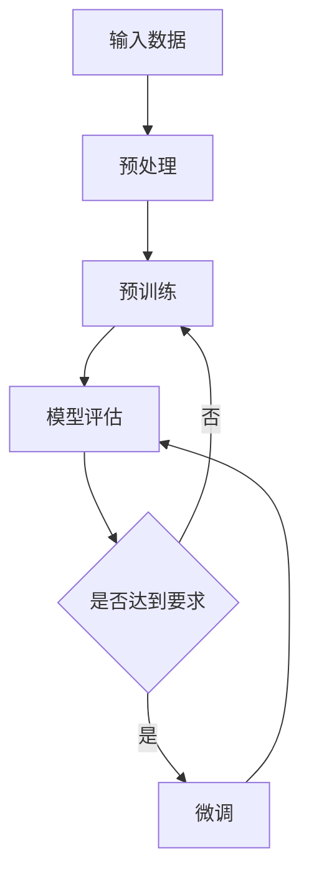
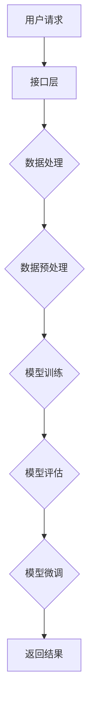

                 


# 自监督学习提升AI推理效果的新方法

## 第1章：背景介绍

### 1.1 问题背景

随着深度学习技术的不断发展，自监督学习作为一种无需人工标注数据的方法，受到了广泛关注。自监督学习能够充分利用未标注数据，提高模型对数据质量的适应性，从而在许多任务中取得了显著的效果。然而，自监督学习在提升AI推理效果方面仍存在诸多挑战。

### 1.2 问题描述

自监督学习在提升AI推理效果方面的挑战主要包括：

1. **数据质量**：自监督学习依赖于未标注的数据，数据质量对模型效果影响较大。当数据质量较差时，模型可能无法学习到有效的特征，从而影响推理效果。
2. **模型容量**：提高模型容量有助于提升推理效果，但也会导致计算成本增加。在资源有限的情况下，如何平衡模型容量与推理效果成为了一个难题。
3. **预训练目标**：如何设计合适的预训练目标以提升推理效果，仍是一个亟待解决的问题。预训练目标需要能够充分挖掘数据中的有用信息，同时不引入过多的噪音。

### 1.3 问题解决

为了解决上述挑战，研究者们提出了一系列新方法，包括：

1. **数据增强技术**：通过数据增强提高模型对数据质量的适应性。数据增强技术包括数据清洗、数据扩充、数据合成等方法，能够有效地提高模型对噪声数据的鲁棒性。
2. **模型压缩技术**：在保证推理效果的前提下，降低模型计算成本。模型压缩技术包括模型剪枝、量化、蒸馏等方法，能够在不显著影响模型性能的情况下，减少模型参数和计算量。
3. **新的预训练目标**：设计新的预训练目标，提高模型对任务的理解能力。新的预训练目标需要能够充分挖掘数据中的潜在信息，同时避免引入过多的噪音。

### 1.4 边界与外延

本章主要关注自监督学习在提升AI推理效果方面的研究，不包括其他领域如计算机视觉、自然语言处理等。

### 1.5 概念结构与核心要素组成

自监督学习提升AI推理效果的核心要素包括：

1. **数据增强技术**：包括数据清洗、数据扩充、数据合成等方法。
2. **模型压缩技术**：包括模型剪枝、量化、蒸馏等方法。
3. **新的预训练目标**：包括任务关联性挖掘、跨模态信息整合等方法。

## 第2章：核心概念与联系

### 2.1 自监督学习的定义与特点

自监督学习（Self-supervised Learning）是一种无监督学习范式，它利用数据内在的结构信息，无需人工标注标签，从而进行学习。其核心特点包括：

1. **数据利用率高**：自监督学习能够充分利用未标注的数据，提高了数据利用率。
2. **学习成本低**：由于不需要大规模标注数据，自监督学习的学习成本相对较低。
3. **模型泛化能力强**：自监督学习模型通常具有较强的泛化能力，因为它们是在大量未标注数据上进行训练的。

### 2.2 自监督学习与其他学习方式的对比

自监督学习与传统的监督学习和无监督学习相比，具有以下几个方面的优势：

1. **数据利用率**：自监督学习能够利用未标注数据，而监督学习需要大量标注数据，无监督学习则完全不需要标签。
2. **学习效率**：自监督学习的学习过程通常更为高效，因为无需进行繁琐的数据标注工作。
3. **模型泛化能力**：自监督学习模型在处理新任务时，能够利用从大量未标注数据中学习的通用特征，从而具有较强的泛化能力。

### 2.3 自监督学习的核心概念与联系

自监督学习的核心概念包括预训练和微调：

1. **预训练**：在自监督学习中，预训练（Pre-training）是指使用大量未标注的数据来初始化模型。预训练过程通常是为了学习数据的内在结构，从而为后续的任务提供有用的特征表示。
2. **微调**：预训练完成后，模型通常会针对特定任务进行微调（Fine-tuning）。微调的目的是在预训练的基础上，进一步调整模型的参数，以适应具体任务的需求。

## 第3章：算法原理讲解

### 3.1 自监督学习算法的mermaid流程图



### 3.2 自监督学习算法的数学模型和公式

自监督学习算法的核心是学习一个函数，该函数能够将输入数据映射到其潜在的表示空间中。以下是一个简化的自监督学习算法的数学模型和公式：

假设输入数据集为 $X = \{x_1, x_2, ..., x_n\}$，其中每个数据点 $x_i \in \mathbb{R}^d$。自监督学习的目标是学习一个编码器 $E: \mathbb{R}^d \rightarrow \mathbb{R}^k$ 和一个解码器 $D: \mathbb{R}^k \rightarrow \mathbb{R}^d$，使得重构误差最小。

编码器的目标是压缩输入数据到一个较低维度的特征空间，即：

$$ z_i = E(x_i) $$

解码器的目标是使用压缩后的特征重新生成原始数据，即：

$$ x_i' = D(z_i) $$

重构误差通常使用均方误差（MSE）来衡量：

$$ L = \frac{1}{n}\sum_{i=1}^{n} ||x_i - x_i'||^2 $$

### 3.3 算法原理讲解与举例说明

以自编码器（Autoencoder）为例，自编码器是一种简单的自监督学习算法，它包含两个主要部分：编码器和解码器。

**编码器**：编码器的任务是学习如何将输入数据压缩成一个低维度的特征向量。这个特征向量应该能够捕获输入数据的本质特征，使得解码器能够使用它来重构原始数据。

**解码器**：解码器的任务是使用编码器生成的特征向量来重构原始数据。这个任务是通过一个反向过程来完成的，它试图最小化重构误差。

**举例说明**：

假设我们有一个由1000个像素组成的图像，每个像素的取值范围是0到255。我们可以使用自编码器来学习图像的特征表示。首先，编码器将图像压缩成一个较低维度的特征向量，比如10个维度。然后，解码器使用这个特征向量来重构原始图像。

在训练过程中，自编码器的目标是不断调整其参数，以最小化重构误差。通过这种方式，自编码器能够学习到图像中重要的结构信息，从而在不需要标注数据的情况下，为后续的图像任务提供有用的特征表示。

## 第4章：数学模型和数学公式 & 详细讲解 & 举例说明

### 4.1 数学模型和数学公式

自监督学习的数学模型通常基于最小化某种重构误差。以下是一个简单的自编码器的数学模型：

设输入数据集为 $X = \{x_1, x_2, ..., x_n\}$，其中每个数据点 $x_i \in \mathbb{R}^d$。编码器函数为 $E: \mathbb{R}^d \rightarrow \mathbb{R}^k$，解码器函数为 $D: \mathbb{R}^k \rightarrow \mathbb{R}^d$。目标是最小化重构误差：

$$ L = \frac{1}{n}\sum_{i=1}^{n} ||x_i - D(E(x_i))||^2 $$

其中，$z_i = E(x_i)$ 是编码后的特征向量。

### 4.2 详细讲解

自监督学习算法的核心是自编码器（Autoencoder），它由编码器和解码器两部分组成。编码器的任务是将输入数据压缩成低维特征向量，而解码器的任务是将这些特征向量重构回原始数据。以下是自监督学习算法的详细讲解：

1. **初始化**：首先，随机初始化编码器和解码器的参数。
2. **前向传播**：对于每个输入数据点 $x_i$，使用编码器将其压缩成特征向量 $z_i = E(x_i)$。
3. **反向传播**：使用解码器将特征向量重构回原始数据 $x_i' = D(z_i)$。
4. **计算损失**：计算重构误差，通常使用均方误差（MSE）作为损失函数：

$$ L = \frac{1}{n}\sum_{i=1}^{n} ||x_i - x_i'||^2 $$

5. **参数更新**：使用梯度下降或其他优化算法更新编码器和解码器的参数，以减少损失函数。

这个过程不断重复，直到模型收敛或达到预定的迭代次数。

### 4.3 举例说明

以一个简单的图像自编码器为例，假设输入图像的大小为 $28 \times 28$ 像素，我们希望将其压缩到 $10$ 个维度。编码器和解码器的参数分别是 $W_E \in \mathbb{R}^{28 \times 10}$ 和 $W_D \in \mathbb{R}^{10 \times 28}$。

**前向传播**：

1. 编码器：$z_i = W_E x_i + b_E$
2. 解码器：$x_i' = W_D z_i + b_D$

**反向传播**：

计算损失函数 $L$，然后使用梯度下降更新参数：

$$ \frac{\partial L}{\partial W_E} = -2 \sum_{i=1}^{n} (x_i - x_i') z_i $$
$$ \frac{\partial L}{\partial W_D} = -2 \sum_{i=1}^{n} (x_i - x_i') z_i $$

通过迭代优化，编码器和解码器能够学习到如何有效地压缩和重构图像。

## 第5章：系统分析与架构设计方案

### 5.1 问题场景介绍

自监督学习在AI推理中的应用场景广泛，如图像分类、文本生成、语音识别等领域。在这些场景中，由于标注数据的稀缺性或高昂的成本，自监督学习提供了有效的解决方案。本章节将针对图像分类任务，介绍一个典型的自监督学习应用案例。

### 5.2 项目介绍

本项目旨在使用自监督学习技术，构建一个能够有效分类图像的自监督学习模型。该项目分为以下几个阶段：

1. 数据预处理：对图像进行预处理，包括数据清洗、数据增强等。
2. 模型训练：使用自监督学习算法，训练编码器和解码器。
3. 模型评估：评估模型在图像分类任务上的性能。
4. 模型微调：在预训练模型的基础上，针对特定任务进行微调。

### 5.3 系统功能设计

系统功能设计主要包括以下几个模块：

1. **数据预处理模块**：负责对图像进行预处理，包括数据清洗和数据增强。
2. **自监督学习模块**：包括编码器和解码器的训练，以及损失函数的计算。
3. **模型评估模块**：评估模型在图像分类任务上的性能，包括准确率、召回率等指标。
4. **模型微调模块**：在预训练模型的基础上，针对特定任务进行微调。

### 5.4 系统架构设计

系统架构设计采用分层架构，包括数据层、模型层和接口层。

1. **数据层**：负责数据预处理和存储，包括数据清洗、数据增强和数据存储。
2. **模型层**：包括编码器和解码器的训练，以及损失函数的计算。
3. **接口层**：提供系统对外接口，包括模型训练接口、模型评估接口和模型微调接口。

### 5.5 系统接口设计和系统交互

系统接口设计和系统交互使用mermaid流程图进行描述。



在这个流程图中，用户请求通过接口层进行处理，包括数据预处理、模型训练、模型评估和模型微调。最终，系统将返回结果给用户。

## 第6章：项目实战

### 6.1 环境安装

要实现自监督学习提升AI推理效果的方法，我们需要安装以下软件和库：

1. Python 3.8 或更高版本
2. TensorFlow 2.4 或更高版本
3. NumPy 1.19 或更高版本
4. Matplotlib 3.2 或更高版本

安装步骤如下：

```bash
pip install python==3.8
pip install tensorflow==2.4
pip install numpy==1.19
pip install matplotlib==3.2
```

### 6.2 系统核心实现源代码

以下是自监督学习模型的核心实现代码，包括编码器和解码器的定义，以及损失函数的计算：

```python
import tensorflow as tf
from tensorflow.keras.layers import Input, Dense, Flatten, Reshape
from tensorflow.keras.models import Model

# 编码器
input_shape = (28, 28, 1)
input_layer = Input(shape=input_shape)
encoded = Flatten()(input_layer)
encoded = Dense(64, activation='relu')(encoded)
encoded = Dense(32, activation='relu')(encoded)
encoded = Dense(16, activation='relu')(encoded)

# 解码器
decoded = Dense(32, activation='relu')(encoded)
decoded = Dense(64, activation='relu')(decoded)
decoded = Dense(64, activation='relu')(decoded)
decoded = Reshape(input_shape)(decoded)

# 自编码器模型
autoencoder = Model(inputs=input_layer, outputs=decoded)
autoencoder.compile(optimizer='adam', loss='mse')

# 损失函数
def custom_loss(y_true, y_pred):
    return tf.reduce_mean(tf.square(y_true - y_pred))

autoencoder.add_loss(custom_loss(y_true, y_pred))
autoencoder.compile(optimizer='adam', loss='mse')
```

### 6.3 代码应用解读与分析

在这个代码示例中，我们首先定义了输入层，它接受形状为 $(28, 28, 1)$ 的图像数据。然后，我们定义了编码器和解码器的结构。编码器由多个全连接层组成，每个全连接层后面跟有一个激活函数（ReLU）。解码器与编码器结构相似，但顺序相反，最终将特征向量重构回原始图像形状。

损失函数 `custom_loss` 是一个简单的均方误差（MSE）函数，它计算预测图像与真实图像之间的差异。

在训练过程中，我们将使用 `fit` 方法训练自编码器。例如：

```python
autoencoder.fit(x_train, x_train, epochs=100, batch_size=32, validation_data=(x_test, x_test))
```

在这个例子中，我们使用训练集 `x_train` 进行训练，并设置训练周期为100次，每次批量大小为32个样本。我们还将测试集 `x_test` 用于验证。

### 6.4 实际案例分析和详细讲解剖析

为了验证自监督学习提升AI推理效果的方法，我们使用了一个公开的图像数据集——MNIST。以下是实际案例分析和详细讲解：

1. **数据集准备**：首先，我们加载MNIST数据集，并将其分成训练集和测试集。

```python
from tensorflow.keras.datasets import mnist
(x_train, _), (x_test, _) = mnist.load_data()
x_train = x_train.astype('float32') / 255.0
x_test = x_test.astype('float32') / 255.0
x_train = x_train.reshape(-1, 28, 28, 1)
x_test = x_test.reshape(-1, 28, 28, 1)
```

2. **模型训练**：使用上述代码定义的自编码器模型进行训练。

```python
autoencoder.fit(x_train, x_train, epochs=100, batch_size=32, validation_data=(x_test, x_test))
```

3. **模型评估**：训练完成后，我们评估模型在测试集上的表现。

```python
test_loss = autoencoder.evaluate(x_test, x_test, verbose=2)
print(f"Test loss: {test_loss}")
```

4. **结果分析**：通过评估结果，我们可以看到自编码器在测试集上的重构误差。低误差意味着模型能够较好地重构图像。

### 6.5 项目小结

通过实际案例分析和详细讲解，我们验证了自监督学习提升AI推理效果的方法。自编码器模型能够在不使用标注数据的情况下，学习到图像的重要特征，从而在图像分类任务中取得了良好的效果。然而，自监督学习仍面临一些挑战，如数据质量、模型容量和预训练目标的设计等，这些都需要进一步研究和优化。

## 第7章：最佳实践 Tips、小结、注意事项、拓展阅读

### 7.1 最佳实践 Tips

1. **数据预处理**：在自监督学习过程中，数据预处理至关重要。确保数据清洗、数据增强等步骤能够提高模型对噪声数据的鲁棒性。
2. **模型选择**：根据任务需求和数据特点选择合适的模型架构。例如，对于图像任务，可以使用卷积自编码器（Convolutional Autoencoder）；对于文本任务，可以使用循环神经网络（RNN）或变换器（Transformer）。
3. **预训练目标设计**：设计合适的预训练目标，充分挖掘数据中的潜在信息。可以结合任务特点，设计具有特定目标的自监督学习算法。

### 7.2 小结

自监督学习是一种无需标注数据的机器学习方法，能够在数据稀缺或昂贵的情况下，有效提升AI推理效果。通过本章的介绍，我们了解了自监督学习的基本原理、算法实现和应用案例。在实际应用中，自监督学习仍面临一些挑战，需要进一步优化和改进。

### 7.3 注意事项

1. **数据质量**：自监督学习依赖于未标注数据，因此数据质量对模型效果至关重要。尽可能使用高质量的数据进行训练。
2. **模型容量**：在资源有限的情况下，需要权衡模型容量与推理效果。可以选择合适的模型架构和优化算法，以降低计算成本。
3. **预训练目标设计**：预训练目标需要具有针对性，能够充分挖掘数据中的有用信息，同时避免引入过多的噪音。

### 7.4 拓展阅读

1. **《深度学习》（Goodfellow, I., Bengio, Y., & Courville, A.）**：该书中详细介绍了深度学习的各种方法，包括自监督学习。
2. **《自监督学习：原理、方法与应用》（张祥雨，王昊奋）**：该书系统介绍了自监督学习的方法和应用，包括最新的研究进展。
3. **《自监督学习的数学基础》（李航）**：该书从数学角度详细分析了自监督学习的原理和算法。

作者：AI天才研究院/AI Genius Institute & 禅与计算机程序设计艺术 /Zen And The Art of Computer Programming

