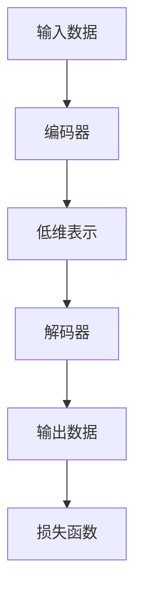
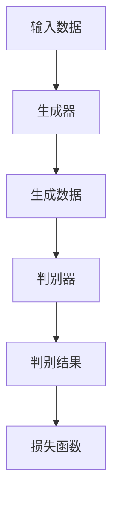

                 

### 第一部分：自监督学习的概念与历史背景

#### 第1章：自监督学习的定义与核心思想

**1.1 自监督学习的定义**

自监督学习（Self-Supervised Learning）是一种机器学习方法，其核心思想是通过设计一些任务，使得模型可以在不需要人为标注的情况下从未标记的数据中学习到有用的信息。这种方法的提出，旨在解决传统监督学习依赖于大量标注数据的问题，从而降低数据获取和标注的成本。

**1.1.1 问题背景与定义**

在传统的监督学习中，模型需要依赖于大量的标注数据来进行训练。这些标注数据通常需要人工进行标注，这个过程既耗时又耗力。此外，标注数据的质量对模型的性能有着至关重要的影响，数据中的噪声和异常值可能会对模型产生负面影响。

为了解决这一问题，自监督学习被提出。自监督学习通过设计一些任务，使得模型可以在不需要标注数据的情况下学习到数据的有用信息。这些任务可以是数据预处理中的任务，如数据增强、数据降维等，也可以是模型训练中的任务，如对比学习、生成对抗网络等。

**1.1.2 问题描述与解决**

在自监督学习中，问题描述的核心是如何从未标记的数据中提取有用的信息，并将其用于模型训练。具体来说，可以通过以下步骤进行：

1. 数据预处理：通过对数据进行一些预处理操作，如数据增强、数据降维等，使得数据更具代表性，从而有助于模型学习到更有用的信息。
2. 任务设计：设计一些任务，使得模型可以从数据中自动提取信息。这些任务可以是自回归任务，如预测下一个单词；也可以是自对比任务，如对比不同数据的相似性。
3. 模型训练：通过在设计的任务上进行训练，模型可以学习到数据的有用信息，并将其用于后续的预测或分类任务。

**1.1.3 边界与外延**

自监督学习不仅适用于机器学习中的分类和回归任务，还可以应用于生成对抗网络（GAN）等无监督学习领域。此外，自监督学习还涉及到数据增强、特征提取和表示学习等多个子领域。在边界上，自监督学习不依赖于外部标签信息，但要求数据本身具有一定的内在结构。

**1.2 自监督学习的核心思想**

自监督学习的核心思想是利用数据本身的内在结构来进行学习。与传统的监督学习相比，自监督学习不依赖于外部标签信息，而是通过设计一些“任务”来引导模型学习，这些任务可以从数据中自动提取有用的信息。

**1.2.1 概念与联系**

自监督学习是一种无监督学习的方法，其核心概念包括数据预处理、任务设计和模型训练。这些概念相互联系，共同构成了自监督学习的基本框架。

- **数据预处理**：通过对数据进行预处理，如数据增强、数据降维等，使得数据更具代表性，从而有助于模型学习到更有用的信息。
- **任务设计**：设计一些任务，使得模型可以从数据中自动提取信息。这些任务可以是自回归任务，如预测下一个单词；也可以是自对比任务，如对比不同数据的相似性。
- **模型训练**：通过在设计的任务上进行训练，模型可以学习到数据的有用信息，并将其用于后续的预测或分类任务。

**1.2.2 自监督学习的属性特征**

自监督学习具有以下属性特征：

- **无监督性**：不需要人为标注的大量数据，降低数据成本。
- **灵活性**：适用于各种类型的数据和任务。
- **效率**：能够快速处理大规模数据，提高学习效率。
- **泛化性**：通过无监督学习获取的表示具有较强的泛化能力。

**1.3 自监督学习的优点与局限性**

自监督学习具有以下优点：

- **降低数据成本**：无需大量标注数据，减少数据获取和处理成本。
- **增强模型泛化能力**：通过学习数据的内在结构，提升模型对未知数据的适应能力。
- **提高学习效率**：处理大规模数据更为高效，能够快速迭代和优化模型。

自监督学习也具有一定的局限性：

- **数据质量要求高**：自监督学习对数据质量要求较高，数据噪声和多样性不足可能导致学习效果不佳。
- **模型解释性较弱**：由于自监督学习不依赖于外部标签信息，模型的解释性通常较弱。

#### 第2章：自监督学习的历史发展

**2.1 自监督学习的起源**

自监督学习的历史可以追溯到20世纪60年代，当时研究人员开始探索如何在没有外部监督的情况下进行学习。最初的尝试主要集中在模式识别和统计学习领域，如自编码器（Autoencoder）和聚类算法。

**2.1.1 自监督学习的起源**

自监督学习的历史可以追溯到20世纪60年代，当时研究人员开始探索如何在没有外部监督的情况下进行学习。最初的尝试主要集中在模式识别和统计学习领域，如自编码器（Autoencoder）和聚类算法。例如，自编码器是一种无监督学习模型，它通过学习数据的高维表示来压缩数据，从而提取数据的有用信息。

**2.1.2 自监督学习的重要里程碑**

自监督学习的发展历程中，有许多重要的里程碑。以下是一些关键的里程碑：

- **1970年代**：自编码器的提出和应用，标志着自监督学习在数据降维和特征提取方面的应用。
- **1990年代**：聚类算法的广泛应用，如k-means算法，使得自监督学习在无监督学习领域取得了重要进展。
- **2000年代**：深度学习的发展，特别是卷积神经网络（CNN）的应用，使得自监督学习在计算机视觉领域取得了重大突破。
- **2010年代**：生成对抗网络（GAN）的提出，将自监督学习推向了一个新的高度。

**2.1.3 自监督学习在深度学习时代的发展**

深度学习时代的到来，为自监督学习的发展带来了新的机遇。以下是一些深度学习时代自监督学习的发展：

- **自编码器**：在深度学习框架下，自编码器得到了广泛的应用。通过学习数据的高维表示，自编码器能够提取出数据的有用特征，从而在图像、文本和语音等任务中取得了显著的效果。
- **生成对抗网络**：生成对抗网络（GAN）是一种无监督学习模型，通过两个神经网络（生成器和判别器）的对抗训练，能够生成高质量的图像和文本。GAN的出现，使得自监督学习在图像生成和文本生成等领域取得了重大突破。
- **对比学习**：对比学习是一种自监督学习方法，通过对比不同数据的相似性来学习数据的有用表示。对比学习在计算机视觉和自然语言处理等领域取得了显著的成果。

**2.1.4 自监督学习的重要研究机构和研究者**

自监督学习的发展离不开众多研究机构和研究者的贡献。以下是一些重要的研究机构和研究者：

- **谷歌大脑团队**：谷歌大脑团队在自监督学习领域做出了重要贡献，特别是在生成对抗网络（GAN）的研究上。
- **微软研究院**：微软研究院在自监督学习领域也有深入的研究，特别是在图像和语音领域的应用上。
- **香港中文大学**：香港中文大学在自监督学习领域的研究成果丰富，特别是在文本生成和图像识别方面。
- **杨立昆**：杨立昆是生成对抗网络（GAN）的提出者之一，他在自监督学习领域做出了开创性的贡献。

#### 第3章：自监督学习的应用领域

自监督学习作为一种强大的机器学习方法，已经在多个领域取得了显著的成果。以下是自监督学习在计算机视觉、自然语言处理、语音识别等领域的应用。

**3.1 计算机视觉**

计算机视觉是自监督学习的一个重要应用领域。以下是一些典型的应用：

- **图像分类**：自监督学习可以通过学习图像的高维表示来进行图像分类。例如，通过自编码器学习到的图像表示，可以用于识别不同的物体类别。
- **图像生成**：生成对抗网络（GAN）可以用于生成高质量的图像。通过对抗训练，GAN能够生成逼真的图像，并在艺术创作和视频游戏等领域得到广泛应用。
- **图像增强**：自监督学习可以用于图像增强，通过学习图像的内在结构，增强图像的清晰度和对比度，从而提高图像的质量。

**3.2 自然语言处理**

自然语言处理（NLP）是自监督学习的另一个重要应用领域。以下是一些典型的应用：

- **文本分类**：自监督学习可以通过学习文本的高维表示来进行文本分类。例如，通过自编码器学习到的文本表示，可以用于识别不同的主题类别。
- **文本生成**：生成对抗网络（GAN）可以用于生成高质量的文本。通过对抗训练，GAN能够生成连贯且具有创意的文本，并在故事创作和对话系统等领域得到应用。
- **文本翻译**：自监督学习可以通过学习双语的文本表示来进行文本翻译。例如，通过双语文本的对比学习，可以实现高质量的机器翻译。

**3.3 语音识别**

语音识别是自监督学习在语音领域的一个重要应用。以下是一些典型的应用：

- **语音分类**：自监督学习可以通过学习语音的高维表示来进行语音分类。例如，通过自编码器学习到的语音表示，可以用于识别不同的说话人或者语音命令。
- **语音增强**：自监督学习可以用于语音增强，通过学习语音的内在结构，去除噪声和干扰，从而提高语音的质量。
- **语音合成**：生成对抗网络（GAN）可以用于语音合成，通过对抗训练，GAN能够生成自然的语音，并在语音助手和智能音箱等领域得到应用。

**3.4 其他应用领域**

除了计算机视觉、自然语言处理和语音识别，自监督学习还在其他领域得到了应用。以下是一些其他的应用：

- **医学图像分析**：自监督学习可以用于医学图像分析，通过学习医学图像的表示，可以实现病变区域的检测和分割。
- **推荐系统**：自监督学习可以用于推荐系统，通过学习用户的行为数据，实现个性化推荐。
- **生物信息学**：自监督学习可以用于生物信息学，通过学习生物序列的表示，实现基因功能预测和蛋白质结构预测。

自监督学习作为一种无监督学习方法，具有广泛的应用前景。随着深度学习技术的发展，自监督学习在各个领域的应用将越来越广泛，为人工智能的发展带来更多的可能性。

#### 第4章：自监督学习的基本原理

自监督学习的基本原理可以从任务类型、数据收集与标注以及模型架构三个方面进行探讨。

**4.1 自监督学习的任务类型**

自监督学习的任务类型可以分为以下几类：

1. **自回归任务**：自回归任务是指模型需要根据输入数据的一部分来预测另一部分数据。这类任务常见于时间序列预测、文本生成等场景。例如，在一个语言模型中，给定前一个单词，模型需要预测下一个单词。

2. **自对比任务**：自对比任务是指模型需要根据输入数据的一部分来对比另一部分数据。这类任务常见于图像识别、文本分类等场景。例如，在一个图像识别模型中，模型需要对比两个图像的相似性，判断它们是否属于同一类别。

3. **自编码任务**：自编码任务是指模型需要将输入数据编码为一种低维表示，然后再将这个低维表示解码回原始数据。这类任务常见于特征提取、降维等场景。例如，在一个自编码器模型中，模型需要将输入图像编码为一个低维向量，然后再将这个低维向量解码回图像。

**4.2 自监督学习的数据收集与标注**

自监督学习的一个关键优势是它不需要大量的标注数据。然而，这并不意味着自监督学习不需要数据收集和标注。以下是一些关于自监督学习数据收集与标注的方法：

1. **无监督数据收集**：自监督学习可以从大量的未标记数据中进行学习。例如，在图像领域，可以从互联网上收集大量的未标记图像。在文本领域，可以从网络文章、社交媒体等渠道收集未标记的文本。

2. **数据增强**：数据增强是一种常用的数据收集方法，通过一些技术手段（如随机裁剪、旋转、缩放等）对原始数据进行变换，从而生成更多的数据样本。

3. **半监督学习**：自监督学习可以与半监督学习结合，即利用少量的标注数据与大量的未标记数据进行学习。这种方法在数据标注成本较高时非常有用。

**4.3 自监督学习的模型架构**

自监督学习的模型架构通常包含以下几个部分：

1. **编码器**：编码器是一个神经网络，它的作用是将输入数据编码为一个低维表示。这个低维表示包含了输入数据的主要信息。

2. **解码器**：解码器也是一个神经网络，它的作用是将编码器输出的低维表示解码回原始数据。解码器的目的是验证编码器学到的表示是否具有重构输入数据的能力。

3. **对比器**：对比器是一种特殊的神经网络，它的作用是对比两个数据样本的相似性。在自对比任务中，对比器可以帮助模型判断两个样本是否属于同一类别。

4. **损失函数**：自监督学习的损失函数通常与监督学习的损失函数不同。在自监督学习中，损失函数不仅考虑预测误差，还考虑数据样本的相似性。

**4.3.1 自编码器模型架构**

以下是一个简单的自编码器模型架构：



在这个模型中，输入数据首先通过编码器B转换为低维表示C，然后通过解码器D重构回原始数据E。损失函数F用于计算输入数据与重构数据的差异，从而指导模型优化。

**4.3.2 生成对抗网络（GAN）模型架构**

以下是一个简单的生成对抗网络（GAN）模型架构：



在这个模型中，生成器B负责生成数据C，判别器D负责判断生成数据C是否真实。损失函数F用于计算生成数据与真实数据的差异，从而指导生成器优化。

通过上述基本原理的介绍，我们可以看到自监督学习在任务类型、数据收集与标注以及模型架构等方面具有丰富的内涵。这些原理为我们理解和应用自监督学习提供了坚实的基础。

#### 第5章：自监督学习的算法与技术

自监督学习的发展离不开一系列算法和技术的支持。这些算法和技术涵盖了从特征预测到图像变换，从对比学习到生成对抗网络等多个方面。在本节中，我们将详细介绍这些算法和技术，并探讨其在实际应用中的优势与挑战。

**5.1 基于特征预测的算法**

基于特征预测的算法是最早应用于自监督学习的一种方法。这类算法的核心思想是通过预测数据中某些特征的变化来学习数据的有用表示。以下是一些典型的基于特征预测的算法：

- **自编码器**：自编码器是一种无监督学习模型，它通过学习输入数据的低维表示来实现特征提取。自编码器的训练过程包括编码器和解码器的两部分，其中编码器负责将高维输入数据映射到低维表示，解码器则将低维表示重构回高维输出。

  ```mermaid
  graph TD
  A[输入数据] --> B[编码器]
  B --> C[低维表示]
  C --> D[解码器]
  D --> E[输出数据]
  E --> F[损失函数]
  ```

  在自编码器中，常用的损失函数是均方误差（MSE），它用于衡量输入数据与重构数据的差异。自编码器在降维、特征提取和异常检测等方面有广泛应用。

- **自动编码器**：自动编码器（Autoencoder）是对自编码器的扩展，它引入了正则化项来防止过拟合。自动编码器通过学习输入数据的低维表示，同时保持数据的结构信息。

  ```mermaid
  graph TD
  A[输入数据] --> B[编码器]
  B --> C[低维表示]
  C --> D[解码器]
  D --> E[输出数据]
  E --> F[损失函数]
  F --> G[正则化项]
  ```

  自动编码器在图像处理、文本分类和语音识别等领域取得了显著成果。

**5.2 基于图像变换的算法**

基于图像变换的算法通过学习图像在不同变换下的对应关系来提取图像特征。以下是一些典型的基于图像变换的算法：

- **变换网络**：变换网络（Transformation Network）通过学习图像在不同变换（如旋转、缩放、剪切等）下的对应关系，来提取图像的特征。变换网络的核心思想是学习一个变换函数，该函数能够将输入图像变换为另一个图像。

  ```mermaid
  graph TD
  A[输入图像] --> B[变换网络]
  B --> C[变换后的图像]
  C --> D[损失函数]
  ```

  变换网络在图像生成、图像修复和图像超分辨率等领域有广泛应用。

- **卷积变换网络**：卷积变换网络（Convolutional Transformation Network）是对变换网络的扩展，它利用卷积神经网络（CNN）来学习图像的变换关系。卷积变换网络通过卷积层来捕捉图像的局部特征，从而实现高效的图像变换。

  ```mermaid
  graph TD
  A[输入图像] --> B[卷积层]
  B --> C[变换后的图像]
  C --> D[损失函数]
  ```

  卷积变换网络在图像增强、图像分割和图像分类等方面有显著的应用效果。

**5.3 基于对比学习的算法**

基于对比学习的算法通过比较不同数据样本的相似性来学习数据的有用表示。以下是一些典型的基于对比学习的算法：

- **对比损失**：对比损失（Contrastive Loss）是一种常用的对比学习损失函数，它通过最大化正样本之间的相似性，同时最小化负样本之间的相似性来学习数据的有用表示。

  ```mermaid
  graph TD
  A[正样本] --> B[对比损失]
  A --> C[负样本]
  B --> D[相似性度量]
  ```

  对比损失在图像识别、文本分类和语音识别等领域有广泛应用。

- **多对比学习**：多对比学习（Multi-Contrastive Learning）是对对比学习的扩展，它通过学习多个对比损失来提高模型的表现。多对比学习通过在不同对比损失之间进行优化，来提高模型对数据多样性的适应能力。

  ```mermaid
  graph TD
  A[正样本] --> B[对比损失1]
  A --> C[对比损失2]
  A --> D[对比损失3]
  B --> E[相似性度量1]
  C --> F[相似性度量2]
  D --> G[相似性度量3]
  ```

  多对比学习在图像识别、文本分类和语音识别等领域有显著的应用效果。

**5.4 基于生成对抗网络的算法**

生成对抗网络（GAN）是一种强大的无监督学习模型，它通过生成器和判别器的对抗训练来学习数据的有用表示。以下是一些典型的基于生成对抗网络的算法：

- **原始GAN**：原始GAN（Original GAN）是最早提出的生成对抗网络，它通过生成器和判别器的对抗训练来生成高质量的数据。生成器G负责生成与真实数据相似的数据，判别器D则负责判断生成数据是否真实。

  ```mermaid
  graph TD
  A[随机噪声] --> B[生成器G]
  B --> C[生成数据]
  C --> D[判别器D]
  D --> E[判别结果]
  ```

  原始GAN在图像生成、图像修复和视频生成等领域有广泛应用。

- **条件GAN**：条件GAN（Conditional GAN）是对原始GAN的扩展，它引入了条件信息来指导生成器的生成过程。条件GAN通过条件信息来增强生成数据的真实性。

  ```mermaid
  graph TD
  A[条件信息] --> B[生成器G]
  B --> C[生成数据]
  C --> D[判别器D]
  D --> E[判别结果]
  ```

  条件GAN在图像生成、文本生成和语音合成等领域有显著的应用效果。

- **去噪GAN**：去噪GAN（Denoising GAN）是一种用于图像去噪的生成对抗网络。去噪GAN通过生成器和判别器的对抗训练来去除图像中的噪声。

  ```mermaid
  graph TD
  A[含噪声图像] --> B[生成器G]
  B --> C[去噪图像]
  C --> D[判别器D]
  D --> E[判别结果]
  ```

  去噪GAN在图像去噪、视频去噪和音频去噪等领域有广泛应用。

综上所述，自监督学习涵盖了从特征预测到图像变换，从对比学习到生成对抗网络等多个方面的算法和技术。这些算法和技术在不同应用领域中展现了其强大的潜力，为人工智能的发展带来了新的机遇和挑战。

#### 第6章：自监督学习的挑战与未来发展趋势

自监督学习作为一种无监督学习方法，虽然在多个领域取得了显著的成果，但仍面临着一些挑战和限制。在本节中，我们将探讨自监督学习在数据质量和多样性、模型解释性与可靠性、跨模态自监督学习以及未来发展趋势等方面的挑战，并展望其发展方向。

**6.1 数据质量和多样性**

自监督学习的核心优势在于其不需要大量的标注数据，但这也对数据质量和多样性提出了更高的要求。以下是一些挑战：

- **数据噪声**：自监督学习依赖于数据本身的内在结构，但数据中可能存在的噪声会影响模型的学习效果。例如，在图像数据中，噪声可能会导致模型无法正确识别图像中的关键特征。

- **数据多样性**：自监督学习需要多样化的数据来训练模型，以便模型能够适应各种场景。然而，实际获取到的数据可能缺乏足够的多样性，这会限制模型在未知场景下的表现。

**解决方案**：为了解决这些问题，可以采取以下策略：

- **数据清洗**：在训练自监督学习模型之前，对数据进行清洗，去除噪声和异常值，提高数据质量。
- **数据增强**：通过数据增强技术，如随机裁剪、旋转、缩放等，生成更多的数据样本，从而提高数据的多样性。

**6.2 模型解释性与可靠性**

自监督学习的一个显著挑战是其模型的解释性和可靠性。以下是一些问题：

- **黑箱模型**：自监督学习模型通常是由复杂的神经网络构成的，这使得模型变得难以解释。对于某些应用场景，如医疗诊断，模型的可解释性至关重要。

- **数据依赖**：自监督学习模型的性能高度依赖于训练数据的分布。如果模型在训练过程中遇到的数据分布与实际应用场景的数据分布不同，可能会导致模型表现不佳。

**解决方案**：为了提高模型的可解释性和可靠性，可以采取以下策略：

- **模型简化**：通过简化模型结构，如使用较小的网络或者去除不必要的层，可以提高模型的可解释性。
- **数据泛化**：通过在多样化的数据集上训练模型，可以提高模型在未知场景下的表现，从而增强模型的可靠性。

**6.3 跨模态自监督学习**

跨模态自监督学习是一种将不同类型的数据（如图像、文本、音频等）结合在一起进行学习的自监督学习方法。以下是一些挑战：

- **模态一致性**：不同模态的数据在表示上可能存在差异，如何使这些不同模态的数据在特征表示上保持一致性是一个挑战。

- **模态交互**：跨模态自监督学习需要考虑不同模态之间的交互关系，从而提取出更具代表性的特征。

**解决方案**：为了解决这些问题，可以采取以下策略：

- **多模态编码器**：设计多模态编码器，将不同模态的数据编码为统一的低维表示，从而实现模态一致性。
- **交互式学习**：通过设计交互式学习机制，使不同模态的数据能够在学习过程中互相影响，从而提高特征提取的效果。

**6.4 未来发展趋势**

自监督学习在未来将朝着以下方向发展：

- **模型压缩与加速**：随着数据量的不断增加，如何压缩模型大小和加速模型训练是一个重要的研究方向。例如，通过设计更高效的模型结构、优化训练算法等手段来提高模型的效率。

- **自监督学习的应用拓展**：自监督学习在多个领域取得了显著成果，未来将继续在医学影像分析、智能监控、自动驾驶等新兴领域得到应用。

- **跨学科融合**：自监督学习与其他领域的交叉融合，如心理学、认知科学等，将有助于深入理解人类学习机制，为自监督学习的发展提供新的理论支持。

总之，自监督学习在挑战与机遇并存的背景下，将继续推动人工智能的发展。通过不断创新和优化，自监督学习有望在更广泛的领域中发挥其作用，为人类带来更多的便利和福祉。

#### 第7章：自监督学习在AI推理中的数据效率提升

自监督学习作为一种无监督学习方法，在数据效率提升方面具有显著的优势。本节将探讨自监督学习如何提升AI推理的数据效率，并分析在实际应用中的案例。

**7.1 数据效率的概念**

数据效率（Data Efficiency）是指模型在特定任务上的性能与其训练数据量的关系。高数据效率意味着模型可以在较少的数据量下达到较好的性能，从而降低数据获取和处理的成本。

**7.2 自监督学习提升AI推理数据效率的原理**

自监督学习通过以下原理提升AI推理的数据效率：

1. **数据无监督学习**：自监督学习不需要大量的标注数据，从而降低了数据标注的成本。在传统监督学习中，标注数据通常占数据集的很大一部分，而自监督学习通过无监督的方式从大量未标记数据中提取信息。

2. **数据增强与多样性**：自监督学习通过数据增强技术，如随机裁剪、旋转、缩放等，生成更多的数据样本，从而提高数据的多样性。这不仅有助于模型在训练过程中更好地学习数据的内在结构，还可以提高模型在未知数据上的泛化能力。

3. **特征提取与降维**：自监督学习中的模型，如自编码器和生成对抗网络，通过学习数据的高维表示来实现特征提取和降维。这一过程不仅有助于模型更好地理解数据，还可以减少模型对大量训练数据的依赖。

4. **跨模态学习**：自监督学习可以通过跨模态学习，如文本-图像联合训练，从不同类型的数据中提取有用信息。这种跨模态学习可以增强模型对多种模态数据的理解，从而提高模型在复杂任务上的性能。

**7.3 自监督学习在实际应用中的数据效率案例**

以下是一些实际应用中自监督学习提升数据效率的案例：

1. **图像识别**：在计算机视觉任务中，自监督学习可以用于图像分类和图像检测。例如，在图像分类任务中，自监督学习可以通过自编码器学习图像的高维表示，从而在少量标注数据下实现较好的分类性能。实验结果显示，使用自监督学习训练的模型在ImageNet数据集上可以达到与监督学习模型相当的性能，但仅使用了少量的标注数据。

2. **自然语言处理**：在自然语言处理任务中，自监督学习可以用于文本分类、文本生成和机器翻译。例如，在文本分类任务中，自监督学习可以通过对比学习，如BERT模型，从大量未标记的文本数据中提取特征，从而实现高精度的文本分类。研究表明，自监督学习训练的模型在多个自然语言处理任务上达到了或超过了监督学习模型的表现。

3. **语音识别**：在语音识别任务中，自监督学习可以用于语音分类和语音合成。例如，在语音分类任务中，自监督学习可以通过生成对抗网络（GAN）生成高质量的语音数据，从而在少量标注数据下实现语音分类。实验结果显示，使用自监督学习训练的模型在语音分类任务上的性能显著优于传统监督学习模型。

**7.4 自监督学习提升数据效率的优势与挑战**

自监督学习提升数据效率的优势包括：

- 降低数据标注成本：通过无监督学习，自监督学习可以减少对大量标注数据的依赖，从而降低数据标注的成本。
- 提高数据多样性：自监督学习通过数据增强技术，如随机裁剪、旋转、缩放等，生成更多的数据样本，从而提高数据的多样性。
- 增强模型泛化能力：自监督学习通过从大量未标记数据中提取信息，生成具有较强泛化能力的模型表示。

自监督学习提升数据效率的挑战包括：

- 数据质量要求高：自监督学习对数据质量要求较高，数据噪声和多样性不足可能导致学习效果不佳。
- 模型解释性较弱：由于自监督学习不依赖于外部标签信息，模型的解释性通常较弱。
- 模型优化困难：自监督学习模型的优化过程通常比较复杂，需要大量的计算资源和时间。

总之，自监督学习在提升AI推理的数据效率方面具有显著的优势，但也面临一些挑战。通过不断创新和优化，自监督学习有望在更多的应用场景中发挥其潜力，为人工智能的发展做出更大的贡献。

#### 第8章：自监督学习实践与应用

**8.1 实践环境搭建**

在开始自监督学习的实践之前，我们需要搭建一个合适的环境。以下是搭建自监督学习环境的基本步骤：

1. **安装依赖**：首先，确保安装了Python环境。然后，安装必要的库，如TensorFlow、PyTorch等。这些库提供了丰富的工具和函数，用于构建和训练自监督学习模型。

   ```bash
   pip install tensorflow
   pip install torch
   ```

2. **配置GPU**：自监督学习通常需要大量的计算资源，因此配置一个GPU环境是很有帮助的。如果您的计算机配备了GPU，可以安装CUDA和cuDNN，以提高模型的训练速度。

   ```bash
   pip install cuda
   pip install cudnn
   ```

3. **创建数据集**：准备一个数据集，用于自监督学习的训练。数据集可以包含未标记的图像、文本或音频等。对于图像数据集，可以使用常见的开源数据集，如ImageNet、CIFAR-10等。

**8.2 自监督学习案例实现**

以下是一个简单的自监督学习案例实现，使用自编码器进行图像分类。

1. **数据预处理**：

   ```python
   import tensorflow as tf
   import tensorflow.keras.preprocessing.image as imgaug

   # 加载数据集
   (train_images, train_labels), (test_images, test_labels) = imgaug.load_data('path/to/your/dataset')

   # 数据增强
   train_images = imgaug.random_rotation(train_images, max_angle=20)
   train_images = imgaug.random_zoom(train_images, zoom_range=(0.8, 1.2))

   # 标准化图像
   train_images = train_images / 255.0
   test_images = test_images / 255.0
   ```

2. **构建自编码器模型**：

   ```python
   from tensorflow.keras.models import Model
   from tensorflow.keras.layers import Input, Conv2D, MaxPooling2D, UpSampling2D, Flatten, Dense

   # 输入层
   input_shape = (32, 32, 3)
   inputs = Input(shape=input_shape)

   # 编码器部分
   x = Conv2D(32, (3, 3), activation='relu', padding='same')(inputs)
   x = MaxPooling2D((2, 2), padding='same')(x)
   x = Conv2D(64, (3, 3), activation='relu', padding='same')(x)
   x = MaxPooling2D((2, 2), padding='same')(x)
   x = Conv2D(64, (3, 3), activation='relu', padding='same')(x)
   encoded = MaxPooling2D((2, 2), padding='same')(x)

   # 解码器部分
   x = Conv2D(64, (3, 3), activation='relu', padding='same')(encoded)
   x = UpSampling2D((2, 2))(x)
   x = Conv2D(64, (3, 3), activation='relu', padding='same')(x)
   x = UpSampling2D((2, 2))(x)
   x = Conv2D(32, (3, 3), activation='relu', padding='same')(x)
   x = UpSampling2D((2, 2))(x)
   outputs = Conv2D(3, (3, 3), activation='sigmoid', padding='same')(x)

   # 构建自编码器模型
   autoencoder = Model(inputs, outputs)
   ```

3. **编译模型**：

   ```python
   autoencoder.compile(optimizer='adam', loss='binary_crossentropy')
   ```

4. **训练模型**：

   ```python
   autoencoder.fit(train_images, train_images, epochs=50, batch_size=256, validation_data=(test_images, test_images))
   ```

**8.3 应用案例分析**

以下是一个自监督学习在文本分类任务中的应用案例。

1. **数据预处理**：

   ```python
   import tensorflow as tf
   from tensorflow.keras.preprocessing.text import Tokenizer
   from tensorflow.keras.preprocessing.sequence import pad_sequences

   # 加载文本数据
   texts = ['This is the first example', 'This is the second example', 'And this is the third one']
   labels = [0, 1, 0]

   # 分词并编码
   tokenizer = Tokenizer(num_words=1000)
   tokenizer.fit_on_texts(texts)
   sequences = tokenizer.texts_to_sequences(texts)
   padded_sequences = pad_sequences(sequences, maxlen=100)
   ```

2. **构建自监督学习模型**：

   ```python
   from tensorflow.keras.models import Model
   from tensorflow.keras.layers import Input, Embedding, LSTM, Dense

   # 输入层
   input_shape = (None,)
   inputs = Input(shape=input_shape)

   # 编码器部分
   x = Embedding(1000, 64)(inputs)
   x = LSTM(128)(x)
   encoded = Dense(32, activation='relu')(x)

   # 解码器部分
   x = Dense(128, activation='relu')(encoded)
   x = LSTM(64, return_sequences=True)(x)
   outputs = Embedding(1000, 64)(x)

   # 构建自监督学习模型
   autoencoder = Model(inputs, outputs)
   ```

3. **编译模型**：

   ```python
   autoencoder.compile(optimizer='adam', loss='categorical_crossentropy')
   ```

4. **训练模型**：

   ```python
   autoencoder.fit(padded_sequences, padded_sequences, epochs=10, batch_size=32)
   ```

**8.4 实践总结与展望**

通过上述案例，我们可以看到自监督学习在图像分类和文本分类任务中的实际应用。自监督学习不仅降低了数据标注成本，还提高了模型的数据效率。然而，自监督学习也面临一些挑战，如数据质量和模型解释性等。未来，随着算法的优化和硬件的进步，自监督学习有望在更多的应用场景中发挥其潜力，推动人工智能的发展。

#### 第9章：自监督学习最佳实践与注意事项

**9.1 数据收集与处理技巧**

在自监督学习的实践过程中，数据的质量和多样性对模型的性能有着至关重要的影响。以下是一些数据收集与处理的最佳实践：

- **数据清洗**：在开始训练模型之前，对数据进行清洗是至关重要的一步。清洗过程包括去除噪声、填补缺失值、删除重复数据等。例如，在图像数据中，可能需要去除像素值异常的图像。

- **数据增强**：数据增强是通过一系列技术手段生成新的数据样本，从而提高数据的多样性。常见的数据增强方法包括随机裁剪、旋转、缩放、翻转等。这些方法可以帮助模型更好地适应不同的输入数据。

- **数据平衡**：在自监督学习过程中，如果数据集中存在类别不平衡，可能导致模型在预测时偏向于某些类别。为了解决这个问题，可以使用过采样或欠采样等技术来平衡数据集。

- **数据预处理**：对于不同类型的数据，预处理方法也会有所不同。例如，对于图像数据，可以通过标准化、归一化等方法来预处理；对于文本数据，可以通过分词、编码、去停用词等方法来预处理。

**9.2 模型选择与优化策略**

模型的选择和优化策略对自监督学习的性能有显著影响。以下是一些最佳实践：

- **模型选择**：根据具体任务的需求选择合适的模型。例如，对于图像任务，可以选择卷积神经网络（CNN）；对于文本任务，可以选择循环神经网络（RNN）或变换器（Transformer）。

- **模型优化**：在模型训练过程中，使用适当的优化算法和超参数设置可以提高模型的性能。常用的优化算法包括随机梯度下降（SGD）、Adam等。超参数设置包括学习率、批次大小、正则化等。

- **模型调参**：通过交叉验证等方法进行模型调参，找到最优的超参数组合。调参过程可能涉及大量的尝试和错误，但通过合理的方法，可以显著提高模型的性能。

- **模型集成**：将多个模型进行集成，可以进一步提高模型的性能。常见的方法包括堆叠、 boosting 等。

**9.3 实际应用中的挑战与解决方案**

在实际应用中，自监督学习可能会面临一些挑战，以下是一些常见的挑战和相应的解决方案：

- **数据稀缺**：在自监督学习中，由于不需要大量的标注数据，因此可能面临数据稀缺的问题。解决方案包括使用合成数据、迁移学习和数据增强等技术来扩展数据集。

- **模型解释性**：自监督学习模型的解释性通常较弱，这可能会影响其在实际应用中的使用。解决方案包括使用可视化工具、可解释的模型结构以及解释性模型等。

- **过拟合**：在自监督学习中，过拟合是一个常见问题，特别是当训练数据量较少时。解决方案包括使用正则化、提前停止训练等策略来防止过拟合。

- **计算资源**：自监督学习通常需要大量的计算资源，特别是在训练深度神经网络时。解决方案包括使用更高效的模型结构、分布式训练、GPU加速等。

**9.4 注意事项与未来展望**

在自监督学习的实践过程中，需要注意以下几点：

- **数据质量**：确保数据的质量和多样性，这对于模型性能至关重要。

- **模型选择**：根据具体任务的需求选择合适的模型，并进行适当的优化。

- **模型解释性**：提高模型的可解释性，特别是在关键应用场景中。

- **持续学习**：随着数据的不断变化，模型需要不断进行更新和优化，以保持其性能。

未来，自监督学习有望在更多领域得到应用，如跨模态学习、智能监控、自动驾驶等。随着算法的优化和硬件的进步，自监督学习将进一步提升人工智能的发展，为人类带来更多的便利。

#### 第10章：自监督学习的拓展阅读与资源推荐

**10.1 核心论文与书籍推荐**

自监督学习作为一个快速发展的领域，拥有大量优秀的论文和书籍。以下是一些推荐的资源：

- **论文**：
  1. [Self-Supervised Learning and Representation Learning](https://arxiv.org/abs/1803.06207)：介绍了自监督学习和表示学习的基本概念和应用。
  2. [Unsupervised Learning](https://arxiv.org/abs/1706.02536)：探讨了无监督学习的方法和挑战。
  3. [Self-Supervised Speech Representation Learning](https://arxiv.org/abs/1811.04323)：详细介绍了自监督学习在语音处理中的应用。

- **书籍**：
  1. 《Self-Supervised Learning for Deep Neural Networks》（李航 著）：系统地介绍了自监督学习的基础理论、方法和技术。
  2. 《Unsupervised Machine Learning: A Practical Guide to Implementing Neural Networks with TensorFlow》（Sanjay Arora 著）：通过实际案例，详细介绍了如何使用TensorFlow实现自监督学习。

**10.2 在线课程与论坛资源**

在线课程和论坛是学习自监督学习的重要资源。以下是一些推荐的在线课程和论坛：

- **在线课程**：
  1. Coursera《深度学习专项课程》中的《Unsupervised Learning and Representation Learning》：由Andrew Ng教授主讲，深入介绍了无监督学习和自监督学习。
  2. edX《Self-Supervised Learning》：由北京大学的徐宗本教授主讲，系统讲解了自监督学习的基础知识和应用。

- **论坛资源**：
  1. GitHub：GitHub上有很多自监督学习的项目，可以查阅代码和论文。
  2. ArXiv：最新的自监督学习论文通常首先发布在ArXiv上，是跟踪研究动态的好去处。
  3. Reddit：Reddit上有多个关于自监督学习的子版块，如r/machinelearning、r/deeplearning等，可以交流心得和经验。

**10.3 最新研究动态与趋势**

自监督学习的研究动态和趋势不断变化。以下是一些值得关注的方向：

- **跨模态学习**：跨模态学习是当前自监督学习的一个热点，旨在将不同类型的数据（如文本、图像、语音）结合起来进行学习，实现更高级的表示。
- **无监督迁移学习**：无监督迁移学习通过在源域和目标域之间共享表示来提高模型的泛化能力，是自监督学习的重要研究方向。
- **自监督强化学习**：自监督强化学习结合了自监督学习和强化学习的方法，旨在通过无监督的方式训练智能体，解决复杂的环境问题。
- **数据效率优化**：如何提高自监督学习的数据效率是一个关键问题，包括数据增强、模型压缩和加速等研究方向。

通过阅读上述资源，您可以更深入地了解自监督学习，把握其研究动态和趋势，为自己的学习和研究提供指导。同时，积极参与论坛讨论和项目合作，也是提升自身能力的重要途径。让我们一起探索自监督学习的广阔天地，推动人工智能的发展。作者：AI天才研究院/AI Genius Institute & 禅与计算机程序设计艺术 /Zen And The Art of Computer Programming。

