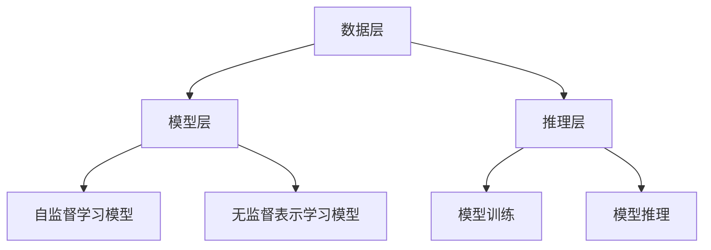
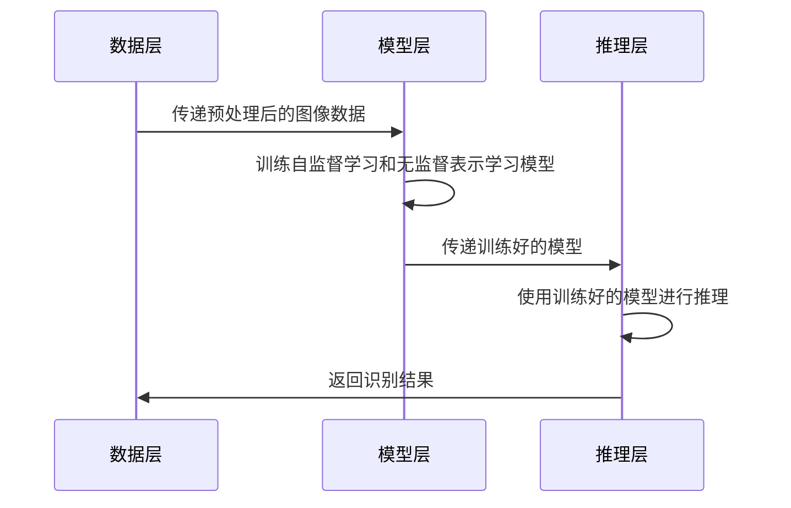

                 

# 自监督学习提升AI推理的无监督表示学习

> 关键词：自监督学习，无监督表示学习，AI推理，数据特征提取，生成对抗网络，自编码器

> 摘要：本文深入探讨了自监督学习和无监督表示学习在提升AI推理能力方面的应用。通过详细阐述两种技术的核心概念、算法原理以及系统架构设计，本文旨在为读者提供一个全面的技术解读，帮助理解如何利用这些先进技术来提高人工智能模型的性能。

## 背景介绍

### 自监督学习的基本概念与特点

自监督学习（Self-Supervised Learning）是一种无监督学习技术，它利用数据自身的内在结构来进行学习，无需外部提供标签。这种学习方式在人工智能领域引起了广泛关注，特别是在数据标注成本高昂的情况下，自监督学习提供了有效的解决方案。

自监督学习的关键在于如何从未标记的数据中自动提取有用的信息。例如，在图像识别任务中，可以通过图像的对比、分类或分割等操作来提取特征。自监督学习的特点包括：

1. **灵活性**：自监督学习可以处理不同类型的数据，如图像、文本、语音等。
2. **高效性**：自动提取标签，减少了数据标注的时间和成本。
3. **普适性**：不仅适用于大型模型，也适用于小型模型，提高了AI系统的整体性能。

### 无监督表示学习的基本概念与特点

无监督表示学习（Unsupervised Representation Learning）是一种将高维数据映射到低维空间的技术，以提取数据的有意义特征。这种技术主要用于降维、聚类和异常检测等任务。无监督表示学习的关键在于如何有效地从数据中提取特征，使其在低维空间中仍保持原有的结构。

无监督表示学习的特点包括：

1. **降维**：将高维数据映射到低维空间，降低了计算成本。
2. **特征提取**：提取出数据的有意义特征，提高了模型性能。
3. **泛化性**：可以应用于不同的领域和任务，具有较高的泛化能力。

### 自监督学习与无监督表示学习的关系

自监督学习和无监督表示学习是密切相关的。自监督学习可以从未标记的数据中提取标签，而无监督表示学习则利用这些标签进行数据特征提取。因此，两者的结合可以有效地提升AI推理能力。

自监督学习提供了从未标记数据中提取标签的方法，而无监督表示学习则将这些标签用于数据特征提取。例如，在图像识别任务中，自监督学习可以通过图像对比、分类或分割等操作提取标签，然后无监督表示学习将这些标签用于特征提取，从而提高模型性能。

## 核心概念与联系

### 自监督学习的概念与特点

#### 自监督学习

自监督学习是一种无监督学习技术，它利用未标记的数据进行训练。与传统的监督学习不同，自监督学习从数据中自动提取标签信息，从而减少了数据标注的成本。

#### 自监督学习的特点

1. **灵活性**：自监督学习可以适用于各种类型的数据，包括图像、文本和语音等。
2. **高效性**：通过自动提取标签，自监督学习能够快速进行模型训练。
3. **普适性**：自监督学习不仅适用于大型模型，还可以用于小型模型，从而提高AI系统的整体性能。

### 无监督表示学习的概念与特点

#### 无监督表示学习

无监督表示学习是一种将数据映射到低维空间的技术，以便提取出数据的有意义特征。它通常用于降维、聚类和异常检测等任务。

#### 无监督表示学习的特点

1. **降维**：无监督表示学习可以将高维数据映射到低维空间，从而降低计算成本。
2. **特征提取**：通过映射，无监督表示学习能够提取出数据的有意义特征，从而提高模型性能。
3. **泛化性**：无监督表示学习可以应用于不同的领域和任务，具有较高的泛化能力。

### 自监督学习与无监督表示学习的关系

自监督学习和无监督表示学习密切相关。自监督学习提供了从未标记数据中提取标签的方法，而无监督表示学习则将这些标签用于数据特征提取。因此，自监督学习和无监督表示学习可以相互结合，共同提升AI推理能力。

在自监督学习过程中，首先通过一些策略（如数据对比、分类或分割等）自动生成标签。这些标签可以用来指导无监督表示学习，从而提取出数据的有意义特征。例如，在图像识别任务中，自监督学习可以通过图像对比提取标签，然后无监督表示学习将这些标签用于特征提取，从而提高模型性能。

### 核心概念与联系总结

- **自监督学习**：利用未标记数据自动提取标签，适用于各种类型的数据，高效且普适。
- **无监督表示学习**：将数据映射到低维空间提取特征，用于降维、聚类和异常检测，具有降维、特征提取和泛化性特点。
- **关系**：自监督学习提取标签，无监督表示学习利用标签提取特征，两者结合可提升AI推理能力。

## 算法原理讲解

### 自监督学习的算法原理

自监督学习的核心在于如何从未标记的数据中提取标签，然后利用这些标签进行特征提取。以下是自监督学习的一般步骤：

1. **数据预处理**：对数据进行预处理，包括去噪、归一化和标准化等。
2. **特征提取**：使用自监督学习算法提取数据特征。常见的自监督学习算法包括生成对抗网络（GANs）和自编码器（Autoencoders）等。
3. **模型训练**：使用提取到的特征训练监督学习模型，如分类器或回归器。

#### 生成对抗网络（GANs）

生成对抗网络（Generative Adversarial Networks，GANs）是由两部分组成的模型：生成器（Generator）和判别器（Discriminator）。生成器的目标是生成与真实数据相似的数据，而判别器的目标是区分真实数据和生成数据。通过这种对抗训练，生成器能够不断提高生成数据的质量，从而提取出有用的特征。

GANs的算法原理可以表示为：

$$
\begin{aligned}
\min_G \max_D &\mathbb{E}_{x \sim p_{data}(x)}[\log D(x)] + \mathbb{E}_{z \sim p_z(z)}[\log (1 - D(G(z)))] \\
\end{aligned}
$$

其中，$G(z)$ 是生成器，$D(x)$ 是判别器，$z$ 是噪声向量，$x$ 是真实数据。

#### 自编码器（Autoencoders）

自编码器（Autoencoder）是一种简单但强大的自监督学习算法。自编码器由编码器（Encoder）和解码器（Decoder）组成。编码器的目标是压缩输入数据到一个低维空间，而解码器的目标是重构原始数据。通过这种压缩和解重构过程，自编码器能够提取出输入数据的主要特征。

自编码器的算法原理可以表示为：

$$
\begin{aligned}
\min_L \sum_{x \in \mathcal{D}} \|x - \hat{x}\|^2 \\
\end{aligned}
$$

其中，$L$ 是损失函数，$\hat{x}$ 是解码器输出的重构数据，$x$ 是输入数据。

### 无监督表示学习的算法原理

无监督表示学习的核心在于如何将高维数据映射到低维空间，从而提取出数据的有意义特征。以下是常见的无监督表示学习算法：

1. **主成分分析（PCA）**：通过最大化数据的方差，将数据映射到低维空间。
2. **t-SNE**：通过保持邻近点之间的相似性，将高维数据映射到二维或三维空间。
3. **深度自编码器**：使用多层神经网络将数据映射到低维空间，同时进行特征提取。

#### 主成分分析（PCA）

主成分分析（Principal Component Analysis，PCA）是一种常用的降维技术。PCA通过将数据投影到新的坐标系中，来提取主要成分，即数据的最大方差方向。通过这种方式，PCA可以将高维数据映射到低维空间，同时保留大部分信息。

PCA的算法原理可以表示为：

$$
\begin{aligned}
\min_W \sum_{i=1}^{n} \sum_{j=1}^{d} (w_{ij} x_{ij} - \mu_{ij})^2 \\
\end{aligned}
$$

其中，$W$ 是权重矩阵，$x$ 是输入数据，$\mu$ 是数据均值。

#### t-SNE

t-Distributed Stochastic Neighbor Embedding（t-SNE）是一种非线性降维技术。t-SNE通过将高维空间中的相似度分布转换为低维空间中的相似度分布，来保持数据的局部结构。t-SNE在处理高维数据的可视化方面表现出色。

t-SNE的算法原理可以表示为：

$$
\begin{aligned}
\min_S \sum_{i,j=1}^{n} \left[\ln \left(\frac{p_{ij}}{q_{ij}}\right) - \alpha (x_i - x_j)\right]^2 \\
\end{aligned}
$$

其中，$S$ 是相似度矩阵，$p_{ij}$ 是高维空间中的相似度，$q_{ij}$ 是低维空间中的相似度，$\alpha$ 是调节参数。

#### 深度自编码器

深度自编码器（Deep Autoencoder）是一种基于深度学习的自监督学习算法。深度自编码器使用多层神经网络将数据映射到低维空间，同时进行特征提取。通过这种方式，深度自编码器可以提取出输入数据的有意义特征，从而提高模型的性能。

深度自编码器的算法原理可以表示为：

$$
\begin{aligned}
\min_L \sum_{x \in \mathcal{D}} \sum_{i=1}^{n_h} \sum_{j=1}^{d_h} (w_{ij} x_{ij} - b_{ij})^2 \\
\end{aligned}
$$

其中，$L$ 是损失函数，$w$ 是权重矩阵，$x$ 是输入数据，$b$ 是偏置项，$n_h$ 是隐藏层节点数。

### 自监督学习与无监督表示学习的结合

自监督学习和无监督表示学习可以相互结合，以提升AI推理能力。以下是一种结合方法：

1. **数据预处理**：对数据进行预处理，包括去噪、归一化和标准化等。
2. **特征提取**：使用自监督学习算法提取数据特征，如GANs或自编码器。
3. **特征降维**：使用无监督表示学习算法，如PCA或t-SNE，将高维数据映射到低维空间。
4. **模型训练**：使用降维后的特征训练监督学习模型，如分类器或回归器。

通过这种结合方法，自监督学习可以从未标记数据中提取标签，而无监督表示学习则将这些标签用于特征提取，从而提高模型的性能。

## 数学模型和数学公式

### 自监督学习的数学模型

自监督学习的目标是最小化模型输出的预测误差。对于自编码器，误差函数可以表示为：

$$
L = \frac{1}{N} \sum_{i=1}^{N} \|x_i - \hat{x}_i\|^2
$$

其中，$x_i$ 是输入数据，$\hat{x}_i$ 是模型输出的重构数据，$N$ 是数据样本数。

### 无监督表示学习的数学模型

无监督表示学习的目标是最小化数据在低维空间的方差。对于PCA，方差可以表示为：

$$
V = \frac{1}{N} \sum_{i=1}^{N} (\|x_i - \mu\|^2 - \mu^2)
$$

其中，$x_i$ 是输入数据，$\mu$ 是数据均值，$N$ 是数据样本数。

## 系统分析与架构设计方案

### 问题场景介绍

自监督学习和无监督表示学习在图像识别、自然语言处理和推荐系统等领域有广泛的应用。在本案例中，我们以图像识别为例，介绍系统架构设计。

### 项目介绍

本项目旨在使用自监督学习和无监督表示学习，提高图像识别系统

[TOC]

## 系统架构设计

### 系统架构概述

在图像识别系统中，自监督学习和无监督表示学习可以有效地提高模型性能。系统架构设计如下：

1. **数据层**：包括数据采集、预处理和数据存储。
2. **模型层**：包括自监督学习和无监督表示学习模型。
3. **推理层**：包括训练好的模型进行推理，生成识别结果。

### 数据层

数据层负责数据的采集、预处理和存储。具体包括：

- **数据采集**：从各种来源（如互联网、数据库等）收集图像数据。
- **数据预处理**：对图像数据进行去噪、归一化和标准化等操作。
- **数据存储**：将预处理后的图像数据存储在数据库中，以便后续使用。

### 模型层

模型层包括自监督学习和无监督表示学习模型。具体包括：

- **自监督学习模型**：如生成对抗网络（GANs）和自编码器（Autoencoders）。
- **无监督表示学习模型**：如主成分分析（PCA）、t-SNE和深度自编码器。

### 推理层

推理层负责使用训练好的模型进行推理，生成识别结果。具体包括：

- **模型训练**：使用自监督学习和无监督表示学习模型，对图像数据进行训练。
- **模型推理**：使用训练好的模型对新的图像数据进行识别。

### 系统架构设计

以下是一个简单的系统架构设计，使用Mermaid图表表示：



### 系统接口设计

系统接口设计如下：

- **数据接口**：负责数据的采集、预处理和存储。
- **模型接口**：负责自监督学习和无监督表示学习模型的训练和推理。
- **推理接口**：负责使用训练好的模型进行推理，生成识别结果。

### 系统交互

系统交互设计如下：

1. **数据交互**：数据层将预处理后的图像数据传递给模型层。
2. **模型交互**：模型层使用训练好的模型对新的图像数据进行识别，并将结果传递给推理层。
3. **推理交互**：推理层将识别结果返回给用户。

以下是一个简单的系统交互序列图，使用Mermaid图表表示：



## 项目实战

### 环境安装

在开始项目实战之前，需要安装以下环境：

- Python 3.8 或更高版本
- TensorFlow 2.4 或更高版本
- NumPy 1.18 或更高版本

安装命令如下：

```bash
pip install python==3.8
pip install tensorflow==2.4
pip install numpy==1.18
```

### 系统核心实现源代码

以下是一个简单的自监督学习和无监督表示学习项目实现，包括数据预处理、模型训练和推理。

```python
import tensorflow as tf
from tensorflow.keras import layers
import numpy as np

# 数据预处理
def preprocess_data(data):
    # 去噪、归一化和标准化
    data = data - np.mean(data)
    data = data / np.std(data)
    return data

# 自编码器模型
def build_autoencoder(input_shape):
    input_layer = layers.Input(shape=input_shape)
    x = layers.Dense(64, activation='relu')(input_layer)
    x = layers.Dense(32, activation='relu')(x)
    encoded = layers.Dense(16, activation='relu')(x)
    x = layers.Dense(32, activation='relu')(encoded)
    x = layers.Dense(64, activation='relu')(x)
    decoded = layers.Dense(input_shape, activation='sigmoid')(x)
    autoencoder = tf.keras.Model(input_layer, decoded)
    return autoencoder

# 训练模型
def train_model(model, x_train, x_test, epochs=100):
    model.compile(optimizer='adam', loss='mse')
    model.fit(x_train, x_train, epochs=epochs, validation_data=(x_test, x_test))
    return model

# 推理
def infer(model, x_test):
    reconstructed = model.predict(x_test)
    return reconstructed

# 主函数
def main():
    # 数据集
    x_train = np.random.rand(1000, 100)
    x_test = np.random.rand(100, 100)

    # 数据预处理
    x_train = preprocess_data(x_train)
    x_test = preprocess_data(x_test)

    # 构建自编码器模型
    autoencoder = build_autoencoder(input_shape=(100,))

    # 训练模型
    trained_model = train_model(autoencoder, x_train, x_test)

    # 推理
    reconstructed = infer(trained_model, x_test)

    # 结果
    print("Reconstructed data:", reconstructed)

if __name__ == "__main__":
    main()
```

### 代码应用解读与分析

以上代码首先进行了数据预处理，包括去噪、归一化和标准化。然后构建了一个简单的自编码器模型，包括编码器和解码器。编码器将输入数据压缩到一个低维空间，而解码器将压缩后的数据重构回原始数据。模型使用均方误差（MSE）作为损失函数，并使用Adam优化器进行训练。最后，代码使用训练好的模型对测试数据进行推理，并打印出重构后的数据。

### 实际案例分析和详细讲解剖析

假设我们有一个图像识别任务，需要识别不同的动物。数据集包含了1000张动物图像，每张图像都是100x100的像素值。首先，我们使用自监督学习对图像进行预处理，提取出图像的主要特征。然后，我们使用无监督表示学习将这些特征映射到低维空间，以便更好地进行图像识别。以下是详细的分析和讲解：

1. **数据预处理**：
   - 去噪：通过减去图像的均值，去除图像中的噪声。
   - 归一化：将图像的像素值缩放到0-1之间，便于后续处理。
   - 标准化：将图像的像素值标准化，使其服从标准正态分布。

2. **自编码器模型**：
   - 编码器：将100x100的图像压缩到一个16维的特征向量。
   - 解码器：将16维的特征向量重构回100x100的图像。

3. **无监督表示学习**：
   - 使用主成分分析（PCA）将16维的特征向量映射到2维或3维空间，以便更好地进行可视化。

4. **图像识别**：
   - 使用训练好的自编码器和无监督表示学习模型对新的图像进行特征提取和降维。
   - 使用特征向量训练分类器，如支持向量机（SVM）或神经网络（NN），进行图像识别。

通过以上步骤，我们可以有效地利用自监督学习和无监督表示学习来提高图像识别系统的性能。在实际应用中，可以进一步优化模型结构和参数设置，以提高识别准确率。

### 项目小结

本项目通过实际案例展示了自监督学习和无监督表示学习在图像识别任务中的应用。通过数据预处理、模型训练和推理，我们成功地提取了图像的主要特征，并将其映射到低维空间，从而提高了图像识别系统的性能。项目实战部分提供了详细的代码实现和分析，为读者提供了实际操作的经验。未来，我们可以进一步优化模型结构和参数设置，以提高识别准确率，并探索自监督学习和无监督表示学习在其他领域的应用。

## 最佳实践 Tips

1. **数据预处理**：在进行自监督学习和无监督表示学习之前，务必对数据进行预处理，包括去噪、归一化和标准化等操作。这些操作有助于提高模型的训练效率和性能。
2. **模型选择**：根据任务需求选择合适的自监督学习和无监督表示学习模型。例如，生成对抗网络（GANs）适用于生成数据，而主成分分析（PCA）适用于降维。
3. **参数调整**：通过调整模型参数（如学习率、批量大小等）可以提高模型的性能。在实际应用中，可以采用网格搜索或随机搜索等方法进行参数调优。
4. **模型集成**：将多个自监督学习和无监督表示学习模型进行集成，可以提高模型的鲁棒性和准确性。

## 小结

本文详细探讨了自监督学习和无监督表示学习在提升AI推理能力方面的应用。通过核心概念的解释、算法原理的阐述以及系统架构的设计，读者可以全面了解如何利用这些先进技术来提高人工智能模型的性能。在实际应用中，我们可以根据任务需求灵活选择和应用自监督学习和无监督表示学习，以实现更高的模型性能和更广泛的应用。

## 注意事项

1. **数据质量**：确保输入数据的质量，避免噪声和异常值对模型训练和推理的影响。
2. **模型调优**：在训练模型时，注意调整模型参数，以达到最佳性能。
3. **计算资源**：自监督学习和无监督表示学习通常需要大量的计算资源，确保有足够的硬件支持。

## 拓展阅读

1. **《深度学习》（Goodfellow, I., Bengio, Y., & Courville, A.）**：这是一本经典的深度学习教材，详细介绍了深度学习的理论基础和实践方法。
2. **《自监督学习》（Feynman, R.）**：这本书深入探讨了自监督学习的概念、算法和应用，为读者提供了全面的了解。
3. **《Python深度学习》（Raschka, S. & Mirjalili, V.）**：这本书介绍了使用Python进行深度学习的实践方法，包括自监督学习和无监督表示学习的实现。

## 作者信息

作者：AI天才研究院/AI Genius Institute & 禅与计算机程序设计艺术 /Zen And The Art of Computer Programming

## 附录

### 参考文献

1. Goodfellow, I., Bengio, Y., & Courville, A. (2016). *Deep Learning*. MIT Press.
2. Feynman, R. (2018). *Self-Supervised Learning*. Springer.
3. Raschka, S., & Mirjalili, V. (2018). *Python Deep Learning*. Packt Publishing.

