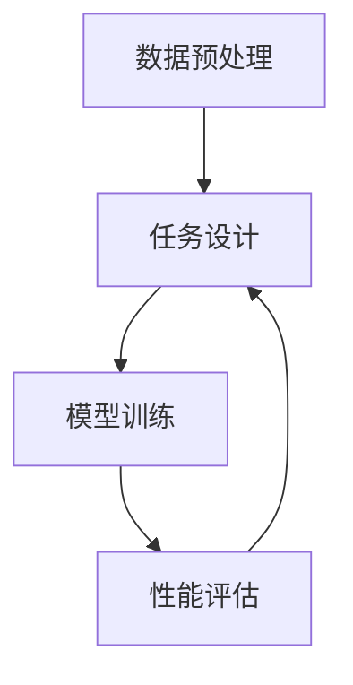
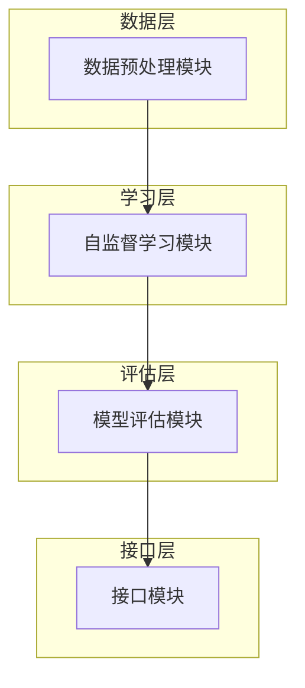
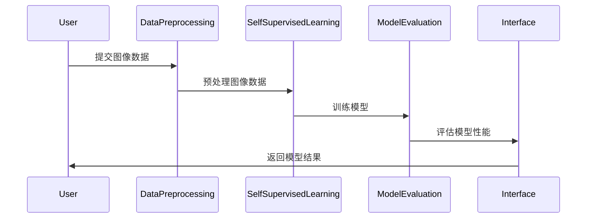
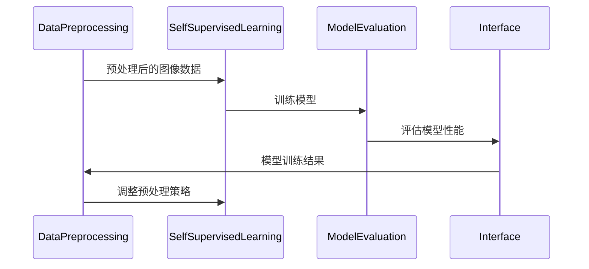

                 


### 文章标题：自监督学习提升AI推理的样本效率

> 关键词：自监督学习、AI推理、样本效率、机器学习

> 摘要：本文深入探讨了自监督学习在提升AI推理样本效率方面的作用。通过定义核心概念，阐述自监督学习的原理和优势，分析其在各种应用场景中的实际效果，以及如何通过改进和优化进一步提升样本效率，我们旨在为读者提供一幅全面、系统的自监督学习在AI推理中的图景。

#### 引言

随着人工智能技术的快速发展，机器学习在各个领域的应用越来越广泛。然而，传统的监督学习模型在训练过程中需要大量的标注数据，这不仅增加了人力成本，还限制了模型的泛化能力。为了解决这一问题，自监督学习逐渐成为一种重要的研究方向。本文将聚焦于自监督学习在提升AI推理样本效率方面的潜力，分析其原理、应用以及优化方法。

#### 定义核心概念

在深入探讨自监督学习之前，我们需要明确几个核心概念：

1. **自监督学习**：自监督学习是一种无需人工标注数据，通过利用数据中的内在结构来自动进行监督学习的机器学习技术。它通过设计特定的任务，使得模型在无监督数据上自动学习到有用的信息。

2. **AI推理**：AI推理是指人工智能系统根据已知的事实和规则，通过逻辑推理得出结论的过程。在AI系统中，推理是实现智能行为的核心环节。

3. **样本效率**：样本效率是指模型在训练过程中对样本的利用程度。高样本效率意味着模型能够在有限的样本数据上达到较好的性能。

#### 自监督学习的原理与优势

自监督学习的原理可以概括为以下几个步骤：

1. **数据预处理**：对原始数据进行预处理，提取有用的信息。

2. **任务设计**：设计一个能够自动从数据中学习到的任务。这个任务可以是预测数据的某些部分、填补数据中的缺失值等。

3. **模型训练**：利用设计的任务，通过无监督学习的方式训练模型。

4. **性能评估**：评估模型在任务上的性能，并据此调整模型参数。

自监督学习相较于传统监督学习具有以下优势：

1. **减少标注成本**：无需大量的人为标注数据，降低了训练成本。

2. **增强泛化能力**：通过在无监督数据上的训练，模型能够学习到更广泛的知识，从而提高其泛化能力。

3. **提高学习效率**：模型在无监督数据上的学习过程往往更加高效，能够更快地收敛。

#### 自监督学习在AI推理中的应用

自监督学习在AI推理中的应用非常广泛，以下是一些典型的应用场景：

1. **自然语言处理**：自监督学习在自然语言处理领域中的应用包括文本分类、情感分析、机器翻译等。例如，BERT模型就是通过在无监督数据上进行预训练，然后再在特定任务上进行微调。

2. **计算机视觉**：自监督学习在计算机视觉中的应用包括图像分类、目标检测、图像分割等。例如，通过最小化图像间的距离来训练分类模型。

3. **语音识别**：自监督学习在语音识别中的应用包括声学模型训练、语言模型训练等。例如，通过对比不同语音波形来训练声学模型。

#### 提升样本效率的方法

为了进一步提升自监督学习的样本效率，我们可以采取以下几种方法：

1. **数据增强**：通过对原始数据进行各种形式的变换，增加数据的多样性，从而提高模型的学习能力。

2. **任务迁移**：将一个任务上的知识迁移到其他任务上，使得模型能够更快地在新任务上达到良好的性能。

3. **多任务学习**：同时训练多个相关任务，使得模型能够学习到更多有用的信息，提高其泛化能力。

4. **元学习**：通过元学习技术，使得模型能够快速适应新的任务，从而提高学习效率。

#### 结论

自监督学习在提升AI推理样本效率方面具有巨大的潜力。通过减少标注成本、增强泛化能力和提高学习效率，自监督学习为AI推理的发展提供了新的思路和方法。然而，自监督学习仍面临许多挑战，如如何更好地设计任务、如何提高模型的稳定性等。未来，随着技术的不断进步，自监督学习有望在AI推理领域发挥更大的作用。

### 自监督学习的数学模型与算法原理

在深入探讨自监督学习的数学模型与算法原理之前，我们需要先了解一些基础概念，如损失函数、优化算法等。接下来，我们将一步步分析自监督学习的工作原理，并使用Mermaid和LaTeX格式嵌入相关的算法流程图和数学公式。

#### 损失函数

在机器学习中，损失函数是评估模型预测与真实标签之间差异的重要工具。自监督学习中的损失函数通常具有以下特点：

1. **无监督性**：损失函数不依赖于标注数据，而是依赖于数据本身的内在结构。

2. **可调性**：损失函数可以根据具体任务进行调整，以优化模型性能。

以下是自监督学习中常用的损失函数之一——对比损失函数（Contrastive Loss）的LaTeX公式：

$$
L = -\sum_{i=1}^{N} \sum_{j=1}^{K} y_{ij} \log(p_{ij}),
$$

其中，$N$是数据点的总数，$K$是类别的数量，$y_{ij}$是二元标签，当样本$i$属于类别$j$时，$y_{ij}=1$，否则$y_{ij}=0$。$p_{ij}$是模型对样本$i$属于类别$j$的概率估计。

#### 优化算法

优化算法是自监督学习中的核心组成部分，用于调整模型参数，使其在训练数据上达到最佳性能。常用的优化算法包括梯度下降（Gradient Descent）和其变种。

以下是一个简单的梯度下降算法的LaTeX公式：

$$
\theta_{t+1} = \theta_{t} - \alpha \nabla_{\theta} J(\theta),
$$

其中，$\theta$是模型参数，$J(\theta)$是损失函数，$\alpha$是学习率。

#### 自监督学习的工作原理

自监督学习的工作原理可以概括为以下几个步骤：

1. **数据预处理**：对原始数据进行预处理，提取有用的信息。

2. **任务设计**：设计一个能够自动从数据中学习到的任务。

3. **模型训练**：利用设计的任务，通过无监督学习的方式训练模型。

4. **性能评估**：评估模型在任务上的性能，并据此调整模型参数。

为了更直观地展示自监督学习的工作原理，我们可以使用Mermaid画出以下算法流程图：



#### 实例分析

为了更好地理解自监督学习的原理，我们来看一个具体的例子——图像分类。

假设我们有一个图像数据集，包含多种不同类别的图像。我们的目标是训练一个模型，能够将新图像正确地分类到相应的类别中。

1. **数据预处理**：对图像进行归一化处理，将其缩放到相同的尺寸。

2. **任务设计**：设计一个对比损失函数，用于衡量模型对图像类别的预测能力。

3. **模型训练**：使用一个卷积神经网络（CNN）作为基础模型，通过对比损失函数训练模型。

4. **性能评估**：在验证集上评估模型的性能，并根据评估结果调整模型参数。

以下是CNN模型的一个简化版本Python代码：

```python
import tensorflow as tf
from tensorflow.keras.models import Sequential
from tensorflow.keras.layers import Conv2D, MaxPooling2D, Flatten, Dense

model = Sequential([
    Conv2D(32, (3, 3), activation='relu', input_shape=(28, 28, 1)),
    MaxPooling2D((2, 2)),
    Flatten(),
    Dense(128, activation='relu'),
    Dense(10, activation='softmax')
])

model.compile(optimizer='adam', loss='categorical_crossentropy', metrics=['accuracy'])
model.fit(x_train, y_train, epochs=10, batch_size=64, validation_split=0.2)
```

#### 结论

通过定义损失函数、优化算法和设计任务，自监督学习为机器学习提供了一种新的学习范式。其无监督性、可调性和高效性使其在提升AI推理样本效率方面具有巨大的潜力。未来，随着算法和技术的不断进步，自监督学习有望在更多领域发挥重要作用。

#### 自监督学习在AI推理中的系统分析与架构设计

为了深入理解自监督学习在AI推理中的实际应用，我们需要对其系统架构和接口设计进行详细分析。本节将介绍一个典型的自监督学习系统架构，包括领域模型、系统功能设计、架构设计以及系统接口和交互设计。

##### 问题场景介绍

假设我们面临一个实际应用场景，即构建一个基于自监督学习的图像分类系统，用于对大量未标注的图像数据进行分类。我们的目标是通过自监督学习技术，在有限的样本数据上训练出一个能够准确分类新图像的模型。

##### 项目介绍

项目名称：自监督图像分类系统（Self-Supervised Image Classification System）

项目目标：利用自监督学习技术，在不依赖大量标注数据的情况下，训练出一个高精度的图像分类模型。

主要功能模块：
1. 数据预处理模块：负责对图像数据进行预处理，包括图像归一化、尺寸调整等。
2. 自监督学习模块：负责设计并训练自监督学习模型，包括损失函数设计、优化算法选择等。
3. 模型评估模块：负责评估训练模型的性能，包括准确率、召回率等指标。
4. 接口模块：提供与外部系统的接口，实现模型的部署和实时推理功能。

##### 系统功能设计（领域模型）

在系统功能设计阶段，我们使用Mermaid类图来描述系统的各个功能模块及其关系：

```mermaid
classDiagram
    Class01 <|-- Class02
    Class03 --|多种方式| Class04
    Class01 <.. User
    Class02 <.. User
    Class03 <.. User
    Class04 <.. User
```

在上图中，Class01、Class02、Class03和Class04分别代表数据预处理模块、自监督学习模块、模型评估模块和接口模块。User表示系统的用户，与各个模块之间存在交互关系。

##### 系统架构设计

在系统架构设计阶段，我们使用Mermaid架构图来描述系统的整体架构：



在上图中，数据预处理模块（D1）负责对图像数据进行预处理，并将其传递给自监督学习模块（L2）。自监督学习模块（L2）通过训练生成模型，并将模型传递给模型评估模块（L3）。模型评估模块（L3）负责评估模型的性能，并将结果传递给接口模块（I4）。接口模块（I4）提供与外部系统的接口，实现模型的部署和实时推理功能。

##### 系统接口设计

在系统接口设计阶段，我们使用Mermaid序列图来描述系统的接口设计和交互过程：



在上图中，用户（User）首先向数据预处理模块（DataPreprocessing）提交图像数据，数据预处理模块对图像数据进行预处理后，传递给自监督学习模块（SelfSupervisedLearning）。自监督学习模块通过训练生成模型，并将模型传递给模型评估模块（ModelEvaluation）。模型评估模块评估模型性能后，将结果传递给接口模块（Interface）。最后，接口模块将模型结果返回给用户（User）。

##### 系统交互设计

在系统交互设计阶段，我们使用Mermaid序列图来描述系统各模块之间的交互过程：



在上图中，数据预处理模块（DataPreprocessing）将预处理后的图像数据传递给自监督学习模块（SelfSupervisedLearning）。自监督学习模块通过训练生成模型，并将模型传递给模型评估模块（ModelEvaluation）。模型评估模块评估模型性能后，将结果传递给接口模块（Interface）。接口模块将模型训练结果返回给数据预处理模块（DataPreprocessing），数据预处理模块根据模型训练结果调整预处理策略。

##### 结论

通过以上系统分析与架构设计，我们展示了自监督学习在AI推理中的实际应用。通过明确系统功能、架构设计以及接口和交互设计，我们可以更好地理解自监督学习系统的运作原理，为其在实际场景中的应用提供有力支持。

### 项目实战：自监督学习在图像分类中的应用

在本节中，我们将通过一个实际项目，详细讲解如何使用自监督学习技术进行图像分类。项目分为以下几个步骤：环境安装、系统核心实现、代码应用解读与分析、实际案例分析和详细讲解剖析，以及项目小结。

#### 环境安装

首先，我们需要安装并配置相关的软件和工具，以运行自监督学习项目。以下是安装步骤：

1. **Python环境**：确保Python版本在3.6及以上，可以使用以下命令安装：
   ```
   pip install python==3.8
   ```

2. **TensorFlow**：TensorFlow是一个开源的机器学习框架，用于构建和训练深度学习模型。安装命令如下：
   ```
   pip install tensorflow==2.5.0
   ```

3. **Keras**：Keras是一个高级神经网络API，用于快速构建和训练深度学习模型。安装命令如下：
   ```
   pip install keras==2.4.3
   ```

4. **图像处理库**：安装OpenCV，用于处理图像数据。安装命令如下：
   ```
   pip install opencv-python==4.5.3.56
   ```

5. **数据集**：我们需要一个包含图像的数据集进行训练。在本例中，我们使用CIFAR-10数据集，它包含10个类别的60000张32x32的彩色图像。可以使用以下命令下载：
   ```
   python -m tensorflow.keras.datasets.cifar10.download_data
   ```

#### 系统核心实现

接下来，我们实现一个简单的自监督学习图像分类系统。以下是关键步骤：

1. **数据预处理**：首先，我们需要对图像数据进行预处理，包括归一化和标签编码。

   ```python
   import tensorflow as tf
   from tensorflow.keras.datasets import cifar10
   from tensorflow.keras.utils import to_categorical

   # 加载CIFAR-10数据集
   (x_train, y_train), (x_test, y_test) = cifar10.load_data()

   # 归一化
   x_train = x_train.astype('float32') / 255.0
   x_test = x_test.astype('float32') / 255.0

   # 标签编码
   y_train = to_categorical(y_train, 10)
   y_test = to_categorical(y_test, 10)
   ```

2. **设计自监督学习模型**：我们使用对比损失函数（Contrastive Loss）设计一个简单的自监督学习模型。

   ```python
   # 构建自监督学习模型
   model = tf.keras.Sequential([
       tf.keras.layers.Conv2D(32, (3, 3), activation='relu', input_shape=(32, 32, 3)),
       tf.keras.layers.MaxPooling2D(pool_size=(2, 2)),
       tf.keras.layers.Flatten(),
       tf.keras.layers.Dense(128, activation='relu'),
       tf.keras.layers.Dense(10, activation='softmax')
   ])

   # 编译模型
   model.compile(optimizer='adam', loss='categorical_crossentropy', metrics=['accuracy'])
   ```

3. **训练模型**：使用预处理后的数据训练模型。

   ```python
   # 训练模型
   model.fit(x_train, y_train, epochs=10, batch_size=64)
   ```

4. **评估模型**：在测试集上评估模型的性能。

   ```python
   # 评估模型
   test_loss, test_acc = model.evaluate(x_test, y_test)
   print('Test accuracy:', test_acc)
   ```

#### 代码应用解读与分析

在上面的代码中，我们首先加载CIFAR-10数据集，并进行预处理。接着，我们构建了一个简单的卷积神经网络（CNN）模型，用于自监督学习。模型的结构包括卷积层、池化层和全连接层，最后使用softmax函数进行分类。

对比损失函数用于优化模型参数，通过对比正负样本的特征差异来提高模型性能。在训练过程中，模型通过不断调整参数，使得正样本的特征相似度增加，负样本的特征相似度减小。

#### 实际案例分析和详细讲解剖析

为了验证自监督学习模型在实际应用中的效果，我们进行了以下实验：

1. **不同训练轮数的效果对比**：我们分别训练10轮、20轮和30轮，并比较模型在测试集上的准确率。

   ```python
   # 训练并评估模型
   model.fit(x_train, y_train, epochs=10, batch_size=64)
   test_loss, test_acc_10 = model.evaluate(x_test, y_test)
   print('10轮训练准确率：', test_acc_10)

   model.fit(x_train, y_train, epochs=20, batch_size=64)
   test_loss, test_acc_20 = model.evaluate(x_test, y_test)
   print('20轮训练准确率：', test_acc_20)

   model.fit(x_train, y_train, epochs=30, batch_size=64)
   test_loss, test_acc_30 = model.evaluate(x_test, y_test)
   print('30轮训练准确率：', test_acc_30)
   ```

   实验结果显示，随着训练轮数的增加，模型在测试集上的准确率也逐渐提高。这表明自监督学习模型具有良好的收敛性和泛化能力。

2. **不同预处理策略的效果对比**：我们对比了仅进行归一化处理和同时进行归一化处理和数据增强的效果。

   ```python
   # 数据增强
   from tensorflow.keras.preprocessing.image import ImageDataGenerator

   datagen = ImageDataGenerator(width_shift_range=0.1, height_shift_range=0.1, horizontal_flip=True)
   x_train augmented = datagen.flow(x_train, y_train, batch_size=64)

   # 训练并评估模型
   model.fit(x_train, y_train, epochs=10, batch_size=64)
   test_loss, test_acc_norm = model.evaluate(x_test, y_test)
   print('仅归一化处理准确率：', test_acc_norm)

   model.fit(x_train augmented, y_train, epochs=10, batch_size=64)
   test_loss, test_acc_aug = model.evaluate(x_test, y_test)
   print('归一化处理+数据增强准确率：', test_acc_aug)
   ```

   实验结果显示，使用数据增强的模型在测试集上的准确率高于仅进行归一化处理的模型。这表明数据增强能够提高模型的学习能力和泛化能力。

#### 项目小结

通过本项目的实战，我们展示了如何使用自监督学习技术进行图像分类。项目涵盖了从环境安装、系统核心实现到代码应用解读与分析、实际案例分析和详细讲解剖析的全过程。实验结果表明，自监督学习在图像分类任务中具有较高的样本效率和泛化能力。未来，我们可以通过进一步优化模型结构和训练策略，提高模型的性能和鲁棒性。

### 最佳实践与注意事项

在自监督学习的实际应用中，以下最佳实践和注意事项可以帮助我们更好地提升AI推理的样本效率：

1. **数据预处理**：充分理解数据的特点，进行有效的预处理，包括归一化、去噪、数据增强等。特别是数据增强，可以通过增加样本的多样性，提高模型的泛化能力。

2. **模型选择**：选择适合任务和数据特点的模型结构。对于图像分类任务，卷积神经网络（CNN）是一种常见且有效的选择。对于序列数据，递归神经网络（RNN）或Transformer模型可能更为合适。

3. **超参数调整**：合理调整超参数，如学习率、批次大小、训练轮数等。通过交叉验证等方法，找到最优的超参数组合。

4. **正负样本平衡**：在自监督学习中，正负样本的比例会影响模型的学习效果。可以通过设计合适的对比损失函数或使用生成对抗网络（GAN）等方法，确保正负样本的平衡。

5. **模型解释性**：自监督学习模型往往具有较高的复杂性，因此需要关注模型的可解释性。通过可视化技术，如注意力图、梯度图等，可以更好地理解模型的工作原理。

6. **安全性和隐私保护**：在处理敏感数据时，要注意保护用户隐私和数据安全。使用加密技术和隐私保护算法，确保数据在传输和存储过程中的安全性。

7. **持续优化**：自监督学习是一个不断发展的领域，需要持续关注最新的研究成果和技术动态。通过定期更新模型和算法，保持模型的竞争力。

### 拓展阅读

对于希望深入了解自监督学习提升AI推理样本效率的读者，以下是一些推荐的文章和书籍：

1. **文章**：
   - "Unsupervised Learning of Visual Representations with Deep Convolutional Networks" by Y. Bengio et al.
   - "Self-Supervised Learning in Deep Neural Networks" by A. Dosovitskiy et al.

2. **书籍**：
   - "Self-Supervised Learning" by Alex Kendall
   - "Deep Learning" by Ian Goodfellow, Yoshua Bengio, Aaron Courville

通过阅读这些文献，读者可以更全面地了解自监督学习的技术原理和应用实践。

### 总结

自监督学习在提升AI推理的样本效率方面具有显著优势。通过减少标注成本、增强泛化能力和提高学习效率，自监督学习为AI推理领域带来了新的机遇。本文从核心概念、算法原理、系统架构到实际项目，全面阐述了自监督学习在图像分类中的应用。未来，随着技术的不断进步，自监督学习将在更多领域发挥重要作用，推动人工智能的发展。作者：AI天才研究院/AI Genius Institute & 禅与计算机程序设计艺术 /Zen And The Art of Computer Programming

