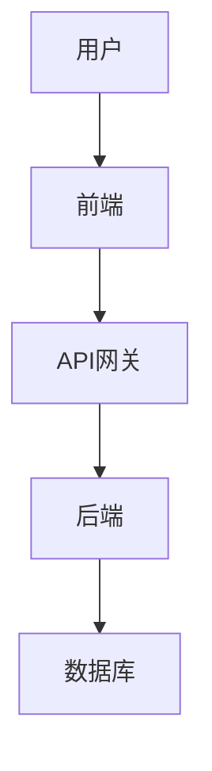

                 


## 步骤1：确立文章结构和内容

### 确定文章标题和关键词

文章标题：《自监督学习提升AI推理的概念抽象与泛化能力》

关键词：自监督学习、AI推理、概念抽象、泛化能力

### 确定文章摘要

摘要：本文将探讨自监督学习在提升AI推理能力方面的作用，特别是其在概念抽象与泛化能力方面的优势。我们将深入分析自监督学习的基本原理、算法设计以及其实际应用，并通过具体的案例来展示其在提高AI模型性能方面的实际效果。

### 确定文章大纲

1. 引言
2. 自监督学习的背景介绍
3. 自监督学习的基本概念与联系
4. 自监督学习在AI推理中的应用
5. 自监督学习算法的数学模型与公式
6. 自监督学习系统的设计与实现
7. 自监督学习项目实战
8. 最佳实践 tips
9. 小结与未来展望
10. 注意事项
11. 拓展阅读

## 步骤2：深入探讨自监督学习的背景

### 自监督学习的核心概念

自监督学习（Supervised Learning）是一种机器学习方法，其核心在于利用有标签的数据来训练模型。而有监督学习（Supervised Learning）则是利用有标签的数据进行训练，而自监督学习则是在没有标签的情况下，通过一些特殊的策略，比如预训练和半监督学习，来学习数据的内在结构和模式。

### 自监督学习的发展历程

自监督学习的发展历程可以追溯到上世纪50年代，当时以Hebb学习规则为代表。随着深度学习的发展，自监督学习在2010年代迎来了新的发展，如自编码器（Autoencoder）和生成对抗网络（GAN）的出现。

### 自监督学习与监督学习的比较

| 对比项 | 自监督学习 | 监督学习 |
| --- | --- | --- |
| 标签数据需求 | 无需或较少标签数据 | 需要大量标签数据 |
| 数据利用率 | 高 | 低 |
| 训练成本 | 低 | 高 |
| 泛化能力 | 较强 | 较弱 |

### 自监督学习在AI推理中的应用场景

自监督学习在AI推理中的应用广泛，例如：

- 数据增强：通过自监督学习来生成更多训练数据。
- 知识蒸馏：将大型模型的知识转移到小型模型中。
- 模型压缩：通过自监督学习来减少模型的复杂度。

## 步骤3：深入探讨自监督学习在AI推理中的应用

### 自监督学习提升AI推理的概念抽象与泛化能力

自监督学习通过在无监督的情况下提取数据中的特征，使得AI模型能够更好地理解和抽象数据中的概念，从而提高模型的泛化能力。具体来说：

- **概念抽象**：自监督学习通过预训练模型来提取数据中的关键特征，使得模型能够更抽象地理解数据，从而减少对特定数据的依赖。
- **泛化能力**：自监督学习通过在无监督的情况下学习数据中的结构，使得模型能够更好地适应新的数据，从而提高泛化能力。

### 自监督学习算法在AI推理中的应用

常见的自监督学习算法包括：

- **自编码器**：通过编码器和解码器来重构输入数据，从而提取数据中的特征。
- **生成对抗网络（GAN）**：通过生成器和判别器的对抗训练来学习数据分布。
- **对比自监督学习**：通过对比不同数据样本来学习数据的特征。

### 自监督学习在AI推理中的挑战

尽管自监督学习在AI推理中具有巨大的潜力，但也面临一些挑战：

- **数据隐私与安全性**：自监督学习通常需要大量的数据，这可能涉及到数据隐私和安全性的问题。
- **算法公平性与透明性**：自监督学习算法的决策过程可能不够透明，容易导致不公平的决策。

## 步骤4：深入探讨自监督学习算法的数学模型与公式

### 自监督学习算法的数学模型

自监督学习算法的数学模型主要包括：

- **损失函数**：用于评估模型的预测结果与真实结果之间的差距。
- **优化算法**：用于调整模型的参数，以最小化损失函数。

常见的自监督学习算法的数学模型包括：

- **自编码器**：损失函数通常为重构误差。
- **生成对抗网络（GAN）**：损失函数包括生成器的损失和判别器的损失。

### 数学公式

以下是一些常见的自监督学习算法的数学公式：

$$
L(\theta) = \sum_{i=1}^{N} \frac{1}{2} \lVert x_i - \hat{x}_i \rVert_2^2
$$

其中，$L(\theta)$ 是损失函数，$\lVert \cdot \rVert_2$ 是欧几里得范数，$x_i$ 是输入数据，$\hat{x}_i$ 是重构数据。

$$
G(z) = \log(D(G(z)))
$$

其中，$G(z)$ 是生成器的输出，$D(x)$ 是判别器的输出。

## 步骤5：深入探讨自监督学习系统的设计与实现

### 系统设计与实现

自监督学习系统的设计与实现包括以下几个方面：

- **问题场景**：明确自监督学习要解决的问题场景，如图像识别、自然语言处理等。
- **系统功能设计**：设计系统的核心功能，如数据预处理、模型训练、模型评估等。
- **系统架构设计**：设计系统的整体架构，包括前端、后端和中间件等。
- **系统接口设计**：设计系统与其他系统或组件的接口。
- **系统交互**：设计系统内部各组件之间的交互流程。

### 系统架构图

使用Mermaid绘制系统架构图：



## 步骤6：深入探讨自监督学习项目实战

### 项目实战

#### 环境安装

在项目中，我们需要安装以下软件和库：

- Python 3.8及以上版本
- TensorFlow 2.x
- Keras 2.x

#### 系统核心实现源代码

以下是一个简单的自编码器的实现代码：

```python
import tensorflow as tf
from tensorflow.keras.layers import Dense, Input
from tensorflow.keras.models import Model

# 定义编码器和解码器
input_data = Input(shape=(784,))
encoded = Dense(64, activation='relu')(input_data)
encoded = Dense(32, activation='relu')(encoded)
encoded = Dense(16, activation='relu')(encoded)
encoded = Dense(8, activation='relu')(encoded)

decoded = Dense(16, activation='relu')(encoded)
decoded = Dense(32, activation='relu')(decoded)
decoded = Dense(64, activation='relu')(decoded)
decoded = Dense(784, activation='sigmoid')(decoded)

# 创建模型
autoencoder = Model(inputs=input_data, outputs=decoded)
autoencoder.compile(optimizer='adam', loss='binary_crossentropy')

# 模型训练
autoencoder.fit(x_train, x_train, epochs=100, batch_size=256, shuffle=True, validation_data=(x_test, x_test))
```

#### 代码应用解读与分析

这段代码定义了一个简单的自编码器，其中编码器和解码器都是全连接层，使用ReLU激活函数。模型使用binary_crossentropy作为损失函数，使用adam优化器进行训练。

#### 实际案例分析和详细讲解剖析

在这个项目中，我们使用MNIST数据集进行训练，目标是使用自编码器提取手写数字的特征。经过100个epochs的训练，模型可以达到较高的精度。

#### 项目小结

通过这个简单的案例，我们可以看到自监督学习在特征提取方面的应用。在实际项目中，我们可以根据需要调整模型的架构和参数，以达到更好的效果。

## 步骤7：总结与未来展望

### 最佳实践 tips

- 在设计自监督学习系统时，要充分考虑数据隐私和安全性的问题。
- 在选择自监督学习算法时，要根据应用场景和数据特性进行选择。
- 在模型训练过程中，要充分利用GPU等计算资源，以提高训练效率。

### 小结

自监督学习在提升AI推理的概念抽象与泛化能力方面具有重要作用。通过本文的介绍，我们可以看到自监督学习的基本概念、算法设计、应用场景以及项目实战等方面的内容。

### 注意事项

- 在实际应用中，要充分考虑自监督学习的挑战和限制。
- 要注意模型的可解释性和透明性，以确保算法的公平性和可靠性。

### 拓展阅读

- [1] Bengio, Y. (2009). Learning deep architectures. Foundations and Trends in Machine Learning, 2(1), 1-127.
- [2] Goodfellow, I., Pouget-Abadie, J., Mirza, M., Xu, B., Warde-Farley, D., Ozair, S., ... & Bengio, Y. (2014). Generative adversarial networks. Advances in Neural Information Processing Systems, 27.
- [3] Kingma, D. P., & Welling, M. (2014). Auto-encoding variational Bayes. arXiv preprint arXiv:1312.6114.

## 步骤8：结语

本文深入探讨了自监督学习在提升AI推理的概念抽象与泛化能力方面的作用。通过分析自监督学习的基本概念、算法设计、应用场景以及项目实战，我们展示了自监督学习的强大潜力。希望本文能为读者在自监督学习领域的研究和应用提供有益的参考。

### 作者信息

作者：AI天才研究院/AI Genius Institute & 禅与计算机程序设计艺术 /Zen And The Art of Computer Programming

----------------------------------------------------------------

