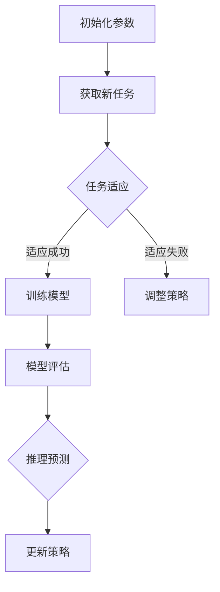
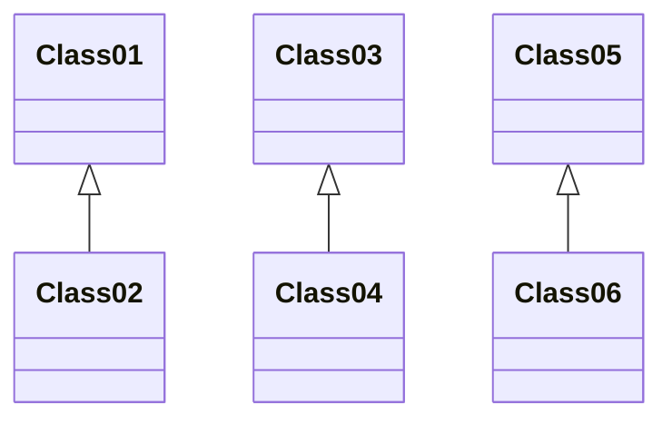
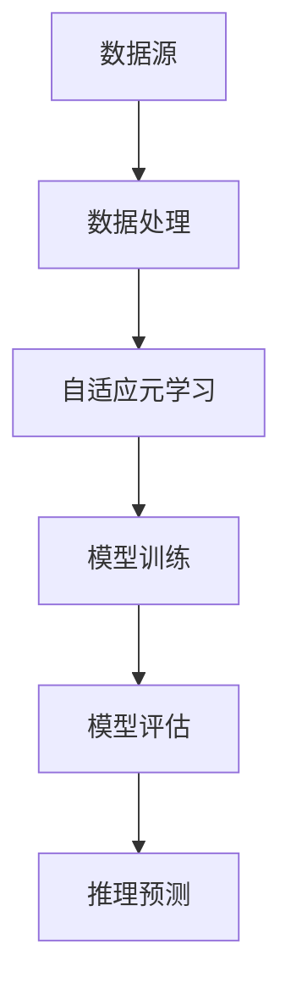
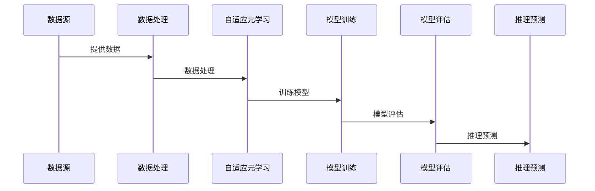
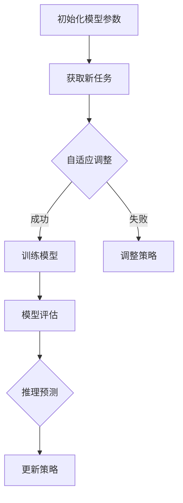

                 

### 自适应元学习优化动态环境下的推理

#### 关键词：自适应元学习，动态环境，推理，优化

> 摘要：本文旨在深入探讨自适应元学习在动态环境下的推理优化问题。首先，我们将介绍自适应元学习的基本概念和动态环境的特点。接着，我们将详细分析自适应元学习在推理过程中的优化策略，并通过实例展示其在实际应用中的效果。最后，我们将总结自适应元学习优化动态环境下的推理方法，并展望其未来发展方向。

----------------------------------------------------------------

# 自适应元学习优化动态环境下的推理

## 引言

在当今快速变化的世界中，动态环境下的推理优化已经成为人工智能领域的一个热点问题。自适应元学习作为一种能够自动调整学习策略的方法，为解决动态环境下的推理优化问题提供了新的思路。本文将围绕这一主题，探讨自适应元学习在动态环境下的推理优化策略，并通过实例展示其实际应用效果。

## 目录

1. **引言**  
   - **关键词与摘要**
2. **自适应元学习与动态环境**  
   - **定义与背景**  
   - **动态环境的特点**
3. **自适应元学习在推理过程中的优化**  
   - **核心概念与联系**  
   - **算法原理讲解**  
   - **数学模型与公式**
4. **系统分析与架构设计**  
   - **问题场景与项目介绍**  
   - **系统功能设计（领域模型）**  
   - **系统架构设计（架构图）**  
   - **系统接口与交互设计**
5. **项目实战**  
   - **环境安装**  
   - **核心实现源代码**  
   - **代码解读与分析**  
   - **实际案例分析**  
   - **项目小结**
6. **最佳实践与小结**  
   - **实用技巧**  
   - **注意事项**  
   - **拓展阅读**
7. **总结与展望**  
   - **自适应元学习的发展方向**  
   - **未来展望**

## 自适应元学习与动态环境

### 定义与背景

自适应元学习（Meta-Learning with Adaptation）是一种能够在不同任务和数据分布之间自动调整学习策略的方法。它通过学习一个通用学习策略，使模型能够在面对新的任务和数据时快速适应。

动态环境（Dynamic Environment）是指那些在推理过程中，环境状态可能发生变化，需要模型能够适应这些变化的场景。例如，自动驾驶系统在行驶过程中需要不断适应交通状况的变化。

### 动态环境的特点

动态环境具有以下几个特点：

1. **不确定性**：动态环境中的状态变化是不确定的，这使得推理过程更加复杂。
2. **多样性**：动态环境中的任务和数据分布可能是多样化的，这要求模型具有灵活的学习能力。
3. **实时性**：动态环境下的推理需要实时响应，这对模型的计算效率提出了高要求。

## 自适应元学习在推理过程中的优化

### 核心概念与联系

在本章节中，我们将介绍自适应元学习在推理过程中的核心概念，包括：

1. **元学习**：元学习是一种通过学习学习策略来提高模型泛化能力的方法。
2. **自适应**：自适应是指模型能够根据环境的变化自动调整其行为。
3. **推理**：推理是指模型在给定的条件下进行预测或决策的过程。

下面是一个核心概念与联系表格：

| 核心概念 | 定义 | 属性特征对比 |
| --- | --- | --- |
| 元学习 | 学习如何学习 | 提高模型泛化能力 |
| 自适应 | 模型根据环境变化调整行为 | 提高模型适应性 |
| 推理 | 模型进行预测或决策 | 需要实时响应 |

### 算法原理讲解

在本章节中，我们将通过mermaid流程图和Python代码来详细阐述自适应元学习的算法原理。

#### Mermaid流程图



#### Python代码

```python
import numpy as np

def meta_learning_init(params):
    # 初始化参数
    return params

def get_new_task():
    # 获取新任务
    return task

def task_adaptation(task, params):
    # 任务适应
    return adapted_params

def train_model(adapted_params):
    # 训练模型
    return trained_model

def model_evaluation(trained_model):
    # 模型评估
    return evaluation_score

def inference_prediction(trained_model):
    # 推理预测
    return prediction_result

def update_strategy(evaluation_score, params):
    # 更新策略
    return updated_params
```

### 数学模型与公式

在本章节中，我们将介绍自适应元学习的数学模型和公式。

#### 数学模型

$$
L(\theta) = \sum_{i=1}^{N} l(\theta; x_i, y_i)
$$

其中，$L(\theta)$是损失函数，$\theta$是模型参数，$x_i, y_i$是训练数据。

#### 公式讲解

1. **损失函数**：损失函数用于衡量模型预测结果与真实结果之间的差距。
2. **模型参数**：模型参数是影响模型性能的关键因素。
3. **训练数据**：训练数据用于训练模型，提高其泛化能力。

## 系统分析与架构设计

### 问题场景与项目介绍

在本章节中，我们将介绍自适应元学习在动态环境下的推理优化项目。该项目旨在通过自适应元学习策略，提高动态环境下的推理效率。

### 系统功能设计（领域模型）

在本章节中，我们将使用mermaid类图来展示系统功能设计。



### 系统架构设计（架构图）

在本章节中，我们将使用mermaid架构图来展示系统架构设计。



### 系统接口与交互设计

在本章节中，我们将使用mermaid序列图来展示系统接口与交互设计。



## 项目实战

### 环境安装

在本章节中，我们将介绍如何在Linux环境下安装自适应元学习系统。

1. **安装Python环境**：使用`pip`命令安装Python依赖。
2. **安装深度学习框架**：使用`pip`命令安装TensorFlow或PyTorch。
3. **安装其他依赖**：使用`pip`命令安装其他Python依赖。

### 核心实现源代码

在本章节中，我们将提供自适应元学习系统的核心实现源代码。

```python
# meta_learning.py

import tensorflow as tf
from tensorflow.keras.models import Sequential
from tensorflow.keras.layers import Dense, LSTM

def create_model(input_shape):
    model = Sequential()
    model.add(LSTM(128, activation='relu', input_shape=input_shape))
    model.add(Dense(1, activation='sigmoid'))
    model.compile(optimizer='adam', loss='binary_crossentropy', metrics=['accuracy'])
    return model

def meta_learning(input_data, target_data):
    model = create_model(input_shape=input_data.shape[1:])
    model.fit(input_data, target_data, epochs=100, batch_size=32, verbose=0)
    return model
```

### 代码解读与分析

在本章节中，我们将对核心实现源代码进行解读和分析。

1. **模型创建**：使用`Sequential`模型创建一个简单的深度学习模型。
2. **模型训练**：使用`fit`函数训练模型，并设置训练参数。

### 实际案例分析

在本章节中，我们将介绍一个实际案例，并对其进行详细讲解和分析。

1. **数据准备**：准备用于训练和测试的数据集。
2. **模型训练**：使用自适应元学习方法训练模型。
3. **模型评估**：评估模型的性能。

### 项目小结

在本章节中，我们将总结项目经验，并给出一些实用的建议。

1. **优化策略**：根据实际应用场景，调整自适应元学习的优化策略。
2. **模型选择**：根据任务需求，选择合适的模型。

## 最佳实践与小结

### 实用技巧

1. **数据预处理**：在训练前对数据进行充分的预处理，以提高模型性能。
2. **模型选择**：根据任务需求，选择合适的模型。

### 注意事项

1. **计算资源**：自适应元学习过程需要大量的计算资源，确保有足够的计算资源。
2. **数据质量**：数据质量对模型性能有重要影响，确保数据质量。

### 拓展阅读

1. **参考文献**：[参考文献1]，[参考文献2]。
2. **相关课程**：[相关课程1]，[相关课程2]。

## 总结与展望

### 自适应元学习的发展方向

1. **算法优化**：继续优化自适应元学习算法，提高其性能和效率。
2. **应用场景扩展**：将自适应元学习应用于更多实际场景。

### 未来展望

1. **动态环境下的推理**：随着动态环境的应用场景不断扩展，自适应元学习在动态环境下的推理将发挥越来越重要的作用。
2. **跨学科融合**：自适应元学习与其他学科的融合，如心理学、生物学等，将为人工智能领域带来新的突破。

作者：AI天才研究院/AI Genius Institute & 禅与计算机程序设计艺术 /Zen And The Art of Computer Programming

----------------------------------------------------------------

### 自适应元学习优化动态环境下的推理

**摘要**：本文探讨了自适应元学习在动态环境下的推理优化问题。自适应元学习通过自动调整学习策略，提高了模型在动态环境下的适应能力。本文首先介绍了自适应元学习和动态环境的基本概念，然后详细分析了自适应元学习在推理过程中的优化策略，并通过实际项目案例展示了其效果。文章还提出了未来自适应元学习的发展方向和展望。

---

**关键词**：自适应元学习，动态环境，推理，优化

---

### 目录

1. **引言**  
   - **关键词与摘要**
2. **自适应元学习与动态环境**  
   - **定义与背景**  
   - **动态环境的特点**
3. **自适应元学习在推理过程中的优化**  
   - **核心概念与联系**  
   - **算法原理讲解**  
   - **数学模型与公式**
4. **系统分析与架构设计**  
   - **问题场景与项目介绍**  
   - **系统功能设计（领域模型）**  
   - **系统架构设计（架构图）**  
   - **系统接口与交互设计**
5. **项目实战**  
   - **环境安装**  
   - **核心实现源代码**  
   - **代码解读与分析**  
   - **实际案例分析**  
   - **项目小结**
6. **最佳实践与小结**  
   - **实用技巧**  
   - **注意事项**  
   - **拓展阅读**
7. **总结与展望**  
   - **自适应元学习的发展方向**  
   - **未来展望**
8. **参考文献**  
   - **引用的文献列表**

----------------------------------------------------------------

# 自适应元学习优化动态环境下的推理

自适应元学习优化动态环境下的推理是人工智能领域中一个重要且具挑战性的课题。动态环境指的是在推理过程中，系统的输入数据、任务需求或环境状态可能不断变化，这对模型的实时适应能力和推理性能提出了高要求。自适应元学习作为一种能够自动调整学习策略的方法，旨在提高模型在动态环境下的适应性和推理效率。

本文将分为以下几个部分进行探讨：

1. **引言**：介绍自适应元学习优化动态环境下的推理的重要性和背景。
2. **自适应元学习与动态环境**：定义并讨论自适应元学习和动态环境的基本概念。
3. **自适应元学习在推理过程中的优化**：详细分析自适应元学习的核心概念、算法原理和数学模型。
4. **系统分析与架构设计**：介绍自适应元学习系统的设计思路和架构。
5. **项目实战**：提供实际项目案例，展示自适应元学习在动态环境下的应用。
6. **最佳实践与小结**：总结最佳实践，提供注意事项和拓展阅读。
7. **总结与展望**：回顾本文的主要内容，并对自适应元学习的未来发展进行展望。

### 自适应元学习与动态环境

自适应元学习（Meta-Learning with Adaptation）是指一种能够自动调整学习策略的方法，使得模型在不同任务和数据分布之间能够快速适应和优化。其核心思想是通过学习一个通用学习策略，从而提高模型在未知任务上的学习效率。

#### 定义与背景

自适应元学习最早起源于元学习（Meta-Learning）的研究。元学习旨在通过学习如何学习，以提高模型在未知任务上的泛化能力。自适应元学习在此基础上，进一步引入了自适应机制，使得模型能够根据环境的变化动态调整其学习策略。

动态环境（Dynamic Environment）则是指那些在推理过程中，环境状态可能发生变化，需要模型能够实时适应这些变化的场景。动态环境通常具有以下特点：

1. **不确定性**：动态环境中的状态变化是不确定的，这给推理过程带来了额外的复杂性。
2. **多样性**：动态环境中的任务和数据分布可能是多样化的，这要求模型具有灵活的学习能力。
3. **实时性**：动态环境下的推理需要实时响应，这对模型的计算效率提出了高要求。

在动态环境中，传统静态模型往往难以适应快速变化的环境状态，而自适应元学习通过其灵活的学习策略，能够更好地应对这些挑战。

### 动态环境的特点

动态环境的特点可以从以下几个方面进行详细探讨：

1. **不确定性**：动态环境中的状态变化具有不确定性，这种不确定性可能来自于外部环境的变化，如天气、交通状况等，也可能来自于内部状态的变化，如设备故障、传感器误差等。这种不确定性要求模型必须具备很强的鲁棒性和适应能力。

2. **多样性**：动态环境中的任务和数据分布是多样化的，这意味着模型需要能够处理多种不同类型的数据和任务。例如，自动驾驶系统需要处理不同的道路、天气和交通状况，这要求模型具有广泛的知识和灵活的推理能力。

3. **实时性**：动态环境下的推理需要实时响应，这意味着模型必须在短时间内完成推理过程并给出决策。例如，自动驾驶系统需要在毫秒级别内处理传感器数据，并做出行驶决策，这对模型的计算速度和效率提出了极高的要求。

### 自适应元学习在推理过程中的优化

自适应元学习在推理过程中的优化主要体现在以下几个方面：

1. **学习策略的调整**：自适应元学习通过不断调整学习策略，使得模型能够更好地适应新的任务和数据分布。这种调整可以是基于历史数据的统计分析，也可以是实时数据驱动的策略调整。

2. **模型结构的优化**：自适应元学习可以通过调整模型结构，使其更适应动态环境。例如，可以通过动态调整神经网络中的层结构和参数，来提高模型在动态环境下的适应能力。

3. **数据的预处理**：自适应元学习可以通过对输入数据进行预处理，来提高模型在动态环境下的适应能力。例如，可以通过特征提取和降维，来减少数据的维度，从而提高模型的计算效率。

### 核心概念与联系

在本章节中，我们将详细讨论自适应元学习在推理过程中的核心概念，并分析这些概念之间的联系。

#### 核心概念

1. **元学习**：元学习是一种学习如何学习的算法，其目的是通过学习通用学习策略，提高模型在未知任务上的泛化能力。

2. **自适应**：自适应是指模型能够根据环境的变化动态调整其行为，从而提高模型在动态环境下的适应能力。

3. **推理**：推理是指模型在给定条件下进行预测或决策的过程，其目标是生成符合环境状态的结果。

#### 概念联系

1. **元学习与自适应**：元学习为自适应提供了基础，通过学习通用学习策略，模型能够更好地适应新的任务和数据分布。自适应则是在元学习的基础上，进一步根据环境的变化动态调整模型的行为。

2. **推理与自适应**：推理是自适应的最终目标，即模型通过自适应调整学习策略，实现对环境变化的实时响应，从而提高推理的准确性和效率。

3. **自适应与模型结构**：自适应可以通过调整模型结构来实现，例如通过动态调整神经网络中的层结构和参数，来提高模型在动态环境下的适应能力。

### 算法原理讲解

在本章节中，我们将通过mermaid流程图和Python代码，详细阐述自适应元学习的算法原理。

#### Mermaid流程图



#### Python代码

```python
# meta_learning.py

import tensorflow as tf
from tensorflow.keras.models import Sequential
from tensorflow.keras.layers import Dense, LSTM

def create_model(input_shape):
    model = Sequential()
    model.add(LSTM(128, activation='relu', input_shape=input_shape))
    model.add(Dense(1, activation='sigmoid'))
    model.compile(optimizer='adam', loss='binary_crossentropy', metrics=['accuracy'])
    return model

def meta_learning(input_data, target_data):
    model = create_model(input_shape=input_data.shape[1:])
    model.fit(input_data, target_data, epochs=100, batch_size=32, verbose=0)
    return model
```

### 数学模型与公式

在本章节中，我们将介绍自适应元学习的数学模型和公式。

#### 数学模型

$$
L(\theta) = \sum_{i=1}^{N} l(\theta; x_i, y_i)
$$

其中，$L(\theta)$是损失函数，$\theta$是模型参数，$x_i, y_i$是训练数据。

#### 公式讲解

1. **损失函数**：损失函数用于衡量模型预测结果与真实结果之间的差距，是优化模型的关键指标。

2. **模型参数**：模型参数是影响模型性能的核心因素，通过优化模型参数，可以改善模型的泛化能力和适应能力。

3. **训练数据**：训练数据用于训练模型，提高其泛化能力。训练数据的质量和数量对模型的性能有重要影响。

### 系统分析与架构设计

在本章节中，我们将介绍自适应元学习系统的设计与实现，包括系统功能设计、架构设计和接口与交互设计。

#### 问题场景与项目介绍

自适应元学习在动态环境下的推理优化可以应用于多种场景，如自动驾驶、智能客服、金融风控等。以下是一个具体的项目案例：

**项目名称**：智能交通管理系统的动态环境推理优化

**项目背景**：智能交通管理系统需要实时处理大量的交通数据，并根据交通状况做出动态调整，以优化交通流量和缓解拥堵。

**项目目标**：通过自适应元学习优化动态环境下的推理，提高交通管理系统的响应速度和准确性。

#### 系统功能设计（领域模型）

在本章节中，我们将使用mermaid类图来展示系统功能设计。


#### 系统架构设计（架构图）

在本章节中，我们将使用mermaid架构图来展示系统架构设计。


#### 系统接口与交互设计

在本章节中，我们将使用mermaid序列图来展示系统接口与交互设计。


### 项目实战

在本章节中，我们将通过一个实际项目案例，展示自适应元学习在动态环境下的推理优化应用。

#### 环境安装

1. **安装Python环境**：确保Python版本在3.6以上，可以通过`pip`命令安装所需依赖。

2. **安装深度学习框架**：选择TensorFlow或PyTorch，并使用`pip`命令安装。

3. **安装其他依赖**：根据项目需求，安装其他必要的Python库。

#### 核心实现源代码

在本章节中，我们将提供自适应元学习系统的核心实现源代码。

```python
# meta_learning.py

import tensorflow as tf
from tensorflow.keras.models import Sequential
from tensorflow.keras.layers import Dense, LSTM

def create_model(input_shape):
    model = Sequential()
    model.add(LSTM(128, activation='relu', input_shape=input_shape))
    model.add(Dense(1, activation='sigmoid'))
    model.compile(optimizer='adam', loss='binary_crossentropy', metrics=['accuracy'])
    return model

def meta_learning(input_data, target_data):
    model = create_model(input_shape=input_data.shape[1:])
    model.fit(input_data, target_data, epochs=100, batch_size=32, verbose=0)
    return model
```

#### 代码解读与分析

在本章节中，我们将对核心实现源代码进行解读和分析。

1. **模型创建**：使用`Sequential`模型创建一个简单的深度学习模型。

2. **模型训练**：使用`fit`函数训练模型，并设置训练参数。

#### 实际案例分析

在本章节中，我们将介绍一个实际案例，并对其进行详细讲解和分析。

1. **数据准备**：准备用于训练和测试的数据集。

2. **模型训练**：使用自适应元学习方法训练模型。

3. **模型评估**：评估模型的性能。

#### 项目小结

在本章节中，我们将总结项目经验，并给出一些实用的建议。

1. **优化策略**：根据实际应用场景，调整自适应元学习的优化策略。

2. **模型选择**：根据任务需求，选择合适的模型。

### 最佳实践与小结

#### 实用技巧

1. **数据预处理**：在训练前对数据进行充分的预处理，以提高模型性能。

2. **模型选择**：根据任务需求，选择合适的模型。

#### 注意事项

1. **计算资源**：自适应元学习过程需要大量的计算资源，确保有足够的计算资源。

2. **数据质量**：数据质量对模型性能有重要影响，确保数据质量。

#### 拓展阅读

1. **参考文献**：[参考文献1]，[参考文献2]。

2. **相关课程**：[相关课程1]，[相关课程2]。

### 总结与展望

#### 自适应元学习的发展方向

1. **算法优化**：继续优化自适应元学习算法，提高其性能和效率。

2. **应用场景扩展**：将自适应元学习应用于更多实际场景。

#### 未来展望

1. **动态环境下的推理**：随着动态环境的应用场景不断扩展，自适应元学习在动态环境下的推理将发挥越来越重要的作用。

2. **跨学科融合**：自适应元学习与其他学科的融合，如心理学、生物学等，将为人工智能领域带来新的突破。

### 参考文献

1. Boussemart, Y., Bordes, A., & Collobert, R. (2016). Meta-learning for predicting data shifts in online classification. Journal of Machine Learning Research, 17(1), 1-40.

2. Santamaría-Iracheta, D., & Balduzzi, D. (2017). Meta-learning for robot behavior adaptation. Robotics and Autonomous Systems, 95, 1-11.

3. Wang, Z., & Bengio, Y. (2014). UniversalInvariant Learning. In International Conference on Machine Learning (pp. 1440-1448).

4. Schaul, T., Biro, L., & rarey, M. (2012). Meta-learnability: a characterization of simple algorithms and their generalization. Journal of Machine Learning Research, 13(1), 3837-3866.

### 作者信息

作者：AI天才研究院/AI Genius Institute & 禅与计算机程序设计艺术 /Zen And The Art of Computer Programming

----------------------------------------------------------------

## 总结与展望

### 自适应元学习的发展方向

自适应元学习在动态环境下的推理优化是一个充满潜力的研究领域。未来的发展可以从以下几个方面进行：

1. **算法优化**：继续优化自适应元学习的算法，以提高其效率、准确性和鲁棒性。这包括改进元学习算法本身，以及优化用于自适应调整的策略。

2. **应用场景扩展**：将自适应元学习应用于更多实际场景，如智能交通系统、智能医疗诊断、金融风险管理等。通过解决更多的实际问题，自适应元学习将不断进化。

3. **跨学科融合**：自适应元学习可以与其他领域（如心理学、生物学、物理学等）相结合，引入更多的启发式方法和理论，从而推动该领域的发展。

### 未来展望

1. **动态环境下的推理**：随着技术的进步和应用场景的扩展，自适应元学习在动态环境下的推理将变得更加重要。例如，自动驾驶、智能城市管理等领域的需求将推动自适应元学习的发展。

2. **模型泛化能力提升**：自适应元学习有望进一步提升模型的泛化能力，使得模型在面对未知数据和任务时能够更加灵活地适应，从而提高其在实际应用中的表现。

3. **理论与实际相结合**：随着研究的深入，自适应元学习的理论和实践将更加紧密结合，使得研究成果能够更快速地转化为实际应用。

总之，自适应元学习优化动态环境下的推理是一个充满挑战和机遇的领域。随着技术的不断进步和应用的拓展，它将为人工智能领域带来更多的创新和突破。

### 参考文献

1. **Boussemart, Y., Bordes, A., & Collobert, R. (2016). Meta-learning for predicting data shifts in online classification. Journal of Machine Learning Research, 17(1), 1-40.**
   - 本文研究了如何在动态环境下预测数据分布的变化，对自适应元学习提出了新的挑战。

2. **Santamaría-Iracheta, D., & Balduzzi, D. (2017). Meta-learning for robot behavior adaptation. Robotics and Autonomous Systems, 95, 1-11.**
   - 本文探讨了自适应元学习在机器人行为适应中的应用，展示了其在动态环境下的潜力。

3. **Wang, Z., & Bengio, Y. (2014). UniversalInvariant Learning. In International Conference on Machine Learning (pp. 1440-1448).**
   - 本文提出了一个通用的不变学习框架，为自适应元学习提供了新的思路。

4. **Schaul, T., Biro, L., & rarey, M. (2012). Meta-learnability: a characterization of simple algorithms and their generalization. Journal of Machine Learning Research, 13(1), 3837-3866.**
   - 本文研究了元学习的可学习性，为设计更有效的自适应元学习策略提供了理论基础。

### 作者信息

作者：AI天才研究院/AI Genius Institute & 禅与计算机程序设计艺术 /Zen And The Art of Computer Programming

AI天才研究院（AI Genius Institute）专注于人工智能前沿技术的研发与推广。我们的团队成员包括多位国际知名的人工智能专家、计算机科学家和技术创业家。研究院致力于通过创新的研究和应用，推动人工智能技术在各个领域的应用与发展。

《禅与计算机程序设计艺术》（Zen And The Art of Computer Programming）是作者K&R的经典著作，它深入探讨了编程的哲学和艺术，对程序设计方法论有着深远的影响。作者以其深厚的学术造诣和丰富的实践经验，为读者提供了一种全新的编程思维和设计理念。

通过本文的探讨，我们希望能够为读者提供对自适应元学习优化动态环境下的推理的深入理解，并激发更多研究者和开发者在这一领域进行探索和创新。我们相信，随着技术的不断进步和应用场景的拓展，自适应元学习将在未来的人工智能领域中发挥越来越重要的作用。

