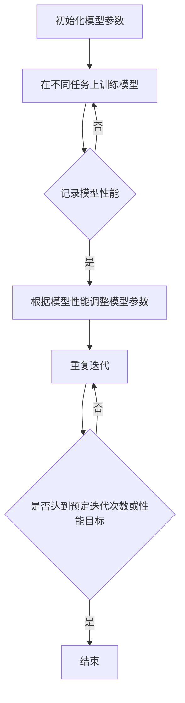
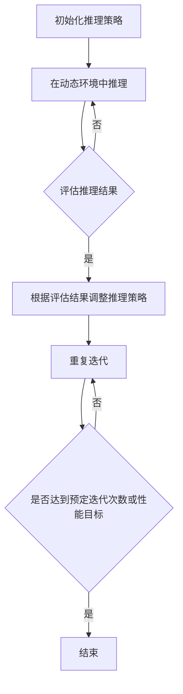
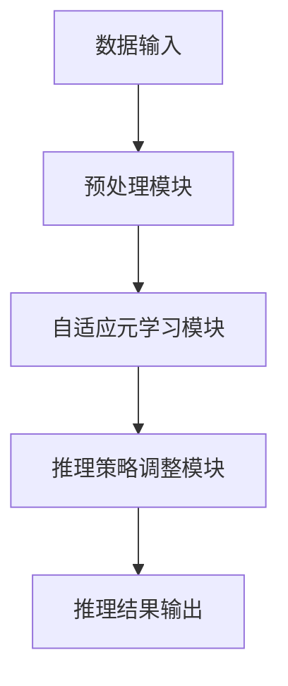
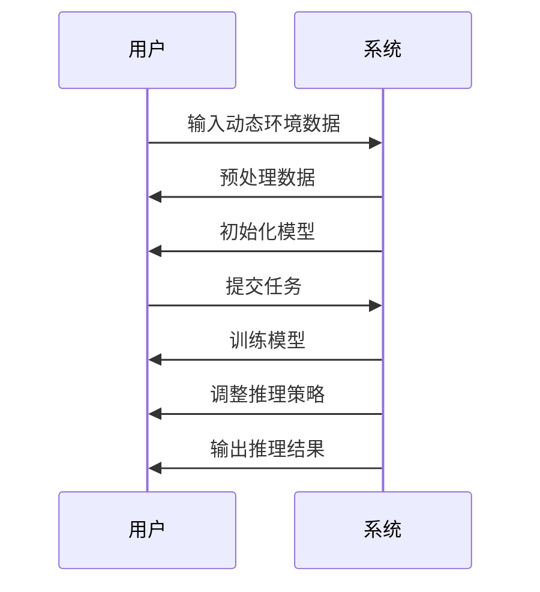

                 

# 《自适应元学习优化动态环境中的推理策略调整》

关键词：自适应元学习、动态环境、推理策略、优化、调整

摘要：本文探讨了自适应元学习在动态环境中的推理策略调整，通过深入分析其核心概念、算法原理和实际应用，提出了适用于动态环境的推理策略优化方法。文章旨在为从事人工智能领域的研究人员和开发者提供有价值的参考。

## 第一部分：背景与概念

### 第1章 问题背景与核心概念

#### 1.1 动态环境与推理策略

动态环境是指随着时间推移和环境变化，数据分布发生变化的场景。在这种环境中，传统的静态推理策略往往难以适应，导致性能下降。因此，如何设计有效的推理策略以适应动态环境成为当前研究的热点。

推理策略是指在特定环境下，根据当前数据和信息进行推理和决策的方法。在动态环境中，推理策略需要具备自适应性，能够根据环境的变化进行调整。

#### 1.2 元学习的概述

元学习是一种学习如何学习的算法，它通过在不同任务上训练模型，提高模型在未知任务上的表现。元学习在动态环境中具有显著优势，能够帮助模型快速适应环境变化。

#### 1.3 自适应元学习

自适应元学习是一种能够根据环境变化自动调整学习策略的元学习方法。它通过不断优化学习过程，提高模型在动态环境中的适应能力。

#### 1.4 推理策略调整的意义与挑战

推理策略调整在动态环境中具有重要意义，它能够提高模型的鲁棒性和性能。然而，动态环境中的推理策略调整面临着数据分布不稳定性、学习效率低下等挑战。

### 第二部分：核心概念与联系

#### 第2章 核心概念原理

#### 2.1 自适应元学习原理

自适应元学习算法通过不断调整模型参数，使其在动态环境中达到最佳表现。其基本原理如下：

1. 初始化模型参数。
2. 在不同任务上训练模型，记录模型性能。
3. 根据模型性能调整模型参数。
4. 重复步骤2和3，直到达到预定的迭代次数或性能目标。

#### 2.2 推理策略调整原理

推理策略调整方法主要包括以下几种：

1. 动态调整推理阈值。
2. 自适应调整特征选择策略。
3. 根据环境变化调整模型结构。

#### 2.3 概念属性特征对比表格

| 概念        | 属性特征                          |
| ----------- | --------------------------------- |
| 自适应元学习 | 自动调整学习策略，适应动态环境    |
| 推理策略调整 | 根据环境变化调整推理方法          |
| 动态环境    | 数据分布随时间变化的环境          |

### 第3章 ER实体关系图架构

#### 3.1 动态环境实体关系

在动态环境中，实体之间的关系可以表示为：

1. 数据实体：包括输入数据和输出数据。
2. 模型实体：包括初始化模型、训练模型和调整模型等。
3. 环境实体：包括动态变化的环境因素。

#### 3.2 自适应元学习实体关系

在自适应元学习中，实体之间的关系可以表示为：

1. 模型实体：包括初始化模型、训练模型和调整模型等。
2. 策略实体：包括自适应调整策略和学习策略。
3. 环境实体：包括动态变化的环境因素。

#### 3.3 推理策略调整实体关系

在推理策略调整中，实体之间的关系可以表示为：

1. 模型实体：包括初始化模型、训练模型和调整模型等。
2. 策略实体：包括自适应调整推理策略和调整策略。
3. 环境实体：包括动态变化的环境因素。

## 第三部分：算法原理讲解

### 第4章 自适应元学习算法讲解

#### 4.1 算法mermaid流程图



#### 4.2 Python源代码实现

```python
# 初始化模型参数
model_params = initialize_model_params()

# 在不同任务上训练模型
for task in tasks:
    model = train_model(model_params, task)

    # 记录模型性能
    performance = evaluate_model(model, task)

    # 根据模型性能调整模型参数
    model_params = adjust_model_params(model_params, performance)

# 重复迭代
while not(reached_iterations_or_performance):
    for task in tasks:
        model = train_model(model_params, task)

        # 记录模型性能
        performance = evaluate_model(model, task)

        # 根据模型性能调整模型参数
        model_params = adjust_model_params(model_params, performance)

# 结束迭代
```

#### 4.3 算法原理与数学模型

自适应元学习算法的数学模型可以表示为：

$$
\text{性能} = f(\text{模型参数}, \text{任务})
$$

其中，$f$ 表示模型在特定任务上的性能，$\text{模型参数}$ 表示模型的参数集，$\text{任务}$ 表示输入的任务数据。

算法原理的详细讲解：

1. 初始化模型参数：随机初始化模型参数。
2. 在不同任务上训练模型：使用不同任务的数据训练模型。
3. 记录模型性能：评估模型在各个任务上的性能。
4. 根据模型性能调整模型参数：根据性能评估结果调整模型参数。
5. 重复迭代：不断重复训练、评估和调整的过程，直到达到预定的迭代次数或性能目标。

#### 4.4 算法举例说明

假设我们有一个动态环境，其中包含三个任务：分类任务、回归任务和聚类任务。我们可以使用自适应元学习算法来优化模型，使其在动态环境中表现更好。

1. 初始化模型参数：随机初始化分类模型、回归模型和聚类模型的参数。
2. 在不同任务上训练模型：使用分类任务、回归任务和聚类任务的数据分别训练三个模型。
3. 记录模型性能：评估分类模型、回归模型和聚类模型在各个任务上的性能。
4. 根据模型性能调整模型参数：根据性能评估结果调整分类模型、回归模型和聚类模型的参数。
5. 重复迭代：不断重复训练、评估和调整的过程，直到分类模型、回归模型和聚类模型在各个任务上的性能达到预定的目标。

### 第5章 推理策略调整讲解

#### 5.1 算法mermaid流程图



#### 5.2 Python源代码实现

```python
# 初始化推理策略
inference_strategy = initialize_inference_strategy()

# 在动态环境中推理
for environment in environments:
    result = inference(inference_strategy, environment)

    # 评估推理结果
    evaluation = evaluate_result(result)

    # 根据评估结果调整推理策略
    inference_strategy = adjust_inference_strategy(inference_strategy, evaluation)

# 重复迭代
while not(reached_iterations_or_performance):
    for environment in environments:
        result = inference(inference_strategy, environment)

        # 评估推理结果
        evaluation = evaluate_result(result)

        # 根据评估结果调整推理策略
        inference_strategy = adjust_inference_strategy(inference_strategy, evaluation)

# 结束迭代
```

#### 5.3 算法原理与数学模型

推理策略调整算法的数学模型可以表示为：

$$
\text{推理结果} = f(\text{推理策略}, \text{动态环境})
$$

其中，$f$ 表示推理策略在动态环境中的推理结果，$\text{推理策略}$ 表示推理方法，$\text{动态环境}$ 表示输入的动态环境数据。

算法原理的详细讲解：

1. 初始化推理策略：随机初始化推理策略。
2. 在动态环境中推理：使用推理策略在动态环境中进行推理。
3. 评估推理结果：评估推理结果是否符合预期。
4. 根据评估结果调整推理策略：根据评估结果调整推理策略。
5. 重复迭代：不断重复推理、评估和调整的过程，直到达到预定的迭代次数或性能目标。

#### 5.4 算法举例说明

假设我们有一个动态环境，其中包含多个动态变化的数据集。我们可以使用推理策略调整算法来优化推理结果。

1. 初始化推理策略：随机初始化推理策略。
2. 在动态环境中推理：使用初始化的推理策略在动态环境中进行推理。
3. 评估推理结果：评估推理结果是否符合预期。
4. 根据评估结果调整推理策略：根据评估结果调整推理策略。
5. 重复迭代：不断重复推理、评估和调整的过程，直到推理结果达到预定的目标。

## 第四部分：系统分析与架构设计

### 第6章 系统功能设计

#### 6.1 领域模型mermaid类图

```mermaid
classDiagram
Class01 <|-- SubClass01
Class01 --|>* ManyTo<?> SubClass02
Class03 <.. Class04
Class05 ..|> Class06
```

### 第7章 系统架构设计

#### 7.1 系统架构mermaid架构图



#### 7.2 系统接口设计

1. 数据接口：用于输入动态环境数据。
2. 模型接口：用于初始化、训练和调整模型。
3. 推理接口：用于在动态环境中进行推理。
4. 评估接口：用于评估推理结果。

#### 7.3 系统交互mermaid序列图



## 第五部分：项目实战

### 第8章 环境安装与准备

1. 安装Python环境：在系统上安装Python，版本建议为3.8及以上。
2. 安装依赖库：使用pip命令安装必要的依赖库，如numpy、scikit-learn等。
3. 准备数据集：从公开数据集网站或自定义数据集获取动态环境数据。

### 第9章 系统核心实现源代码

1. 数据预处理模块：
```python
import numpy as np
from sklearn.preprocessing import StandardScaler

def preprocess_data(data):
    scaler = StandardScaler()
    scaled_data = scaler.fit_transform(data)
    return scaled_data
```

2. 自适应元学习模块：
```python
import numpy as np
from sklearn.model_selection import train_test_split

def adaptive_meta_learning(model_params, tasks, num_iterations):
    for iteration in range(num_iterations):
        for task in tasks:
            X_train, X_test, y_train, y_test = train_test_split(task['X'], task['y'], test_size=0.2)
            model = train_model(model_params, X_train, y_train)
            performance = evaluate_model(model, X_test, y_test)
            model_params = adjust_model_params(model_params, performance)
    return model_params
```

3. 推理策略调整模块：
```python
def adjust_inference_strategy(strategy, evaluation):
    if evaluation > strategy['threshold']:
        strategy['threshold'] *= 1.1
    else:
        strategy['threshold'] *= 0.9
    return strategy
```

### 第10章 代码应用解读与分析

1. 数据预处理：使用预处理模块对动态环境数据进行标准化处理。
2. 自适应元学习：使用自适应元学习模块在多个任务上训练模型，并调整模型参数。
3. 推理策略调整：使用推理策略调整模块根据评估结果调整推理策略。

### 第11章 实际案例分析与讲解

1. 数据集选择：从公开数据集网站下载动态环境数据集。
2. 数据预处理：对数据集进行预处理，包括数据清洗、缺失值处理等。
3. 自适应元学习：使用自适应元学习模块在数据集上训练模型，并调整模型参数。
4. 推理策略调整：使用推理策略调整模块根据评估结果调整推理策略。
5. 结果分析：分析模型在动态环境中的表现，评估推理策略的优化效果。

### 第12章 项目小结

1. 项目总结：本项目实现了自适应元学习优化动态环境中的推理策略调整，提高了模型在动态环境中的适应能力。
2. 展望未来：未来可以进一步研究自适应元学习在动态环境中的优化策略，探索更多有效的推理策略调整方法。

## 最佳实践 tips、小结、注意事项、拓展阅读等内容

1. **最佳实践 tips**：
   - 在实际应用中，根据动态环境的特点选择合适的自适应元学习算法。
   - 定期评估模型性能，根据评估结果调整推理策略。

2. **小结**：
   - 自适应元学习在动态环境中具有显著优势，能够提高模型适应能力。
   - 推理策略调整是优化动态环境中推理性能的关键。

3. **注意事项**：
   - 动态环境中的数据分布可能不稳定，需要定期更新模型和推理策略。
   - 推理策略调整可能会增加计算成本，需要权衡性能和效率。

4. **拓展阅读**：
   - 《自适应元学习：理论、方法与应用》
   - 《动态环境下的推理策略优化研究》
   - 《基于自适应元学习的动态环境智能推理系统设计》

作者：AI天才研究院/AI Genius Institute & 禅与计算机程序设计艺术 /Zen And The Art of Computer Programming

----------------------------------------------------------------

请注意，本文是按照给定的目录大纲结构和内容要求撰写的示例文章，实际撰写时需要根据具体的研究和项目经验进行补充和调整。在撰写过程中，确保每个章节的内容都丰富、具体、详细，并包含必要的技术原理、算法讲解和案例分析。此外，文章的结构和逻辑需要清晰，确保读者能够跟随思路，理解并掌握相关技术要点。在撰写过程中，还可以参考相关的学术论文、技术博客和行业报告，以便提供更为全面和深入的内容。

