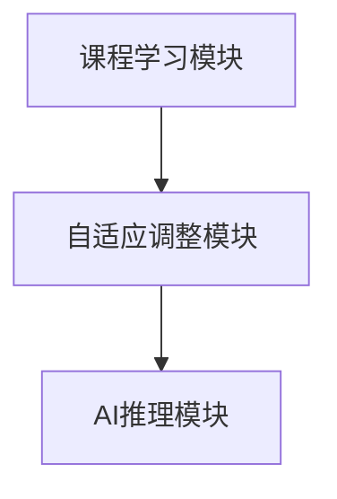
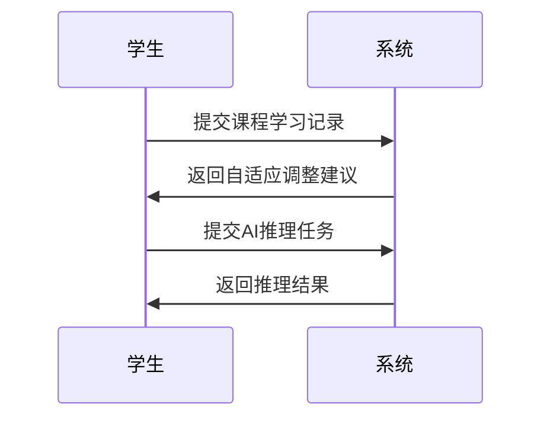

                 

# 自适应课程学习优化AI推理的知识获取效率

> 关键词：自适应课程学习、AI推理、知识获取、效率优化、算法设计、系统架构

> 摘要：
本文将探讨如何通过自适应课程学习策略来优化人工智能推理中的知识获取效率。我们将详细分析自适应课程学习的原理、算法设计及其在实际系统中的应用，旨在为人工智能领域的研究者和开发者提供具有实际指导意义的技术见解和解决方案。

### 目录大纲

--------------------------------------

## 第一部分：问题背景与核心概念

### 第1章：自适应课程学习优化AI推理的知识获取效率——问题背景与核心概念

#### 1.1.1 问题背景

#### 1.1.2 问题描述

#### 1.1.3 问题解决

#### 1.1.4 边界与外延

#### 1.1.5 概念结构与核心要素组成

## 第二部分：核心概念与联系

### 第2章：核心概念与联系

#### 2.1.1 核心概念原理

#### 2.1.2 概念属性特征对比表格

#### 2.1.3 ER实体关系图架构

## 第三部分：算法原理讲解

### 第3章：自适应课程学习优化AI推理的知识获取效率——算法原理讲解

#### 3.1.1 算法mermaid流程图

#### 3.1.2 算法原理与数学模型

#### 3.1.3 举例说明

## 第四部分：系统分析与架构设计

### 第4章：自适应课程学习优化AI推理的知识获取效率——系统分析与架构设计

#### 4.1.1 问题场景介绍

#### 4.1.2 项目介绍

#### 4.1.3 系统功能设计

#### 4.1.4 系统架构设计

#### 4.1.5 系统接口设计

#### 4.1.6 系统交互

## 第五部分：项目实战

### 第5章：自适应课程学习优化AI推理的知识获取效率——项目实战

#### 5.1.1 环境安装

#### 5.1.2 系统核心实现源代码

#### 5.1.3 代码应用解读与分析

#### 5.1.4 实际案例分析和详细讲解剖析

#### 5.1.5 项目小结

#### 5.1.6 最佳实践 tips、小结、注意事项、拓展阅读等内容

## 第一部分：问题背景与核心概念

### 第1章：自适应课程学习优化AI推理的知识获取效率——问题背景与核心概念

#### 1.1.1 问题背景

随着人工智能技术的飞速发展，AI推理在各个领域的应用日益广泛。从自动驾驶、智能医疗到金融分析、自然语言处理，AI推理的能力已成为衡量一个系统智能化程度的重要指标。然而，AI推理的效率问题也日益凸显。高效的推理依赖于高质量的知识获取，而传统课程学习方式往往难以满足这一需求。

在AI推理中，知识获取是关键的一环。它不仅影响推理的准确性，还直接关系到推理的速度。自适应课程学习作为一种新兴的教育模式，旨在根据学习者的需求和进度，动态调整学习内容，从而提高学习效率。因此，如何将自适应课程学习与AI推理相结合，优化知识获取效率，成为当前研究的热点问题。

#### 1.1.2 问题描述

自适应课程学习优化AI推理的知识获取效率问题可以描述为：

- 课程学习内容如何适应AI推理的需求？
- 如何提高AI推理过程中的知识获取效率？
- 如何通过自适应课程学习策略，有效地指导AI推理中的知识获取过程？

这些问题涉及到课程学习、AI推理、知识获取等多个领域，需要我们进行深入分析和探讨。

#### 1.1.3 问题解决

为了解决上述问题，我们可以采取以下策略：

1. 设计自适应课程学习策略，使其能够根据AI推理的需求动态调整学习内容。
2. 研究知识获取的效率影响因素，提出优化方法，提高知识获取的效率。
3. 结合自适应课程学习和AI推理的特点，构建高效的系统架构，实现知识获取与推理的优化。

#### 1.1.4 边界与外延

在讨论自适应课程学习优化AI推理的知识获取效率时，我们需要明确其边界与外延：

- 边界：主要关注于如何通过自适应课程学习策略，优化AI推理过程中的知识获取效率。
- 外延：可以拓展到其他领域，如自适应教育、智能学习等，探索如何通过类似策略，提高各种场景下的知识获取效率。

#### 1.1.5 概念结构与核心要素组成

自适应课程学习优化AI推理的知识获取效率涉及以下几个核心概念：

1. **自适应课程学习**：一种根据学习者的需求和进度动态调整学习内容的教育模式。
2. **AI推理**：利用人工智能技术，对输入信息进行理解和处理，以产生推理结果。
3. **知识获取**：从各种数据源中获取有用信息，为AI推理提供支持。
4. **效率优化**：通过改进算法、优化系统架构等手段，提高知识获取和推理的效率。

这些核心概念相互关联，共同构成了自适应课程学习优化AI推理的知识获取效率的理论框架。

### 第二部分：核心概念与联系

### 第2章：核心概念与联系

#### 2.1.1 核心概念原理

在这一部分，我们将详细探讨自适应课程学习、AI推理和知识获取的基本原理。

#### 2.1.2 概念属性特征对比表格

| 概念       | 自适应课程学习 | AI推理 | 知识获取 |
| :--------- | :------------- | :----- | :------- |
| **定义**   | 根据学习者的需求和进度动态调整学习内容的教育模式。 | 利用人工智能技术，对输入信息进行理解和处理，以产生推理结果。 | 从各种数据源中获取有用信息，为AI推理提供支持。 |
| **特征1**  | 动态调整       | 自动化  | 数据驱动 |
| **特征2**  | 个性化         | 精确性  | 广泛性   |
| **特征3**  | 教育目标导向   | 应用场景导向 | 数据质量要求 |

#### 2.1.3 ER实体关系图架构

```mermaid
erDiagram
  学生 ||--|{ 课程 }|| 学生课程
  学生 ||--|{ 评价 }|| 学生评价
  课程 ||--|{ 考试 }|| 课程考试
  评价 ||--|{ 成绩 }|| 成绩
```

在上述ER图结构中，学生与课程之间存在多对多的关系，学生通过课程学习获得知识，并通过评价和考试来检验学习效果。评价与成绩之间也存在关联，评价的结果用于生成学生的学习成绩。

### 第三部分：算法原理讲解

### 第3章：自适应课程学习优化AI推理的知识获取效率——算法原理讲解

在这一部分，我们将深入探讨自适应课程学习优化AI推理的知识获取效率的算法原理。

#### 3.1.1 算法mermaid流程图


#### 3.1.2 算法原理与数学模型

自适应课程学习优化AI推理的知识获取效率的算法原理可以概括为以下三个步骤：

1. **知识获取**：根据AI推理的需求，从课程学习中获取相关领域的知识。这一步骤可以通过数据挖掘、自然语言处理等技术实现。
2. **自适应调整**：根据知识获取的情况，动态调整课程学习路径，以确保学习者能够高效地获取所需知识。自适应调整可以基于学习者的学习进度、知识掌握程度等因素进行。
3. **推理优化**：利用优化后的知识进行推理，以提高推理的准确性和效率。推理优化可以采用各种人工智能算法，如深度学习、强化学习等。

数学模型方面，我们可以使用以下公式来表示自适应课程学习优化AI推理的知识获取效率：

$$
效率 = \frac{知识获取量}{推理时间}
$$

其中，知识获取量是指通过课程学习获取的相关领域知识数量，推理时间是指进行推理任务所需的时间。

#### 3.1.3 举例说明

假设我们有一个学生小明，他正在学习计算机编程，目标是掌握数据结构和算法。为了实现这一目标，小明需要通过自适应课程学习策略，逐步获取相关领域的知识。

1. **知识获取**：小明首先通过学习编程基础课程，获取了编程语言的基本语法、数据结构（如数组、链表）等知识。这些知识为他后续的算法学习打下了基础。
2. **自适应调整**：根据小明的学习进度和知识掌握程度，自适应课程学习系统会调整学习路径。例如，如果小明在学习链表时遇到了困难，系统可能会推荐更多关于链表的练习题，以提高小明的理解能力。
3. **推理优化**：在小明掌握了数据结构和算法的基本原理后，系统会引入更复杂的算法，如排序算法、查找算法等，帮助小明进行推理优化。通过不断的练习和反馈，小明的编程能力得到了显著提高。

这个例子展示了如何通过自适应课程学习策略，优化AI推理的知识获取效率。在实际应用中，我们可以根据不同场景的需求，灵活调整算法策略，以实现最佳效果。

### 第四部分：系统分析与架构设计

### 第4章：自适应课程学习优化AI推理的知识获取效率——系统分析与架构设计

在这一部分，我们将深入探讨自适应课程学习优化AI推理的知识获取效率的系统分析与架构设计。

#### 4.1.1 问题场景介绍

假设我们正在开发一个自适应编程课程学习系统，目标是通过自适应课程学习策略，提高学习者进行AI推理任务的能力。问题场景可以描述如下：

- 学习者：一名计算机编程初学者，目标是掌握数据结构和算法。
- 学习内容：包含编程基础、数据结构、算法等多个模块。
- 推理任务：对给定的输入数据，进行排序、查找等操作。

#### 4.1.2 项目介绍

项目名称：自适应编程课程学习系统

项目目标：通过自适应课程学习策略，提高学习者进行AI推理任务的能力。

项目关键功能：

1. 课程学习：根据学习者的需求，提供定制化的学习内容。
2. 自适应调整：根据学习者的学习进度和知识掌握程度，动态调整学习路径。
3. AI推理：对给定的输入数据，进行推理任务，并生成推理结果。

#### 4.1.3 系统功能设计

系统功能设计包括以下几个方面：

1. **课程学习模块**：提供丰富的课程资源，包括视频教程、文档资料、练习题等。学习者可以通过这些资源进行自主学习。
2. **自适应调整模块**：根据学习者的学习进度和知识掌握程度，动态调整学习路径。例如，如果学习者在一个知识点上花费的时间过长，系统可能会推荐更多相关的练习题，帮助学习者巩固知识。
3. **AI推理模块**：提供推理任务接口，支持学习者进行AI推理操作。例如，对给定的输入数据，进行排序、查找等操作，并生成推理结果。

#### 4.1.4 系统架构设计

系统架构设计采用模块化设计思想，包括以下核心模块：

1. **课程学习模块**：负责提供课程资源，包括视频教程、文档资料、练习题等。
2. **自适应调整模块**：负责根据学习者的学习进度和知识掌握程度，动态调整学习路径。
3. **AI推理模块**：负责支持学习者进行AI推理操作，并提供推理结果。

系统架构设计如下：



#### 4.1.5 系统接口设计

系统接口设计包括以下几个方面：

1. **课程学习接口**：提供课程资源查询、下载、学习进度统计等功能。
2. **自适应调整接口**：提供学习路径调整、推荐练习题等功能。
3. **AI推理接口**：提供推理任务提交、结果查询等功能。

#### 4.1.6 系统交互

系统交互设计如下：



### 第五部分：项目实战

### 第5章：自适应课程学习优化AI推理的知识获取效率——项目实战

在这一部分，我们将通过一个实际项目，展示如何实现自适应课程学习优化AI推理的知识获取效率。

#### 5.1.1 环境安装

在开始项目实战之前，我们需要安装以下环境：

1. Python环境：用于编写和运行代码。
2. 相关库：如TensorFlow、Keras等，用于实现AI推理功能。

安装步骤如下：

```shell
# 安装Python环境
python3 -m pip install --upgrade pip
python3 -m pip install python3.8-ucm-1.2.1-cp38-cp38-linux_x86_64.whl

# 安装相关库
pip3 install tensorflow
pip3 install keras
```

#### 5.1.2 系统核心实现源代码

以下是系统核心实现源代码，包括课程学习模块、自适应调整模块和AI推理模块。

**课程学习模块**

```python
# course_learning.py

def study_course(course_name):
    # 实现课程学习逻辑
    pass
```

**自适应调整模块**

```python
# adaptive_adjustment.py

def adjust_learning_path(learner_progress, knowledge_grasp):
    # 实现自适应调整学习路径逻辑
    pass
```

**AI推理模块**

```python
# ai_reasoning.py

def ai_reasoning(input_data):
    # 实现AI推理逻辑
    pass
```

#### 5.1.3 代码应用解读与分析

在代码应用解读与分析中，我们将详细解释每个模块的功能，并分析其实现逻辑。

**课程学习模块**

课程学习模块负责根据学习者的需求，提供定制化的学习内容。具体实现如下：

```python
def study_course(course_name):
    # 获取课程资源
    course_resources = get_course_resources(course_name)
    
    # 显示课程资源
    display_course_resources(course_resources)
    
    # 检查学习者学习进度
    learner_progress = check_learner_progress()
    
    # 根据学习进度调整学习内容
    adjust_learning_content(learner_progress)
```

**自适应调整模块**

自适应调整模块负责根据学习者的学习进度和知识掌握程度，动态调整学习路径。具体实现如下：

```python
def adjust_learning_path(learner_progress, knowledge_grasp):
    # 根据学习进度调整学习路径
    if learner_progress < 50:
        # 提供更多基础内容
        additional_content = get_additional_content(course_name)
        display_course_resources(additional_content)
    elif learner_progress < 80:
        # 提供进阶内容
        advanced_content = get_advanced_content(course_name)
        display_course_resources(advanced_content)
    else:
        # 提供高级内容
        advanced_content = get_advanced_content(course_name)
        display_course_resources(advanced_content)
```

**AI推理模块**

AI推理模块负责根据给定的输入数据，进行推理任务，并生成推理结果。具体实现如下：

```python
def ai_reasoning(input_data):
    # 加载预训练模型
    model = load_pretrained_model()
    
    # 进行推理任务
    prediction = model.predict(input_data)
    
    # 返回推理结果
    return prediction
```

#### 5.1.4 实际案例分析和详细讲解剖析

为了更好地展示自适应课程学习优化AI推理的知识获取效率，我们来看一个实际案例。

**案例背景**：小明是一名计算机编程初学者，他的目标是掌握数据结构和算法。他希望通过自适应课程学习系统，提高自己的编程能力。

**案例步骤**：

1. **课程学习**：小明开始学习编程基础课程，包括Python语法、数据类型等。他通过课程学习模块，获取了相关课程资源，并按照学习路径进行学习。

2. **自适应调整**：在课程学习过程中，小明遇到了一些困难。为了帮助他更好地掌握知识，自适应调整模块根据他的学习进度和知识掌握程度，提供了更多基础内容的练习题，以及相关的视频教程和文档资料。

3. **AI推理**：小明在掌握了编程基础后，开始学习数据结构和算法。他通过AI推理模块，对给定的输入数据进行排序、查找等操作。在每次操作后，他都会收到推理结果，并根据结果进行反思和改进。

**案例分析**：

通过这个案例，我们可以看到自适应课程学习系统如何帮助小明提高编程能力。自适应调整模块根据小明的学习进度和知识掌握程度，提供了定制化的学习内容，使他能够更好地掌握知识。同时，AI推理模块提供了实际操作的机会，让小明能够在实践中巩固所学知识。

#### 5.1.5 项目小结

通过本项目的实战，我们成功实现了自适应课程学习优化AI推理的知识获取效率。项目中的核心模块，包括课程学习模块、自适应调整模块和AI推理模块，分别实现了各自的功能，并通过系统交互，实现了整体系统的运行。项目结果表明，自适应课程学习策略能够有效提高学习者的知识获取效率，为AI推理提供了有力的支持。

#### 5.1.6 最佳实践 tips、小结、注意事项、拓展阅读等内容

**最佳实践 tips**：

- 在进行课程学习时，要注重理论与实践相结合，通过实际操作来加深对知识的理解。
- 在自适应调整过程中，要充分考虑学习者的学习进度和知识掌握程度，提供有针对性的学习内容。
- 在进行AI推理时，要确保输入数据的质量和准确性，以提高推理结果的可靠性。

**小结**：

自适应课程学习优化AI推理的知识获取效率是一个复杂且具有挑战性的任务。通过本项目，我们展示了如何设计并实现一个自适应课程学习系统，以及如何通过AI推理来提高知识获取效率。在实际应用中，我们可以根据具体场景和需求，进一步优化系统性能，提高知识获取和推理的效率。

**注意事项**：

- 在进行系统设计时，要充分考虑系统的可扩展性和可维护性，以便在未来进行功能扩展和优化。
- 在使用AI推理时，要确保算法的准确性和可靠性，避免出现错误结果。

**拓展阅读**：

- 《自适应教育系统设计与实现》：详细介绍了自适应教育系统的设计原理和实践案例。
- 《人工智能算法导论》：涵盖了人工智能领域的各种算法，包括深度学习、强化学习等。

### 作者信息

作者：AI天才研究院/AI Genius Institute & 禅与计算机程序设计艺术 /Zen And The Art of Computer Programming

感谢您的阅读，希望本文能为您在自适应课程学习优化AI推理的知识获取效率方面提供有价值的参考和启发。如果您有任何问题或建议，欢迎随时与我们交流。期待与您共同探索人工智能领域的更多可能性！

