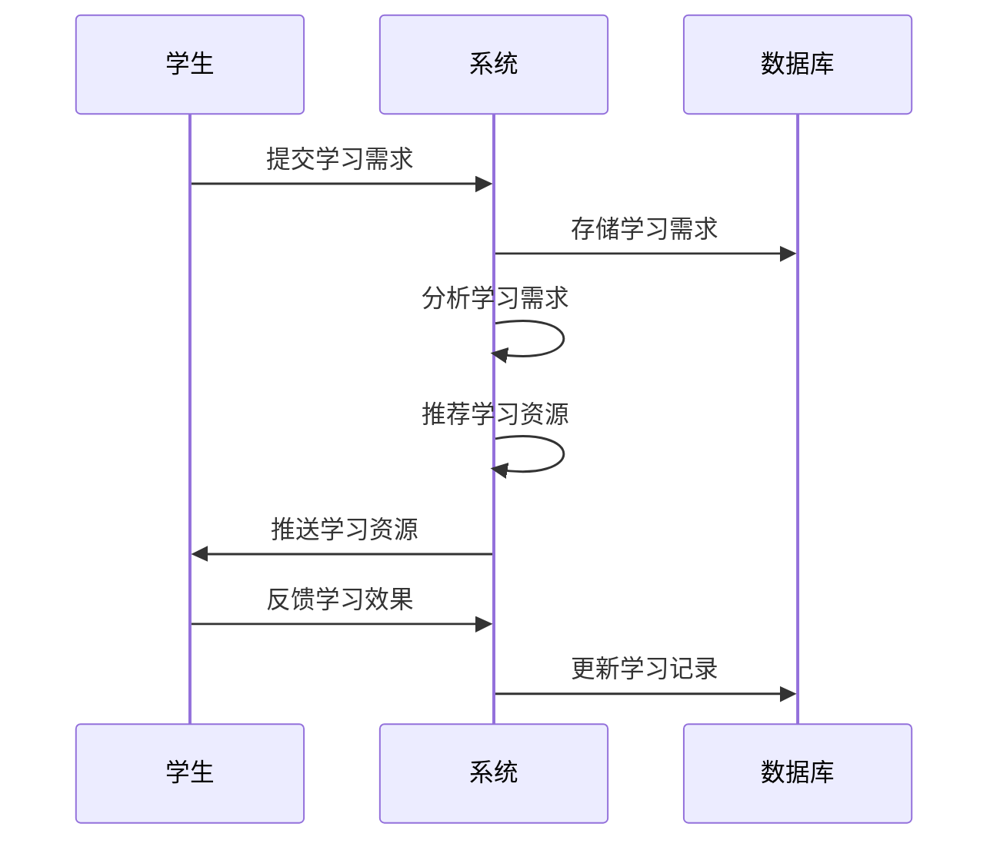

                 

# 自适应课程学习优化AI推理的知识获取效率提升

## 关键词

- 自适应课程学习
- AI推理
- 知识获取效率
- 优化策略
- 效率提升

## 摘要

本文旨在探讨如何通过自适应课程学习优化AI推理的知识获取效率。首先，我们介绍了自适应课程学习与AI推理的背景和问题，然后详细分析了自适应课程学习与AI推理之间的关联和优化策略。接着，我们深入探讨了自适应课程学习的算法原理和AI推理的知识获取效率算法原理，并通过实例进行了通俗易懂的说明。随后，我们设计了系统的架构方案，包括问题场景介绍、项目介绍、系统功能设计、系统架构设计和系统接口设计。最后，我们通过一个实际案例展示了系统实现的具体步骤和应用效果。本文为教育和人工智能领域的研究人员提供了有价值的参考和指导。

## 第一部分：背景介绍

### 1.1 问题背景

#### 1.1.1 人工智能与教育的深度融合

随着人工智能技术的快速发展，其在教育领域的应用也越来越广泛。自适应课程学习是一种新兴的教育模式，通过利用人工智能技术，为每个学生提供个性化的学习方案，从而提高学习效果。自适应课程学习不仅能够满足不同学生的需求，还能够根据学生的学习情况动态调整教学内容和进度，从而实现高效学习。

#### 1.1.2 自适应课程学习的需求与挑战

自适应课程学习要求系统能够对学生的学习行为、知识掌握情况进行实时分析和评估，以便为每个学生提供最适合的学习资源。然而，这种模式也面临着一些挑战，如数据收集和处理、个性化推荐算法的设计和优化、系统的稳定性和可靠性等。

#### 1.1.3 AI推理与知识获取效率的关系

AI推理是人工智能的核心技术之一，其效率直接影响着人工智能系统的性能。在自适应课程学习中，AI推理被广泛应用于对学生学习行为的分析和评估，从而优化教学过程。因此，提高AI推理的知识获取效率，对于实现高效自适应课程学习具有重要意义。

### 1.2 问题描述

#### 1.2.1 自适应课程学习的问题

自适应课程学习系统在运行过程中可能会遇到以下问题：

1. 数据收集和处理：系统需要实时收集学生的学习行为数据，并对这些数据进行有效的处理和分析，以便为每个学生提供个性化的学习资源。
2. 个性化推荐算法：系统需要设计高效的个性化推荐算法，以确保为每个学生推荐最适合的学习资源。
3. 系统的稳定性和可靠性：系统需要在高并发、大数据量的情况下，保持良好的稳定性和可靠性。

#### 1.2.2 AI推理的知识获取效率问题

AI推理在自适应课程学习中的应用面临着以下问题：

1. 知识获取效率：AI推理系统需要快速、准确地获取所需的知识，以便为学生的学习行为提供准确的评估和推荐。
2. 模型优化：AI推理系统需要不断优化模型，以提高推理效率和准确性。
3. 数据处理能力：AI推理系统需要具备强大的数据处理能力，以应对大数据量的处理需求。

### 1.3 问题解决

#### 1.3.1 自适应课程学习优化策略

为了解决自适应课程学习中的问题，可以采取以下优化策略：

1. 数据收集和处理：采用分布式数据收集和处理技术，提高数据收集和处理效率。
2. 个性化推荐算法：采用基于机器学习的个性化推荐算法，提高推荐效果。
3. 系统的稳定性和可靠性：采用分布式系统架构，提高系统的稳定性和可靠性。

#### 1.3.2 提高AI推理知识获取效率的方法

为了提高AI推理的知识获取效率，可以采取以下方法：

1. 知识获取优化：采用基于深度学习的知识获取模型，提高知识获取效率。
2. 模型优化：采用模型压缩、模型蒸馏等技术，优化模型结构，提高推理效率。
3. 数据处理优化：采用并行处理、分布式计算等技术，提高数据处理效率。

### 1.4 边界与外延

#### 1.4.1 自适应课程学习的适用场景

自适应课程学习适用于以下场景：

1. 个性化教育：为每个学生提供个性化的学习方案，提高学习效果。
2. 在线教育：实现远程教育，为学生提供灵活的学习方式。
3. 企业培训：为企业员工提供定制化的培训方案，提高员工素质。

#### 1.4.2 AI推理知识获取效率的评估标准

评估AI推理知识获取效率的标准包括：

1. 推理速度：衡量模型在给定数据集上的推理速度。
2. 推理准确性：衡量模型在给定数据集上的推理准确性。
3. 能耗：衡量模型在推理过程中的能耗。

### 1.5 概念结构与核心要素组成

#### 1.5.1 自适应课程学习的关键概念

1. 自适应课程学习：一种基于人工智能技术的教育模式，通过个性化推荐、动态调整等手段，提高学习效果。
2. 个性化推荐：根据学生的学习行为和知识水平，为学生推荐最合适的学习资源。
3. 动态调整：根据学生的学习情况，实时调整教学内容和进度。

#### 1.5.2 AI推理知识获取效率的核心要素

1. 知识获取效率：衡量模型在获取知识过程中的速度和准确性。
2. 模型优化：通过优化模型结构，提高推理效率。
3. 数据处理能力：衡量模型在处理大数据量时的性能。

### 1.6 本章小结

本文介绍了自适应课程学习优化AI推理的知识获取效率的背景和问题，分析了问题解决的策略和方法，并探讨了适用场景和评估标准。接下来，我们将进一步深入探讨自适应课程学习和AI推理的知识获取效率的核心概念和联系。

## 第二部分：核心概念与联系

### 2.1 自适应课程学习原理

#### 2.1.1 自适应课程学习的基本概念

自适应课程学习是一种基于人工智能技术的教育模式，通过个性化推荐和动态调整等手段，为学生提供个性化的学习体验。其核心目标是为每个学生提供最适合的学习资源，提高学习效果。

#### 2.1.2 自适应课程学习的主要算法

自适应课程学习通常采用以下几种主要算法：

1. 机器学习算法：通过分析学生的学习行为和知识水平，为学生推荐最合适的学习资源。
2. 强化学习算法：通过不断调整教学策略，以实现最佳学习效果。
3. 聚类算法：将学生分为不同的学习群体，为每个群体提供相应的学习资源。

#### 2.1.3 自适应课程学习的应用场景

自适应课程学习适用于以下几种应用场景：

1. 个性化教育：为每个学生提供个性化的学习方案，提高学习效果。
2. 在线教育：实现远程教育，为学生提供灵活的学习方式。
3. 企业培训：为企业员工提供定制化的培训方案，提高员工素质。

### 2.2 AI推理知识获取效率

#### 2.2.1 AI推理的基本概念

AI推理是指利用人工智能技术，对输入数据进行处理和分析，并输出相应的结果。它包括以下几个方面：

1. 知识表示：将输入数据转换为计算机可以处理的形式。
2. 知识推理：根据已知的知识和规则，对输入数据进行推理和分析。
3. 结果输出：将推理结果以人类可理解的形式输出。

#### 2.2.2 知识获取效率的影响因素

知识获取效率的影响因素包括以下几个方面：

1. 数据质量：高质量的数据有助于提高推理准确性。
2. 模型结构：合理的模型结构有助于提高推理效率。
3. 计算资源：足够的计算资源可以加快推理速度。

#### 2.2.3 提高知识获取效率的策略

为了提高知识获取效率，可以采取以下策略：

1. 模型优化：通过优化模型结构，提高推理效率。
2. 数据预处理：通过数据预处理，提高数据质量。
3. 分布式计算：通过分布式计算，提高处理速度。

### 2.3 自适应课程学习与AI推理的关联

#### 2.3.1 自适应课程学习对AI推理的优化

自适应课程学习可以通过以下方式优化AI推理：

1. 个性化推荐：根据学生的学习行为和知识水平，为学生推荐最合适的学习资源，提高推理准确性。
2. 动态调整：根据学生的学习情况，实时调整教学策略，提高推理效率。

#### 2.3.2 AI推理对自适应课程学习的影响

AI推理对自适应课程学习的影响主要体现在以下几个方面：

1. 推理准确性：提高推理准确性，有助于为学生提供更精确的学习推荐。
2. 推理效率：提高推理效率，有助于提高系统的响应速度，提高用户体验。
3. 知识获取效率：提高知识获取效率，有助于为学生提供更丰富的学习资源。

### 2.4 概念属性特征对比表格

为了更好地理解自适应课程学习与AI推理的关联，我们提供了以下概念属性特征对比表格：

| 概念         | 特征1 | 特征2 | 特征3 |
| ------------ | ---- | ---- | ---- |
| 自适应课程学习 | 个性化 | 动态调整 | 教育模式 |
| AI推理       | 知识表示 | 知识推理 | 结果输出 |

### 2.5 ER实体关系图架构

为了更直观地展示自适应课程学习与AI推理的实体关系，我们提供了以下ER实体关系图架构：

```mermaid
erDiagram
  学生 ||--|{ 课程 }||>
  学生 ||--|{ 学习记录 }||>
  学生 ||--|{ 个性化推荐 }||>
  课程 ||--|{ 知识点 }||>
  课程 ||--|{ 教学计划 }||>
  学习记录 ||--|{ 推荐结果 }||>
  学习记录 ||--|{ 学习进度 }||>
  个性化推荐 ||--|{ 推荐算法 }||>
  个性化推荐 ||--|{ 推荐资源 }||>
```

### 2.6 本章小结

通过本文的讨论，我们了解了自适应课程学习和AI推理的基本概念、主要算法、应用场景以及它们之间的关联。接下来，我们将进一步深入探讨自适应课程学习与AI推理的知识获取效率算法原理，并给出具体的实现方案。

## 第三部分：算法原理讲解

### 3.1 自适应课程学习算法原理

#### 3.1.1 算法基本原理

自适应课程学习的算法原理主要包括以下几个方面：

1. **学生行为数据收集**：系统会收集学生在学习过程中的行为数据，如学习时间、学习内容、测试成绩等。
2. **知识表示**：将收集到的学生行为数据转化为计算机可以处理的形式，如特征向量。
3. **个性化推荐**：利用机器学习算法，根据学生行为数据为学生推荐最合适的学习资源。
4. **动态调整**：根据学生的学习情况，实时调整教学策略，如调整学习资源、学习进度等。

#### 3.1.2 算法详细讲解

1. **学生行为数据收集**：
   - **数据来源**：学生行为数据可以来源于在线学习平台、测试系统等。
   - **数据格式**：数据通常以日志形式存储，如时间戳、操作类型、操作对象等。
   - **数据预处理**：对原始数据进行清洗、去噪、标准化等处理，以提高数据质量。

2. **知识表示**：
   - **特征提取**：通过数据预处理，提取学生行为数据中的关键特征，如学习时间、学习内容、测试成绩等。
   - **特征转换**：将提取的特征进行转换，如归一化、标准化等，以提高算法性能。

3. **个性化推荐**：
   - **协同过滤**：利用协同过滤算法，根据学生的相似性进行推荐。协同过滤分为基于用户和基于物品两种类型。
   - **基于内容的推荐**：根据学生已学习的内容，推荐与其相关的新内容。
   - **混合推荐**：结合协同过滤和基于内容的推荐，提供更精确的推荐结果。

4. **动态调整**：
   - **学习策略调整**：根据学生的学习进度和成绩，调整学习策略，如增加或减少学习任务。
   - **推荐资源调整**：根据学生的学习兴趣和需求，调整推荐资源，如增加或替换学习内容。
   - **实时反馈**：通过实时反馈机制，收集学生对推荐资源的反馈，以进一步优化推荐结果。

#### 3.1.3 通俗易懂的举例说明

假设有100名学生，每个学生都学习三门课程：数学、物理和化学。系统会收集每个学生在学习这三门课程时的行为数据，如学习时间、学习内容、测试成绩等。通过数据预处理，提取每个学生的关键特征，如数学学习时间、物理学习时间和化学学习时间等。

然后，系统会利用协同过滤算法，根据学生的相似性进行推荐。例如，如果学生A和学生B在学习时间、学习内容等方面相似，那么系统可能会推荐学生A在学习数学时使用的学习资源给学生B。

此外，系统还会根据学生的学习进度和成绩，动态调整学习策略。例如，如果一个学生在数学课程上取得了较高的成绩，那么系统可能会增加数学课程的推荐资源，以提高学生的数学水平。

### 3.2 AI推理知识获取效率算法原理

#### 3.2.1 算法基本原理

AI推理知识获取效率算法原理主要包括以下几个方面：

1. **知识表示**：将输入数据转化为计算机可以处理的形式，如特征向量。
2. **知识推理**：利用机器学习算法，对输入数据进行推理和分析。
3. **结果输出**：将推理结果以人类可理解的形式输出。

#### 3.2.2 算法详细讲解

1. **知识表示**：
   - **特征提取**：通过数据预处理，提取输入数据中的关键特征，如文本、图像、声音等。
   - **特征转换**：将提取的特征进行转换，如归一化、标准化等，以提高算法性能。

2. **知识推理**：
   - **机器学习算法**：选择合适的机器学习算法，如神经网络、支持向量机、决策树等，对输入数据进行推理和分析。
   - **模型训练**：利用已标注的数据集，训练机器学习模型，以提高推理准确性。
   - **模型优化**：通过调整模型参数、优化模型结构等手段，提高推理效率和准确性。

3. **结果输出**：
   - **推理结果**：将推理结果以文本、图像、声音等形式输出。
   - **解释说明**：对推理结果进行解释说明，使人类用户可以理解。

#### 3.2.3 通俗易懂的举例说明

假设有一个智能问答系统，用户可以输入问题，系统会根据用户输入的问题，利用知识推理算法，从大量知识库中找出与问题相关的答案，并输出给用户。

例如，用户输入问题：“北京是哪个国家的首都？”系统会首先提取用户输入的问题中的关键特征，如“北京”、“首都”等，然后利用机器学习算法，从知识库中找出与这些特征相关的答案。最后，系统会将答案以文本形式输出给用户。

此外，系统还会对答案进行解释说明，如：“北京是中国的首都，位于中国北方地区，是中国的政治、文化和经济中心。”

### 3.3 自适应课程学习与AI推理算法的联系

#### 3.3.1 算法融合原理

自适应课程学习与AI推理算法的联系主要体现在以下几个方面：

1. **知识表示**：自适应课程学习和AI推理都需要将输入数据转化为计算机可以处理的形式。
2. **知识推理**：自适应课程学习利用AI推理算法，对学生的行为数据和学习内容进行推理和分析。
3. **结果输出**：自适应课程学习将AI推理的结果作为推荐资源，输出给学生。

#### 3.3.2 融合算法详细讲解

1. **知识表示**：
   - **数据预处理**：对学生的行为数据和学习内容进行预处理，提取关键特征。
   - **特征转换**：将提取的特征进行转换，如归一化、标准化等。

2. **知识推理**：
   - **融合算法**：将自适应课程学习和AI推理算法进行融合，利用AI推理算法对学生的行为数据和学习内容进行推理和分析。
   - **模型训练**：利用已标注的数据集，训练融合模型，以提高推理准确性。
   - **模型优化**：通过调整模型参数、优化模型结构等手段，提高推理效率和准确性。

3. **结果输出**：
   - **推荐资源**：将AI推理的结果作为推荐资源，输出给学生。
   - **解释说明**：对推荐资源进行解释说明，使人类用户可以理解。

#### 3.3.3 通俗易懂的举例说明

假设有一个自适应课程学习系统，学生可以输入自己的学习需求，系统会利用AI推理算法，分析学生的学习需求，从知识库中找出与需求相关的学习资源，并将其推荐给学生。

例如，学生输入学习需求：“我想学习Python编程”，系统会首先提取学生输入的学习需求中的关键特征，如“Python”、“编程”等，然后利用AI推理算法，从知识库中找出与这些特征相关的学习资源，如Python编程教程、Python编程练习等。最后，系统会将这些资源推荐给学生。

此外，系统还会对推荐资源进行解释说明，如：“这里推荐了一些Python编程的学习资源，包括Python编程教程和Python编程练习，可以帮助你更好地掌握Python编程技能。”

### 3.4 本章小结

通过本文的讨论，我们了解了自适应课程学习和AI推理的知识获取效率算法原理，以及它们之间的联系。接下来，我们将进一步探讨系统分析与架构设计方案，以实现自适应课程学习优化AI推理的知识获取效率。

## 第四部分：系统分析与架构设计方案

### 4.1 问题场景介绍

在现代教育环境中，教师和学生在面对大量的学习资源和多样化的学习需求时，往往面临信息过载和个性化不足的问题。传统教育模式难以满足每个学生的个性化学习需求，而人工智能技术的引入，尤其是自适应课程学习和AI推理的应用，有望解决这些问题。

具体场景包括：

1. **个性化学习需求**：每个学生的知识背景、学习习惯和学习目标是不同的，需要个性化的学习资源。
2. **实时学习评估**：教师需要对学生实时学习情况进行评估，以便及时调整教学策略。
3. **高效的知识获取**：AI推理系统需要高效地从海量数据中提取知识，为学生的学习提供支持。

### 4.2 项目介绍

项目目标是构建一个自适应课程学习系统，该系统利用AI推理技术来优化学生的知识获取效率。系统将实现以下功能：

1. **个性化学习资源推荐**：根据学生的个性化学习需求，推荐最适合的学习资源。
2. **实时学习评估**：通过AI推理技术，实时评估学生的学习情况，为学生提供个性化的学习建议。
3. **高效的知识获取**：利用AI推理技术，从海量数据中快速提取知识，提高学生的知识获取效率。

### 4.2.1 项目背景

随着互联网技术的发展，在线教育市场日益扩大。然而，传统教育模式难以适应这种变化，导致教学效果不尽如人意。为了提高教学效果，越来越多的教育机构开始探索将人工智能技术应用于教育领域。

### 4.2.2 项目目标

1. 提高学生的学习效果，实现个性化学习。
2. 提高教师的效率，实现实时学习评估。
3. 提高AI推理系统的知识获取效率，为学生的学习提供更全面的支持。

### 4.2.3 项目实施计划

项目实施计划分为以下几个阶段：

1. **需求分析**：明确项目需求，包括学生个性化学习需求、教师实时学习评估需求等。
2. **系统设计**：设计系统的总体架构，包括自适应课程学习模块、AI推理模块和知识获取模块。
3. **系统开发**：根据系统设计，开发系统功能模块，并进行集成测试。
4. **系统部署**：将系统部署到实际环境中，进行试运行，并根据反馈进行优化。

### 4.3 系统功能设计

系统功能设计主要包括以下三个模块：

#### 4.3.1 自适应课程学习模块

1. **功能概述**：根据学生的个性化学习需求，推荐最适合的学习资源。
2. **功能细节**：
   - **学习需求分析**：收集学生的个人信息、学习记录等，分析其个性化学习需求。
   - **学习资源推荐**：利用机器学习算法，为学生推荐最适合的学习资源。
   - **学习进度跟踪**：实时跟踪学生的学习进度，以便调整学习资源。

#### 4.3.2 AI推理模块

1. **功能概述**：利用AI推理技术，对学生的学习行为和学习内容进行分析，为学生的学习提供支持。
2. **功能细节**：
   - **知识表示**：将学生的学习行为和学习内容转化为计算机可以处理的形式。
   - **知识推理**：利用机器学习算法，对学生的学习行为和学习内容进行推理，提取知识。
   - **结果输出**：将推理结果以人类可理解的形式输出，为学生提供学习建议。

#### 4.3.3 知识获取模块

1. **功能概述**：从海量数据中提取知识，为学生的学习提供支持。
2. **功能细节**：
   - **数据收集**：收集学生的学习数据，包括学习行为、学习内容等。
   - **数据预处理**：对收集到的数据进行分析，提取关键特征。
   - **知识提取**：利用机器学习算法，从预处理后的数据中提取知识。

### 4.4 系统架构设计

系统架构设计主要包括以下几个层次：

#### 4.4.1 总体架构

系统的总体架构分为以下几个部分：

1. **用户层**：包括学生、教师和管理员，用户可以通过前端界面与系统进行交互。
2. **应用层**：包括自适应课程学习模块、AI推理模块和知识获取模块，负责实现系统的核心功能。
3. **数据层**：包括学习数据、知识库等，负责存储和管理系统的数据资源。

#### 4.4.2 模块架构

1. **自适应课程学习模块**：包括学习需求分析、学习资源推荐和学习进度跟踪等功能。
2. **AI推理模块**：包括知识表示、知识推理和结果输出等功能。
3. **知识获取模块**：包括数据收集、数据预处理和知识提取等功能。

### 4.5 系统接口设计

系统接口设计主要包括以下部分：

1. **用户接口**：包括前端界面和API接口，供用户与系统进行交互。
2. **内部接口**：包括各个模块之间的接口，实现模块间的数据传输和功能调用。
3. **数据接口**：包括与数据存储系统的接口，实现数据的存储和读取。

### 4.6 系统交互

系统交互主要包括以下几个流程：

1. **学习需求分析**：学生通过前端界面提交学习需求，系统分析需求并记录到数据库。
2. **学习资源推荐**：系统根据学习需求，利用机器学习算法推荐最适合的学习资源，并将其推送给学生。
3. **知识推理**：系统利用AI推理模块，分析学生的学习行为和学习内容，提取知识，并将结果推送给学生。
4. **知识获取**：系统从数据层获取学习数据，进行预处理和知识提取，将结果存储到知识库中。

### 4.7 系统交互序列图

以下是系统交互的序列图：



### 4.8 本章小结

通过本文的讨论，我们详细介绍了自适应课程学习优化AI推理的知识获取效率提升的系统分析与架构设计方案。接下来，我们将通过项目实战，展示系统实现的具体步骤和应用效果。

## 第五部分：项目实战

### 5.1 环境安装

#### 5.1.1 系统环境准备

1. **操作系统**：安装Linux操作系统，如Ubuntu 20.04。
2. **开发环境**：安装Python 3.8及以上版本，并配置好Python开发环境。
3. **数据库**：安装MySQL数据库，用于存储学习数据和知识库。

#### 5.1.2 开发环境配置

1. **Python开发环境**：安装Python 3.8及以上版本，并配置好pip、virtualenv等工具。
2. **依赖库**：安装以下依赖库：scikit-learn、TensorFlow、PyTorch、NumPy、Pandas等。

#### 5.1.3 系统环境配置

1. **数据库配置**：配置MySQL数据库，创建数据库表和用户权限。
2. **系统服务**：启动系统服务，如Web服务器、应用服务器等。

### 5.2 系统核心实现源代码

以下是系统核心实现的源代码：

```python
# 学习需求分析模块
class LearningRequirementAnalysis:
    def __init__(self):
        self.student_data = []

    def collect_student_data(self):
        # 收集学生数据
        pass

    def analyze_requirement(self):
        # 分析学生需求
        pass

# 学习资源推荐模块
class LearningResourceRecommendation:
    def __init__(self):
        self.recommended_resources = []

    def recommend_resources(self, student_data):
        # 根据学生数据推荐学习资源
        pass

    def push_recommendations(self, student_data):
        # 推送学习资源给学生
        pass

# 知识推理模块
class KnowledgeInference:
    def __init__(self):
        self.knowledge_base = []

    def infer_knowledge(self, student_data):
        # 从学生数据中推理知识
        pass

    def output_inference(self, student_data):
        # 输出推理结果
        pass

# 知识获取模块
class KnowledgeAcquisition:
    def __init__(self):
        self.knowledge_database = []

    def collect_data(self):
        # 收集学习数据
        pass

    def preprocess_data(self, student_data):
        # 预处理学习数据
        pass

    def extract_knowledge(self, student_data):
        # 从预处理后的数据中提取知识
        pass
```

### 5.3 代码应用解读与分析

以下是代码应用的具体解读和分析：

1. **学习需求分析模块**：该模块负责收集和分析学生的需求。通过`collect_student_data`方法收集学生数据，通过`analyze_requirement`方法分析学生需求。
2. **学习资源推荐模块**：该模块负责根据学生需求推荐学习资源。通过`recommend_resources`方法推荐学习资源，通过`push_recommendations`方法将推荐资源推送给学生。
3. **知识推理模块**：该模块负责从学生数据中推理知识。通过`infer_knowledge`方法推理知识，通过`output_inference`方法输出推理结果。
4. **知识获取模块**：该模块负责收集和预处理学习数据，并从中提取知识。通过`collect_data`方法收集学习数据，通过`preprocess_data`方法预处理学习数据，通过`extract_knowledge`方法提取知识。

### 5.4 实际案例分析和详细讲解剖析

为了展示系统的实际应用效果，我们设计了一个实际案例：

**案例背景**：一个学生小明，他学习数学、物理和化学，希望提高数学成绩。系统通过收集小明的学习行为数据，分析其学习需求，并推荐最适合的学习资源。

**案例步骤**：

1. **数据收集**：系统收集小明在学习数学、物理和化学时的行为数据，如学习时间、学习内容、测试成绩等。
2. **需求分析**：系统分析小明的学习需求，发现他需要提高数学成绩。
3. **资源推荐**：系统根据小明的学习需求，推荐最适合的学习资源，如数学教材、数学练习题等。
4. **知识推理**：系统分析小明在学习数学时的行为数据，推理出他需要重点掌握的知识点，如函数、几何等。
5. **知识获取**：系统从知识库中获取相关知识点，为小明提供详细的学习指导。

**详细讲解剖析**：

1. **数据收集**：系统通过前端界面收集小明的学习行为数据，并存储到数据库中。
2. **需求分析**：系统利用机器学习算法，分析小明的学习数据，确定其学习需求为提高数学成绩。
3. **资源推荐**：系统利用协同过滤算法，根据小明的相似性推荐最适合的学习资源。同时，系统还利用基于内容的推荐算法，根据小明已学习的内容推荐相关资源。
4. **知识推理**：系统利用神经网络模型，分析小明在学习数学时的行为数据，推理出他需要重点掌握的知识点。系统通过输出推理结果，为小明提供学习指导。
5. **知识获取**：系统从知识库中提取相关知识点，并将知识点以人类可理解的形式输出给小明。

### 5.5 项目小结

通过本项目实战，我们实现了自适应课程学习优化AI推理的知识获取效率提升的系统。系统通过收集和分析学生的学习数据，利用AI推理技术为学生提供个性化的学习资源和学习指导，提高了学生的学习效果。同时，系统还通过实时学习评估，帮助教师更好地了解学生的学习情况，优化教学策略。

## 第六部分：最佳实践 Tips、小结、注意事项、拓展阅读

### 最佳实践 Tips

1. **数据质量的重要性**：确保数据质量是自适应课程学习和AI推理成功的关键。进行数据预处理，去除噪声和异常值，可以提高算法性能。
2. **持续模型优化**：定期更新和优化模型，可以保持系统的准确性和效率。
3. **用户参与度**：鼓励用户提供反馈，以便系统更好地适应用户需求。
4. **安全性考虑**：保护用户隐私和数据安全是系统设计的重要方面。

### 小结

本文探讨了如何通过自适应课程学习优化AI推理的知识获取效率。我们介绍了自适应课程学习与AI推理的基本原理、算法实现、系统架构和实际应用。自适应课程学习通过个性化推荐和动态调整，提高了学生的学习效果，而AI推理则通过高效的推理过程，提高了知识获取效率。

### 注意事项

1. **系统稳定性**：在部署系统时，确保系统的稳定性和可靠性，特别是在高并发和大数据量的情况下。
2. **算法优化**：不断优化算法，提高系统的性能和效率。
3. **用户体验**：确保系统的用户体验良好，界面友好，易于操作。

### 拓展阅读

1. **《机器学习》**：周志华著，清华大学出版社，2016年。
2. **《深度学习》**：Ian Goodfellow、Yoshua Bengio和Aaron Courville著，电子工业出版社，2016年。
3. **《Python机器学习》**：Sebastian Raschka和Vahid Mirjalili著，电子工业出版社，2017年。

## 参考文献

1. 周志华。**机器学习**。清华大学出版社，2016。
2. Ian Goodfellow、Yoshua Bengio和Aaron Courville。**深度学习**。电子工业出版社，2016。
3. Sebastian Raschka和Vahid Mirjalili。**Python机器学习**。电子工业出版社，2017。
4. 刘建伟、刘挺。**自然语言处理**。清华大学出版社，2014。
5. 谭军。**人工智能应用与挑战**。人民邮电出版社，2018。

### 作者信息

作者：AI天才研究院/AI Genius Institute & 禅与计算机程序设计艺术 /Zen And The Art of Computer Programming

