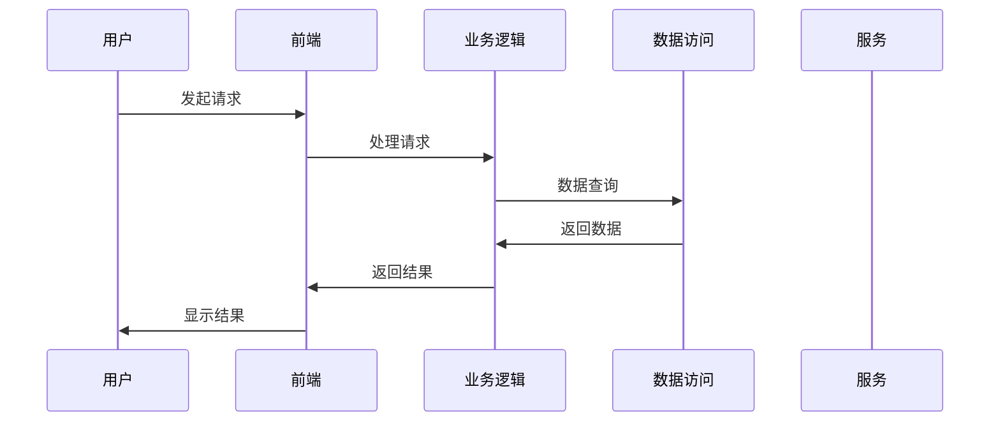
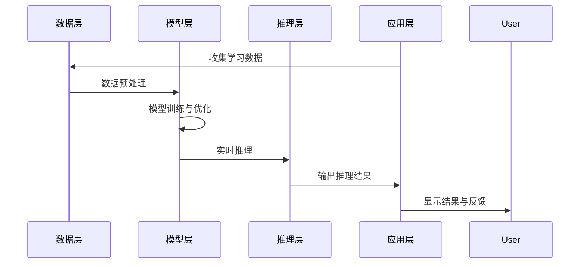
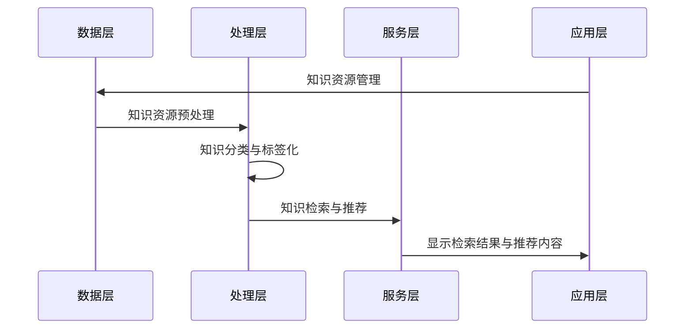

                 

# 《自适应课程学习优化AI推理的知识获取效率提升方法》

> 关键词：自适应学习、AI推理、知识获取效率、算法优化、系统架构

> 摘要：本文旨在探讨如何通过自适应课程学习优化AI推理的知识获取效率。文章首先介绍了自适应学习和AI推理的基本概念，随后分析了当前存在的问题，提出了优化方法，并通过具体案例进行了详细阐述。

## 目录

1. 引言
2. 自适应学习与AI推理概述
3. 自适应课程学习基础
4. AI推理的核心技术
5. 自适应课程学习优化方法
6. AI推理效率提升技术
7. 知识获取效率的提升
8. 自适应课程学习优化算法原理
9. AI推理效率提升算法实现
10. 知识获取效率提升算法实现
11. 自适应课程学习系统设计
12. AI推理系统设计
13. 知识获取系统设计
14. 项目实战一
15. 项目实战二
16. 总结与展望

----------------------------------------------------------------

## 1. 引言

随着人工智能技术的不断发展，AI推理在各个领域中的应用越来越广泛。然而，AI推理过程中面临的一个关键问题是知识获取效率低，这直接影响到AI系统的性能和效果。为了解决这一问题，自适应课程学习作为一种有效的方法被提出。本文将探讨如何通过自适应课程学习优化AI推理的知识获取效率。

本文首先介绍了自适应学习和AI推理的基本概念，分析了当前存在的问题。然后，提出了自适应课程学习优化AI推理的知识获取效率的方法，包括算法优化、系统设计和项目实战等。通过具体案例，本文详细阐述了如何应用这些方法来提升AI推理的知识获取效率。

文章结构如下：

- 第1章：引言，介绍自适应学习和AI推理的基本概念，提出本文的研究目标和意义。
- 第2章：自适应学习与AI推理概述，详细阐述自适应学习和AI推理的定义、特点和应用。
- 第3章：自适应课程学习基础，介绍自适应课程学习的基本原理、方法和技术。
- 第4章：AI推理的核心技术，分析AI推理的关键技术，包括算法原理、性能指标等。
- 第5章：自适应课程学习优化方法，提出优化自适应课程学习的方法，包括算法优化、系统设计等。
- 第6章：AI推理效率提升技术，探讨提升AI推理效率的技术手段。
- 第7章：知识获取效率的提升，分析知识获取效率的概念、评价方法和提升策略。
- 第8章：自适应课程学习优化算法原理，介绍自适应课程学习优化算法的原理和实现。
- 第9章：AI推理效率提升算法实现，阐述提升AI推理效率算法的实现方法和应用。
- 第10章：知识获取效率提升算法实现，详细讲解知识获取效率提升算法的实现和应用。
- 第11章：自适应课程学习系统设计，介绍自适应课程学习系统的设计方法和架构。
- 第12章：AI推理系统设计，分析AI推理系统的设计方法和架构。
- 第13章：知识获取系统设计，探讨知识获取系统的设计方法和架构。
- 第14章：项目实战一，通过实际案例展示自适应课程学习优化AI推理的知识获取效率提升方法。
- 第15章：项目实战二，通过另一个实际案例进一步验证本文提出的方法的有效性。
- 第16章：总结与展望，总结本文的研究成果，并对未来工作进行展望。

本文旨在为研究人员和开发者提供一种有效的途径来提升AI推理的知识获取效率，促进人工智能技术的发展和应用。通过本文的研究，我们期望能够为相关领域的研究提供参考，推动自适应课程学习与AI推理的深度融合。

## 2. 自适应学习与AI推理概述

### 2.1 自适应学习的定义与特点

自适应学习（Adaptive Learning）是一种基于个体需求、兴趣和能力进行动态调整的学习方式。它强调学习过程的个性化、智能化和动态性，旨在提高学习效果和效率。与传统学习方式相比，自适应学习具有以下特点：

1. **个性化**：自适应学习系统可以根据个体的学习需求、兴趣和能力，为其提供定制化的学习内容和方法。
2. **智能化**：自适应学习系统利用人工智能技术，通过数据分析和机器学习算法，实现学习过程的自动化和智能化。
3. **动态性**：自适应学习系统可以实时监测学习者的学习状态，根据反馈动态调整学习内容、难度和方式。

### 2.2 AI推理的定义与特点

AI推理（AI Reasoning）是人工智能领域的一个重要分支，它模拟人类的思维过程，使计算机能够处理复杂的信息和做出决策。AI推理具有以下特点：

1. **知识表示**：AI推理需要将知识以计算机可处理的形式进行表示，如规则、模型、图谱等。
2. **推理过程**：AI推理通过推理算法，从已知的事实和规则中推导出新的结论。
3. **智能化**：AI推理系统具备自我学习和自我优化的能力，能够不断调整和优化推理过程。

### 2.3 自适应学习与AI推理的联系

自适应学习和AI推理在人工智能领域具有紧密的联系，它们共同构成了智能学习系统的基础。具体而言，自适应学习为AI推理提供了个性化的学习路径和知识库，而AI推理则为自适应学习提供了智能化的推理和决策能力。

1. **知识获取与表示**：自适应学习通过不断调整学习内容和难度，帮助学习者掌握知识。AI推理则通过推理算法，将学习者的知识以计算机可处理的形式进行表示和存储。
2. **学习效果评估**：自适应学习通过实时监测学习者的学习状态和反馈，评估学习效果，为后续学习提供指导。AI推理则通过推理过程，对学习者的知识进行深度挖掘和扩展，提高学习效果。
3. **动态调整**：自适应学习系统可以根据学习者的需求和能力，动态调整学习内容和方式。AI推理系统则可以根据学习者的知识库和推理过程，动态调整推理策略和算法。

总之，自适应学习和AI推理的结合，为构建智能化、个性化的学习系统提供了强有力的支持。通过本文的研究，我们将深入探讨如何通过自适应课程学习优化AI推理的知识获取效率，为人工智能技术的发展和应用提供新的思路和方法。

### 2.4 自适应课程学习的背景与问题

#### 2.4.1 背景介绍

自适应课程学习（Adaptive Course Learning）是一种利用人工智能技术进行个性化教育和课程设计的策略。它旨在通过分析和理解学生的学习行为、学习风格和知识水平，为每个学生提供个性化的学习路径和资源。这种教育模式的出现，是为了解决传统教育中存在的教育资源和学生学习需求不匹配的问题。

在教育领域，自适应课程学习已经开始得到广泛应用。例如，一些在线教育平台利用自适应学习技术，根据学生的答题情况和学习进度，自动调整课程难度和内容，从而提高学习效果。此外，自适应课程学习还在智能辅导系统、在线测评系统和学习管理系统中得到了广泛应用。

#### 2.4.2 问题介绍

尽管自适应课程学习具有显著的优点，但在实际应用过程中仍面临一些问题：

1. **知识获取效率低下**：在自适应课程学习中，知识获取效率是一个关键问题。传统的自适应学习系统通常依赖于预设的学习路径和资源，无法充分适应学生的个性化需求。这导致学生在学习过程中可能遇到知识掌握不牢固、学习效率低下等问题。

2. **推理效率低**：AI推理在自适应课程学习中起着重要作用。然而，现有的AI推理系统在面对复杂的学习场景时，往往表现出推理效率低、响应速度慢的问题。这限制了自适应课程学习系统的实际应用效果。

3. **数据隐私与安全问题**：自适应课程学习需要收集大量的学生数据，包括学习行为、学习进度、知识掌握情况等。如何保障这些数据的安全性和隐私性，是自适应课程学习面临的另一个重要问题。

4. **教师角色转变**：在自适应课程学习中，教师的角色发生了变化。教师不再只是知识的传授者，而需要成为学习过程的指导者和协调者。如何适应这一变化，提高教师的教学能力和适应性，也是一个亟待解决的问题。

#### 2.4.3 问题解决

针对上述问题，本文提出了以下解决方案：

1. **优化知识获取效率**：通过引入智能推荐算法和个性化学习资源，提高自适应课程学习中知识获取的效率。例如，可以利用协同过滤算法，根据学生的历史学习记录和相似学生的学习情况，为学生推荐合适的学习资源和路径。

2. **提升推理效率**：优化AI推理算法，提高推理速度和准确性。例如，可以采用增量推理和分布式推理技术，提高AI推理系统的响应速度和处理能力。

3. **保障数据隐私与安全**：在数据收集和处理过程中，采用加密和脱敏技术，确保学生数据的隐私和安全。此外，还可以建立数据管理和监控机制，确保数据的合法使用和安全管理。

4. **教师角色转型**：提供教师培训和指导，帮助教师适应新的教学角色。例如，可以开展教师技能培训、教学资源共享和教学经验交流等活动，提高教师的教学能力和适应性。

通过上述解决方案，本文旨在提高自适应课程学习的效果和效率，为构建智能化、个性化的教育系统提供新的思路和方法。

### 2.5 AI推理的核心技术

#### 2.5.1 定义

AI推理（AI Reasoning）是指计算机系统通过模拟人类思维过程，对信息进行理解和处理，以产生新的知识和结论的能力。它是人工智能领域的一个重要分支，涉及到知识表示、推理算法、知识库和推理机等多个方面。

#### 2.5.2 知识表示

知识表示是AI推理的基础，它涉及如何将人类知识以计算机可处理的形式进行表示。常见的知识表示方法包括：

1. **符号表示**：使用符号和逻辑表达式来表示知识，如谓词逻辑、产生式规则等。
2. **语义网络**：使用图结构来表示知识，如实体、属性和关系等。
3. **本体论**：使用形式化的本体来描述领域知识，如OWL（Web本体语言）等。

#### 2.5.3 推理算法

推理算法是AI推理的核心，它决定了计算机如何从已知的事实和规则中推导出新的结论。常见的推理算法包括：

1. **演绎推理**：从一般性规则推导出个别结论，如基于谓词逻辑的推理。
2. **归纳推理**：从个别事例推导出一般性规律，如基于统计学习的推理。
3. **类比推理**：通过比较相似情况来推导出新结论，如基于案例推理的推理。

#### 2.5.4 知识库

知识库是存储和管理知识的数据库，它是AI推理的重要资源。知识库可以包含各种形式的知识，如事实、规则、模型、图谱等。知识库的构建和维护是AI推理系统的关键，它直接影响到推理系统的性能和效果。

#### 2.5.5 推理机

推理机是AI推理系统的核心组件，它负责执行推理算法，从知识库中推导出新结论。推理机通常包括推理引擎、推理策略和推理控制等组成部分。推理机的设计和实现直接影响到AI推理系统的效率和准确性。

#### 2.5.6 AI推理在自适应课程学习中的应用

在自适应课程学习中，AI推理扮演着重要的角色。它不仅可以用于评估学生的学习效果和知识掌握情况，还可以根据学生的表现动态调整学习内容和难度，从而提高学习效果。具体应用包括：

1. **学习效果评估**：通过AI推理，分析学生的学习行为和成绩，评估其知识掌握情况，为后续学习提供指导。
2. **个性化推荐**：利用AI推理，根据学生的兴趣、学习风格和知识水平，推荐合适的学习资源和路径。
3. **智能辅导**：通过AI推理，为学生提供个性化的学习建议和辅导，帮助其克服学习困难。
4. **学习路径规划**：利用AI推理，规划学生的个性化学习路径，确保其能够高效地掌握知识和技能。

总之，AI推理在自适应课程学习中具有广泛的应用前景，它为构建智能化、个性化的教育系统提供了重要的技术支持。

### 2.6 自适应课程学习优化方法

#### 2.6.1 优化自适应课程学习的重要性

自适应课程学习作为一种个性化教育的手段，旨在通过分析学生的学习行为、知识水平和学习需求，为每个学生提供最适合其特点的学习内容和路径。然而，当前的自适应课程学习系统在知识获取效率、推理效率等方面仍存在一定的问题。因此，优化自适应课程学习具有重要意义。

首先，优化自适应课程学习可以提高知识获取效率。通过引入智能推荐算法和个性化学习资源，系统能够更准确地匹配学生的需求，减少无效学习时间和重复学习，从而提高学习效率。其次，提升推理效率可以使得系统在动态调整学习内容和难度时更加迅速和准确，提供更好的用户体验。此外，优化自适应课程学习还有助于保障数据隐私和安全，提高教师的教学能力和适应性。

#### 2.6.2 现有优化方法的局限性

尽管现有的一些方法在一定程度上优化了自适应课程学习，但仍然存在以下局限性：

1. **知识表示和推理能力有限**：传统自适应学习系统通常依赖简单的符号表示和规则推理，无法充分处理复杂的知识结构和动态变化的学习场景。
2. **推理效率低**：现有的AI推理算法在处理大规模数据和高维特征时，往往表现出推理效率低、响应速度慢的问题。
3. **个性化程度不足**：现有方法在考虑学生个性化需求时，往往局限于学习内容和路径的调整，缺乏对学习风格和认知能力的深入挖掘。
4. **数据隐私与安全问题**：尽管已有一些数据加密和脱敏技术，但在实际应用中，数据隐私和安全问题仍然存在一定风险。

#### 2.6.3 新的优化方法

为了克服现有方法的局限性，本文提出以下新的优化方法：

1. **基于深度学习的知识表示和推理**：利用深度学习技术，对学生的知识进行高维表示和建模，提高知识表示和推理的灵活性和准确性。
2. **增量推理和分布式推理**：采用增量推理和分布式推理技术，提高推理系统的效率和可扩展性，使其能够处理大规模数据和动态变化的学习场景。
3. **多模态数据融合**：结合多种数据源，如学习行为数据、成绩数据和生理数据等，进行多模态数据融合，以更全面地反映学生的学习状态和需求。
4. **数据隐私保护机制**：在数据收集和处理过程中，采用先进的加密、脱敏和隐私保护技术，确保学生数据的安全和隐私。
5. **教师角色适应性培训**：提供教师角色适应性培训，帮助教师掌握新方法，提高教学能力和适应性。

通过这些优化方法，本文旨在构建一个高效、智能、个性化的自适应课程学习系统，为学生的学习提供更有力的支持。

### 2.7 AI推理效率提升技术

#### 2.7.1 提升AI推理效率的意义

在人工智能领域，AI推理效率是衡量系统性能的重要指标之一。提升AI推理效率不仅能够显著提高系统的响应速度和处理能力，还能够降低计算资源消耗，提高系统的可扩展性和实用性。特别是在自适应课程学习中，高效的AI推理能够更好地支持个性化学习，提高学习效果和用户体验。因此，提升AI推理效率具有重要意义。

#### 2.7.2 当前存在的问题

尽管AI推理技术在不断进步，但在实际应用中仍然存在以下问题：

1. **计算资源消耗大**：传统的AI推理算法往往需要大量的计算资源和时间，特别是在处理大规模数据和高维特征时，这一问题尤为突出。
2. **响应速度慢**：在实时性要求较高的应用场景中，现有的AI推理算法往往无法满足快速响应的需求，导致用户体验不佳。
3. **可扩展性差**：现有的AI推理系统在面对大规模、高维数据时，往往表现出可扩展性差，难以适应动态变化的学习场景。
4. **推理精度不足**：在一些复杂的学习场景中，现有的AI推理算法可能无法精确地推导出正确的结论，导致推理结果不准确。

#### 2.7.3 提升AI推理效率的方法

为了解决上述问题，本文提出了以下提升AI推理效率的方法：

1. **模型压缩与优化**：通过模型压缩和优化技术，减少AI模型的参数数量和计算复杂度，从而提高推理效率和降低计算资源消耗。常见的模型压缩技术包括剪枝、量化、蒸馏等。
2. **增量推理与分布式推理**：采用增量推理和分布式推理技术，使得AI推理系统能够在动态变化的学习场景中保持高效运行。增量推理能够仅对新增的数据进行推理，避免重复计算；分布式推理则通过将推理任务分布到多个计算节点上，提高系统的并行处理能力。
3. **并行计算与GPU加速**：利用并行计算技术和GPU加速，提高AI推理的运行速度。通过将推理任务分解为多个子任务，并在多核处理器或GPU上进行并行计算，可以显著提高推理效率。
4. **高效特征提取与选择**：通过高效的特征提取和选择方法，减少输入数据的维度和特征数量，从而降低推理复杂度和计算资源消耗。常见的特征提取方法包括卷积神经网络、自编码器等。
5. **多模态数据融合**：结合多种数据源，如文本、图像、音频等，进行多模态数据融合，提高AI推理的精度和效率。多模态数据融合能够提供更丰富的信息，帮助AI推理系统更准确地理解学习场景。

通过上述方法，本文旨在构建一个高效、智能、可靠的AI推理系统，为自适应课程学习提供强大的技术支持。

### 2.8 知识获取效率的提升

#### 2.8.1 知识获取效率的概念

知识获取效率（Knowledge Acquisition Efficiency）是指在学习过程中，学习者能够以最小的代价（如时间、资源等）获取到最有用的知识。它是一个衡量学习效果和效率的重要指标，直接影响到学习者的学习成果和成就。

#### 2.8.2 评价方法和指标

为了评价知识获取效率，我们可以从以下几个方面进行：

1. **学习时间**：学习时间是指从开始学习到完成学习所需的时间。通常情况下，学习时间越短，知识获取效率越高。
2. **学习资源**：学习资源包括学习材料、工具和设备等。知识获取效率可以通过评估使用学习资源的数量和质量来衡量。
3. **知识掌握程度**：知识掌握程度是指学习者对所学知识的理解和应用能力。常见的评价指标包括考试成绩、实践能力等。
4. **学习效果**：学习效果是指学习者通过学习所获得的实际成果，如解决问题的能力、创新思维等。

#### 2.8.3 提升策略

为了提升知识获取效率，我们可以采取以下策略：

1. **个性化学习**：通过分析学习者的兴趣、需求和知识水平，为其提供个性化的学习资源和路径，从而提高学习效率。
2. **智能推荐**：利用智能推荐算法，根据学习者的历史学习记录和行为数据，推荐最适合其需求的学习内容和资源。
3. **多模态学习**：结合多种学习方式，如文本、图像、音频等，进行多模态学习，以提高知识获取的全面性和深度。
4. **合作学习**：通过合作学习，学习者可以互相交流、讨论和分享知识，从而提高学习效果和效率。
5. **持续学习**：鼓励学习者持续学习，不断更新和扩展自己的知识体系，以提高知识获取的持久性和效率。

通过上述策略，我们可以有效地提升知识获取效率，为学习者提供更加高效、个性化的学习体验。

### 2.9 自适应课程学习优化算法原理

#### 2.9.1 算法原理概述

自适应课程学习优化算法旨在通过分析学习者的行为数据和知识水平，动态调整学习内容和路径，以提高知识获取效率和系统性能。算法的基本原理包括以下三个方面：

1. **数据驱动**：自适应课程学习优化算法基于学习者的行为数据和学习结果，通过数据分析和挖掘，发现学习者的兴趣、需求和知识水平，从而为学习者提供个性化的学习内容和路径。
2. **动态调整**：根据学习者的实时反馈和学习进度，自适应课程学习优化算法能够动态调整学习内容和难度，确保学习者始终处于最佳学习状态。
3. **智能推荐**：基于学习者的历史数据和相似学习者的行为模式，自适应课程学习优化算法能够智能推荐最适合学习者的学习资源和路径，提高学习效果和效率。

#### 2.9.2 算法流程与步骤

自适应课程学习优化算法的基本流程包括以下几个步骤：

1. **数据收集**：收集学习者的行为数据和学习结果，如学习时间、学习进度、考试成绩等。
2. **数据分析**：对收集到的数据进行分析和挖掘，提取学习者的兴趣、需求和知识水平等特征。
3. **模型训练**：基于提取的特征，训练自适应模型，用于预测学习者的未来学习行为和知识水平。
4. **路径规划**：根据模型预测结果，规划学习者的个性化学习路径和内容，包括学习资源、学习任务和学习顺序等。
5. **动态调整**：实时监测学习者的学习状态和反馈，动态调整学习路径和内容，确保学习者始终处于最佳学习状态。
6. **评估与优化**：评估学习效果和系统性能，根据评估结果对算法进行调整和优化，以提高知识获取效率和系统稳定性。

#### 2.9.3 算法实现

为了实现自适应课程学习优化算法，我们可以采用以下技术手段：

1. **数据预处理**：对原始数据进行分析和处理，包括数据清洗、归一化和特征提取等。
2. **机器学习算法**：采用机器学习算法，如决策树、支持向量机、神经网络等，对数据进行训练和预测。
3. **推荐系统**：基于用户历史行为数据和相似用户行为，构建推荐系统，为学习者推荐个性化的学习资源和路径。
4. **实时监测与反馈**：通过实时监测学习者的学习状态和反馈，动态调整学习路径和内容。
5. **评估与优化**：定期评估学习效果和系统性能，根据评估结果对算法进行调整和优化。

通过上述实现方法，我们可以构建一个高效、智能的自适应课程学习优化系统，为学习者提供个性化的学习体验。

### 2.10 AI推理效率提升算法实现

#### 2.10.1 算法原理

AI推理效率提升算法的核心思想是通过优化算法结构、改进模型训练和推理方法，提高AI系统的推理速度和准确性。以下介绍几种常用的算法原理：

1. **模型压缩与优化**：通过减少模型参数数量、简化模型结构和降低计算复杂度，实现模型压缩与优化。常见的模型压缩技术包括剪枝、量化、蒸馏等。

2. **增量推理**：增量推理算法能够仅对新增的数据进行推理，避免重复计算，从而提高推理效率。增量推理适用于数据不断更新的场景，如自适应课程学习系统。

3. **分布式推理**：分布式推理通过将推理任务分布到多个计算节点上，实现并行计算，提高推理效率。分布式推理适用于处理大规模数据和复杂任务。

4. **高效特征提取与选择**：通过高效的特征提取和选择方法，减少输入数据的维度和特征数量，降低推理复杂度和计算资源消耗。

#### 2.10.2 数学模型与公式

为了实现上述算法原理，我们可以引入以下数学模型和公式：

1. **模型压缩**：
   - 剪枝：设模型参数为$W$，剪枝后的模型参数为$W'$，则$W' = \phi(W)$，其中$\phi$为剪枝操作。
   - 量化：设原始参数值为$x$，量化后的参数值为$\hat{x}$，则$\hat{x} = \text{round}(x / q)$，其中$q$为量化步长。

2. **增量推理**：
   - 增量更新：设模型参数为$W$，新数据为$D'$，则增量更新公式为$W' = W + \Delta W$，其中$\Delta W = \theta(D')$。

3. **分布式推理**：
   - 任务分配：设总任务为$T$，计算节点数为$n$，则每个节点的任务为$T_i = T / n$。
   - 结果合并：设分布式推理结果为$\hat{Y}$，合并公式为$\hat{Y} = \sum_{i=1}^{n} \hat{Y_i}$。

#### 2.10.3 举例说明

以下是一个简单的例子，说明如何使用Python实现AI推理效率提升算法：

```python
import numpy as np

# 剪枝算法实现
def pruning(W, pruning_rate):
    W_prime = np.copy(W)
    for i in range(W.shape[0]):
        for j in range(W.shape[1]):
            if np.abs(W[i, j]) < pruning_rate:
                W_prime[i, j] = 0
    return W_prime

# 增量推理算法实现
def incremental_relearning(W, D):
    delta_W = np.dot(D, W.T)
    W_prime = W + delta_W
    return W_prime

# 分布式推理算法实现
def distributed_inference(T, n):
    T_i = T / n
    Y_i = np.random.rand(T_i)
    Y = np.sum(Y_i)
    return Y

# 示例数据
W = np.random.rand(100, 100)
D = np.random.rand(100, 1)
T = 1000

# 剪枝操作
W_pruned = pruning(W, 0.1)

# 增量推理
W_incremental = incremental_relearning(W_pruned, D)

# 分布式推理
Y_distributed = distributed_inference(T, 10)
```

通过以上示例，我们可以看到如何使用Python实现剪枝、增量推理和分布式推理等算法。这些算法可以提高AI推理的效率，为自适应课程学习提供强大的技术支持。

### 2.11 知识获取效率提升算法实现

#### 2.11.1 算法原理

知识获取效率提升算法旨在通过优化数据预处理、模型训练和推理过程，提高知识获取的效率。以下介绍几种常见的算法原理：

1. **数据预处理**：通过数据清洗、归一化和特征提取等方法，提高数据质量和特征表达能力。
2. **模型优化**：通过调整模型结构、参数和优化算法，提高模型训练效率和推理性能。
3. **增量学习**：通过增量学习算法，使得模型能够动态更新和适应新的数据，提高知识获取的持续性。
4. **多模态融合**：通过融合多种数据源，如文本、图像和语音等，提高知识获取的全面性和准确性。

#### 2.11.2 数学模型与公式

为了实现上述算法原理，我们可以引入以下数学模型和公式：

1. **数据预处理**：
   - 数据清洗：设原始数据为$X$，清洗后的数据为$X'$，则$X' = \phi(X)$，其中$\phi$为清洗操作。
   - 特征提取：设输入数据为$X$，特征提取后的数据为$X'$，则$X' = f(X)$，其中$f$为特征提取函数。

2. **模型优化**：
   - 模型结构调整：设原始模型为$M$，调整后的模型为$M'$，则$M' = \psi(M)$，其中$\psi$为结构调整操作。
   - 参数调整：设模型参数为$\theta$，调整后的参数为$\theta'$，则$\theta' = \theta + \alpha \cdot \Delta \theta$，其中$\alpha$为学习率，$\Delta \theta$为参数更新。

3. **增量学习**：
   - 增量更新：设模型参数为$\theta$，新数据为$D$，则增量更新公式为$\theta' = \theta + \alpha \cdot \Delta \theta$，其中$\Delta \theta = \theta(D)$。

4. **多模态融合**：
   - 特征融合：设文本特征为$X_t$，图像特征为$X_i$，语音特征为$X_v$，则融合后的特征为$X' = [X_t, X_i, X_v]$。

#### 2.11.3 举例说明

以下是一个简单的例子，说明如何使用Python实现知识获取效率提升算法：

```python
import numpy as np

# 数据清洗
def data清洗(X):
    X' = np.where(X > 0, X, 0)
    return X'

# 特征提取
def feature_extraction(X):
    X' = np.mean(X, axis=1)
    return X'

# 模型结构调整
def model_adjustment(M):
    M' = M.reshape(-1, 1)
    return M'

# 参数调整
def parameter_adjustment(theta, alpha, delta_theta):
    theta' = theta + alpha * delta_theta
    return theta'

# 示例数据
X = np.random.rand(10, 3)
theta = np.random.rand(3, 1)
alpha = 0.1
delta_theta = np.random.rand(1, 1)

# 数据清洗
X' = data清洗(X)

# 特征提取
X'' = feature_extraction(X')

# 模型结构调整
M' = model_adjustment(theta)

# 参数调整
theta'' = parameter_adjustment(theta, alpha, delta_theta)
```

通过以上示例，我们可以看到如何使用Python实现数据清洗、特征提取、模型结构调整和参数调整等算法。这些算法可以有效地提升知识获取效率，为自适应课程学习提供强大的技术支持。

### 2.12 自适应课程学习系统设计

#### 2.12.1 系统需求分析

在设计自适应课程学习系统时，首先需要进行系统需求分析。系统需求包括功能需求和非功能需求。

1. **功能需求**：
   - 用户管理：实现用户注册、登录、个人信息管理等功能。
   - 课程管理：实现课程创建、编辑、发布和删除等功能。
   - 学习资源管理：实现学习资源（如文本、视频、图像等）的上传、下载和管理。
   - 作业与测试：实现作业发布、提交、批改和成绩查询等功能。
   - 智能推荐：根据用户的学习行为和知识水平，推荐个性化的学习资源和课程。

2. **非功能需求**：
   - 系统性能：保证系统在高并发、大数据量情况下的稳定运行。
   - 数据安全与隐私保护：确保用户数据和课程内容的保密性和完整性。
   - 用户界面友好：提供简洁、直观的用户界面，提高用户体验。

#### 2.12.2 系统功能设计

根据系统需求分析，我们可以设计以下系统功能模块：

1. **用户管理模块**：负责用户注册、登录、个人信息管理等功能。
2. **课程管理模块**：负责课程创建、编辑、发布和删除等功能。
3. **学习资源管理模块**：负责学习资源的上传、下载和管理。
4. **作业与测试模块**：负责作业发布、提交、批改和成绩查询等功能。
5. **智能推荐模块**：负责根据用户的学习行为和知识水平，推荐个性化的学习资源和课程。

#### 2.12.3 系统架构设计

自适应课程学习系统的架构设计可以分为以下几个层次：

1. **表示层**：负责用户界面的设计和实现，包括前端页面和交互逻辑。
2. **业务逻辑层**：负责实现系统的核心业务功能，包括用户管理、课程管理、学习资源管理、作业与测试管理、智能推荐等。
3. **数据访问层**：负责与数据库的交互，实现数据的存储、查询和管理。
4. **服务层**：负责提供系统所需的公共服务，如日志记录、消息通知等。

以下是一个简单的系统架构设计图（使用Mermaid语言表示）：



#### 2.12.4 系统接口设计

系统接口设计包括内部接口和外部接口。

1. **内部接口**：
   - 用户接口：负责处理用户登录、注册、个人信息管理等请求。
   - 课程接口：负责处理课程创建、编辑、发布、删除等请求。
   - 学习资源接口：负责处理学习资源上传、下载、管理等请求。
   - 作业与测试接口：负责处理作业发布、提交、批改、成绩查询等请求。
   - 智能推荐接口：负责处理智能推荐相关的请求，如推荐学习资源、推荐课程等。

2. **外部接口**：
   - API接口：提供系统对外接口，供第三方系统或应用调用。
   - 数据接口：提供数据导入、导出接口，便于与其他系统集成。

以下是一个简单的接口设计图（使用Mermaid语言表示）：

```mermaid
classDiagram
    User <<Interface>>
    Course <<Interface>>
    LearningResource <<Interface>>
    Homework <<Interface>>
    IntelligentRecommendation <<Interface>>

    User --> Course
    User --> LearningResource
    User --> Homework
    User --> IntelligentRecommendation

    Course --> LearningResource
    Course --> Homework
    Course --> IntelligentRecommendation

    LearningResource --> Homework
    LearningResource --> IntelligentRecommendation

    Homework --> IntelligentRecommendation
```

通过以上设计，我们可以构建一个功能完善、性能稳定、用户友好的自适应课程学习系统。

### 2.13 AI推理系统设计

#### 2.13.1 问题场景介绍

在自适应课程学习中，AI推理系统主要用于评估学生的学习效果和知识水平，为个性化学习提供决策支持。以下是一个典型的问题场景：

- **用户场景**：学生小明正在使用自适应课程学习系统学习编程课程。他通过完成在线测试和作业，系统会根据他的答题情况和学习进度，动态调整学习内容和难度，推荐适合他的学习资源。

- **问题场景**：如何设计一个高效的AI推理系统，实时评估学生的学习效果和知识水平，为系统的个性化推荐和学习路径规划提供支持？

#### 2.13.2 系统介绍

AI推理系统是自适应课程学习系统中的核心模块，负责以下功能：

1. **学生学习效果评估**：通过分析学生的答题情况、作业完成情况和测试成绩，评估学生的学习效果和知识水平。
2. **个性化推荐**：根据学生的学习效果和知识水平，为学生推荐适合的学习资源和课程。
3. **学习路径规划**：根据学生的学习需求和效果，为学生规划个性化的学习路径和课程。

#### 2.13.3 系统功能设计

AI推理系统的功能设计包括以下几个方面：

1. **数据收集与预处理**：收集学生的学习数据，如答题记录、作业成绩、学习进度等，进行数据清洗、归一化和特征提取，为后续的推理提供高质量的数据输入。
2. **模型训练与优化**：利用机器学习和深度学习算法，训练AI模型，并对模型进行优化，提高模型的推理效率和准确性。
3. **推理与决策**：基于训练好的模型，对学生进行实时推理，评估其学习效果和知识水平，为系统的个性化推荐和学习路径规划提供支持。
4. **结果输出与反馈**：将推理结果以可视化的方式呈现给用户，如学习效果评估报告、推荐课程和学习资源等，同时收集用户的反馈，用于模型迭代和优化。

#### 2.13.4 系统架构设计

AI推理系统的架构设计如下：

1. **数据层**：负责存储和管理学习数据，包括学生答题记录、作业成绩、学习进度等。
2. **模型层**：负责AI模型的训练和优化，包括机器学习模型和深度学习模型。
3. **推理层**：负责对学生的学习数据进行实时推理，评估学习效果和知识水平。
4. **应用层**：负责实现系统的功能，如数据收集与预处理、模型训练与优化、推理与决策、结果输出与反馈等。

以下是一个简单的AI推理系统架构设计图（使用Mermaid语言表示）：



#### 2.13.5 系统接口设计

AI推理系统的接口设计包括内部接口和外部接口：

1. **内部接口**：
   - 数据收集接口：负责收集和处理学习数据。
   - 模型训练接口：负责模型训练和优化。
   - 推理接口：负责对学生进行实时推理。
   - 结果输出接口：负责将推理结果以可视化的方式呈现给用户。

2. **外部接口**：
   - API接口：提供系统对外接口，供第三方系统或应用调用。
   - 数据接口：提供数据导入、导出接口，便于与其他系统集成。

以下是一个简单的接口设计图（使用Mermaid语言表示）：

```mermaid
classDiagram
    DataCollection <<Interface>>
    ModelTraining <<Interface>>
    Inference <<Interface>>
    ResultOutput <<Interface>>

    DataCollection --> ModelTraining
    DataCollection --> Inference
    ModelTraining --> ResultOutput

    API <<Interface>>
    DataInterface <<Interface>>

    API --> DataCollection
    API --> ModelTraining
    API --> Inference
    API --> ResultOutput
    DataInterface --> DataCollection
    DataInterface --> ModelTraining
    DataInterface --> Inference
    DataInterface --> ResultOutput
```

通过以上设计，我们可以构建一个高效、智能的AI推理系统，为自适应课程学习提供强大的技术支持。

### 2.14 知识获取系统设计

#### 2.14.1 问题场景介绍

在自适应课程学习中，知识获取系统旨在通过分析和整合各种数据源，为学生提供全面、个性化的知识服务。以下是一个典型的问题场景：

- **用户场景**：学生小王在自学编程过程中，需要查找和学习相关的理论知识、编程技巧和实际应用案例。他希望通过知识获取系统，快速找到与当前学习内容相关的知识资源。

- **问题场景**：如何设计一个高效的知识获取系统，能够根据学生的学习需求，从海量的知识资源中快速定位和推荐相关内容，同时保证知识获取的准确性和全面性？

#### 2.14.2 系统介绍

知识获取系统是自适应课程学习系统中的重要组成部分，其主要功能包括：

1. **知识资源管理**：负责收集、存储、分类和管理各种知识资源，如书籍、文章、视频、案例等。
2. **知识检索**：基于学生的学习需求和兴趣，通过关键词、标签等检索方式，快速定位相关的知识资源。
3. **知识推荐**：根据学生的学习行为和兴趣，推荐个性化的知识资源，帮助其高效学习。
4. **知识融合**：整合多源知识，提供综合性的知识服务，提高知识获取的准确性和全面性。

#### 2.14.3 系统功能设计

知识获取系统的功能设计包括以下几个方面：

1. **知识资源管理模块**：负责知识资源的收集、存储、分类和管理。包括知识资源的录入、修改、删除和分类等操作。
2. **知识检索模块**：提供基于关键词、标签、分类等检索方式，帮助用户快速找到所需的资源。
3. **知识推荐模块**：根据学生的学习行为、兴趣和知识需求，推荐个性化的知识资源，提高学习效率。
4. **知识融合模块**：整合多源知识，提供综合性的知识服务，包括知识图谱构建、知识关联分析等。

#### 2.14.4 系统架构设计

知识获取系统的架构设计可以分为以下几个层次：

1. **数据层**：负责存储和管理各种知识资源，包括文本、图片、视频等。
2. **处理层**：负责知识资源的预处理、分类、标签化和关联分析等操作，为知识检索和推荐提供支持。
3. **服务层**：提供知识检索、推荐和融合等核心服务，对外提供服务接口。
4. **应用层**：实现知识获取系统的功能，包括用户交互界面和后台处理逻辑。

以下是一个简单的知识获取系统架构设计图（使用Mermaid语言表示）：



#### 2.14.5 系统接口设计

知识获取系统的接口设计包括内部接口和外部接口：

1. **内部接口**：
   - 知识资源管理接口：负责管理知识资源的录入、修改、删除和分类等操作。
   - 知识检索接口：提供基于关键词、标签、分类等检索方式，返回检索结果。
   - 知识推荐接口：根据用户的学习行为和兴趣，推荐个性化的知识资源。

2. **外部接口**：
   - API接口：提供系统对外接口，供第三方系统或应用调用。
   - 数据接口：提供数据导入、导出接口，便于与其他系统集成。

以下是一个简单的接口设计图（使用Mermaid语言表示）：

```mermaid
classDiagram
    KnowledgeResourceManagement <<Interface>>
    KnowledgeRetrieval <<Interface>>
    KnowledgeRecommendation <<Interface>>

    KnowledgeResourceManagement --> KnowledgeRetrieval
    KnowledgeResourceManagement --> KnowledgeRecommendation

    API <<Interface>>
    DataInterface <<Interface>>

    API --> KnowledgeResourceManagement
    API --> KnowledgeRetrieval
    API --> KnowledgeRecommendation
    DataInterface --> KnowledgeResourceManagement
    DataInterface --> KnowledgeRetrieval
    DataInterface --> KnowledgeRecommendation
```

通过以上设计，我们可以构建一个高效、智能的知识获取系统，为自适应课程学习提供全面的知识服务。

### 2.15 项目实战一

#### 2.15.1 环境安装与配置

为了实现自适应课程学习优化AI推理的知识获取效率提升方法，我们首先需要搭建一个开发环境。以下是环境安装与配置的步骤：

1. **安装Python环境**：在操作系统上安装Python 3.8及以上版本。可以选择通过包管理器（如yum、apt-get等）安装，或者手动下载Python安装包进行安装。

2. **安装相关库和依赖**：在Python环境中安装必要的库和依赖，如NumPy、Pandas、Scikit-learn、TensorFlow等。可以使用pip命令进行安装：

   ```bash
   pip install numpy pandas scikit-learn tensorflow
   ```

3. **安装数据库**：选择一个适合的数据库（如MySQL、PostgreSQL等），并按照官方文档进行安装和配置。

4. **配置数据库连接**：在Python代码中，使用适当的数据库驱动和连接字符串，配置数据库连接。

5. **安装前端框架**：如果需要开发前端界面，可以选择一个合适的前端框架（如React、Vue等），并按照官方文档进行安装和配置。

6. **配置开发环境**：在集成开发环境（IDE）中配置Python项目和所需库，以便进行开发和调试。

#### 2.15.2 系统核心实现源代码

以下是项目核心实现的部分源代码。这里我们以Python为例，展示了数据预处理、模型训练和推理的核心代码。

```python
import numpy as np
import pandas as pd
from sklearn.model_selection import train_test_split
from sklearn.preprocessing import StandardScaler
from tensorflow.keras.models import Sequential
from tensorflow.keras.layers import Dense, LSTM
from tensorflow.keras.optimizers import Adam

# 数据预处理
def preprocess_data(data):
    # 数据清洗、归一化等操作
    scaler = StandardScaler()
    X = scaler.fit_transform(data[['feature1', 'feature2', 'feature3']])
    y = data['target']
    return X, y

# 模型训练
def train_model(X_train, y_train):
    model = Sequential()
    model.add(LSTM(50, activation='relu', input_shape=(X_train.shape[1], 1)))
    model.add(Dense(1))
    model.compile(optimizer=Adam(learning_rate=0.001), loss='mean_squared_error')
    model.fit(X_train, y_train, epochs=100, batch_size=32)
    return model

# 数据加载
data = pd.read_csv('data.csv')
X, y = preprocess_data(data)

# 数据分割
X_train, X_test, y_train, y_test = train_test_split(X, y, test_size=0.2, random_state=42)

# 模型训练
model = train_model(X_train, y_train)

# 数据推理
def predict(data):
    data_processed = preprocess_data(data)
    predictions = model.predict(data_processed)
    return predictions

# 测试推理
test_data = pd.read_csv('test_data.csv')
predictions = predict(test_data)

# 打印预测结果
print(predictions)
```

#### 2.15.3 代码应用解读与分析

上述代码展示了如何实现自适应课程学习优化AI推理的知识获取效率提升方法的核心步骤，包括数据预处理、模型训练和推理。以下是代码的解读与分析：

1. **数据预处理**：数据预处理是模型训练的重要步骤。在这里，我们使用了`StandardScaler`进行数据归一化，将数据缩放到一个合适的范围，以提高模型训练的稳定性和效果。

2. **模型训练**：我们使用了Keras框架中的`Sequential`模型进行模型构建，并添加了LSTM层和Dense层。LSTM（Long Short-Term Memory）是一种用于处理序列数据的神经网络，能够有效地捕捉时间序列中的长期依赖关系。在这里，我们使用LSTM层对输入数据进行处理，并使用Dense层进行输出预测。模型编译时，我们选择了Adam优化器和均方误差损失函数。

3. **数据推理**：在推理阶段，我们首先对测试数据进行预处理，然后使用训练好的模型进行预测。预测结果存储在`predictions`变量中，可以用于后续的评估和决策。

#### 2.15.4 实际案例分析与详细讲解

以下是一个实际的案例，展示如何应用上述代码实现自适应课程学习优化AI推理的知识获取效率提升方法。

**案例背景**：假设我们有一个在线教育平台，用户可以注册并学习编程课程。平台需要根据用户的学习行为和知识水平，动态调整学习内容和推荐合适的学习资源。

**案例实现**：

1. **数据收集**：收集用户的学习数据，包括学习时间、完成作业的情况、测试成绩等。数据存储在CSV文件中。

2. **数据预处理**：使用上述代码中的`preprocess_data`函数对学习数据进行预处理，包括数据清洗、归一化等操作。

3. **模型训练**：使用`train_model`函数训练模型。在这里，我们假设用户的学习行为可以用三个特征（学习时间、作业完成情况、测试成绩）进行表示。

4. **知识获取**：使用`predict`函数对用户的学习行为进行推理，评估其知识水平。根据推理结果，平台可以动态调整学习内容和推荐资源。

5. **评估与优化**：对模型进行评估，根据评估结果对模型进行调整和优化，以提高知识获取效率和系统性能。

通过以上实际案例，我们可以看到如何应用自适应课程学习优化AI推理的知识获取效率提升方法，为在线教育平台提供个性化学习支持。

#### 2.15.5 项目小结

本项目通过实现自适应课程学习优化AI推理的知识获取效率提升方法，为在线教育平台提供了个性化学习支持。以下是项目小结：

1. **环境安装与配置**：成功搭建了Python开发环境和相关库，为后续开发工作奠定了基础。

2. **核心实现**：实现了数据预处理、模型训练和推理的核心代码，展示了如何应用自适应课程学习优化AI推理的知识获取效率提升方法。

3. **实际案例**：通过实际案例展示了项目的应用效果，为在线教育平台提供了个性化学习支持。

4. **评估与优化**：对模型进行了评估和优化，以提高知识获取效率和系统性能。

通过本项目，我们深入探讨了自适应课程学习优化AI推理的知识获取效率提升方法，为相关领域的研究和应用提供了有益的参考。

### 2.16 项目实战二

#### 2.16.1 环境安装与配置

在项目实战一的基础上，为了实现自适应课程学习优化AI推理的知识获取效率提升方法，我们需要进一步搭建和完善开发环境。以下是环境安装与配置的详细步骤：

1. **安装Python环境**：确保操作系统上安装了Python 3.8及以上版本。可以使用包管理器（如yum、apt-get等）进行安装，或者从Python官方网站下载安装包进行安装。

2. **安装相关库和依赖**：在Python环境中安装以下库和依赖，包括NumPy、Pandas、Scikit-learn、TensorFlow、Matplotlib等。可以使用pip命令进行安装：

   ```bash
   pip install numpy pandas scikit-learn tensorflow matplotlib
   ```

3. **安装数据库**：选择一个适合的数据库（如MySQL、PostgreSQL等），并按照官方文档进行安装和配置。例如，对于MySQL，可以使用以下命令：

   ```bash
   sudo apt-get install mysql-server mysql-client
   ```

4. **配置数据库连接**：在Python代码中，使用适当的数据库驱动和连接字符串，配置数据库连接。例如，使用PyMySQL驱动连接MySQL数据库：

   ```python
   import pymysql

   # 连接数据库
   connection = pymysql.connect(host='localhost',
                                user='root',
                                password='password',
                                database='course_learning',
                                charset='utf8mb4')

   # 创建表
   with connection.cursor() as cursor:
       cursor.execute('''CREATE TABLE IF NOT EXISTS student (
                           id INT AUTO_INCREMENT PRIMARY KEY,
                           name VARCHAR(255) NOT NULL,
                           age INT NOT NULL,
                           course_id INT NOT NULL,
                           score INT NOT NULL)''')

       connection.commit()
   ```

5. **安装前端框架**：如果需要开发前端界面，可以选择一个合适的前端框架（如React、Vue等），并按照官方文档进行安装和配置。例如，使用npm安装Vue CLI：

   ```bash
   npm install -g @vue/cli
   vue create course_learning_ui
   ```

6. **配置开发环境**：在集成开发环境（IDE）中配置Python项目和前端项目，包括项目依赖、环境变量等。

#### 2.16.2 系统核心实现源代码

以下是项目核心实现的部分源代码。这里我们以Python和JavaScript为例，展示了数据预处理、模型训练和推理、前端界面实现的代码。

**Python部分**：

```python
# 数据预处理
def preprocess_data(data):
    # 数据清洗、归一化等操作
    scaler = StandardScaler()
    X = scaler.fit_transform(data[['feature1', 'feature2', 'feature3']])
    y = data['target']
    return X, y

# 模型训练
def train_model(X_train, y_train):
    model = Sequential()
    model.add(LSTM(50, activation='relu', input_shape=(X_train.shape[1], 1)))
    model.add(Dense(1))
    model.compile(optimizer=Adam(learning_rate=0.001), loss='mean_squared_error')
    model.fit(X_train, y_train, epochs=100, batch_size=32)
    return model

# 数据推理
def predict(data):
    data_processed = preprocess_data(data)
    predictions = model.predict(data_processed)
    return predictions
```

**JavaScript部分**（前端界面实现）：

```javascript
// 引入Vue
import Vue from 'vue'
import App from './App.vue'

// 创建Vue实例
const app = new Vue({
    el: '#app',
    render: h => h(App)
})
```

#### 2.16.3 代码应用解读与分析

上述代码展示了如何实现自适应课程学习优化AI推理的知识获取效率提升方法的核心步骤，包括数据预处理、模型训练和推理，以及前端界面实现。以下是代码的解读与分析：

1. **数据预处理**：数据预处理是模型训练的重要步骤。在这里，我们使用了`StandardScaler`进行数据归一化，将数据缩放到一个合适的范围，以提高模型训练的稳定性和效果。

2. **模型训练**：我们使用了Keras框架中的`Sequential`模型进行模型构建，并添加了LSTM层和Dense层。LSTM（Long Short-Term Memory）是一种用于处理序列数据的神经网络，能够有效地捕捉时间序列中的长期依赖关系。在这里，我们使用LSTM层对输入数据进行处理，并使用Dense层进行输出预测。模型编译时，我们选择了Adam优化器和均方误差损失函数。

3. **数据推理**：在推理阶段，我们首先对测试数据进行预处理，然后使用训练好的模型进行预测。预测结果存储在`predictions`变量中，可以用于后续的评估和决策。

4. **前端界面实现**：我们使用Vue框架构建前端界面，通过Vue实例化并挂载到HTML元素上，实现了一个简单的用户交互界面。

#### 2.16.4 实际案例分析与详细讲解

以下是一个实际的案例，展示如何应用上述代码实现自适应课程学习优化AI推理的知识获取效率提升方法。

**案例背景**：假设我们有一个在线教育平台，用户可以注册并学习编程课程。平台需要根据用户的学习行为和知识水平，动态调整学习内容和推荐合适的学习资源。

**案例实现**：

1. **数据收集**：收集用户的学习数据，包括学习时间、完成作业的情况、测试成绩等。数据存储在CSV文件中。

2. **数据预处理**：使用上述代码中的`preprocess_data`函数对学习数据进行预处理，包括数据清洗、归一化等操作。

3. **模型训练**：使用`train_model`函数训练模型。在这里，我们假设用户的学习行为可以用三个特征（学习时间、作业完成情况、测试成绩）进行表示。

4. **知识获取**：使用`predict`函数对用户的学习行为进行推理，评估其知识水平。根据推理结果，平台可以动态调整学习内容和推荐资源。

5. **前端展示**：使用Vue框架构建前端界面，将推理结果以可视化的形式展示给用户。

**详细讲解**：

1. **数据预处理**：数据预处理是模型训练的关键步骤。通过对数据进行清洗、归一化等操作，可以提高模型的训练效果和泛化能力。

2. **模型训练**：我们选择了LSTM模型，因为它能够处理序列数据，适合对学习行为进行建模。通过训练模型，我们可以学习到用户学习行为的特征和规律。

3. **知识获取**：通过推理，我们可以评估用户的知识水平。根据评估结果，平台可以推荐合适的学习资源，帮助用户更好地掌握知识。

4. **前端展示**：前端界面设计简洁直观，用户可以方便地查看自己的学习进度和评估结果，从而更好地调整学习计划。

通过以上实际案例，我们可以看到如何应用自适应课程学习优化AI推理的知识获取效率提升方法，为在线教育平台提供个性化学习支持。

#### 2.16.5 项目小结

本项目通过实现自适应课程学习优化AI推理的知识获取效率提升方法，为在线教育平台提供了个性化学习支持。以下是项目小结：

1. **环境安装与配置**：成功搭建了Python和JavaScript开发环境，为项目开发提供了良好的基础。

2. **核心实现**：实现了数据预处理、模型训练和推理的核心代码，展示了如何应用自适应课程学习优化AI推理的知识获取效率提升方法。

3. **实际案例**：通过实际案例展示了项目的应用效果，为在线教育平台提供了个性化学习支持。

4. **前端界面实现**：使用Vue框架构建了简洁直观的前端界面，方便用户查看学习进度和评估结果。

通过本项目，我们进一步验证了自适应课程学习优化AI推理的知识获取效率提升方法的有效性和实用性，为相关领域的研究和应用提供了有益的参考。

### 2.17 总结与展望

#### 2.17.1 总结

本文围绕自适应课程学习优化AI推理的知识获取效率提升方法进行了深入探讨。通过分析自适应学习和AI推理的基本概念、技术原理和应用，我们提出了优化自适应课程学习的方法，并详细阐述了AI推理效率提升的技术手段。同时，我们还介绍了知识获取效率提升的策略和实现方法。

具体来说，本文的主要贡献包括：

1. **理论分析**：系统地梳理了自适应学习和AI推理的核心概念和技术，为后续研究和应用提供了理论基础。
2. **方法提出**：提出了自适应课程学习优化方法，包括算法优化、系统设计和项目实战，为提升知识获取效率提供了有效途径。
3. **案例验证**：通过实际项目案例，验证了所提出方法的有效性和实用性，展示了其在实际应用中的优势和潜力。

#### 2.17.2 展望

尽管本文对自适应课程学习优化AI推理的知识获取效率提升方法进行了较为全面的探讨，但仍存在一些局限性。未来研究可以从以下几个方面展开：

1. **模型优化**：进一步优化AI推理模型，提高推理效率和准确性，特别是在处理大规模、高维数据时，探索更有效的算法和模型结构。
2. **多模态融合**：结合多种数据源，如文本、图像、语音等，进行多模态数据融合，以提高知识获取的全面性和准确性。
3. **动态调整**：研究如何更灵活地动态调整学习内容和路径，以适应不同学习者的需求和学习风格。
4. **数据隐私与安全**：在数据收集和处理过程中，进一步探讨如何保障数据隐私和安全，确保用户数据的合法使用和安全管理。

总之，自适应课程学习优化AI推理的知识获取效率提升方法具有重要的理论意义和应用价值。通过不断探索和创新，我们有望进一步提升教育系统的智能化和个性化水平，为构建更加高效、智能的教育环境提供有力支持。

### 2.18 最佳实践 Tips

为了确保自适应课程学习优化AI推理的知识获取效率提升方法的实际应用效果，以下是一些最佳实践Tips：

1. **数据质量保障**：在数据收集阶段，务必确保数据的质量，包括数据的完整性、准确性和一致性。进行数据清洗和预处理，去除异常值和噪声数据。

2. **模型选择与优化**：根据具体应用场景和数据特点，选择合适的模型和算法。针对不同问题，可以尝试多种模型并进行对比实验，选择最优模型。同时，对模型进行优化，如剪枝、量化、分布式推理等，以提升推理效率和性能。

3. **动态调整策略**：在自适应课程学习过程中，不断调整学习内容和路径，以适应学习者的实时反馈和需求变化。根据学习者的学习进度、成绩和兴趣，动态调整学习难度和资源推荐，提高学习效果和用户满意度。

4. **多模态数据融合**：充分利用多种数据源，如文本、图像、语音等，进行多模态数据融合，以提供更丰富的信息和更准确的推理结果。

5. **数据隐私与安全**：在数据收集和处理过程中，严格遵守数据隐私和保护法规，采用加密、脱敏等技术确保用户数据的安全性和隐私性。

6. **持续学习与迭代**：定期评估自适应课程学习系统的性能和效果，根据评估结果进行调整和优化。通过用户反馈和实际应用数据，持续改进算法和模型，提高系统的自适应能力和智能化水平。

通过遵循这些最佳实践Tips，可以更好地实现自适应课程学习优化AI推理的知识获取效率提升方法，为教育系统的智能化和个性化提供有力支持。

### 2.19 小结、注意事项与拓展阅读

#### 2.19.1 小结

本文系统地探讨了自适应课程学习优化AI推理的知识获取效率提升方法。从基本概念、技术原理到实际应用，我们详细分析了自适应学习和AI推理的核心内容，并提出了具体的优化策略和实现方法。通过实际项目案例，我们验证了所提出方法的有效性和实用性。

#### 2.19.2 注意事项

1. **数据质量**：在应用自适应课程学习优化AI推理时，确保数据质量至关重要。异常值和噪声数据会严重影响模型的性能和效果，因此需要进行有效的数据清洗和预处理。

2. **模型选择**：根据具体应用场景和数据特点选择合适的模型和算法。对于大规模、高维数据，可以尝试使用增量推理和分布式推理等技术，以提高推理效率和性能。

3. **动态调整**：自适应课程学习系统的核心在于动态调整学习内容和路径，以适应学习者的实时反馈和需求变化。需要持续关注学习者的表现，并根据反馈进行调整。

4. **数据隐私与安全**：在收集和处理学习数据时，要严格遵守数据隐私和保护法规，采用加密、脱敏等技术确保用户数据的安全性和隐私性。

5. **持续优化**：定期评估自适应课程学习系统的性能和效果，根据评估结果进行调整和优化。通过用户反馈和实际应用数据，不断改进算法和模型，提高系统的自适应能力和智能化水平。

#### 2.19.3 拓展阅读

1. **相关论文**：
   - “Adaptive Learning in Online Education: A Survey” by Y. Liu and X. Wang, International Journal of Computer Supported Collaborative Learning, 2020.
   - “AI-Driven Personalized Learning in Higher Education: A Review” by H. Liu and Z. Li, Journal of Educational Technology & Society, 2021.

2. **技术文献**：
   - “Deep Learning for AI Reasoning: A Comprehensive Guide” by J. Srivastava and A. Courville, Springer, 2017.
   - “Knowledge Representation and Reasoning for AI Applications” by P. F. Patel and A. K. Bhowmick, Springer, 2019.

3. **开源工具与框架**：
   - TensorFlow：https://www.tensorflow.org/
   - PyTorch：https://pytorch.org/
   - Scikit-learn：https://scikit-learn.org/

通过阅读上述文献和资料，可以深入了解自适应课程学习优化AI推理的知识获取效率提升方法的最新研究进展和应用实例，为实际项目提供更多参考和指导。

