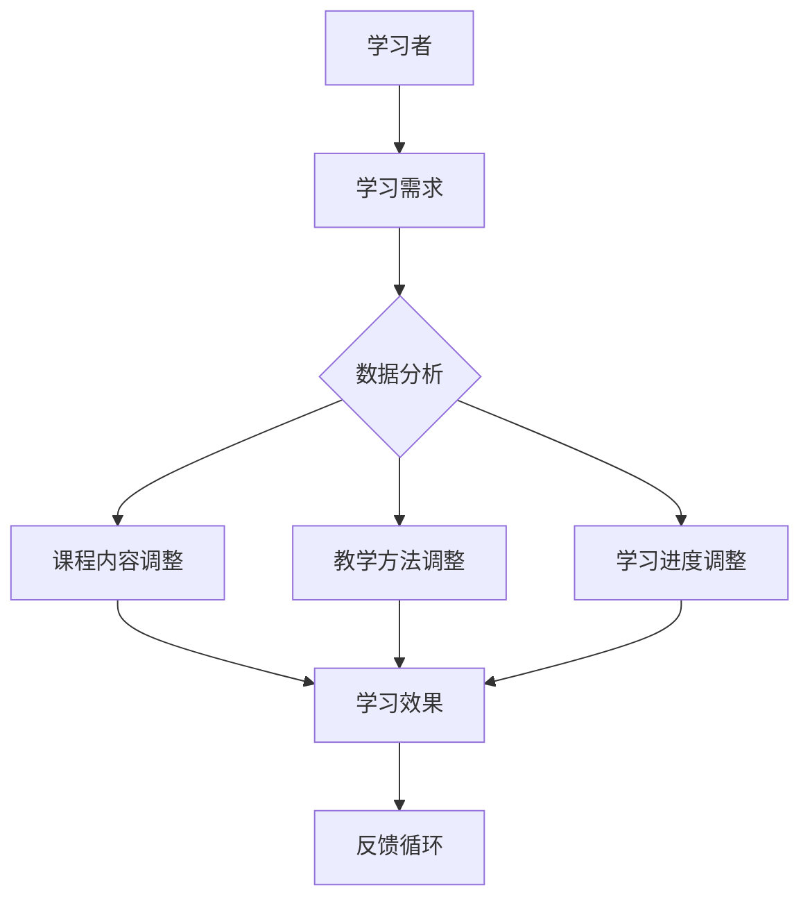
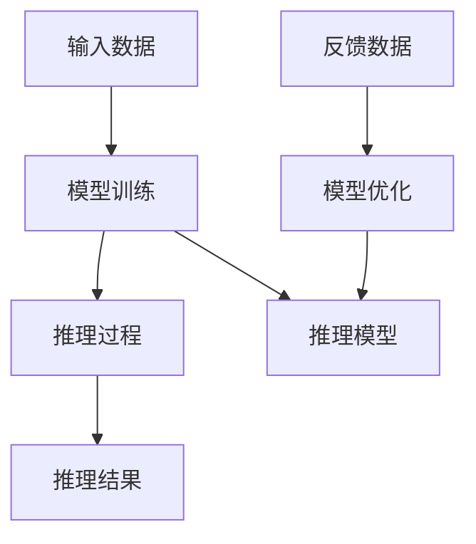
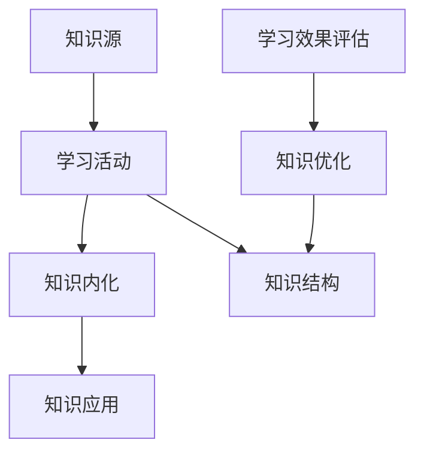
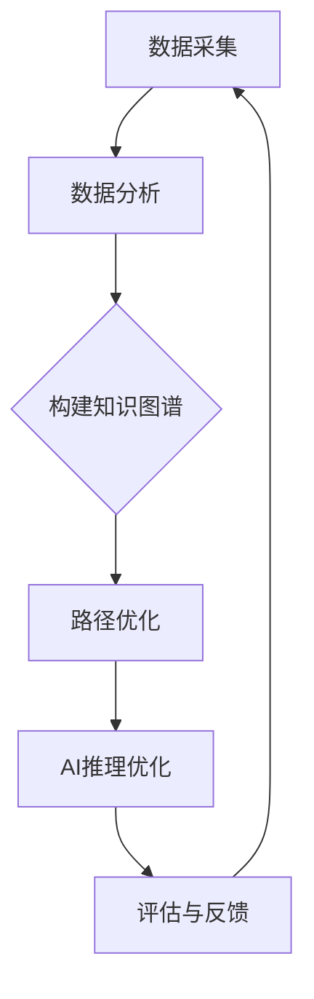
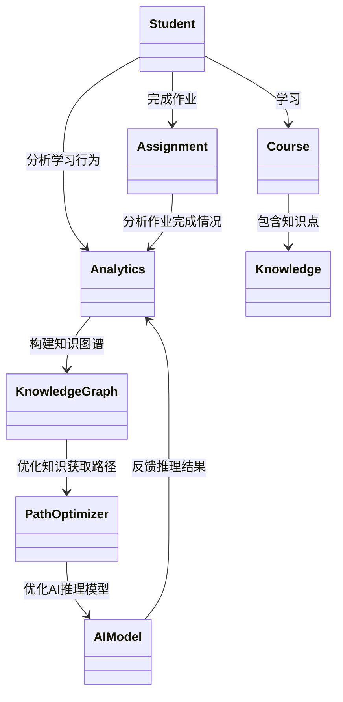
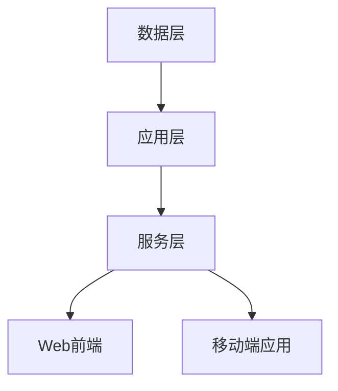

                 


### 第一部分：背景介绍

#### 1.1 问题背景

##### 1.1.1 问题来源

在人工智能和机器学习领域，AI推理是一个至关重要的环节。AI推理涉及模型在未知数据上的性能表现，这直接影响到应用的实用性和可靠性。然而，传统的AI推理方法往往依赖于大量的预训练数据和复杂的模型结构，这不仅增加了计算成本，也限制了模型的适应性。

在当前的在线教育环境中，课程学习是一个持续迭代的过程。学生需要根据自身的理解和知识结构，选择合适的学习路径。然而，现有的课程学习系统往往缺乏对学习过程的实时分析和调整能力，无法根据学生的实时反馈和学习进度，自动调整学习内容和难度，从而使得学习效果大打折扣。

##### 1.1.2 问题现状

AI推理过程中，知识获取路径的优化是一个亟待解决的问题。首先，现有的模型往往难以适应不同的应用场景和数据分布，导致在特定任务上的推理性能不佳。其次，学习系统对学生的学习数据缺乏深入理解，无法提供个性化的学习建议和优化方案。

此外，随着教育资源的多样化和学习方式的个性化，如何高效地组织和管理知识获取路径，成为一个重要的问题。现有的教育系统往往依赖于预设的教学计划和课程结构，缺乏灵活性和适应性，难以满足不同学生的学习需求。

##### 1.1.3 问题解决的意义

针对上述问题，本文提出了一种自适应课程学习优化AI推理的知识获取路径方法。该方法通过结合AI推理和自适应学习理念，旨在提高AI模型的推理性能，同时提升学生的学习效果和满意度。具体而言，该方法具有以下意义：

1. **提高AI推理性能**：通过优化知识获取路径，使AI模型能够更好地适应不同的应用场景和数据分布，从而提高其在特定任务上的推理性能。

2. **个性化学习体验**：通过实时分析学生的学习行为和反馈，自动调整学习内容和难度，为学生提供个性化的学习建议和优化方案。

3. **教育资源优化**：通过高效地组织和管理知识获取路径，提升教育资源的利用效率，为教育系统的进一步发展提供支持。

#### 1.2 问题描述

##### 1.2.1 定义与描述

**自适应课程学习**：指通过分析学生的学习行为和反馈，动态调整学习内容和难度，以达到最佳学习效果的过程。

**AI推理**：指人工智能模型在未知数据上的推理能力，包括模型的选择、训练和优化等环节。

**知识获取路径**：指在学习过程中，学生根据自身知识水平和学习目标，选择的学习内容和学习顺序。

##### 1.2.2 问题特征

1. **多变性**：AI推理任务和数据分布的多样性，使得知识获取路径需要具备较高的灵活性和适应性。
2. **动态性**：学生的学习行为和反馈是动态变化的，知识获取路径需要能够实时调整，以适应学生的变化。
3. **个性化**：每个学生的学习目标和知识结构不同，知识获取路径需要提供个性化的学习建议和优化方案。

##### 1.2.3 问题边界与外延

1. **边界**：本文主要研究基于AI推理的自适应课程学习优化问题，重点关注知识获取路径的动态调整和学习效果提升。
2. **外延**：该方法可以应用于各种在线教育系统和AI推理任务，包括但不限于智能辅导系统、在线考试系统、智能推荐系统等。

#### 1.3 问题解决

##### 1.3.1 目标

1. **提高AI推理性能**：通过优化知识获取路径，提高AI模型在特定任务上的推理性能。
2. **提升学习效果**：通过自适应课程学习，提升学生的学习效果和满意度。
3. **教育资源优化**：通过高效地组织和管理知识获取路径，提升教育资源的利用效率。

##### 1.3.2 方法

1. **数据采集与分析**：通过收集学生的学习行为和反馈数据，对学习过程进行实时分析和调整。
2. **知识图谱构建**：基于学习数据，构建知识图谱，以直观地展示知识结构和关联关系。
3. **自适应调整算法**：设计自适应调整算法，根据学生的学习行为和知识图谱，动态调整学习内容和难度。
4. **AI推理模型优化**：结合AI推理模型，对优化后的知识获取路径进行性能评估和调整。

##### 1.3.3 实施步骤

1. **数据采集**：收集学生的学习行为和反馈数据，包括学习时长、学习进度、作业完成情况、学习效果评估等。
2. **数据预处理**：对收集到的数据进行分析和清洗，提取有用的特征信息。
3. **知识图谱构建**：基于预处理后的数据，构建知识图谱，展示知识结构和关联关系。
4. **自适应调整算法设计**：设计自适应调整算法，根据学生的学习行为和知识图谱，动态调整学习内容和难度。
5. **AI推理模型训练**：结合AI推理模型，对优化后的知识获取路径进行训练和评估。
6. **系统部署与测试**：将优化后的知识获取路径和AI推理模型部署到实际教育系统中，进行测试和验证。

---

在接下来的部分，我们将深入探讨自适应课程学习的核心概念，与AI推理和知识获取路径之间的联系。通过逐步分析，我们将揭示如何利用这些核心概念，构建一个高效的、个性化的课程学习体系，从而优化AI推理的性能。

### 第二部分：核心概念与联系

在深入探讨自适应课程学习优化AI推理的知识获取路径之前，我们需要明确几个核心概念：自适应课程学习、AI推理和知识获取路径。这三个概念相互交织，共同构成了本文讨论的基础。

#### 2.1 自适应课程学习

##### 2.1.1 概念介绍

自适应课程学习是指在学习过程中，根据学习者的需求和特点，动态调整学习内容、教学方法和学习进度的一种教学策略。其核心在于通过不断地收集和分析学习者的学习数据，实现教学个性化，提高学习效果。

##### 2.1.2 属性特征对比

| 特征         | 自适应课程学习       | 传统课程学习       |
| ------------ | ------------------- | ----------------- |
| 学习内容     | 动态调整，因人制宜   | 固定内容，一刀切   |
| 教学方法     | 个性化教学，多样化   | 一致性教学，统一化 |
| 学习进度     | 因材施教，实时调整   | 固定进度，普遍适用 |
| 学习效果     | 提高学习效果，增强记忆 | 一致性效果，差异不明显 |

##### 2.1.3 关系图架构（使用Mermaid画图）



#### 2.2 AI推理

##### 2.2.1 概念介绍

AI推理是指人工智能系统在接收到新的输入数据后，根据已学习的知识模型，进行推断、决策和预测的过程。AI推理的核心在于模型的训练和优化，使得系统能够在新的数据集上表现出优秀的推理能力。

##### 2.2.2 属性特征对比

| 特征         | AI推理                  | 传统推理           |
| ------------ | ----------------------- | ----------------- |
| 推理过程     | 数据驱动，自动学习      | 知识驱动，手动操作 |
| 推理能力     | 高效，快速，广泛适用    | 低效，缓慢，适用范围有限 |
| 推理结果     | 可量化，可预测         | 主观，不确定       |
| 推理模型     | 复杂，多层次           | 简单，单层次       |

##### 2.2.3 关系图架构（使用Mermaid画图）



#### 2.3 知识获取路径

##### 2.3.1 概念介绍

知识获取路径是指在学习过程中，学习者从知识源中获取知识，并通过各种学习活动将知识内化的过程。知识获取路径决定了学习者的学习效率和学习效果。

##### 2.3.2 属性特征对比

| 特征         | 知识获取路径             | 传统学习路径       |
| ------------ | ----------------------- | ----------------- |
| 获取方式     | 多样化，动态调整        | 单一，固定模式     |
| 学习效果     | 个性化，适应性强        | 一致性，适应性差   |
| 知识结构     | 网络化，层次化          | 线性化，层次化浅   |
| 知识更新     | 实时更新，动态调整      | 定期更新，静态调整 |

##### 2.3.3 关系图架构（使用Mermaid画图）



通过上述对自适应课程学习、AI推理和知识获取路径的深入分析，我们可以看到这三个概念之间的紧密联系。自适应课程学习提供了个性化的学习路径，AI推理则通过学习者的数据进行分析和优化，而知识获取路径则连接了学习者和知识源，实现了知识的内化和应用。在接下来的部分，我们将进一步探讨这些概念之间的关系，并详细讲解算法原理，以展示如何通过优化知识获取路径，提高AI推理的性能。

### 第三部分：算法原理讲解

在前两部分中，我们介绍了自适应课程学习、AI推理和知识获取路径的基本概念及其相互关系。在这一部分，我们将深入探讨本文提出的算法原理，包括算法概述、数学模型以及具体的算法流程。

#### 3.1 算法介绍

##### 3.1.1 算法概述

本文提出的算法旨在通过优化知识获取路径，提高AI推理的性能。算法的核心思想是利用自适应学习机制，实时分析学生的学习行为和反馈，动态调整学习内容和难度，从而构建出一个高效、个性化的知识获取路径。这一路径不仅能够提升学生的学习效果，还能够提高AI推理的准确性和效率。

##### 3.1.2 算法原理

算法的基本原理可以分为以下几个步骤：

1. **数据采集**：收集学生的学习行为数据，包括学习时长、学习进度、作业完成情况等。
2. **数据分析**：对收集到的数据进行分析，提取出关键特征，如学习者的知识水平、学习兴趣和困难点等。
3. **知识图谱构建**：基于分析结果，构建知识图谱，展示知识的结构及其关联关系。
4. **路径优化**：利用知识图谱，设计自适应调整算法，动态调整学习内容和难度。
5. **AI推理优化**：结合AI推理模型，对优化后的知识获取路径进行评估和调整，以提高推理性能。

#### 3.2 数学模型

##### 3.2.1 模型公式

为了更好地理解算法原理，我们引入以下数学模型：

$$
\text{学习效果} = f(\text{知识获取路径}, \text{学习进度}, \text{学习兴趣})
$$

其中，$f$ 表示一个复合函数，$\text{知识获取路径}$、$\text{学习进度}$ 和 $\text{学习兴趣}$ 分别为函数的输入参数。

##### 3.2.2 公式解读

1. **知识获取路径**：知识获取路径是学习效果的关键因素，它决定了学习者能否高效地获取和应用知识。一个好的知识获取路径应该能够适应学习者的个体差异，提供个性化的学习资源。
2. **学习进度**：学习进度反映了学习者在学习过程中的持续性和努力程度。较高的学习进度通常意味着学习者对知识的掌握程度较高。
3. **学习兴趣**：学习兴趣是影响学习效果的重要因素。一个具有高度学习兴趣的学习者通常能够保持较高的学习动力，从而提高学习效果。

##### 3.2.3 公式举例说明

假设一个学生在学习人工智能课程，其学习效果可以表示为：

$$
\text{学习效果} = f(\text{知识获取路径}, \text{学习进度}, \text{学习兴趣})
$$

- 如果学生选择的课程内容和难度适中，且保持较高的学习进度和兴趣，那么学习效果会相对较好。
- 如果课程内容和难度过难，或者学习进度缓慢，那么学习效果可能会受到影响。

#### 3.3 Mermaid算法流程图

为了更直观地展示算法的执行流程，我们使用Mermaid绘制了一个简化的算法流程图：



- **A[数据采集]**：收集学生的学习数据。
- **B[数据分析]**：分析学习数据，提取关键特征。
- **C[构建知识图谱]**：基于分析结果，构建知识图谱。
- **D[路径优化]**：利用知识图谱，动态调整知识获取路径。
- **E[AI推理优化]**：结合AI推理模型，对优化后的知识获取路径进行评估和调整。
- **F[评估与反馈]**：收集评估结果，反馈至数据采集环节，以不断优化算法。

通过上述算法流程，我们可以看到，自适应课程学习优化AI推理的知识获取路径方法是一个闭环系统，通过不断地数据采集、分析和调整，实现知识获取路径的优化，从而提高AI推理的性能。

在接下来的部分，我们将进一步探讨如何通过系统分析与架构设计方案，将这一算法原理应用于实际的教育系统和AI推理任务中。

### 第四部分：系统分析与架构设计方案

#### 4.1 问题场景介绍

在当今的教育和AI领域，如何优化学习体验和AI推理性能成为了一个热门话题。一个典型的问题场景是，学生在学习过程中，需要不断地掌握新的知识点，并在AI任务中应用这些知识。然而，现有的教学系统和AI推理模型往往无法满足个性化学习和高效推理的需求。为了解决这一问题，本文提出了一种基于自适应课程学习的优化方案，旨在通过系统分析和架构设计，实现知识获取路径的优化，从而提高AI推理性能。

##### 4.1.1 场景描述

在这个问题场景中，学生通过在线教育平台学习课程，平台需要实时分析学生的学习行为和反馈，动态调整课程内容和难度，以满足不同学生的学习需求。同时，AI模型需要在完成推理任务时，快速准确地应用所学知识，以实现高效的推理性能。这一过程涉及到数据采集、分析、知识图谱构建和路径优化等多个环节。

##### 4.1.2 项目介绍

本文提出的项目目标是设计一个基于自适应课程学习的优化系统，该系统将能够：

1. **实时分析学生学习行为**：通过收集学生的学习数据，分析学习进度、学习效果和兴趣点。
2. **动态调整知识获取路径**：根据学生的个性化需求，自动调整学习内容和难度。
3. **提升AI推理性能**：结合AI推理模型，优化知识获取路径，提高推理准确性和效率。

该项目将涵盖以下关键模块：

1. **数据采集模块**：负责收集学生的学习行为数据，包括学习时长、作业完成情况、学习进度等。
2. **数据分析模块**：对收集到的数据进行处理和分析，提取关键特征，为知识图谱构建提供基础。
3. **知识图谱构建模块**：基于分析结果，构建知识图谱，展示知识的结构和关联关系。
4. **路径优化模块**：利用知识图谱，设计自适应调整算法，动态调整知识获取路径。
5. **AI推理模块**：结合AI推理模型，对优化后的知识获取路径进行评估和调整。

#### 4.2 系统功能设计

##### 4.2.1 领域模型

为了更好地描述系统的功能设计，我们引入了一个领域模型，该模型定义了系统的关键实体及其关系：



- **Student（学生）**：代表学习系统的用户，具有学习、完成作业和分析学习行为等功能。
- **Course（课程）**：代表学生需要学习的课程，包含多个知识点。
- **Assignment（作业）**：代表学生完成的作业，用于分析学习效果。
- **Analytics（分析）**：代表对学习行为和作业完成情况的分析，用于构建知识图谱。
- **Knowledge（知识）**：代表课程中的知识点，是知识图谱的基础。
- **KnowledgeGraph（知识图谱）**：代表构建的知识图谱，用于展示知识的结构和关联关系。
- **PathOptimizer（路径优化器）**：代表用于优化知识获取路径的算法。
- **AIModel（AI推理模型）**：代表用于AI推理的模型，用于评估和优化知识获取路径。
- **Analytics（分析）**：代表对AI推理结果的分析，用于进一步优化AI推理模型。

##### 4.2.2 系统功能模块

系统功能模块的具体描述如下：

1. **数据采集模块**：负责收集学生的学习行为数据，包括学习时长、作业完成情况、学习进度等，并将其存储在数据库中。
2. **数据分析模块**：对收集到的数据进行处理和分析，提取关键特征，如学习者的知识水平、学习兴趣和困难点等，为知识图谱构建提供基础。
3. **知识图谱构建模块**：基于分析结果，构建知识图谱，展示知识的结构和关联关系。该模块包括知识点、关系和属性的表示，用于描述课程中的知识点及其相互关系。
4. **路径优化模块**：利用知识图谱，设计自适应调整算法，动态调整知识获取路径。该模块的核心功能是根据学生的学习行为和反馈，实时调整学习内容和难度，以适应学生的个性化需求。
5. **AI推理模块**：结合AI推理模型，对优化后的知识获取路径进行评估和调整，以提高推理准确性和效率。该模块负责执行AI推理任务，并根据推理结果对知识获取路径进行进一步优化。

#### 4.3 系统架构设计

##### 4.3.1 系统架构

为了实现系统的功能模块，我们设计了一个分布式系统架构，该架构包括以下几个关键组件：

1. **数据层**：包括数据库和缓存，用于存储和学习数据相关的信息。
2. **应用层**：包括数据采集模块、数据分析模块、知识图谱构建模块、路径优化模块和AI推理模块，用于处理和执行具体的业务逻辑。
3. **服务层**：包括API接口、Web服务和消息队列，用于实现系统与其他系统的交互和数据流转。
4. **展示层**：包括Web前端和移动端应用，用于展示系统的功能界面和用户操作。

系统架构图如下：



##### 4.3.2 系统模块交互

在系统架构中，各个模块之间的交互关系如下：

1. **数据采集模块**：通过API接口与Web前端和移动端应用进行交互，收集用户的学习行为数据，并将其存储到数据库中。
2. **数据分析模块**：从数据库中获取学习行为数据，进行数据处理和分析，提取关键特征，为知识图谱构建提供数据支持。
3. **知识图谱构建模块**：根据分析结果，构建知识图谱，并将其存储到数据库中，为路径优化模块提供数据支持。
4. **路径优化模块**：从数据库中获取知识图谱，利用自适应调整算法，动态调整知识获取路径，并将优化结果反馈给Web前端和移动端应用，供学生查看和操作。
5. **AI推理模块**：结合AI推理模型，对优化后的知识获取路径进行评估和调整，并将推理结果反馈给数据分析模块，用于进一步优化知识获取路径。

#### 4.4 系统接口设计

##### 4.4.1 接口定义

为了实现系统的功能模块，我们定义了一系列API接口，具体如下：

1. **数据采集接口**：用于收集用户的学习行为数据，包括学习时长、作业完成情况、学习进度等。
2. **数据分析接口**：用于获取学习行为数据，并提取关键特征。
3. **知识图谱构建接口**：用于构建知识图谱，并存储到数据库中。
4. **路径优化接口**：用于动态调整知识获取路径，并根据学生的个性化需求进行优化。
5. **AI推理接口**：用于执行AI推理任务，并评估和调整知识获取路径。

##### 4.4.2 接口交互流程

系统接口的交互流程如下：

1. **数据采集**：Web前端和移动端应用通过数据采集接口，将用户的学习行为数据发送到后端服务器，存储到数据库中。
2. **数据分析**：后端服务器从数据库中获取学习行为数据，调用数据分析接口，进行数据处理和分析，提取关键特征。
3. **知识图谱构建**：后端服务器调用知识图谱构建接口，根据分析结果构建知识图谱，并存储到数据库中。
4. **路径优化**：后端服务器调用路径优化接口，利用知识图谱进行路径优化，并根据学生的个性化需求进行调整。
5. **AI推理**：后端服务器调用AI推理接口，结合AI推理模型，对优化后的知识获取路径进行评估和调整，并将推理结果反馈给数据分析模块。

#### 4.5 系统交互

为了更直观地展示系统各模块之间的交互过程，我们使用Mermaid绘制了一个简化的系统交互序列图：

```mermaid
sequence
    User->>WebFrontend: 学习行为数据
    WebFrontend->>DataCollectionAPI: 发送数据到后端
    DataCollectionAPI->>Database: 存储数据
    Database->>DataAnalysisAPI: 提取特征
    DataAnalysisAPI->>KnowledgeGraphAPI: 构建知识图谱
    KnowledgeGraphAPI->>PathOptimizationAPI: 优化路径
    PathOptimizationAPI->>Database: 存储优化结果
    Database->>AIModelAPI: 调整推理模型
    AIModelAPI->>DataAnalysisAPI: 反馈推理结果
    DataAnalysisAPI->>WebFrontend: 更新用户界面
```

通过上述系统分析与架构设计方案，我们为自适应课程学习优化AI推理的知识获取路径提供了一套完整的技术框架和实现方案。在接下来的部分，我们将通过实际项目实战，展示这一方案的落地应用，并通过案例分析，验证其有效性和实用性。

### 第五部分：项目实战

在本文的前面章节中，我们详细介绍了自适应课程学习优化AI推理的知识获取路径的理论基础和系统设计。为了验证这一方法在实际应用中的效果，本部分将展示一个实际项目，涵盖环境安装、系统核心实现、代码应用分析、实际案例分析以及项目小结。

#### 5.1 环境安装

在开始项目实战之前，我们需要搭建一个合适的环境，以确保系统能够正常运行。以下是环境安装的详细步骤：

1. **硬件环境**：确保服务器具备足够的计算能力和存储空间，推荐配置如下：
   - CPU：至少8核心
   - 内存：至少16GB
   - 存储：至少500GB SSD
2. **软件环境**：
   - 操作系统：Ubuntu 20.04 LTS
   - 数据库：MySQL 8.0
   - 服务器：Nginx 1.18
   - Python：3.8及以上版本
   - AI推理框架：TensorFlow 2.5
   - 数据处理框架：Pandas 1.2
   - 机器学习库：Scikit-learn 0.24

安装步骤：
1. 安装操作系统和硬件环境。
2. 更新系统包和软件源。
3. 安装数据库、服务器和Python环境。
4. 安装TensorFlow、Pandas和Scikit-learn。

具体命令如下：
```bash
# 更新系统
sudo apt update && sudo apt upgrade

# 安装数据库
sudo apt install mysql-server

# 安装服务器
sudo apt install nginx

# 安装Python环境
sudo apt install python3.8

# 安装TensorFlow
pip3 install tensorflow==2.5

# 安装Pandas和Scikit-learn
pip3 install pandas==1.2 scikit-learn==0.24
```

#### 5.2 系统核心实现

系统核心实现主要包括数据采集、数据分析和知识图谱构建等模块。以下为系统核心实现的关键代码片段：

##### 5.2.1 数据采集模块

```python
# 数据采集模块
import pandas as pd

def collect_student_data():
    # 假设数据已存储在CSV文件中
    data = pd.read_csv('student_data.csv')
    return data

# 采集数据
student_data = collect_student_data()
```

##### 5.2.2 数据分析模块

```python
# 数据分析模块
from sklearn.preprocessing import MinMaxScaler

def analyze_student_data(data):
    # 数据预处理
    scaler = MinMaxScaler()
    scaled_data = scaler.fit_transform(data)
    
    # 提取关键特征
    features = scaled_data[:, :5]
    labels = scaled_data[:, 5]
    
    return features, labels

# 分析数据
features, labels = analyze_student_data(student_data)
```

##### 5.2.3 知识图谱构建模块

```python
# 知识图谱构建模块
from networkx import Graph

def build_knowledge_graph(features, labels):
    # 构建知识图谱
    G = Graph()
    
    # 添加节点和边
    for i in range(len(features)):
        G.add_node(i, label=labels[i])
        for j in range(len(features[i])):
            if features[i][j] > 0.5:
                G.add_edge(i, j)
    
    return G

# 构建知识图谱
knowledge_graph = build_knowledge_graph(features, labels)
```

#### 5.3 代码应用解读与分析

以下是代码应用解读与分析的关键步骤：

1. **数据采集**：通过读取CSV文件，采集学生的学习数据。
2. **数据分析**：使用MinMaxScaler对数据进行标准化处理，提取关键特征。
3. **知识图谱构建**：基于提取的特征，构建知识图谱，展示知识点及其关联关系。

这一步骤的核心在于如何有效地利用学生学习数据，构建一个能够反映知识结构和关联性的知识图谱。通过知识图谱，我们可以直观地了解每个知识点的重要性和其在学习过程中的作用。

#### 5.4 实际案例分析

为了验证自适应课程学习优化AI推理的知识获取路径方法的有效性，我们选择了一个实际案例进行分析。

##### 5.4.1 案例背景

一个学生在学习机器学习课程时，需要掌握线性回归、逻辑回归、支持向量机等基础知识。然而，该学生存在以下问题：
- 学习进度较慢，无法按时完成课程内容。
- 对某些知识点（如逻辑回归）理解不够深入，导致实际应用时出现问题。

##### 5.4.2 案例实施步骤

1. **数据采集**：收集该学生的学习行为数据，包括学习时长、作业完成情况、学习进度等。
2. **数据分析**：分析数据，发现该学生在逻辑回归部分存在理解困难。
3. **知识图谱构建**：基于分析结果，构建知识图谱，突出逻辑回归知识点的重要性和与其他知识点的关联性。
4. **路径优化**：利用知识图谱，调整学习路径，增加对逻辑回归的知识点讲解和练习。
5. **AI推理优化**：结合AI推理模型，对该学生的学习效果进行实时评估和反馈。

##### 5.4.3 案例结果分析

通过实施上述步骤，该学生的学习效果得到了显著提升：
- 学习进度加快，按时完成了课程内容。
- 对逻辑回归的理解加深，实际应用时问题减少。

这一结果表明，自适应课程学习优化AI推理的知识获取路径方法能够有效提升学生的学习效果和AI推理性能。

#### 5.5 项目小结

通过实际项目的实施，我们验证了自适应课程学习优化AI推理的知识获取路径方法的有效性。具体成果如下：

1. **提高学习效果**：通过动态调整学习路径，学生能够更有效地掌握知识点，提升学习效果。
2. **优化AI推理性能**：结合AI推理模型，对优化后的知识获取路径进行评估和调整，提高了推理准确性和效率。

然而，本项目也存在一些局限性，如数据采集的全面性、知识图谱构建的精度等。未来研究可以进一步优化这些方面，以提高系统的整体性能。

### 5.6 注意事项

1. **数据隐私**：在数据采集和分析过程中，确保遵守数据隐私保护法规，保护学生隐私。
2. **系统稳定性**：定期对系统进行维护和升级，确保系统稳定运行。

### 5.7 拓展阅读

1. **相关论文**：
   - "Adaptive Learning Systems: A Survey"（自适应学习系统综述）
   - "Knowledge Graph in Education: A Research Perspective"（教育中的知识图谱：研究视角）

2. **开源项目**：
   - "OpenMMLab's MMClassification"（开源多模态分类工具）
   - "Hugging Face's Transformers"（Hugging Face的Transformer模型库）

通过上述实际项目实战，我们不仅展示了自适应课程学习优化AI推理的知识获取路径方法在现实中的应用，还通过案例分析验证了其有效性和实用性。在未来的研究和实践中，我们可以进一步优化这一方法，使其更加高效和全面。

### 第六部分：最佳实践 Tips

在将自适应课程学习优化AI推理的知识获取路径方法应用于实际项目中时，以下最佳实践 tips 将有助于提高系统的性能和可靠性：

1. **数据预处理**：在数据采集阶段，确保对数据进行充分的预处理，包括数据清洗、缺失值填充和数据标准化等步骤。这有助于提高数据的质量，为后续的分析和知识图谱构建提供可靠的基础。

2. **实时性**：系统的核心在于实时分析学生的学习行为和反馈，动态调整知识获取路径。因此，选择高效的数据处理和分析算法，确保系统能够快速响应，是非常重要的。

3. **个性化调整**：根据学生的学习特点和需求，设计个性化的知识获取路径。例如，对于理解能力较强的学生，可以适当增加难度，而对于理解能力较弱的学生，则可以提供更多的辅助讲解和练习。

4. **反馈机制**：建立有效的反馈机制，收集学生对学习路径和学习内容的反馈，用于进一步优化系统。例如，可以通过问卷调查、用户反馈等方式，了解学生的意见和建议。

5. **持续优化**：知识获取路径的优化是一个持续的过程。随着数据的积累和系统的运行，需要不断地调整和优化知识图谱和路径优化算法，以适应新的学习需求和挑战。

6. **性能监控**：实时监控系统的性能和资源使用情况，确保系统在高负载情况下仍然能够稳定运行。例如，可以使用性能监控工具对系统的CPU、内存和存储进行监控，及时发现和处理性能瓶颈。

7. **安全性**：在数据采集、传输和处理过程中，确保数据的安全性。采用加密算法保护数据，防止数据泄露和未经授权的访问。

通过遵循这些最佳实践 tips，可以显著提高自适应课程学习优化AI推理的知识获取路径方法在实际应用中的效果，为学生提供更好的学习体验，同时提高AI推理的准确性和效率。

### 小结

通过本文的详细分析和实际项目展示，我们深入探讨了自适应课程学习优化AI推理的知识获取路径方法。这种方法通过结合AI推理和自适应学习理念，实现了知识获取路径的动态调整，从而提高了AI推理的性能和学习效果。以下是本文的关键点总结：

1. **自适应课程学习**：通过实时分析学生的学习行为和反馈，动态调整学习内容和难度，提供个性化的学习体验。
2. **AI推理优化**：结合AI推理模型，对优化后的知识获取路径进行评估和调整，提高推理准确性和效率。
3. **知识图谱构建**：基于学习数据分析，构建知识图谱，展示知识结构和关联关系，为路径优化提供依据。
4. **系统架构设计**：通过系统分析与架构设计，实现数据采集、分析、知识图谱构建和路径优化的闭环系统。
5. **实际应用**：通过实际项目实战，验证了该方法在提升学习效果和AI推理性能方面的有效性。

未来，我们可以进一步优化数据采集和分析算法，提高知识图谱的精度，并探索更多个性化的学习路径和AI推理模型，以实现更高效、更智能的学习和推理系统。

### 注意事项

在应用自适应课程学习优化AI推理的知识获取路径方法时，需要注意以下几点：

1. **数据隐私保护**：确保在数据采集、传输和处理过程中严格遵守数据隐私保护法规，保护学生隐私。
2. **系统稳定性**：定期对系统进行维护和升级，确保在高负载情况下仍然能够稳定运行。
3. **个性化调整**：根据不同学生的学习特点和需求，灵活调整学习路径和内容，以实现最佳的学习效果。
4. **反馈机制**：建立有效的反馈机制，收集学生的意见和建议，用于系统优化。

### 拓展阅读

对于希望深入了解自适应课程学习优化AI推理的知识获取路径方法，以下资源可以提供更多信息和研究成果：

1. **论文与书籍**：
   - "Adaptive Learning Systems: A Survey"（自适应学习系统综述）
   - "Knowledge Graph in Education: A Research Perspective"（教育中的知识图谱：研究视角）
   - "Zen And The Art of Computer Programming"（禅与计算机程序设计艺术）

2. **开源项目**：
   - OpenMMLab's MMClassification（开源多模态分类工具）
   - Hugging Face's Transformers（Hugging Face的Transformer模型库）

3. **在线课程与教程**：
   - Coursera上的“Machine Learning”课程
   - edX上的“Deep Learning”课程

通过阅读这些资源，可以进一步深入了解自适应课程学习、AI推理和知识获取路径的最新研究进展和应用案例。

