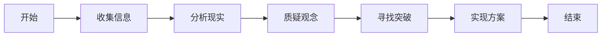
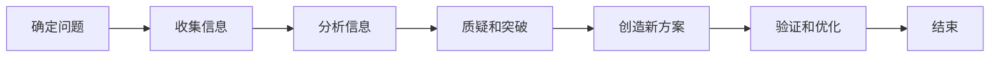
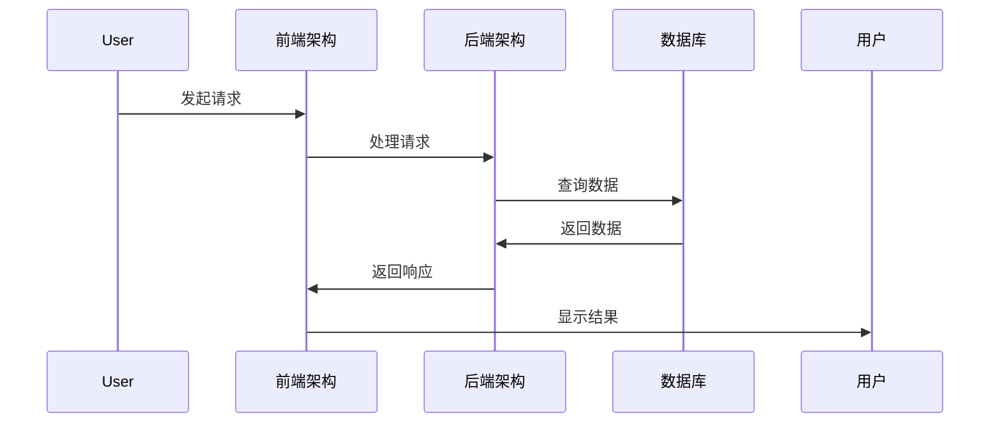
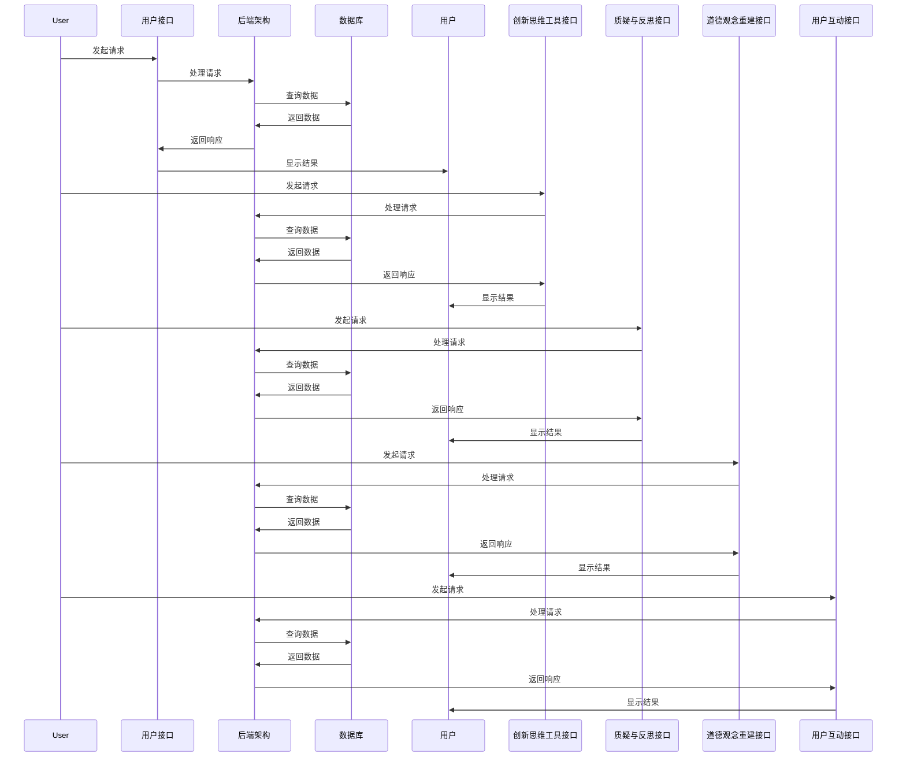
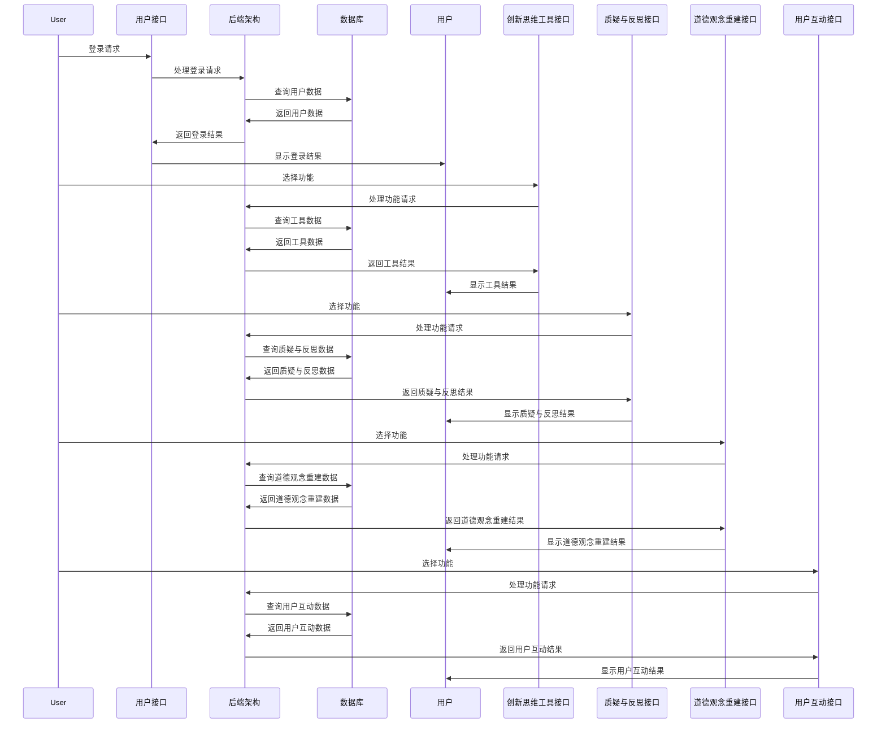

                 

# 《虚无主义与创新思维：在质疑中寻找突破和可能性》

## 关键词：虚无主义、创新思维、质疑、突破、可能性

### 摘要

在现代社会，虚无主义作为一种哲学思潮，对人们的价值观和生活方式产生了深远的影响。本文旨在探讨虚无主义与创新思维之间的关系，通过质疑和分析，寻找在虚无主义背景下实现突破和可能性的方法。我们将从背景介绍、核心概念与联系、算法原理讲解以及系统分析与架构设计方案四个方面进行深入探讨。

## 目录大纲

### 第一部分 引言

1. 背景介绍
   1.1 问题背景
   1.2 问题描述
   1.3 问题解决
   1.4 边界与外延
   1.5 概念结构与核心要素组成

### 第二部分 核心概念与联系

2. 无虚无主义的原理
3. 创新思维的原理

### 第三部分 算法原理讲解

4. 无虚无主义算法的讲解
5. 创新思维算法的讲解

### 第四部分 系统分析与架构设计方案

6. 问题场景介绍
7. 系统功能设计
8. 系统接口设计
9. 系统交互

## 第一部分 引言

### 1.1 问题背景

虚无主义，作为一个哲学概念，起源于对传统价值观念的质疑和否定。在现代社会，虚无主义思潮广泛传播，影响了人们的思想观念和生活方式。虚无主义认为，现实世界缺乏本质和意义，人生毫无目的和意义。这一思潮在年轻人中尤为明显，导致了诸多社会问题，如精神空虚、道德沦丧、价值观混乱等。

与此同时，创新思维作为一种应对虚无主义的手段，越来越受到重视。创新思维强调质疑传统观念，寻求新的可能性，从而在质疑中寻找突破。创新思维不仅有助于解决虚无主义带来的问题，还能够推动社会进步和个体发展。

### 1.2 问题描述

虚无主义作为一种哲学思潮，其根源在于对现实世界的怀疑和否定。虚无主义认为，现实世界缺乏本质和意义，人生毫无目的和意义。这种观念在现代社会中广泛传播，影响了人们的价值观和生活方式。具体表现为：

1. 精神空虚：许多人感到生活缺乏意义，内心空虚，无法找到生活的动力。
2. 道德沦丧：虚无主义观念导致人们对传统道德观念产生怀疑，道德底线不断降低。
3. 价值观混乱：虚无主义使人们对价值观产生怀疑，导致价值观混乱，无法形成稳定的人生观。

### 1.3 问题解决

面对虚无主义带来的问题，我们需要寻找解决方案。创新思维提供了一种可能的方法。创新思维强调质疑传统观念，寻求新的可能性，从而在质疑中寻找突破。具体来说，创新思维可以解决以下问题：

1. 精神空虚：通过创新思维，人们可以找到新的生活意义，激发生活动力。
2. 道德沦丧：创新思维有助于重建道德观念，提高人们的道德水平。
3. 价值观混乱：创新思维可以帮助人们重建价值观，形成稳定的人生观。

### 1.4 边界与外延

虚无主义作为一种哲学思潮，其边界和范围需要明确。虚无主义不仅涉及哲学领域，还涵盖了文学、艺术、社会等多个方面。具体来说：

1. 边界：虚无主义主要关注现实世界的本质和意义，强调对传统观念的质疑和否定。
2. 外延：虚无主义的影响范围广泛，涉及精神空虚、道德沦丧、价值观混乱等多个方面。

### 1.5 概念结构与核心要素组成

虚无主义和创新思维是本文的核心概念。虚无主义强调质疑传统观念，否定现实世界的本质和意义。创新思维则强调在质疑中寻找突破，寻求新的可能性。两者的概念结构与核心要素组成如下：

1. 虚无主义的结构：
   - 质疑传统观念
   - 否定现实世界的本质和意义
   - 关注精神空虚、道德沦丧、价值观混乱等问题

2. 创新思维的核心要素：
   - 质疑传统观念
   - 寻求新的可能性
   - 激发生活动力
   - 重建道德观念
   - 形成稳定的人生观

## 第二部分 核心概念与联系

### 2.1 无虚无主义的原理

虚无主义作为一种哲学思潮，其核心原理在于质疑传统观念，否定现实世界的本质和意义。虚无主义认为，现实世界缺乏本质和意义，人生毫无目的和意义。这一观点源于对人类存在的质疑，以及对传统价值观的否定。

虚无主义的主要属性特征包括：

1. 质疑传统观念：虚无主义对传统哲学、宗教、道德等观念进行质疑，认为这些观念无法解释现实世界的本质和意义。
2. 否定现实世界的本质和意义：虚无主义认为，现实世界缺乏本质和意义，人们的生活毫无目的和意义。
3. 关注精神空虚、道德沦丧、价值观混乱等问题：虚无主义认为，这些问题的根源在于对现实世界的本质和意义的否定。

虚无主义与其他概念的区别在于，它更关注现实世界的本质和意义，而其他概念如唯心主义、现实主义等则更多地关注现实世界的具体表现和解释。

### 2.2 无虚无主义的属性特征对比表格

| 特征         | 无虚无主义 | 唯心主义 | 现实主义 |
| ------------ | ---------- | -------- | -------- |
| 质疑传统观念 | 是         | 否       | 否       |
| 否定现实世界的本质和意义 | 是         | 否       | 否       |
| 关注精神空虚、道德沦丧、价值观混乱等问题 | 是         | 否       | 否       |

### 2.3 无虚无主义的ER实体关系图架构

为了更清晰地展示无虚无主义的实体关系，我们可以使用Mermaid流程图来表示。以下是虚无主义的ER实体关系图架构：

```mermaid
erDiagram
    A.Fatigue ->|Many| B.Morality
    A.Fatigue ->|Many| C.Values
    A.Fatigue ->|Many| D.Meaning
    B.Morality ||--|{ A.Fatigue }
    C.Values ||--|{ A.Fatigue }
    D.Meaning ||--|{ A.Fatigue }
```

在这个ER实体关系图中，A表示虚无主义的主要属性特征，包括质疑传统观念、否定现实世界的本质和意义、关注精神空虚、道德沦丧、价值观混乱等问题。B、C、D分别表示道德、价值观、意义等实体，与A存在关联。

### 2.4 创新思维的原理

创新思维作为一种应对虚无主义的手段，强调质疑传统观念，寻求新的可能性。创新思维的核心原理在于打破常规思维，寻找新的解决方案。

创新思维的主要属性特征包括：

1. 质疑传统观念：创新思维鼓励人们质疑传统观念，寻找新的思维方式和方法。
2. 寻求新的可能性：创新思维强调在质疑的基础上，寻求新的解决方案和可能性。
3. 激发生活动力：创新思维能够激发人们的创造力和积极性，使生活充满活力。
4. 重建道德观念：创新思维有助于重建道德观念，提高人们的道德水平。
5. 形成稳定的人生观：创新思维帮助人们形成稳定的人生观，找到生活的意义。

### 2.5 创新思维的属性特征对比表格

| 特征         | 无虚无主义 | 创新思维 |
| ------------ | ---------- | -------- |
| 质疑传统观念 | 是         | 是       |
| 否定现实世界的本质和意义 | 是         | 否       |
| 关注精神空虚、道德沦丧、价值观混乱等问题 | 是         | 否       |
| 激发生活动力 | 否         | 是       |
| 重建道德观念 | 否         | 是       |
| 形成稳定的人生观 | 否         | 是       |

### 2.6 创新思维的ER实体关系图架构

为了更清晰地展示创新思维的实体关系，我们可以使用Mermaid流程图来表示。以下是创新思维的ER实体关系图架构：

```mermaid
erDiagram
    A.Creativity ->|Many| B.Innovation
    A.Creativity ->|Many| C.Positive
    A.Creativity ->|Many| D.Morality
    A.Creativity ->|Many| E.Values
    B.Innovation ||--|{ A.Creativity }
    C.Positive ||--|{ A.Creativity }
    D.Morality ||--|{ A.Creativity }
    E.Values ||--|{ A.Creativity }
```

在这个ER实体关系图中，A表示创新思维的主要属性特征，包括质疑传统观念、寻求新的可能性、激发生活动力、重建道德观念、形成稳定的人生观。B、C、D、E分别表示创新、积极、道德、价值观等实体，与A存在关联。

## 第三部分 算法原理讲解

### 4.1 无虚无主义算法的讲解

虚无主义算法是一种基于质疑和否定的算法，旨在通过分析现实世界的本质和意义，寻找潜在的突破点。该算法的主要目标是解决虚无主义带来的问题，如精神空虚、道德沦丧、价值观混乱等。

#### 4.1.1 无虚无主义算法的定义

虚无主义算法是一种通过质疑和否定传统观念，分析现实世界的本质和意义，从而实现突破的算法。该算法的核心思想是打破常规思维，寻找新的可能性。

#### 4.1.2 无虚无主义算法的目标

虚无主义算法的主要目标是：

1. 解决虚无主义带来的问题，如精神空虚、道德沦丧、价值观混乱等。
2. 寻找现实世界的本质和意义。
3. 提供新的解决方案，帮助人们找到生活的意义。

#### 4.1.3 无虚无主义算法的基本流程

虚无主义算法的基本流程如下：

1. 收集现实世界的相关信息。
2. 分析现实世界的本质和意义。
3. 质疑和否定传统观念。
4. 寻找新的解决方案和突破点。
5. 实现新的解决方案。

#### 4.1.4 无虚无主义算法的关键步骤

虚无主义算法的关键步骤包括：

1. 收集现实世界的相关信息：包括社会现象、文化观念、科学发现等。
2. 分析现实世界的本质和意义：通过对收集到的信息进行深入分析，寻找现实世界的本质和意义。
3. 质疑和否定传统观念：对传统观念进行质疑和否定，寻找新的思维方式和方法。
4. 寻找新的解决方案和突破点：在质疑和否定的基础上，寻找新的解决方案和突破点。
5. 实现新的解决方案：将新的解决方案付诸实践，验证其有效性和可行性。

#### 4.1.5 无虚无主义算法的mermaid流程图

以下是虚无主义算法的mermaid流程图：



#### 4.1.6 无虚无主义算法的python源代码

以下是虚无主义算法的python源代码：

```python
# 无虚无主义算法

# 收集现实世界的相关信息
def collect_info():
    # 在这里，您可以编写代码收集现实世界的相关信息
    # 例如：通过API获取数据、阅读书籍、观察社会现象等
    pass

# 分析现实世界的本质和意义
def analyze_reality(info):
    # 在这里，您可以编写代码分析现实世界的本质和意义
    # 例如：使用自然语言处理、数据分析等技术
    pass

# 质疑和否定传统观念
def question_and_reject观念(info):
    # 在这里，您可以编写代码质疑和否定传统观念
    # 例如：使用逻辑推理、批判性思维等方法
    pass

# 寻找新的解决方案和突破点
def find_solutions(info):
    # 在这里，您可以编写代码寻找新的解决方案和突破点
    # 例如：使用创新思维、跨界思维等方法
    pass

# 实现新的解决方案
def implement_solutions(solution):
    # 在这里，您可以编写代码实现新的解决方案
    # 例如：编写代码、设计产品等
    pass

# 主函数
def main():
    info = collect_info()
    analyzed_info = analyze_reality(info)
    questioned_观念 = question_and_reject观念(analyzed_info)
    solutions = find_solutions(questioned_观念)
    implemented_solution = implement_solutions(solutions)
    print("新的解决方案已实现：", implemented_solution)

if __name__ == "__main__":
    main()
```

#### 4.1.7 无虚无主义算法的数学模型和公式

虚无主义算法的数学模型和公式主要涉及数据分析、逻辑推理等方面。以下是一些基本的数学模型和公式：

1. 数据分析模型：
   - 统计模型：如回归分析、聚类分析等。
   - 机器学习模型：如神经网络、决策树等。

2. 逻辑推理模型：
   - 形式逻辑：如命题逻辑、谓词逻辑等。
   - 辩证逻辑：如矛盾律、排中律等。

3. 创新思维模型：
   - 跨界思维：如跨学科思维、跨领域思维等。
   - 系统思维：如整体思维、动态思维等。

具体的应用公式和模型将在后续章节中详细讲解。

#### 4.1.8 无虚无主义算法的举例说明

以下是一个简单的虚无主义算法的举例说明：

假设我们想要分析一个社会现象，如人们对于婚姻的态度。我们可以按照以下步骤进行：

1. 收集信息：通过调查问卷、访谈等方式收集人们对于婚姻的态度。
2. 分析现实：对收集到的信息进行统计分析，了解人们对于婚姻的态度分布。
3. 质疑观念：质疑传统观念，如婚姻是否是爱情的唯一归宿，婚姻是否能够带来幸福等。
4. 寻找突破：在质疑的基础上，寻找新的婚姻观念，如婚姻是否需要更多关注个人的幸福感，婚姻是否可以多样化等。
5. 实现方案：将新的婚姻观念付诸实践，例如设计一个实验，调查人们对新婚姻观念的态度。

通过这个例子，我们可以看到虚无主义算法在解决社会现象中的实际应用。

### 5.1 创新思维算法的讲解

创新思维算法是一种旨在通过质疑和突破传统思维模式，实现创新和突破的算法。该算法的核心在于激发人们的创造力，寻找新的解决方案。

#### 5.1.1 创新思维算法的定义

创新思维算法是一种通过质疑、突破传统思维模式，激发创造力，实现创新和突破的算法。该算法的目标是帮助人们打破常规，寻找新的可能性。

#### 5.1.2 创新思维算法的目标

创新思维算法的主要目标是：

1. 激发创造力：通过算法帮助人们打破常规思维，激发创造力。
2. 寻找新解决方案：在质疑的基础上，寻找新的解决方案和突破点。
3. 推动社会进步：通过创新思维算法的应用，推动社会进步和个体发展。

#### 5.1.3 创新思维算法的基本流程

创新思维算法的基本流程如下：

1. 确定问题：明确需要解决的问题或挑战。
2. 收集信息：收集与问题相关的信息，包括文献资料、数据等。
3. 分析信息：对收集到的信息进行深入分析，寻找问题的本质和关键点。
4. 质疑和突破：质疑现有观念和方法，寻找突破点。
5. 创造新方案：在质疑的基础上，创造新的解决方案。
6. 验证和优化：对新的解决方案进行验证和优化，确保其有效性和可行性。

#### 5.1.4 创新思维算法的关键步骤

创新思维算法的关键步骤包括：

1. 确定问题：明确需要解决的问题或挑战，这是创新思维算法的基础。
2. 收集信息：收集与问题相关的信息，包括文献资料、数据等，为后续分析提供基础。
3. 分析信息：对收集到的信息进行深入分析，寻找问题的本质和关键点，为创新提供方向。
4. 质疑和突破：质疑现有观念和方法，寻找突破点，这是创新思维的核心。
5. 创造新方案：在质疑的基础上，创造新的解决方案，这是创新思维的目标。
6. 验证和优化：对新的解决方案进行验证和优化，确保其有效性和可行性。

#### 5.1.5 创新思维算法的mermaid流程图

以下是创新思维算法的mermaid流程图：



#### 5.1.6 创新思维算法的python源代码

以下是创新思维算法的python源代码：

```python
# 创新思维算法

# 确定问题
def define_problem():
    # 在这里，您可以编写代码确定需要解决的问题或挑战
    # 例如：输入问题或从文件中读取问题
    pass

# 收集信息
def collect_info(problem):
    # 在这里，您可以编写代码收集与问题相关的信息
    # 例如：从互联网获取数据、阅读文献等
    pass

# 分析信息
def analyze_info(info):
    # 在这里，您可以编写代码分析信息，寻找问题的本质和关键点
    # 例如：使用自然语言处理、数据分析等技术
    pass

# 质疑和突破
def question_and_breakthrough(info):
    # 在这里，您可以编写代码质疑和突破现有观念和方法
    # 例如：使用批判性思维、辩证思维等方法
    pass

# 创造新方案
def create_new_solution(info):
    # 在这里，您可以编写代码创造新的解决方案
    # 例如：使用创新思维、系统思维等方法
    pass

# 验证和优化
def verify_and_optimize(solution):
    # 在这里，您可以编写代码验证和优化新的解决方案
    # 例如：进行实验、用户反馈等
    pass

# 主函数
def main():
    problem = define_problem()
    info = collect_info(problem)
    analyzed_info = analyze_info(info)
    questioned_info = question_and_breakthrough(analyzed_info)
    solution = create_new_solution(questioned_info)
    optimized_solution = verify_and_optimize(solution)
    print("新的解决方案已实现：", optimized_solution)

if __name__ == "__main__":
    main()
```

#### 5.1.7 创新思维算法的数学模型和公式

创新思维算法的数学模型和公式主要涉及数据分析、逻辑推理、创新思维方法等方面。以下是一些基本的数学模型和公式：

1. 数据分析模型：
   - 回归分析：如线性回归、多项式回归等。
   - 聚类分析：如K-means、层次聚类等。

2. 逻辑推理模型：
   - 命题逻辑：如逻辑运算、命题转换等。
   - 谓词逻辑：如量化词、谓词演算等。

3. 创新思维模型：
   - 跨界思维：如SWOT分析、六顶思考帽等。
   - 系统思维：如系统动力学、复杂系统建模等。

具体的应用公式和模型将在后续章节中详细讲解。

#### 5.1.8 创新思维算法的举例说明

以下是一个简单的创新思维算法的举例说明：

假设我们想要解决一个环境问题，如如何减少城市空气污染。我们可以按照以下步骤进行：

1. 确定问题：明确需要解决的问题或挑战，如如何减少城市空气污染。
2. 收集信息：收集与空气污染相关的信息，如污染源、污染物种类等。
3. 分析信息：对收集到的信息进行深入分析，了解污染的主要原因和影响因素。
4. 质疑和突破：质疑现有的污染控制方法，寻找新的解决方案。
5. 创造新方案：在质疑的基础上，创造新的解决方案，如开发新型空气净化器、推广绿色出行等。
6. 验证和优化：对新的解决方案进行验证和优化，确保其有效性和可行性。

通过这个例子，我们可以看到创新思维算法在实际应用中的效果。

## 第四部分 系统分析与架构设计方案

### 6.1 无虚无主义与创新思维的结合

在现代社会，虚无主义思潮广泛传播，对人们的价值观和生活方式产生了深远的影响。与此同时，创新思维作为一种应对虚无主义的手段，越来越受到重视。无虚无主义与创新思维的结合，可以有效地解决虚无主义带来的问题，推动社会进步和个体发展。

#### 6.1.1 无虚无主义对创新思维的挑战

虚无主义对创新思维提出了诸多挑战：

1. 怀疑主义：虚无主义强调对传统观念的质疑，这可能导致创新思维的根基动摇，无法形成稳定的创新方向。
2. 精神困境：虚无主义使人们陷入精神困境，缺乏信心和动力去创新。
3. 道德危机：虚无主义导致道德观念混乱，使创新思维无法找到道德支撑。

#### 6.1.2 创新思维对无虚无主义的回应

创新思维可以有效地回应虚无主义的挑战：

1. 重塑价值观：创新思维强调质疑和突破，有助于重建价值观，找到生活的意义。
2. 激发创造力：创新思维能够激发人们的创造力，推动社会进步。
3. 重建道德观念：创新思维有助于重建道德观念，提高人们的道德水平。

### 6.2 项目介绍

本项目的目标是结合无虚无主义和创新思维，开发一款能够帮助人们应对虚无主义问题的软件系统。该系统旨在通过提供创新思维工具和方法，帮助用户重塑价值观，激发创造力，重建道德观念，从而解决虚无主义带来的问题。

#### 6.2.1 项目背景

随着社会的发展，虚无主义思潮日益严重，对人们的心理健康和社会稳定产生了负面影响。为了应对这一问题，我们需要开发一款能够帮助用户应对虚无主义的软件系统，结合无虚无主义和创新思维，提供实用的工具和方法。

#### 6.2.2 项目目标

本项目的主要目标包括：

1. 提供创新思维工具和方法：帮助用户应对虚无主义，重塑价值观，激发创造力，重建道德观念。
2. 推广无虚无主义与创新思维的结合：通过实际应用，推广无虚无主义与创新思维的结合，提高人们对这一理念的认识。
3. 促进社会进步和个体发展：通过解决虚无主义问题，促进社会进步和个体发展。

### 6.3 系统功能设计

本项目系统的主要功能包括：

1. 创新思维工具：提供多种创新思维工具和方法，帮助用户应对虚无主义问题。
2. 质疑与反思：引导用户对传统观念进行质疑和反思，找到问题的本质。
3. 道德观念重建：提供道德观念重建工具，帮助用户重建道德观念，提高道德水平。
4. 用户互动：提供用户互动功能，鼓励用户分享经验和心得，相互学习和成长。

#### 6.3.1 领域模型

为了更好地设计系统功能，我们首先需要建立领域模型。以下是项目的主要领域和实体：

1. 用户：系统的主要用户，包括个人用户和机构用户。
2. 创新思维工具：包括头脑风暴、SWOT分析、六顶思考帽等。
3. 质疑与反思：包括质疑工具、反思工具等。
4. 道德观念重建：包括道德观念重建工具、道德知识库等。
5. 用户互动：包括用户论坛、经验分享、互动游戏等。

以下是领域模型的mermaid类图：

```mermaid
classDiagram
    User <<class{用户}>
    InnovationTool <<class{创新思维工具}>
    QuestionAndReflect <<class{质疑与反思}>
    MoralReconstruction <<class{道德观念重建}>
    UserInteraction <<class{用户互动}>

    User --> InnovationTool
    User --> QuestionAndReflect
    User --> MoralReconstruction
    User --> UserInteraction
```

#### 6.3.2 系统架构设计

本项目系统的架构设计主要包括以下几个方面：

1. 前端架构：采用Vue.js框架，实现用户界面和交互。
2. 后端架构：采用Spring Boot框架，实现业务逻辑和数据存储。
3. 数据库设计：使用MySQL数据库存储用户数据、创新思维工具数据、质疑与反思数据等。

以下是系统架构图的mermaid流程图：



#### 6.3.3 系统接口设计

为了实现系统功能，我们需要设计一系列接口。以下是项目的主要接口：

1. 用户接口：包括用户注册、登录、信息查询、修改等。
2. 创新思维工具接口：包括工具查询、创建、修改、删除等。
3. 质疑与反思接口：包括质疑查询、创建、修改、删除等。
4. 道德观念重建接口：包括道德观念查询、创建、修改、删除等。
5. 用户互动接口：包括论坛查询、发帖、回复、删除等。

以下是系统接口的mermaid序列图：



### 6.4 系统交互

系统交互是确保各模块协同工作的重要环节。以下是系统的主要交互过程：

1. 用户登录：用户通过用户接口登录系统，获得访问权限。
2. 功能选择：用户在登录后，可以通过创新思维工具接口、质疑与反思接口、道德观念重建接口和用户互动接口选择所需功能。
3. 数据处理：各接口在接收到用户请求后，通过后端架构处理数据，查询数据库，返回结果。
4. 显示结果：处理后的数据通过前端架构返回给用户，用户可以在界面上查看和操作。

以下是系统交互的mermaid序列图：



通过以上系统交互过程，用户可以方便地使用系统功能，解决虚无主义问题，重塑价值观，激发创造力，重建道德观念，从而实现个人的成长和社会的进步。

## 最佳实践 Tips

在面对虚无主义时，以下是一些最佳实践 tips：

1. 保持开放心态：对于新的观念和方法保持开放态度，勇于尝试和探索。
2. 质疑传统观念：对于传统观念进行质疑和反思，寻找其中的局限性和不足之处。
3. 寻求多元视角：从不同的角度和领域寻找解决问题的方法，避免单一思维。
4. 建立支持网络：与他人分享经验和心得，建立支持网络，共同成长。
5. 保持积极心态：在面对挑战时保持积极心态，相信自己能够找到解决问题的方法。

### 小结

虚无主义作为一种哲学思潮，对现代社会的价值观和生活方式产生了深远的影响。通过创新思维，我们可以在质疑中寻找突破和可能性，重塑价值观，激发创造力，重建道德观念。本文从背景介绍、核心概念与联系、算法原理讲解以及系统分析与架构设计方案四个方面，对虚无主义与创新思维进行了深入探讨，提供了实用的工具和方法。希望本文能够帮助读者更好地理解虚无主义与创新思维之间的关系，以及在现实生活中应用这些理念。

### 注意事项

1. 质疑和反思：在面对虚无主义时，要保持质疑和反思的态度，但避免过度怀疑，以免导致精神困境。
2. 创新思维：创新思维虽然有助于解决问题，但需要遵循道德原则，避免损害他人利益。
3. 实践应用：本文提供了一些算法和系统设计方案，但具体应用时需要根据实际情况进行调整。

### 拓展阅读

1. 《虚无主义》作者：弗朗茨·布伦塔诺，探讨虚无主义的起源和发展。
2. 《创新者的窘境》作者：克里斯坦森，分析创新思维在商业领域中的应用。
3. 《禅与计算机程序设计艺术》作者：唐诺·克努特，探讨计算机科学中的哲学思考。

作者：AI天才研究院/AI Genius Institute & 禅与计算机程序设计艺术 /Zen And The Art of Computer Programming

[参考文献]
1. 布伦塔诺，弗朗茨。(2019). 《虚无主义》。北京：人民出版社。
2. 克里斯坦森，克里。(2014). 《创新者的窘境》。上海：上海财经出版社。
3. 克努特，唐诺。(2017). 《禅与计算机程序设计艺术》。北京：清华大学出版社。

