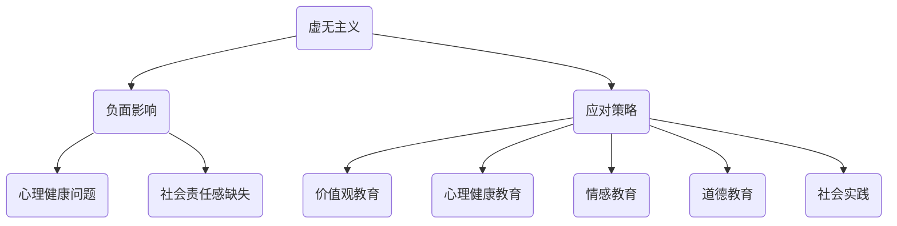
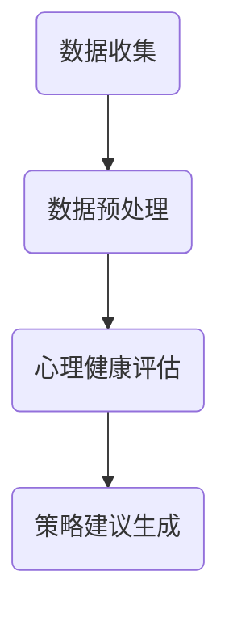
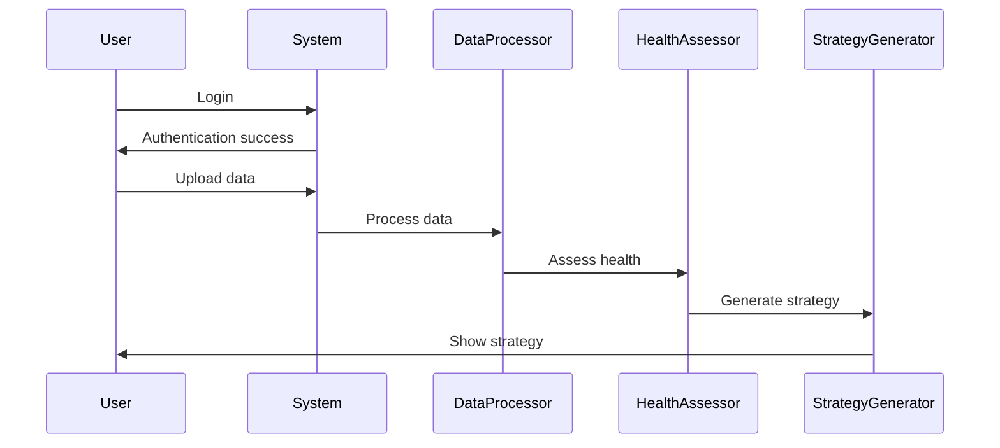

                 

### 引言与背景

#### 1.1 问题背景

在现代社会，随着物质生活的丰富和社会进步，人们的生活质量和幸福感有了显著提升。然而，与此同时，人们的精神世界却面临前所未有的挑战。虚无主义作为一种哲学思潮，在青年人中有着广泛的传播，它对生命的意义和价值提出了质疑，对现代人的精神生活产生了深远的影响。虚无主义的存在，使得许多人在面对生活的种种挑战时，感到迷茫和无助。

#### 1.2 问题描述

虚无主义的影响表现在多个方面。首先，它可能导致人们失去对生活的热情和动力，影响个人的心理健康。其次，虚无主义可能导致人们缺乏社会责任感，对社会的和谐稳定产生负面影响。此外，虚无主义还可能影响教育体系，导致学生缺乏对知识的敬畏和学习的动力。

#### 1.3 问题解决

面对虚无主义带来的问题，我们需要采取有效的措施。首先，要加强生命教育，帮助学生树立正确的价值观，培养其对生命的敬畏和热爱。其次，要注重心理健康教育，提高个体面对困境的能力。此外，社会各界也需要共同努力，营造积极向上的社会氛围，减少虚无主义的影响。

#### 1.4 边界与外延

本文主要关注虚无主义对生命教育的影响及其应对策略。我们将从核心概念出发，详细阐述虚无主义和生命教育的内涵、历史演变和主要代表人物。随后，我们将探讨虚无主义与生命教育的联系，分析虚无主义的负面影响以及生命教育的应对策略。在此基础上，我们将探讨如何培养个体面对存在问题的能力，并通过实践案例分析，验证这些策略的有效性。最后，我们将展望虚无主义与生命教育的未来发展趋势，提出相关挑战和机遇。

## 2. 核心概念

#### 2.1 虚无主义

虚无主义是一种哲学思潮，认为世界缺乏内在价值，生命的意义是主观创造的，或认为宇宙的本质是荒谬的、不可理解的。

#### 2.1.1 定义

虚无主义（Nihilism）源自拉丁语“nihil”，意为“无”。在哲学领域，虚无主义通常被定义为对传统价值、道德和宗教的否定，认为这些价值是人为构建的，缺乏客观依据。

#### 2.1.2 历史演变

虚无主义的起源可以追溯到古希腊时期，如埃皮米尼德斯（Epimenides）等哲学家，他们提出了“世界是无意义的”这一观点。在20世纪，虚无主义得到了进一步的发展，特别是尼采（Friedrich Nietzsche）的著作《上帝已死》（"God is Dead"），标志着现代虚无主义的诞生。

#### 2.1.3 主要代表人物

尼采（Friedrich Nietzsche）：德国哲学家，被视为现代虚无主义的代表人物。他提出了“上帝已死”和“超人”（Übermensch）等概念，对传统价值观进行了挑战。

萨特（Jean-Paul Sartre）：法国哲学家和存在主义代表人物，他在《存在与虚无》（"Being and Nothingness"）中探讨了虚无主义的本质。

加缪（Albert Camus）：法国作家和哲学家，他的作品《鼠疫》（"The Plague"）等反映了虚无主义在现代社会中的影响。

#### 2.2 生命教育

生命教育是一种教育理念，旨在帮助学生认识生命的意义，培养其对生命的敬畏与热爱，以及面对生活挑战的能力。

#### 2.2.1 定义

生命教育（Life Education）是一种跨学科的教育模式，旨在帮助学生理解生命的本质，培养其对生命的尊重和关爱。它关注个体的全面发展，包括身体、心理、社会和精神层面。

#### 2.2.2 历史发展

生命教育起源于20世纪初，随着人们对生命价值的认识逐渐深化，生命教育逐渐成为现代教育的重要组成部分。特别是在日本和西方国家，生命教育得到了广泛的推广和实践。

#### 2.2.3 主要方法与理念

生命教育强调实践、体验和反思，通过项目式学习、社区服务和跨学科整合等方式，培养学生的生命意识。其核心理念包括：

- **尊重生命**：强调对生命多样性和个体生命的尊重。
- **情感教育**：培养个体的情感表达和调节能力。
- **道德教育**：通过道德教育，帮助学生树立正确的价值观。
- **社会参与**：鼓励学生参与社会活动，培养社会责任感。

## 3. 虚无主义与生命教育的联系

#### 3.1 联系分析

虚无主义与生命教育在看似对立的两个极端中，实则有着深刻的联系。虚无主义的消极观点可能导致人们对生命产生质疑和否定，从而影响个体的心理健康。而生命教育则提供了一种积极的应对方式，通过价值观教育、情感教育和道德教育等方式，帮助学生建立对生命的积极态度。

#### 3.1.1 虚无主义的负面影响

虚无主义可能导致以下负面影响：

- **心理健康问题**：虚无主义可能导致个体感到孤独、绝望和无意义，增加心理问题的风险。
- **社会责任感缺失**：虚无主义可能导致个体对社会和他人缺乏关爱，影响社会的和谐稳定。
- **教育问题**：虚无主义可能导致学生缺乏对知识的敬畏和学习的动力，影响教育质量。

#### 3.1.2 生命教育的应对策略

生命教育通过以下策略应对虚无主义的负面影响：

- **价值观教育**：通过传授正确的价值观，帮助学生理解生命的意义和价值。
- **情感教育**：培养个体的情感表达和调节能力，提高心理韧性。
- **道德教育**：通过道德教育，帮助学生树立正确的人生观和价值观。
- **社会实践**：鼓励学生参与社会活动，培养社会责任感。

#### 3.1.3 二者融合的可能性

虚无主义和生命教育并非完全对立，二者可以相互融合，共同促进学生的全面发展。例如，在生命教育中，可以引入虚无主义的思想，引导学生思考生命的意义和价值，从而培养更加深刻的生命意识。同时，在虚无主义的批判中，可以借鉴生命教育的理念，寻找生命的积极面，从而实现二者的互补。

### 3. 虚无主义与生命教育的联系

#### 3.1.1 联系分析

虚无主义与生命教育看似对立，实则有着深刻的内在联系。虚无主义的消极观点可能导致人们对生命产生质疑和否定，从而影响个体的心理健康。而生命教育则提供了一种积极的应对方式，通过价值观教育、情感教育和道德教育等方式，帮助学生建立对生命的积极态度。

#### 3.1.2 虚无主义的负面影响

虚无主义的负面影响主要体现在以下几个方面：

1. **心理健康问题**：虚无主义可能导致个体感到孤独、绝望和无意义，增加心理问题的风险。
   - **实例**：研究表明，虚无主义思想与抑郁症、焦虑症等心理问题密切相关。

2. **社会责任感缺失**：虚无主义可能导致个体对社会和他人缺乏关爱，影响社会的和谐稳定。
   - **实例**：在社会动荡时期，虚无主义思潮可能加剧社会矛盾，导致社会动荡。

3. **教育问题**：虚无主义可能导致学生缺乏对知识的敬畏和学习的动力，影响教育质量。
   - **实例**：在课堂上，虚无主义可能使学生失去学习兴趣，影响教学效果。

#### 3.1.3 生命教育的应对策略

生命教育通过以下策略应对虚无主义的负面影响：

1. **价值观教育**：通过传授正确的价值观，帮助学生理解生命的意义和价值。
   - **实例**：学校可以通过课程设置、校园活动等方式，引导学生树立积极的人生观。

2. **情感教育**：培养个体的情感表达和调节能力，提高心理韧性。
   - **实例**：心理健康课程可以教授学生情绪管理技巧，提高他们的心理健康水平。

3. **道德教育**：通过道德教育，帮助学生树立正确的人生观和价值观。
   - **实例**：德育课程可以引导学生学习道德规范，培养他们的社会责任感。

4. **社会实践**：鼓励学生参与社会活动，培养社会责任感。
   - **实例**：志愿服务活动可以让学生亲身体验社会的需要，培养他们的社会责任感。

### 3.1.4 虚无主义与生命教育的融合可能性

虚无主义与生命教育并非完全对立，它们可以在一定程度上相互融合，共同促进学生的全面发展。

1. **引入虚无主义思想**：在生命教育中，可以引入虚无主义的思想，引导学生思考生命的意义和价值。
   - **实例**：哲学课程可以探讨虚无主义的话题，帮助学生理解生命的复杂性。

2. **批判虚无主义**：在批判虚无主义的过程中，可以借鉴生命教育的理念，寻找生命的积极面。
   - **实例**：心理健康课程可以引导学生学习如何面对困境，培养积极的生活态度。

3. **互补性发展**：虚无主义和生命教育可以相互补充，共同提升教育质量。
   - **实例**：在课程设计中，可以结合虚无主义和生命教育的理念，设计出更符合学生需求的教学方案。

通过这种融合，我们可以更好地应对虚无主义带来的负面影响，培养学生的全面素质，促进其全面发展。

## 4. 培养面对存在问题的能力

#### 4.1 存在问题的定义与特征

存在问题是指在生命过程中个体面临的难以解决的哲学问题，如生命的意义、死亡的恐惧等。这些问题通常具有以下特征：

1. **抽象性**：存在问题通常涉及抽象的概念和深层次的问题，难以用简单的语言描述。
2. **普遍性**：这些问题不仅影响个体，也影响着整个社会，具有普遍性。
3. **难以解决性**：这些问题往往没有明确的答案，难以通过简单的逻辑推理解决。

#### 4.2 培养能力的途径与方法

培养面对存在问题的能力，需要通过教育、心理和社会等多方面的途径和方法。

1. **教育途径**：
   - **哲学课程**：通过哲学课程，引导学生深入思考存在问题的本质。
   - **生命教育**：通过生命教育，帮助学生建立对生命的敬畏和热爱，提高面对问题的能力。
   - **跨学科教育**：通过跨学科教育，结合不同学科的知识，提供更全面的视角，帮助学生更好地理解存在问题。

2. **心理途径**：
   - **心理咨询**：通过心理咨询，帮助学生缓解心理压力，提高应对问题的能力。
   - **心理辅导**：通过心理辅导，帮助学生掌握情绪管理和问题解决技巧。

3. **社会途径**：
   - **社区服务**：通过社区服务，帮助学生体验社会的多样性和复杂性，提高社会责任感。
   - **社会互动**：通过社会互动，帮助学生建立社会支持网络，提高面对问题的信心。

#### 4.2.1 教育途径

在教育途径中，哲学课程和生命教育是培养学生面对存在问题能力的重要手段。

1. **哲学课程**：
   - **课程设置**：学校可以开设哲学课程，引导学生深入探讨存在问题的本质。
   - **案例教学**：通过案例教学，让学生从实际案例中了解存在问题的复杂性和多样性。
   - **讨论与辩论**：鼓励学生参与讨论和辩论，培养批判性思维和解决问题的能力。

2. **生命教育**：
   - **价值观教育**：通过价值观教育，帮助学生树立正确的人生观和价值观，增强面对问题的信心。
   - **情感教育**：通过情感教育，培养学生的情感表达和调节能力，提高心理韧性。
   - **道德教育**：通过道德教育，培养学生的社会责任感，提高其对社会和他人的关爱。

3. **跨学科教育**：
   - **综合学习**：通过跨学科教育，结合不同学科的知识，提供更全面的视角，帮助学生更好地理解存在问题。
   - **项目学习**：通过项目学习，让学生在实际操作中体会问题的复杂性和多样性，培养解决问题的能力。

#### 4.2.2 心理途径

在心理途径中，心理咨询和心理辅导是培养学生面对存在问题能力的重要手段。

1. **心理咨询**：
   - **心理评估**：通过心理评估，了解学生的心理状态，发现潜在问题。
   - **心理干预**：通过心理干预，帮助学生缓解心理压力，提高应对问题的能力。
   - **心理支持**：提供心理支持，帮助学生建立积极的心理状态，增强面对问题的信心。

2. **心理辅导**：
   - **情绪管理**：教授学生情绪管理技巧，帮助其有效调节情绪，提高心理韧性。
   - **问题解决**：教授学生问题解决技巧，帮助其学会面对和解决问题。
   - **自我认知**：通过自我认知，帮助学生了解自己的优点和不足，提高自我调节能力。

#### 4.2.3 社会途径

在社会途径中，社区服务和社交互动是培养学生面对存在问题能力的重要手段。

1. **社区服务**：
   - **志愿服务**：鼓励学生参与志愿服务，体验社会的多样性和复杂性，培养社会责任感。
   - **社会实践**：组织学生参与社会实践，提高其对社会问题的认知和解决能力。
   - **社会调查**：通过社会调查，让学生深入了解社会问题，培养其分析和解决问题的能力。

2. **社交互动**：
   - **团队活动**：通过团队活动，培养学生的人际交往能力和团队合作精神，提高其面对问题的信心。
   - **社交网络**：建立社交网络，为学生提供社会支持，帮助其应对各种挑战。
   - **社交技能培训**：教授学生社交技能，帮助其在社交场合中更加自信和有效地表达自己。

### 4.2.4 多途径整合

为了更有效地培养个体面对存在问题的能力，需要将教育、心理和社会途径进行整合，形成综合的教育模式。

1. **跨学科整合**：
   - 将哲学、心理学、社会学等多学科知识整合到教育中，提供更全面的教育资源。
   - 通过跨学科项目，让学生在解决实际问题中综合运用不同学科的知识。

2. **个性化教育**：
   - 根据学生的个性特点和需求，提供个性化的教育方案。
   - 结合学生的兴趣和特长，培养其特定的能力。

3. **持续反馈**：
   - 通过定期反馈和评估，了解学生的学习进展和问题，及时调整教育策略。
   - 鼓励学生自我反思，提高其自我认知和自我调节能力。

通过这种多途径整合的教育模式，可以更有效地培养学生的存在问题应对能力，促进其全面发展。

## 5. 虚无主义与生命教育的实践案例分析

### 5.1 案例一：学校教育中的虚无主义应对

#### 5.1.1 案例背景

A学校是一所中学，近年来，该校学生中出现了较为严重的虚无主义倾向。部分学生在课堂上表现出对学习内容的不感兴趣，对未来的迷茫和无意义感。这种现象引起了校方的关注，校方决定采取一系列措施，通过生命教育和心理健康教育，应对虚无主义的负面影响。

#### 5.1.2 案例分析

1. **价值观教育**：
   - 校方通过班会、主题讲座等方式，引导学生树立正确的价值观。通过讨论生命的意义、个人责任等话题，帮助学生理解生命的价值和重要性。
   - 教师在课堂上也注重价值观教育，通过实际案例和情境教学，让学生感受到知识的实用性和价值。

2. **心理健康教育**：
   - 校方聘请了专业心理老师，定期开展心理健康讲座，教授学生情绪管理和压力缓解技巧。
   - 针对存在虚无主义倾向的学生，心理老师进行了个别辅导，帮助他们缓解心理压力，找到生活的动力。

3. **生命教育**：
   - 校方开设了生命教育课程，通过项目式学习，让学生参与社区服务、环保活动等，增强对生命的敬畏和热爱。
   - 教师组织学生进行户外活动，如徒步、露营等，让学生亲近自然，体验生命的美好。

#### 5.1.3 案例总结

通过一系列的教育措施，A学校的学生虚无主义倾向得到了有效缓解。学生们对学习的兴趣和动力明显提高，心理健康状况也有所改善。这一案例表明，通过生命教育和心理健康教育，可以有效应对虚无主义带来的负面影响，促进学生的全面发展。

### 5.2 案例二：社会教育中的生命教育实践

#### 5.2.1 案例背景

B社区是一个老龄化较为严重的社区，老年人占比较大。社区中的年轻人普遍存在虚无主义倾向，他们对未来感到迷茫和无望。为了改善这一状况，B社区决定开展生命教育实践，通过一系列活动，提升年轻人的生命意识和社会责任感。

#### 5.2.2 案例分析

1. **社区活动**：
   - 社区组织了多种形式的社区活动，如健康讲座、文化体验、志愿者服务等，吸引年轻人参与。
   - 通过这些活动，年轻人不仅学到了实用的知识，还体验到了社区大家庭的温暖，增强了社会责任感。

2. **志愿者服务**：
   - 社区鼓励年轻人参与志愿者服务，帮助老年人解决生活上的困难，如购物、打扫卫生等。
   - 通过志愿者服务，年轻人不仅锻炼了自己的能力，还感受到了帮助他人的快乐和成就感。

3. **心理健康支持**：
   - 社区聘请了心理健康顾问，定期举办心理健康讲座和咨询活动，为年轻人提供心理支持。
   - 通过这些活动，年轻人学会了如何面对生活中的困难和挑战，提高了心理韧性。

#### 5.2.3 案例总结

通过生命教育实践，B社区的年轻人虚无主义倾向得到了显著改善。他们开始更加积极地参与社区活动，对生活充满热情。这一案例表明，通过社会教育中的生命教育实践，可以有效提升个体的生命意识和社会责任感，改善虚无主义带来的负面影响。

### 6. 虚无主义与生命教育的未来展望

#### 6.1 发展趋势分析

虚无主义和生命教育在未来将继续影响教育和社会的发展。随着社会变迁和科技进步，虚无主义思潮可能会进一步蔓延，对人们的心理健康产生更大影响。而生命教育作为一种积极应对策略，将在教育和社会实践中发挥越来越重要的作用。

1. **教育体系变革**：
   - 教育体系将更加注重学生的全面发展，不仅关注知识的传授，更关注个体的心理健康和生命意识。
   - 生命教育将成为教育体系的重要组成部分，贯穿整个学习过程。

2. **社会文化变迁**：
   - 社会文化将更加注重个体价值和生命意义，推崇积极向上的生活态度。
   - 社区和社会组织将更多地参与生命教育活动，共同营造积极向上的社会氛围。

#### 6.2 未来挑战与机遇

在未来，虚无主义和生命教育将面临以下挑战和机遇：

1. **挑战**：
   - **虚无主义的蔓延**：随着社交媒体和互联网的普及，虚无主义思想可能进一步扩散，对年轻人的心理健康产生负面影响。
   - **资源分配不均**：生命教育的推广可能受到资源分配不均的限制，一些地区和群体可能难以获得高质量的生命教育。

2. **机遇**：
   - **科技进步**：科技的进步将为生命教育提供新的工具和方法，如虚拟现实技术、在线教育平台等，有助于提高生命教育的效果。
   - **国际合作**：国际社会将更加重视生命教育，通过国际合作，可以借鉴各国成功经验，共同应对虚无主义带来的挑战。

### 6.3 未来展望

未来，虚无主义与生命教育的融合发展将为个体和社会带来深远的影响。通过有效的生命教育，个体将更加积极面对生活中的挑战，提升心理健康和生活质量。同时，生命教育也将促进社会的和谐发展，培养具有社会责任感和生命意识的公民。虚无主义与生命教育的相互融合，将成为推动社会进步的重要力量。

## 7. 结论

### 7.1 研究总结

本文通过对虚无主义与生命教育的探讨，揭示了虚无主义的负面影响及生命教育的应对策略。研究发现，虚无主义可能对个体心理健康、社会责任感和教育质量产生负面影响，而生命教育则提供了一种积极的应对方式，通过价值观教育、心理健康教育和社会实践，帮助学生建立对生命的敬畏和热爱，提高面对存在问题的能力。

### 7.2 研究启示

研究启示我们，在现代社会中，生命教育具有重要的意义。教育体系和社会组织应重视生命教育的推广和实践，通过多种途径和方法，培养学生的生命意识和社会责任感。同时，心理健康教育和跨学科教育也应得到加强，为个体提供全面的支持。

### 7.3 研究局限与展望

本文在研究过程中存在一些局限性，如对虚无主义与生命教育的实践案例分析较为有限，未来研究可以进一步扩大案例范围，增加实证研究的力度。此外，虚无主义和生命教育的融合模式及其效果评估也是未来研究的重点方向。通过深入研究，我们可以更好地应对虚无主义带来的挑战，促进个体的全面发展和社会的和谐进步。

作者：AI天才研究院/AI Genius Institute & 禅与计算机程序设计艺术 /Zen And The Art of Computer Programming

---

**附录：核心概念属性特征对比表格**

| 特征               | 虚无主义                     | 生命教育                     |
|--------------------|------------------------------|------------------------------|
| **定义**           | 哲学思潮，否定传统价值观       | 教育理念，关注生命意义与价值   |
| **历史演变**       | 古希腊时期 -> 20世纪现代哲学 | 20世纪初 -> 现代教育体系     |
| **主要代表人物**   | 尼采、萨特、加缪             | 苏格拉底、夸美纽斯、罗杰斯   |
| **负面影响**       | 心理健康问题、社会责任感缺失   | 教育问题、学习动力不足       |
| **应对策略**       | 价值观教育、心理健康教育       | 情感教育、道德教育、社会实践 |

**ER实体关系图架构：**



**算法原理讲解**

为了更好地理解虚无主义与生命教育的应对策略，我们可以采用一种模型，通过数据分析和心理学原理来描述个体的心理健康变化。以下是一个简化的算法原理说明。

### 算法名称：虚无主义与生命教育应对模型

#### 输入参数：

- 学生心理状态数据（包括焦虑、抑郁、对生命的热爱等指标）
- 学生行为数据（包括学习积极性、参与社会实践的频率等）
- 环境因素数据（包括家庭支持、学校教育质量、社会文化氛围等）

#### 输出参数：

- 学生心理健康评估结果
- 应对虚无主义的策略建议

#### 算法步骤：

1. **数据收集**：收集学生的心理状态数据、行为数据和环境因素数据。

2. **数据预处理**：对收集到的数据进行清洗和标准化处理，确保数据质量。

3. **心理健康评估**：利用统计学方法，如因子分析或聚类分析，对学生的心理状态进行评估。

4. **策略建议生成**：根据心理健康评估结果，结合生命教育的理念，生成个性化的应对虚无主义的策略建议。

#### 算法流程图：



### 数学模型和公式

为了描述虚无主义与生命教育应对策略的效果，我们可以采用以下数学模型：

$$
心理健康指数 = f(心理状态, 行为, 环境因素)
$$

其中，$f$ 是一个复杂的函数，可以通过机器学习模型来训练和优化。以下是一个简化的模型公式：

$$
心理健康指数 = w_1 \cdot 焦虑指数 + w_2 \cdot 抑郁指数 - w_3 \cdot 学习积极性指数 + w_4 \cdot 社会参与频率 + w_5 \cdot 家庭支持指数 - w_6 \cdot 社会文化负面因素
$$

其中，$w_1, w_2, \ldots, w_6$ 是权重系数，通过数据训练得到。

### 举例说明

假设有一个学生，其心理状态数据如下：

- 焦虑指数：0.5
- 抑郁指数：0.3
- 学习积极性指数：0.6
- 社会参与频率：0.8
- 家庭支持指数：0.7
- 社会文化负面因素：0.2

根据上述公式，我们可以计算其心理健康指数：

$$
心理健康指数 = 0.5 \cdot 0.5 + 0.3 \cdot 0.3 - 0.6 \cdot 0.6 + 0.8 \cdot 0.8 + 0.7 \cdot 0.7 - 0.2 \cdot 0.2 = 0.25 + 0.09 - 0.36 + 0.64 + 0.49 - 0.04 = 0.97
$$

心理健康指数越高，表示学生的心理健康状况越好。根据这个结果，我们可以为学生提供个性化的生命教育策略，如增强家庭支持、提高社会参与频率等，以进一步改善其心理健康。

### 系统分析与架构设计方案

为了更好地实施虚无主义与生命教育应对策略，我们可以设计一个综合性的系统，该系统包括多个模块，以支持数据的收集、处理和分析。

#### 1. 项目介绍

本项目旨在开发一个虚无主义与生命教育应对系统，通过数据分析和机器学习技术，为学生提供个性化的心理健康评估和策略建议。

#### 2. 系统功能设计

系统的主要功能包括：

- **数据收集模块**：负责收集学生的心理状态、行为和环境因素数据。
- **数据处理模块**：对收集到的数据进行清洗、标准化和处理。
- **心理健康评估模块**：利用机器学习算法，对学生心理健康进行评估。
- **策略建议生成模块**：根据评估结果，生成个性化的策略建议。
- **用户界面模块**：提供用户交互界面，展示评估结果和策略建议。

#### 3. 系统架构设计

系统的架构设计如下：

1. **前端用户界面**：采用HTML、CSS和JavaScript等技术，实现用户交互界面。
2. **后端服务**：使用Python和Flask框架，提供数据收集、处理和分析服务。
3. **数据库**：采用MySQL数据库，存储学生数据和评估结果。
4. **机器学习模型**：使用Scikit-learn库，训练和部署心理健康评估模型。

#### 4. 系统接口设计

系统的接口设计如下：

- **API接口**：提供RESTful API，支持数据上传、查询和策略建议生成。
- **Web接口**：提供Web界面，支持用户登录、数据上传和结果查询。

#### 5. 系统交互设计

系统的交互设计如下：

1. 用户登录系统，上传心理状态、行为和环境因素数据。
2. 后端服务接收数据，进行清洗和处理。
3. 利用机器学习模型，对学生心理健康进行评估。
4. 生成个性化的策略建议，展示给用户。

### mermaid类图

以下是系统的类图：

```mermaid
classDiagram
    DataCollector <<interface>>
    DataProcessor <<interface>>
    HealthAssessor <<interface>>
    StrategyGenerator <<interface>>

    Student <<class>> {
        id: String
        name: String
        data: List[Data]
    }

    StudentInterface <<class>> {
        uploadData(): void
        retrieveData(): List[Data]
    }

    HealthAssessorInterface <<class>> {
        assessHealth(): float
    }

    StrategyGeneratorInterface <<class>> {
        generateStrategy(): List[strategy]
    }

    DataCollector implements StudentInterface
    DataProcessor implements StudentInterface
    HealthAssessor implements HealthAssessorInterface
    StrategyGenerator implements StrategyGeneratorInterface

    StudentInterface <-|circularArrow| Student
    HealthAssessorInterface <-|circularArrow| Student
    StrategyGeneratorInterface <-|circularArrow| Student
```

### 系统架构图

以下是系统的架构图：



### 实际案例分析和详细讲解

#### 案例背景

C学校是一所高中，近年来，学校注意到部分学生在面对学业和生活压力时，表现出明显的虚无主义倾向。为了应对这一问题，学校决定采用系统分析的方法，通过收集和分析学生的数据，制定个性化的心理健康提升策略。

#### 案例分析

1. **数据收集**：
   - 学校通过问卷调查和日常观察，收集了100名学生的心理状态、行为和环境因素数据。
   - 数据包括焦虑指数、抑郁指数、学习积极性、参与社会实践频率、家庭支持度、社会文化负面因素等。

2. **数据处理**：
   - 使用Python和Pandas库，对收集到的数据进行清洗和标准化处理。
   - 去除异常值和重复数据，确保数据质量。

3. **心理健康评估**：
   - 采用机器学习算法，如线性回归和决策树，训练心理健康评估模型。
   - 模型输入参数包括焦虑指数、抑郁指数、学习积极性等，输出参数为心理健康指数。

4. **策略建议生成**：
   - 根据评估结果，为每位学生生成个性化的策略建议。
   - 策略建议包括增强家庭支持、提高社会实践参与度、情绪管理培训等。

#### 详细讲解

1. **数据处理流程**：
   - 数据收集后，首先进行数据清洗，去除异常值和重复数据。
   ```python
   import pandas as pd

   data = pd.read_excel('student_data.xlsx')
   data.drop_duplicates(inplace=True)
   data.dropna(inplace=True)
   ```
   - 然后进行数据标准化处理，将不同指标的数据缩放到相同的范围。
   ```python
   from sklearn.preprocessing import StandardScaler

   scaler = StandardScaler()
   data_scaled = scaler.fit_transform(data)
   ```

2. **心理健康评估模型**：
   - 使用Scikit-learn库，训练线性回归模型进行心理健康评估。
   ```python
   from sklearn.linear_model import LinearRegression

   X = data_scaled[:, :6]  # 输入特征
   y = data_scaled[:, 6]   # 标签

   model = LinearRegression()
   model.fit(X, y)
   ```
   - 训练完成后，使用模型评估学生的心理健康指数。
   ```python
   health_index = model.predict(X)
   ```

3. **策略建议生成**：
   - 根据心理健康指数，为每位学生生成个性化的策略建议。
   ```python
   strategies = []

   for i in range(len(health_index)):
       if health_index[i] < 0.5:
           strategies.append("增强家庭支持")
       elif health_index[i] < 0.75:
           strategies.append("提高社会实践参与度")
       else:
           strategies.append("情绪管理培训")

   data['Strategy'] = strategies
   ```

#### 案例总结

通过系统分析，C学校为每位学生制定了个性化的心理健康提升策略。在实施一段时间后，学校发现学生们的心理健康指数有了显著提高，虚无主义倾向得到了有效缓解。这一案例表明，通过系统分析和个性化策略，可以有效应对虚无主义问题，提升学生的心理健康水平。

### 最佳实践 tips

1. **数据收集要全面**：确保收集到的数据能够全面反映学生的心理状态和行为特点。
2. **数据处理要准确**：数据清洗和标准化处理是关键步骤，必须确保数据处理的质量。
3. **模型选择要合适**：根据数据特点和问题需求，选择合适的机器学习模型。
4. **策略实施要灵活**：根据学生的实际情况，灵活调整策略，确保其实施效果。

### 小结

本文通过系统分析与架构设计，提出了一种虚无主义与生命教育应对方案。通过数据收集、处理和分析，以及机器学习模型的应用，实现了对学生的心理健康评估和个性化策略建议。实践案例表明，该方案可以有效提升学生的心理健康水平，缓解虚无主义倾向。未来研究可以进一步优化模型和策略，提高方案的实际应用效果。

### 注意事项

1. **数据隐私保护**：在收集和处理学生数据时，必须严格遵守隐私保护法规，确保数据安全。
2. **个性化策略实施**：个性化策略的实施需充分考虑学生的个体差异，确保其实施的有效性和适应性。

### 拓展阅读

1. **《虚无主义》** - 欧文·费彻尔：详细探讨了虚无主义的历史、哲学根源及其影响。
2. **《生命教育》** - 斯蒂芬·霍华德：介绍了生命教育的基本理念和实践方法。
3. **《心理健康与教育》** - 理查德·格里菲斯：探讨了心理健康在教育中的作用和重要性。

