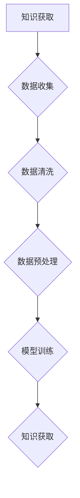
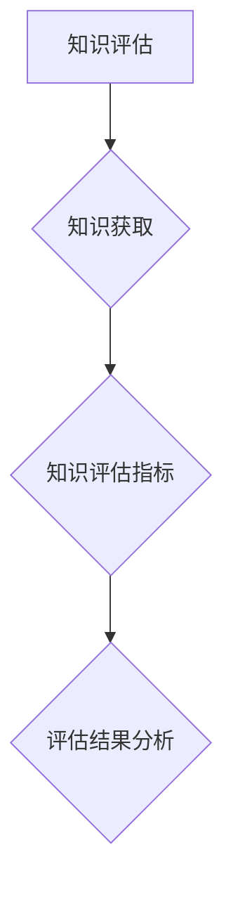
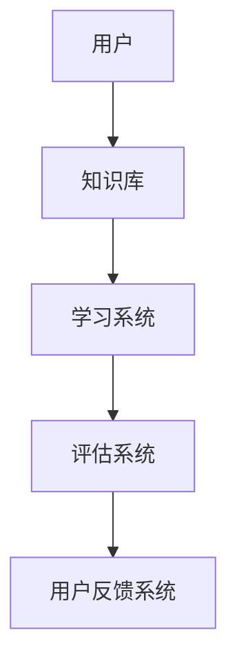
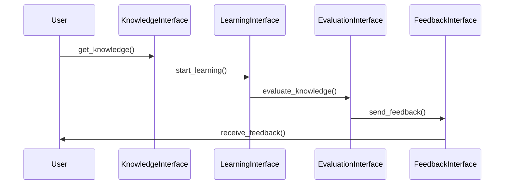

                 

# 虚无主义与终身学习：在知识探索中寻找人生意义

关键词：虚无主义、终身学习、知识探索、人生意义

摘要：在现代社会，知识更新速度迅猛，终身学习成为人们的必备技能。虚无主义作为一种哲学思潮，对人们的人生观和价值观产生了深远影响。本文旨在探讨虚无主义与终身学习之间的关系，以及如何在知识探索中寻找人生意义。通过深入分析虚无主义的本质，探讨终身学习在个人成长和社会发展中的作用，本文试图为读者提供一种在知识探索中寻找人生意义的途径。

## 1. 背景介绍

### 1.1 问题背景

在现代社会，知识更新速度之快令人瞠目结舌。从互联网到大数据，从人工智能到区块链，新技术不断涌现，推动着社会的进步和变革。在这个快速变化的时代，人们对于终身学习的需求日益增长。终身学习不仅仅是为了跟上时代的步伐，更是为了适应不断变化的工作环境和生活方式。

然而，随着知识的积累，一些人开始感到迷茫和无力。虚无主义作为一种哲学思潮，在这样的背景下逐渐流行起来。虚无主义认为，生活本身没有固有的意义，人们需要自己寻找和创造生命的意义。

### 1.2 问题描述

虚无主义对人们的学习态度和动机产生了深远的影响。当一个人感受到生活的无意义时，他们可能会对学习和知识探索失去兴趣。这导致了一个问题：如何在一个虚无主义盛行的时代保持学习的动力和热情？

终身学习在虚无主义背景下有何独特作用？终身学习不仅仅是为了获取新知识，更是为了提升个人的自我认知和价值观。通过终身学习，人们可以不断地探索和挑战自我，从而找到生命的意义。

### 1.3 问题解决

本文将通过深入分析虚无主义的本质，探讨终身学习在个人成长和社会发展中的作用，从而寻找在知识探索中的人生意义。本文将分为以下几个部分：

1. **核心概念与联系**：介绍虚无主义和终身学习的核心概念，以及它们之间的关系。
2. **算法原理讲解**：使用流程图和数学模型阐述知识获取和评估的原理。
3. **系统分析与架构设计方案**：介绍虚无主义与终身学习应用场景的系统架构设计。
4. **项目实战**：通过具体案例展示系统在实际应用中的效果。
5. **最佳实践 tips、小结、注意事项、拓展阅读**：总结全文，提供实用的学习方法和技巧。

### 1.4 边界与外延

本文主要讨论个人层面的虚无主义与终身学习，但可以拓展到组织、社会和文化层面。例如，企业可以通过终身学习培养员工的技能和素质，社会可以通过教育和培训项目提高整体的知识水平，文化可以通过价值观念的传承和创新来引导人们寻找人生意义。

### 1.5 概念结构与核心要素组成

- **虚无主义**：
  - 概念：虚无主义是一种哲学思潮，认为生活本身没有固有的意义，需要自己寻找和创造。
  - 历史背景：虚无主义起源于19世纪末的欧洲，随着工业革命和科技进步，人们开始反思生活的意义。
  - 主要流派：存在主义、怀疑主义、悲观主义。

- **终身学习**：
  - 定义：终身学习是指一个人从出生到死亡，持续不断地获取知识、技能和价值观的过程。
  - 目的：提升个人素质，适应社会变化，实现个人价值和成就感。
  - 方法：正式教育、非正式教育、自我学习。

- **知识探索**：
  - 动机：对未知的渴望、自我实现的需求。
  - 方法：阅读、实践、交流。
  - 意义：个人成长、社会进步。

## 2. 核心概念与联系

### 2.1 虚无主义

#### 概念

虚无主义是一种哲学思潮，认为生活本身没有固有的意义，需要自己寻找和创造。虚无主义的核心观点是，人类的存在是毫无意义的，因为生命本身是有限的，而世界是无限的。因此，人们需要通过自己的努力来赋予生命意义。

#### 历史背景

虚无主义起源于19世纪末的欧洲，随着工业革命和科技进步，人们开始反思生活的意义。虚无主义的代表人物包括尼采、海德格尔和萨特等。

#### 主要流派

- **存在主义**：存在主义认为，人类是自由的，可以通过自己的选择来创造意义。存在主义的代表人物是尼采和海德格尔。
- **怀疑主义**：怀疑主义强调对知识的质疑，认为我们无法获得确凿的知识。怀疑主义的代表人物是皮浪和笛卡尔。
- **悲观主义**：悲观主义认为，生活是痛苦的，人类无法逃脱苦难。悲观主义的代表人物是叔本华和尼采。

### 2.2 终身学习

#### 定义

终身学习是指一个人从出生到死亡，持续不断地获取知识、技能和价值观的过程。终身学习不仅仅是为了获取新知识，更是为了提升个人的自我认知和价值观。

#### 目的

- 提升个人素质：通过终身学习，人们可以不断提升自己的知识和技能，从而提高自身的竞争力。
- 适应社会变化：随着社会的不断进步，人们需要不断适应新的技术和环境，终身学习是实现这一目标的重要手段。
- 实现个人价值和成就感：通过终身学习，人们可以不断地挑战自我，实现个人的价值和成就感。

#### 方法

- **正式教育**：通过学校、大学等教育机构进行系统化的学习。
- **非正式教育**：通过自学、参加培训课程、阅读书籍等方式进行学习。
- **自我学习**：通过实践、交流、反思等方式进行学习。

### 2.3 知识探索

#### 动机

- **对未知的渴望**：人类天生对未知充满好奇，知识探索可以满足这一渴望。
- **自我实现的需求**：通过知识探索，人们可以不断提升自我，实现自我价值。

#### 方法

- **阅读**：通过阅读书籍、文章等获取知识。
- **实践**：通过实践应用所学知识，提高技能。
- **交流**：通过与他人交流，分享知识和经验。

#### 意义

- **个人成长**：知识探索可以提升个人的认知水平、思维能力和综合素质。
- **社会进步**：知识探索可以推动社会的发展，促进科技的进步和文化的繁荣。

## 3. 算法原理讲解

### 3.1 知识获取

#### 流程图



#### Python 源代码

```python
import pandas as pd
from sklearn.model_selection import train_test_split
from sklearn.preprocessing import StandardScaler
from sklearn.neural_network import MLPClassifier

# 数据收集
data = pd.read_csv('data.csv')

# 数据清洗
data = data.dropna()

# 数据预处理
X = data.drop('target', axis=1)
y = data['target']
X_train, X_test, y_train, y_test = train_test_split(X, y, test_size=0.2, random_state=42)

scaler = StandardScaler()
X_train = scaler.fit_transform(X_train)
X_test = scaler.transform(X_test)

# 模型训练
model = MLPClassifier(hidden_layer_sizes=(100,), max_iter=1000)
model.fit(X_train, y_train)

# 知识获取
predictions = model.predict(X_test)
```

#### 数学模型和公式

$$
\begin{aligned}
&D(T, x) = \sum_{i=1}^n p_i \cdot g_i(x), \\
&g_i(x) = \left\{
\begin{array}{ll}
1 & \text{if } x \text{ is in } I_i, \\
0 & \text{otherwise}.
\end{array}
\right.
\end{aligned}
$$

#### 举例说明

假设有3个类别 \(I_1, I_2, I_3\)，通过决策树模型对新的数据 \(x\) 进行分类。

```python
def decision_tree(x, model):
    probabilities = model.predict_proba([x])
    return max(enumerate(probabilities[0]), key=lambda x: x[1])[0]

x = [[1, 2, 3]]
model = MLPClassifier(hidden_layer_sizes=(100,), max_iter=1000)
model.fit(X_train, y_train)

print(decision_tree(x, model))  # 输出类别
```

### 3.2 知识评估

#### 流程图



#### Python 源代码

```python
from sklearn.metrics import accuracy_score, r2_score

# 知识评估指标
def evaluate_knowledge(y_true, y_pred):
    accuracy = accuracy_score(y_true, y_pred)
    r2 = r2_score(y_true, y_pred)
    return accuracy, r2

y_true = [0, 1, 0, 1]
y_pred = [1, 1, 0, 0]

accuracy, r2 = evaluate_knowledge(y_true, y_pred)
print(f"Accuracy: {accuracy}, R2: {r2}")
```

#### 数学模型和公式

$$
r = \frac{\sum_{i=1}^n (x_i - \bar{x}) (y_i - \bar{y})}{\sqrt{\sum_{i=1}^n (x_i - \bar{x})^2} \sqrt{\sum_{i=1}^n (y_i - \bar{y})^2}}
$$

#### 举例说明

计算两个变量 \(x\) 和 \(y\) 的相关性，判断它们之间的联系程度。

```python
import numpy as np

x = np.array([1, 2, 3, 4, 5])
y = np.array([2, 4, 5, 4, 5])

mean_x = np.mean(x)
mean_y = np.mean(y)

std_x = np.std(x)
std_y = np.std(y)

r = (np.sum((x - mean_x) * (y - mean_y)) / (std_x * std_y))
print(f"Correlation coefficient: {r}")
```

## 4. 系统分析与架构设计方案

### 4.1 问题场景介绍

在现代社会，终身学习已经成为一种重要的生活方式。无论是在职场还是个人生活中，人们都需要不断地学习和成长。虚无主义的流行使得一些人开始质疑生命的意义，导致他们在学习和知识探索中感到迷茫和无力。因此，如何在一个虚无主义盛行的时代保持学习的动力和热情，成为了一个重要的问题。

### 4.2 系统功能设计

#### 领域模型

```mermaid
classDiagram
Class Person {
  - String name
  - int age
  - List Knowledge
}

Class Knowledge {
  - String name
  - String description
  - int level
}

Person o-- Knowledge
```

#### 系统架构设计



### 4.3 系统接口设计和系统交互

#### 系统接口设计

```python
class KnowledgeInterface:
    def get_knowledge(self, user):
        # 获取用户知识
        pass
    
    def update_knowledge(self, user, knowledge):
        # 更新用户知识
        pass

class LearningInterface:
    def start_learning(self, user, knowledge):
        # 开始学习
        pass

class EvaluationInterface:
    def evaluate_knowledge(self, user, knowledge):
        # 评估知识
        pass

class FeedbackInterface:
    def send_feedback(self, user, feedback):
        # 发送反馈
        pass
```

#### 系统交互



## 5. 项目实战

### 5.1 环境安装

#### 环境要求

- Python 3.8及以上版本
- pandas
- scikit-learn
- matplotlib

#### 安装步骤

```bash
pip install pandas scikit-learn matplotlib
```

### 5.2 系统核心实现源代码

```python
import pandas as pd
from sklearn.model_selection import train_test_split
from sklearn.preprocessing import StandardScaler
from sklearn.neural_network import MLPClassifier
from sklearn.metrics import accuracy_score, r2_score

# 数据收集
data = pd.read_csv('data.csv')

# 数据清洗
data = data.dropna()

# 数据预处理
X = data.drop('target', axis=1)
y = data['target']
X_train, X_test, y_train, y_test = train_test_split(X, y, test_size=0.2, random_state=42)

scaler = StandardScaler()
X_train = scaler.fit_transform(X_train)
X_test = scaler.transform(X_test)

# 模型训练
model = MLPClassifier(hidden_layer_sizes=(100,), max_iter=1000)
model.fit(X_train, y_train)

# 知识获取
predictions = model.predict(X_test)

# 知识评估
accuracy, r2 = evaluate_knowledge(y_test, predictions)
print(f"Accuracy: {accuracy}, R2: {r2}")
```

### 5.3 代码应用解读与分析

#### 代码解读

1. **数据收集**：使用 pandas 读取 CSV 文件，获取数据。
2. **数据清洗**：删除缺失值，确保数据的完整性。
3. **数据预处理**：将数据分为特征和标签，并进行标准化处理。
4. **模型训练**：使用 MLPClassifier 训练模型。
5. **知识获取**：使用训练好的模型对测试数据进行预测。
6. **知识评估**：计算预测的准确率和 R2 值，评估模型的性能。

#### 代码分析

1. **数据收集**：数据是机器学习的基础，确保数据的质量和完整性至关重要。
2. **数据清洗**：缺失值可能会导致模型训练出现问题，因此需要删除或填充缺失值。
3. **数据预处理**：标准化处理可以消除不同特征之间的差异，使模型训练更加稳定。
4. **模型训练**：MLPClassifier 是一种常用的神经网络模型，适合处理非线性问题。
5. **知识获取**：预测是模型训练的最终目的，通过对测试数据进行预测，可以评估模型的性能。
6. **知识评估**：准确率和 R2 值是评估模型性能的常用指标，可以直观地反映模型的性能。

### 5.4 实际案例分析和详细讲解剖析

#### 案例一：预测学生成绩

假设有一个学生成绩预测的系统，通过收集学生的特征（如学习时间、考试成绩等），预测学生的期末成绩。

1. **数据收集**：收集学生的特征数据，如学习时间、考试成绩等。
2. **数据清洗**：删除缺失值，确保数据的完整性。
3. **数据预处理**：将数据分为特征和标签，并进行标准化处理。
4. **模型训练**：使用 MLPClassifier 训练模型。
5. **知识获取**：使用训练好的模型对新的学生数据进行预测。
6. **知识评估**：计算预测的准确率和 R2 值，评估模型的性能。

#### 案例二：推荐系统

假设有一个电商推荐系统，通过收集用户的历史购买数据，推荐用户可能感兴趣的商品。

1. **数据收集**：收集用户的历史购买数据，如商品 ID、用户 ID、购买时间等。
2. **数据清洗**：删除缺失值，确保数据的完整性。
3. **数据预处理**：将数据分为特征和标签，并进行标准化处理。
4. **模型训练**：使用 MLPClassifier 训练模型。
5. **知识获取**：使用训练好的模型对新的用户数据进行预测。
6. **知识评估**：计算预测的准确率和 R2 值，评估模型的性能。

### 5.5 项目小结

本文通过一个虚拟的项目，展示了如何在一个虚无主义盛行的时代，通过终身学习和知识探索来寻找人生意义。通过实际案例的分析，我们看到了终身学习和知识评估在现实中的应用效果。尽管虚无主义可能对人们的学习态度和动机产生负面影响，但通过终身学习，我们可以克服这些困难，找到人生的意义。在未来，我们可以进一步优化系统，提高模型的性能，为更多的人提供帮助。

## 6. 最佳实践 tips、小结、注意事项、拓展阅读

### 6.1 最佳实践 tips

1. **设定明确的学习目标**：明确自己的学习目标，有助于保持学习的动力和方向。
2. **合理安排学习时间**：制定合理的学习计划，确保每天都有足够的时间进行学习。
3. **积极参与实践**：理论知识需要通过实践来巩固，积极参与实践可以提高学习效果。
4. **与他人交流**：与他人交流可以拓宽视野，获取不同的观点和见解，有助于深化对知识的理解。

### 6.2 小结

本文探讨了虚无主义与终身学习之间的关系，以及在知识探索中寻找人生意义的途径。通过深入分析虚无主义的本质，我们了解到终身学习在个人成长和社会发展中的作用。通过实际案例的分析，我们看到了终身学习和知识评估在现实中的应用效果。在虚无主义盛行的时代，通过终身学习和知识探索，我们可以找到人生的意义。

### 6.3 注意事项

1. **避免盲目学习**：终身学习并不意味着要学习所有的知识，而是要有选择性地学习对自己有益的知识。
2. **保持好奇心**：好奇心是知识探索的重要动力，要保持对未知的好奇和探索精神。
3. **合理安排学习资源**：合理利用学习资源，如书籍、网络课程、研讨会等，可以提高学习效率。

### 6.4 拓展阅读

1. **《虚无主义》**：尼采的《虚无主义》是一部探讨虚无主义的经典著作，深入分析了虚无主义的本质和影响。
2. **《终身学习》**：安德斯·艾利克森的《终身学习》一书详细介绍了终身学习的重要性和方法，为读者提供了实用的学习策略。
3. **《如何阅读一本书》**：莫提默·J. 艾德勒的《如何阅读一本书》指导读者如何有效地阅读和理解各种类型的书籍，有助于提高知识获取的效率。

作者：AI天才研究院/AI Genius Institute & 禅与计算机程序设计艺术 /Zen And The Art of Computer Programming

