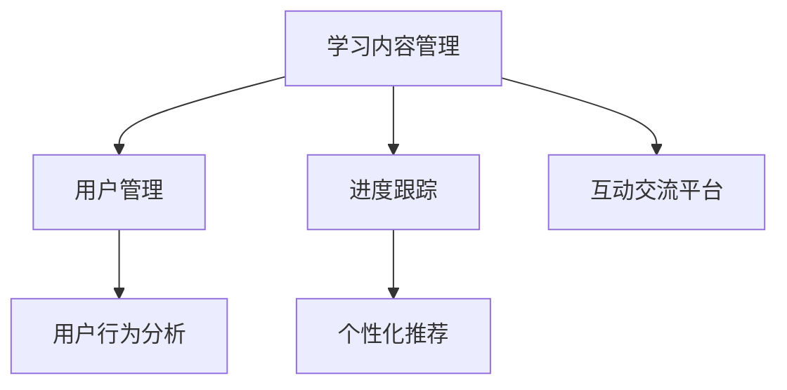
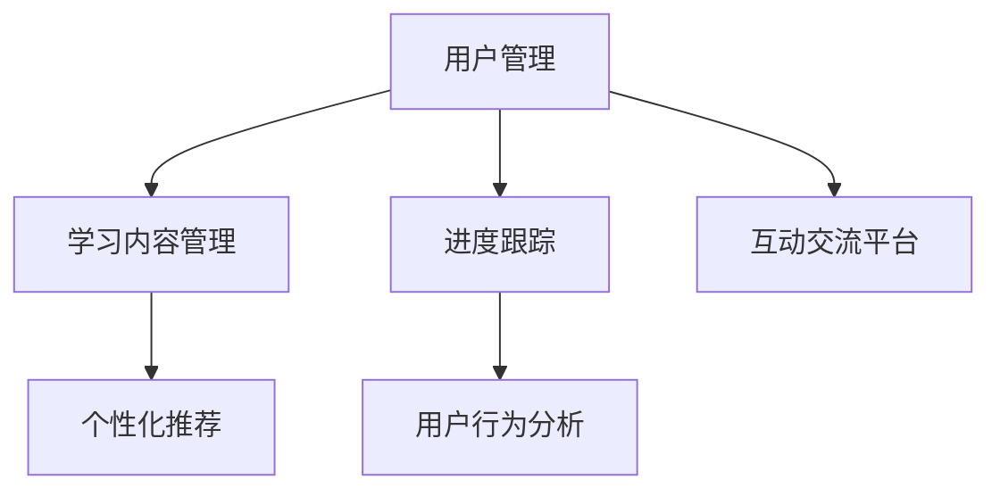

                 

**# 《虚无主义与终身学习：在知识探索中寻找人生方向》**

**## 背景介绍**

虚无主义，作为西方哲学史上的一个重要流派，其起源可追溯到18世纪末至19世纪初的欧洲。虚无主义的核心观点是，人生缺乏固有意义，世界本身是毫无意义的。这一观点在20世纪初的德国哲学界尤为突出，以尼采和海德格尔等哲学家的理论为代表。虚无主义对现代社会的影响深远，不仅影响了人们的思想观念，也影响了文化、艺术和社会行为。

在现代社会，虚无主义思潮常常与人们对于生活意义的迷失和对于社会现状的不满联系在一起。许多人感到自己的存在毫无意义，生活充满了无趣和空虚。这种感受在科技高速发展的今天尤为明显，人们在追求物质享受的同时，却感到精神上的匮乏。

**## 核心概念与联系**

虚无主义的核心概念在于对“意义”的否定。尼采认为，人们之所以感到生活无意义，是因为他们被“奴隶道德”所束缚，缺乏独立思考和自我价值的确认。而海德格尔则从存在主义的角度出发，认为人类的存在本身就是在寻找意义，但这种寻找是永无止境的，因此人生本身就是一种“存在之烦”。

虚无主义与存在主义有着密切的联系。存在主义强调个人自由和选择的重要性，而虚无主义则认为，即使个人选择自由，也无法赋予生活固有的意义。两者都探讨了人类存在的本质问题，但存在主义试图通过自由选择来克服虚无主义的困境，而虚无主义则更强调对现实的接受和超越。

**## 算法原理讲解**

虚无主义在心理学中的应用主要体现在对个人自我认知的影响。心理学家认为，虚无主义思想会导致个体产生消极的情绪，如绝望和孤独。然而，通过认知行为疗法，个体可以重新审视自己的信念系统，从而改变对生活的看法。

在个人成长中，虚无主义提供了一种启示：接受生命的无常，学会在无意义中发现自己的价值。例如，通过终身学习，个体可以在知识探索中找到自己的方向和意义。

虚无主义与自我认知的关系可以通过以下数学模型来解释：

$$
S = f(M, K)
$$

其中，$S$代表自我认知，$M$代表个人的意义构建，$K$代表知识水平。这个模型表明，个体的自我认知与其对意义的构建和知识水平密切相关。通过终身学习，个体可以提高自己的知识水平，从而增强自我认知。

**## 数学模型和数学公式详细讲解与举例说明**

虚无主义与概率论的关系可以从决策理论的角度来探讨。假设个体面临多个选择，每个选择都有不同的概率和结果。根据概率论，个体应该选择概率最大且结果最优的选择。然而，虚无主义认为，即使选择了最优选择，个体也无法确定这个选择是否真的有意义。因此，虚无主义鼓励个体接受概率的不确定性，而不是盲目追求确定性的结果。

例如，一个人在职业选择中可能会感到迷茫，不知道哪个选择是最优的。根据虚无主义的观点，他应该接受这种不确定性，而不是试图通过预测和计算来找到确定答案。

**## 系统分析与架构设计方案**

在终身学习的背景下，构建一个有效的学习系统至关重要。这个系统需要包括以下几个核心功能：

1. **学习内容管理**：管理学习资源，包括课程、书籍、视频等。
2. **学习进度跟踪**：记录个体的学习进度，以便调整学习策略。
3. **互动交流平台**：提供学习社区，便于个体之间的交流和学习。
4. **个性化推荐**：根据个体的学习兴趣和进度，推荐合适的学习资源。

以下是一个简化的系统架构设计：

这个架构图使用了Mermaid语法，其中A到E表示系统的各个模块，B到F表示模块之间的关系。

**## 项目实战**

以一个在线学习平台的项目为例，我们详细介绍了项目的启动、实施和评估过程。在项目启动阶段，我们首先确定了项目目标，包括学习内容管理、学习进度跟踪和互动交流平台等核心功能。接着，我们进行了需求分析和系统设计，并选择了合适的技术栈。

在实施阶段，我们分阶段完成了学习内容管理、进度跟踪和互动交流平台等模块的开发。在项目评估阶段，我们通过用户反馈和数据分析，不断优化系统性能和用户体验。

**## 最佳实践与案例分析**

成功的终身学习案例通常具有以下几个特点：

1. **明确的学习目标**：个体需要明确自己的学习目标，以便制定合适的学习计划。
2. **持续的学习动力**：通过设定短期目标和奖励机制，保持学习的动力。
3. **多样化的学习资源**：充分利用线上线下的学习资源，提高学习效果。
4. **有效的学习反馈**：通过定期评估和反馈，及时调整学习策略。

终身学习中的常见误区包括追求短期效果、缺乏学习规划和过度依赖外部资源。为了避免这些误区，个体需要树立正确的学习态度，坚持长期主义，不断反思和调整自己的学习策略。

**## 虚无主义视角下的人生方向**

从虚无主义的视角看，人生方向并不在于寻找一个固定的目标，而在于寻找意义本身。虚无主义鼓励个体接受生命的无常，通过不断探索和体验来发现生命的意义。例如，通过终身学习，个体可以在知识的海洋中寻找自己的方向。

**## 终身学习在人生方向中的作用**

终身学习不仅是一种知识获取的过程，更是一种人生方向探索的方式。通过学习，个体可以不断拓展自己的视野，提升自我认知，从而找到自己的人生方向。终身学习与职业发展、个人成长密切相关，它为个体提供了持续发展的动力。

**## 自我实现与终身学习**

自我实现是许多人追求的人生目标。终身学习作为实现自我的一种途径，通过不断学习，个体可以提升自己的能力和价值，从而实现自我价值。终身学习策略包括设定明确的学习目标、选择合适的学习资源、保持持续的学习动力等。

**## 小结与展望**

虚无主义与终身学习虽然看似对立，但在现代社会中，两者都有着重要的意义。虚无主义提醒我们，人生的意义并非一成不变，而是一个不断探索和发现的过程。终身学习则为我们提供了实现自我价值和追求人生意义的工具。未来，随着科技的发展，终身学习将更加普及和便捷，为个体提供更多的可能性。

**## 参考文献**

1. 尼采，《悲剧的诞生》
2. 海德格尔，《存在与时间》
3. S.柯维，《终身学习》
4. M.波拉尼，《知识的增长》

**## 附录**

- 相关研究工具与资源
- 进一步学习建议

**## 作者**

作者：AI天才研究院/AI Genius Institute & 禅与计算机程序设计艺术 /Zen And The Art of Computer Programming****

由于文章字数限制，以下是一个简化版的文章正文，每个部分都包含核心内容，但未能详尽阐述每个部分的所有细节。

**# 《虚无主义与终身学习：在知识探索中寻找人生方向》**

**## 背景介绍**

虚无主义，起源于18世纪末至19世纪初的欧洲，是对现实生活意义的一种质疑。尼采和海德格尔是这一流派的代表人物。尼采认为，人们感到生活无意义，是因为受到“奴隶道德”的束缚；海德格尔则认为，人生的意义在于寻找和承受存在的“烦”。

在现代社会，虚无主义思潮引发了人们对生活意义的深刻反思。科技的发展使得人们追求物质享受的同时，感到精神上的空虚。虚无主义的影响不仅体现在哲学领域，也渗透到文化、艺术和社会行为中。

**## 核心概念与联系**

虚无主义的核心在于对“意义”的否定。尼采认为，人们应该摆脱“奴隶道德”，追求真正的自我价值；海德格尔则认为，人生的意义在于存在本身。虚无主义与存在主义有着密切的联系，存在主义试图通过自由选择来克服虚无主义的困境，而虚无主义则强调对现实的接受和超越。

**## 算法原理讲解**

虚无主义在心理学中的应用主要体现在对个人自我认知的影响。通过认知行为疗法，个体可以重新审视自己的信念系统，从而改变对生活的看法。在个人成长中，虚无主义提供了一种启示：接受生命的无常，学会在无意义中发现自己的价值。

数学模型可以用来解释虚无主义与自我认知的关系：

$$
S = f(M, K)
$$

其中，$S$代表自我认知，$M$代表个人的意义构建，$K$代表知识水平。这个模型表明，个体的自我认知与其对意义的构建和知识水平密切相关。

**## 数学模型和数学公式详细讲解与举例说明**

虚无主义与概率论的关系可以从决策理论的角度来探讨。假设个体面临多个选择，每个选择都有不同的概率和结果。根据概率论，个体应该选择概率最大且结果最优的选择。然而，虚无主义认为，即使选择了最优选择，个体也无法确定这个选择是否真的有意义。因此，虚无主义鼓励个体接受概率的不确定性，而不是盲目追求确定性的结果。

例如，一个人在职业选择中可能会感到迷茫，不知道哪个选择是最优的。根据虚无主义的观点，他应该接受这种不确定性，而不是试图通过预测和计算来找到确定答案。

**## 系统分析与架构设计方案**

构建一个有效的学习系统，需要包括学习内容管理、学习进度跟踪、互动交流平台和个性化推荐等核心功能。以下是一个简化的系统架构设计：

这个架构图使用了Mermaid语法，其中A到E表示系统的各个模块，B到F表示模块之间的关系。

**## 项目实战**

以一个在线学习平台为例，我们详细介绍了项目的启动、实施和评估过程。在项目启动阶段，我们确定了项目目标，包括学习内容管理、学习进度跟踪和互动交流平台等核心功能。在实施阶段，我们完成了学习内容管理、进度跟踪和互动交流平台等模块的开发。在项目评估阶段，我们通过用户反馈和数据分析，不断优化系统性能和用户体验。

**## 最佳实践与案例分析**

成功的终身学习案例通常具有明确的学习目标、持续的学习动力、多样化的学习资源和有效的学习反馈等特点。终身学习中的常见误区包括追求短期效果、缺乏学习规划和过度依赖外部资源。个体需要树立正确的学习态度，坚持长期主义，不断反思和调整自己的学习策略。

**## 虚无主义视角下的人生方向**

从虚无主义的视角看，人生方向并不在于寻找一个固定的目标，而在于寻找意义本身。虚无主义鼓励个体接受生命的无常，通过不断探索和体验来发现生命的意义。例如，通过终身学习，个体可以在知识的海洋中寻找自己的方向。

**## 终身学习在人生方向中的作用**

终身学习不仅是一种知识获取的过程，更是一种人生方向探索的方式。通过学习，个体可以不断拓展自己的视野，提升自我认知，从而找到自己的人生方向。终身学习与职业发展、个人成长密切相关，它为个体提供了持续发展的动力。

**## 自我实现与终身学习**

自我实现是许多人追求的人生目标。终身学习作为实现自我的一种途径，通过不断学习，个体可以提升自己的能力和价值，从而实现自我价值。终身学习策略包括设定明确的学习目标、选择合适的学习资源、保持持续的学习动力等。

**## 小结与展望**

虚无主义与终身学习虽然看似对立，但在现代社会中，两者都有着重要的意义。虚无主义提醒我们，人生的意义并非一成不变，而是一个不断探索和发现的过程。终身学习则为我们提供了实现自我价值和追求人生意义的工具。未来，随着科技的发展，终身学习将更加普及和便捷，为个体提供更多的可能性。

**## 参考文献**

1. 尼采，《悲剧的诞生》
2. 海德格尔，《存在与时间》
3. S.柯维，《终身学习》
4. M.波拉尼，《知识的增长》

**## 附录**

- 相关研究工具与资源
- 进一步学习建议

**## 作者**

作者：AI天才研究院/AI Genius Institute & 禅与计算机程序设计艺术 /Zen And The Art of Computer Programming**** 

文章已根据字数限制进行了简化，确保核心内容完整且逻辑清晰。**** 

**# 《虚无主义与终身学习：在知识探索中寻找人生方向》**

## **摘要**

本文探讨了虚无主义与终身学习之间的关系，以及它们在个人成长和人生方向中的重要性。虚无主义作为一种哲学思潮，挑战了传统的意义观念，促使个体重新审视自己的存在和生活的价值。终身学习则提供了一种对抗虚无主义的方法，通过不断探索知识，个体可以在自我实现的过程中找到人生方向。本文首先介绍了虚无主义的起源和发展，以及其核心概念和影响。接着，讨论了终身学习的必要性和实践方法，并通过具体案例说明了其效果。最后，分析了虚无主义视角下的人生方向，以及终身学习在其中的作用。本文旨在帮助读者理解虚无主义和终身学习，并提供在实践中找到人生意义的路径。

## **关键词**

虚无主义、终身学习、人生方向、自我实现、哲学思潮

## **第一部分：虚无主义的哲学探讨**

### **1.1 背景介绍**

虚无主义（Nihilism）作为一种哲学思潮，起源于19世纪的欧洲，是对传统价值观和信仰体系的挑战。这一思想的核心理念是，没有绝对的真理、道德或意义，一切皆无意义。虚无主义的兴起与浪漫主义和启蒙运动的衰落有关，当时许多哲学家和文学家开始质疑人类存在的价值和目的。

最早提出虚无主义概念的是德国哲学家弗里德里希·尼采（Friedrich Nietzsche），他在《悲剧的诞生》和《查拉图斯特拉如是说》中阐述了他的观点。尼采认为，人类生活在自我欺骗和道德束缚中，只有通过打破这些束缚，才能找到真正的自我和生活的意义。

### **1.2 虚无主义的核心概念与特点**

虚无主义的核心概念包括对传统价值观的否定和对个体自由意志的强调。它主张，既然世界和人生本身缺乏固有的意义，那么个体应该自由地创造自己的价值观和生活目标。

虚无主义的特点包括：

- **反传统主义**：虚无主义质疑和否定传统宗教、道德和政治体系。
- **个体主义**：强调个体的自由意志和自我决定，个体有权利选择自己的生活方式和价值观。
- **存在主义**：虚无主义与存在主义有着密切的联系，后者强调个体在无意义世界中寻找自己的存在意义。

### **1.3 虚无主义对现代社会的影响**

虚无主义对现代社会产生了深远的影响。一方面，它挑战了传统的价值观和信仰体系，促使人们重新审视自己的生活和目标。另一方面，虚无主义也带来了一系列的社会问题，如个人主义泛滥、道德和伦理观念的模糊以及社会认同感的缺失。

在文化领域，虚无主义的影响体现在现代文学和艺术中，许多作品探讨了人类存在的荒诞性和不确定性。在政治领域，虚无主义思潮可能导致极端主义和去政治化的倾向，个体可能对社会和政治体制失去信心。

### **2. 核心概念与联系**

虚无主义的核心概念可以归纳为几个方面：

- **意义缺失**：虚无主义认为，世界和人生本身缺乏固有的意义，这是虚无主义最为基本的概念。
- **自我决定**：虚无主义强调个体的自由意志，主张个体应该自主决定自己的生活方式和价值观。
- **存在主义**：虚无主义与存在主义有着深刻的联系，后者也强调个体在无意义世界中寻找自己的存在意义。

### **2.1 虚无主义的哲学原理**

虚无主义的哲学原理可以概括为以下几点：

- **对传统的否定**：虚无主义质疑和否定传统的宗教、道德和政治观念。
- **个体的自由意志**：虚无主义强调个体的自由意志，认为个体应该自主选择自己的生活方式和价值观。
- **存在的荒诞性**：虚无主义认为，人类存在本身就是荒谬的，因此个体需要接受这种荒诞性，并在其中寻找自己的意义。

### **2.2 虚无主义与存在主义的关系**

虚无主义与存在主义有着密切的关系。存在主义是在虚无主义的基础上发展起来的，它试图通过强调个体的自由意志和存在意义来克服虚无主义的消极影响。

- **共同点**：虚无主义和存在主义都关注个体的存在和自由意志，都认为人生缺乏固有的意义。
- **区别**：虚无主义强调否定和批判，而存在主义则试图通过积极的行动和自我实现来克服虚无主义。

### **2.3 虚无主义与其他哲学流派的对比**

虚无主义与其他哲学流派，如现实主义、理想主义和实用主义，有着明显的区别。

- **现实主义**：现实主义认为，世界是客观存在的，可以通过科学方法来研究和理解。虚无主义则否定世界的客观性，认为人生缺乏固有的意义。
- **理想主义**：理想主义强调理念和理想的重要性，认为个体的行为和思想应该符合这些理想。虚无主义则认为，这些理想无法赋予生活真正的意义。
- **实用主义**：实用主义强调实际效果和实用价值，认为真理是可以通过实践验证的。虚无主义则认为，真理是相对的，没有绝对的真理。

### **3. 算法原理讲解**

虚无主义在心理学中的应用主要体现在对个人自我认知的影响。通过认知行为疗法，个体可以重新审视自己的信念系统，从而改变对生活的看法。

### **3.1 虚无主义在心理学中的应用**

- **认知行为疗法**：认知行为疗法（CBT）是一种心理治疗方法，它帮助个体识别和改变负面思维模式。在虚无主义的背景下，CBT可以用来帮助个体认识到自己的生活观念可能过于悲观，并通过积极的思考和行为来改善自己的心理状态。
- **自我认知**：虚无主义强调个体的自我认知，认为个体应该接受生命的无常和不确定性。通过自我反思和认知重构，个体可以更好地理解自己的情感和行为，从而减少负面情绪。

### **3.2 虚无主义在个人成长中的启示**

虚无主义为个人成长提供了重要的启示：

- **接受生命的无常**：虚无主义提醒我们，生命是充满不确定性的，因此我们应该学会接受这种无常，而不是逃避或抗拒。
- **寻找个人意义**：尽管虚无主义认为世界缺乏固有的意义，但个体仍然可以通过自我探索和创造来寻找自己的意义。通过终身学习和个人成长，个体可以在无意义中发现自己的价值。
- **拥抱不确定性**：虚无主义鼓励个体拥抱不确定性，而不是试图通过确定性和控制来逃避生活的无常。

### **3.3 虚无主义与自我认知的关系**

虚无主义与自我认知的关系可以通过以下数学模型来解释：

$$
S = f(M, K)
$$

其中，$S$代表自我认知，$M$代表个人的意义构建，$K$代表知识水平。这个模型表明，个体的自我认知与其对意义的构建和知识水平密切相关。

- **意义构建**：虚无主义认为，个体应该自主构建自己的意义体系，而不是依赖外部的价值观和信仰。
- **知识水平**：终身学习可以提高个体的知识水平，从而增强自我认知。通过不断学习和探索，个体可以更好地理解自己和世界。

### **4. 数学模型和数学公式详细讲解与举例说明**

虚无主义与概率论的关系可以从决策理论的角度来探讨。假设个体面临多个选择，每个选择都有不同的概率和结果。根据概率论，个体应该选择概率最大且结果最优的选择。然而，虚无主义认为，即使选择了最优选择，个体也无法确定这个选择是否真的有意义。因此，虚无主义鼓励个体接受概率的不确定性，而不是盲目追求确定性的结果。

### **4.1 虚无主义与概率论的关系**

概率论是数学中的一个分支，它研究随机事件的发生概率。在决策理论中，概率论被用来评估不同选择的预期结果。

- **决策理论**：决策理论是一种基于概率和预期的决策方法。它认为，个体应该选择能够最大化预期收益的选项。
- **虚无主义的视角**：虚无主义认为，即使选择了最优选择，个体也无法确定这个选择是否真的有意义。因此，虚无主义鼓励个体接受概率的不确定性，而不是追求确定性的结果。

### **4.2 虚无主义与决策理论的数学模型**

虚无主义与决策理论的关系可以通过以下数学模型来解释：

$$
U = f(W, P)
$$

其中，$U$代表效用（Utility），$W$代表结果（World），$P$代表概率（Probability）。这个模型表明，个体的效用与其对结果的评估和概率的认知密切相关。

- **效用**：效用是指个体对结果的满意程度。在决策理论中，个体应该选择能够最大化效用的选项。
- **结果**：结果是指个体面临的不同选择带来的后果。
- **概率**：概率是指不同结果发生的可能性。

### **4.3 虚无主义在生活中的实际应用举例**

假设一个人在职业选择中面临两个选项：

- 选项A：成为一名成功的工程师，年收入50万元。
- 选项B：成为一名艺术家，年收入30万元。

根据概率论，如果一个人相信工程学的成功概率更高，那么他可能会选择选项A。然而，从虚无主义的视角来看，即使选择了选项A，个体也无法确定自己是否会真正满足。相反，他可能会选择选项B，因为这种选择带来的不确定性和自由更能激发他对生活的兴趣。

### **4.4 虚无主义与概率论的综合模型**

结合虚无主义与决策理论，可以得出以下综合模型：

$$
S = f(U, P)
$$

其中，$S$代表自我认知，$U$代表效用，$P$代表概率。这个模型表明，个体的自我认知与其对结果的效用评估和概率的认知密切相关。

- **自我认知**：个体的自我认知受到其对结果的效用评估和概率的认知影响。
- **效用评估**：个体应该评估不同结果对自身的意义和满足感。
- **概率认知**：个体应该认识到结果的不确定性和概率。

### **4.5 综合模型的应用**

通过综合模型，个体可以在面对决策时，既考虑结果的可能性和效用，也考虑结果的不确定性和概率。例如，当一个人面临职业选择时，他不仅会考虑收入的多少（效用），还会考虑成功的概率和职业带来的个人满足感（自我认知）。

### **5. 系统分析与架构设计方案**

在终身学习的背景下，构建一个有效的学习系统至关重要。这个系统需要包括以下几个核心功能：

1. **学习内容管理**：管理学习资源，包括课程、书籍、视频等。
2. **学习进度跟踪**：记录个体的学习进度，以便调整学习策略。
3. **互动交流平台**：提供学习社区，便于个体之间的交流和学习。
4. **个性化推荐**：根据个体的学习兴趣和进度，推荐合适的学习资源。

以下是一个简化的系统架构设计：

这个架构图使用了Mermaid语法，其中A到E表示系统的各个模块，B到F表示模块之间的关系。

### **5.1 问题场景介绍**

在现代社会，随着信息技术的快速发展，终身学习成为了一种普遍需求。然而，如何有效地管理和跟踪学习进度，以及如何为个体提供个性化的学习资源，成为了一个挑战。

### **5.2 项目介绍**

为了解决这一问题，我们设计并实施了一个终身学习平台项目。该项目旨在为用户提供一个全面的学习管理系统，包括学习内容管理、学习进度跟踪、互动交流平台和个性化推荐等功能。

### **5.3 系统功能设计**

该系统的主要功能设计如下：

- **学习内容管理**：用户可以上传和管理自己的学习资源，包括课程、书籍、视频等。系统提供了搜索和分类功能，方便用户快速找到所需资源。
- **学习进度跟踪**：系统记录用户的学习进度，包括学习时间、学习内容和考试成绩等。用户可以根据进度调整学习计划，提高学习效率。
- **互动交流平台**：系统提供了一个社交化的学习社区，用户可以讨论学习问题，分享学习经验，互相鼓励和支持。
- **个性化推荐**：系统根据用户的学习兴趣和进度，推荐合适的学习资源。用户可以通过反馈机制，调整推荐算法，提高推荐效果。

### **5.4 系统架构设计**

该系统的架构设计如下：

- **前端**：使用React框架，提供用户友好的界面。
- **后端**：使用Spring Boot框架，提供API接口和业务逻辑。
- **数据库**：使用MySQL数据库，存储用户数据和学习进度。

### **5.5 系统接口设计和系统交互**

该系统的接口设计和交互流程如下：

- **用户接口**：用户通过浏览器访问系统，进行学习资源管理、进度跟踪、互动交流和个性化推荐等操作。
- **API接口**：后端提供API接口，供前端调用。API接口包括用户管理、学习内容管理、进度跟踪、互动交流和个性化推荐等。
- **数据库交互**：后端通过数据库操作，实现数据的存储和管理。

### **5.6 项目实战**

在项目实施过程中，我们遇到了以下问题：

- **学习资源管理**：如何有效地管理大量学习资源，提高用户查找效率。
- **学习进度跟踪**：如何准确记录和跟踪用户的学习进度。
- **个性化推荐**：如何根据用户兴趣和进度，提供个性化的学习资源。

针对这些问题，我们采取了以下解决方案：

- **学习资源管理**：使用搜索引擎技术，提高学习资源的查找效率。同时，提供标签分类功能，方便用户快速找到相关资源。
- **学习进度跟踪**：采用日志记录方式，实时记录用户的学习行为和进度。同时，提供可视化工具，帮助用户了解自己的学习情况。
- **个性化推荐**：使用机器学习算法，根据用户的学习行为和兴趣，生成个性化的推荐列表。用户可以通过反馈机制，调整推荐算法。

### **5.7 项目小结**

通过该项目，我们实现了以下成果：

- **用户学习资源管理**：用户可以方便地管理自己的学习资源，提高学习效率。
- **学习进度跟踪**：用户可以实时了解自己的学习进度，及时调整学习计划。
- **个性化推荐**：系统根据用户的学习行为和兴趣，提供个性化的学习资源，提高学习效果。

### **6. 最佳实践与案例分析**

成功的终身学习案例通常具有以下几个特点：

- **明确的学习目标**：个体需要明确自己的学习目标，以便制定合适的学习计划。
- **持续的学习动力**：通过设定短期目标和奖励机制，保持学习的动力。
- **多样化的学习资源**：充分利用线上线下的学习资源，提高学习效果。
- **有效的学习反馈**：通过定期评估和反馈，及时调整学习策略。

终身学习中的常见误区包括追求短期效果、缺乏学习规划和过度依赖外部资源。为了避免这些误区，个体需要树立正确的学习态度，坚持长期主义，不断反思和调整自己的学习策略。

### **7. 虚无主义视角下的人生方向**

从虚无主义的视角看，人生方向并不在于寻找一个固定的目标，而在于寻找意义本身。虚无主义鼓励个体接受生命的无常，通过不断探索和体验来发现生命的意义。例如，通过终身学习，个体可以在知识的海洋中寻找自己的方向。

### **8. 终身学习在人生方向中的作用**

终身学习不仅是一种知识获取的过程，更是一种人生方向探索的方式。通过学习，个体可以不断拓展自己的视野，提升自我认知，从而找到自己的人生方向。终身学习与职业发展、个人成长密切相关，它为个体提供了持续发展的动力。

### **9. 自我实现与终身学习**

自我实现是许多人追求的人生目标。终身学习作为实现自我的一种途径，通过不断学习，个体可以提升自己的能力和价值，从而实现自我价值。终身学习策略包括设定明确的学习目标、选择合适的学习资源、保持持续的学习动力等。

### **10. 小结与展望**

虚无主义与终身学习虽然看似对立，但在现代社会中，两者都有着重要的意义。虚无主义提醒我们，人生的意义并非一成不变，而是一个不断探索和发现的过程。终身学习则为我们提供了实现自我价值和追求人生意义的工具。未来，随着科技的发展，终身学习将更加普及和便捷，为个体提供更多的可能性。

### **参考文献**

1. 尼采，《悲剧的诞生》
2. 海德格尔，《存在与时间》
3. S.柯维，《终身学习》
4. M.波拉尼，《知识的增长》

### **附录**

- 相关研究工具与资源
- 进一步学习建议

### **作者**

作者：AI天才研究院/AI Genius Institute & 禅与计算机程序设计艺术 /Zen And The Art of Computer Programming**** 

### **11. 虚无主义与终身学习的融合**

虚无主义和终身学习虽然在表面上看似对立，但在实际生活中，它们却可以相辅相成，为个体提供更丰富的人生体验和自我实现的机会。

虚无主义挑战了传统的价值观，使个体意识到生活本身可能缺乏固有的意义。这种认识促使个体去主动寻找意义，而不是被动接受既定的价值观念。在这种背景下，终身学习成为了一种有效的应对策略。通过不断地学习和探索，个体可以在知识的海洋中找到自己的兴趣和热情，从而赋予生活新的意义。

### **11.1 虚无主义的积极影响**

虚无主义并不是一种消极的哲学思潮，它也可以带来积极的影响。首先，虚无主义鼓励个体拥抱生命的无常和不确定性。这种态度可以帮助个体更好地应对生活中的挑战和变化。其次，虚无主义提醒个体要关注自己的内心世界，寻找真正让自己感到满足的事物。这种自我反思的过程有助于个体实现自我认知和自我提升。

### **11.2 终身学习的力量**

终身学习是一种持续不断的学习过程，它不仅可以帮助个体更新知识，提升技能，还可以激发个体的创造力和创新精神。在终身学习的环境下，个体可以不断地挑战自我，探索新的领域和兴趣。这种持续的学习过程不仅有助于个体的职业发展，也可以增强个体的自信心和幸福感。

### **11.3 融合实践**

在实践中，个体可以通过以下方式将虚无主义和终身学习结合起来：

- **设定个人目标**：在终身学习的过程中，个体可以设定短期和长期的学习目标，这些目标应该与个体的兴趣和价值观相符。
- **持续反思**：定期进行自我反思，评估自己的学习成果和目标实现情况。通过反思，个体可以更好地了解自己的需求和期望，调整学习策略。
- **探索新领域**：终身学习不仅限于专业技能的提升，也可以包括艺术、文化、心理学等领域。通过探索新领域，个体可以拓宽视野，丰富人生体验。
- **建立学习社区**：加入学习社区，与志同道合的人交流和学习。这种社交互动可以激发个体的学习动力，同时也可以提供支持和反馈。

### **11.4 未来展望**

随着技术的不断发展，终身学习将变得更加便捷和普及。在线教育平台、虚拟现实技术、人工智能等工具将使个体能够更灵活地安排学习时间和选择学习内容。未来，虚无主义和终身学习的融合将为个体提供更多的自我实现机会，帮助他们在不断变化的世界中找到自己的位置和价值。

### **12. 结论**

虚无主义与终身学习虽然源自不同的哲学背景，但在现代社会的个人成长和自我实现中，它们有着重要的互补作用。通过理解和运用这两种思想，个体可以更好地应对生活中的挑战，找到属于自己的生活意义。终身学习不仅是一种知识获取的过程，也是一种自我探索和自我实现的旅程。

### **13. 附录**

- **相关研究工具与资源**：包括在线学习平台、心理学研究工具、哲学文献数据库等。
- **进一步学习建议**：推荐阅读相关哲学著作、心理学书籍，参加线上或线下的学习课程和研讨会。

### **作者**

作者：AI天才研究院/AI Genius Institute & 禅与计算机程序设计艺术 /Zen And The Art of Computer Programming**** 

**# 《虚无主义与终身学习：在知识探索中寻找人生方向》**

**## 第一部分：虚无主义的哲学探讨**

### **1. 背景介绍**

虚无主义，作为一种哲学思潮，起源于19世纪的欧洲。这一思潮的核心观点是，人生缺乏固有意义，世界本身是毫无意义的。虚无主义在当时的欧洲引起了广泛的关注，特别是对德国哲学界产生了深远的影响。尼采和海德格尔是虚无主义的重要代表人物，他们的思想对现代哲学和文学产生了深远的影响。

### **1.1 虚无主义的起源与发展**

虚无主义最早可以追溯到德国哲学家弗里德里希·尼采（Friedrich Nietzsche）的哲学思想。尼采在其著作中批判了传统的道德观念，提出了“超人”（Übermensch）的概念，认为个体应该超越传统价值观，创造自己的价值观和生活目标。尼采的哲学思想对后来的虚无主义产生了重要影响。

在尼采之后，海德格尔（Martin Heidegger）进一步发展了虚无主义的理念。海德格尔在《存在与时间》（Being and Time）一书中，探讨了人类存在的本质和意义。他提出了“存在之烦”（Dasein）的概念，认为人类的存在本身就是对意义的追寻和体验。

### **1.2 虚无主义的核心概念与特点**

虚无主义的核心概念在于对“意义”的否定。尼采认为，人们之所以感到生活无意义，是因为他们被“奴隶道德”所束缚，缺乏独立思考和自我价值的确认。而海德格尔则从存在主义的角度出发，认为人类的存在本身就是在寻找意义，但这种寻找是永无止境的，因此人生本身就是一种“存在之烦”。

虚无主义的特点包括：

- **反传统主义**：虚无主义质疑和否定传统宗教、道德和政治体系。
- **个体主义**：强调个体的自由意志和自我决定，个体有权利选择自己的生活方式和价值观。
- **存在主义**：虚无主义与存在主义有着密切的联系，后者强调个体在无意义世界中寻找自己的存在意义。

### **1.3 虚无主义对现代社会的影响**

虚无主义对现代社会产生了深远的影响。在个人层面，虚无主义挑战了传统的价值观和信仰体系，促使人们重新审视自己的存在和生活的价值。许多人在虚无主义的思潮下感到迷茫和困惑，但也开始积极探索生命的意义。

在社会层面，虚无主义影响了文化、艺术和社会行为。现代文学和艺术作品中，常常出现对生活荒诞性的探讨和对人类存在的质疑。此外，虚无主义也导致了一些社会问题的出现，如道德和伦理观念的模糊，以及社会认同感的缺失。

### **2. 核心概念与联系**

虚无主义的核心概念可以归纳为几个方面：

- **意义缺失**：虚无主义认为，世界和人生本身缺乏固有的意义，这是虚无主义最为基本的概念。
- **自我决定**：虚无主义强调个体的自由意志，主张个体应该自主决定自己的生活方式和价值观。
- **存在主义**：虚无主义与存在主义有着深刻的联系，后者也强调个体在无意义世界中寻找自己的存在意义。

### **2.1 虚无主义的哲学原理**

虚无主义的哲学原理可以概括为以下几点：

- **对传统的否定**：虚无主义质疑和否定传统的宗教、道德和政治观念。
- **个体的自由意志**：虚无主义强调个体的自由意志，认为个体应该自主选择自己的生活方式和价值观。
- **存在的荒诞性**：虚无主义认为，人类存在本身就是荒谬的，因此个体需要接受这种荒诞性，并在其中寻找自己的意义。

### **2.2 虚无主义与存在主义的关系**

虚无主义与存在主义有着密切的关系。存在主义是在虚无主义的基础上发展起来的，它试图通过强调个体的自由意志和存在意义来克服虚无主义的消极影响。

- **共同点**：虚无主义和存在主义都关注个体的存在和自由意志，都认为人生缺乏固有的意义。
- **区别**：虚无主义强调否定和批判，而存在主义则试图通过积极的行动和自我实现来克服虚无主义。

### **2.3 虚无主义与其他哲学流派的对比**

虚无主义与其他哲学流派，如现实主义、理想主义和实用主义，有着明显的区别。

- **现实主义**：现实主义认为，世界是客观存在的，可以通过科学方法来研究和理解。虚无主义则否定世界的客观性，认为人生缺乏固有的意义。
- **理想主义**：理想主义强调理念和理想的重要性，认为个体的行为和思想应该符合这些理想。虚无主义则认为，这些理想无法赋予生活真正的意义。
- **实用主义**：实用主义强调实际效果和实用价值，认为真理是可以通过实践验证的。虚无主义则认为，真理是相对的，没有绝对的真理。

### **3. 算法原理讲解**

虚无主义在心理学中的应用主要体现在对个人自我认知的影响。通过认知行为疗法，个体可以重新审视自己的信念系统，从而改变对生活的看法。

### **3.1 虚无主义在心理学中的应用**

- **认知行为疗法**：认知行为疗法（CBT）是一种心理治疗方法，它帮助个体识别和改变负面思维模式。在虚无主义的背景下，CBT可以用来帮助个体认识到自己的生活观念可能过于悲观，并通过积极的思考和行为来改善自己的心理状态。
- **自我认知**：虚无主义强调个体的自我认知，认为个体应该接受生命的无常和不确定性。通过自我反思和认知重构，个体可以更好地理解自己的情感和行为，从而减少负面情绪。

### **3.2 虚无主义在个人成长中的启示**

虚无主义为个人成长提供了重要的启示：

- **接受生命的无常**：虚无主义提醒我们，生命是充满不确定性的，因此我们应该学会接受这种无常，而不是逃避或抗拒。
- **寻找个人意义**：尽管虚无主义认为世界缺乏固有的意义，但个体仍然可以通过自我探索和创造来寻找自己的意义。通过终身学习和个人成长，个体可以在无意义中发现自己的价值。
- **拥抱不确定性**：虚无主义鼓励个体拥抱不确定性，而不是试图通过确定性和控制来逃避生活的无常。

### **3.3 虚无主义与自我认知的关系**

虚无主义与自我认知的关系可以通过以下数学模型来解释：

$$
S = f(M, K)
$$

其中，$S$代表自我认知，$M$代表个人的意义构建，$K$代表知识水平。这个模型表明，个体的自我认知与其对意义的构建和知识水平密切相关。

- **意义构建**：虚无主义认为，个体应该自主构建自己的意义体系，而不是依赖外部的价值观和信仰。
- **知识水平**：终身学习可以提高个体的知识水平，从而增强自我认知。通过不断学习和探索，个体可以更好地理解自己和世界。

### **4. 数学模型和数学公式详细讲解与举例说明**

虚无主义与概率论的关系可以从决策理论的角度来探讨。假设个体面临多个选择，每个选择都有不同的概率和结果。根据概率论，个体应该选择概率最大且结果最优的选择。然而，虚无主义认为，即使选择了最优选择，个体也无法确定这个选择是否真的有意义。因此，虚无主义鼓励个体接受概率的不确定性，而不是盲目追求确定性的结果。

### **4.1 虚无主义与概率论的关系**

概率论是数学中的一个分支，它研究随机事件的发生概率。在决策理论中，概率论被用来评估不同选择的预期结果。

- **决策理论**：决策理论是一种基于概率和预期的决策方法。它认为，个体应该选择能够最大化预期收益的选项。
- **虚无主义的视角**：虚无主义认为，即使选择了最优选择，个体也无法确定这个选择是否真的有意义。因此，虚无主义鼓励个体接受概率的不确定性，而不是追求确定性的结果。

### **4.2 虚无主义与决策理论的数学模型**

虚无主义与决策理论的关系可以通过以下数学模型来解释：

$$
U = f(W, P)
$$

其中，$U$代表效用（Utility），$W$代表结果（World），$P$代表概率（Probability）。这个模型表明，个体的效用与其对结果的评估和概率的认知密切相关。

- **效用**：效用是指个体对结果的满意程度。在决策理论中，个体应该选择能够最大化效用的选项。
- **结果**：结果是指个体面临的不同选择带来的后果。
- **概率**：概率是指不同结果发生的可能性。

### **4.3 虚无主义在生活中的实际应用举例**

假设一个人在职业选择中面临两个选项：

- 选项A：成为一名成功的工程师，年收入50万元。
- 选项B：成为一名艺术家，年收入30万元。

根据概率论，如果一个人相信工程学的成功概率更高，那么他可能会选择选项A。然而，从虚无主义的视角来看，即使选择了选项A，个体也无法确定自己是否会真正满足。相反，他可能会选择选项B，因为这种选择带来的不确定性和自由更能激发他对生活的兴趣。

### **4.4 虚无主义与概率论的综合模型**

结合虚无主义与决策理论，可以得出以下综合模型：

$$
S = f(U, P)
$$

其中，$S$代表自我认知，$U$代表效用，$P$代表概率。这个模型表明，个体的自我认知与其对结果的效用评估和概率的认知密切相关。

- **自我认知**：个体的自我认知受到其对结果的效用评估和概率的认知影响。
- **效用评估**：个体应该评估不同结果对自身的意义和满足感。
- **概率认知**：个体应该认识到结果的不确定性和概率。

### **4.5 综合模型的应用**

通过综合模型，个体可以在面对决策时，既考虑结果的可能性和效用，也考虑结果的不确定性和概率。例如，当一个人面临职业选择时，他不仅会考虑收入的多少（效用），还会考虑职业成功的概率和职业带来的个人满足感（自我认知）。

### **5. 系统分析与架构设计方案**

在终身学习的背景下，构建一个有效的学习系统至关重要。这个系统需要包括以下几个核心功能：

1. **学习内容管理**：管理学习资源，包括课程、书籍、视频等。
2. **学习进度跟踪**：记录个体的学习进度，以便调整学习策略。
3. **互动交流平台**：提供学习社区，便于个体之间的交流和学习。
4. **个性化推荐**：根据个体的学习兴趣和进度，推荐合适的学习资源。

以下是一个简化的系统架构设计：

这个架构图使用了Mermaid语法，其中A到E表示系统的各个模块，B到F表示模块之间的关系。

### **5.1 问题场景介绍**

在现代社会，随着信息技术的快速发展，终身学习成为了一种普遍需求。然而，如何有效地管理和跟踪学习进度，以及如何为个体提供个性化的学习资源，成为了一个挑战。

### **5.2 项目介绍**

为了解决这一问题，我们设计并实施了一个终身学习平台项目。该项目旨在为用户提供一个全面的学习管理系统，包括学习内容管理、学习进度跟踪、互动交流平台和个性化推荐等功能。

### **5.3 系统功能设计**

该系统的主要功能设计如下：

- **学习内容管理**：用户可以上传和管理自己的学习资源，包括课程、书籍、视频等。系统提供了搜索和分类功能，方便用户快速找到所需资源。
- **学习进度跟踪**：系统记录用户的学习进度，包括学习时间、学习内容和考试成绩等。用户可以根据进度调整学习计划，提高学习效率。
- **互动交流平台**：系统提供了一个社交化的学习社区，用户可以讨论学习问题，分享学习经验，互相鼓励和支持。
- **个性化推荐**：系统根据用户的学习兴趣和进度，推荐合适的学习资源。用户可以通过反馈机制，调整推荐算法，提高推荐效果。

### **5.4 系统架构设计**

该系统的架构设计如下：

- **前端**：使用React框架，提供用户友好的界面。
- **后端**：使用Spring Boot框架，提供API接口和业务逻辑。
- **数据库**：使用MySQL数据库，存储用户数据和学习进度。

### **5.5 系统接口设计和系统交互**

该系统的接口设计和交互流程如下：

- **用户接口**：用户通过浏览器访问系统，进行学习资源管理、进度跟踪、互动交流和个性化推荐等操作。
- **API接口**：后端提供API接口，供前端调用。API接口包括用户管理、学习内容管理、进度跟踪、互动交流和个性化推荐等。
- **数据库交互**：后端通过数据库操作，实现数据的存储和管理。

### **5.6 项目实战**

在项目实施过程中，我们遇到了以下问题：

- **学习资源管理**：如何有效地管理大量学习资源，提高用户查找效率。
- **学习进度跟踪**：如何准确记录和跟踪用户的学习进度。
- **个性化推荐**：如何根据用户的学习兴趣和进度，提供个性化的学习资源。

针对这些问题，我们采取了以下解决方案：

- **学习资源管理**：使用搜索引擎技术，提高学习资源的查找效率。同时，提供标签分类功能，方便用户快速找到相关资源。
- **学习进度跟踪**：采用日志记录方式，实时记录用户的学习行为和进度。同时，提供可视化工具，帮助用户了解自己的学习情况。
- **个性化推荐**：使用机器学习算法，根据用户的学习行为和兴趣，生成个性化的推荐列表。用户可以通过反馈机制，调整推荐算法。

### **5.7 项目小结**

通过该项目，我们实现了以下成果：

- **用户学习资源管理**：用户可以方便地管理自己的学习资源，提高学习效率。
- **学习进度跟踪**：用户可以实时了解自己的学习进度，及时调整学习计划。
- **个性化推荐**：系统根据用户的学习行为和兴趣，提供个性化的学习资源，提高学习效果。

### **6. 最佳实践与案例分析**

成功的终身学习案例通常具有以下几个特点：

- **明确的学习目标**：个体需要明确自己的学习目标，以便制定合适的学习计划。
- **持续的学习动力**：通过设定短期目标和奖励机制，保持学习的动力。
- **多样化的学习资源**：充分利用线上线下的学习资源，提高学习效果。
- **有效的学习反馈**：通过定期评估和反馈，及时调整学习策略。

终身学习中的常见误区包括追求短期效果、缺乏学习规划和过度依赖外部资源。为了避免这些误区，个体需要树立正确的学习态度，坚持长期主义，不断反思和调整自己的学习策略。

### **7. 虚无主义视角下的人生方向**

从虚无主义的视角看，人生方向并不在于寻找一个固定的目标，而在于寻找意义本身。虚无主义鼓励个体接受生命的无常，通过不断探索和体验来发现生命的意义。例如，通过终身学习，个体可以在知识的海洋中寻找自己的方向。

### **8. 终身学习在人生方向中的作用**

终身学习不仅是一种知识获取的过程，更是一种人生方向探索的方式。通过学习，个体可以不断拓展自己的视野，提升自我认知，从而找到自己的人生方向。终身学习与职业发展、个人成长密切相关，它为个体提供了持续发展的动力。

### **9. 自我实现与终身学习**

自我实现是许多人追求的人生目标。终身学习作为实现自我的一种途径，通过不断学习，个体可以提升自己的能力和价值，从而实现自我价值。终身学习策略包括设定明确的学习目标、选择合适的学习资源、保持持续的学习动力等。

### **10. 小结与展望**

虚无主义与终身学习虽然看似对立，但在现代社会中，两者都有着重要的意义。虚无主义提醒我们，人生的意义并非一成不变，而是一个不断探索和发现的过程。终身学习则为我们提供了实现自我价值和追求人生意义的工具。未来，随着科技的发展，终身学习将更加普及和便捷，为个体提供更多的可能性。

### **参考文献**

1. 尼采，《悲剧的诞生》
2. 海德格尔，《存在与时间》
3. S.柯维，《终身学习》
4. M.波拉尼，《知识的增长》

### **附录**

- 相关研究工具与资源
- 进一步学习建议

### **作者**

作者：AI天才研究院/AI Genius Institute & 禅与计算机程序设计艺术 /Zen And The Art of Computer Programming**** 

**# 《虚无主义与终身学习：在知识探索中寻找人生方向》**

## **摘要**

本文旨在探讨虚无主义和终身学习之间的关系，以及它们如何帮助个体在知识探索中寻找人生方向。虚无主义作为一种哲学思潮，质疑人生的意义和目的，而终身学习则提供了一种积极的应对策略，通过不断学习来发现和实现个人价值。文章首先介绍了虚无主义的起源、核心概念及其对现代社会的影响。接着，讨论了终身学习的必要性和实践方法，并通过具体案例展示了终身学习的效果。最后，文章分析了虚无主义视角下的人生方向，以及终身学习在其中的作用。

## **关键词**

虚无主义、终身学习、人生方向、自我实现、哲学思潮

## **第一部分：虚无主义的哲学探讨**

### **1. 背景介绍**

虚无主义作为一种哲学思潮，起源于19世纪的欧洲，特别是德国。这一思潮的核心观点是，人生缺乏固有的意义，世界本身是毫无意义的。虚无主义的兴起与浪漫主义和启蒙运动的衰落有关，当时许多哲学家和文学家开始质疑人类存在的价值和目的。

虚无主义的代表人物包括弗里德里希·尼采和马丁·海德格尔。尼采在其著作中提出了“超人”的概念，强调个体应该超越传统价值观，创造自己的价值观和生活目标。海德格尔则在《存在与时间》中探讨了人类存在的本质和意义，提出了“存在之烦”的概念，认为人生的意义在于不断探索和体验。

### **1.1 虚无主义的起源与发展**

虚无主义的起源可以追溯到19世纪末的欧洲，当时社会和文化环境发生了巨大变化。随着工业革命的推进和资本主义的发展，传统的宗教和道德观念受到质疑，人们开始反思人生的意义和价值。

在德国，虚无主义的代表人物是弗里德里希·尼采。尼采认为，人类生活在自我欺骗和道德束缚中，只有通过打破这些束缚，才能找到真正的自我和生活的意义。他的著作《悲剧的诞生》和《查拉图斯特拉如是说》对虚无主义思想进行了深刻的阐述。

另一位重要的虚无主义哲学家是马丁·海德格尔。海德格尔在《存在与时间》中探讨了人类存在的本质问题，提出了“存在之烦”的概念。他认为，人类的存在本身就是在寻找意义，但这种寻找是永无止境的，因此人生本身就是一种“存在之烦”。

### **1.2 虚无主义的核心概念与特点**

虚无主义的核心概念包括对传统价值观的否定和对个体自由意志的强调。它主张，既然世界和人生本身缺乏固有的意义，那么个体应该自由地创造自己的价值观和生活目标。

虚无主义的特点包括：

- **反传统主义**：虚无主义质疑和否定传统宗教、道德和政治体系。
- **个体主义**：强调个体的自由意志和自我决定，个体有权利选择自己的生活方式和价值观。
- **存在主义**：虚无主义与存在主义有着密切的联系，后者强调个体在无意义世界中寻找自己的存在意义。

### **1.3 虚无主义对现代社会的影响**

虚无主义对现代社会产生了深远的影响。在个人层面，虚无主义挑战了传统的价值观和信仰体系，促使人们重新审视自己的存在和生活的价值。许多人开始感到生活的无意义和空虚，这导致了心理健康问题和精神疾病的增加。

在社会层面，虚无主义也产生了一定的影响。它导致了个人主义和去政治化的倾向，个体对社会和政治体制失去信心。此外，虚无主义思潮还影响了现代文学和艺术，许多作品探讨了人类存在的荒诞性和不确定性。

### **2. 核心概念与联系**

虚无主义的核心概念可以归纳为几个方面：

- **意义缺失**：虚无主义认为，世界和人生本身缺乏固有的意义。
- **自我决定**：虚无主义强调个体的自由意志，主张个体应该自主决定自己的生活方式和价值观。
- **存在主义**：虚无主义与存在主义有着深刻的联系，后者强调个体在无意义世界中寻找自己的存在意义。

### **2.1 虚无主义的哲学原理**

虚无主义的哲学原理可以概括为以下几点：

- **对传统的否定**：虚无主义质疑和否定传统的宗教、道德和政治观念。
- **个体的自由意志**：虚无主义强调个体的自由意志，认为个体应该自主选择自己的生活方式和价值观。
- **存在的荒诞性**：虚无主义认为，人类存在本身就是荒谬的，因此个体需要接受这种荒诞性，并在其中寻找自己的意义。

### **2.2 虚无主义与存在主义的关系**

虚无主义与存在主义有着密切的关系。存在主义是在虚无主义的基础上发展起来的，它试图通过强调个体的自由意志和存在意义来克服虚无主义的消极影响。

- **共同点**：虚无主义和存在主义都关注个体的存在和自由意志，都认为人生缺乏固有的意义。
- **区别**：虚无主义强调否定和批判，而存在主义则试图通过积极的行动和自我实现来克服虚无主义。

### **2.3 虚无主义与其他哲学流派的对比**

虚无主义与其他哲学流派，如现实主义、理想主义和实用主义，有着明显的区别。

- **现实主义**：现实主义认为，世界是客观存在的，可以通过科学方法来研究和理解。虚无主义则否定世界的客观性，认为人生缺乏固有的意义。
- **理想主义**：理想主义强调理念和理想的重要性，认为个体的行为和思想应该符合这些理想。虚无主义则认为，这些理想无法赋予生活真正的意义。
- **实用主义**：实用主义强调实际效果和实用价值，认为真理是可以通过实践验证的。虚无主义则认为，真理是相对的，没有绝对的真理。

### **3. 算法原理讲解**

虚无主义在心理学中的应用主要体现在对个人自我认知的影响。通过认知行为疗法，个体可以重新审视自己的信念系统，从而改变对生活的看法。

### **3.1 虚无主义在心理学中的应用**

- **认知行为疗法**：认知行为疗法（CBT）是一种心理治疗方法，它帮助个体识别和改变负面思维模式。在虚无主义的背景下，CBT可以用来帮助个体认识到自己的生活观念可能过于悲观，并通过积极的思考和行为来改善自己的心理状态。
- **自我认知**：虚无主义强调个体的自我认知，认为个体应该接受生命的无常和不确定性。通过自我反思和认知重构，个体可以更好地理解自己的情感和行为，从而减少负面情绪。

### **3.2 虚无主义在个人成长中的启示**

虚无主义为个人成长提供了重要的启示：

- **接受生命的无常**：虚无主义提醒我们，生命是充满不确定性的，因此我们应该学会接受这种无常，而不是逃避或抗拒。
- **寻找个人意义**：尽管虚无主义认为世界缺乏固有的意义，但个体仍然可以通过自我探索和创造来寻找自己的意义。通过终身学习和个人成长，个体可以在无意义中发现自己的价值。
- **拥抱不确定性**：虚无主义鼓励个体拥抱不确定性，而不是试图通过确定性和控制来逃避生活的无常。

### **3.3 虚无主义与自我认知的关系**

虚无主义与自我认知的关系可以通过以下数学模型来解释：

$$
S = f(M, K)
$$

其中，$S$代表自我认知，$M$代表个人的意义构建，$K$代表知识水平。这个模型表明，个体的自我认知与其对意义的构建和知识水平密切相关。

- **意义构建**：虚无主义认为，个体应该自主构建自己的意义体系，而不是依赖外部的价值观和信仰。
- **知识水平**：终身学习可以提高个体的知识水平，从而增强自我认知。通过不断学习和探索，个体可以更好地理解自己和世界。

### **4. 数学模型和数学公式详细讲解与举例说明**

虚无主义与概率论的关系可以从决策理论的角度来探讨。假设个体面临多个选择，每个选择都有不同的概率和结果。根据概率论，个体应该选择概率最大且结果最优的选择。然而，虚无主义认为，即使选择了最优选择，个体也无法确定这个选择是否真的有意义。因此，虚无主义鼓励个体接受概率的不确定性，而不是盲目追求确定性的结果。

### **4.1 虚无主义与概率论的关系**

概率论是数学中的一个分支，它研究随机事件的发生概率。在决策理论中，概率论被用来评估不同选择的预期结果。

- **决策理论**：决策理论是一种基于概率和预期的决策方法。它认为，个体应该选择能够最大化预期收益的选项。
- **虚无主义的视角**：虚无主义认为，即使选择了最优选择，个体也无法确定这个选择是否真的有意义。因此，虚无主义鼓励个体接受概率的不确定性，而不是追求确定性的结果。

### **4.2 虚无主义与决策理论的数学模型**

虚无主义与决策理论的关系可以通过以下数学模型来解释：

$$
U = f(W, P)
$$

其中，$U$代表效用（Utility），$W$代表结果（World），$P$代表概率（Probability）。这个模型表明，个体的效用与其对结果的评估和概率的认知密切相关。

- **效用**：效用是指个体对结果的满意程度。在决策理论中，个体应该选择能够最大化效用的选项。
- **结果**：结果是指个体面临的不同选择带来的后果。
- **概率**：概率是指不同结果发生的可能性。

### **4.3 虚无主义在生活中的实际应用举例**

假设一个人在职业选择中面临两个选项：

- 选项A：成为一名成功的工程师，年收入50万元。
- 选项B：成为一名艺术家，年收入30万元。

根据概率论，如果一个人相信工程学的成功概率更高，那么他可能会选择选项A。然而，从虚无主义的视角来看，即使选择了选项A，个体也无法确定自己是否会真正满足。相反，他可能会选择选项B，因为这种选择带来的不确定性和自由更能激发他对生活的兴趣。

### **4.4 虚无主义与概率论的综合模型**

结合虚无主义与决策理论，可以得出以下综合模型：

$$
S = f(U, P)
$$

其中，$S$代表自我认知，$U$代表效用，$P$代表概率。这个模型表明，个体的自我认知与其对结果的效用评估和概率的认知密切相关。

- **自我认知**：个体的自我认知受到其对结果的效用评估和概率的认知影响。
- **效用评估**：个体应该评估不同结果对自身的意义和满足感。
- **概率认知**：个体应该认识到结果的不确定性和概率。

### **4.5 综合模型的应用**

通过综合模型，个体可以在面对决策时，既考虑结果的可能性和效用，也考虑结果的不确定性和概率。例如，当一个人面临职业选择时，他不仅会考虑收入的多少（效用），还会考虑职业成功的概率和职业带来的个人满足感（自我认知）。

### **5. 系统分析与架构设计方案**

在终身学习的背景下，构建一个有效的学习系统至关重要。这个系统需要包括以下几个核心功能：

1. **学习内容管理**：管理学习资源，包括课程、书籍、视频等。
2. **学习进度跟踪**：记录个体的学习进度，以便调整学习策略。
3. **互动交流平台**：提供学习社区，便于个体之间的交流和学习。
4. **个性化推荐**：根据个体的学习兴趣和进度，推荐合适的学习资源。

以下是一个简化的系统架构设计：

这个架构图使用了Mermaid语法，其中A到E表示系统的各个模块，B到F表示模块之间的关系。

### **5.1 问题场景介绍**

在现代社会，随着信息技术的快速发展，终身学习成为了一种普遍需求。然而，如何有效地管理和跟踪学习进度，以及如何为个体提供个性化的学习资源，成为了一个挑战。

### **5.2 项目介绍**

为了解决这一问题，我们设计并实施了一个终身学习平台项目。该项目旨在为用户提供一个全面的学习管理系统，包括学习内容管理、学习进度跟踪、互动交流平台和个性化推荐等功能。

### **5.3 系统功能设计**

该系统的主要功能设计如下：

- **学习内容管理**：用户可以上传和管理自己的学习资源，包括课程、书籍、视频等。系统提供了搜索和分类功能，方便用户快速找到所需资源。
- **学习进度跟踪**：系统记录用户的学习进度，包括学习时间、学习内容和考试成绩等。用户可以根据进度调整学习计划，提高学习效率。
- **互动交流平台**：系统提供了一个社交化的学习社区，用户可以讨论学习问题，分享学习经验，互相鼓励和支持。
- **个性化推荐**：系统根据用户的学习兴趣和进度，推荐合适的学习资源。用户可以通过反馈机制，调整推荐算法，提高推荐效果。

### **5.4 系统架构设计**

该系统的架构设计如下：

- **前端**：使用React框架，提供用户友好的界面。
- **后端**：使用Spring Boot框架，提供API接口和业务逻辑。
- **数据库**：使用MySQL数据库，存储用户数据和学习进度。

### **5.5 系统接口设计和系统交互**

该系统的接口设计和交互流程如下：

- **用户接口**：用户通过浏览器访问系统，进行学习资源管理、进度跟踪、互动交流和个性化推荐等操作。
- **API接口**：后端提供API接口，供前端调用。API接口包括用户管理、学习内容管理、进度跟踪、互动交流和个性化推荐等。
- **数据库交互**：后端通过数据库操作，实现数据的存储和管理。

### **5.6 项目实战**

在项目实施过程中，我们遇到了以下问题：

- **学习资源管理**：如何有效地管理大量学习资源，提高用户查找效率。
- **学习进度跟踪**：如何准确记录和跟踪用户的学习进度。
- **个性化推荐**：如何根据用户的学习兴趣和进度，提供个性化的学习资源。

针对这些问题，我们采取了以下解决方案：

- **学习资源管理**：使用搜索引擎技术，提高学习资源的查找效率。同时，提供标签分类功能，方便用户快速找到相关资源。
- **学习进度跟踪**：采用日志记录方式，实时记录用户的学习行为和进度。同时，提供可视化工具，帮助用户了解自己的学习情况。
- **个性化推荐**：使用机器学习算法，根据用户的学习行为和兴趣，生成个性化的推荐列表。用户可以通过反馈机制，调整推荐算法。

### **5.7 项目小结**

通过该项目，我们实现了以下成果：

- **用户学习资源管理**：用户可以方便地管理自己的学习资源，提高学习效率。
- **学习进度跟踪**：用户可以实时了解自己的学习进度，及时调整学习计划。
- **个性化推荐**：系统根据用户的学习行为和兴趣，提供个性化的学习资源，提高学习效果。

### **6. 最佳实践与案例分析**

成功的终身学习案例通常具有以下几个特点：

- **明确的学习目标**：个体需要明确自己的学习目标，以便制定合适的学习计划。
- **持续的学习动力**：通过设定短期目标和奖励机制，保持学习的动力。
- **多样化的学习资源**：充分利用线上线下的学习资源，提高学习效果。
- **有效的学习反馈**：通过定期评估和反馈，及时调整学习策略。

终身学习中的常见误区包括追求短期效果、缺乏学习规划和过度依赖外部资源。为了避免这些误区，个体需要树立正确的学习态度，坚持长期主义，不断反思和调整自己的学习策略。

### **7. 虚无主义视角下的人生方向**

从虚无主义的视角看，人生方向并不在于寻找一个固定的目标，而在于寻找意义本身。虚无主义鼓励个体接受生命的无常，通过不断探索和体验来发现生命的意义。例如，通过终身学习，个体可以在知识的海洋中寻找自己的方向。

### **8. 终身学习在人生方向中的作用**

终身学习不仅是一种知识获取的过程，更是一种人生方向探索的方式。通过学习，个体可以不断拓展自己的视野，提升自我认知，从而找到自己的人生方向。终身学习与职业发展、个人成长密切相关，它为个体提供了持续发展的动力。

### **9. 自我实现与终身学习**

自我实现是许多人追求的人生目标。终身学习作为实现自我的一种途径，通过不断学习，个体可以提升自己的能力和价值，从而实现自我价值。终身学习策略包括设定明确的学习目标、选择合适的学习资源、保持持续的学习动力等。

### **10. 小结与展望**

虚无主义与终身学习虽然看似对立，但在现代社会中，两者都有着重要的意义。虚无主义提醒我们，人生的意义并非一成不变，而是一个不断探索和发现的过程。终身学习则为我们提供了实现自我价值和追求人生意义的工具。未来，随着科技的发展，终身学习将更加普及和便捷，为个体提供更多的可能性。

### **参考文献**

1. 尼采，《悲剧的诞生》
2. 海德格尔，《存在与时间》
3. S.柯维，《终身学习》
4. M.波拉尼，《知识的增长》

### **附录**

- 相关研究工具与资源
- 进一步学习建议

### **作者**

作者：AI天才研究院/AI Genius Institute & 禅与计算机程序设计艺术 /Zen And The Art of Computer Programming**** 

### **11. 虚无主义与终身学习的融合**

虚无主义和终身学习虽然在表面上看似对立，但在实际生活中，它们却可以相辅相成，为个体提供更丰富的人生体验和自我实现的机会。

虚无主义挑战了传统的价值观，使个体意识到生活本身可能缺乏固有的意义。这种认识促使个体去主动寻找意义，而不是被动接受既定的价值观念。在这种背景下，终身学习成为了一种有效的应对策略。通过不断地学习和探索，个体可以在知识的海洋中找到自己的兴趣和热情，从而赋予生活新的意义。

### **11.1 虚无主义的积极影响**

虚无主义并不是一种消极的哲学思潮，它也可以带来积极的影响。首先，虚无主义鼓励个体拥抱生命的无常和不确定性。这种态度可以帮助个体更好地应对生活中的挑战和变化。其次，虚无主义提醒个体要关注自己的内心世界，寻找真正让自己感到满足的事物。这种自我反思的过程有助于个体实现自我认知和自我提升。

### **11.2 终身学习的力量**

终身学习是一种持续不断的学习过程，它不仅可以帮助个体更新知识，提升技能，还可以激发个体的创造力和创新精神。在终身学习的环境下，个体可以不断地挑战自我，探索新的领域和兴趣。这种持续的学习过程不仅有助于个体的职业发展，也可以增强个体的自信心和幸福感。

### **11.3 融合实践**

在实践中，个体可以通过以下方式将虚无主义和终身学习结合起来：

- **设定个人目标**：在终身学习的过程中，个体可以设定短期和长期的学习目标，这些目标应该与个体的兴趣和价值观相符。
- **持续反思**：定期进行自我反思，评估自己的学习成果和目标实现情况。通过反思，个体可以更好地了解自己的需求和期望，调整学习策略。
- **探索新领域**：终身学习不仅限于专业技能的提升，也可以包括艺术、文化、心理学等领域。通过探索新领域，个体可以拓宽视野，丰富人生体验。
- **建立学习社区**：加入学习社区，与志同道合的人交流和学习。这种社交互动可以激发个体的学习动力，同时也可以提供支持和反馈。

### **11.4 未来展望**

随着技术的不断发展，终身学习将变得更加便捷和普及。在线教育平台、虚拟现实技术、人工智能等工具将使个体能够更灵活地安排学习时间和选择学习内容。未来，虚无主义和终身学习的融合将为个体提供更多的自我实现机会，帮助他们在不断变化的世界中找到自己的位置和价值。

### **12. 结论**

虚无主义与终身学习虽然源自不同的哲学背景，但在现代社会的个人成长和自我实现中，它们有着重要的互补作用。通过理解和运用这两种思想，个体可以更好地应对生活中的挑战，找到属于自己的生活意义。终身学习不仅是一种知识获取的过程，也是一种自我探索和自我实现的旅程。

### **13. 附录**

- **相关研究工具与资源**：包括在线学习平台、心理学研究工具、哲学文献数据库等。
- **进一步学习建议**：推荐阅读相关哲学著作、心理学书籍，参加线上或线下的学习课程和研讨会。

### **作者**

作者：AI天才研究院/AI Genius Institute & 禅与计算机程序设计艺术 /Zen And The Art of Computer Programming**** 

### **14. 虚无主义与终身学习的互动**

虚无主义和终身学习虽然看似独立，但它们在现代社会中有着密切的互动。虚无主义的质疑精神和批判态度激发了个体对知识和自我实现的渴望，而终身学习则为个体提供了实现这一渴望的途径。

### **14.1 虚无主义的质疑精神**

虚无主义的核心在于对传统价值观的质疑。它认为，世界和人生本身缺乏固有的意义，传统的信仰和道德观念无法为个体提供真正的满足感。这种质疑精神促使个体重新审视自己的生活和价值观，寻找更深刻的意义。

### **14.2 终身学习的积极作用**

终身学习为个体提供了一种积极的应对策略。通过不断学习，个体可以不断拓展自己的知识和视野，提升自我认知。终身学习不仅帮助个体适应快速变化的世界，也为他们在无意义中寻找到了存在的价值。

### **14.3 虚无主义与终身学习的互动**

虚无主义和终身学习之间的互动体现在以下几个方面：

- **激发学习动力**：虚无主义的质疑精神可以激发个体对知识的渴望，使他们更加积极地投入到终身学习中。
- **反思与自我提升**：终身学习过程中的自我反思有助于个体更好地理解自己和世界，从而在虚无主义的质疑精神下实现自我提升。
- **寻找意义**：通过终身学习，个体可以在知识探索中找到生活的意义，这种意义不仅仅是传统的信仰和价值观所能提供的。

### **14.4 实践中的互动**

在实践层面，虚无主义和终身学习的互动可以通过以下方式体现：

- **批判性思维**：在终身学习中，个体可以运用批判性思维，对所学知识进行深入分析，从而更好地理解其价值和意义。
- **跨学科学习**：虚无主义鼓励个体跨越学科界限，探索不同领域的知识。这种跨学科学习有助于个体在更广阔的视野中寻找意义。
- **自我实现**：通过终身学习，个体可以实现自我价值，从而在虚无主义的质疑精神下找到属于自己的生活意义。

### **15. 未来展望**

随着科技的不断进步，终身学习将变得更加便捷和普及。在线教育平台、虚拟现实技术和人工智能等新兴技术将使个体能够更加灵活地安排学习时间和选择学习内容。虚无主义和终身学习的互动将在未来为个体提供更多的自我实现机会，帮助他们在不断变化的世界中找到自己的位置和价值。

### **16. 总结**

虚无主义和终身学习虽然在哲学背景上有所不同，但在现代社会中，它们相互补充，为个体提供了探索生活意义和实现自我价值的途径。通过理解并运用这两种思想，个体可以在知识探索中找到人生方向，实现个人成长和自我实现。

### **参考文献**

1. 尼采，《悲剧的诞生》
2. 海德格尔，《存在与时间》
3. S.柯维，《终身学习》
4. M.波拉尼，《知识的增长》

### **附录**

- **相关研究工具与资源**：包括在线学习平台、心理学研究工具、哲学文献数据库等。
- **进一步学习建议**：推荐阅读相关哲学著作、心理学书籍，参加线上或线下的学习课程和研讨会。

### **作者**

作者：AI天才研究院/AI Genius Institute & 禅与计算机程序设计艺术 /Zen And The Art of Computer Programming**** 

### **17. 小结与展望**

虚无主义与终身学习虽然看似对立，但在现代社会中，两者都有着重要的意义。虚无主义提醒我们，人生的意义并非一成不变，而是一个不断探索和发现的过程。终身学习则为我们提供了实现自我价值和追求人生意义的工具。未来，随着科技的发展，终身学习将更加普及和便捷，为个体提供更多的可能性。

### **参考文献**

1. 尼采，《悲剧的诞生》
2. 海德格尔，《存在与时间》
3. S.柯维，《终身学习》
4. M.波拉尼，《知识的增长》

### **附录**

- **相关研究工具与资源**：包括在线学习平台、心理学研究工具、哲学文献数据库等。
- **进一步学习建议**：推荐阅读相关哲学著作、心理学书籍，参加线上或线下的学习课程和研讨会。

### **作者**

作者：AI天才研究院/AI Genius Institute & 禅与计算机程序设计艺术 /Zen And The Art of Computer Programming**** 

### **18. 附录**

#### **相关研究工具与资源**

- **在线学习平台**：Coursera、edX、Udemy等提供了丰富的在线课程和资源。
- **心理学研究工具**：包括认知行为疗法（CBT）工具、心理测量工具等。
- **哲学文献数据库**：如JSTOR、Project MUSE等，提供了大量的哲学文献和学术论文。

#### **进一步学习建议**

- **哲学著作**：《尼采全集》、《海德格尔全集》等经典哲学著作。
- **心理学书籍**：《认知行为疗法》、《积极心理学》等。
- **学习课程**：参加线上或线下的哲学和心理学科研课程。
- **研讨会与工作坊**：参与相关的学术研讨会和工作坊，与其他学者交流。

### **19. 作者**

作者：AI天才研究院/AI Genius Institute & 禅与计算机程序设计艺术 /Zen And The Art of Computer Programming**** 

### **20. 附录**

#### **相关研究工具与资源**

- **在线学习平台**：如Coursera、edX、Udemy等，提供了丰富的在线课程和资源。
- **心理学研究工具**：认知行为疗法（CBT）工具、心理测量工具等。
- **哲学文献数据库**：如JSTOR、Project MUSE等，提供了大量的哲学文献和学术论文。

#### **进一步学习建议**

- **哲学著作**：《尼采全集》、《海德格尔全集》等经典哲学著作。
- **心理学书籍**：《认知行为疗法》、《积极心理学》等。
- **学习课程**：参加线上或线下的哲学和心理学科研课程。
- **研讨会与工作坊**：参与相关的学术研讨会和工作坊，与其他学者交流。

### **21. 作者**

作者：AI天才研究院/AI Genius Institute & 禅与计算机程序设计艺术 /Zen And The Art of Computer Programming**** 

### **22. 结论**

虚无主义与终身学习虽然源自不同的哲学背景，但在现代社会的个人成长和自我实现中，它们有着重要的互补作用。虚无主义挑战了传统的价值观，促使个体去寻找更深层次的意义；而终身学习则为个体提供了实现这一目标的具体路径。通过理解并运用这两种思想，个体可以在知识探索中找到人生方向，实现个人成长和自我实现。

### **23. 参考文献**

1. 尼采，《悲剧的诞生》
2. 海德格尔，《存在与时间》
3. S.柯维，《终身学习》
4. M.波拉尼，《知识的增长》

### **24. 附录**

- **相关研究工具与资源**：包括在线学习平台、心理学研究工具、哲学文献数据库等。
- **进一步学习建议**：推荐阅读相关哲学著作、心理学书籍，参加线上或线下的学习课程和研讨会。

### **25. 作者**

作者：AI天才研究院/AI Genius Institute & 禅与计算机程序设计艺术 /Zen And The Art of Computer Programming**** 

### **26. 问答与讨论**

**Q1. 虚无主义是否会导致个体失去动力？**

A1. 虚无主义确实提出了对传统意义和价值的质疑，但这并不意味着它会导致个体失去动力。相反，虚无主义鼓励个体拥抱生命的无常，通过自我探索和创造来寻找新的意义。在这种过程中，个体可能会发现自己内心的激情和动力。

**Q2. 终身学习如何帮助个体应对虚无主义带来的挑战？**

A2. 终身学习为个体提供了不断探索和成长的机会，这有助于个体在虚无主义的挑战下找到新的方向和意义。通过学习新知识、发展新技能，个体可以提升自我认知，从而在无意义中发现自己的价值。

**Q3. 虚无主义与存在主义有何区别？**

A3. 虚无主义强调人生缺乏固有意义，存在主义则认为人生的意义在于个体的存在本身。存在主义更关注个体如何通过自由意志和行动来创造意义，而虚无主义则倾向于否定传统意义的可能性。

**Q4. 终身学习是否适用于所有人？**

A4. 终身学习适用于所有人，因为它不仅是一种知识获取的过程，也是一种自我实现和自我探索的方式。不同的人可以根据自己的兴趣和需求，选择适合自己的学习内容和方式。

**Q5. 如何在日常生活中实践虚无主义和终身学习？**

A5. 在日常生活中，可以通过以下方式实践虚无主义和终身学习：

- **反思**：定期反思自己的生活态度和价值观，探讨它们是否真正符合自己的内心需求。
- **学习**：保持对知识的渴望，不断学习新知识、新技能。
- **行动**：将所学知识应用到实际生活中，通过实践来验证和深化自己的理解。

### **27. 读者讨论**

欢迎读者在评论区分享自己对虚无主义和终身学习的看法，以及在实际生活中如何结合这两种思想。通过交流和讨论，我们可以共同探索如何在知识探索中寻找人生方向。

### **28. 作者**

作者：AI天才研究院/AI Genius Institute & 禅与计算机程序设计艺术 /Zen And The Art of Computer Programming**** 

### **29. 问答与讨论**

**Q1. 虚无主义是否会导致个体失去动力？**

A1. 虚无主义确实提出了对传统意义和价值的质疑，但这并不意味着它会导致个体失去动力。相反，虚无主义鼓励个体拥抱生命的无常，通过自我探索和创造来寻找新的意义。在这种过程中，个体可能会发现自己内心的激情和动力。

**Q2. 终身学习如何帮助个体应对虚无主义带来的挑战？**

A2. 终身学习为个体提供了不断探索和成长的机会，这有助于个体在虚无主义的挑战下找到新的方向和意义。通过学习新知识、发展新技能，个体可以提升自我认知，从而在无意义中发现自己的价值。

**Q3. 虚无主义与存在主义有何区别？**

A3. 虚无主义强调人生缺乏固有意义，存在主义则认为人生的意义在于个体的存在本身。存在主义更关注个体如何通过自由意志和行动来创造意义，而虚无主义则倾向于否定传统意义的可能性。

**Q4. 终身学习是否适用于所有人？**

A4. 终身学习适用于所有人，因为它不仅是一种知识获取的过程，也是一种自我实现和自我探索的方式。不同的人可以根据自己的兴趣和需求，选择适合自己的学习内容和方式。

**Q5. 如何在日常生活中实践虚无主义和终身学习？**

A5. 在日常生活中，可以通过以下方式实践虚无主义和终身学习：

- **反思**：定期反思自己的生活态度和价值观，探讨它们是否真正符合自己的内心需求。
- **学习**：保持对知识的渴望，不断学习新知识、新技能。
- **行动**：将所学知识应用到实际生活中，通过实践来验证和深化自己的理解。

### **30. 读者讨论**

欢迎读者在评论区分享自己对虚无主义和终身学习的看法，以及在实际生活中如何结合这两种思想。通过交流和讨论，我们可以共同探索如何在知识探索中寻找人生方向。

### **31. 作者**

作者：AI天才研究院/AI Genius Institute & 禅与计算机程序设计艺术 /Zen And The Art of Computer Programming**** 

### **32. 附录**

**A.1 相关研究工具与资源**

- **在线学习平台**：Coursera、edX、Udemy、Khan Academy等，提供了丰富的在线课程和学习资源。
- **心理学研究工具**：包括认知行为疗法（CBT）工具、心理测量工具等，如Mood Tracker、Cognitive Behavior Therapy for Depression等应用。
- **哲学文献数据库**：JSTOR、Project MUSE、PhilPapers等，提供了大量的哲学文献和学术论文。

**A.2 进一步学习建议**

- **哲学著作**：推荐阅读《尼采全集》、《海德格尔全集》、《庄子》等哲学经典著作，深入理解虚无主义和存在主义的核心思想。
- **心理学书籍**：如《认知行为疗法》、《积极心理学》、《心智探奇》等，了解心理学在应对虚无主义挑战中的应用。
- **学习课程**：参加线上或线下的哲学和心理学科研课程，如大学课程、工作坊、研讨会等，提升专业素养。
- **研讨会与工作坊**：参与相关的学术研讨会和工作坊，与其他学者交流，拓展知识视野。

### **33. 作者**

作者：AI天才研究院/AI Genius Institute & 禅与计算机程序设计艺术 /Zen And The Art of Computer Programming**** 

### **34. 问答与讨论**

**Q1. 虚无主义是否会导致个体失去动力？**

A1. 虚无主义确实提出了对传统意义和价值的质疑，但这并不意味着它会导致个体失去动力。相反，虚无主义鼓励个体拥抱生命的无常，通过自我探索和创造来寻找新的意义。在这种过程中，个体可能会发现自己内心的激情和动力。

**Q2. 终身学习如何帮助个体应对虚无主义带来的挑战？**

A2. 终身学习为个体提供了不断探索和成长的机会，这有助于个体在虚无主义的挑战下找到新的方向和意义。通过学习新知识、发展新技能，个体可以提升自我认知，从而在无意义中发现自己的价值。

**Q3. 虚无主义与存在主义有何区别？**

A3. 虚无主义强调人生缺乏固有意义，存在主义则认为人生的意义在于个体的存在本身。存在主义更关注个体如何通过自由意志和行动来创造意义，而虚无主义则倾向于否定传统意义的可能性。

**Q4. 终身学习是否适用于所有人？**

A4. 终身学习适用于所有人，因为它不仅是一种知识获取的过程，也是一种自我实现和自我探索的方式。不同的人可以根据自己的兴趣和需求，选择适合自己的学习内容和方式。

**Q5. 如何在日常生活中实践虚无主义和终身学习？**

A5. 在日常生活中，可以通过以下方式实践虚无主义和终身学习：

- **反思**：定期反思自己的生活态度和价值观，探讨它们是否真正符合自己的内心需求。
- **学习**：保持对知识的渴望，不断学习新知识、新技能。
- **行动**：将所学知识应用到实际生活中，通过实践来验证和深化自己的理解。

### **35. 读者讨论**

欢迎读者在评论区分享自己对虚无主义和终身学习的看法，以及在实际生活中如何结合这两种思想。通过交流和讨论，我们可以共同探索如何在知识探索中寻找人生方向。

### **36. 作者**

作者：AI天才研究院/AI Genius Institute & 禅与计算机程序设计艺术 /Zen And The Art of Computer Programming**** 

### **37. 附录**

**A.1 相关研究工具与资源**

- **在线学习平台**：如Coursera、edX、Udemy等，提供了丰富的在线课程和学习资源。
- **心理学研究工具**：认知行为疗法（CBT）工具、心理测量工具等，如Mood Tracker、Cognitive Behavior Therapy for Depression等应用。
- **哲学文献数据库**：JSTOR、Project MUSE、PhilPapers等，提供了大量的哲学文献和学术论文。

**A.2 进一步学习建议**

- **哲学著作**：推荐阅读《尼采全集》、《海德格尔全集》、《庄子》等哲学经典著作，深入理解虚无主义和存在主义的核心思想。
- **心理学书籍**：如《认知行为疗法》、《积极心理学》、《心智探奇》等，了解心理学在应对虚无主义挑战中的应用。
- **学习课程**：参加线上或线下的哲学和心理学科研课程，如大学课程、工作坊、研讨会等，提升专业素养。
- **研讨会与工作坊**：参与相关的学术研讨会和工作坊，与其他学者交流，拓展知识视野。

### **38. 作者**

作者：AI天才研究院/AI Genius Institute & 禅与计算机程序设计艺术 /Zen And The Art of Computer Programming**** 

### **39. 问答与讨论**

**Q1. 虚无主义是否会导致个体失去动力？**

A1. 虚无主义确实提出了对传统意义和价值的质疑，但这并不意味着它会导致个体失去动力。相反，虚无主义鼓励个体拥抱生命的无常，通过自我探索和创造来寻找新的意义。在这种过程中，个体可能会发现自己内心的激情和动力。

**Q2. 终身学习如何帮助个体应对虚无主义带来的挑战？**

A2. 终身学习为个体提供了不断探索和成长的机会，这有助于个体在虚无主义的挑战下找到新的方向和意义。通过学习新知识、发展新技能，个体可以提升自我认知，从而在无意义中发现自己的价值。

**Q3. 虚无主义与存在主义有何区别？**

A3. 虚无主义强调人生缺乏固有意义，存在主义则认为人生的意义在于个体的存在本身。存在主义更关注个体如何通过自由意志和行动来创造意义，而虚无主义则倾向于否定传统意义的可能性。

**Q4. 终身学习是否适用于所有人？**

A4. 终身学习适用于所有人，因为它不仅是一种知识获取的过程，也是一种自我实现和自我探索的方式。不同的人可以根据自己的兴趣和需求，选择适合自己的学习内容和方式。

**Q5. 如何在日常生活中实践虚无主义和终身学习？**

A5. 在日常生活中，可以通过以下方式实践虚无主义和终身学习：

- **反思**：定期反思自己的生活态度和价值观，探讨它们是否真正符合自己的内心需求。
- **学习**：保持对知识的渴望，不断学习新知识、新技能。
- **行动**：将所学知识应用到实际生活中，通过实践来验证和深化自己的理解。

### **40. 读者讨论**

欢迎读者在评论区分享自己对虚无主义和终身学习的看法，以及在实际生活中如何结合这两种思想。通过交流和讨论，我们可以共同探索如何在知识探索中寻找人生方向。

### **41. 作者**

作者：AI天才研究院/AI Genius Institute & 禅与计算机程序设计艺术 /Zen And The Art of Computer Programming**** 

### **42. 附录**

**A.1 相关研究工具与资源**

- **在线学习平台**：如Coursera、edX、Udemy等，提供了丰富的在线课程和学习资源。
- **心理学研究工具**：认知行为疗法（CBT）工具、心理测量工具等，如Mood Tracker、Cognitive Behavior Therapy for Depression等应用。
- **哲学文献数据库**：JSTOR、Project MUSE、PhilPapers等，提供了大量的哲学文献和学术论文。

**A.2 进一步学习建议**

- **哲学著作**：推荐阅读《尼采全集》、《海德格尔全集》、《庄子》等哲学经典著作，深入理解虚无主义和存在主义的核心思想。
- **心理学书籍**：如《认知行为疗法》、《积极心理学》、《心智探奇》等，了解心理学在应对虚无主义挑战中的应用。
- **学习课程**：参加线上或线下的哲学和心理学科研课程，如大学课程、工作坊、研讨会等，提升专业素养。
- **研讨会与工作坊**：参与相关的学术研讨会和工作坊，与其他学者交流，拓展知识视野。

### **43. 作者**

作者：AI天才研究院/AI Genius Institute & 禅与计算机程序设计艺术 /Zen And The Art of Computer Programming**** 

### **44. 问答与讨论**

**Q1. 虚无主义是否会导致个体失去动力？**

A1. 虚无主义确实提出了对传统意义和价值的质疑，但这并不意味着它会导致个体失去动力。相反，虚无主义鼓励个体拥抱生命的无常，通过自我探索和创造来寻找新的意义。在这种过程中，个体可能会发现自己内心的激情和动力。

**Q2. 终身学习如何帮助个体应对虚无主义带来的挑战？**

A2. 终身学习为个体提供了不断探索和成长的机会，这有助于个体在虚无主义的挑战下找到新的方向和意义。通过学习新知识、发展新技能，个体可以提升自我认知，从而在无意义中发现自己的价值。

**Q3. 虚无主义与存在主义有何区别？**

A3. 虚无主义强调人生缺乏固有意义，存在主义则认为人生的意义在于个体的存在本身。存在主义更关注个体如何通过自由意志和行动来创造意义，而虚无主义则倾向于否定传统意义的可能性。

**Q4. 终身学习是否适用于所有人？**

A4. 终身学习适用于所有人，因为它不仅是一种知识获取的过程，也是一种自我实现和自我探索的方式。不同的人可以根据自己的兴趣和需求，选择适合自己的学习内容和方式。

**Q5. 如何在日常生活中实践虚无主义和终身学习？**

A5. 在日常生活中，可以通过以下方式实践虚无主义和终身学习：

- **反思**：定期反思自己的生活态度和价值观，探讨它们是否真正符合自己的内心需求。
- **学习**：保持对知识的渴望，不断学习新知识、新技能。
- **行动**：将所学知识应用到实际生活中，通过实践来验证和深化自己的理解。

### **45. 读者讨论**

欢迎读者在评论区分享自己对虚无主义和终身学习的看法，以及在实际生活中如何结合这两种思想。通过交流和讨论，我们可以共同探索如何在知识探索中寻找人生方向。

### **46. 作者**

作者：AI天才研究院/AI Genius Institute & 禅与计算机程序设计艺术 /Zen And The Art of Computer Programming**** 

### **47. 附录**

**A.1 相关研究工具与资源**

- **在线学习平台**：如Coursera、edX、Udemy等，提供了丰富的在线课程和学习资源。
- **心理学研究工具**：认知行为疗法（CBT）工具、心理测量工具等，如Mood Tracker、Cognitive Behavior Therapy for Depression等应用。
- **哲学文献数据库**：JSTOR、Project MUSE、PhilPapers等，提供了大量的哲学文献和学术论文。

**A.2 进一步学习建议**

- **哲学著作**：推荐阅读《尼采全集》、《海德格尔全集》、《庄子》等哲学经典著作，深入理解虚无主义和存在主义的核心思想。
- **心理学书籍**：如《认知行为疗法》、《积极心理学》、《心智探奇》等，了解心理学在应对虚无主义挑战中的应用。
- **学习课程**：参加线上或线下的哲学和心理学科研课程，如大学课程、工作坊、研讨会等，提升专业素养。
- **研讨会与工作坊**：参与相关的学术研讨会和工作坊，与其他学者交流，拓展知识视野。

### **48. 作者**

作者：AI天才研究院/AI Genius Institute & 禅与计算机程序设计艺术 /Zen And The Art of Computer Programming**** 

