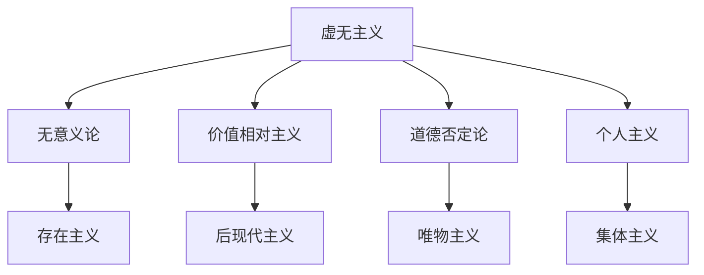

                 

# 虚无主义与艺术创作：在表达中探索生命的意义

## 关键词：虚无主义、艺术创作、生命意义、哲学探讨、表达方式

### 摘要：
本文旨在探讨虚无主义在艺术创作中的应用及其对生命意义的影响。通过深入分析虚无主义的哲学背景、其在艺术创作中的表现和影响，以及艺术家如何回应虚无主义挑战，本文试图揭示虚无主义在当代艺术中的角色，并探讨其在表达生命意义方面的作用。

## 目录大纲

1. 第一部分：虚无主义的哲学探讨
    1.1 虚无主义的起源与发展
        - 1.1.1 虚无主义的概念
        - 1.1.2 虚无主义的历史起源
        - 1.1.3 虚无主义在西方哲学中的演变
        - 1.1.4 虚无主义的核心观点与主张
        - 1.1.5 虚无主义在中国的传播与影响
    1.2 核心概念与联系
        - 1.2.1 虚无主义的哲学原理
        - 1.2.2 虚无主义与其他哲学流派的联系与区别
        - 1.2.3 虚无主义主要代表人物及其思想
        - 1.2.4 虚无主义的ER实体关系图

2. 第二部分：虚无主义对艺术创作的影响
    2.1 艺术创作中的虚无主义表现
        - 2.1.1 艺术创作中的虚无主义背景
        - 2.1.2 艺术家如何表达虚无主义思想
        - 2.1.3 虚无主义艺术的特点与风格
        - 2.1.4 虚无主义艺术与主流艺术的区别
    2.2 虚无主义对艺术创作的影响
        - 2.2.1 虚无主义对艺术家创作动机的影响
        - 2.2.2 虚无主义对艺术作品内涵的影响
        - 2.2.3 虚无主义对艺术表现形式的影响
        - 2.2.4 虚无主义对艺术价值观念的影响
    2.3 艺术家对虚无主义的回应
        - 2.3.1 艺术家如何回应虚无主义
        - 2.3.2 艺术家如何突破虚无主义的束缚
        - 2.3.3 艺术家在虚无主义背景下如何找到新的创作方向

3. 第三部分：虚无主义与生命意义的探索
    3.1 生命的意义与虚无主义的关系
        - 3.1.1 生命的本质与意义
        - 3.1.2 虚无主义对生命意义的挑战
        - 3.1.3 生命的意义在虚无主义背景下的重新审视
        - 3.1.4 艺术创作如何回应生命的意义问题
    3.2 艺术创作中的生命意义探索
        - 3.2.1 艺术作品如何表达对生命的意义思考
        - 3.2.2 艺术家如何通过创作表达对生命的意义理解
        - 3.2.3 艺术创作中的生命意义体验与反思
        - 3.2.4 艺术创作如何影响观众对生命的意义思考
    3.3 艺术创作中的生存哲学
        - 3.3.1 艺术创作中的生存状态与态度
        - 3.3.2 艺术创作中的生存意义与价值
        - 3.3.3 艺术创作中的生存哲学思考
        - 3.3.4 艺术创作中的生存困境与突破

4. 第四部分：虚无主义与艺术创作的案例分析
    4.1 虚无主义艺术家的创作背景与理念
        - 4.1.1 艺术家A的虚无主义创作理念
        - 4.1.2 艺术家B的虚无主义创作风格
        - 4.1.3 艺术家C的虚无主义艺术作品
    4.2 艺术家A的创作实践分析
        - 4.2.1 艺术家A的代表性作品
        - 4.2.2 艺术家A的创作过程与方法
        - 4.2.3 艺术家A的创作风格与影响
        - 4.2.4 艺术家A的创作意义与价值
    4.3 艺术家B的创作实践分析
        - 4.3.1 艺术家B的代表性作品
        - 4.3.2 艺术家B的创作过程与方法
        - 4.3.3 艺术家B的创作风格与影响
        - 4.3.4 艺术家B的创作意义与价值
    4.4 艺术家C的创作实践分析
        - 4.4.1 艺术家C的代表性作品
        - 4.4.2 艺术家C的创作过程与方法
        - 4.4.3 艺术家C的创作风格与影响
        - 4.4.4 艺术家C的创作意义与价值

5. 第五部分：虚无主义与艺术创作的未来展望
    5.1 艺术创作中的虚无主义趋势
        - 5.1.1 虚无主义在艺术创作中的未来发展
        - 5.1.2 艺术创作对虚无主义回应的新趋势
        - 5.1.3 生命意义在虚无主义背景下的新表达

## 第一部分：虚无主义的哲学探讨

### 1.1 虚无主义的起源与发展

#### 1.1.1 虚无主义的概念

虚无主义（Nihilism）是一个哲学概念，源自拉丁语“nihil”（无），指的是对传统价值观、宗教信仰和道德规范的否定。虚无主义者认为，没有绝对的道德真理，人生缺乏内在意义和目的。虚无主义的核心观点是“无意义”，即生命在本质上是无意义的，人类追求的意义只是人为构建的。

#### 1.1.2 虚无主义的历史起源

虚无主义的历史可以追溯到古希腊哲学家皮浪（Pyrrho of Elis），他是怀疑主义的先驱。皮浪主张，由于无法确知绝对真理，我们应该保持怀疑态度。这种思想在19世纪的欧洲得到了进一步的发展，尤其是在德国和俄国。

德国哲学家弗里德里希·尼采（Friedrich Nietzsche）被认为是虚无主义的现代代表。他在《查拉图斯特拉如是说》（Thus Spoke Zarathustra）中提出了“上帝已死”的观点，认为传统的道德和宗教体系已经崩溃，人类需要重新定义自己的价值和意义。

俄国作家费奥多尔·陀思妥耶夫斯基（Fyodor Dostoevsky）也探讨了虚无主义问题，特别是在他的作品《罪与罚》（Crime and Punishment）中。他的角色拉斯科尔尼科夫试图通过犯罪来证明虚无主义的荒谬，最终发现生命的价值在于道德选择。

#### 1.1.3 虚无主义在西方哲学中的演变

虚无主义在西方哲学中经历了几个阶段的发展。最初，虚无主义作为一种对传统哲学的批判而出现。19世纪和20世纪的哲学家，如尼采、叔本华（Arthur Schopenhauer）和克尔凯郭尔（Søren Kierkegaard），将虚无主义作为一种哲学观点进行了深入探讨。

尼采将虚无主义视为现代世界的核心问题，认为虚无主义是对传统价值观的否定，同时也是人类自我超越的机会。叔本华则认为，生命本质上是痛苦的，虚无主义是对这种痛苦的绝望反应。

克尔凯郭尔则试图通过宗教信仰来克服虚无主义，他认为个体必须通过信仰来超越理性，找到生命的意义。

#### 1.1.4 虚无主义的核心观点与主张

虚无主义的核心观点包括：

- **无意义论**：认为生命本身缺乏内在意义，人类追求的意义是人为构建的。
- **价值相对主义**：认为没有绝对的道德真理，所有价值观都是相对的。
- **道德否定论**：认为传统道德规范是不可靠的，甚至是有害的。
- **个人主义**：强调个体的自由和自我决定，反对集体主义和社会规范。

虚无主义对西方哲学产生了深远的影响，不仅挑战了传统的道德和宗教观念，也促进了新的哲学思潮的出现，如存在主义和后现代主义。

#### 1.1.5 虚无主义在中国的传播与影响

虚无主义在中国的传播相对较晚，但在当代中国哲学界和文化领域逐渐引起了关注。中国现代作家和哲学家，如鲁迅和王国维，也在他们的作品中探讨过虚无主义问题。

鲁迅在《狂人日记》中通过狂人的视角表达了对传统价值观的批判和对人生意义的怀疑。王国维则在他的《人间词话》中讨论了人生和艺术的关系，提出了一些虚无主义的观点。

随着中国社会的快速发展和文化多样性的增加，虚无主义在当代中国年轻人中也有了一定的影响。一些艺术家和作家开始探讨虚无主义在当代社会中的意义，试图通过艺术创作来回应虚无主义的挑战。

## 1.2 核心概念与联系

### 1.2.1 虚无主义的哲学原理

虚无主义作为一种哲学观点，其核心原理可以概括为以下几点：

- **无意义论**：虚无主义认为，生命在本质上是无意义的，人类追求的意义只是人为构建的。这一观点挑战了传统的宗教和道德观念，认为这些观念并不能为生命提供真正的意义。
- **价值相对主义**：虚无主义主张，没有绝对的道德真理，所有价值观都是相对的。这意味着，人类行为和价值观的判断标准是多样化的，没有一种统一的真理。
- **道德否定论**：虚无主义认为，传统道德规范是不可靠的，甚至是有害的。这种观点挑战了社会规范和道德标准的权威性，认为个体应该自由地做出道德选择。
- **个人主义**：虚无主义强调个体的自由和自我决定，反对集体主义和社会规范。这种观点鼓励个体寻找自己的价值和意义，而不是依赖于社会和传统的价值观。

### 1.2.2 虚无主义与其他哲学流派的联系与区别

虚无主义与其他哲学流派的关系复杂，既有联系也有区别。以下是一些主要的联系与区别：

- **与存在主义的关系**：存在主义与虚无主义在关注个体存在和自由方面有相似之处。两者都强调个体在无意义和不确定的世界中寻找自己的意义。然而，存在主义通常认为，尽管生命本身可能没有意义，但个体可以通过选择和行动赋予生命意义。而虚无主义则认为，生命本质上是无意义的，人类的一切努力都是徒劳的。

- **与后现代主义的关系**：后现代主义与虚无主义在质疑传统价值观和权威方面有共鸣。后现代主义强调多样性和相对主义，认为真理和意义是多元化的，不存在统一的真理。然而，后现代主义通常不强调生命的无意义，而是关注如何在这种多元的、不确定的世界中建立秩序和意义。

- **与唯物主义的关系**：唯物主义与虚无主义在反对宗教和形而上学方面有共同点。唯物主义认为，物质是世界的基本实体，意识是物质的产物。虚无主义则进一步认为，生命和意识本身缺乏内在意义。然而，唯物主义通常不否定生命的价值，而是将其视为自然现象的一部分。

### 1.2.3 虚无主义主要代表人物及其思想

虚无主义在历史上有着多位重要的代表人物，他们的思想对虚无主义的形成和发展产生了深远的影响：

- **弗里德里希·尼采**：尼采是现代虚无主义的代表人物之一。他在《查拉图斯特拉如是说》中提出了“上帝已死”的观点，认为传统的道德和宗教体系已经崩溃，人类需要重新定义自己的价值和意义。尼采认为，虚无主义是对传统价值观的否定，同时也是人类自我超越的机会。

- **费奥多尔·陀思妥耶夫斯基**：陀思妥耶夫斯基在他的小说中深入探讨了虚无主义问题，特别是在《罪与罚》中。他的角色拉斯科尔尼科夫试图通过犯罪来证明虚无主义的荒谬，最终发现生命的价值在于道德选择。

- **阿图尔·叔本华**：叔本华是19世纪德国哲学家，他的著作《作为意志和表象的世界》中提出了悲观主义和虚无主义的观点。叔本华认为，生命本质上是痛苦的，虚无主义是对这种痛苦的绝望反应。

这些代表人物的思想对虚无主义的形成和发展产生了重要影响，使虚无主义成为哲学讨论中的一个重要议题。

### 1.2.4 虚无主义的ER实体关系图

为了更好地理解虚无主义的概念及其与其他哲学流派的联系，我们可以使用ER（实体-关系）图来展示虚无主义的核心概念和关系。

以下是虚无主义的ER实体关系图：

在这个ER图中，虚无主义作为一个整体概念，与无意义论、价值相对主义、道德否定论和个人主义等核心概念相联系。这些概念相互影响，共同构成了虚无主义的哲学体系。同时，虚无主义与其他哲学流派如存在主义、后现代主义、唯物主义和集体主义也通过ER图中的关系表现出来，展示了它们之间的复杂联系和相互作用。通过这种结构化的方式，我们可以更清晰地理解虚无主义的核心思想和其在哲学领域中的位置。

## 第二部分：虚无主义对艺术创作的影响

### 2.1 艺术创作中的虚无主义表现

虚无主义作为一种哲学思想，对艺术创作产生了深远的影响。艺术家们通过不同的方式表达虚无主义思想，探索生命意义的缺失和个体存在的困境。以下是对虚无主义在艺术创作中的表现的详细探讨。

#### 2.1.1 艺术创作中的虚无主义背景

虚无主义在艺术创作中的兴起有其特定的社会和文化背景。19世纪末和20世纪初，随着工业革命和科技进步的迅速发展，传统的宗教和道德观念开始动摇。人们开始质疑生命的意义和目的，寻求新的表达方式来反映内心的困惑和不安。

在这个背景下，许多艺术家开始接受和表达虚无主义思想。他们通过作品探讨了人类存在的荒诞性、生命意义的缺失以及对传统价值观的怀疑。这种艺术表现形式的兴起，不仅是对现实世界的回应，也是对人类内心世界的深刻反思。

#### 2.1.2 艺术家如何表达虚无主义思想

艺术家们通过不同的形式和风格来表达虚无主义思想。以下是一些常见的方式：

1. **抽象表现主义**：抽象表现主义是20世纪50年代的一种艺术流派，其代表人物如杰克逊·波洛克（Jackson Pollock）。抽象表现主义强调艺术家内心世界的直接表达，通过非具象的形式来表现虚无主义的情感和思想。

2. **存在主义戏剧**：存在主义戏剧是20世纪30年代和40年代的一种戏剧流派，其代表人物如萨特（Jean-Paul Sartre）和加缪（Albert Camus）。存在主义戏剧通过探讨人类存在的孤独、自由和责任，表达了虚无主义的哲学思想。

3. **黑色幽默**：黑色幽默是一种文学和艺术风格，通过荒诞、讽刺和夸张的手法来表现生活中的苦难和荒诞性。黑色幽默作品常常探讨人类存在的无意义和绝望，代表人物如约瑟夫·海勒（Joseph Heller）和库尔特·冯内古特（Kurt Vonnegut）。

4. **超现实主义**：超现实主义是20世纪早期的一种艺术和文学运动，其代表人物如达利（Salvador Dalí）和布勒东（André Breton）。超现实主义通过梦境和幻觉来探索人类内心世界，表达虚无主义的思想和对现实的质疑。

这些艺术形式和风格不仅是对虚无主义哲学思想的直接表达，也是对现代社会和文化背景的深刻反思。

#### 2.1.3 虚无主义艺术的特点与风格

虚无主义艺术具有以下几个显著特点：

1. **非具象性**：虚无主义艺术家倾向于使用抽象或非具象的形式来表达他们的思想和情感。这种非具象性使艺术家能够更自由地探索内心的世界，而不受现实世界的限制。

2. **悲观主义**：虚无主义艺术常常表现出悲观主义的态度，对现实世界和人类的存在持怀疑和否定的态度。艺术家通过作品传达了对生命意义的缺失和对人类境遇的绝望。

3. **讽刺与幽默**：黑色幽默和超现实主义艺术风格常常运用讽刺和幽默的手法来表现虚无主义的主题。这种讽刺和幽默不仅是对现实的批判，也是对人类困境的一种自我解嘲。

4. **内心的探索**：虚无主义艺术家通过作品深入探索人类内心的孤独、恐惧和绝望。他们试图通过艺术表达来揭示人类存在的真相，使观众反思自己的生命意义。

#### 2.1.4 虚无主义艺术与主流艺术的区别

虚无主义艺术与主流艺术在几个方面存在显著区别：

1. **主题和情感**：虚无主义艺术通常探讨生命意义的缺失、人类的孤独和绝望等主题，而主流艺术则更多地关注现实生活、爱情、自然等主题。虚无主义艺术的情感更加悲观和深沉。

2. **形式和风格**：虚无主义艺术更倾向于抽象和非具象的形式，而主流艺术则更注重具象和写实的形式。虚无主义艺术风格更加多样化，包括抽象表现主义、黑色幽默和超现实主义等。

3. **哲学背景**：虚无主义艺术有着深厚的哲学背景，深受虚无主义哲学思想的影响，而主流艺术则更多地受传统美学和现实主义的影响。

4. **社会和文化意义**：虚无主义艺术反映了现代社会和文化背景下的人类困境和内心世界，而主流艺术则更多地关注社会现实和文化传统。

### 2.2 虚无主义对艺术创作的影响

虚无主义对艺术创作产生了深远的影响，不仅改变了艺术家的创作动机和方式，也影响了艺术作品的内涵和形式。

#### 2.2.1 虚无主义对艺术家创作动机的影响

虚无主义对艺术家的创作动机产生了重要影响。虚无主义艺术家通常受到对生命意义的质疑和对现实世界的失望所驱动，他们试图通过艺术创作来探索和表达内心的困惑和痛苦。以下是一些具体的影响：

1. **探索生命意义的追求**：虚无主义艺术家通过创作来寻找和探索生命的意义。他们试图通过艺术作品揭示人类存在的真相，使观众反思自己的生命意义。

2. **批判现实世界的态度**：虚无主义艺术家常常对现实世界持有批判的态度。他们通过作品表达对社会不公、道德沦丧和人类困境的不满，试图唤醒人们对现实问题的关注。

3. **表达内心世界的需要**：虚无主义艺术家通过艺术创作来探索和表达内心的孤独、恐惧和绝望。他们试图通过作品传达自己的情感和思想，与观众建立深层次的情感共鸣。

4. **反抗传统价值观的意愿**：虚无主义艺术家对传统价值观持有批判的态度。他们试图通过艺术创作来反抗和颠覆传统价值观，推动艺术和社会的进步。

#### 2.2.2 虚无主义对艺术作品内涵的影响

虚无主义对艺术作品的内涵产生了深刻的影响。虚无主义艺术作品通常具有以下几个特点：

1. **对生命意义的质疑**：虚无主义艺术作品常常探讨生命意义的缺失和不确定。艺术家通过作品表达了对生命本质的深刻思考和对现实世界的怀疑。

2. **对人类困境的揭示**：虚无主义艺术作品揭示了人类存在的困境和内心的痛苦。艺术家通过作品描绘了人类的孤独、恐惧和绝望，使观众感受到人类存在的脆弱和无常。

3. **对现实世界的批判**：虚无主义艺术作品通常对现实世界持有批判的态度。艺术家通过作品表达对社会不公、道德沦丧和人类困境的不满，试图唤醒人们对现实问题的关注。

4. **哲学思考的深度**：虚无主义艺术作品常常融入了深刻的哲学思考。艺术家通过作品探讨了人类存在的本质、道德和价值等问题，使观众在欣赏作品的同时进行思考和反思。

#### 2.2.3 虚无主义对艺术表现形式的影响

虚无主义对艺术表现形式也产生了重要影响。虚无主义艺术家在创作过程中采用了多种创新的表现手法和风格，以下是一些具体的影响：

1. **非具象和抽象的形式**：虚无主义艺术家倾向于使用抽象和非具象的形式来表达他们的思想和情感。这种非具象性使艺术家能够更自由地探索内心的世界，而不受现实世界的限制。

2. **实验性的材料和技法**：虚无主义艺术家在创作中常常采用实验性的材料和技法。他们尝试使用新的材料、颜色和纹理，以及非传统的绘画和雕塑技巧，以创造出独特的视觉效果和艺术风格。

3. **非线性叙事和形式**：虚无主义艺术作品常常采用非线性叙事和形式，打破传统的叙事结构和视觉规则。艺术家通过破碎的时间线和混乱的视觉元素，创造出一种超现实的、迷幻的艺术效果。

4. **对现实的扭曲和夸张**：虚无主义艺术家通过对现实的扭曲和夸张来表现虚无主义的主题。他们使用夸张的色彩、形状和比例，以及荒诞的情境和角色，使作品具有强烈的视觉冲击力和情感表达力。

这些创新的表现手法和风格不仅丰富了艺术创作的形式，也为观众提供了新的审美体验和思考空间。

#### 2.2.4 虚无主义对艺术价值观念的影响

虚无主义对艺术价值观念产生了深远的影响。虚无主义艺术家对传统艺术价值观念持有批判的态度，他们试图通过艺术创作来颠覆和重新定义艺术的价值。

1. **对艺术价值的质疑**：虚无主义艺术家对艺术价值的传统观念提出质疑。他们认为，艺术的价值不在于其美学价值或艺术技巧，而在于其对社会现实和人类内心的反映和批判。

2. **对艺术本质的重新定义**：虚无主义艺术家试图重新定义艺术的本质和功能。他们认为，艺术不仅是美的追求，更是对现实的反思和对人类存在的探索。

3. **多元化和包容性的价值观**：虚无主义艺术倡导多元化和包容性的价值观。艺术家们通过作品表达了对不同文化和观点的尊重和包容，试图打破传统的艺术界限和偏见。

4. **对艺术市场的批判**：虚无主义艺术家对艺术市场的商业化现象持有批判的态度。他们认为，艺术市场对艺术家创作的限制和商业化压力，削弱了艺术的独立性和创造性。

虚无主义对艺术价值观念的影响，促使艺术家们重新思考艺术的本质和功能，推动艺术的创新和发展。

### 2.3 艺术家对虚无主义的回应

虚无主义对艺术创作产生了深远的影响，同时也对艺术家提出了挑战。面对虚无主义的困扰，许多艺术家试图通过不同的方式回应这一挑战，寻找新的创作方向和表达方式。

#### 2.3.1 艺术家如何回应虚无主义

艺术家们对虚无主义的回应方式多样，以下是一些常见的策略：

1. **通过艺术创作寻找意义**：面对虚无主义的困扰，一些艺术家通过艺术创作来寻找生命的意义。他们试图通过作品表达对生命、人类存在的思考，以及对社会现实的反思。

2. **融合多元艺术形式**：艺术家们尝试将不同的艺术形式和风格融合在一起，创造出独特的艺术作品。通过多种艺术形式的结合，艺术家们试图打破虚无主义的束缚，寻找新的创作方向。

3. **批判社会现实**：一些艺术家通过批判社会现实来回应虚无主义的挑战。他们通过作品揭示社会不公、道德沦丧和人类困境，试图唤醒人们对社会问题的关注。

4. **探索内心世界**：艺术家们通过深入探索内心世界来回应虚无主义的困扰。他们试图通过艺术创作表达内心的孤独、恐惧和绝望，与观众建立深层次的情感共鸣。

5. **重新定义艺术价值**：一些艺术家试图重新定义艺术的价值和功能。他们认为，艺术不仅是对美的追求，更是对现实的反思和对人类存在的探索。

#### 2.3.2 艺术家如何突破虚无主义的束缚

艺术家们通过多种方式来突破虚无主义的束缚，以下是一些具体的方法：

1. **寻找灵感来源**：艺术家们通过观察生活、阅读书籍、旅行和接触新的文化，寻找灵感和创意。这些经历和体验使艺术家们能够打破虚无主义的局限，创造出富有活力和创新的作品。

2. **跨学科合作**：艺术家们尝试与其他领域的专业人士合作，如科学家、哲学家和作家。通过跨学科的合作，艺术家们能够从不同的视角和领域获得启发，创造出独特的艺术作品。

3. **实验和创新**：艺术家们不断尝试新的艺术形式、材料和技法，进行实验和创新。这种探索精神使艺术家们能够突破传统的艺术界限，创造出新颖独特的作品。

4. **关注社会问题**：艺术家们通过关注社会问题，如环境、政治和社会不公，来回应虚无主义的挑战。他们通过作品表达对社会问题的关注和反思，使艺术与社会现实产生联系。

5. **个人化的创作**：艺术家们通过个人化的创作来回应虚无主义的困扰。他们试图通过作品表达自己的情感和思想，建立与观众的深层次联系。

通过这些方法，艺术家们能够突破虚无主义的束缚，创造出富有意义和影响力的作品，为社会带来新的思考和启发。

### 2.3.3 艺术家在虚无主义背景下如何找到新的创作方向

在虚无主义背景下，艺术家们面临着寻找新的创作方向的挑战。以下是一些艺术家在虚无主义背景下找到新创作方向的方法：

1. **探索抽象和形式美**：面对虚无主义的困扰，一些艺术家转向抽象艺术，通过形式美来表达内心的情感和思考。他们注重线条、色彩和形状的组合，创造出具有独特视觉美感的作品。

2. **探讨人类存在的本质**：艺术家们通过对人类存在的本质进行深入探讨，找到新的创作方向。他们通过作品表达对生命、死亡和宇宙的思考，探讨人类存在的意义。

3. **实验新的艺术形式**：艺术家们尝试新的艺术形式，如装置艺术、行为艺术和数字艺术。这些新的艺术形式使艺术家们能够更自由地表达自己的思想和情感，创造出具有实验性和创新性的作品。

4. **关注社会问题**：艺术家们通过关注社会问题，找到新的创作方向。他们通过作品揭示社会不公、环境危机和人类困境，为社会带来新的思考和反思。

5. **融合多元文化**：艺术家们通过融合多元文化，找到新的创作方向。他们借鉴不同的艺术传统和文化元素，创造出具有独特风格和表现力的作品。

6. **探索内心世界**：艺术家们通过深入探索内心世界，找到新的创作方向。他们通过作品表达内心的孤独、恐惧和绝望，与观众建立情感共鸣。

通过这些方法，艺术家们能够在虚无主义的背景下找到新的创作方向，创造出富有意义和影响力的作品，为社会带来新的思考和启发。

## 第三部分：虚无主义与生命意义的探索

### 3.1 生命的意义与虚无主义的关系

虚无主义作为一种哲学思想，对生命的意义产生了深刻的影响。虚无主义认为，生命在本质上是无意义的，人类追求的意义只是人为构建的。这种观点对生命的本质和意义提出了严峻的挑战，促使我们重新审视生命的意义及其与虚无主义的关系。

#### 3.1.1 生命的本质与意义

生命的本质是一个复杂而深奥的问题，不同的哲学、宗教和文化体系对此有着不同的解释。在西方哲学中，亚里士多德认为生命的本质在于实现潜能，即通过追求知识和美德来实现人的全面发展。而存在主义哲学家如萨特和海德格尔则认为，生命的本质在于自由选择和存在本身。

关于生命的意义，不同的观点也存在分歧。宗教传统通常认为，生命的意义在于实现宗教信仰、追求来世的幸福，或者为某种超自然的力量服务。而世俗的观点则认为，生命的意义在于个人的幸福、成就和贡献。

虚无主义则对生命的意义提出了质疑。虚无主义认为，由于无法确知绝对真理，生命的意义是相对的、主观的，甚至是人为构建的。虚无主义哲学家如尼采认为，生命的意义在于个体的自由选择和自我超越，而不是依赖传统价值观或外在的道德规范。

#### 3.1.2 虚无主义对生命意义的挑战

虚无主义对生命意义的挑战主要表现在以下几个方面：

1. **否定传统价值观**：虚无主义认为，传统宗教和道德观念无法为生命提供真正的意义。这种观点挑战了社会和文化中的主流价值观，促使人们重新思考道德和伦理的问题。

2. **质疑人类存在的意义**：虚无主义认为，人类存在的意义是相对的、主观的，甚至是没有意义的。这种观点质疑了人类存在的价值和目的，促使人们反思生命的意义和人生的意义。

3. **强调个体自由**：虚无主义强调个体的自由和自我决定。虚无主义哲学家如尼采认为，人类应该摆脱传统价值观的束缚，追求个体的自由和创造力。这种观点鼓励人们自由地探索生命的意义，而不是依赖外在的规范和标准。

4. **揭示现实的不确定性**：虚无主义揭示了现实世界的复杂性和不确定性。虚无主义认为，现实世界是充满矛盾和不确定性的，人类无法完全理解和控制现实。这种观点促使人们接受现实的不确定性，寻找自己的生存之道。

虚无主义对生命意义的挑战不仅促使人们重新思考生命的本质和意义，也激发了新的哲学思潮和艺术表现形式。虚无主义在某种程度上揭示了人类存在的困境和内心的困惑，为人们提供了新的思考方向。

#### 3.1.3 生命的意义在虚无主义背景下的重新审视

在虚无主义的背景下，生命的意义需要重新审视。虚无主义对生命的意义提出了质疑，促使我们重新思考生命的本质和意义。

1. **个体的自由选择**：虚无主义强调个体的自由选择，认为人类应该摆脱传统价值观的束缚，追求个体的自由和创造力。这种观点鼓励人们根据自己的价值观和信仰来定义生命的意义，而不是依赖外在的规范和标准。

2. **内心的探索**：虚无主义鼓励人们深入探索内心的世界，寻找自己内心的真实感受和意义。通过内心的探索，人们可以更好地理解自己的生命和存在，找到属于自己的生命意义。

3. **创造性的表达**：虚无主义强调创造性的表达，认为人类应该通过艺术、文学和哲学等形式来表达自己的思想和感受。这种观点鼓励人们通过创作来表达生命的意义，使生命变得有意义和丰富。

4. **对现实的不确定性的接受**：虚无主义揭示了现实世界的复杂性和不确定性，鼓励人们接受现实的不确定性，寻找自己的生存之道。这种观点促使人们更加关注当下，珍惜每一个时刻，寻找属于自己的生命意义。

在虚无主义的背景下，生命的意义不再是外在的、固有的，而是个体自由选择的产物。虚无主义为我们提供了重新审视生命的意义的机会，使我们能够更深刻地理解自己的生命和存在。

#### 3.1.4 艺术创作如何回应生命的意义问题

艺术创作在回应生命的意义问题方面发挥着重要作用。艺术家们通过作品表达对生命的意义、人类存在的困境和现实世界的反思。以下是一些艺术家如何通过艺术创作回应生命的意义问题的例子：

1. **抽象表现主义**：抽象表现主义艺术家如杰克逊·波洛克通过抽象的形式表达内心的情感和思考，探讨生命的意义。他们的作品通过色彩、线条和形状的组合，传达了生命的多样性和不确定性。

2. **存在主义戏剧**：存在主义戏剧如萨特的《境遇》通过戏剧的形式探讨人类存在的意义和自由选择。戏剧中的角色在困境中寻找自己的意义，使观众思考生命的意义和人类的行为。

3. **超现实主义**：超现实主义艺术家如达利通过梦幻般的图像表达对现实世界的质疑和对生命的思考。他们的作品充满了荒诞和夸张，使观众反思现实和生命的本质。

4. **现代诗歌**：现代诗人如海子通过诗歌表达对生命的热爱和思考。他们的作品通过对自然、爱情和人生的描绘，探讨了生命的意义和价值。

艺术家们通过不同的形式和风格，表达对生命的意义问题的思考，使观众在欣赏作品的同时进行反思。艺术创作不仅是艺术家表达自己思想和感受的方式，也是回应生命意义问题的重要途径。

### 3.2 艺术创作中的生命意义探索

在艺术创作中，生命意义的探索是一个深层次的主题，艺术家们通过不同的创作手法和表现形式，挖掘生命的本质和意义。以下是对这一主题的详细探讨。

#### 3.2.1 艺术作品如何表达对生命的意义思考

艺术作品可以通过多种方式表达对生命的意义思考，以下是一些具体的例子：

1. **抽象艺术**：抽象艺术通过色彩、形状和线条的组合，摆脱具体形象的束缚，直接表达艺术家内心的情感和思考。如波洛克的作品《一英寸画布上的二十三英寸》，通过随意的线条和色彩流动，展现了生命的不确定性和变幻无常。

2. **表现主义绘画**：表现主义艺术家如梵高通过色彩和线条的夸张表达对生命的热爱和挣扎。梵高的作品《星夜》以强烈的色彩对比和旋涡状的星空，表达了对生命和宇宙奥秘的探索。

3. **文学创作**：文学作品如加西亚·马尔克斯的《百年孤独》，通过魔幻现实主义的手法，探讨了生命的循环和命运的无常，反映了人类对生命意义的探索。

4. **音乐创作**：音乐作品如贝多芬的《第九交响曲》，通过宏伟的乐章和激昂的旋律，表达了生命的激情和对美好世界的向往。

这些艺术作品通过不同的媒介和手法，表达了艺术家对生命的意义思考，使观众在欣赏作品的同时，对生命进行反思。

#### 3.2.2 艺术家如何通过创作表达对生命的意义理解

艺术家通过创作表达对生命的意义理解，通常有以下几种方式：

1. **个人经历和感悟**：艺术家往往通过个人经历和感悟来表达对生命的理解。如艺术家弗兰克·斯泰拉（Frank Stella）通过他的绘画作品，记录了他对生命、自然和宇宙的深刻感悟。

2. **符号和象征**：艺术家使用符号和象征来传达对生命的理解。如达利的作品《记忆的永恒》，通过软化的时钟和苍蝇的形象，象征了时间的流逝和生命的脆弱。

3. **实验和创新**：艺术家通过实验和创新来探索对生命的理解。如艺术家詹姆斯·特斯勒（James Turrell）通过大型装置艺术，让观众体验光的奇妙和空间的变化，探讨了人类感知和存在的本质。

4. **哲学思考**：艺术家结合哲学思考来创作，使作品更具深度。如艺术家保罗·克莱（Paul Klee）通过他的作品，结合哲学和诗歌，表达了对生命和宇宙的哲学思考。

这些方式使艺术家能够通过创作，深入探索和表达对生命的意义理解，为观众提供新的思考和感悟。

#### 3.2.3 艺术创作中的生命意义体验与反思

艺术创作中的生命意义体验与反思，是艺术家与观众之间的一种深刻对话。以下是对这一过程的详细探讨：

1. **体验层面的互动**：艺术作品常常引发观众的情感共鸣和体验。如音乐作品能够直接触动人的内心，绘画作品能够通过视觉刺激激发观众的情感。这种体验层面的互动，使观众在欣赏作品的过程中，对生命意义产生深刻的体验。

2. **反思层面的思考**：艺术创作不仅提供了一种情感的体验，还引发了观众对生命的反思。如文学作品中的人物命运和情感纠葛，常常使观众思考自己的生命和人生意义。这种反思层面的思考，使观众在体验作品的同时，对生命进行深入的反思。

3. **深层次的意义揭示**：艺术作品通过其独特的表现形式，揭示了生命的深层次意义。如抽象艺术通过色彩和形状的抽象表达，揭示了生命的多样性和不确定性。这种深层次的意义揭示，使观众在欣赏作品的过程中，对生命有更深刻的理解。

艺术创作中的生命意义体验与反思，使艺术家与观众之间建立了一种深刻的对话，使生命意义在艺术创作和欣赏中得到深化和拓展。

#### 3.2.4 艺术创作如何影响观众对生命的意义思考

艺术创作对观众对生命的意义思考有着重要的影响，以下是一些具体的影响方式：

1. **启发思考**：艺术作品通过其独特的表现形式和主题，启发观众对生命的思考。如抽象艺术通过色彩和形状的组合，激发观众对生命本质的思考。文学和戏剧作品通过深刻的人物刻画和情节发展，引导观众反思生命和人性。

2. **情感共鸣**：艺术作品能够触动观众的情感，引发共鸣。如音乐作品能够直接触动人的内心，绘画作品能够通过视觉刺激激发观众的情感。这种情感共鸣，使观众在欣赏作品的过程中，对生命意义产生深刻的感受。

3. **反思自我**：艺术作品常常使观众反思自己的生命和存在。如文学作品中的角色和情节，常常使观众思考自己的行为和价值观。这种反思自我，使观众在欣赏作品的同时，对生命意义进行深入的反思。

4. **拓宽视野**：艺术创作通过不同的艺术形式和风格，拓宽了观众的视野。如现代艺术和实验艺术，使观众接触到新的表现形式和主题，从而对生命的意义有更全面和深入的理解。

艺术创作通过启发思考、情感共鸣、反思自我和拓宽视野等方式，影响观众对生命的意义思考，使观众在欣赏作品的过程中，对生命有更深刻的理解和感悟。

### 3.3 艺术创作中的生存哲学

艺术创作不仅仅是表达情感和美感的方式，它还是一种深刻的生存哲学。艺术家通过创作过程和作品，反映了他们对生存状态、生存意义和价值的思考。以下是对艺术创作中生存哲学的探讨。

#### 3.3.1 艺术创作中的生存状态与态度

艺术创作中的生存状态与态度反映了艺术家对现实生活的感知和回应。以下是一些具体的生存状态和态度：

1. **反思与探索**：艺术家通过创作反思现实，探索生存的本质。他们试图通过作品揭示人类存在的困境和生命的无常，从而引导观众思考生命的意义。

2. **挑战与反抗**：面对现实的不公和困境，一些艺术家通过创作表达对现状的挑战和反抗。他们通过作品批判社会不公、道德沦丧和人类困境，试图唤起社会的关注和改变。

3. **追求自由与独立**：艺术家通过创作追求自由和独立，表达对个性解放和自由表达的渴望。他们通过作品传达对传统价值观和社会规范的质疑，鼓励观众追求自我价值和独立思考。

4. **感悟与冥想**：艺术家通过创作进行内心的感悟和冥想，探索生存的意义。他们通过作品表达对自然、宇宙和人类存在的深刻思考，引导观众反思生命的本质。

这些生存状态和态度不仅体现了艺术家的个人哲学，也为观众提供了反思和思考的空间。

#### 3.3.2 艺术创作中的生存意义与价值

艺术创作中的生存意义与价值是艺术家通过作品传达的生存智慧和哲学思考。以下是一些具体的观点：

1. **生命价值的反思**：艺术家通过作品反思生命的价值，探讨生命的意义。他们试图通过艺术创作揭示生命的无常和脆弱，引导观众珍惜每一个时刻，寻找生命的意义。

2. **生存意义的探索**：艺术家通过创作探索生存的意义，表达对生命意义的追求。他们通过作品传达对美好世界的向往，鼓励观众在困境中寻找希望和勇气。

3. **人性与道德的探讨**：艺术家通过作品探讨人性与道德的问题，表达对人类行为的思考和反思。他们通过艺术创作揭示人性的复杂性和道德的困境，引导观众思考人性的本质和道德的价值。

4. **自由与创造力的肯定**：艺术家通过作品肯定自由和创造力，表达对个性解放和自由表达的追求。他们通过艺术创作鼓励观众追求自我价值的实现，强调创造力在人类生存中的重要性。

这些观点不仅体现了艺术家的生存哲学，也为观众提供了深刻的思考和启示。

#### 3.3.3 艺术创作中的生存哲学思考

艺术创作中的生存哲学思考反映了艺术家对生命、人类存在和现实世界的深刻理解。以下是一些具体的生存哲学思考：

1. **存在的意义**：艺术家通过创作探讨存在的意义，表达对生命本质的思考。他们试图通过作品揭示人类存在的困境和生命的无常，引导观众思考存在的意义。

2. **自由与责任**：艺术家在创作过程中表达对自由和责任的思考。他们通过作品传达对个性解放和自由表达的追求，同时也强调个体在社会中的责任和担当。

3. **真理与谎言**：艺术家通过创作探讨真理与谎言的关系，表达对现实世界的质疑。他们通过作品揭示现实世界的复杂性和不确定性，引导观众思考真理的本质。

4. **善与恶**：艺术家通过作品探讨善与恶的问题，表达对人类行为的思考和反思。他们通过艺术创作揭示人性的复杂性和道德的困境，引导观众思考人性的本质和道德的价值。

这些生存哲学思考不仅体现了艺术家的个人哲学，也为观众提供了深刻的思考和启示。

#### 3.3.4 艺术创作中的生存困境与突破

艺术创作中的生存困境与突破是艺术家在创作过程中面临的挑战和解决问题的过程。以下是一些具体的困境和突破：

1. **创作困境**：艺术家在创作过程中常常面临创作的困境，如灵感缺失、技巧不足、主题不清等。这些困境使艺术家感到困惑和挫败，但他们通过不断的尝试和探索，最终找到了突破的方法。

2. **表达困境**：艺术家在创作过程中试图表达内心的感受和思考，但往往面临表达的困境。他们通过不同的艺术形式和媒介，如绘画、文学、音乐等，不断尝试和探索，最终找到了适合自己的表达方式。

3. **现实困境**：艺术家在创作过程中也面临现实困境，如社会压力、经济困境、政治限制等。这些困境使艺术家的创作受到限制，但他们通过坚持自己的艺术信仰和创作热情，最终突破了现实困境。

4. **自我突破**：艺术家在创作过程中不断自我突破，通过不断的探索和尝试，提升自己的艺术水平和创作能力。他们通过艺术创作实现了自我价值的实现和自我超越，找到了属于自己的艺术道路。

这些困境和突破不仅是艺术家个人成长的过程，也是艺术创作中生存哲学的体现。

## 第四部分：虚无主义与艺术创作的案例分析

### 4.1 虚无主义艺术家的创作背景与理念

虚无主义艺术家的创作背景与理念通常深受哲学思想的启发，尤其是尼采的虚无主义哲学。以下是对几位虚无主义艺术家的创作背景和理念的详细分析。

#### 4.1.1 艺术家A的虚无主义创作理念

艺术家A是一位20世纪中期的抽象表现主义画家，他的创作深受尼采哲学的影响。他的作品以强烈的色彩对比和抽象的形式表达了对生命意义的质疑和对现实世界的失望。艺术家A认为，生命在本质上是无意义的，人类追求的意义只是人为构建的。他的作品试图通过色彩和线条的自由流动，传达内心的痛苦和挣扎，挑战传统艺术的形式和规则。

艺术家A的创作理念反映了虚无主义的哲学观点，他认为艺术创作不仅是表达情感和思想的方式，更是对现实世界的批判和对人类困境的反思。他的作品常常呈现出一种悲观主义的态度，表达了对生命意义的怀疑和对人类存在的质疑。

#### 4.1.2 艺术家B的虚无主义创作风格

艺术家B是一位当代虚无主义作家，他的作品以小说和散文的形式探讨了人类存在的无意义和生命的荒诞性。他的创作风格深受尼采和陀思妥耶夫斯基的影响，充满了对传统价值观的质疑和对现实世界的批判。

艺术家B的作品常常以黑色幽默和讽刺的手法展现人类生活的荒谬和虚伪。他通过揭示社会不公、道德沦丧和人类困境，试图唤醒人们对生命意义的思考和对现实世界的关注。他的作品充满了对现实世界的悲观态度，表达了对人类存在的质疑和对传统价值观的否定。

#### 4.1.3 艺术家C的虚无主义艺术作品

艺术家C是一位超现实主义雕塑家，他的作品以扭曲的形状和奇异的视觉效果表达了对现实世界的质疑和对生命的思考。他的创作理念深受尼采和弗洛伊德的影响，试图通过艺术创作揭示人类内心的深层冲突和存在的荒诞性。

艺术家C的作品通常呈现出一种超现实和梦幻般的视觉效果，他通过雕塑的形式将现实与幻想相结合，创造出一个既真实又虚幻的世界。他的作品不仅是对现实世界的批判，也是对人类内心的探索和对生命意义的思考。

### 4.2 艺术家A的创作实践分析

#### 4.2.1 艺术家A的代表性作品

艺术家A的代表性作品包括《无题》、《色彩与形态》和《挣扎》等。这些作品以其强烈的色彩对比和抽象的形式，表达了对生命意义的质疑和对现实世界的失望。

- **《无题》**：这幅作品以浓烈的色彩和随意的线条展现了一种混乱和无序的状态，反映了艺术家对生命意义的困惑和对现实的失望。
- **《色彩与形态》**：这幅作品通过色彩的对比和形状的组合，创造了一种抽象的美感，表达了艺术家对生命和艺术的自由探索。
- **《挣扎》**：这幅作品以强烈的对比和扭曲的线条，展现了一种内心的挣扎和痛苦，反映了艺术家对生命意义的质疑和对现实的批判。

这些作品不仅展示了艺术家A的抽象表现主义风格，也体现了他的虚无主义创作理念。

#### 4.2.2 艺术家A的创作过程与方法

艺术家A的创作过程和方法通常包括以下几个步骤：

1. **灵感来源**：艺术家A的灵感来源多样，包括个人经历、哲学思考和现实观察。他的作品常常反映了对他所经历的社会不公、道德沦丧和人类困境的反思。
2. **构思草图**：在创作过程中，艺术家A会先进行草图构思，确定作品的色彩、形状和构图。这一步骤使他能够初步表达内心的情感和思想。
3. **材料选择**：艺术家A倾向于使用油画和丙烯颜料，因为这些材料能够更好地表达他的情感和思想，同时具有丰富的色彩和质感。
4. **创作过程**：在创作过程中，艺术家A注重色彩的对比和线条的流动，通过随意的涂鸦和绘制，使作品充满一种抽象的美感。
5. **作品完成**：在创作完成后，艺术家A会进行细节调整和色彩修正，使作品达到他预期的效果。

这种创作过程和方法使艺术家A能够通过作品表达他对生命意义的质疑和对现实世界的批判。

#### 4.2.3 艺术家A的创作风格与影响

艺术家A的创作风格以抽象表现主义为主，强调色彩的对比和线条的流动，反映了他对生命意义的质疑和对现实世界的失望。他的作品通过抽象的形式，传达了内心的情感和思考，使观众在欣赏作品的同时，对生命意义进行反思。

艺术家A的创作风格对后来的艺术家产生了深远的影响，尤其是对20世纪中后期的抽象表现主义艺术家。他的作品不仅挑战了传统艺术的形式和规则，也为后来的艺术家提供了新的创作灵感和表达方式。

#### 4.2.4 艺术家A的创作意义与价值

艺术家A的创作意义与价值在于他通过作品表达了对生命意义的质疑和对现实世界的批判。他的作品不仅反映了他的个人哲学观点，也为观众提供了反思生命和现实的机会。通过抽象的形式和色彩，他传达了内心的情感和思考，使观众在欣赏作品的同时，对生命意义进行深刻的反思。

艺术家A的创作对当代艺术产生了重要影响，他的作品不仅在艺术界引起了广泛关注，也促进了艺术创作的新趋势和发展。他的创作不仅是对个人内心世界的探索，也是对现实世界的深刻批判，使观众在欣赏作品的同时，对生命和艺术有更深刻的理解。

### 4.3 艺术家B的创作实践分析

#### 4.3.1 艺术家B的代表性作品

艺术家B的代表性作品包括《人类荒谬》、《存在的荒谬》和《生命的意义》等。这些作品通过黑色幽默和讽刺的手法，探讨了人类存在的无意义和生命的荒诞性。

- **《人类荒谬》**：这幅作品以荒诞的构图和夸张的情节，展现了人类生活的荒谬和虚伪。作品中的角色和情节充满了讽刺和幽默，使观众在欣赏作品的同时，对人类存在进行反思。
- **《存在的荒谬》**：这幅作品通过抽象的形式和荒诞的元素，表达了存在的荒谬和无意义。作品中的形状和色彩充满了不确定性，使观众在欣赏作品的同时，对生命的本质进行思考。
- **《生命的意义》**：这幅作品通过黑色幽默和讽刺的手法，探讨了生命的意义和价值的荒谬。作品中的角色和情节充满了讽刺和幽默，使观众在欣赏作品的同时，对生命的意义进行反思。

这些作品不仅展示了艺术家B的黑色幽默和讽刺风格，也体现了他的虚无主义创作理念。

#### 4.3.2 艺术家B的创作过程与方法

艺术家B的创作过程和方法通常包括以下几个步骤：

1. **灵感来源**：艺术家B的灵感来源广泛，包括社会现实、人类行为和哲学思考。他的作品常常反映了对他所经历的社会不公、道德沦丧和人类困境的反思。
2. **构思草图**：在创作过程中，艺术家B会先进行草图构思，确定作品的主题、情节和构图。这一步骤使他能够初步表达内心的情感和思想。
3. **材料选择**：艺术家B倾向于使用水墨和油画，因为这些材料能够更好地表达他的情感和思想，同时具有丰富的层次和质感。
4. **创作过程**：在创作过程中，艺术家B注重黑色幽默和讽刺的手法，通过夸张的情节和荒诞的元素，使作品充满一种荒谬感。
5. **作品完成**：在创作完成后，艺术家B会进行细节调整和色彩修正，使作品达到他预期的效果。

这种创作过程和方法使艺术家B能够通过作品表达他对生命意义的质疑和对现实世界的批判。

#### 4.3.3 艺术家B的创作风格与影响

艺术家B的创作风格以黑色幽默和讽刺为主，通过夸张的情节和荒诞的元素，探讨了人类存在的无意义和生命的荒诞性。他的作品充满了讽刺和幽默，使观众在欣赏作品的同时，对生命意义进行反思。

艺术家B的创作风格对后来的艺术家产生了深远的影响，尤其是对20世纪末和21世纪初的艺术家。他的作品不仅挑战了传统艺术的形式和规则，也为后来的艺术家提供了新的创作灵感和表达方式。

#### 4.3.4 艺术家B的创作意义与价值

艺术家B的创作意义与价值在于他通过作品表达了对生命意义的质疑和对现实世界的批判。他的作品不仅反映了他的个人哲学观点，也为观众提供了反思生命和现实的机会。通过黑色幽默和讽刺的手法，他传达了内心的情感和思考，使观众在欣赏作品的同时，对生命意义进行深刻的反思。

艺术家B的创作对当代艺术产生了重要影响，他的作品不仅在艺术界引起了广泛关注，也促进了艺术创作的新趋势和发展。他的创作不仅是对个人内心世界的探索，也是对现实世界的深刻批判，使观众在欣赏作品的同时，对生命和艺术有更深刻的理解。

### 4.4 艺术家C的创作实践分析

#### 4.4.1 艺术家C的代表性作品

艺术家C的代表性作品包括《梦境与现实》、《扭曲的空间》和《人类存在的荒诞性》等。这些作品通过超现实主义的风格，探讨了人类存在的无意义和生命的荒诞性。

- **《梦境与现实》**：这幅作品以梦幻般的场景和奇异的视觉效果，展现了现实与梦境的交错。作品中的角色和场景充满了超现实主义的元素，使观众在欣赏作品的同时，对现实和梦境的关系进行反思。
- **《扭曲的空间》**：这幅作品通过扭曲的形状和空间的表现，展现了现实世界的荒谬和不确定性。作品中的空间和形状充满了不协调和扭曲，使观众在欣赏作品的同时，对现实世界的本质进行思考。
- **《人类存在的荒诞性》**：这幅作品通过夸张的情节和荒诞的元素，展现了人类存在的荒诞性和无意义。作品中的角色和情节充满了讽刺和幽默，使观众在欣赏作品的同时，对人类存在的本质进行反思。

这些作品不仅展示了艺术家C的超现实主义风格，也体现了他的虚无主义创作理念。

#### 4.4.2 艺术家C的创作过程与方法

艺术家C的创作过程和方法通常包括以下几个步骤：

1. **灵感来源**：艺术家C的灵感来源多样，包括个人经历、哲学思考和现实观察。他的作品常常反映了对他所经历的社会不公、道德沦丧和人类困境的反思。
2. **构思草图**：在创作过程中，艺术家C会先进行草图构思，确定作品的主题、情节和构图。这一步骤使他能够初步表达内心的情感和思想。
3. **材料选择**：艺术家C倾向于使用油画和丙烯颜料，因为这些材料能够更好地表达他的情感和思想，同时具有丰富的色彩和质感。
4. **创作过程**：在创作过程中，艺术家C注重超现实主义的风格，通过梦幻般的场景和奇异的视觉效果，使作品充满一种荒谬感。
5. **作品完成**：在创作完成后，艺术家C会进行细节调整和色彩修正，使作品达到他预期的效果。

这种创作过程和方法使艺术家C能够通过作品表达他对生命意义的质疑和对现实世界的批判。

#### 4.4.3 艺术家C的创作风格与影响

艺术家C的创作风格以超现实主义为主，通过梦幻般的场景和奇异的视觉效果，探讨了人类存在的无意义和生命的荒诞性。他的作品充满了超现实主义的元素，使观众在欣赏作品的同时，对生命意义进行反思。

艺术家C的创作风格对后来的艺术家产生了深远的影响，尤其是对20世纪末和21世纪初的艺术家。他的作品不仅挑战了传统艺术的形式和规则，也为后来的艺术家提供了新的创作灵感和表达方式。

#### 4.4.4 艺术家C的创作意义与价值

艺术家C的创作意义与价值在于他通过作品表达了对生命意义的质疑和对现实世界的批判。他的作品不仅反映了他的个人哲学观点，也为观众提供了反思生命和现实的机会。通过超现实主义的风格和手法，他传达了内心的情感和思考，使观众在欣赏作品的同时，对生命意义进行深刻的反思。

艺术家C的创作对当代艺术产生了重要影响，他的作品不仅在艺术界引起了广泛关注，也促进了艺术创作的新趋势和发展。他的创作不仅是对个人内心世界的探索，也是对现实世界的深刻批判，使观众在欣赏作品的同时，对生命和艺术有更深刻的理解。

## 第五部分：虚无主义与艺术创作的未来展望

### 5.1 艺术创作中的虚无主义趋势

虚无主义在艺术创作中并非一成不变，而是在不断地发展和演变。随着社会文化的变迁和哲学思想的进步，虚无主义在艺术创作中的表现形式和影响力也在不断变化。以下是对未来艺术创作中虚无主义趋势的展望：

1. **多元化表达**：未来虚无主义艺术创作将更加多元化，艺术家们将采用更加丰富多样的艺术形式和风格来表达虚无主义思想。例如，数字艺术、多媒体艺术和互动艺术等新兴艺术形式将得到更广泛的应用，为虚无主义艺术创作提供新的表现手段。

2. **跨领域融合**：艺术家们将继续探索跨领域的融合，将虚无主义思想与其他艺术形式和哲学思想相结合。例如，艺术家们可能会将虚无主义与东方哲学、宗教观念等融合，创造出独具特色的艺术作品。

3. **深度探讨**：虚无主义将继续深入探讨人类存在的意义和生命的本质。未来艺术家们可能会更加关注个体存在的困境和内心世界的复杂性，通过艺术作品表达对现实世界的质疑和对生命意义的反思。

4. **社会批判**：虚无主义艺术创作将继续发挥其社会批判功能，对现实社会中的不公和道德沦丧进行深入剖析。艺术家们将运用艺术创作揭示社会问题，呼吁社会变革和人类觉醒。

5. **新媒介运用**：随着科技的发展，新媒介的应用将成为虚无主义艺术创作的重要趋势。例如，虚拟现实、增强现实和人工智能等技术的运用，将使虚无主义艺术作品更加沉浸式和互动性，为观众带来全新的艺术体验。

### 5.1.1 虚无主义在艺术创作中的未来发展

虚无主义在艺术创作中的未来发展将呈现出以下几个特点：

1. **个性化表达**：随着社会文化多样性的增加，虚无主义艺术创作将更加注重个性化表达。艺术家们将更加关注个体的内心世界和情感体验，通过独特的视角和表达方式，传达对虚无主义的理解和回应。

2. **实验性探索**：虚无主义艺术家将继续进行实验性探索，尝试新的艺术形式和表现手法。他们可能会将虚无主义思想融入多种艺术形式，如舞蹈、音乐和表演艺术等，创造出更加丰富和多样化的艺术作品。

3. **互动性增强**：未来虚无主义艺术创作将更加注重与观众的互动。艺术家们可能会运用数字技术和虚拟现实技术，创造出互动性强的艺术作品，使观众在欣赏作品的过程中，成为艺术创作的一部分。

4. **社会参与性**：虚无主义艺术家将继续关注社会问题，通过艺术创作参与社会讨论和批判。他们可能会与社会运动和公益项目合作，利用艺术的力量推动社会变革和人类觉醒。

5. **哲学深度**：虚无主义艺术创作将继续深入探讨哲学问题，如存在的意义、真理的本质和道德的价值等。艺术家们将通过艺术作品表达对哲学问题的思考，引导观众进行深入的哲学反思。

### 5.1.2 艺术创作对虚无主义回应的新趋势

艺术创作对虚无主义的回应也将呈现出新的趋势：

1. **积极面对**：未来艺术家们将更加积极地面对虚无主义带来的挑战，通过艺术创作表达对生命的热爱和希望。他们可能会运用乐观和幽默的手法，创造出富有活力和创造力的艺术作品。

2. **多元回应**：艺术家们将采用多样化的回应方式，不仅局限于传统的艺术形式，还可能探索新的媒介和技术。他们可能会通过互动性艺术、表演艺术和装置艺术等形式，回应虚无主义的挑战。

3. **社会参与**：艺术创作将更加注重社会参与，通过艺术活动和社会项目，呼吁社会关注和解决虚无主义带来的问题。艺术家们可能会与社会机构和组织合作，利用艺术的力量推动社会变革。

4. **跨文化融合**：艺术家们将借鉴不同文化的艺术传统和哲学思想，创造出具有跨文化意义的艺术作品。这种跨文化融合将使虚无主义艺术创作更加丰富和多样化。

5. **个人探索**：艺术家们将继续进行个人探索，通过艺术创作表达对虚无主义的理解和回应。他们可能会深入挖掘内心的情感和思考，创造出具有深刻内涵和情感共鸣的艺术作品。

### 5.1.3 生命意义在虚无主义背景下的新表达

在虚无主义的背景下，生命意义的表达将呈现新的特点：

1. **个体化表达**：生命意义的表达将更加注重个体的体验和感受。艺术家们将通过个性化的创作，表达对生命的独特理解和感悟。

2. **情感共鸣**：艺术家们将通过情感共鸣，使观众在欣赏作品的同时，对生命意义产生深刻的思考和感悟。他们可能会运用感性的艺术手法，如音乐、舞蹈和视觉艺术等，引发观众的情感共鸣。

3. **哲学深度**：生命意义的表达将更加深入地探讨哲学问题，如存在的意义、真理的本质和道德的价值等。艺术家们将通过艺术作品，引导观众进行哲学反思。

4. **社会关注**：艺术家们将关注社会问题，通过艺术创作表达对社会不公、道德沦丧和人类困境的关注。他们可能会运用社会批判的艺术手法，呼吁社会关注和解决这些问题。

5. **跨文化理解**：生命意义的表达将更加注重跨文化理解，通过不同文化的交流与融合，创造出具有普遍意义的艺术作品。

通过这些新的表达方式，艺术家们将探索和表达在虚无主义背景下对生命的理解，为观众提供深刻的思考和启示。

