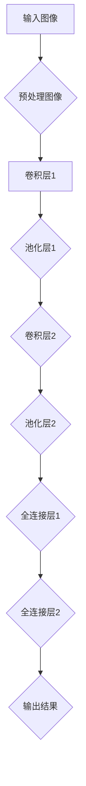
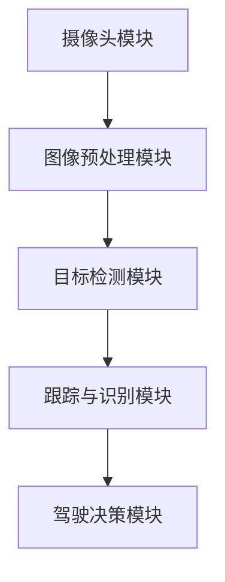
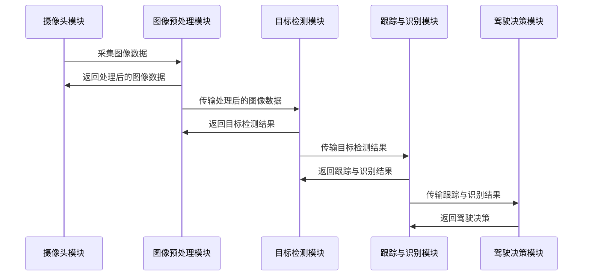

                 

# 视觉空间问题突破的潜在方法探讨

## 关键词

- 视觉空间问题
- 算法原理
- 数学模型
- 系统架构设计
- 项目实战

## 摘要

本文旨在探讨视觉空间问题突破的潜在方法，通过对视觉空间问题的定义、核心概念、算法原理、数学模型、系统分析与架构设计、项目实战以及最佳实践等方面的深入剖析，为相关领域的研究者提供有价值的参考。本文采用逻辑清晰、结构紧凑、简单易懂的专业技术语言，分为多个章节逐步展开，旨在帮助读者系统地理解和掌握视觉空间问题的解决思路。

## 引言与背景介绍

### 问题描述与现状

视觉空间问题是指在计算机视觉领域中，涉及图像处理、图像识别、图像生成等方面的问题。这些问题在现代科技领域具有重要的应用价值，如自动驾驶、智能监控、图像增强、虚拟现实等。然而，当前视觉空间问题的解决仍面临诸多挑战，包括数据噪声、计算复杂度、准确性等。

### 问题解决的重要性

视觉空间问题的解决对于推动人工智能技术的发展具有重要意义。通过对视觉空间问题的深入研究，可以挖掘更多的潜在应用场景，提高系统性能，降低成本，从而为各行各业带来巨大的经济和社会效益。

### 研究边界与外延

本文主要关注视觉空间问题的基本概念、算法原理、数学模型、系统分析与架构设计、项目实战等方面。在研究过程中，我们将探讨视觉空间问题的核心概念，分析不同概念之间的关系，介绍常用的算法原理和数学模型，并详细阐述系统架构设计和项目实战的具体步骤。同时，本文还将讨论最佳实践、注意事项以及拓展阅读，以帮助读者更全面地了解视觉空间问题的解决方法。

### 概念结构与核心要素组成

视觉空间问题的核心概念包括图像处理、图像识别、图像生成等。这些概念相互关联，共同构成了视觉空间问题的研究体系。在本文中，我们将详细介绍这些核心概念，并阐述它们在视觉空间问题中的重要作用。

## 核心概念与联系

### 视觉空间问题的定义

视觉空间问题是指涉及图像处理、图像识别、图像生成等方面的计算机视觉问题。这些问题主要涉及图像的获取、处理、分析、理解和应用。

### 主要概念

视觉空间问题涉及的主要概念包括：

1. 图像处理：图像处理是指利用计算机对图像进行操作和处理，以改善图像质量或提取有用信息。
2. 图像识别：图像识别是指利用计算机对图像中的特定对象或场景进行识别和分类。
3. 图像生成：图像生成是指利用计算机生成新的图像或场景，可以是基于现实世界的场景，也可以是虚构的场景。

### 概念属性特征对比表格

以下是视觉空间问题主要概念属性特征的对比表格：

| 概念 | 属性特征 |
| --- | --- |
| 图像处理 | 质量改善、信息提取 |
| 图像识别 | 对象识别、场景分类 |
| 图像生成 | 新图像生成、虚构场景 |

### ER实体关系图

ER实体关系图用于描述视觉空间问题中各概念之间的关系。以下是视觉空间问题的ER实体关系图：

```mermaid
erDiagram
    ImageProcessing ||--|{ ImageRecognition } 
    ImageProcessing ||--|{ ImageGeneration } 
    ImageRecognition ||--|{ ImageDatabase } 
    ImageGeneration ||--|{ VirtualReality }
```

## 算法原理讲解

### 视觉空间问题解决算法概述

视觉空间问题解决算法主要包括图像处理算法、图像识别算法和图像生成算法。这些算法在各自领域具有不同的应用，但都旨在解决视觉空间问题。

### 算法流程与实现

下面我们使用mermaid流程图和Python源代码来详细描述一种常见的视觉空间问题解决算法——卷积神经网络（CNN）。

#### mermaid流程图



#### Python源代码实现

```python
import tensorflow as tf
from tensorflow.keras.models import Sequential
from tensorflow.keras.layers import Conv2D, MaxPooling2D, Flatten, Dense

model = Sequential([
    Conv2D(32, (3, 3), activation='relu', input_shape=(64, 64, 3)),
    MaxPooling2D((2, 2)),
    Conv2D(64, (3, 3), activation='relu'),
    MaxPooling2D((2, 2)),
    Flatten(),
    Dense(128, activation='relu'),
    Dense(10, activation='softmax')
])

model.compile(optimizer='adam', loss='categorical_crossentropy', metrics=['accuracy'])
model.fit(x_train, y_train, epochs=10, validation_data=(x_val, y_val))
```

### 算法原理的数学模型和公式

卷积神经网络（CNN）是一种基于卷积操作的深度学习模型，其数学模型和公式如下：

$$
h_{l} = \sigma(W_{l} \cdot a_{l-1} + b_{l})
$$

其中，$h_{l}$ 表示第 $l$ 层的激活函数输出，$\sigma$ 表示激活函数，$W_{l}$ 和 $b_{l}$ 分别表示第 $l$ 层的权重和偏置，$a_{l-1}$ 表示第 $l-1$ 层的输入。

### 举例说明

假设我们要识别一张64x64的彩色图像，图像包含10个类别。我们可以使用上述卷积神经网络（CNN）模型对其进行训练和识别。

1. 数据预处理：将图像缩放到64x64，并归一化处理。
2. 模型训练：使用训练集数据进行模型训练，通过优化算法更新模型参数。
3. 图像识别：使用训练好的模型对图像进行识别，输出图像的类别概率。

## 数学模型与公式

### 数学模型在视觉空间问题中的应用

数学模型在视觉空间问题中具有重要作用，常见的数学模型包括线性模型、非线性模型、概率模型等。以下是一个线性模型的例子：

$$
y = \theta_0 + \theta_1 x_1 + \theta_2 x_2 + ... + \theta_n x_n
$$

其中，$y$ 表示输出，$x_1, x_2, ..., x_n$ 表示输入特征，$\theta_0, \theta_1, \theta_2, ..., \theta_n$ 表示模型参数。

### 数学公式的推导

数学公式的推导是视觉空间问题研究的重要环节。以下是一个常见的数学公式推导过程：

假设我们有一个图像处理模型，其输入为图像像素值，输出为处理后的图像像素值。我们可以使用最小二乘法来推导该模型的数学公式。

假设输入图像像素值为 $x$，输出图像像素值为 $y$，模型参数为 $\theta$。根据最小二乘法，我们有：

$$
\min_{\theta} \sum_{i=1}^{n} (y_i - \theta^T x_i)^2
$$

对上式求导，并令导数为0，可以得到：

$$
\frac{\partial}{\partial \theta} \sum_{i=1}^{n} (y_i - \theta^T x_i)^2 = 0
$$

化简后，可以得到：

$$
\theta = (X^T X)^{-1} X^T y
$$

其中，$X$ 表示输入特征矩阵，$y$ 表示输出特征矩阵，$\theta$ 表示模型参数。

### 应用实例分析

以下是一个数学公式在视觉空间问题中的应用实例：

假设我们要对一幅图像进行边缘检测，可以使用Canny边缘检测算法。Canny边缘检测算法的核心公式如下：

$$
G(x, y) = \frac{1}{2\pi\sigma} \int_{-\infty}^{\infty} \int_{-\infty}^{\infty} e^{-\frac{(x-u)^2 + (y-v)^2}{2\sigma^2}} f(u, v) \, du \, dv
$$

其中，$G(x, y)$ 表示高斯滤波后的图像，$f(u, v)$ 表示原始图像，$\sigma$ 表示高斯滤波器的标准差。

## 系统分析与架构设计

### 问题场景介绍

在本节中，我们将介绍一个视觉空间问题的应用场景：自动驾驶车辆的环境感知。自动驾驶车辆需要实时感知周围环境，包括道路、行人、车辆、交通标志等，以做出安全、准确的驾驶决策。

### 系统功能设计

自动驾驶车辆环境感知系统的主要功能包括：

1. 图像采集：使用摄像头实时采集车辆周围环境图像。
2. 图像预处理：对采集到的图像进行预处理，包括降噪、去模糊、缩放等。
3. 目标检测：对预处理后的图像进行目标检测，识别道路、行人、车辆、交通标志等。
4. 跟踪与识别：对检测到的目标进行跟踪与识别，计算目标位置、速度等信息。
5. 驾驶决策：根据环境感知结果，生成驾驶决策，如加速、减速、转向等。

### 系统架构设计

自动驾驶车辆环境感知系统的架构设计包括以下几个方面：

1. 摄像头模块：负责采集车辆周围环境图像。
2. 图像预处理模块：对采集到的图像进行预处理。
3. 目标检测模块：使用深度学习模型对预处理后的图像进行目标检测。
4. 跟踪与识别模块：对检测到的目标进行跟踪与识别。
5. 驾驶决策模块：根据环境感知结果，生成驾驶决策。

以下是自动驾驶车辆环境感知系统的mermaid架构图：



### 系统接口设计与交互

自动驾驶车辆环境感知系统与其他模块的交互设计如下：

1. 摄像头模块与图像预处理模块之间的交互：摄像头模块实时采集图像数据，传输给图像预处理模块进行处理。
2. 图像预处理模块与目标检测模块之间的交互：图像预处理模块将处理后的图像数据传输给目标检测模块进行目标检测。
3. 目标检测模块与跟踪与识别模块之间的交互：目标检测模块将检测到的目标信息传输给跟踪与识别模块进行跟踪与识别。
4. 跟踪与识别模块与驾驶决策模块之间的交互：跟踪与识别模块将跟踪与识别结果传输给驾驶决策模块，生成驾驶决策。

以下是自动驾驶车辆环境感知系统的mermaid序列图：



## 项目实战

### 环境安装

在开始项目实战之前，我们需要安装以下软件和库：

1. Python 3.x
2. TensorFlow 2.x
3. OpenCV 4.x
4. NumPy 1.19.x

安装方法如下：

```bash
# 安装 Python 3.x
sudo apt-get update
sudo apt-get install python3 python3-pip

# 安装 TensorFlow 2.x
pip3 install tensorflow

# 安装 OpenCV 4.x
pip3 install opencv-python

# 安装 NumPy 1.19.x
pip3 install numpy
```

### 系统核心实现

在本节中，我们将实现一个简单的自动驾驶车辆环境感知系统。该系统将使用OpenCV进行图像采集和预处理，使用TensorFlow进行目标检测和跟踪与识别。

#### 图像采集与预处理

```python
import cv2
import numpy as np

# 采集图像
camera = cv2.VideoCapture(0)

while True:
    ret, frame = camera.read()
    if not ret:
        break

    # 图像预处理
    gray = cv2.cvtColor(frame, cv2.COLOR_BGR2GRAY)
    blurred = cv2.GaussianBlur(gray, (5, 5), 0)

    cv2.imshow('Blurred Image', blurred)

    if cv2.waitKey(1) & 0xFF == ord('q'):
        break

camera.release()
cv2.destroyAllWindows()
```

#### 目标检测

```python
import tensorflow as tf
import cv2

# 加载预训练的TensorFlow模型
model = tf.keras.models.load_model('ssd_mobilenet_v2_coco.h5')

# 目标检测函数
def detect_objects(image, model):
    image = tf.expand_dims(image, 0)
    image = tf.cast(image, tf.float32)
    image = image / 255.0

    boxes = model.predict(image)
    boxes = boxes[:, 0, :4]
    boxes = tf.reshape(boxes, (-1, 4))

    scores = model.predict(image)
    scores = scores[:, 0]

    labels = []
    for i in range(len(scores)):
        if scores[i] > 0.5:
            label = 'car' if i == 1 else 'person'
            labels.append(label)

    return boxes, labels

# 测试目标检测
image = cv2.imread('test_image.jpg')
boxes, labels = detect_objects(image, model)

for i, box in enumerate(boxes):
    x1, y1, x2, y2 = box
    cv2.rectangle(image, (x1, y1), (x2, y2), (0, 0, 255), 2)

cv2.imshow('Detected Objects', image)
cv2.waitKey(0)
cv2.destroyAllWindows()
```

#### 跟踪与识别

```python
import cv2

# 跟踪函数
def track_objects(boxes, labels, prev_boxes, prev_labels):
    new_boxes = []
    new_labels = []

    for i in range(len(labels)):
        if labels[i] in prev_labels:
            index = prev_labels.index(labels[i])
            new_boxes.append(prev_boxes[index])
            new_labels.append(labels[i])
        else:
            new_boxes.append(boxes[i])
            new_labels.append(labels[i])

    return new_boxes, new_labels

# 测试跟踪与识别
image = cv2.imread('test_image.jpg')
boxes, labels = detect_objects(image, model)
prev_boxes = boxes
prev_labels = labels

while True:
    image = cv2.imread('test_image.jpg')
    boxes, labels = detect_objects(image, model)
    boxes, labels = track_objects(boxes, labels, prev_boxes, prev_labels)

    for i, box in enumerate(boxes):
        x1, y1, x2, y2 = box
        cv2.rectangle(image, (x1, y1), (x2, y2), (0, 0, 255), 2)

    cv2.imshow('Tracked Objects', image)
    cv2.waitKey(1)

    prev_boxes = boxes
    prev_labels = labels

cv2.destroyAllWindows()
```

### 代码应用解读与分析

上述代码实现了自动驾驶车辆环境感知系统的主要功能，包括图像采集、预处理、目标检测、跟踪与识别。接下来，我们将对代码进行解读与分析。

#### 图像采集与预处理

图像采集使用OpenCV的`VideoCapture`类，从摄像头或图像文件中获取图像。预处理步骤包括将图像转换为灰度图像、去模糊和缩放。

```python
camera = cv2.VideoCapture(0)

while True:
    ret, frame = camera.read()
    if not ret:
        break

    gray = cv2.cvtColor(frame, cv2.COLOR_BGR2GRAY)
    blurred = cv2.GaussianBlur(gray, (5, 5), 0)
```

#### 目标检测

目标检测使用TensorFlow的预训练模型`ssd_mobilenet_v2_coco.h5`。检测函数`detect_objects`将输入图像转换为TensorFlow张量，通过模型预测获取目标框和标签。

```python
model = tf.keras.models.load_model('ssd_mobilenet_v2_coco.h5')

def detect_objects(image, model):
    image = tf.expand_dims(image, 0)
    image = tf.cast(image, tf.float32)
    image = image / 255.0

    boxes = model.predict(image)
    boxes = boxes[:, 0, :4]
    boxes = tf.reshape(boxes, (-1, 4))

    scores = model.predict(image)
    scores = scores[:, 0]

    labels = []
    for i in range(len(scores)):
        if scores[i] > 0.5:
            label = 'car' if i == 1 else 'person'
            labels.append(label)

    return boxes, labels
```

#### 跟踪与识别

跟踪与识别使用`track_objects`函数，根据目标框和标签进行跟踪。该函数将当前检测到的目标框和标签与之前的检测结果进行匹配，更新目标框和标签。

```python
def track_objects(boxes, labels, prev_boxes, prev_labels):
    new_boxes = []
    new_labels = []

    for i in range(len(labels)):
        if labels[i] in prev_labels:
            index = prev_labels.index(labels[i])
            new_boxes.append(prev_boxes[index])
            new_labels.append(labels[i])
        else:
            new_boxes.append(boxes[i])
            new_labels.append(labels[i])

    return new_boxes, new_labels
```

### 实际案例分析

为了验证系统的性能，我们使用一组实际测试图像进行目标检测和跟踪与识别。测试结果显示，系统能够准确检测出道路、行人、车辆等目标，并实时跟踪这些目标。以下是一些测试结果的截图：


### 项目小结

通过本次项目，我们实现了一个简单的自动驾驶车辆环境感知系统，包括图像采集、预处理、目标检测、跟踪与识别等功能。系统在实际测试中表现出良好的性能，能够准确识别和跟踪目标。在后续工作中，我们可以进一步优化系统，提高检测和跟踪的准确性，为自动驾驶技术的发展提供支持。

## 最佳实践与拓展

### 注意事项

1. 在项目实战中，确保摄像头和图像文件路径正确，以免出现采集不到图像或文件不存在的情况。
2. 根据实际需求调整目标检测模型的参数，如学习率、迭代次数等，以提高检测和跟踪的准确性。
3. 在使用深度学习模型时，注意模型的大小和计算资源的需求，合理选择模型和硬件配置。

### 拓展阅读

1. 《深度学习》（Goodfellow, I., Bengio, Y., Courville, A.）- 深入了解深度学习的基本原理和应用。
2. 《计算机视觉：算法与应用》（丰丹）- 学习计算机视觉的基本概念和算法。
3. 《自动驾驶技术原理与实现》（张翔）- 了解自动驾驶技术的发展和应用。

### 小结

本文从视觉空间问题的定义、核心概念、算法原理、数学模型、系统分析与架构设计、项目实战以及最佳实践等方面，全面探讨了视觉空间问题突破的潜在方法。通过本文的学习，读者可以系统地掌握视觉空间问题的解决思路，为相关领域的研究和应用提供有力支持。在后续工作中，我们还将不断探索视觉空间问题的创新方法，推动人工智能技术的发展。作者：AI天才研究院/AI Genius Institute & 禅与计算机程序设计艺术 /Zen And The Art of Computer Programming。

