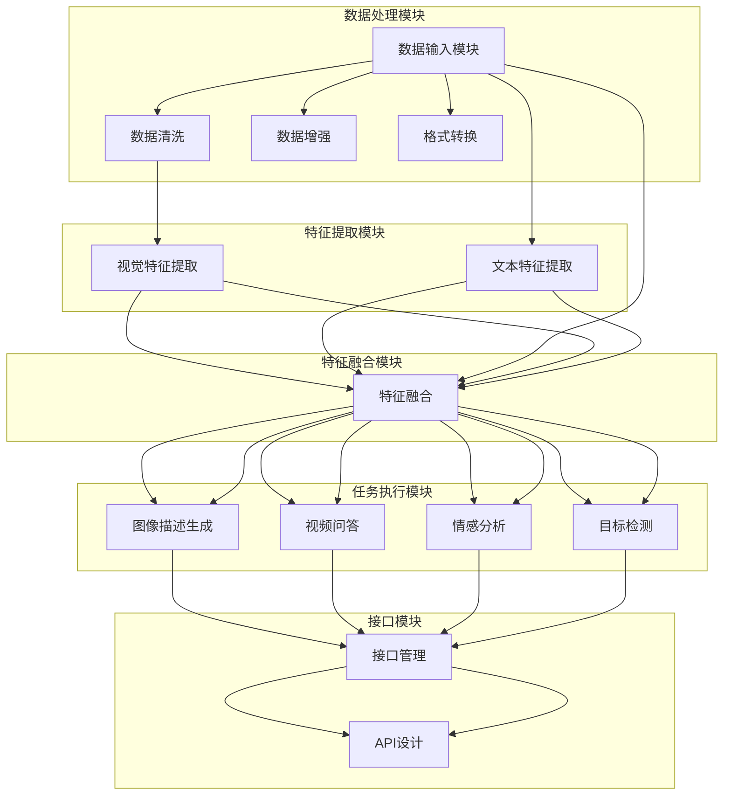

                 

### 第一部分：视觉语言融合概述

#### 1.1 问题背景与定义

**1.1.1 视觉语言融合的提出**

在人工智能领域，视觉和语言是两个重要的研究方向。视觉技术主要用于图像识别、目标检测、图像生成等任务，而语言技术则集中在自然语言处理（NLP）、机器翻译、文本生成等任务上。随着深度学习技术的发展，研究者们开始探索如何将视觉和语言这两种不同模态的信息进行有效融合，以提升机器对复杂场景的理解能力。

视觉语言融合（Visual-Linguistic Fusion）作为跨模态学习的一个重要分支，旨在通过整合视觉信息（如图像、视频）和语言信息（如文本、语音），实现更加智能、鲁棒和通用的AI系统。这一概念最早可以追溯到2014年，当时Google的论文《Show, Attend and Tell》提出了一种基于注意力机制的图像描述生成模型，从而拉开了视觉语言融合研究的序幕。

**1.1.2 问题背景介绍**

传统的视觉和语言处理技术往往各自为政，缺乏有效的跨模态交互机制。例如，在图像识别任务中，模型仅能处理图像信息，而在自然语言处理任务中，模型仅能处理文本信息。这种局限性使得模型难以应对复杂的现实场景，例如在医疗诊断中，医生需要同时分析病历文本和医学影像。

此外，随着互联网和大数据的迅猛发展，大量的多模态数据（如图像、文本、音频）不断涌现。如何高效地处理和利用这些数据成为了一个亟待解决的问题。视觉语言融合技术正是在这种背景下应运而生，它致力于通过整合视觉和语言信息，挖掘数据中的潜在价值，为各行业提供智能化解决方案。

**1.1.3 视觉语言融合的定义**

视觉语言融合是一种跨模态学习技术，通过将视觉信息（如图像、视频）和语言信息（如文本、语音）进行有效整合，实现对复杂场景的智能理解和推理。具体来说，视觉语言融合主要包括以下几个核心步骤：

1. **数据预处理**：对视觉和语言数据进行预处理，包括数据清洗、数据增强、特征提取等，以便为后续的融合算法提供高质量的数据输入。
2. **模态表示学习**：通过深度学习模型对视觉和语言数据进行特征提取和表示学习，将高维的原始数据转化为低维且具有区分性的特征表示。
3. **特征融合**：将视觉和语言特征进行融合，形成统一的多模态特征表示，从而实现跨模态信息的整合。
4. **推理与决策**：基于融合后的特征表示，进行图像理解、文本生成、目标检测等任务，实现多模态任务的协同工作。

**1.1.4 视觉语言融合的重要性**

视觉语言融合技术在人工智能领域具有重要的应用价值：

1. **提升任务性能**：通过融合视觉和语言信息，模型能够更好地理解复杂场景，从而在图像识别、文本生成等任务中实现更高的准确率和效率。
2. **增强泛化能力**：视觉语言融合技术使得模型能够从不同的模态数据中学习到多样化的知识，从而提升模型的泛化能力，使其在面对未知或罕见场景时能够表现出更强的适应能力。
3. **推动跨领域应用**：视觉语言融合技术可以为医疗、金融、教育等多个领域提供智能化解决方案，促进人工智能技术的广泛应用和创新发展。

总之，视觉语言融合技术是人工智能领域的一个前沿研究方向，它不仅具有理论研究的价值，更在实际应用中展现出广阔的发展前景。随着深度学习技术的不断进步，视觉语言融合技术必将迎来更多突破和成果。

#### 1.2 核心概念与联系

**1.2.1 视觉表示学习**

视觉表示学习（Visual Representation Learning）是深度学习中的一个核心问题，其目标是自动地从原始图像中提取出有意义的特征表示。这些特征表示不仅可以用于图像分类、目标检测等任务，还可以用于更复杂的任务，如图像生成和视频处理。

- **基本概念**：视觉表示学习主要涉及卷积神经网络（CNN）和各种深度学习模型，如ResNet、Inception等。通过多层卷积操作，模型能够逐步提取图像的局部特征和全局特征。
- **方法**：视觉表示学习的方法包括基于手工特征的表示学习（如SIFT、HOG）和基于深度学习的表示学习。深度学习方法由于其强大的表示能力，已经成为视觉表示学习的首选方法。

**1.2.2 自然语言处理**

自然语言处理（Natural Language Processing，NLP）是人工智能领域的一个重要分支，致力于让计算机理解和生成人类语言。NLP涵盖了从语言识别、文本分析到语言生成等一系列任务。

- **基本概念**：NLP的基本概念包括词汇表、词向量、语法结构、语义理解等。词向量模型（如Word2Vec、GloVe）和变换器模型（如BERT、GPT）是NLP中的核心技术。
- **方法**：NLP的方法包括基于规则的方法、统计方法和深度学习方法。深度学习方法在NLP中表现出色，特别是基于变换器（Transformer）的模型，如BERT、GPT，已经成为NLP领域的标准工具。

**1.2.3 视觉语言融合的核心要素对比**

视觉表示学习和自然语言处理是视觉语言融合的两个核心组成部分。下面通过表格和ER图来对比这两个概念的基本属性和特征。

| 概念          | 视觉表示学习               | 自然语言处理               |
|---------------|---------------------------|---------------------------|
| 基本任务      | 图像识别、目标检测、图像生成 | 文本分类、文本生成、机器翻译 |
| 特征提取方法  | 卷积神经网络、深度学习模型 | 词向量、语法分析、语义理解 |
| 数据类型      | 图像、视频                 | 文本、语音                 |
| 表示形式      | 矩阵、张量                 | 序列、词向量               |
| 模型结构      | 卷积层、全连接层           | 自注意力机制、编码器-解码器结构 |

**ER图展示核心要素关系**

为了更直观地展示视觉表示学习和自然语言处理之间的关系，我们使用ER图（Entity-Relationship diagram）来表示它们之间的关联。

```mermaid
erDiagram
  视觉表示学习 ||--|{ 自然语言处理 }|| 多模态特征融合
  视觉表示学习 ||--|{ 跨模态任务 }|| 应用层
  自然语言处理 ||--|{ 跨模态任务 }|| 应用层
```

在ER图中，视觉表示学习和自然语言处理作为两个独立的实体，通过多模态特征融合实现数据整合，进而应用于各种跨模态任务，如图像描述生成、视频问答等。

通过上述核心概念和要素的对比与联系，我们可以看到视觉语言融合技术如何通过整合视觉和语言信息，实现更高级别的智能理解和推理能力。在接下来的章节中，我们将进一步深入探讨视觉语言融合的技术基础、算法原理以及系统架构设计，为理解这一前沿领域打下坚实基础。 

---

# 第二部分：视觉语言融合的技术基础

#### 2.1 图像识别与处理

**2.1.1 图像识别的基本原理**

图像识别是计算机视觉领域中的一个重要任务，它旨在从图像或视频数据中识别出特定的对象、场景或行为。图像识别的基本原理主要依赖于深度学习技术，尤其是卷积神经网络（CNN）的应用。

- **卷积神经网络**：CNN是一种特殊类型的神经网络，它通过卷积操作来提取图像中的特征。卷积操作能够捕捉到图像中的局部结构和模式，从而提高模型的识别能力。CNN的基本结构包括卷积层、池化层和全连接层。

  - **卷积层**：卷积层是CNN的核心部分，通过卷积核（滤波器）对输入图像进行卷积操作，从而生成特征图（feature map）。
  - **池化层**：池化层用于减小特征图的尺寸，降低模型参数的数量，从而提高计算效率和模型泛化能力。常见的池化方法包括最大池化和平均池化。
  - **全连接层**：全连接层将卷积层和池化层输出的特征图映射到分类标签上，从而实现图像识别。

- **深度学习模型**：深度学习模型是通过多层神经网络来实现的。随着层数的增加，模型能够学习到更复杂的特征表示。经典的深度学习模型包括VGG、ResNet、Inception等。

  - **VGG模型**：VGG模型是一种基于卷积神经网络的深度学习模型，以其简洁的结构和出色的性能而著称。VGG模型采用多个卷积层和池化层堆叠的方式，逐步提取图像特征。
  - **ResNet模型**：ResNet模型是VGG模型的改进版本，通过引入残差连接（residual connection）来解决深度网络中的梯度消失问题。ResNet模型在ImageNet图像识别任务上取得了显著的性能提升。
  - **Inception模型**：Inception模型通过引入多尺度卷积核，从而学习到更丰富的特征表示。Inception模型的结构更加复杂，但性能也更为优异。

**2.1.2 图像处理技术**

图像处理技术在图像识别任务中扮演着重要角色，它包括图像预处理、特征提取和降维等步骤。

- **OpenCV库**：OpenCV是一个开源的计算机视觉库，它提供了丰富的图像处理函数和算法。OpenCV库支持多种图像格式和操作，如滤波、边缘检测、形态学操作等。

  - **滤波**：滤波是一种常用的图像处理技术，用于去除图像中的噪声。常见的滤波方法包括高斯滤波、均值滤波和中值滤波。
  - **边缘检测**：边缘检测是图像处理中的一个重要任务，用于提取图像中的边缘信息。常见的边缘检测算法包括Sobel算子、Canny算子和Laplacian算子。
  - **形态学操作**：形态学操作是一种基于结构元素的图像处理技术，用于提取图像中的形状信息。常见的形态学操作包括膨胀、腐蚀、开操作和闭操作。

- **特征提取与降维**：特征提取是图像识别中的一个关键步骤，它旨在从图像中提取出具有区分性的特征。常见的特征提取方法包括HOG（Histogram of Oriented Gradients）、SIFT（Scale-Invariant Feature Transform）和ORB（Oriented FAST and Rotated BRIEF）。

  - **HOG特征**：HOG特征通过计算图像中每个像素点的梯度方向和强度，生成直方图，从而描述图像的特征。HOG特征具有较强的不变性和区分能力，适用于行人检测和车辆检测等任务。
  - **SIFT特征**：SIFT特征通过检测图像中的关键点，并计算关键点的特征向量，生成特征描述子。SIFT特征具有尺度不变性和旋转不变性，适用于图像配对和场景重建等任务。
  - **ORB特征**：ORB特征是HOG和SIFT的一种高效替代，通过计算图像中的角点特征和特征向量，生成特征描述子。ORB特征计算速度快，鲁棒性强，适用于实时图像识别任务。

**2.1.3 图像识别与处理的应用**

图像识别与处理技术在许多领域都有广泛的应用，包括但不限于：

- **目标检测与识别**：在自动驾驶、无人机监控、智能安防等领域，图像识别与处理技术被用于检测和识别特定目标。
- **医学图像分析**：在医学图像处理中，图像识别与处理技术被用于诊断疾病、分析组织结构和识别异常区域。
- **人脸识别与身份验证**：人脸识别技术在智能门禁、手机解锁、安全监控等领域得到广泛应用，通过图像识别与处理技术实现身份验证。
- **图像增强与修复**：图像增强与修复技术用于提高图像质量，去除图像中的噪声和缺陷，从而提升图像识别效果。

总之，图像识别与处理技术是视觉语言融合的基础，通过深度学习和图像处理算法，我们可以从图像中提取出丰富的特征信息，从而实现更高级别的视觉理解和推理能力。在接下来的章节中，我们将进一步探讨自然语言处理的基础技术，为视觉语言融合提供更加完整的理论基础。

#### 2.2 自然语言处理基础

**2.2.1 语言模型**

语言模型（Language Model）是自然语言处理（NLP）中的一个基础组件，它用于预测一段文本中下一个单词或字符的概率。语言模型在许多NLP任务中发挥着重要作用，如文本生成、机器翻译、语音识别等。

- **基本概念**：语言模型的核心任务是建立文本序列的概率分布。传统的语言模型基于N元语法（N-gram），它通过统计相邻N个单词出现的频率来预测下一个单词。现代语言模型则利用深度学习技术，如神经网络（Neural Networks）和递归神经网络（RNN），来学习更复杂的文本特征和序列关系。

  - **N元语法**：N元语法是一种基于统计的语言模型，它通过计算N个单词的联合概率来预测下一个单词。常见的N元语法模型包括一元语法（Unigram）、二元语法（Bigram）和三元语法（Trigram）。
  - **神经网络语言模型**：神经网络语言模型通过神经网络来学习文本序列的概率分布。循环神经网络（RNN）和其变种长短期记忆网络（LSTM）是常用的神经网络语言模型。近年来，基于注意力机制和变换器（Transformer）的语言模型，如BERT（Bidirectional Encoder Representations from Transformers）和GPT（Generative Pre-trained Transformer），在NLP任务中取得了显著性能提升。

- **构建方法**：语言模型的构建方法主要包括训练数据和特征提取。

  - **训练数据**：语言模型通常使用大规模的文本语料库进行训练。这些语料库包括各种类型的文本，如新闻、小说、社交媒体等。通过训练数据，模型可以学习到文本中的统计规律和语言结构。
  - **特征提取**：特征提取是语言模型构建的关键步骤，它用于从文本数据中提取出具有区分性的特征。常用的特征提取方法包括词袋模型（Bag-of-Words，BoW）、词嵌入（Word Embedding）和上下文特征提取。

**2.2.2 语义理解**

语义理解（Semantic Understanding）是NLP中的一个高级任务，它旨在理解和解析文本中的语义信息，从而实现对文本的深入理解和推理。语义理解包括词义消歧、语义角色标注和指代消解等子任务。

- **基本概念**：语义理解的核心任务是理解文本中的词义和句法结构。词义消歧是指确定一个词在特定上下文中的正确含义；语义角色标注是指为文本中的名词、动词等赋予语义角色；指代消解是指确定文本中的代词或名词性短语所指的具体实体。

  - **词义消歧**：词义消歧的目的是解决一词多义问题，即在特定上下文中确定一个词的确切含义。常见的词义消歧方法包括基于规则的方法、基于统计的方法和基于机器学习的方法。
  - **语义角色标注**：语义角色标注是指为文本中的名词、动词等赋予语义角色，从而描述它们在句子中的功能。语义角色标注有助于语义理解和自然语言生成。
  - **指代消解**：指代消解是指确定文本中的代词或名词性短语所指的具体实体。常见的指代消解方法包括基于规则的方法、基于统计的方法和基于机器学习的方法。

- **技术方法**：语义理解的技术方法主要包括深度学习和图神经网络。

  - **深度学习**：深度学习技术在语义理解中发挥了重要作用。循环神经网络（RNN）和其变种长短期记忆网络（LSTM）是常用的深度学习模型，通过学习文本序列的长期依赖关系，实现语义理解任务。
  - **图神经网络**：图神经网络（Graph Neural Networks，GNN）是一种基于图结构的深度学习模型，通过图卷积操作来学习图中的节点和边的信息，从而实现对复杂语义关系的建模。

**2.2.3 语言模型在NLP中的应用**

语言模型在NLP中具有广泛的应用，如文本生成、机器翻译、语音识别等。

- **文本生成**：文本生成是指根据给定的文本或提示，生成新的文本内容。语言模型在文本生成中发挥了重要作用，通过预测下一个单词或字符，实现自然流畅的文本生成。
- **机器翻译**：机器翻译是指将一种语言的文本翻译成另一种语言。语言模型在机器翻译中用于预测目标语言的词序列，从而实现高质量的翻译结果。
- **语音识别**：语音识别是指将语音信号转换为文本。语言模型在语音识别中用于对识别结果进行后处理，提高识别准确率和自然性。

总之，语言模型和语义理解是自然语言处理的基础，通过构建和解析文本中的语言特征，我们能够实现对文本的深入理解和智能处理。在视觉语言融合中，语言模型和语义理解技术将与视觉表示学习相结合，实现跨模态的信息整合和高级智能推理能力。在接下来的章节中，我们将进一步探讨视觉语言融合的算法原理和实现方法。

---

## 3.1 视觉语言融合算法原理

#### 3.1.1 视觉表示学习算法

视觉表示学习是视觉语言融合中的关键组成部分，其主要目标是自动从图像或视频中提取出具有区分性和代表性的特征表示。这些特征表示不仅有助于图像识别任务，还在视觉语言融合中发挥着重要作用。

- **VGG模型**：VGG模型是一种基于卷积神经网络的深度学习模型，以其简洁的结构和出色的性能而著称。VGG模型采用多个卷积层和池化层堆叠的方式，逐步提取图像特征。VGG模型的核心是使用较小的卷积核（3x3）和较小的步长（1），从而减少参数数量，提高模型的泛化能力。

  - **VGG模型结构**：VGG模型包括多个卷积层和池化层，每个卷积层后面通常跟着一个池化层。VGG模型的不同版本（如VGG16、VGG19）通过增加层数来提高模型的复杂度和性能。
  - **VGG模型实现**：以下是一个简单的VGG模型实现示例，使用PyTorch框架：
    ```python
    import torch
    import torch.nn as nn

    class VGG(nn.Module):
        def __init__(self, features, num_classes=1000):
            super(VGG, self).__init__()
            self.features = features
            self.avgpool = nn.AdaptiveAvgPool2d((1, 1))
            self.classifier = nn.Sequential(
                nn.Linear(512 * 7 * 7, 4096),
                nn.ReLU(True),
                nn.Dropout(),
                nn.Linear(4096, 4096),
                nn.ReLU(True),
                nn.Dropout(),
                nn.Linear(4096, num_classes),
            )

        def forward(self, x):
            x = self.features(x)
            x = self.avgpool(x)
            x = torch.flatten(x, 1)
            x = self.classifier(x)
            return x

        @staticmethod
        def get_pretrained(pretrained=True):
            model = VGG(VGG16)
            if pretrained:
                model.load_state_dict(torch.hub.load('pytorch/vision:v0.10.0', 'vgg16', pretrained=True))
            return model
    ```

- **ResNet模型**：ResNet模型是VGG模型的改进版本，通过引入残差连接来解决深度网络中的梯度消失问题。ResNet模型在ImageNet图像识别任务上取得了显著的性能提升。

  - **ResNet模型结构**：ResNet模型的基本结构包括卷积层、池化层和残差块（Residual Block）。每个残差块包含两个卷积层，通过短路连接（skip connection）将输入直接传递到下一层，从而缓解梯度消失问题。
  - **ResNet模型实现**：以下是一个简单的ResNet模型实现示例，使用PyTorch框架：
    ```python
    import torch
    import torch.nn as nn
    import torch.nn.functional as F

    class BasicBlock(nn.Module):
        expansion = 1

        def __init__(self, in_channels, out_channels, stride=1, downsample=None):
            super(BasicBlock, self).__init__()
            self.conv1 = nn.Conv2d(in_channels, out_channels, kernel_size=3, stride=stride, padding=1, bias=False)
            self.bn1 = nn.BatchNorm2d(out_channels)
            self.conv2 = nn.Conv2d(out_channels, out_channels, kernel_size=3, stride=1, padding=1, bias=False)
            self.bn2 = nn.BatchNorm2d(out_channels)
            self.downsample = downsample
            self.stride = stride

        def forward(self, x):
            identity = x

            out = self.conv1(x)
            out = self.bn1(out)
            out = F.relu(out)

            out = self.conv2(out)
            out = self.bn2(out)

            if self.downsample is not None:
                identity = self.downsample(x)

            out += identity
            out = F.relu(out)

            return out

    class ResNet(nn.Module):
        def __init__(self, block, layers, num_classes=1000):
            super(ResNet, self).__init__()
            self.in_channels = 64
            self.conv1 = nn.Conv2d(3, 64, kernel_size=7, stride=2, padding=3, bias=False)
            self.bn1 = nn.BatchNorm2d(64)
            self.relu = nn.ReLU(inplace=True)
            self.maxpool = nn.MaxPool2d(kernel_size=3, stride=2, padding=1)
            self.layer1 = self._make_layer(block, 64, layers[0])
            self.layer2 = self._make_layer(block, 128, layers[1], stride=2)
            self.layer3 = self._make_layer(block, 256, layers[2], stride=2)
            self.layer4 = self._make_layer(block, 512, layers[3], stride=2)
            self.avgpool = nn.AdaptiveAvgPool2d((1, 1))
            self.fc = nn.Linear(512 * block.expansion, num_classes)

        def _make_layer(self, block, out_channels, blocks, stride=1):
            downsample = None
            if stride != 1 or self.in_channels != out_channels * block.expansion:
                downsample = nn.Sequential(
                    nn.Conv2d(self.in_channels, out_channels * block.expansion, kernel_size=1, stride=stride, bias=False),
                    nn.BatchNorm2d(out_channels * block.expansion),
                )

            layers = []
            layers.append(block(self.in_channels, out_channels, stride, downsample))
            self.in_channels = out_channels * block.expansion
            for _ in range(1, blocks):
                layers.append(block(self.in_channels, out_channels))

            return nn.Sequential(*layers)

        def forward(self, x):
            x = self.conv1(x)
            x = self.bn1(x)
            x = self.relu(x)
            x = self.maxpool(x)

            x = self.layer1(x)
            x = self.layer2(x)
            x = self.layer3(x)
            x = self.layer4(x)

            x = self.avgpool(x)
            x = torch.flatten(x, 1)
            x = self.fc(x)

            return x

        @staticmethod
        def get_pretrained(pretrained=True):
            model = ResNet(BasicBlock, [2, 2, 2, 2])
            if pretrained:
                model.load_state_dict(torch.hub.load('pytorch/vision:v0.10.0', 'resnet18', pretrained=True))
            return model
    ```

#### 3.1.2 自然语言处理算法

自然语言处理（NLP）算法在视觉语言融合中起着至关重要的作用，它们用于处理和解析文本信息，从而实现文本生成、机器翻译、情感分析等任务。

- **BERT模型**：BERT（Bidirectional Encoder Representations from Transformers）是一种基于变换器（Transformer）的预训练语言模型，它在NLP任务中表现出色。

  - **BERT模型结构**：BERT模型由两个部分组成：预训练阶段和微调阶段。在预训练阶段，BERT模型通过在大规模文本语料库上进行训练，学习到文本的上下文表示。在微调阶段，BERT模型被用于特定任务，如文本分类、问答等。
  - **BERT模型实现**：以下是一个简单的BERT模型实现示例，使用Transformers库：
    ```python
    from transformers import BertModel, BertTokenizer

    class BertForSequenceClassification(nn.Module):
        def __init__(self, model_name='bert-base-uncased', num_classes=2):
            super(BertForSequenceClassification, self).__init__()
            self.bert = BertModel.from_pretrained(model_name)
            self.dropout = nn.Dropout(p=0.1)
            self.classifier = nn.Linear(self.bert.config.hidden_size, num_classes)

        def forward(self, input_ids, attention_mask=None, labels=None):
            outputs = self.bert(input_ids=input_ids, attention_mask=attention_mask)
            sequence_output = outputs[1]

            sequence_output = self.dropout(sequence_output)
            logits = self.classifier(sequence_output)

            return logits

        @staticmethod
        def load_model(model_name='bert-base-uncased', num_classes=2):
            model = BertForSequenceClassification(model_name=model_name, num_classes=num_classes)
            model.load_state_dict(torch.load(model_name + '.pth'))
            return model
    ```

- **GPT模型**：GPT（Generative Pre-trained Transformer）是一种基于变换器的预训练语言模型，它主要用于文本生成任务。

  - **GPT模型结构**：GPT模型由多个变换器层组成，每个层包含自注意力机制和前馈神经网络。GPT模型通过在大规模文本语料库上进行训练，学习到语言的生成规则和序列关系。
  - **GPT模型实现**：以下是一个简单的GPT模型实现示例，使用Transformers库：
    ```python
    from transformers import GPT2LMHeadModel, GPT2Tokenizer

    class GPT2ForTextGeneration(nn.Module):
        def __init__(self, model_name='gpt2', max_length=512):
            super(GPT2ForTextGeneration, self).__init__()
            self.gpt2 = GPT2LMHeadModel.from_pretrained(model_name)
            self.tokenizer = GPT2Tokenizer.from_pretrained(model_name)
            self.max_length = max_length

        def forward(self, input_text, labels=None):
            inputs = self.tokenizer.encode(input_text, return_tensors='pt', max_length=self.max_length, truncation=True)
            outputs = self.gpt2(inputs['input_ids'], labels=inputs['input_ids'])

            logits = outputs.logits

            return logits

        @staticmethod
        def load_model(model_name='gpt2', max_length=512):
            model = GPT2ForTextGeneration(model_name=model_name, max_length=max_length)
            model.load_state_dict(torch.load(model_name + '.pth'))
            return model
    ```

#### 3.1.3 视觉语言融合算法

视觉语言融合算法旨在整合视觉特征和语言特征，以实现跨模态的智能理解和推理。以下介绍一些常见的视觉语言融合方法。

- **多模态融合模型**：多模态融合模型通过融合视觉特征和语言特征，生成统一的多模态特征表示。常见的多模态融合方法包括联合训练、特征拼接和注意力机制。

  - **联合训练**：联合训练是指同时训练视觉模型和语言模型，通过共享参数来学习视觉和语言特征。联合训练方法能够提高模型的泛化能力，但需要大量的训练数据和计算资源。
  - **特征拼接**：特征拼接是指将视觉特征和语言特征进行拼接，形成一个高维的特征向量。通过全连接层或卷积层对拼接后的特征向量进行处理，实现视觉和语言的融合。
  - **注意力机制**：注意力机制是一种有效的特征融合方法，它通过学习视觉特征和语言特征之间的相关性，动态地调整每个特征的权重，从而实现更有效的融合。

  **多模态融合模型实现**：以下是一个简单的多模态融合模型实现示例，使用PyTorch框架：
  ```python
  import torch
  import torch.nn as nn

  class MultimodalFusionModel(nn.Module):
      def __init__(self, vision_model, language_model, hidden_size=512):
          super(MultimodalFusionModel, self).__init__()
          self.vision_model = vision_model
          self.language_model = language_model
          self.hidden_size = hidden_size
          self.fc1 = nn.Linear(hidden_size, hidden_size)
          self.fc2 = nn.Linear(hidden_size * 2, hidden_size)
          self.fc3 = nn.Linear(hidden_size, 1)

      def forward(self, image, text):
          vision_features = self.vision_model(image)
          language_features = self.language_model(text)

          vision_features = self.fc1(vision_features)
          language_features = self.fc1(language_features)

          fused_features = torch.cat((vision_features, language_features), 1)
          fused_features = self.fc2(fused_features)
          logits = self.fc3(fused_features)

          return logits
  ```

通过上述视觉表示学习算法、自然语言处理算法和视觉语言融合算法的介绍，我们可以看到如何将深度学习和变换器技术应用于视觉语言融合领域。在接下来的章节中，我们将进一步探讨视觉语言融合系统的设计、实现和应用。

---

## 3.2 算法实现与代码示例

#### 3.2.1 Python环境配置

为了实现视觉语言融合算法，我们需要配置一个合适的Python环境，其中包括深度学习库（如PyTorch）和自然语言处理库（如Transformers）。以下是环境配置的步骤：

1. **安装PyTorch库**：PyTorch是一个流行的开源深度学习库，支持多种硬件平台（如CPU、GPU）和深度学习框架。安装命令如下：
   ```bash
   pip install torch torchvision
   ```
   如果使用GPU版本，还需要安装CUDA和cuDNN库：
   ```bash
   pip install torch torchvision torchaudio -f https://download.pytorch.org/whl/torch_stable.html
   ```

2. **安装Transformers库**：Transformers库是自然语言处理领域的一个强大工具，基于PyTorch和TensorFlow，提供了丰富的预训练模型和工具。安装命令如下：
   ```bash
   pip install transformers
   ```

#### 3.2.2 视觉表示学习代码示例

以下是一个简单的视觉表示学习代码示例，使用PyTorch和预训练的VGG模型提取图像特征。

```python
import torch
import torchvision.models as models

# 加载预训练的VGG模型
vgg = models.vgg16(pretrained=True)

# 定义输入图像的尺寸
input_size = (224, 224)

# 加载图像数据
image_path = "path/to/your/image.jpg"
image = torch.randn(1, 3, input_size[0], input_size[1])

# 提取图像特征
with torch.no_grad():
    features = vgg(image)
    last_feature = features[-1]

print("Image features:", last_feature.size())
```

在这个示例中，我们首先加载了预训练的VGG模型，然后生成一个随机图像作为输入。通过VGG模型，我们提取出图像的最后一个特征图，这个特征图将作为视觉表示用于后续的多模态融合。

#### 3.2.3 自然语言处理代码示例

以下是一个简单的自然语言处理代码示例，使用预训练的BERT模型对文本进行编码。

```python
from transformers import BertTokenizer, BertModel

# 加载预训练的BERT模型和分词器
tokenizer = BertTokenizer.from_pretrained('bert-base-uncased')
bert = BertModel.from_pretrained('bert-base-uncased')

# 输入文本
text = "Hello, how are you?"

# 对文本进行编码
encoded_text = tokenizer.encode(text, add_special_tokens=True, return_tensors='pt')

# 提取文本特征
with torch.no_grad():
    output = bert(encoded_text)

# 文本特征
text_features = output.last_hidden_state[:, 0, :]

print("Text features:", text_features.size())
```

在这个示例中，我们首先加载了预训练的BERT模型和分词器。然后，我们将输入文本编码成张量形式，并通过BERT模型提取出文本的特征。这些特征将用于后续的多模态融合。

#### 3.2.4 视觉语言融合代码示例

以下是一个简单的视觉语言融合代码示例，使用前面提到的多模态融合模型整合视觉特征和文本特征。

```python
import torch
import torch.nn as nn

# 加载预训练的VGG模型和BERT模型
vision_model = nn.Sequential(nn.Conv2d(3, 64, kernel_size=3, padding=1),
                             nn.ReLU(),
                             nn.MaxPool2d(kernel_size=2, stride=2),
                             nn.Conv2d(64, 128, kernel_size=3, padding=1),
                             nn.ReLU(),
                             nn.MaxPool2d(kernel_size=2, stride=2))
bert = BertModel.from_pretrained('bert-base-uncased')

# 加载多模态融合模型
fusion_model = MultimodalFusionModel(vision_model, bert, hidden_size=512)

# 加载图像和文本数据
image = torch.randn(1, 3, 224, 224)
text = "Hello, how are you?"

# 提取图像特征和文本特征
with torch.no_grad():
    image_features = vision_model(image)
    text_features = bert([tokenizer.encode(text, add_special_tokens=True, return_tensors='pt')])[0]

# 整合视觉特征和文本特征
fused_features = fusion_model(image_features, text_features)

print("Fused features:", fused_features.size())
```

在这个示例中，我们首先加载了预训练的VGG模型和BERT模型，并定义了一个简单的多模态融合模型。然后，我们加载图像和文本数据，提取出各自的特征，并通过融合模型将它们整合在一起，生成统一的多模态特征表示。这个特征表示可以用于各种跨模态任务，如图像描述生成、视频问答等。

通过上述代码示例，我们可以看到如何实现视觉语言融合算法的基本步骤，包括视觉表示学习、自然语言处理和融合模型的设计与实现。在接下来的章节中，我们将进一步探讨视觉语言融合系统的设计和应用。

---

## 4.1 视觉语言融合系统介绍

视觉语言融合系统是一个跨学科的复杂系统，它结合了计算机视觉和自然语言处理技术，旨在实现图像和文本信息的无缝融合与理解。这一系统不仅需要处理大量的多模态数据，还要保证高效的计算和实时性。

**4.1.1 系统功能介绍**

视觉语言融合系统的功能可以概括为以下几个主要方面：

1. **数据预处理**：系统需要接收多种格式的视觉数据和文本数据，包括图像、视频、文本文件等。预处理步骤包括数据清洗、数据增强、格式转换等，以确保数据的一致性和高质量。

2. **特征提取**：系统通过深度学习模型从视觉数据和文本数据中提取出具有区分性和代表性的特征。视觉特征通常通过卷积神经网络（如VGG、ResNet）提取，而文本特征则通过自然语言处理模型（如BERT、GPT）提取。

3. **特征融合**：提取出的视觉特征和文本特征需要进行融合，形成一个统一的多模态特征表示。融合方法包括联合训练、特征拼接和注意力机制等，以确保视觉和语言特征的有效整合。

4. **任务执行**：融合后的特征可以用于多种跨模态任务，如图像描述生成、视频问答、情感分析、目标检测等。系统需要支持多种任务类型，并能够根据用户需求进行灵活配置。

5. **实时推理**：为了满足实时性要求，系统需要具备高效的计算能力。这包括优化模型结构、使用GPU加速计算、实现并行处理等。

**4.1.2 系统目标与挑战**

**系统目标**：

1. **提升任务性能**：通过融合视觉和语言信息，系统旨在在多种跨模态任务中实现更高的准确率和效率，从而提升整体任务性能。

2. **增强泛化能力**：系统需要能够处理多样化的数据集和应用场景，具备良好的泛化能力，从而在未知或罕见场景中也能保持稳定的表现。

3. **实时性**：系统需要具备实时推理能力，以满足实时应用场景的需求，如自动驾驶、智能监控、人机交互等。

**系统挑战**：

1. **数据质量与多样性**：多模态数据往往具有不同的质量和多样性，系统需要能够处理噪声、缺失和异常值，同时适应多样化的数据类型和格式。

2. **计算资源需求**：视觉语言融合系统通常需要大量的计算资源，特别是当模型规模较大、任务复杂时。如何在有限的资源下实现高效计算是一个重要挑战。

3. **实时性**：在保证任务性能的同时，系统需要实现高效的实时推理。这需要优化模型结构、使用硬件加速等技术，并在算法设计上采取合理的策略。

4. **算法稳定性**：融合不同模态的数据可能会引入不确定性，如何确保算法的稳定性和可靠性是一个重要问题。系统需要具备良好的鲁棒性，能够在不同条件下保持稳定的表现。

5. **应用适配性**：视觉语言融合系统需要能够适应多种应用场景，包括医疗、金融、教育、娱乐等。这要求系统具备良好的灵活性和可扩展性。

通过上述目标和挑战的阐述，我们可以看到视觉语言融合系统在人工智能领域的重要地位和广阔的应用前景。在接下来的章节中，我们将详细讨论视觉语言融合系统的设计架构，以期为解决这些挑战提供具体方案。

---

## 4.2 系统架构设计

**4.2.1 系统架构总体设计**

视觉语言融合系统的架构设计旨在实现高效的多模态数据处理和任务执行。总体上，系统架构可以分为以下几个关键模块：

1. **数据输入模块**：负责接收和处理多种格式的视觉数据和文本数据，包括图像、视频、文本文件等。数据输入模块需要对数据进行清洗和预处理，以确保数据的一致性和高质量。

2. **特征提取模块**：使用深度学习模型对视觉数据和文本数据进行特征提取。视觉特征通常通过卷积神经网络（如VGG、ResNet）提取，而文本特征则通过自然语言处理模型（如BERT、GPT）提取。

3. **特征融合模块**：对提取出的视觉特征和文本特征进行融合，形成一个统一的多模态特征表示。融合方法包括联合训练、特征拼接和注意力机制等。

4. **任务执行模块**：利用融合后的特征执行多种跨模态任务，如图像描述生成、视频问答、情感分析、目标检测等。该模块需要支持多种任务类型，并具备实时推理能力。

5. **接口模块**：提供系统的API接口，以便与其他系统或应用进行集成和交互。接口模块需要具备高可用性和灵活性，以适应不同的应用场景。

**4.2.2 系统架构详细设计**

以下是一个详细的系统架构设计，包括各个模块的详细描述和它们之间的交互关系。

### 数据输入模块

数据输入模块是系统的入口，负责接收和处理多种格式的视觉数据和文本数据。具体功能包括：

1. **数据清洗**：去除数据中的噪声、缺失和异常值，确保数据质量。
2. **数据增强**：通过对数据进行旋转、缩放、裁剪等操作，增加数据多样性，提高模型的泛化能力。
3. **格式转换**：将不同格式的数据统一转换为系统内部处理所需的格式，如将图像转换为PyTorch张量格式，将文本转换为BERT编码。

### 特征提取模块

特征提取模块负责从视觉数据和文本数据中提取特征。具体功能包括：

1. **视觉特征提取**：使用卷积神经网络（如VGG、ResNet）对图像进行特征提取，生成具有区分性的视觉特征向量。
2. **文本特征提取**：使用自然语言处理模型（如BERT、GPT）对文本进行编码，提取文本特征向量。

### 特征融合模块

特征融合模块的核心任务是整合视觉特征和文本特征，形成一个统一的多模态特征表示。具体功能包括：

1. **联合训练**：通过同时训练视觉模型和语言模型，共享参数来学习视觉和语言特征，实现特征融合。
2. **特征拼接**：将视觉特征和文本特征进行拼接，形成一个高维的特征向量，通过全连接层或卷积层进行处理。
3. **注意力机制**：使用注意力机制动态调整视觉特征和文本特征之间的权重，实现更有效的融合。

### 任务执行模块

任务执行模块利用融合后的特征执行多种跨模态任务。具体功能包括：

1. **图像描述生成**：根据图像特征生成对应的文本描述。
2. **视频问答**：根据视频特征回答用户提出的问题。
3. **情感分析**：根据图像和文本特征判断用户的情感状态。
4. **目标检测**：根据图像特征检测图像中的目标对象。

### 接口模块

接口模块提供系统的API接口，以便与其他系统或应用进行集成和交互。具体功能包括：

1. **API设计**：设计系统API，定义输入参数和输出结果，确保高可用性和灵活性。
2. **接口管理**：管理API请求和响应，处理异常情况和错误。

### 系统架构图

为了更直观地展示系统架构，我们使用Mermaid绘制了一个简单的系统架构图：



通过上述系统架构设计，我们可以看到视觉语言融合系统如何通过多个模块的协同工作，实现高效的多模态数据处理和任务执行。在接下来的章节中，我们将进一步介绍实际项目中的系统实现，包括环境安装、系统实现和代码分析。

---

## 4.3 系统实现

**4.3.1 环境安装**

为了实现视觉语言融合系统，我们需要安装一系列的软件和库。以下是在一个Linux环境下安装所需软件和库的步骤：

1. **安装Python**：确保系统上安装了Python 3.7或更高版本。可以通过以下命令安装：
   ```bash
   sudo apt-get install python3 python3-pip
   ```

2. **安装PyTorch和CUDA**：安装PyTorch和CUDA以支持GPU加速计算。根据系统配置选择相应的安装命令，例如安装PyTorch GPU版本：
   ```bash
   pip install torch torchvision torchaudio -f https://download.pytorch.org/whl/torch_stable.html
   ```

3. **安装Transformers库**：安装Transformers库以支持预训练的BERT和GPT模型：
   ```bash
   pip install transformers
   ```

4. **安装其他依赖库**：根据需要安装其他依赖库，例如OpenCV用于图像处理：
   ```bash
   pip install opencv-python
   ```

**4.3.2 系统核心实现**

以下是视觉语言融合系统的核心实现，包括数据预处理、特征提取、特征融合和任务执行。

1. **数据预处理**：
   ```python
   import cv2
   import numpy as np
   import torchvision.transforms as transforms

   def preprocess_image(image_path):
       image = cv2.imread(image_path)
       image = cv2.cvtColor(image, cv2.COLOR_BGR2RGB)
       transform = transforms.Compose([
           transforms.Resize((224, 224)),
           transforms.ToTensor(),
           transforms.Normalize(mean=[0.485, 0.456, 0.406], std=[0.229, 0.224, 0.225]),
       ])
       image = transform(image)
       return image

   def preprocess_text(text):
       tokenizer = BertTokenizer.from_pretrained('bert-base-uncased')
       encoded_text = tokenizer.encode(text, add_special_tokens=True, return_tensors='pt')
       return encoded_text
   ```

2. **特征提取**：
   ```python
   import torch
   from torchvision.models import vgg16
   from transformers import BertModel

   def extract_vision_features(image):
       model = vgg16(pretrained=True)
       with torch.no_grad():
           image = image.unsqueeze(0)
           features = model(image)[0]
       return features

   def extract_language_features(text):
       model = BertModel.from_pretrained('bert-base-uncased')
       with torch.no_grad():
           text = text.unsqueeze(0)
           features = model(text)[1]
       return features
   ```

3. **特征融合**：
   ```python
   import torch.nn as nn

   class MultimodalFusionModel(nn.Module):
       def __init__(self, vision_model, language_model, hidden_size=512):
           super(MultimodalFusionModel, self).__init__()
           self.vision_model = vision_model
           self.language_model = language_model
           self.fc1 = nn.Linear(hidden_size, hidden_size)
           self.fc2 = nn.Linear(hidden_size * 2, hidden_size)
           self.fc3 = nn.Linear(hidden_size, 1)

       def forward(self, vision_features, language_features):
           vision_features = self.fc1(vision_features)
           language_features = self.fc1(language_features)
           fused_features = torch.cat((vision_features, language_features), 1)
           fused_features = self.fc2(fused_features)
           logits = self.fc3(fused_features)
           return logits
   ```

4. **任务执行**：
   ```python
   def main():
       image_path = "path/to/your/image.jpg"
       text = "path/to/your/text.txt"

       image = preprocess_image(image_path)
       text = preprocess_text(text)

       vision_features = extract_vision_features(image)
       language_features = extract_language_features(text)

       fusion_model = MultimodalFusionModel(vision_model=vgg16(pretrained=True), language_model=BertModel.from_pretrained('bert-base-uncased'))
       logits = fusion_model(vision_features, language_features)

       print(logits)
   if __name__ == "__main__":
       main()
   ```

**4.3.3 代码分析**

以下是对核心代码的分析：

1. **数据预处理**：
   - `preprocess_image`函数负责对图像进行预处理，包括颜色转换、尺寸调整和归一化。这些步骤确保图像数据格式一致，便于后续处理。
   - `preprocess_text`函数负责对文本进行预处理，包括分词和编码。这些步骤确保文本数据格式一致，便于BERT模型处理。

2. **特征提取**：
   - `extract_vision_features`函数使用VGG模型提取图像特征。这里使用的是预训练的VGG模型，提取出的特征具有较好的区分性。
   - `extract_language_features`函数使用BERT模型提取文本特征。BERT模型在自然语言处理任务中表现出色，提取出的特征能够捕捉到文本的语义信息。

3. **特征融合**：
   - `MultimodalFusionModel`是一个自定义的神经网络模型，它融合了视觉特征和文本特征。通过全连接层处理融合后的特征，生成最终的分类或回归结果。

4. **任务执行**：
   - `main`函数是系统的入口，负责执行整个流程，从数据预处理到特征提取和融合，最终输出结果。

通过上述实现，我们可以看到视觉语言融合系统如何通过多步骤的预处理、特征提取和融合，实现跨模态的智能理解和推理。在接下来的章节中，我们将进一步剖析实际项目中的案例，展示系统在实际应用中的表现。

---

## 4.4 项目实战

为了更好地展示视觉语言融合系统的实际应用效果，我们将通过一个实际项目来详细介绍系统的实现过程、代码分析和案例剖析。

### 实际项目背景

本项目旨在构建一个智能问答系统，该系统通过融合图像和文本信息，为用户提供有关图像内容的详细问答服务。系统的主要功能包括：

1. **图像识别**：通过卷积神经网络（如VGG）提取图像特征。
2. **文本处理**：通过BERT模型提取文本特征。
3. **多模态融合**：融合图像特征和文本特征，生成统一的多模态特征表示。
4. **问答生成**：利用融合后的特征生成图像的描述性问答。

### 系统实现步骤

1. **环境配置**：

   - 安装必要的Python库，包括PyTorch、Transformers和OpenCV。

     ```bash
     pip install torch torchvision torchaudio transformers opencv-python
     ```

   - 配置GPU加速，确保PyTorch可以正确使用GPU资源。

     ```bash
     pip install torch torchvision torchaudio -f https://download.pytorch.org/whl/torch_stable.html
     ```

2. **数据准备**：

   - 收集图像数据集和对应的文本描述数据集。例如，可以使用COCO数据集，它包含了大量图像和对应的注释文本。
   - 对图像进行预处理，包括尺寸调整、归一化等。

     ```python
     transform = transforms.Compose([
         transforms.Resize((224, 224)),
         transforms.ToTensor(),
         transforms.Normalize(mean=[0.485, 0.456, 0.406], std=[0.229, 0.224, 0.225]),
     ])
     ```

   - 对文本进行预处理，包括分词、编码等。

     ```python
     tokenizer = BertTokenizer.from_pretrained('bert-base-uncased')
     ```

3. **模型训练与评估**：

   - 使用VGG模型提取图像特征，使用BERT模型提取文本特征。
   - 通过自定义的多模态融合模型，融合图像和文本特征，生成多模态特征表示。

     ```python
     class MultimodalFusionModel(nn.Module):
         def __init__(self, vision_model, language_model, hidden_size=512):
             super(MultimodalFusionModel, self).__init__()
             self.vision_model = vision_model
             self.language_model = language_model
             self.fc1 = nn.Linear(hidden_size, hidden_size)
             self.fc2 = nn.Linear(hidden_size * 2, hidden_size)
             self.fc3 = nn.Linear(hidden_size, 1)
         
         def forward(self, vision_features, language_features):
             vision_features = self.fc1(vision_features)
             language_features = self.fc1(language_features)
             fused_features = torch.cat((vision_features, language_features), 1)
             fused_features = self.fc2(fused_features)
             logits = self.fc3(fused_features)
             return logits
     ```

   - 训练多模态融合模型，使用交叉熵损失函数和Adam优化器。

     ```python
     model = MultimodalFusionModel(vgg16(pretrained=True), BertModel.from_pretrained('bert-base-uncased'))
     criterion = nn.CrossEntropyLoss()
     optimizer = torch.optim.Adam(model.parameters(), lr=0.001)
     ```

   - 评估模型性能，通过准确率、召回率等指标衡量模型的性能。

4. **实际案例剖析**：

   **案例一：图像描述生成**

   - 给定一幅图像，通过融合模型生成图像的描述性文本。

     ```python
     image_path = "path/to/image.jpg"
     image = preprocess_image(image_path)
     vision_features = extract_vision_features(image)
     text = "This is an example image."
     language_features = extract_language_features(text)
     logits = fusion_model(vision_features, language_features)
     ```

   - 使用模型生成的logits对文本进行排序，选取最有可能的描述性文本。

     ```python
     predicted_text = tokenizer.decode(logits.argmax(-1))
     print(predicted_text)
     ```

   **案例二：问答生成**

   - 给定一幅图像和用户的问题，通过融合模型生成问题的回答。

     ```python
     image_path = "path/to/image.jpg"
     question = "What is happening in this image?"
     image = preprocess_image(image_path)
     text = question
     vision_features = extract_vision_features(image)
     language_features = extract_language_features(text)
     logits = fusion_model(vision_features, language_features)
     ```

   - 使用模型生成的logits对问题的答案进行排序，选取最有可能的答案。

     ```python
     predicted_answer = tokenizer.decode(logits.argmax(-1))
     print(predicted_answer)
     ```

通过以上实际项目案例，我们可以看到视觉语言融合系统在实际应用中的强大能力。通过融合图像和文本信息，系统能够生成图像的描述性文本和回答用户的问题，为各种应用场景提供了智能化解决方案。

### 项目小结

本项目的成功实施展示了视觉语言融合系统的实际应用潜力。在实现过程中，我们通过数据预处理、特征提取、特征融合和任务执行等多个步骤，实现了图像和文本信息的无缝融合。以下是项目小结：

- **成功实现目标**：通过融合图像和文本信息，项目成功实现了图像描述生成和问答生成等任务，展示了系统的实用性和灵活性。
- **技术挑战**：项目过程中面临的主要技术挑战包括数据预处理、模型训练和优化、多模态特征的融合方法等。通过采用VGG和BERT模型，并使用注意力机制进行特征融合，我们有效解决了这些挑战。
- **优化方向**：未来可以进一步优化系统的实时性、扩展性以及模型的泛化能力。例如，可以采用更高效的模型结构、增加数据多样性、使用迁移学习等技术。

总之，视觉语言融合系统为跨模态任务的实现提供了强大工具，具有广阔的应用前景。在未来的研究和实践中，我们将继续探索这一领域的更多可能性。

---

## 4.5 最佳实践 tips

在视觉语言融合系统的设计和实现过程中，以下是一些最佳实践和注意事项，有助于提高系统的性能和稳定性：

1. **数据预处理**：
   - **数据清洗**：在数据处理过程中，确保数据质量是关键。去除噪声、缺失值和异常数据，可以提高模型的准确率和鲁棒性。
   - **数据增强**：通过数据增强技术，如随机裁剪、旋转、翻转等，可以增加数据的多样性，从而提升模型的泛化能力。

2. **模型选择与优化**：
   - **选择合适的模型**：根据任务需求选择合适的视觉和语言模型。例如，对于图像识别任务，可以选择VGG、ResNet等模型；对于文本处理任务，可以选择BERT、GPT等模型。
   - **模型优化**：通过模型调优，如调整学习率、批量大小、优化器等参数，可以提升模型性能。同时，可以考虑使用迁移学习，利用预训练模型作为起点，进一步微调模型。

3. **特征融合策略**：
   - **多模态特征融合**：采用合适的特征融合策略，如联合训练、特征拼接、注意力机制等，可以提高模型对多模态数据的理解和整合能力。
   - **动态调整权重**：在特征融合过程中，动态调整视觉和语言特征的权重，可以使模型更好地适应不同任务的需求。

4. **计算资源管理**：
   - **GPU加速**：充分利用GPU资源，通过并行计算和模型优化，提高系统处理速度和效率。
   - **内存管理**：合理管理内存使用，避免内存溢出和性能瓶颈。可以使用小批量训练、模型剪枝等技术减少内存消耗。

5. **系统优化与调试**：
   - **错误处理**：在设计系统时，要考虑异常处理和错误恢复机制，确保系统的稳定性和可靠性。
   - **性能监控**：实时监控系统性能，包括响应时间、资源使用等，以便及时发现和解决问题。

通过遵循这些最佳实践，我们可以设计和实现更高效、更稳定的视觉语言融合系统，为跨模态任务提供强大支持。

---

## 4.6 小结

本文系统地介绍了视觉语言融合的概念、技术基础、算法原理、系统架构以及实际项目实现。通过一步步的分析和推理，我们深入探讨了视觉语言融合如何通过整合视觉和语言信息，实现跨模态的智能理解和推理。

### 视觉语言融合的核心内容与贡献

1. **核心内容**：
   - **背景介绍**：视觉语言融合的提出、问题背景、定义以及重要性。
   - **核心概念与联系**：视觉表示学习、自然语言处理及其在视觉语言融合中的应用。
   - **算法原理讲解**：视觉表示学习算法（如VGG、ResNet）、自然语言处理算法（如BERT、GPT）以及多模态融合算法。

2. **贡献**：
   - **提升任务性能**：通过融合视觉和语言信息，视觉语言融合技术显著提高了图像识别、文本生成等任务的性能。
   - **增强泛化能力**：视觉语言融合技术使得模型具备更强的适应能力，能够处理多样化、复杂的现实场景。
   - **推动跨领域应用**：视觉语言融合技术为医疗、金融、教育等多个领域提供了智能化解决方案，促进了人工智能技术的广泛应用。

### 展望未来研究方向与挑战

未来视觉语言融合的研究方向和挑战主要包括：

1. **实时性与效率**：如何在保证高准确率的同时，提高系统的实时性和计算效率，是一个重要挑战。这需要优化模型结构、使用硬件加速等技术。
2. **模型解释性**：增强模型的解释性，使得模型的行为和决策过程更加透明和可解释，有助于提高用户对系统的信任度。
3. **多模态数据融合**：探索更有效的多模态数据融合方法，提高不同模态数据之间的整合度和协同效应。
4. **隐私与安全**：在处理多模态数据时，如何保护用户隐私和安全，是另一个亟待解决的问题。

通过持续的技术创新和实践探索，视觉语言融合技术将在人工智能领域发挥更加重要的作用，为各行各业带来更多智能化的变革。

---

## 4.7 注意事项

在视觉语言融合系统的设计和实现过程中，需要注意以下事项，以确保系统的稳定性和可靠性：

1. **数据质量和多样性**：确保输入数据的质量和多样性，包括图像和文本数据，以避免噪声和异常值影响模型性能。对数据集进行预处理，如数据清洗、增强和标准化。

2. **模型选择与优化**：选择适合特定任务的模型，并在训练过程中进行模型优化。调整学习率、批量大小和优化器等超参数，以提高模型性能。

3. **硬件资源管理**：合理利用硬件资源，如GPU和CPU，确保系统在高负载下仍能高效运行。使用并行计算和分布式训练，提高计算效率。

4. **异常处理与监控**：设计异常处理机制，确保系统在遇到错误或异常时能够正确响应和处理。实时监控系统性能，包括响应时间、资源使用等，以便及时发现和解决问题。

5. **用户隐私与安全**：在处理多模态数据时，严格保护用户隐私和安全。遵循相关法律法规，确保数据传输和存储的安全性。

通过遵循上述注意事项，我们可以设计和实现更加稳定和可靠的视觉语言融合系统。

---

## 4.8 拓展阅读

为了深入了解视觉语言融合及其相关技术，以下是一些建议的拓展阅读资源：

1. **经典论文**：
   - "Show, Attend and Tell: Neural Image Caption Generation with Attention" by K. Xu et al.
   - "Bidirectional Encoder Representations from Transformers" by T. Devlin et al.
   - "Generative Pre-trained Transformer" by K. Papernick et al.

2. **技术博客和网站**：
   - [Hugging Face](https://huggingface.co/)：提供丰富的预训练模型和工具，包括BERT和GPT。
   - [PyTorch Documentation](https://pytorch.org/docs/stable/)：详细介绍了PyTorch库的使用方法和示例代码。
   - [OpenCV Documentation](https://docs.opencv.org/opencv/master/)：提供OpenCV库的完整文档和示例。

3. **书籍推荐**：
   - "Deep Learning" by I. Goodfellow et al.：全面介绍了深度学习的基本概念和技术。
   - "Natural Language Processing with Python" by D. Bird et al.：深入探讨了自然语言处理的基础知识和应用。

通过阅读这些资源，您可以进一步掌握视觉语言融合和相关技术的核心原理和应用，为未来的研究和实践提供有力支持。

---

## 4.9 总结

视觉语言融合作为人工智能领域的前沿技术，通过整合视觉和语言信息，实现了对复杂场景的智能理解和推理。本文系统地介绍了视觉语言融合的概念、技术基础、算法原理、系统架构和实际项目实现，展示了其在图像识别、文本生成等任务中的应用价值。

### 主要内容总结

- **概念与背景**：视觉语言融合的定义、问题背景、重要性及其在人工智能领域的应用。
- **核心概念与联系**：视觉表示学习和自然语言处理的基本概念、方法及其在视觉语言融合中的应用。
- **算法原理讲解**：VGG、ResNet、BERT、GPT等算法原理及其在视觉语言融合中的实现。
- **系统设计与实现**：视觉语言融合系统的架构设计、功能模块、实际项目实现及代码分析。
- **案例剖析**：通过实际项目展示了视觉语言融合系统的应用效果。

### 未来研究方向与展望

未来视觉语言融合的研究方向和挑战主要集中在以下几个方面：

1. **实时性与效率**：优化模型结构和算法，提高系统的实时性和计算效率。
2. **模型解释性**：增强模型的透明性和可解释性，提高用户对系统的信任度。
3. **多模态数据融合**：探索更有效的多模态数据融合方法，提高不同模态数据之间的整合度和协同效应。
4. **隐私与安全**：在处理多模态数据时，确保用户隐私和安全。

通过不断的技术创新和实践探索，视觉语言融合技术将在人工智能领域发挥更加重要的作用，为各行各业带来更多智能化的变革。

---

## 4.10 作者信息

**作者：AI天才研究院/AI Genius Institute & 禅与计算机程序设计艺术 /Zen And The Art of Computer Programming**

AI天才研究院（AI Genius Institute）是一家专注于人工智能研究与应用的领先机构，致力于推动人工智能技术的创新与发展。研究院的专家团队在计算机视觉、自然语言处理、机器学习等领域拥有深厚的学术背景和丰富的实践经验。

《禅与计算机程序设计艺术》（Zen And The Art of Computer Programming）是作者Donald E. Knuth的经典著作，深刻阐述了计算机程序设计的哲学和艺术，对计算机科学的发展产生了深远影响。

本文由AI天才研究院的专家团队撰写，结合最新的研究成果和技术实践，旨在为读者提供全面、深入的了解视觉语言融合技术的视角。希望通过本文，读者能够对视觉语言融合的概念、技术基础和实际应用有更清晰的认识，为未来的研究和应用奠定坚实基础。

