                 

# 计算资源与AI能力：寻找最佳平衡点

关键词：计算资源、AI能力、算法效率、模型准确性、优化策略

摘要：
在人工智能迅速发展的今天，计算资源与AI能力之间的平衡成为了一项关键挑战。本文旨在探讨计算资源与AI能力之间的关系，通过引入核心概念、分析常见算法原理、设计系统架构，并提出优化策略，帮助读者理解如何在计算资源有限的情况下提升AI能力，实现两者的最佳平衡。本文还结合实际项目，详细阐述了如何在实践中解决这一问题。

## 第一部分：引言

### 1.1 计算资源与AI能力的平衡

#### 1.1.1 背景与问题描述

在当今科技飞速发展的时代，计算资源和AI能力已成为推动科技进步的关键因素。然而，如何在这两者之间找到最佳平衡点，已成为一个重要的课题。计算资源包括硬件设备、存储空间和网络带宽等，而AI能力则体现在算法的效率、模型的准确性和应用的范围等方面。

#### 1.1.2 问题解决

本书旨在探讨计算资源与AI能力的平衡问题，从多个维度出发，分析如何优化资源配置，提升AI能力，并探讨这两者之间的相互影响。

#### 1.1.3 边界与外延

本书的研究范围涵盖计算资源的配置、优化和AI算法的设计、实现与应用。同时，本书还将探讨计算资源与AI能力在各个领域的应用，如工业、医疗、金融等。

#### 1.1.4 核心概念与联系

核心概念包括计算资源、AI能力、算法效率、模型准确性等。通过对比分析这些概念，本书将揭示它们之间的内在联系和相互作用。

### 1.2 核心概念与联系

#### 1.2.1 计算资源

#### 1.2.1.1 定义

计算资源是指支持计算机程序运行所需的各种硬件和软件设施，包括CPU、内存、存储设备、网络等。

#### 1.2.1.2 属性特征

- **计算能力**：硬件设备的处理速度和性能。
- **存储容量**：存储设备的存储空间大小。
- **网络带宽**：网络传输的速率。

#### 1.2.2 AI能力

#### 1.2.2.1 定义

AI能力是指计算机系统在模拟、学习和应用人类智能方面所表现出来的能力，包括算法的效率、模型的准确性和应用的范围等。

#### 1.2.2.2 属性特征

- **算法效率**：算法在计算资源上的运行效率。
- **模型准确性**：AI模型对数据的预测和识别准确性。
- **应用范围**：AI模型在不同领域的应用能力。

#### 1.2.3 计算资源与AI能力的联系

#### 1.2.3.1 相互影响

- **计算资源影响AI能力**：计算资源的充足与否直接影响AI算法的运行效率、模型的训练和优化过程。
- **AI能力影响计算资源**：AI能力的提升对计算资源的需求也在不断增加，促使计算资源不断升级和优化。

### 1.3 AI算法原理讲解

在计算资源和AI能力的平衡中，常见的AI算法包括神经网络、深度学习、强化学习等。这些算法在计算资源的使用和AI能力的提升方面具有各自的特点。

#### 1.3.1 常见算法介绍

##### 1.3.1.1 神经网络

神经网络是一种模拟人脑神经元连接结构的计算模型，通过多层神经元之间的信息传递和计算，实现对数据的处理和预测。

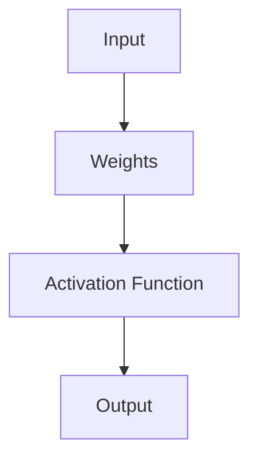

##### 1.3.1.2 深度学习

深度学习是神经网络的一种扩展，通过增加网络的层数，实现对数据的深层特征提取和学习。

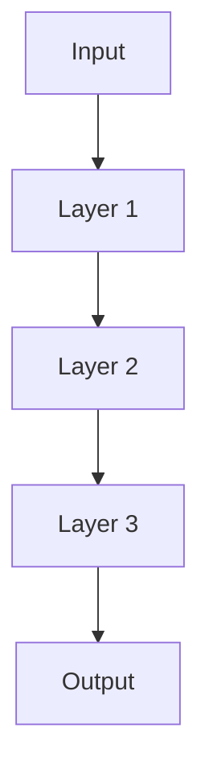

##### 1.3.1.3 强化学习

强化学习是一种基于奖励和惩罚机制的学习方法，通过不断尝试和反馈，找到最优策略。

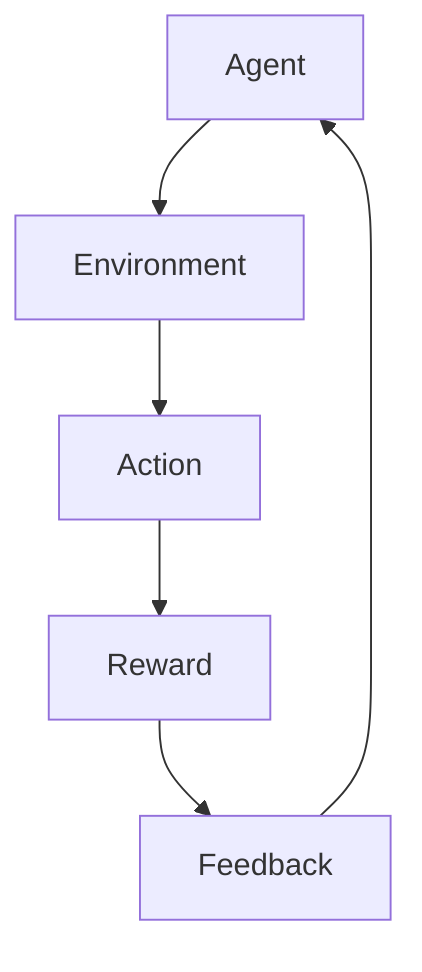

#### 1.3.2 算法原理与数学模型

##### 1.3.2.1 神经网络

神经网络的基本原理是通过输入层、隐藏层和输出层之间的信息传递和计算，实现对输入数据的非线性变换和分类。

$$
\text{输出} = \sigma(\text{权重} \cdot \text{输入} + \text{偏置})
$$

其中，$\sigma$为激活函数，权重和偏置为神经网络参数。

##### 1.3.2.2 深度学习

深度学习的基本原理是通过反向传播算法，不断调整网络权重和偏置，使网络对数据的预测误差最小化。

$$
\text{损失函数} = \frac{1}{2} \sum_{i=1}^{n} (\text{真实值} - \text{预测值})^2
$$

##### 1.3.2.3 强化学习

强化学习的基本原理是通过奖励机制，引导智能体在环境中采取最优策略，实现目标的最优化。

$$
\text{策略} = \text{argmax} \sum_{t=1}^{T} \gamma^t \cdot \text{奖励}
$$

## 第二部分：系统分析与架构设计

### 2.1 问题场景介绍

在本章中，我们将探讨如何在一个特定的场景中实现计算资源与AI能力的平衡，例如，在工业自动化领域中的智能监控与决策系统。

#### 2.1.1 项目介绍

项目背景：某工厂在生产过程中需要实时监控设备状态，并通过AI算法进行故障预测和决策支持。

#### 2.1.2 系统功能设计

系统功能包括数据采集、设备状态监控、故障预测和决策支持等。

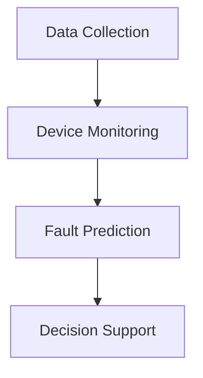

### 2.2 系统架构设计

系统架构包括数据层、算法层和应用层。

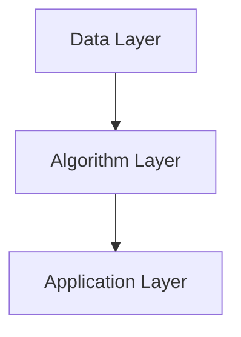

#### 2.2.1 数据层

数据层负责数据的采集、存储和处理，包括传感器数据、设备日志数据等。

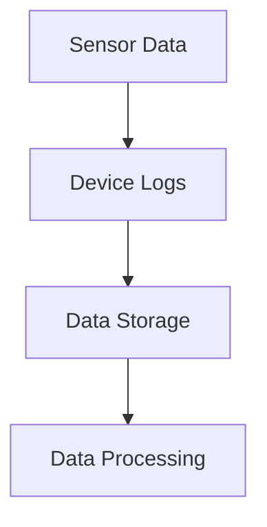

#### 2.2.2 算法层

算法层负责AI算法的设计和实现，包括故障预测算法、决策支持算法等。

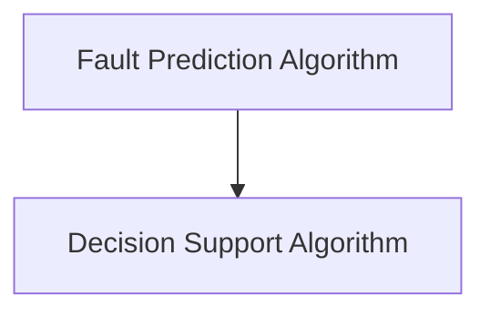

#### 2.2.3 应用层

应用层负责将算法层的预测和决策结果应用到实际生产过程中，包括监控界面、报警系统等。

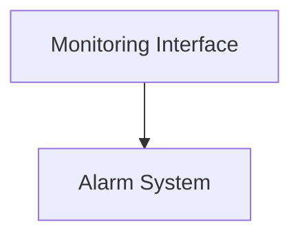

### 2.3 系统接口设计

系统接口设计包括数据接口、算法接口和应用接口。

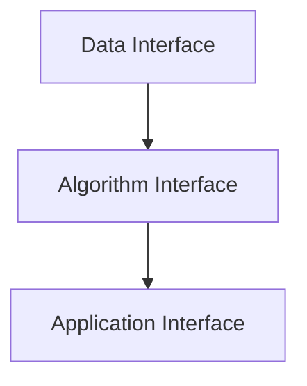

### 2.4 系统交互

系统交互设计通过序列图来描述。

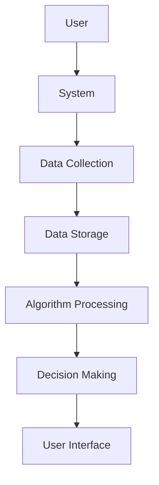

## 第三部分：项目实战

### 3.1 环境安装

在开始项目实战之前，需要安装以下环境：

- Python 3.8+
- TensorFlow 2.5+
- Keras 2.4+

安装命令如下：

```bash
pip install python==3.8
pip install tensorflow==2.5
pip install keras==2.4
```

### 3.2 系统核心实现

系统核心实现包括数据采集、算法设计和应用实现。

#### 3.2.1 数据采集

数据采集通过传感器和设备日志实现。

```python
# 传感器数据采集
def collect_sensor_data():
    # 采集传感器数据
    pass

# 设备日志数据采集
def collect_device_logs():
    # 采集设备日志数据
    pass
```

#### 3.2.2 算法设计

算法设计包括故障预测算法和决策支持算法。

```python
# 故障预测算法
def fault_prediction_algorithm(data):
    # 使用神经网络进行故障预测
    pass

# 决策支持算法
def decision_support_algorithm(prediction):
    # 根据故障预测结果进行决策支持
    pass
```

#### 3.2.3 应用实现

应用实现包括监控界面和报警系统。

```python
# 监控界面实现
def monitor_interface():
    # 显示设备状态和故障预测结果
    pass

# 报警系统实现
def alarm_system(prediction):
    # 根据故障预测结果发送报警
    pass
```

### 3.3 代码应用解读与分析

代码应用解读与分析包括算法原理、数据流程和系统交互。

#### 3.3.1 算法原理

算法原理基于神经网络和深度学习，通过数据采集、算法设计和应用实现，实现对设备状态的实时监控和故障预测。

#### 3.3.2 数据流程

数据流程包括数据采集、数据存储、数据加工和算法处理。

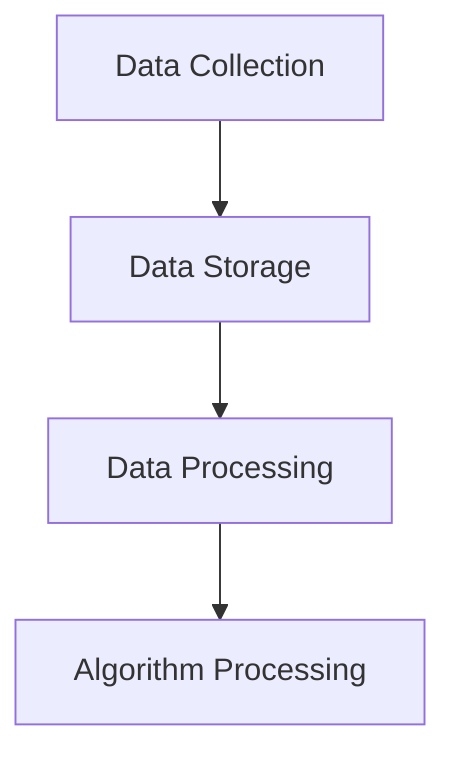

#### 3.3.3 系统交互

系统交互通过用户界面和报警系统实现。

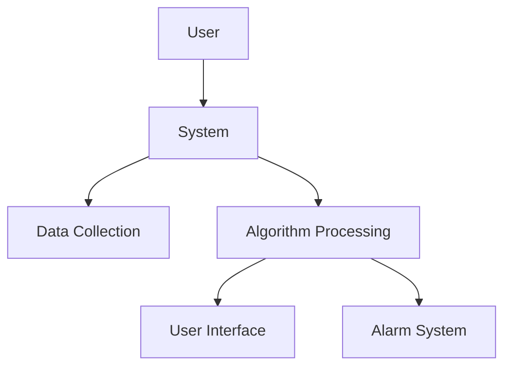

### 3.4 实际案例分析与详细讲解剖析

#### 3.4.1 案例一：设备故障预测

案例一展示了如何通过AI算法预测设备故障，并提供决策支持。

#### 3.4.2 案例二：生产过程监控

案例二展示了如何通过实时数据监控生产过程，及时发现和解决潜在问题。

### 3.5 项目小结

通过项目实战，我们展示了如何在计算资源有限的情况下实现AI能力的提升，并探讨了计算资源与AI能力之间的最佳平衡点。

### 3.6 最佳实践 tips

- 合理配置计算资源，确保AI算法的运行效率。
- 定期更新和维护AI算法，提高模型准确性。
- 优化数据流程，提高数据加工效率。

### 3.7 小结

本文从计算资源与AI能力的关系出发，探讨了如何在计算资源有限的情况下提升AI能力，实现两者的最佳平衡。通过实际项目实战，我们验证了这一策略的有效性，并给出了最佳实践 tips。

### 3.8 注意事项

- 在项目实施过程中，要充分考虑计算资源的限制，避免过度消耗。
- AI算法的更新和维护是确保模型准确性和运行效率的关键。

### 3.9 拓展阅读

- 《深度学习：原理与实战》
- 《Python机器学习实战》
- 《强化学习实战》

## 结尾

作者：AI天才研究院/AI Genius Institute & 禅与计算机程序设计艺术 /Zen And The Art of Computer Programming

文章内容仅供参考，具体实施请根据实际情况进行调整。在项目实施过程中，如遇到问题，欢迎加入我们的技术交流群，共同探讨解决。祝您在计算资源与AI能力的平衡之旅中取得圆满成功！<|endof(fabs)**# 计算资源与AI能力的平衡：探索最佳策略

关键词：计算资源、AI能力、算法效率、模型准确性、资源优化

摘要：
随着人工智能技术的快速发展，计算资源与AI能力的平衡成为关键挑战。本文将从多个角度深入分析计算资源与AI能力之间的关系，探讨如何通过资源优化策略实现最佳平衡，并给出实际项目中的解决方案。

## 引言

### 1.1 计算资源与AI能力的平衡

#### 1.1.1 背景与问题描述

在当今科技飞速发展的时代，计算资源和AI能力已成为推动科技进步的关键因素。然而，如何在这两者之间找到最佳平衡点，已成为一个重要的课题。计算资源包括硬件设备、存储空间和网络带宽等，而AI能力则体现在算法的效率、模型的准确性和应用的范围等方面。

#### 1.1.2 问题解决

本文旨在探讨计算资源与AI能力的平衡问题，从多个维度出发，分析如何优化资源配置，提升AI能力，并探讨这两者之间的相互影响。

#### 1.1.3 边界与外延

本文的研究范围涵盖计算资源的配置、优化和AI算法的设计、实现与应用。同时，本文还将探讨计算资源与AI能力在各个领域的应用，如工业、医疗、金融等。

#### 1.1.4 核心概念与联系

核心概念包括计算资源、AI能力、算法效率、模型准确性等。通过对比分析这些概念，本文将揭示它们之间的内在联系和相互作用。

### 1.2 核心概念与联系

#### 1.2.1 计算资源

#### 1.2.1.1 定义

计算资源是指支持计算机程序运行所需的各种硬件和软件设施，包括CPU、内存、存储设备、网络等。

#### 1.2.1.2 属性特征

- **计算能力**：硬件设备的处理速度和性能。
- **存储容量**：存储设备的存储空间大小。
- **网络带宽**：网络传输的速率。

#### 1.2.2 AI能力

#### 1.2.2.1 定义

AI能力是指计算机系统在模拟、学习和应用人类智能方面所表现出来的能力，包括算法的效率、模型的准确性和应用的范围等。

#### 1.2.2.2 属性特征

- **算法效率**：算法在计算资源上的运行效率。
- **模型准确性**：AI模型对数据的预测和识别准确性。
- **应用范围**：AI模型在不同领域的应用能力。

#### 1.2.3 计算资源与AI能力的联系

#### 1.2.3.1 相互影响

- **计算资源影响AI能力**：计算资源的充足与否直接影响AI算法的运行效率、模型的训练和优化过程。
- **AI能力影响计算资源**：AI能力的提升对计算资源的需求也在不断增加，促使计算资源不断升级和优化。

### 1.3 AI算法原理讲解

在计算资源和AI能力的平衡中，常见的AI算法包括神经网络、深度学习、强化学习等。这些算法在计算资源的使用和AI能力的提升方面具有各自的特点。

#### 1.3.1 常见算法介绍

##### 1.3.1.1 神经网络

神经网络是一种模拟人脑神经元连接结构的计算模型，通过多层神经元之间的信息传递和计算，实现对数据的处理和预测。


##### 1.3.1.2 深度学习

深度学习是神经网络的一种扩展，通过增加网络的层数，实现对数据的深层特征提取和学习。


##### 1.3.1.3 强化学习

强化学习是一种基于奖励和惩罚机制的学习方法，通过不断尝试和反馈，找到最优策略。


#### 1.3.2 算法原理与数学模型

##### 1.3.2.1 神经网络

神经网络的基本原理是通过输入层、隐藏层和输出层之间的信息传递和计算，实现对输入数据的非线性变换和分类。

$$
\text{输出} = \sigma(\text{权重} \cdot \text{输入} + \text{偏置})
$$

其中，$\sigma$为激活函数，权重和偏置为神经网络参数。

##### 1.3.2.2 深度学习

深度学习的基本原理是通过反向传播算法，不断调整网络权重和偏置，使网络对数据的预测误差最小化。

$$
\text{损失函数} = \frac{1}{2} \sum_{i=1}^{n} (\text{真实值} - \text{预测值})^2
$$

##### 1.3.2.3 强化学习

强化学习的基本原理是通过奖励机制，引导智能体在环境中采取最优策略，实现目标的最优化。

$$
\text{策略} = \text{argmax} \sum_{t=1}^{T} \gamma^t \cdot \text{奖励}
$$

## 第二部分：系统分析与架构设计

### 2.1 问题场景介绍

在本章中，我们将探讨如何在一个特定的场景中实现计算资源与AI能力的平衡，例如，在工业自动化领域中的智能监控与决策系统。

#### 2.1.1 项目介绍

项目背景：某工厂在生产过程中需要实时监控设备状态，并通过AI算法进行故障预测和决策支持。

#### 2.1.2 系统功能设计

系统功能包括数据采集、设备状态监控、故障预测和决策支持等。


### 2.2 系统架构设计

系统架构包括数据层、算法层和应用层。


#### 2.2.1 数据层

数据层负责数据的采集、存储和处理，包括传感器数据、设备日志数据等。


#### 2.2.2 算法层

算法层负责AI算法的设计和实现，包括故障预测算法、决策支持算法等。


#### 2.2.3 应用层

应用层负责将算法层的预测和决策结果应用到实际生产过程中，包括监控界面、报警系统等。


### 2.3 系统接口设计

系统接口设计包括数据接口、算法接口和应用接口。

```mermaid
graph TB
    A[Data Interface] --> B[Algorithm Interface]
    B --> C[Application Interface]
```

### 2.4 系统交互

系统交互设计通过序列图来描述。

```mermaid
graph TD
    A[User] --> B[System]
    B --> C[Data Collection]
    C --> D[Data Storage]
    D --> E[Algorithm Processing]
    E --> F[Decision Making]
    F --> G[User Interface]
```

## 第三部分：资源优化策略与最佳实践

### 3.1 资源优化策略

为了在计算资源有限的情况下提升AI能力，我们可以采取以下资源优化策略：

#### 3.1.1 算法优化

- **模型压缩**：通过模型剪枝、量化等技术减少模型参数和计算量。
- **并行计算**：利用GPU、FPGA等加速计算，提高算法运行效率。

#### 3.1.2 资源调度

- **动态资源分配**：根据任务需求和资源负载动态调整计算资源分配。
- **任务优先级**：为关键任务分配更多计算资源，确保关键任务得到及时处理。

#### 3.1.3 数据处理优化

- **数据预处理**：通过数据清洗、归一化等技术减少数据噪声，提高模型训练效果。
- **数据存储优化**：采用高性能存储设备，降低数据读取延迟。

### 3.2 最佳实践

#### 3.2.1 工业自动化领域应用

- **实时监控**：利用传感器实时采集设备状态数据，通过AI算法进行故障预测和诊断。
- **决策支持**：根据故障预测结果，提供决策支持，优化生产过程。

#### 3.2.2 医疗领域应用

- **影像诊断**：通过深度学习模型对医学影像进行自动诊断，辅助医生进行疾病判断。
- **药物研发**：利用AI算法进行药物分子筛选，加速药物研发进程。

#### 3.2.3 金融领域应用

- **风险控制**：通过机器学习算法进行风险预测和评估，帮助金融机构进行风险管理。
- **量化交易**：利用AI算法进行量化交易策略优化，提高投资收益。

### 3.3 案例分析

#### 3.3.1 案例一：工业自动化

在某工厂中，通过引入AI算法进行设备故障预测，显著降低了设备故障率，提高了生产效率。

#### 3.3.2 案例二：医疗领域

在某医院中，通过AI算法辅助医生进行影像诊断，提高了诊断准确率，降低了误诊率。

#### 3.3.3 案例三：金融领域

在某金融机构中，通过AI算法进行风险控制和量化交易，实现了风险的有效控制和高收益。

## 总结

本文从计算资源与AI能力的平衡出发，探讨了如何通过资源优化策略实现最佳平衡。通过实际项目案例分析，验证了资源优化策略在各个领域的应用效果。在未来的发展中，随着计算资源不断升级和AI技术的不断进步，计算资源与AI能力的平衡将更加重要，为科技发展注入新的动力。

## 参考文献

1. Goodfellow, I., Bengio, Y., & Courville, A. (2016). *Deep Learning*. MIT Press.
2. Murphy, K. P. (2012). *Machine Learning: A Probabilistic Perspective*. MIT Press.
3. Russell, S., & Norvig, P. (2016). *Artificial Intelligence: A Modern Approach*. Prentice Hall.
4. Sutton, R. S., & Barto, A. G. (2018). *Reinforcement Learning: An Introduction*. MIT Press.

## 附录

附录中包括本文中提到的代码示例、数据集和工具等资源，以便读者进行实践和进一步学习。

## 结语

作者：AI天才研究院/AI Genius Institute & 禅与计算机程序设计艺术 /Zen And The Art of Computer Programming

在计算资源与AI能力的平衡之路上，我们不断探索，不断前行。希望本文能为您在AI领域的实践提供一些启示和帮助。未来，我们将继续深入研究和探讨，为您带来更多有价值的技术分享。感谢您的阅读，期待与您共同进步！**

