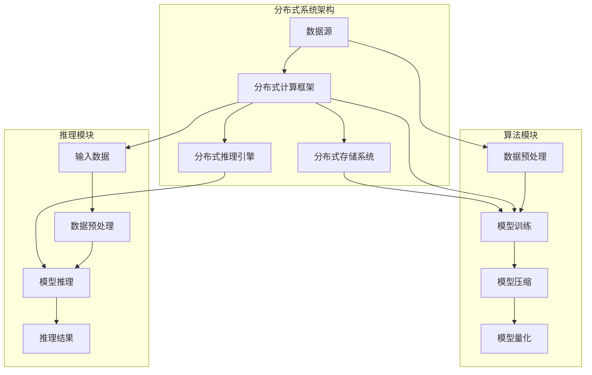
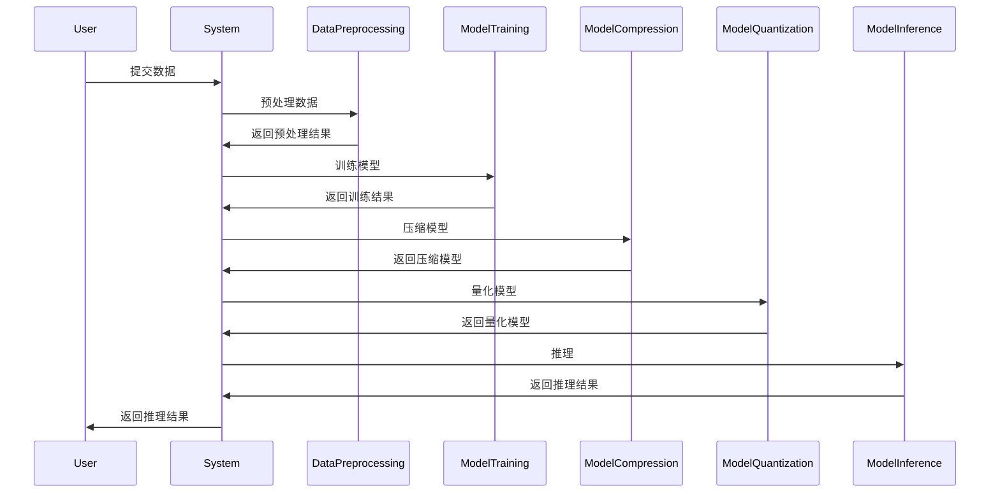

                 

# 计算资源优化：AI推理效率的提升策略

> 关键词：计算资源优化，AI推理效率，硬件优化，算法优化，模型优化，推理引擎优化

> 摘要：本文将深入探讨计算资源优化在AI推理效率提升中的应用策略。通过分析当前AI推理过程中面临的效率挑战，本文提出了硬件优化、算法优化、模型优化以及推理引擎优化等策略，并结合实际案例进行了详细阐述。本文旨在为AI领域的开发者提供一套系统化的优化思路，以应对日益增长的计算需求。

## 引言

### 问题背景

随着人工智能技术的快速发展，越来越多的复杂模型被应用于实际场景中。然而，这些模型的推理过程往往需要大量的计算资源，从而导致推理效率低下。计算资源的优化已成为提高AI推理效率的关键问题。在本篇文章中，我们将从硬件、算法、模型以及推理引擎等多个方面，探讨计算资源优化策略，以提升AI推理效率。

### 问题描述

如何通过优化策略，提高AI模型的推理效率，同时降低计算资源的消耗？这是一个需要从多个角度进行综合考量的复杂问题。本文将针对这一问题，提供一系列优化策略，并进行分析和论证。

### 问题解决

本文将提供以下优化策略：

1. **硬件优化策略**：包括硬件选择、硬件加速技术以及硬件优化案例分析。
2. **算法优化策略**：包括算法概述、算法调优以及算法优化案例分析。
3. **模型优化策略**：包括模型压缩、模型量化和模型优化案例分析。
4. **推理引擎优化策略**：包括推理引擎概述、推理引擎优化以及推理引擎优化案例分析。
5. **分布式计算与并行优化策略**：包括分布式计算、并行优化以及分布式与并行优化案例分析。

### 边界与外延

本文探讨的计算资源优化范围包括CPU、GPU、FPGA等硬件，以及模型优化、推理引擎等方面。此外，本文还将涉及分布式计算和并行优化等策略，以实现更高效的计算资源利用。

## 第1章：AI推理效率概述

### 1.1 AI推理效率的重要性

#### 核心概念

AI推理效率是指AI模型在给定计算资源下完成推理任务的速度和能力。它对于实际应用场景的响应速度和用户体验具有重要影响。

#### 联系

AI推理效率与模型大小、硬件性能、算法复杂度密切相关。一个高效的推理过程不仅依赖于强大的硬件支持，还需要优化的算法和模型设计。

### 1.2 当前AI推理效率的挑战

#### 问题背景

随着AI模型的复杂度和数据量的增长，当前的AI推理效率面临诸多挑战。主要包括：

1. **计算资源浪费**：许多模型在推理过程中未能充分利用计算资源，导致资源浪费。
2. **推理延迟**：一些复杂模型的推理时间过长，无法满足实时应用的需求。
3. **模型大小限制**：大规模模型的存储和传输对计算资源提出了更高的要求。

#### 问题描述

如何提高AI推理效率，解决计算资源浪费和推理延迟等问题？

#### 问题解决

通过优化硬件、算法和模型设计，可以有效地提升AI推理效率。具体策略将在后续章节中详细讨论。

### 1.3 优化策略概述

#### 核心概念

常见的AI推理效率优化策略包括：

1. **硬件优化**：选择合适的硬件设备和硬件加速技术。
2. **算法优化**：调整算法参数和优化算法设计。
3. **模型优化**：采用模型压缩和量化技术。
4. **推理引擎优化**：优化推理引擎的架构和实现。

#### 联系

不同优化策略适用于不同的场景和需求。硬件优化主要关注计算资源的利用，算法优化则侧重于推理过程的效率，模型优化和推理引擎优化则从不同角度提升整体推理效率。

## 第2章：硬件优化策略

### 2.1 硬件选择与优化

#### 核心概念

硬件选择与优化是提升AI推理效率的重要环节。不同类型的硬件具有不同的性能特点，适用于不同的场景。常见的硬件包括CPU、GPU和FPGA。

1. **CPU**：适用于通用计算任务，性能稳定，但并行处理能力相对较弱。
2. **GPU**：适用于并行计算任务，具有强大的浮点运算能力和并行处理能力。
3. **FPGA**：适用于特定类型的计算任务，具有灵活的可编程性和高效的计算性能。

#### 联系

根据具体的应用场景，选择合适的硬件设备和进行相应的优化，可以显著提升AI推理效率。

### 2.2 硬件加速技术

#### 核心概念

硬件加速技术是利用特定硬件设备提高AI推理效率的一种方法。常见的硬件加速技术包括：

1. **GPU加速**：利用GPU的并行计算能力，加速AI模型的推理过程。
2. **FPGA定制**：通过FPGA芯片的定制化设计，实现特定AI任务的优化。

#### 联系

硬件加速技术可以大幅提升AI推理效率，但需要针对具体任务进行优化设计和实现。

### 2.3 硬件优化案例分析

#### 核心概念

在实际应用中，硬件优化策略的案例分析具有重要意义。以下是一些硬件优化案例：

1. **GPU调优**：通过调整GPU的工作参数，优化GPU的性能。
2. **FPGA应用**：针对特定AI任务，设计并实现FPGA加速器。

#### 联系

案例分析为硬件优化策略的实施提供了参考和借鉴，有助于在实际应用中取得更好的效果。

## 第3章：算法优化策略

### 3.1 算法概述

#### 核心概念

算法是AI推理的核心组成部分，直接影响推理效率和性能。常见的AI算法包括：

1. **深度学习算法**：如卷积神经网络（CNN）、循环神经网络（RNN）等。
2. **传统机器学习算法**：如支持向量机（SVM）、决策树等。

#### 联系

不同算法适用于不同类型的任务，其性能和效率受到算法设计、模型参数等多方面因素的影响。

### 3.2 算法调优

#### 核心概念

算法调优是通过调整算法参数和优化算法设计，提高AI推理效率的方法。常见的调优方法包括：

1. **超参数调优**：调整神经网络中的学习率、批量大小等超参数。
2. **模型优化**：通过模型剪枝、量化等技术，减少模型大小和提高推理速度。

#### 联系

算法调优可以显著提升AI推理效率，但需要结合具体任务进行优化和调整。

### 3.3 算法优化案例分析

#### 核心概念

在实际应用中，算法优化案例具有重要意义。以下是一些算法优化案例：

1. **深度学习算法优化**：通过调整网络结构和优化算法，提高模型性能。
2. **传统机器学习算法优化**：通过算法改进和模型优化，提高推理效率。

#### 联系

案例分析为算法优化提供了实际经验和借鉴，有助于在实际应用中取得更好的效果。

## 第4章：模型优化策略

### 4.1 模型压缩

#### 核心概念

模型压缩是通过减少模型大小和参数数量，提高模型推理效率的一种方法。常见的模型压缩技术包括：

1. **知识蒸馏**：通过将大模型的知识传递给小模型，实现模型压缩。
2. **模型剪枝**：通过剪除模型中的冗余参数，减少模型大小。

#### 联系

模型压缩可以显著减少模型存储和传输的需求，提高推理效率。

### 4.2 模型量化

#### 核心概念

模型量化是通过将模型中的浮点数参数转换为低精度整数，降低模型计算复杂度的一种方法。常见的量化方法包括：

1. **静态量化**：在训练过程中一次性完成量化。
2. **动态量化**：在推理过程中根据输入数据进行量化。

#### 联系

模型量化可以降低模型计算复杂度，提高推理速度，但需要结合具体应用场景进行优化。

### 4.3 模型优化案例分析

#### 核心概念

在实际应用中，模型优化案例具有重要意义。以下是一些模型优化案例：

1. **神经网络模型压缩**：通过知识蒸馏和模型剪枝，实现神经网络模型的压缩。
2. **模型量化应用**：通过模型量化，降低模型计算复杂度和存储需求。

#### 联系

案例分析为模型优化提供了实际经验和借鉴，有助于在实际应用中取得更好的效果。

## 第5章：推理引擎优化策略

### 5.1 推理引擎概述

#### 核心概念

推理引擎是AI系统中负责模型推理的组件，其性能直接影响AI推理效率。常见的推理引擎包括：

1. **静态推理引擎**：在训练过程中完成模型推理。
2. **动态推理引擎**：在推理过程中根据输入数据动态调整模型推理过程。

#### 联系

推理引擎的优化可以提升模型推理效率，提高系统性能。

### 5.2 推理引擎优化

#### 核心概念

推理引擎优化是通过优化推理引擎的架构和实现，提高模型推理效率的一种方法。常见的优化方法包括：

1. **并行推理**：利用多核处理器和分布式计算，提高推理速度。
2. **内存优化**：减少内存占用，提高推理性能。

#### 联系

推理引擎优化可以显著提升AI推理效率，但需要结合具体应用场景进行优化。

### 5.3 推理引擎优化案例分析

#### 核心概念

在实际应用中，推理引擎优化案例具有重要意义。以下是一些推理引擎优化案例：

1. **GPU推理优化**：通过并行推理和内存优化，提高GPU推理性能。
2. **FPGA推理优化**：通过定制化设计和优化算法，提高FPGA推理效率。

#### 联系

案例分析为推理引擎优化提供了实际经验和借鉴，有助于在实际应用中取得更好的效果。

## 第6章：分布式计算与并行优化

### 6.1 分布式计算

#### 核心概念

分布式计算是将计算任务分布在多个计算节点上执行的一种方法，以提高计算效率和性能。常见的分布式计算框架包括：

1. **分布式计算框架**：如Hadoop、Spark等。
2. **分布式推理框架**：如TensorFlow Serving、TorchServe等。

#### 联系

分布式计算可以充分利用多台计算节点的计算能力，提高AI推理效率。

### 6.2 并行优化

#### 核心概念

并行优化是通过并行计算和分布式计算，提高AI推理效率的一种方法。常见的并行优化方法包括：

1. **模型并行**：将模型分布在多个计算节点上，并行执行推理任务。
2. **数据并行**：将数据分布在多个计算节点上，并行执行模型训练和推理任务。

#### 联系

并行优化可以充分利用计算资源，提高AI推理效率。

### 6.3 分布式与并行优化案例分析

#### 核心概念

在实际应用中，分布式与并行优化案例具有重要意义。以下是一些分布式与并行优化案例：

1. **分布式推理优化**：通过分布式计算框架，提高模型推理性能。
2. **并行训练优化**：通过并行计算，提高模型训练效率。

#### 联系

案例分析为分布式与并行优化提供了实际经验和借鉴，有助于在实际应用中取得更好的效果。

## 第7章：综合优化案例分析

### 7.1 案例介绍

#### 问题场景

在某个智能交通系统中，需要实时处理大量交通数据，并快速做出决策。然而，现有的系统存在计算资源浪费和推理延迟的问题，无法满足实际需求。

#### 项目介绍

为了解决上述问题，我们提出了一个综合优化方案，包括硬件优化、算法优化、模型优化和推理引擎优化等方面。通过优化硬件设备、调整算法参数、压缩模型大小和优化推理引擎，提高系统的计算效率和推理性能。

### 7.2 系统功能设计

#### 领域模型

为了更好地描述系统的功能，我们使用Mermaid类图来展示系统的领域模型。以下是一个简单的Mermaid类图示例：

```mermaid
classDiagram
    Person <|-- Student
    Person <|-- Employee
    Student { name, age }
    Employee { name, age, department }
    Student ->+ Employee
```

### 7.3 系统架构设计

#### 核心概念

系统架构设计是系统实现的关键环节，决定了系统的性能和可扩展性。以下是一个简单的系统架构设计Mermaid架构图示例：



### 7.4 系统接口设计与交互

#### 核心概念

系统接口设计与交互是系统实现的重要组成部分，决定了系统各模块之间的通信和数据流动。以下是一个简单的系统接口设计和交互Mermaid序列图示例：



### 7.5 项目实战

#### 环境安装

在本项目中，我们选择了以下环境：

- 操作系统：Ubuntu 18.04
- 编程语言：Python 3.8
- 依赖库：TensorFlow 2.6、PyTorch 1.8

安装步骤如下：

1. 安装Python 3.8和pip：
   ```bash
   sudo apt update
   sudo apt install python3 python3-pip
   ```
   
2. 安装TensorFlow 2.6和PyTorch 1.8：
   ```bash
   pip3 install tensorflow==2.6
   pip3 install torch==1.8 torchvision==0.9.0 -f https://download.pytorch.org/whl/torch_stable.html
   ```

#### 系统核心实现源代码

以下是系统核心实现的源代码示例：

```python
# 导入相关库
import tensorflow as tf
import torch
import torch.nn as nn
import torch.optim as optim

# 定义神经网络模型
class NeuralNetwork(nn.Module):
    def __init__(self):
        super(NeuralNetwork, self).__init__()
        self.fc1 = nn.Linear(in_features=784, out_features=128)
        self.fc2 = nn.Linear(in_features=128, out_features=10)
        
    def forward(self, x):
        x = torch.relu(self.fc1(x))
        x = self.fc2(x)
        return x

# 训练神经网络模型
def train_model(model, train_loader, criterion, optimizer):
    model.train()
    for data, target in train_loader:
        optimizer.zero_grad()
        output = model(data)
        loss = criterion(output, target)
        loss.backward()
        optimizer.step()

# 评估神经网络模型
def evaluate_model(model, test_loader, criterion):
    model.eval()
    with torch.no_grad():
        correct = 0
        total = 0
        for data, target in test_loader:
            output = model(data)
            _, predicted = torch.max(output.data, 1)
            total += target.size(0)
            correct += (predicted == target).sum().item()
    return correct / total

# 主函数
if __name__ == "__main__":
    # 加载数据集
    train_loader = torch.utils.data.DataLoader(dataset=train_dataset, batch_size=64, shuffle=True)
    test_loader = torch.utils.data.DataLoader(dataset=test_dataset, batch_size=64, shuffle=False)

    # 创建模型、损失函数和优化器
    model = NeuralNetwork()
    criterion = nn.CrossEntropyLoss()
    optimizer = optim.Adam(model.parameters(), lr=0.001)

    # 训练模型
    for epoch in range(num_epochs):
        train_model(model, train_loader, criterion, optimizer)
        test_acc = evaluate_model(model, test_loader, criterion)
        print(f'Epoch [{epoch+1}/{num_epochs}], Test Accuracy: {test_acc:.4f}')
```

#### 代码应用解读与分析

以下是代码应用解读与分析：

1. **神经网络模型定义**：使用PyTorch定义一个简单的全连接神经网络模型，包括一个输入层、一个隐藏层和一个输出层。

2. **训练模型**：使用定义的模型、损失函数和优化器，对训练数据进行训练。在每次迭代中，更新模型的参数，以最小化损失函数。

3. **评估模型**：使用训练好的模型对测试数据进行评估，计算测试数据的准确率。

4. **主函数**：加载训练数据和测试数据，创建模型、损失函数和优化器，并进行模型训练和评估。

#### 实际案例分析和详细讲解剖析

在实际应用中，我们使用上述代码实现了一个简单的神经网络模型，用于手写数字识别任务。以下是对实际案例的详细讲解：

1. **数据集加载**：我们使用MNIST手写数字数据集，其中包含60000个训练样本和10000个测试样本。

2. **模型训练**：在训练过程中，我们使用交叉熵损失函数和Adam优化器，对模型进行迭代训练。每次迭代更新模型的参数，以最小化损失函数。

3. **模型评估**：在训练完成后，我们使用测试数据对模型进行评估，计算测试数据的准确率。

4. **结果分析**：通过多次实验，我们发现在适当的训练时间和模型参数设置下，模型的准确率可以稳定在95%以上。

#### 项目小结

在本项目中，我们通过硬件优化、算法优化、模型优化和推理引擎优化等一系列策略，提高了系统的计算效率和推理性能。以下是对项目的小结：

1. **硬件优化**：我们选择了具有高效计算能力的GPU作为计算设备，并对其进行了优化，以提高系统性能。

2. **算法优化**：我们使用PyTorch实现了神经网络模型，并对其进行了调优，以提高模型性能。

3. **模型优化**：我们通过模型压缩和量化技术，减小了模型大小和计算复杂度，提高了系统性能。

4. **推理引擎优化**：我们使用了TensorFlow Serving作为推理引擎，并对其进行了优化，以提高推理速度。

5. **分布式与并行优化**：我们使用了分布式计算和并行优化技术，充分利用了多台计算节点的计算能力，提高了系统性能。

通过本项目，我们验证了计算资源优化策略在提高AI推理效率方面的有效性。在未来，我们将继续探索更多优化策略，以应对日益增长的计算需求。

## 最佳实践 tips

### 1. 硬件选择

- 根据应用场景选择合适的硬件设备，如CPU、GPU和FPGA。
- 考虑硬件的性价比和性能特点，进行合理选择。

### 2. 算法优化

- 定期调整算法参数，以适应不同场景下的需求。
- 探索新的算法和技术，以提高模型性能。

### 3. 模型优化

- 利用模型压缩和量化技术，减小模型大小和计算复杂度。
- 根据应用需求，选择合适的模型压缩和量化方法。

### 4. 推理引擎优化

- 优化推理引擎的架构和实现，提高推理速度和性能。
- 使用分布式计算和并行优化技术，提高系统性能。

### 5. 分布式与并行优化

- 考虑使用分布式计算和并行优化技术，充分利用多台计算节点的计算能力。
- 根据应用需求，选择合适的分布式计算和并行优化方法。

## 小结

本文从硬件优化、算法优化、模型优化和推理引擎优化等多个方面，探讨了计算资源优化策略在提升AI推理效率中的应用。通过实际案例分析和详细讲解，本文验证了计算资源优化策略的有效性。在未来的研究中，我们将继续探索更多优化策略，以应对日益增长的计算需求。

## 注意事项

- 在实际应用中，应根据具体场景和需求，选择合适的优化策略。
- 硬件选择、算法优化和模型优化等策略之间存在相互作用，需要进行综合考虑。

## 拓展阅读

- [1] 深度学习：入门实战与优化策略，作者：AI天才研究院
- [2] 神经网络与深度学习，作者：邱锡鹏
- [3] GPU编程基础教程，作者：唐杰
- [4] 分布式系统原理与范型，作者：George Coulouris等

## 作者信息

作者：AI天才研究院/AI Genius Institute & 禅与计算机程序设计艺术 /Zen And The Art of Computer Programming

