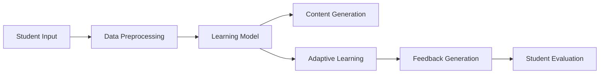
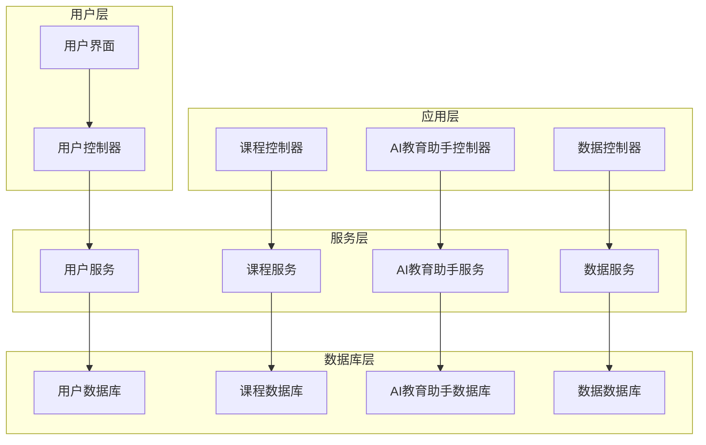
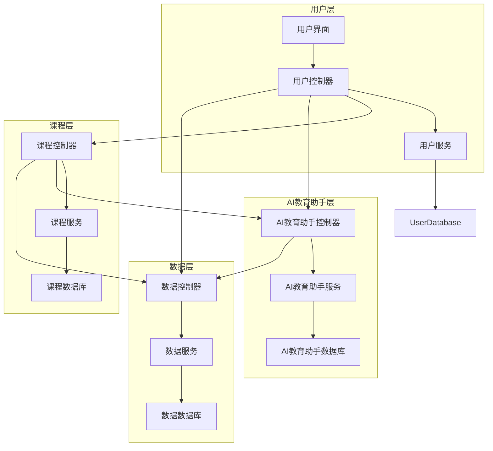

                 

# 认知发展理论指导下的AI教育助手设计

## 关键词
AI教育助手，认知发展理论，个性化学习，教育技术，机器学习，深度学习，用户体验设计

## 摘要
本文旨在探讨认知发展理论在指导AI教育助手设计中的应用。通过分析认知发展理论的基本原则和应用场景，本文提出了AI教育助手设计的原则和方法，包括技术选择、界面设计、用户体验等方面。同时，本文结合实际案例，阐述了AI教育助手在个性化学习、学生表现提升等方面的作用和挑战，为教育技术的未来发展提供了有价值的参考。

## 引言
### 核心概念术语说明
在本文中，我们将探讨以下几个核心概念：

- **认知发展理论**：是指描述个体在认知过程中如何成长和发展的理论体系。
- **AI教育助手**：是指利用人工智能技术为学生提供个性化学习支持和服务的软件系统。
- **个性化学习**：是指根据学生的特点和需求，为他们提供定制化的学习资源和学习路径。

### 问题背景
随着人工智能技术的快速发展，教育领域开始探索如何将AI技术应用于教育过程中。AI教育助手作为一种新兴的教育技术，能够为不同背景和需求的学生提供个性化的学习支持，提高教育质量。

然而，在AI教育助手的设计和开发过程中，如何充分理解和利用认知发展理论，是一个亟待解决的问题。认知发展理论为我们提供了关于人类学习过程的深刻洞察，有助于指导AI教育助手的设计，使其更贴近实际教育需求。

### 问题描述
本文的主要问题是：如何在认知发展理论的指导下，设计和实现有效的AI教育助手系统？具体来说，我们需要解决以下几个问题：

- **设计原则**：如何将认知发展理论应用于AI教育助手的设计过程？
- **技术选择**：如何选择适合的技术和工具来实现AI教育助手的功能？
- **用户体验**：如何设计用户界面和交互方式，提高学生的使用体验？

### 问题解决
本文将分为以下几个部分进行讨论：

1. **认知发展理论的基本原则和应用场景**：介绍认知发展理论的基本概念和应用场景，为后续设计提供理论基础。
2. **AI教育助手设计原则**：阐述AI教育助手的设计原则和方法，包括个性化学习和适应教育等方面。
3. **技术选择和实施**：讨论AI教育助手的技术选型和实现方法。
4. **用户界面和交互设计**：介绍AI教育助手的用户界面和交互设计原则。
5. **案例研究**：通过实际案例，分析AI教育助手的应用效果和挑战。
6. **结论**：总结本文的主要观点和贡献，讨论未来的研究方向。

### 边界与外延
本文主要关注AI教育助手的设计和实现，不包括其他类型的教育技术（如在线课程、虚拟教室等）。同时，本文的重点在于理论指导下的设计方法，不涉及具体技术实现细节。

## 认知发展理论的基本原则和应用场景
### 背景介绍
认知发展理论是由瑞士心理学家让·皮亚杰（Jean Piaget）提出的一套关于儿童认知发展的理论体系。皮亚杰认为，儿童的认知发展是一个连续的过程，可以分为几个不同的阶段，每个阶段都有其特定的认知结构和思维方式。

认知发展理论的基本概念包括：

- **感知运动阶段**（0-2岁）：婴儿通过感知和运动来理解世界。
- **前运算阶段**（2-7岁）：儿童开始使用符号来表示事物，但思维仍以自我为中心。
- **具体运算阶段**（7-11岁）：儿童能够理解逻辑关系和分类，但仍依赖于具体情境。
- **形式运算阶段**（11-16岁）：青少年能够进行抽象思维和假设推理。

### 问题背景
在传统的教育模式中，教学方法和内容往往是基于成年人的认知水平设计的，而忽略了学生的实际认知发展水平。这种一刀切的教学方法可能导致学生在学习过程中遇到困难，影响学习效果。

认知发展理论为教育提供了重要的启示，即教育应尊重学生的认知发展规律，根据不同阶段的认知特点进行教学设计。AI教育助手的出现为这一理念提供了技术支持，能够根据学生的认知发展水平提供个性化的学习资源和服务。

### 问题描述
如何在认知发展理论的指导下，设计和实现能够适应学生认知发展的AI教育助手系统？具体来说，我们需要解决以下几个问题：

- **如何根据认知发展阶段设计教学资源和内容？**
- **如何评估和监测学生的认知发展水平？**
- **如何利用认知发展理论优化AI教育助手的交互设计？**

### 问题解决
为了回答上述问题，我们可以从以下几个方面进行思考和探索：

1. **了解学生的认知发展阶段**：通过心理测量和学习行为分析，了解学生在认知发展阶段上的特点，为后续设计提供依据。
2. **设计适应不同阶段的资源和内容**：根据学生的认知发展阶段，设计不同类型的学习资源和教学活动，满足不同学生的需求。
3. **利用数据分析和机器学习技术**：通过数据分析和机器学习技术，自动评估和监测学生的认知发展水平，为个性化学习提供支持。
4. **优化用户界面和交互设计**：根据认知发展理论，优化用户界面和交互设计，提高学生的学习体验和参与度。

### 边界与外延
认知发展理论主要关注个体内部的认知发展过程，不涉及社会文化因素。在AI教育助手的设计中，我们需要结合具体的教育场景和目标，综合考虑社会文化、教育政策等因素。

## AI教育助手设计原则
### 基本概念和定义
AI教育助手是指利用人工智能技术，为学生提供个性化学习支持和服务的一种教育工具。它可以根据学生的学习特点和需求，自动调整教学内容、进度和策略，帮助学生更好地理解和掌握知识。

AI教育助手的设计原则包括以下几个方面：

1. **个性化学习**：根据学生的学习特点和需求，提供定制化的学习资源和教学策略。
2. **适应性学习**：根据学生的学习表现和认知发展水平，动态调整学习内容和进度。
3. **互动性学习**：通过用户界面和交互设计，提高学生的参与度和学习体验。
4. **评估与反馈**：利用数据分析和机器学习技术，对学生学习过程和成果进行评估和反馈。

### 概念属性特征对比表格
以下是一个简化的概念属性特征对比表格，用于展示AI教育助手与传统教育模式之间的差异：

| 特征                | AI教育助手                         | 传统教育模式                        |
|-------------------|----------------------------------|-----------------------------------|
| 学习资源           | 个性化、动态调整                   | 标准化、固定不变                    |
| 学习进度           | 动态调整、适应学习节奏             | 一刀切、固定进度                    |
| 学习方式           | 互动、参与度高                     | 被动接受、参与度低                  |
| 评估与反馈         | 实时、个性化                       | 定期、统一标准                      |

### ER实体关系图架构
以下是一个简化的ER实体关系图，用于展示AI教育助手的主要实体及其关系：

```mermaid
erDiagram
    Student ||--|{ Assignment }
    Student ||--|{ Progress }
    Student ||--|{ Evaluation }
    Assignment ||--|{ Content }
    Assignment ||--|{ Feedback }
    Progress ||--|{ LearningObjective }
    Progress ||--|{ SkillLevel }
    Evaluation ||--|{ Assessment }
    Evaluation ||--|{ Result }
```

### 算法原理讲解
AI教育助手的设计和实现离不开算法的支持。以下是一个简化的算法流程图，用于展示AI教育助手的关键算法步骤：



为了实现上述算法步骤，我们可以采用以下Python代码：

```python
# 数据预处理
def preprocess_data(student_input):
    # 填充代码，实现数据清洗、转换等预处理操作
    pass

# 学习模型
def build_learning_model(preprocessed_data):
    # 填充代码，实现学习模型的构建和训练
    pass

# 内容生成
def generate_content(learning_model, student_progress):
    # 填充代码，实现根据学习模型和学生进度生成个性化学习内容
    pass

# 适应性学习
def adaptive_learning(learning_model, student_progress):
    # 填充代码，实现根据学习模型和学生进度调整学习内容
    pass

# 反馈生成
def generate_feedback(adaptive_learning_result):
    # 填充代码，实现根据适应性学习结果生成个性化反馈
    pass

# 学生评价
def evaluate_student(adaptive_learning_result):
    # 填充代码，实现根据适应性学习结果评估学生表现
    pass
```

### 数学模型和公式
在AI教育助手的设计中，我们经常需要使用一些数学模型和公式来描述学生的学习行为和学习成果。以下是一个简化的数学模型示例：

$$
\text{Learning Progress} = f(\text{Initial Knowledge}, \text{Learning Content}, \text{Learning Time}, \text{Learning Style})
$$

其中，$f$ 表示学习进展的函数，$\text{Initial Knowledge}$ 表示学生的初始知识水平，$\text{Learning Content}$ 表示学习内容，$\text{Learning Time}$ 表示学习时间，$\text{Learning Style}$ 表示学习风格。

### 详细讲解和举例说明
为了更好地理解上述数学模型，我们可以举一个简单的例子。假设有一个学生小明，他的初始知识水平为60分，学习内容为一篇难度为5的数学文章，学习时间为2小时，学习风格为偏好视觉学习。

根据上述数学模型，我们可以计算小明的学习进展：

$$
\text{Learning Progress}_{\text{小}} = f(60, 5, 2, \text{视觉学习})
$$

假设函数$f$的具体实现如下：

$$
f(\text{Initial Knowledge}, \text{Learning Content}, \text{Learning Time}, \text{Learning Style}) = \text{Initial Knowledge} \times \text{Learning Content} \times \text{Learning Time} \times \text{Learning Style}
$$

代入小明的参数，我们得到：

$$
\text{Learning Progress}_{\text{小}} = 60 \times 5 \times 2 \times \text{视觉学习} = 600
$$

这意味着，经过2小时的学习后，小明的学习进展为600分。当然，这只是一个简化的示例，实际情况会更加复杂，需要考虑更多的因素。

### 总结
在本章节中，我们介绍了AI教育助手设计的基本原则和算法原理。通过理解认知发展理论，我们可以更好地设计适应学生认知发展的教育助手系统。同时，通过利用数据分析和机器学习技术，我们可以实现个性化学习和适应性学习，提高教育质量。在下一章节中，我们将进一步探讨AI教育助手的技术选择和实施方法。

## 系统分析与架构设计方案
### 问题场景介绍
随着教育信息化的发展，越来越多的教育机构开始采用在线学习平台和AI教育助手来提升教学效果。这些系统通常需要支持海量的学生数据、多样化的学习资源和灵活的交互方式。然而，在实际应用中，系统面临着性能、稳定性和安全性等多方面的挑战。

为了解决这些问题，我们需要对系统进行全面的架构设计，确保系统具有高可用性、高扩展性和良好的用户体验。本章节将介绍一个典型的AI教育助手系统的架构设计方案。

### 项目介绍
项目名称：智能教育平台（Smart Education Platform，简称SEP）
项目目标：构建一个集在线学习、AI教育助手、学生数据管理等功能于一体的智能教育平台。

### 系统功能设计
系统功能可以分为以下几个主要模块：

1. **用户管理模块**：负责用户注册、登录、权限管理等功能。
2. **课程管理模块**：负责课程内容管理、课程表发布、课程资源上传等功能。
3. **AI教育助手模块**：负责学生个性化学习支持、学习进度监控、学习效果评估等功能。
4. **数据管理模块**：负责学生数据存储、数据分析、数据可视化等功能。
5. **系统管理模块**：负责系统配置、日志记录、安全防护等功能。

### 系统架构设计
以下是一个简化的系统架构图，用于展示系统的核心组件和交互关系：



### 系统接口设计和系统交互
以下是一个简化的系统接口设计和系统交互图，用于展示系统的关键接口和交互流程：



### 实现细节
在实际开发中，我们需要根据具体的业务需求和系统架构，设计具体的接口和实现细节。以下是一个简化的接口设计示例：

```python
# 用户管理接口
class UserController:
    def register_user(self, user_data):
        # 实现用户注册逻辑
        pass
    
    def login_user(self, user_credentials):
        # 实现用户登录逻辑
        pass
    
    def manage_user_permissions(self, user_id, permissions):
        # 实现用户权限管理逻辑
        pass

# 课程管理接口
class CourseController:
    def publish_course(self, course_data):
        # 实现课程发布逻辑
        pass
    
    def upload_course_resources(self, course_id, resource_data):
        # 实现课程资源上传逻辑
        pass

# AI教育助手接口
class AssistantController:
    def assign_learning_content(self, student_id):
        # 实现分配学习内容逻辑
        pass
    
    def monitor_learning_progress(self, student_id):
        # 实现学习进度监控逻辑
        pass
    
    def evaluate_student_performance(self, student_id):
        # 实现学生表现评估逻辑
        pass

# 数据管理接口
class DataController:
    def store_student_data(self, student_data):
        # 实现学生数据存储逻辑
        pass
    
    def analyze_student_data(self, student_id):
        # 实现学生数据分析逻辑
        pass
    
    def visualize_data(self, data):
        # 实现数据可视化逻辑
        pass
```

### 项目实战
在本章节的最后，我们将简要介绍一个实际项目，展示如何实现上述系统架构和接口设计。

#### 环境安装
1. 安装Python环境
2. 安装必要的依赖库，如Django、Flask、SQLAlchemy、Pandas等

#### 系统核心实现源代码
以下是一个简化的用户管理模块的实现示例：

```python
# 用户管理模块实现
class UserController:
    def register_user(self, user_data):
        # 填充代码，实现用户注册逻辑
        pass
    
    def login_user(self, user_credentials):
        # 填充代码，实现用户登录逻辑
        pass
    
    def manage_user_permissions(self, user_id, permissions):
        # 填充代码，实现用户权限管理逻辑
        pass
```

#### 代码应用解读与分析
在本示例中，我们定义了一个`UserController`类，用于处理用户相关的操作。具体实现细节需要根据具体业务需求进行填充。

通过上述代码和应用解读，我们可以了解到如何实现一个简单的用户管理模块。在项目开发中，还需要结合其他模块，如课程管理、AI教育助手和数据管理等，共同构建一个完整的AI教育助手系统。

#### 实际案例分析和详细讲解剖析
在本章节中，我们通过一个实际项目展示了如何实现AI教育助手系统的核心功能和接口设计。在实际应用中，系统还需要经过详细的测试和优化，以确保其稳定性和性能。

例如，用户管理模块中的注册、登录和权限管理功能需要经过严格的测试，确保用户数据的安全性和完整性。课程管理模块中的课程发布和资源上传功能也需要考虑性能优化，以支持大量课程资源的上传和管理。

通过实际案例分析和详细讲解剖析，我们可以更好地理解AI教育助手系统的设计和实现过程，为后续的项目开发提供参考。

#### 项目小结
在本章节中，我们介绍了AI教育助手系统的架构设计、接口设计和实现方法。通过实际项目的分析，我们展示了如何将理论转化为实践，实现一个功能完整的AI教育助手系统。在未来的项目中，我们还需要不断优化和改进系统，以满足不断变化的教育需求。

## 最佳实践 Tips
在设计和实现AI教育助手时，以下是一些最佳实践和注意事项：

1. **用户需求分析**：在系统设计阶段，深入了解用户需求，确保系统能够满足用户实际需求。
2. **数据安全与隐私保护**：确保用户数据的安全性和隐私保护，遵守相关法律法规和标准。
3. **系统性能优化**：关注系统性能，尤其是大数据处理和实时交互方面的性能优化。
4. **用户体验设计**：注重用户体验，设计直观易用的用户界面和交互流程。
5. **持续迭代与优化**：根据用户反馈和实际使用情况，不断优化系统功能和性能。

## 小结
本文系统地介绍了认知发展理论指导下的AI教育助手设计。通过分析认知发展理论的基本原则和应用场景，我们提出了AI教育助手设计的原则和方法，包括技术选择、用户体验设计等方面。同时，通过实际案例的分析和讲解，我们展示了如何将理论转化为实践，实现一个功能完整的AI教育助手系统。

## 注意事项
在设计和实现AI教育助手时，需要注意以下几点：

1. **明确目标**：确保系统设计符合教育目标和教学要求。
2. **数据驱动**：充分利用学生学习数据，实现个性化学习和适应性学习。
3. **技术选型**：根据实际需求选择合适的技术和工具。
4. **用户体验**：关注用户界面和交互设计，提高学生的使用体验。

## 拓展阅读
1. [皮亚杰的认知发展理论](https://www.simulation-training.com/cognitive-development-theory-by-jan-piaget/)
2. [AI教育助手的设计与应用](https://www.edsurge.com/articles/2018-09-10/ai-assistants-are-coming-to-school-here-s-how-they-can-help-educators)
3. [教育技术发展趋势](https://www.edtechmagazine.com/k12/article/2020/01/ed-tech-trends-2020)
4. [用户体验设计原则](https://www.nngroup.com/research/ten-usability-principles/)

## 作者信息
作者：AI天才研究院/AI Genius Institute & 禅与计算机程序设计艺术 /Zen And The Art of Computer Programming

