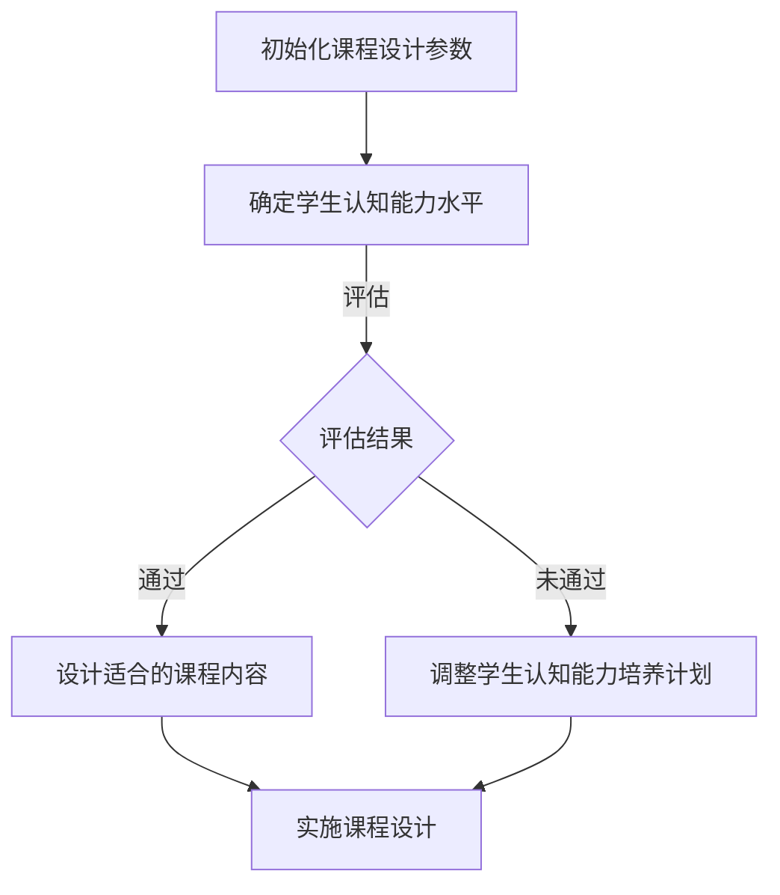
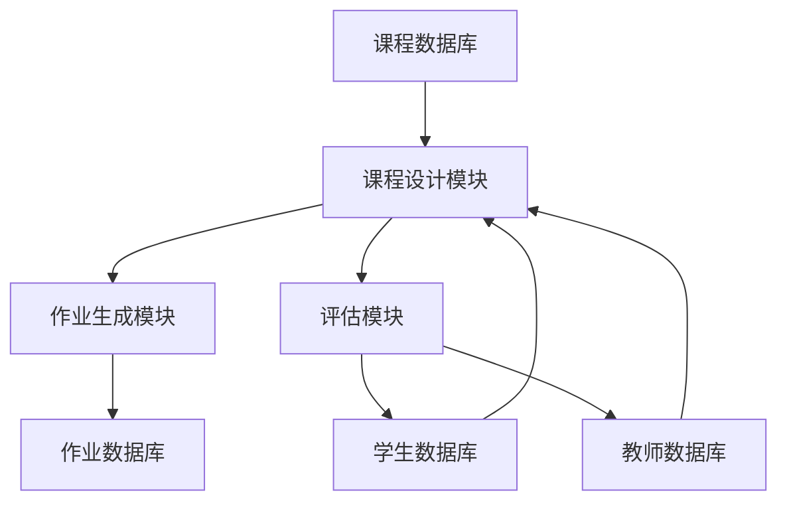
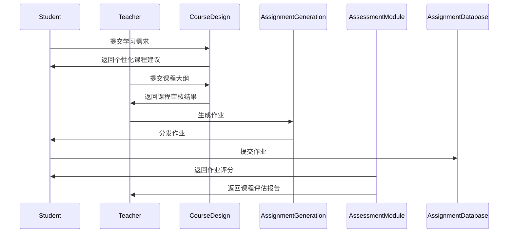
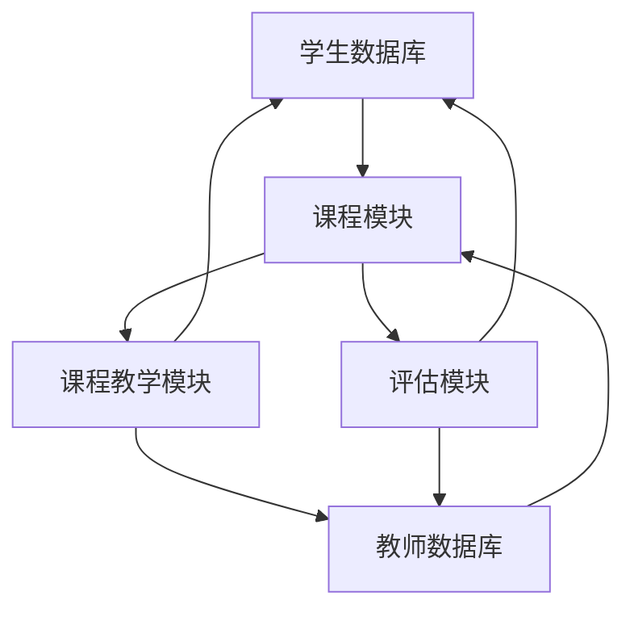
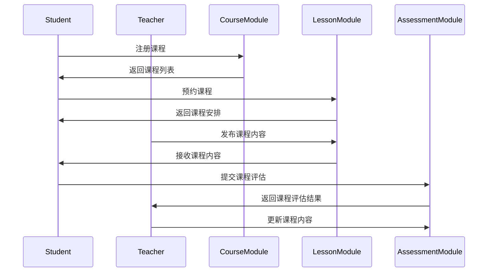

                 


## 第1章：问题背景与概述

### 1.1 问题的提出

随着人工智能技术的快速发展，AI教育已经成为计算机科学教育中不可或缺的一部分。然而，当前的AI教育存在一些问题，这些问题严重影响了学生的学习效果和兴趣。首先，当前的AI课程设计往往过于强调技术层面，忽视了学生的认知发展。很多课程内容复杂，难以理解，导致学生产生挫败感。其次，课程内容与实际需求脱节，很多学生在完成课程后，仍然无法将其应用于实际问题解决。此外，AI教育缺乏对学生个性化学习的支持，无法满足不同学生的需求。

为了解决这些问题，我们需要引入认知发展理论来指导AI课程设计。认知发展理论主要研究人类认知能力的形成和发展过程，强调通过认知活动来理解世界。这一理论为我们提供了新的视角，帮助我们更好地理解学生的学习过程，从而设计出更符合学生认知发展的AI课程。

### 1.2 认知发展理论概述

认知发展理论是心理学领域的一个重要分支，主要研究人类认知能力的发展过程。该理论认为，个体的认知能力是逐步发展成熟的，而不是突然获得的。认知发展理论的发展历程可以追溯到瑞士心理学家让·皮亚杰（Jean Piaget）。

**1.2.1 皮亚杰的认知发展理论**

皮亚杰提出了著名的认知发展阶段理论，将儿童的认知发展分为四个阶段：感知运动阶段（0-2岁）、前运算阶段（2-7岁）、具体运算阶段（7-11岁）和形式运算阶段（11岁及以上）。每个阶段都有其独特的认知特点和发展任务。

**1.2.2  维果斯基的文化历史发展理论**

另一位重要的认知发展理论家是列夫·维果斯基（Lev Vygotsky）。维果斯基强调社会互动和文化背景在认知发展中的作用，提出了文化历史发展理论。他认为，认知发展是社会实践和文化互动的结果。

**1.2.3 认知发展理论的基本原则**

认知发展理论的基本原则包括：

1. **适应性原则**：个体通过适应环境来发展认知能力。
2. **平衡原则**：认知发展是一个不断平衡的过程，个体通过同化和顺应来达到认知平衡。
3. **建构原则**：认知发展是通过个体与环境的相互作用来实现的。

### 1.3 认知发展理论的应用范围

认知发展理论在教育领域有广泛的应用。通过认知发展理论，我们可以更好地理解学生的学习过程，从而设计出更有效的教学策略。在AI课程设计中，认知发展理论可以帮助我们：

1. **设计符合学生认知水平的课程内容**：确保课程难度适中，既能激发学生的学习兴趣，又不会让学生感到挫败。
2. **注重学生的个性化学习**：通过了解学生的认知发展阶段，设计出适合不同认知水平学生的课程内容。
3. **培养学生的批判性思维**：通过引导学生进行认知活动，培养他们的批判性思维和解决问题的能力。

### 1.4 核心要素组成

认知发展理论的核心要素包括：

1. **认知能力**：包括感知、记忆、注意力、语言和思维等。
2. **认知过程**：包括同化、顺应、平衡和建构等。
3. **认知发展阶段**：包括感知运动阶段、前运算阶段、具体运算阶段和形式运算阶段。

通过理解这些核心要素，我们可以更好地应用认知发展理论来指导AI课程设计。

## 第2章：认知发展理论在AI课程设计中的应用

### 2.1 核心概念与联系

在AI课程设计中，认知发展理论的核心概念包括认知能力、认知过程和认知发展阶段。这些概念相互作用，共同影响着课程的设计和实施。

**2.1.1 认知能力**

认知能力是指个体在认知过程中所具备的能力。它包括感知、记忆、注意力、语言和思维等。在AI课程设计中，我们需要根据学生的认知能力水平来设计课程内容。

**2.1.2 认知过程**

认知过程是指个体在认知活动中所经历的步骤。它包括同化、顺应、平衡和建构等。同化是指个体将新信息纳入已有的认知结构中；顺应是指个体调整已有的认知结构以适应新信息；平衡是指个体在认知过程中的稳定状态；建构是指个体通过认知活动来构建对世界的理解。

**2.1.3 认知发展阶段**

认知发展阶段是指个体在认知能力发展过程中所经历的阶段。根据皮亚杰的认知发展阶段理论，个体依次经历感知运动阶段、前运算阶段、具体运算阶段和形式运算阶段。每个阶段都有其独特的认知特点和发展任务。

为了更好地理解这些核心概念，我们可以通过ER实体关系图来展示它们之间的关系。

```mermaid
erDiagram
    AI课程设计 ||--o{ 认知能力 : DesignElement }
    AI课程设计 ||--o{ 认知过程 : DesignElement }
    AI课程设计 ||--o{ 认知发展阶段 : DesignElement }
    认知能力 ||--o{ 同化 : CognitiveProcess }
    认知能力 ||--o{ 顺应 : CognitiveProcess }
    认知能力 ||--o{ 平衡 : CognitiveProcess }
    认知能力 ||--o{ 建构 : CognitiveProcess }
    认知过程 ||--o{ 感知运动阶段 : CognitiveStage }
    认知过程 ||--o{ 前运算阶段 : CognitiveStage }
    认知过程 ||--o{ 具体运算阶段 : CognitiveStage }
    认知过程 ||--o{ 形式运算阶段 : CognitiveStage }
```

### 2.2 算法原理讲解

在AI课程设计中，算法原理是一个核心组成部分。以下是一个典型的AI课程设计算法，我们将使用mermaid流程图和Python代码来解释其原理。

**2.2.1 算法mermaid流程图**



**2.2.2 算法原理的数学模型和公式**

在认知发展理论指导下，AI课程设计可以看作是一个优化问题。我们使用以下数学模型来描述：

$$
\begin{aligned}
    \min_{X} &\quad C(X) \\
    \text{s.t.} &\quad D(X) \leq 0
\end{aligned}
$$

其中，$X$是课程设计参数，$C(X)$是课程设计成本，$D(X)$是课程设计违背的认知发展原则。

**2.2.3 通俗易懂的举例说明**

假设我们有一个学生，其认知能力水平处于具体运算阶段。根据认知发展理论，我们可以设计以下课程内容：

1. **感知运动阶段**：通过实验和观察来引入AI的基本概念。
2. **前运算阶段**：通过简单的编程任务来培养学生的逻辑思维能力。
3. **具体运算阶段**：通过复杂的问题解决来提高学生的抽象思维能力。

通过这种课程设计，我们可以确保课程内容与学生认知能力水平相匹配，从而提高学习效果。

## 第3章：AI课程设计的实践案例分析

### 3.1 案例一：基于认知发展理论的AI课程设计

**3.1.1 案例背景**

本案例旨在设计一门面向大学生的AI基础课程，通过认知发展理论来指导课程设计，以提高学生的学习效果和兴趣。

**3.1.2 系统功能设计**

在系统功能设计阶段，我们使用mermaid类图来展示课程设计的核心功能。

```mermaid
classDiagram
    Student <<class>>
    Teacher <<class>>
    Course <<class>>
    Assignment <<class>>

    Student --|> Course
    Teacher --|> Course
    Teacher --|> Assignment
    Student --|> Assignment
```

**3.1.3 系统架构设计**

在系统架构设计阶段，我们使用mermaid架构图来展示课程设计的整体架构。



**3.1.4 系统接口设计和系统交互**

在系统接口设计和系统交互阶段，我们使用mermaid序列图来展示课程设计的核心接口和交互流程。



**3.1.5 案例实现**

**环境安装**

首先，我们需要安装Python和相关的AI库，如TensorFlow和Scikit-learn。

```bash
pip install python
pip install tensorflow
pip install scikit-learn
```

**系统核心实现源代码**

以下是一个简单的Python代码示例，用于生成个性化课程建议。

```python
import tensorflow as tf
from sklearn.cluster import KMeans

def generate_course_recommendation(student_data, num_courses):
    # 数据预处理
    student_data_processed = preprocess_data(student_data)
    
    # 使用K-means聚类生成课程分组
    kmeans = KMeans(n_clusters=num_courses)
    kmeans.fit(student_data_processed)
    
    # 根据聚类结果生成课程建议
    course_recommendations = kmeans.predict(student_data_processed)
    return course_recommendations

def preprocess_data(student_data):
    # 对学生数据进行标准化处理
    student_data_normalized = (student_data - student_data.mean()) / student_data.std()
    return student_data_normalized

# 示例数据
student_data = [[1, 2], [3, 4], [5, 6], [7, 8]]

# 生成课程建议
course_recommendations = generate_course_recommendation(student_data, 2)
print(course_recommendations)
```

**代码应用解读与分析**

上述代码首先对学生的数据进行预处理，然后使用K-means聚类算法将学生数据划分为多个组，最后根据聚类结果生成个性化的课程建议。这种方法能够根据学生的兴趣和能力水平，推荐适合他们的课程，从而提高学习效果。

**3.1.6 实际案例分析和详细讲解剖析**

在本案例中，我们通过认知发展理论设计了面向不同认知能力水平学生的AI基础课程。课程内容包括感知运动阶段的基本概念引入，前运算阶段的基础编程训练，以及具体运算阶段的复杂问题解决。通过这样的设计，学生能够在不同的认知阶段中逐步掌握AI的核心概念和技术。

**3.1.7 项目小结**

通过本案例，我们可以看到认知发展理论在AI课程设计中的重要性。通过合理的课程设计和个性化的学习支持，我们可以提高学生的学习效果和兴趣。未来，我们还需要进一步探索如何更好地应用认知发展理论，以设计出更加有效的AI课程。

### 3.2 案例二：认知发展理论在AI课程教学中的应用

**3.2.1 案例背景**

本案例旨在探讨如何将认知发展理论应用于AI课程教学，以提高教学质量。

**3.2.2 系统功能设计**

在系统功能设计阶段，我们使用mermaid类图来展示AI课程教学的核心功能。

```mermaid
classDiagram
    Student <<class>>
    Teacher <<class>>
    Course <<class>>
    Lesson <<class>>
    Assessment <<class>>

    Student --|> Course
    Teacher --|> Course
    Teacher --|> Lesson
    Student --|> Lesson
    Student --|> Assessment
    Teacher --|> Assessment
```

**3.2.3 系统架构设计**

在系统架构设计阶段，我们使用mermaid架构图来展示AI课程教学的整体架构。



**3.2.4 系统接口设计和系统交互**

在系统接口设计和系统交互阶段，我们使用mermaid序列图来展示AI课程教学的核心接口和交互流程。



**3.2.5 案例实现**

**环境安装**

与案例一类似，我们需要安装Python和相关AI库。

```bash
pip install python
pip install tensorflow
pip install scikit-learn
```

**系统核心实现源代码**

以下是一个简单的Python代码示例，用于教师发布课程内容。

```python
import json

def publish_lesson_content(course_id, lesson_content):
    # 将课程内容存储为JSON文件
    with open(f"{course_id}_lesson.json", "w") as f:
        json.dump(lesson_content, f)

# 示例课程内容
lesson_content = {
    "title": "机器学习基础",
    "content": "本课程将介绍机器学习的基本概念和常用算法。",
    "resources": ["https://example.com/ml_basics.pdf"]
}

# 发布课程内容
publish_lesson_content("course123", lesson_content)
```

**代码应用解读与分析**

上述代码将课程内容存储为JSON文件，便于学生随时查阅。教师可以轻松更新和发布课程内容，从而提高教学质量。

**3.2.6 实际案例分析和详细讲解剖析**

在本案例中，我们通过认知发展理论设计了AI课程教学系统，包括课程注册、预约、发布和评估等功能。教师可以根据学生的认知发展水平，灵活调整课程内容和教学策略，从而提高学生的学习效果。

**3.2.7 项目小结**

通过本案例，我们可以看到认知发展理论在AI课程教学中的应用。通过合理的教学设计和个性化的支持，我们可以提高教学质量，激发学生的学习兴趣。未来，我们还需要进一步探索如何更好地应用认知发展理论，以设计出更加有效的AI课程教学系统。

## 第4章：最佳实践与启示

### 4.1 最佳实践 tips

在AI课程学习设计中，以下是一些最佳实践方法：

1. **以学生为中心**：在设计课程时，始终关注学生的认知发展水平，确保课程内容与学生能力相匹配。
2. **分阶段教学**：根据学生的认知发展阶段，设计分阶段的课程内容，逐步引导学生深入理解AI概念。
3. **多样化教学手段**：结合理论讲解、实践操作和案例分析等多种教学手段，提高学生的参与度和学习效果。
4. **个性化学习支持**：通过学习评估和反馈机制，为学生提供个性化的学习支持，帮助他们克服学习难点。
5. **持续迭代优化**：定期收集学生反馈，对课程设计和教学策略进行优化，以持续提升教学质量。

### 4.2 小结

认知发展理论在AI课程学习设计中具有重要价值。通过理解学生的认知发展阶段，我们可以设计出更加科学、有效的课程内容，提高学生的学习效果和兴趣。在未来，我们应继续探索如何更好地应用认知发展理论，以设计出更加完善的AI课程学习设计。

### 4.3 注意事项

在设计AI课程学习时，我们需要注意以下几点：

1. **避免内容过于复杂**：课程内容应简明易懂，避免使用过于专业的术语，以免学生产生困惑。
2. **关注学生个性化需求**：了解学生的兴趣和背景，提供多样化的学习资源和教学方式，满足不同学生的需求。
3. **及时反馈与调整**：定期收集学生反馈，及时调整教学策略和课程内容，确保课程设计始终符合学生的认知发展水平。

### 4.4 拓展阅读

对于希望进一步深入研究认知发展理论在AI课程学习设计中的应用，以下是一些推荐阅读材料：

1. 《认知发展心理学》 - 约翰·弗拉维尔（John Flavell）
2. 《认知心理学：思想与行动》 - 理查德·纳尔逊（Richard Nelson）
3. 《机器学习》 - 周志华
4. 《深度学习》 - 伊恩·古德费洛（Ian Goodfellow）
5. 《人工智能教育指南》 - 史蒂夫·霍夫曼（Steve Hoffman）

通过阅读这些资料，您可以更深入地了解认知发展理论在AI课程学习设计中的应用，为实践提供有力支持。

## 作者信息

作者：AI天才研究院/AI Genius Institute & 禅与计算机程序设计艺术 /Zen And The Art of Computer Programming

