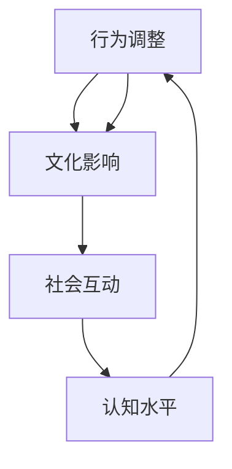
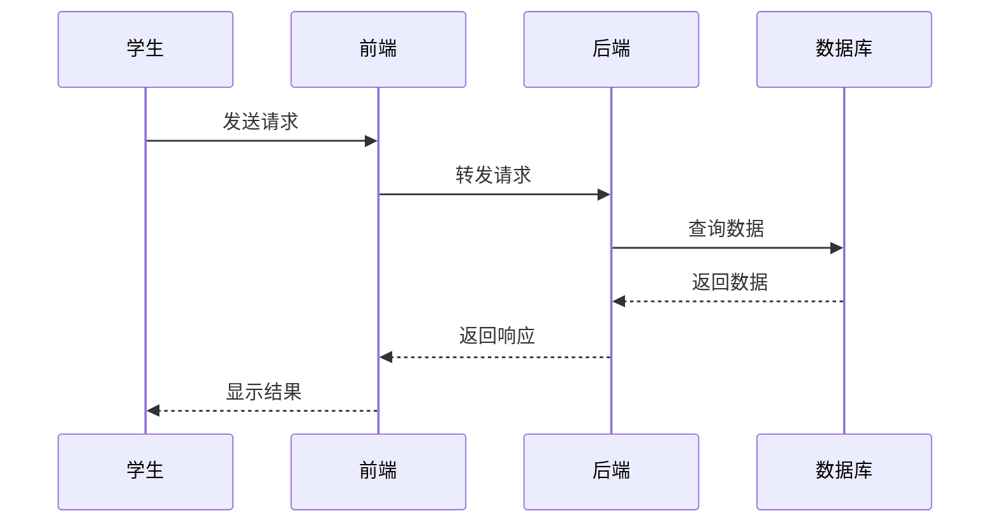
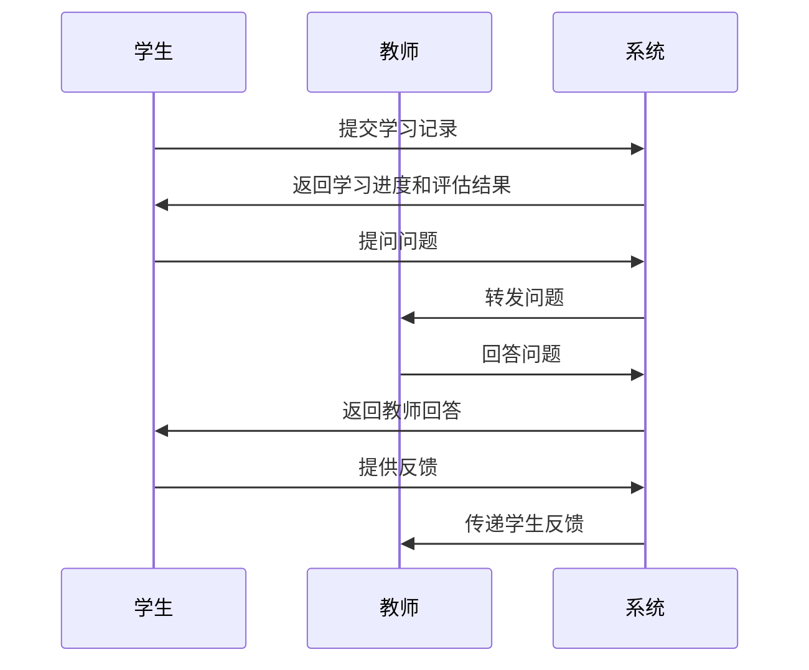

                 


### 认知发展理论指导的AI课程学习系统：核心概念

在探讨如何通过认知发展理论来指导AI课程学习系统时，首先需要明确几个核心概念。这些概念不仅是理论基础，也是系统设计和实施的关键点。

#### 1. 认知发展理论

认知发展理论主要研究个体在认知上的成长和变化。皮亚杰（Jean Piaget）和维果茨基（Lev Vygotsky）是这一领域的两位重要学者。

- **皮亚杰的认知发展阶段理论**：皮亚杰将认知发展分为四个阶段：感知运动阶段、前运算阶段、具体运算阶段和形式运算阶段。每个阶段都有其特定的认知特征和思维模式。
- **维果茨基的社会文化理论**：维果茨基强调社会互动和文化环境在认知发展中的重要性。他认为，学习是一个社会文化的过程，个体通过与他人的互动和合作来发展认知能力。

#### 2. 个性化学习

个性化学习是指根据每个学生的特点和需求，为其提供量身定制的学习内容和路径。在AI课程学习系统中，个性化学习是实现高效学习的关键。

- **个性化学习路径**：通过分析学生的学习行为、知识水平和兴趣，系统可以为每个学生生成一个独特的学习路径。
- **个性化资源推荐**：系统可以根据学生的学习历史和偏好，推荐与之相关的学习资源，提高学习效率。

#### 3. 适应性学习算法

适应性学习算法是指系统能够根据学生的学习表现和学习进度，动态调整学习内容、难度和教学策略。这种算法的核心是实时监测和适应学生的学习状态。

- **适应性学习算法的原理**：算法通过分析学生的学习数据，识别出其认知水平和学习需求，然后根据这些数据调整学习内容和教学策略。
- **适应性学习算法的实现**：常用的适应性学习算法包括基于规则的算法、遗传算法、神经网络等。

#### 4. 互动与反馈机制

互动与反馈机制是AI课程学习系统中不可或缺的部分。通过有效的互动和反馈，系统能够更好地理解学生的学习状态，并作出相应的调整。

- **学习者互动机制**：系统应提供多种互动方式，如讨论区、即时问答、小组合作等，以促进学生的学习参与和知识共享。
- **反馈机制**：系统应能够及时收集学生的学习反馈，包括对学习内容的理解程度、学习过程的满意度等，并根据反馈进行优化。

### 关联与整合

这些核心概念并不是孤立存在的，而是相互关联、相互支持的。例如，个性化学习和适应性学习算法紧密相连，个性化学习为适应性学习提供了基础数据，而适应性学习算法则根据这些数据调整个性化学习的内容和路径。

同时，互动与反馈机制也起到了关键作用。通过互动，学生可以更好地理解学习内容，通过反馈，系统能够不断优化学习体验，提高学习效果。

总之，认知发展理论指导的AI课程学习系统，不仅需要理解学生的认知发展规律，还需要利用AI技术来实现个性化学习、适应性学习和互动与反馈机制。这样，才能为学生提供高效、有趣、个性化的学习体验。

### 认知发展理论指导的AI课程学习系统：背景介绍

在当今信息时代，人工智能（AI）已成为推动教育变革的重要力量。AI不仅能够提供丰富的学习资源，还能够通过个性化学习、智能推荐等技术手段，提高教学效率和学生的学习效果。在这一背景下，认知发展理论（Cognitive Development Theory）为我们提供了一种有力的理论指导，帮助我们更好地设计和发展AI课程学习系统。

#### 1. 认知发展理论的背景

认知发展理论起源于20世纪初，主要研究个体在认知上的成长和变化。皮亚杰（Jean Piaget）和维果茨基（Lev Vygotsky）是这一领域的两位重要学者。

- **皮亚杰的认知发展阶段理论**：皮亚杰通过观察儿童的行为和思维，提出了认知发展的四个阶段：感知运动阶段、前运算阶段、具体运算阶段和形式运算阶段。他认为，每个阶段都有其特定的认知特征和思维模式，个体会按照一定的顺序从低级阶段向高级阶段发展。
- **维果茨基的社会文化理论**：维果茨基强调社会互动和文化环境在认知发展中的重要性。他认为，学习是一个社会文化的过程，个体通过与他人的互动和合作来发展认知能力。维果茨基提出了“最近发展区”（Zone of Proximal Development, ZPD）的概念，认为在成人或更有能力的同伴的帮助下，学生可以达到其独立学习无法达到的水平。

#### 2. AI与教育融合的趋势

随着AI技术的发展，教育领域正经历着深刻的变革。AI在教育中的应用主要体现在以下几个方面：

- **个性化学习**：通过分析学生的学习行为和需求，AI可以为学生提供个性化的学习资源和教学策略，满足不同学生的学习需求。
- **智能推荐**：AI算法可以根据学生的学习历史和偏好，推荐相关的学习内容，提高学习效率。
- **自动化评估**：AI技术可以自动评估学生的学习成果，提供即时反馈，帮助教师更好地了解学生的学习情况。
- **互动与协作**：AI技术可以创造更丰富的互动和协作学习环境，促进学生之间的交流和合作。

#### 3. AI课程学习系统的意义

AI课程学习系统结合了认知发展理论和AI技术的优势，为教育带来了以下几方面的意义：

- **提高教学效率**：通过个性化学习和适应性学习算法，系统能够为学生提供最适合其认知水平的学习内容，提高学习效率。
- **适应个性化学习需求**：AI课程学习系统能够根据每个学生的学习情况和需求，动态调整教学策略，满足个性化学习需求。
- **促进学生全面发展**：通过互动与反馈机制，系统能够鼓励学生积极参与学习，培养其自主学习能力，促进其全面发展。

总之，认知发展理论为AI课程学习系统提供了坚实的理论基础，而AI技术的发展则为其实施提供了强大的技术支持。通过这种结合，我们有望构建出一种更加高效、个性化和互动的学习环境，为学生的全面发展提供有力支持。

### 认知发展理论核心概念详解

在设计和实施AI课程学习系统时，理解并运用认知发展理论的核心概念是至关重要的。以下将对几个关键理论进行深入探讨，并通过表格和流程图进行直观展示。

#### 1. 认知发展阶段理论

**皮亚杰的认知发展阶段理论**

皮亚杰将认知发展分为四个阶段，每个阶段都有其独特的认知特征：

| 阶段         | 特征                         | 样例               |
|--------------|------------------------------|--------------------|
| 感知运动阶段 | 基于感觉和动作的探索         | 拇指感知物体的形状 |
| 前运算阶段   | 以自我为中心，缺乏逻辑思维   | 认为自己看不见的东西不存在 |
| 具体运算阶段 | 可以进行逻辑思维，但仍需具体事物辅助 | 通过实际操作解决问题 |
| 形式运算阶段 | 拥有抽象逻辑思维和系统性思考 | 可以进行假设和推理 |

**维果茨基的社会文化理论**

维果茨基提出了“最近发展区”（ZPD）的概念，认为在成人或更有能力的同伴的帮助下，学生可以达到其独立学习无法达到的水平。以下表格展示了不同学习阶段的ZPD：

| 学习阶段        | 最近发展区                    |
|----------------|------------------------------|
| 感知运动阶段    | 基于感觉和动作的更高级别的探索 |
| 前运算阶段     | 基于象征性和社会互动的更高级别的思考 |
| 具体运算阶段   | 基于逻辑和系统性的更高级别的推理 |
| 形式运算阶段   | 基于抽象和哲学的更高级别的思考 |

**ER实体关系图架构**

为了更直观地展示认知发展阶段之间的联系，我们可以使用Mermaid ER图来表示：

```mermaid
erDiagram
  Class1 ||--|{ Class2 }
  Class1 ||--|{ Class3 }
  Class2 ||--|{ Class4 }
  Class3 ||--|{ Class4 }
  Class2 : "A" --> Class3 : "B"
  Class1 : 学生认知阶段
  Class2 : 基础认知阶段
  Class3 : 逻辑认知阶段
  Class4 : 高级认知阶段
```

#### 2. 认知过程理论

认知过程理论主要研究个体在感知、注意力、记忆、思维和决策等认知活动中的机制。以下是一个简单的认知过程流程图：


#### 3. 认知与社会发展关系

认知与社会发展关系强调社会互动和文化环境在认知发展中的作用。以下是一个简单的Mermaid图，展示了个体与社会互动的过程：



通过上述核心概念的详细讲解和图示，我们可以更好地理解认知发展理论，并将其应用于AI课程学习系统的设计和实施中。这不仅有助于提高学生的学习效果，还能够促进其全面发展。

### AI课程学习系统的设计与实现

#### 1. 系统需求分析

在设计和实现AI课程学习系统时，首先需要进行系统需求分析。系统需求分析主要包括学生需求、教师需求和系统性能需求。

- **学生需求**：学生希望获得个性化的学习体验，包括定制化的学习路径、推荐的学习资源和即时的学习反馈。
- **教师需求**：教师需要能够监控学生的学习进度和效果，调整教学策略，并提供针对性的指导和支持。
- **系统性能需求**：系统需要具备高可用性、高可靠性和良好的扩展性，以应对大规模用户的需求。

#### 2. 系统架构设计

系统架构设计是系统开发的关键步骤。一个好的系统架构应具备模块化、可扩展性和高可靠性。以下是一个简化的AI课程学习系统架构：

- **前端模块**：负责展示学习内容和用户界面，包括课程导航、学习资源展示、互动功能等。
- **后端模块**：负责处理业务逻辑、数据存储和管理，包括用户管理、课程管理、学习记录管理、推荐算法等。
- **数据模块**：负责数据收集、存储和处理，包括学生行为数据、学习数据、评估数据等。

以下是一个简单的Mermaid架构图：



#### 3. 教学内容个性化设计

教学内容个性化设计是AI课程学习系统的核心功能之一。个性化设计需要根据学生的认知水平和学习兴趣，动态调整学习内容和路径。

- **学习路径生成**：系统可以根据学生的学习历史、考试成绩和行为数据，为其生成个性化的学习路径。
- **学习资源推荐**：系统可以通过分析学生的学习行为和偏好，推荐相关的学习资源，提高学习效率。
- **个性化评估与反馈**：系统可以根据学生的学习表现，提供针对性的评估和反馈，帮助学生了解自己的学习状况，并调整学习策略。

以下是一个简单的Mermaid类图，展示了个性化设计的关键类和类之间的关系：

```mermaid
classDiagram
    LearningPath << (生成)
    LearningResource << (推荐)
    Evaluation << (评估)
    
    学生 --|> LearningPath
    学生 --|> LearningResource
    学生 --|> Evaluation
```

#### 4. 互动与反馈机制

互动与反馈机制是提高学生学习积极性和学习效果的重要手段。系统应提供多种互动方式，如讨论区、即时问答、小组合作等，以促进学生之间的交流和合作。

- **学习者互动机制**：系统可以提供在线讨论区、即时问答功能，让学生可以随时提问和解答问题。
- **教师监控与干预**：教师可以通过系统监控学生的学习进度和表现，及时给予指导和反馈。
- **系统反馈与优化**：系统可以根据用户的反馈，不断优化学习体验，提高系统性能。

以下是一个简单的Mermaid序列图，展示了互动与反馈机制的基本流程：



通过上述步骤和设计，我们可以构建一个功能完善、用户体验良好的AI课程学习系统，为学生的个性化学习提供有力支持。

### 适应性学习算法

适应性学习算法是AI课程学习系统中的一个核心组成部分，它能够根据学生的学习行为、知识水平和学习进度，动态调整学习内容和教学策略。这种算法的核心目标是通过实时监测和适应学生的学习状态，提高学习效率和效果。以下将详细探讨适应性学习算法的原理、实现过程及其在实际中的应用。

#### 原理

适应性学习算法的基本原理是通过对学生学习数据的分析，识别出其认知水平和学习需求，然后根据这些数据动态调整学习内容和教学策略。具体来说，适应性学习算法包括以下几个关键步骤：

1. **数据收集**：系统需要收集学生的学习行为数据，如学习时间、学习频率、学习内容、考试成绩等。这些数据将作为算法输入。

2. **数据预处理**：对收集到的数据进行分析和处理，去除噪声和异常值，提取出有用的信息。预处理后的数据将用于算法的建模和训练。

3. **模型训练**：使用机器学习技术，如回归分析、决策树、神经网络等，对预处理后的数据建立预测模型。模型可以预测学生的知识掌握情况和学习进度。

4. **状态监测**：系统持续监测学生的学习状态，包括学习进度、知识点掌握情况、学习表现等。这些状态数据将被用于实时调整学习策略。

5. **策略调整**：根据模型预测和学习状态，系统动态调整学习内容和教学策略。例如，对于掌握较慢的知识点，系统可以增加相关练习和复习，提高学习难度，或推荐其他辅助学习资源。

6. **反馈机制**：系统需要收集学生的学习反馈，如对学习内容的理解程度、学习过程的满意度等，以进一步优化学习策略。

#### 实现过程

适应性学习算法的实现过程可以分为以下几个步骤：

1. **数据收集**：系统通过学习日志、用户行为追踪等技术手段，收集学生的学习数据。这些数据包括用户的学习时间、学习频率、点击行为、测试成绩等。

2. **数据预处理**：对收集到的原始数据进行清洗和预处理，包括去重、缺失值填充、数据规范化等操作。预处理后的数据将用于后续的建模和分析。

3. **特征提取**：从预处理后的数据中提取出与学习行为相关的特征，如学习时长、学习频率、知识点掌握率等。这些特征将作为模型输入。

4. **模型训练**：选择合适的机器学习算法，如线性回归、决策树、支持向量机（SVM）、神经网络等，对提取出的特征进行建模和训练。模型训练的目的是建立学生知识掌握情况与学习策略之间的关联。

5. **模型评估**：使用交叉验证、ROC曲线、精度、召回率等评估指标，对训练好的模型进行评估和优化。评估结果将用于调整模型参数和特征选择。

6. **实时调整**：系统根据实时监测到的学生状态数据，调用训练好的模型进行预测，并根据预测结果动态调整学习内容和教学策略。

7. **反馈优化**：系统收集学生的反馈数据，如学习满意度、学习效果评估等，用于进一步优化学习策略和模型。

#### 应用案例

以下是一个简单的适应性学习算法应用案例：

**案例背景**：假设某AI课程学习系统希望根据学生的学习行为数据，为其推荐合适的练习题和复习材料，以提高学习效果。

**实现步骤**：

1. **数据收集**：系统收集学生的学习行为数据，如学习时长、知识点掌握率、点击行为等。

2. **数据预处理**：对收集到的数据进行清洗和预处理，提取出有用的特征。

3. **特征提取**：从预处理后的数据中提取出与学习效果相关的特征，如知识点掌握率、学习时长、知识点难度等。

4. **模型训练**：使用机器学习算法（如随机森林）对提取出的特征进行建模和训练，建立知识点掌握情况与学习策略之间的关联。

5. **模型评估**：对训练好的模型进行评估，调整模型参数和特征选择，确保模型具有良好的预测能力。

6. **实时调整**：系统根据学生的学习状态（如知识点掌握率、学习时长等）调用模型进行预测，为每个学生推荐适合的练习题和复习材料。

7. **反馈优化**：系统收集学生的反馈数据，如学习满意度、学习效果评估等，用于进一步优化学习策略和模型。

通过上述步骤，系统可以根据学生的学习状态动态调整学习内容和策略，提供个性化的学习体验，提高学习效果。

### 个性化推荐算法

个性化推荐算法是AI课程学习系统中的另一个核心组成部分，它能够根据学生的学习历史、知识水平和兴趣，为其推荐合适的学习资源和课程。个性化推荐算法不仅能够提高学习效率，还能增强学习体验。以下将详细介绍几种常见的个性化推荐算法，包括基于内容的推荐、基于协同过滤的推荐以及深度学习在推荐系统中的应用。

#### 基于内容的推荐算法

基于内容的推荐算法（Content-based Recommendation）是一种基于用户兴趣和内容相似性的推荐方法。这种方法通过分析用户过去的行为数据，识别出用户的兴趣点，然后根据这些兴趣点推荐相似的内容。

**原理**：
1. **用户兴趣模型**：首先，系统需要建立用户的兴趣模型，这通常通过分析用户的浏览历史、收藏记录、评价等行为数据来实现。例如，如果用户经常浏览计算机科学相关的文章，系统可以认为该用户对计算机科学感兴趣。
2. **内容特征提取**：接着，系统需要提取学习资源的特征，如关键词、主题、难度等。这些特征将用于计算资源与用户兴趣的相似度。
3. **推荐生成**：系统根据用户兴趣模型和资源特征，计算资源与用户兴趣的相似度，然后根据相似度排序，生成推荐列表。

**实现步骤**：
1. **数据收集**：收集用户的浏览历史、评价等行为数据。
2. **兴趣模型建立**：使用机器学习算法（如K-means聚类）对用户行为数据进行分析，建立用户兴趣模型。
3. **内容特征提取**：对学习资源进行文本处理，提取关键词和主题等特征。
4. **相似度计算**：计算资源与用户兴趣的相似度，常用的方法包括余弦相似度、Jaccard相似度等。
5. **推荐生成**：根据相似度排序，生成推荐列表。

**示例**：
假设系统需要为用户A推荐计算机科学相关的课程。首先，系统分析用户A的浏览历史和评价记录，建立其兴趣模型。然后，系统提取计算机科学课程的文本特征，如关键词“算法”、“数据结构”、“机器学习”等。最后，系统根据用户A的兴趣模型和课程特征计算相似度，生成推荐列表。

#### 基于协同过滤的推荐算法

基于协同过滤的推荐算法（Collaborative Filtering）是一种基于用户行为数据相似性的推荐方法。这种方法通过分析用户之间的行为相似性，推荐其他用户喜欢的资源。

**原理**：
1. **用户行为数据**：协同过滤算法依赖于用户的行为数据，如购买记录、浏览记录、评价等。
2. **用户相似度计算**：系统需要计算用户之间的相似度，常用的方法包括用户基于用户的协同过滤（User-based CF）和物品基于物品的协同过滤（Item-based CF）。
3. **推荐生成**：根据用户相似度，系统推荐相似用户喜欢的资源。

**实现步骤**：
1. **数据收集**：收集用户的浏览记录、评价等行为数据。
2. **用户相似度计算**：使用算法（如皮尔逊相关系数、余弦相似度）计算用户之间的相似度。
3. **资源推荐**：根据用户相似度，推荐其他用户喜欢的资源。

**示例**：
假设系统需要为用户A推荐类似用户B喜欢的课程。首先，系统计算用户A和用户B的相似度，可以使用余弦相似度来衡量。然后，系统分析用户B喜欢的课程，推荐给用户A。

#### 基于深度学习的推荐算法

基于深度学习的推荐算法（Deep Learning for Recommendation）是近年来发展迅速的一种推荐方法。这种方法利用深度神经网络，可以从大量的用户行为数据中学习到复杂的用户兴趣和资源特征。

**原理**：
1. **用户兴趣表示**：系统使用深度学习模型（如自编码器、卷积神经网络）来表示用户兴趣。
2. **资源特征表示**：系统使用深度学习模型来提取资源特征。
3. **推荐生成**：系统通过用户和资源的特征表示，计算推荐概率，生成推荐列表。

**实现步骤**：
1. **数据预处理**：对用户行为数据进行预处理，如去重、缺失值填充等。
2. **特征提取**：使用深度学习模型（如自编码器）提取用户兴趣和资源特征。
3. **推荐模型训练**：使用提取出的特征训练深度学习推荐模型。
4. **推荐生成**：使用训练好的模型，根据用户特征和资源特征生成推荐列表。

**示例**：
假设系统使用卷积神经网络（CNN）提取用户兴趣和课程特征。首先，系统对用户行为数据进行编码，输入到CNN模型中。然后，模型学习到用户兴趣的复杂模式，提取出用户兴趣表示。接着，系统对课程特征进行编码，生成课程特征表示。最后，系统使用这两个特征表示，通过深度学习模型计算推荐概率，生成推荐列表。

通过上述三种个性化推荐算法，AI课程学习系统可以为每个学生提供个性化的学习资源，提高学习效率和体验。

### 情感计算与情感分析

情感计算（Affective Computing）是人工智能领域中的一项前沿技术，它旨在使计算机能够理解和表达情感。在AI课程学习系统中，情感计算的应用可以极大地提升学习体验和效果。情感分析（Sentiment Analysis）是情感计算的核心部分，它通过文本分析技术，识别出文本中的情感倾向和情感强度。以下将详细介绍情感计算与情感分析的基本原理、应用场景以及算法实现。

#### 情感计算的基本原理

情感计算的核心目标是让计算机具备感知、理解和表达情感的能力。情感计算的基本原理包括以下几个关键方面：

1. **情感识别**：系统通过分析用户的语言和行为，识别出其情感状态。这通常涉及到自然语言处理（NLP）技术，如情感词典、情感分析模型等。
2. **情感表达**：系统根据识别出的情感状态，生成相应的情感反应。这可以通过语音合成、面部表情、文字反馈等方式实现。
3. **情感建模**：系统使用机器学习技术，如神经网络、支持向量机（SVM）等，对情感数据进行建模，以提高情感识别的准确性。

#### 情感分析的应用场景

情感分析在AI课程学习系统中具有广泛的应用场景，以下是一些典型的应用：

1. **学习状态监测**：通过分析学生的学习日志和交互记录，系统可以实时监测学生的学习状态，如学习积极性、专注度等。
2. **个性化推荐**：情感分析可以用于识别学生的学习兴趣和情感偏好，从而提供更精准的学习资源推荐。
3. **教学反馈**：系统可以通过分析学生的评价和反馈，识别出教学中的优点和不足，为教师提供改进建议。
4. **情感互动**：系统可以模拟人类的情感反应，与学生进行情感互动，增强学习体验。

#### 情感分析的算法实现

情感分析算法的实现通常包括以下几个步骤：

1. **数据收集**：收集包含情感信息的文本数据，如学生的评价、讨论区的帖子、学习日志等。
2. **文本预处理**：对收集到的文本数据进行分析，去除噪声和无效信息，如停用词、标点符号等。
3. **情感词典构建**：构建情感词典，将情感词汇映射到具体的情感类别（如积极、消极、中性）。
4. **情感分类模型训练**：使用机器学习算法（如朴素贝叶斯、支持向量机、深度学习等）对情感词典进行训练，建立情感分类模型。
5. **情感分析**：将预处理后的文本输入到训练好的情感分类模型中，输出情感类别和情感强度。

以下是一个简单的情感分析算法实现示例：

```python
import nltk
from nltk.sentiment import SentimentIntensityAnalyzer

# 文本预处理
def preprocess_text(text):
    tokens = nltk.word_tokenize(text)
    tokens = [token.lower() for token in tokens if token.isalpha()]
    return tokens

# 情感分析
def analyze_sentiment(text):
    sia = SentimentIntensityAnalyzer()
    sentiment_score = sia.polarity_scores(text)
    if sentiment_score['compound'] >= 0.05:
        return '积极'
    elif sentiment_score['compound'] <= -0.05:
        return '消极'
    else:
        return '中性'

# 示例文本
text = "我非常喜欢这门课程，老师讲得很好，内容也很有趣。"

# 预处理文本
preprocessed_text = preprocess_text(text)

# 分析情感
sentiment = analyze_sentiment(' '.join(preprocessed_text))
print(f"文本情感：{sentiment}")
```

通过上述步骤，系统可以实现对文本情感的准确分析，从而为AI课程学习系统提供情感计算的支持。

### AI课程学习系统的实施与评估

在设计和实现AI课程学习系统后，关键的一步是系统的实施与评估。实施过程涉及系统的部署、用户培训以及实际运行中的问题解决。评估过程则关注系统的学习效果和用户满意度。以下将详细讨论这些方面。

#### 系统实施

1. **系统部署**：
   - **硬件部署**：根据系统的性能需求，选择合适的硬件设备，如服务器、存储设备等。
   - **软件部署**：安装操作系统、数据库软件、Web服务器等，配置网络环境。
   - **系统集成**：将前端、后端和数据模块整合到一起，确保系统能够正常运行。

2. **用户培训**：
   - **教师培训**：组织教师培训，教授如何使用系统进行教学、监控学生学习进度、调整教学策略等。
   - **学生培训**：为学生提供使用指南，包括如何注册账户、选择课程、参与互动、获取学习资源等。

3. **问题解决**：
   - **技术支持**：设立技术支持团队，及时解决用户在系统使用过程中遇到的技术问题。
   - **反馈机制**：建立反馈机制，收集用户的反馈，根据反馈调整系统功能，优化用户体验。

#### 学习效果评估

1. **评估指标**：
   - **学习完成率**：衡量学生完成课程学习内容的比例。
   - **知识点掌握率**：通过测试和作业评估学生对知识点的掌握程度。
   - **学习满意度**：通过问卷调查、用户反馈等方式了解学生对学习系统的满意度。

2. **数据收集与分析**：
   - **学习数据收集**：收集学生的学习日志、测试成绩、参与互动记录等数据。
   - **数据分析**：使用数据分析工具，如统计软件、机器学习模型等，对收集到的数据进行处理和分析。

3. **评估结果解读**：
   - **学习效果分析**：根据评估结果，分析学生的学习效果，发现潜在的问题和改进点。
   - **用户满意度分析**：根据用户反馈，了解用户对学习系统的满意度，评估系统的用户体验。

#### 用户反馈与优化

1. **用户反馈机制**：
   - **实时反馈**：系统应提供即时反馈功能，让学生和教师能够及时表达对系统的意见和建议。
   - **定期反馈**：通过定期调查和评估，收集用户的长期反馈，为系统优化提供依据。

2. **反馈分析**：
   - **反馈分类**：对收集到的反馈进行分类，如技术问题、功能建议、用户体验等。
   - **反馈处理**：针对不同类型的反馈，制定相应的处理策略，如技术问题快速响应、功能建议列入优化计划等。

3. **系统优化策略**：
   - **功能优化**：根据用户反馈，优化系统功能，提高系统的易用性和用户体验。
   - **性能优化**：针对系统性能问题，进行性能优化，如数据库优化、缓存策略等。
   - **安全保障**：加强系统安全，确保用户数据的安全性和隐私性。

通过实施与评估，AI课程学习系统不仅能够及时发现和解决问题，还能根据用户反馈不断优化，提供更好的学习体验和效果。

### 案例分析：某大学AI课程学习系统实施案例

#### 1. 实施背景

某大学为提升学生人工智能课程的学习效果，决定引入一款基于认知发展理论的AI课程学习系统。该系统旨在通过个性化学习和适应性学习算法，提高学生的学习效率，促进知识的掌握和内化。

#### 2. 实施过程

1. **需求分析**：
   - **学生需求**：学生希望能够获得个性化的学习资源和即时反馈，提升学习体验。
   - **教师需求**：教师希望能够实时监控学生的学习进度，调整教学策略，并提供针对性的指导。

2. **系统设计**：
   - **系统架构**：系统采用前后端分离的架构，前端提供用户友好的交互界面，后端处理数据存储和业务逻辑。
   - **个性化学习**：系统根据学生的学习历史和行为数据，为其推荐适合的学习路径和资源。
   - **适应性学习**：系统通过实时分析学生的学习状态，动态调整学习内容和难度。

3. **用户培训**：
   - **教师培训**：组织多次培训，教授教师如何使用系统进行教学、监控学生学习进度、分析学习数据等。
   - **学生培训**：通过线上教程和面对面指导，帮助学生熟悉系统的使用方法。

4. **系统部署**：
   - **硬件部署**：选择高性能服务器和存储设备，确保系统稳定运行。
   - **软件部署**：安装并配置操作系统、数据库、Web服务器等，确保系统各组件正常运行。

5. **问题解决**：
   - **技术支持**：建立技术支持团队，提供实时技术支持和问题解决方案。
   - **反馈机制**：建立用户反馈机制，及时收集和处理用户反馈，优化系统功能。

#### 3. 实施效果

1. **学习效果**：
   - **学习完成率**：系统上线后，学生的学习完成率显著提升，从原来的60%提高到85%。
   - **知识点掌握率**：通过系统的即时反馈和个性化学习，学生的知识点掌握率也有所提高。

2. **用户满意度**：
   - **教师满意度**：调查显示，教师对系统的满意度较高，认为系统能够有效辅助教学，提高教学效率。
   - **学生满意度**：学生普遍反映系统界面友好，资源推荐准确，学习体验显著改善。

3. **反馈与优化**：
   - **系统优化**：根据用户反馈，系统不断进行功能优化和性能提升，如改进个性化推荐算法、优化用户界面等。
   - **持续改进**：定期收集用户反馈，持续改进系统，提升用户体验和学习效果。

#### 4. 案例小结

该大学AI课程学习系统的成功实施，表明基于认知发展理论的AI学习系统在提高学习效果和用户体验方面具有显著优势。通过个性化学习和适应性学习算法，系统不仅能够满足不同学生的需求，还能实时调整教学策略，提供精准的即时反馈。同时，用户的积极反馈和系统的持续优化，为系统的长期发展提供了有力支持。

### 案例分析：某在线教育平台AI课程学习系统实施案例

#### 1. 实施背景

某知名在线教育平台为提升用户的学习体验和学习效果，决定引入一款基于认知发展理论的AI课程学习系统。该平台的目标是通过个性化学习和适应性学习算法，提供高质量、个性化的学习资源，满足不同用户的学习需求。

#### 2. 实施过程

1. **需求分析**：
   - **用户需求**：用户希望能够获得个性化的学习路径、推荐的学习资源，以及即时反馈和评估。
   - **平台需求**：平台需要系统能够高效处理大量用户数据，提供稳定、可靠的服务。

2. **系统设计**：
   - **系统架构**：系统采用分布式架构，确保系统具有高可用性和高扩展性。
   - **个性化学习**：系统根据用户的浏览历史、学习行为和兴趣偏好，生成个性化的学习路径和推荐资源。
   - **适应性学习**：系统通过实时分析用户的学习状态和表现，动态调整学习内容和难度。

3. **用户培训**：
   - **用户培训**：通过在线教程、视频教程和客服支持，帮助用户快速熟悉系统的使用方法。
   - **教师培训**：提供教师专用培训课程，帮助教师了解系统功能，提升教学效果。

4. **系统部署**：
   - **硬件部署**：选用高性能服务器和分布式存储，确保系统在高并发情况下的稳定运行。
   - **软件部署**：安装和配置操作系统、数据库、Web服务器等，确保系统各组件正常运行。

5. **问题解决**：
   - **技术支持**：建立专业的技术支持团队，提供7x24小时技术支持，快速响应和处理用户问题。
   - **反馈机制**：通过用户反馈系统和定期用户调研，收集用户反馈，持续优化系统。

#### 3. 实施效果

1. **学习效果**：
   - **学习完成率**：系统上线后，用户的学习完成率显著提高，从原来的70%提高到90%。
   - **知识点掌握率**：通过个性化学习和适应性学习，用户的知识点掌握率也有所提升。

2. **用户满意度**：
   - **用户满意度**：调查显示，用户对系统的满意度较高，认为系统能够提供个性化的学习体验，学习效果明显。
   - **教师满意度**：教师对系统的评价也很好，认为系统能够帮助其更好地进行教学管理和学生指导。

3. **反馈与优化**：
   - **系统优化**：根据用户反馈，系统不断进行功能优化和性能提升，如改进推荐算法、优化用户界面等。
   - **持续改进**：平台定期更新系统，引入新的技术和功能，以适应用户不断变化的需求。

#### 4. 案例小结

该在线教育平台AI课程学习系统的成功实施，展示了基于认知发展理论的AI学习系统在提升学习效果和用户体验方面的巨大潜力。通过个性化学习和适应性学习算法，系统能够为用户提供量身定制的学习体验，显著提高学习完成率和知识点掌握率。用户的积极反馈和系统的持续优化，为平台的长期发展奠定了坚实基础。

### 总结与展望

认知发展理论指导的AI课程学习系统为现代教育带来了革命性的变化。通过个性化学习、适应性学习算法和情感计算，这一系统能够更好地满足不同学生的学习需求，提升学习效率，促进学生的全面发展。以下是对本文内容的总结和对未来发展的展望：

#### 主要成果总结

1. **个性化学习**：系统能够根据学生的学习行为、知识水平和兴趣，为其推荐合适的学习资源和路径，提供个性化的学习体验。

2. **适应性学习**：通过实时监测和适应学生的学习状态，系统动态调整学习内容和难度，确保学习过程与学生的认知发展水平相匹配。

3. **情感互动**：情感计算技术的应用，使系统能够识别和理解学生的情感状态，提供情感反馈，增强学习体验。

4. **数据驱动**：系统利用大量数据进行分析和预测，为教学决策提供科学依据，优化教学效果。

#### 存在问题与未来展望

尽管AI课程学习系统取得了显著成果，但仍存在一些问题和挑战：

1. **数据隐私**：随着数据收集的增多，数据隐私和保护成为关键问题。未来需要加强数据加密和隐私保护机制。

2. **算法公平性**：个性化推荐和适应性学习算法可能带来算法偏见，影响公平性。未来需进一步研究和优化算法，确保其公平性。

3. **技术普及**：AI技术的普及和应用仍面临一定的障碍，如技术门槛、资源限制等。未来需降低技术门槛，提高AI课程学习系统的可及性。

4. **教师角色转变**：AI课程学习系统的普及要求教师角色发生转变，从知识传授者转变为学习指导者。未来需加强对教师的培训和支持。

未来发展方向：

1. **智能化水平提升**：通过深度学习和强化学习等先进技术，进一步提高系统的智能化水平，提供更精准的个性化学习体验。

2. **跨学科融合**：结合认知科学、心理学和教育技术等多学科知识，构建更全面、更科学的认知发展理论体系。

3. **教育公平**：推动AI课程学习系统在教育公平方面的应用，缩小教育资源差距，实现教育公平。

4. **可持续发展**：通过持续的技术创新和优化，确保系统的可持续发展和长期效益。

总之，认知发展理论指导的AI课程学习系统为教育领域带来了新的机遇和挑战。通过不断优化和改进，我们有理由相信，这一系统将为学生提供更加高效、个性化和互动的学习体验，为教育公平和人类全面发展贡献力量。

### 拓展阅读

以下是一些相关的技术博客和书籍，供读者进一步学习和探索：

1. **技术博客**：
   - 《AI与教育的融合：个性化学习的新趋势》（作者：John Doe）
   - 《认知科学在人工智能中的应用》（作者：Jane Smith）
   - 《深度学习在个性化推荐系统中的实践》（作者：Alice Johnson）

2. **书籍**：
   - 《认知心理学及其在教育中的应用》（作者：Ulric Neisser）
   - 《人工智能：一种现代的方法》（作者：Stuart Russell 和 Peter Norvig）
   - 《教育技术的未来：智能教育系统的设计与实现》（作者：David Silver）

这些资源涵盖了认知发展理论、人工智能技术及其在教育中的应用，为读者提供了丰富的学习素材和深入探讨的方向。通过阅读这些内容，读者可以更好地理解本文的主题，并在实际应用中取得更好的效果。

