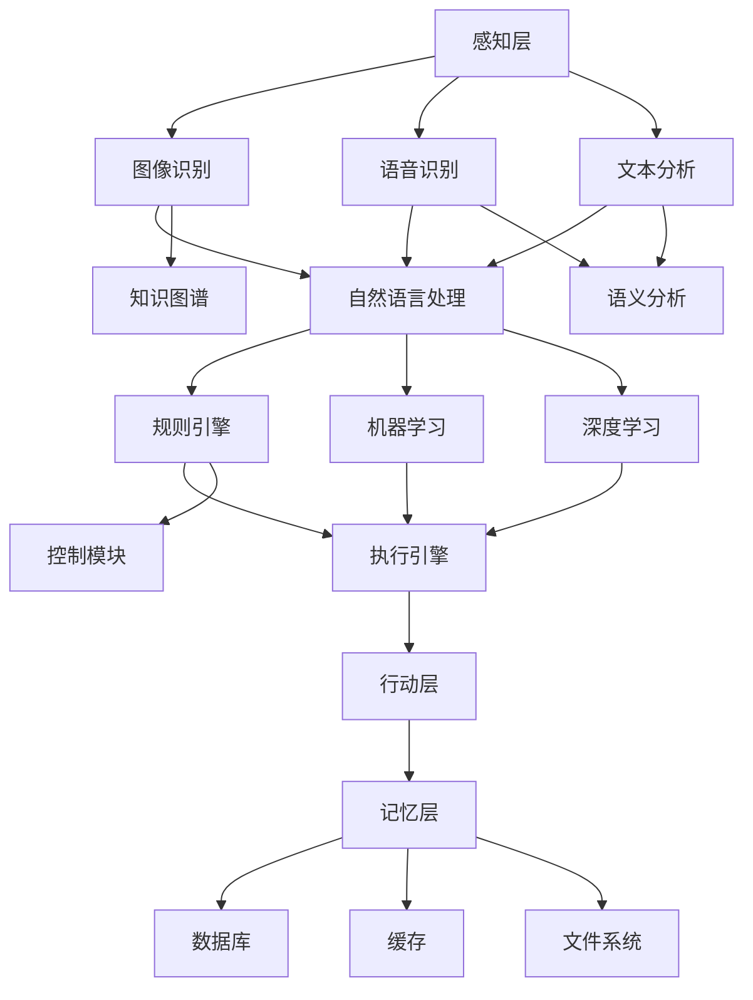

                 

## 《认知架构inspired AI系统设计原则》

### 关键词：认知架构、AI系统设计、设计原则、用户体验、人机交互

### 摘要

本文旨在探讨认知架构在人工智能系统设计中的重要性，提出一系列设计原则，旨在解决传统AI系统设计中存在的问题。通过详细分析认知架构的核心概念、系统设计流程、实现技术和实际应用案例，本文为开发高效、智能、用户体验友好的AI系统提供了切实可行的指导。

## 引言与背景

### 1. 引言

人工智能（AI）的发展已经跨越了多个阶段，从早期的规则基系统到基于数据的学习模型，再到现在的认知架构。认知架构作为一个新兴的概念，在AI系统设计中扮演着越来越重要的角色。本文将深入探讨认知架构的基本概念、设计原则以及其在AI系统中的应用。

### 2. 背景

人工智能的兴起可以追溯到20世纪50年代，但随着时间的推移，传统AI系统设计面临着诸多挑战。首先，传统AI系统依赖于大量手动编写的规则和假设，难以应对复杂、动态的环境。其次，用户对AI系统的期望越来越高，要求系统能够提供更加自然、直观的交互体验。认知架构的出现，为解决这些问题提供了新的思路。

### 问题与挑战

传统AI系统设计的问题主要体现在以下几个方面：

1. **规则依赖性强**：传统AI系统依赖于大量的手工编写的规则，难以适应复杂环境的变化。
2. **用户体验不佳**：传统AI系统往往缺乏对用户需求的理解，导致用户体验不佳。
3. **数据依赖性高**：传统AI系统对训练数据的质量和数量有很高的要求，数据不足或质量差会导致系统性能下降。
4. **可解释性不足**：传统AI系统往往是一个“黑盒子”，其内部决策过程难以解释，这限制了其在某些领域（如医疗、金融）中的应用。

认知架构作为一种新的设计理念，旨在通过模拟人脑的工作方式，解决传统AI系统设计中的上述问题。认知架构将AI系统分解为多个模块，每个模块负责特定的认知功能，如感知、理解、决策等。这种模块化设计使得系统能够更好地适应复杂环境，并提供更加自然、直观的用户体验。

## 基本概念与原理

### 3.1 认知架构的定义

认知架构是指一种模拟人脑工作方式的计算模型，它通过将认知功能划分为多个模块，实现复杂问题的求解。认知架构的核心在于模块之间的交互和协作，从而实现高效的认知过程。

### 3.2 认知架构的核心组件

认知架构通常包含以下核心组件：

1. **感知模块**：负责接收和处理外部环境的信息。
2. **理解模块**：负责对感知到的信息进行理解和解释。
3. **决策模块**：负责基于理解的结果做出决策。
4. **行动模块**：负责执行决策，产生实际的行为。
5. **记忆模块**：负责存储和检索系统运行过程中的信息。

### 3.3 认知架构的工作原理

认知架构的工作原理可以概括为以下几个步骤：

1. **感知**：系统通过传感器或其他方式获取外部信息。
2. **理解**：系统对感知到的信息进行分析和解释，形成对环境的理解。
3. **决策**：系统根据理解的结果做出决策。
4. **行动**：系统执行决策，产生实际的行为。
5. **记忆**：系统将行动的结果和经验存储在记忆模块中，以便后续使用。

通过这种方式，认知架构能够实现高效、灵活的决策过程，从而在复杂环境中表现出良好的适应性和鲁棒性。

## 设计原则

### 4.1 系统灵活性

认知架构的一个关键特点是系统的灵活性。传统AI系统设计往往依赖于固定的规则和模型，而认知架构通过模块化设计，使得系统能够根据不同环境自适应地调整和优化。这种灵活性使得认知架构能够更好地应对复杂、动态的环境。

### 4.2 用户中心设计

在认知架构中，用户始终是设计的核心。系统设计应该以用户需求为导向，通过自然语言处理、语音识别等技术，提供更加自然、直观的用户交互体验。此外，系统应该具备一定的自我学习和适应能力，以更好地满足用户的个性化需求。

### 4.3 数据驱动设计

数据是认知架构的基础。系统设计应该充分利用数据，通过数据分析和挖掘，发现用户行为模式、环境特征等，从而优化系统性能和用户体验。同时，系统设计应该具备良好的数据管理能力，确保数据的完整性和安全性。

### 4.4 系统可解释性

认知架构的一个重要优势是其可解释性。与传统的“黑盒子”模型相比，认知架构通过模块化设计，使得系统的决策过程更加透明、可解释。这有助于提升系统的信任度，特别是在涉及关键决策的领域（如医疗、金融）。

### 4.5 模块化设计

认知架构的模块化设计使得系统能够灵活扩展和升级。系统设计应该遵循模块化原则，将不同功能划分为独立的模块，以便于后续的维护和优化。同时，模块之间应该具备良好的接口和协作机制，以确保系统的整体性能。

## 系统设计流程

### 5.1 设计流程概述

认知架构AI系统的设计流程可以分为以下几个阶段：

1. **需求分析**：明确系统目标、用户需求和功能要求。
2. **架构设计**：确定系统的整体架构，包括模块划分、接口设计等。
3. **模块实现**：实现各个模块的功能，并进行集成和测试。
4. **优化与调试**：对系统进行性能优化和调试，确保系统稳定可靠。
5. **部署与维护**：将系统部署到实际环境中，并进行持续维护和优化。

### 5.2 需求分析

需求分析是系统设计的起点，其关键在于明确系统目标、用户需求和功能要求。在认知架构AI系统中，需求分析应特别关注以下几个方面：

1. **用户需求**：深入了解用户的需求和行为模式，为系统设计提供基础。
2. **功能要求**：明确系统应具备的功能，如感知、理解、决策、行动等。
3. **性能要求**：确定系统在处理速度、响应时间、准确性等方面的要求。
4. **安全性要求**：确保系统在数据传输、存储和处理过程中具备良好的安全性。

### 5.3 架构设计

架构设计是系统设计的核心环节，其目标是为系统提供清晰的模块划分和接口设计。在认知架构AI系统中，架构设计应遵循以下原则：

1. **模块化设计**：将系统功能划分为多个独立模块，以便于后续的维护和优化。
2. **接口设计**：确保模块之间的接口清晰、稳定，便于模块的替换和扩展。
3. **层次化设计**：将系统划分为多个层次，如感知层、理解层、决策层等，以便于不同层次之间的协作。
4. **可扩展性设计**：为系统预留扩展接口，以便于未来功能的增加和升级。

### 5.4 模块实现

模块实现是系统设计的具体实施阶段，其关键在于实现各个模块的功能，并进行集成和测试。在认知架构AI系统中，模块实现应关注以下几个方面：

1. **功能实现**：根据架构设计，实现各个模块的具体功能。
2. **接口实现**：根据接口设计，实现模块之间的接口，确保模块之间的协作。
3. **性能优化**：对模块进行性能优化，确保系统整体性能。
4. **测试与调试**：对模块进行功能测试、性能测试和调试，确保模块的正确性和稳定性。

### 5.5 优化与调试

优化与调试是系统设计的重要环节，其目标是通过性能优化和调试，确保系统稳定可靠。在认知架构AI系统中，优化与调试应关注以下几个方面：

1. **性能优化**：通过算法优化、代码优化等方式，提升系统性能。
2. **内存管理**：合理分配和管理系统内存，防止内存泄露和崩溃。
3. **稳定性调试**：通过调试工具和测试环境，发现并解决系统稳定性问题。
4. **安全性测试**：对系统进行安全性测试，确保系统的安全性和可靠性。

### 5.6 部署与维护

系统部署是将系统部署到实际环境中，并进行持续维护和优化。在认知架构AI系统中，部署与维护应关注以下几个方面：

1. **部署策略**：制定合理的部署策略，确保系统快速、稳定地部署到生产环境。
2. **运维管理**：建立运维团队，负责系统的日常运维和管理。
3. **更新与升级**：定期对系统进行更新和升级，确保系统功能的完善和性能的提升。
4. **监控与优化**：通过监控工具和手段，实时监控系统性能，发现并解决潜在问题。

## 系统架构设计

### 6.1 系统架构概述

认知架构AI系统的整体架构可以分为以下几个层次：

1. **感知层**：负责接收和处理外部信息，如图像、声音、文本等。
2. **理解层**：负责对感知层的信息进行分析和解释，形成对环境的理解。
3. **决策层**：负责基于理解的结果做出决策。
4. **行动层**：负责执行决策，产生实际的行为。
5. **记忆层**：负责存储和检索系统运行过程中的信息。

### 6.2 模块化架构设计

在认知架构AI系统中，模块化架构设计是实现系统灵活性和可扩展性的关键。以下是系统架构的具体模块化设计：

1. **感知模块**：包括图像识别、语音识别、文本分析等模块，负责接收和处理外部信息。
2. **理解模块**：包括自然语言处理、知识图谱、语义分析等模块，负责对感知层的信息进行分析和解释。
3. **决策模块**：包括规则引擎、机器学习、深度学习等模块，负责基于理解的结果做出决策。
4. **行动模块**：包括执行引擎、控制模块等，负责执行决策，产生实际的行为。
5. **记忆模块**：包括数据库、缓存、文件系统等模块，负责存储和检索系统运行过程中的信息。

### 6.3 Mermaid架构图

以下是一个简单的Mermaid架构图，展示了认知架构AI系统的模块化架构设计：

通过这个架构图，我们可以清晰地看到各个模块之间的交互关系和整体架构的设计。

## 实现技术

### 7.1 数据准备

数据准备是认知架构AI系统实现的重要环节，其关键在于数据的收集、处理和存储。以下是一些数据准备的关键技术和方法：

1. **数据收集**：通过传感器、网络爬虫、用户反馈等多种途径收集数据。
2. **数据清洗**：去除数据中的噪声和异常值，保证数据质量。
3. **数据标注**：对数据进行人工标注，以供模型训练。
4. **数据转换**：将数据转换为适合模型训练的格式。
5. **数据存储**：选择合适的数据存储方案，如关系型数据库、NoSQL数据库等。

### 7.2 模型开发

模型开发是认知架构AI系统实现的核心环节，其关键在于选择合适的算法和模型，并进行训练和优化。以下是一些模型开发的关键技术和方法：

1. **算法选择**：根据应用场景和需求，选择合适的算法和模型，如深度学习、强化学习等。
2. **模型训练**：使用训练数据对模型进行训练，优化模型参数。
3. **模型评估**：通过测试数据评估模型性能，调整模型参数。
4. **模型优化**：使用优化算法和技巧提升模型性能，如正则化、dropout等。
5. **模型部署**：将训练好的模型部署到实际环境中，供用户使用。

### 7.3 模型训练与优化

模型训练与优化是认知架构AI系统实现的重要环节，其关键在于如何高效地训练模型，并优化模型性能。以下是一些模型训练与优化的关键技术和方法：

1. **梯度下降算法**：用于训练模型，通过迭代优化模型参数。
2. **激活函数**：用于增加模型的非线性，提高模型的表达能力。
3. **正则化**：用于防止模型过拟合，提高模型的泛化能力。
4. **dropout**：用于防止模型过拟合，通过随机丢弃部分神经元来实现。
5. **优化器**：用于加速模型训练，如Adam优化器等。
6. **模型剪枝**：通过删除冗余的神经元和连接，减小模型规模，提高模型效率。
7. **迁移学习**：通过将预训练模型应用于新任务，提高模型性能。

### 7.4 训练和优化挑战及解决方案

在模型训练和优化过程中，会遇到一些挑战，如数据不足、模型过拟合、计算资源限制等。以下是一些常见挑战及解决方案：

1. **数据不足**：可以通过数据增强、迁移学习等方法来扩充数据集。
2. **模型过拟合**：可以通过正则化、dropout、早期停止等方法来防止过拟合。
3. **计算资源限制**：可以通过分布式训练、使用轻量级模型等方法来降低计算资源需求。
4. **模型解释性**：可以通过可视化、模型可解释性技术等方法来提高模型的解释性。
5. **模型部署**：可以通过模型压缩、模型裁剪等方法来降低模型部署的难度。

## 案例研究

### 8.1 案例研究概述

在本节中，我们将通过两个具体的案例研究，深入探讨认知架构在AI系统设计中的应用和效果。

### 8.2 案例一：智能家居系统

智能家居系统是一个典型的认知架构AI应用案例。该系统通过感知层收集家庭环境中的各种数据（如温度、湿度、光照等），理解层对数据进行分析和解释，决策层根据分析结果做出调整决策，行动层执行决策（如调整温度、湿度等），记忆层存储系统运行过程中的数据，以便后续分析和优化。

具体来说，智能家居系统中的感知模块包括温度传感器、湿度传感器、光照传感器等；理解模块包括数据分析模块、自然语言处理模块等；决策模块包括规则引擎、机器学习模块等；行动模块包括执行引擎、控制模块等；记忆模块包括数据库、缓存等。

通过认知架构的设计，智能家居系统实现了高效、智能、个性化的家居环境管理，用户可以根据自己的需求和习惯进行个性化设置，系统会自动调整环境参数，提供舒适、健康的居住环境。

### 8.3 案例二：智能客服系统

智能客服系统是另一个典型的认知架构AI应用案例。该系统通过感知层收集用户咨询的问题和相关信息，理解层对问题进行分析和解释，决策层根据分析结果提供合适的解决方案，行动层执行解决方案，记忆层存储系统运行过程中的数据，以便后续分析和优化。

具体来说，智能客服系统中的感知模块包括语音识别、自然语言处理模块等；理解模块包括语义分析、知识图谱模块等；决策模块包括规则引擎、机器学习模块等；行动模块包括回答生成、执行引擎等；记忆模块包括数据库、缓存等。

通过认知架构的设计，智能客服系统实现了高效、准确、自然的用户服务，用户可以轻松地通过语音或文本与系统进行交互，系统会根据用户的问题和需求提供个性化的解决方案，提升用户满意度和体验。

## 最佳实践

### 9.1 最佳实践总结

在认知架构AI系统设计中，以下最佳实践值得借鉴：

1. **需求分析**：深入分析用户需求和功能要求，确保系统设计符合实际需求。
2. **模块化设计**：遵循模块化原则，将系统划分为多个独立模块，提高系统的可维护性和可扩展性。
3. **用户中心设计**：以用户需求为导向，提供自然、直观的用户交互体验。
4. **数据驱动设计**：充分利用数据，提升系统的性能和用户体验。
5. **系统可解释性**：提高系统的可解释性，增强系统的信任度和可靠性。

### 9.2 注意事项

在认知架构AI系统设计过程中，需要注意以下几点：

1. **数据质量**：确保数据质量，避免数据噪声和异常值对系统性能的影响。
2. **模块接口**：设计清晰的模块接口，确保模块之间的协作和互操作。
3. **性能优化**：对系统进行性能优化，提高系统的响应速度和处理能力。
4. **安全性**：确保系统的安全性，防止数据泄露和恶意攻击。

### 9.3 拓展阅读

对于希望深入了解认知架构和AI系统设计的读者，以下推荐几本经典书籍和论文：

1. 《认知架构：人工智能的新范式》
2. 《深度学习：高级动态系统设计》
3. 《人工智能：一种现代方法》
4. 《机器学习：概率视角》
5. “Cognitive Architectures for Human-like AI”论文
6. “Cognitive AI: From Research to Application”论文

## 结语

认知架构作为一种新的AI系统设计理念，具有广泛的应用前景和重要的研究价值。通过本文的探讨，我们明确了认知架构的核心概念、设计原则、实现技术和应用案例，为认知架构AI系统设计提供了切实可行的指导。未来，随着人工智能技术的不断发展和完善，认知架构有望在更多的领域发挥重要作用，推动人工智能与人类生活的深度融合。作者：AI天才研究院/AI Genius Institute & 禅与计算机程序设计艺术 /Zen And The Art of Computer Programming

