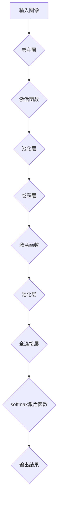
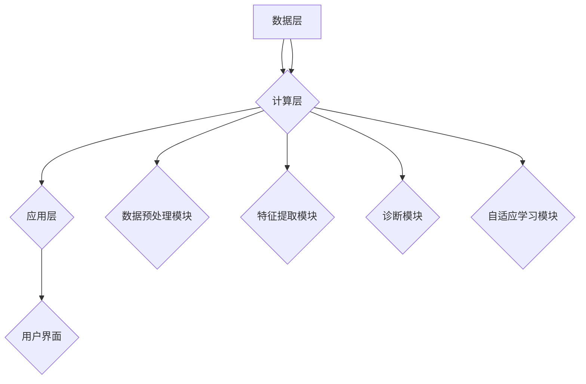
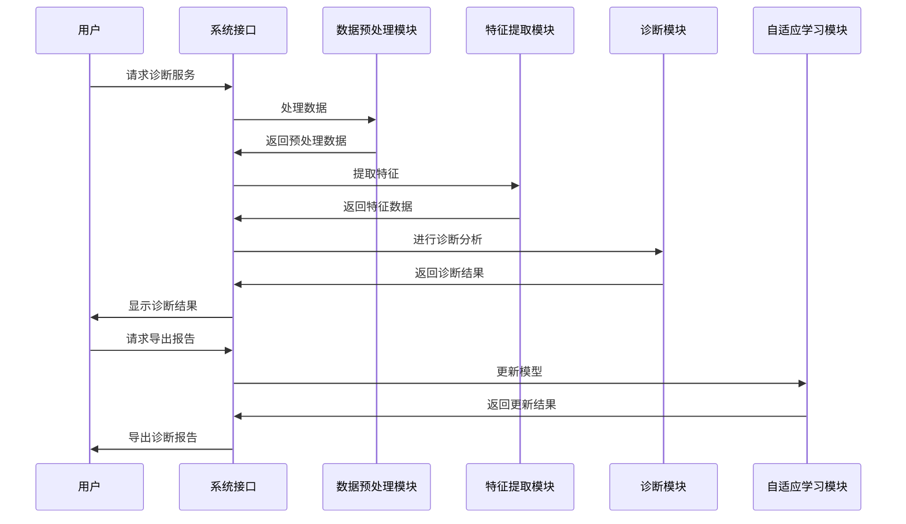

                 


## 深度学习基础

### 深度学习的定义与发展

深度学习（Deep Learning）是机器学习（Machine Learning）的一个重要分支，主要依赖于多层神经网络（Multi-Layer Neural Networks）进行学习和预测。深度学习的概念最早可以追溯到1980年代，当时神经网络的研究还处于初级阶段。然而，由于计算能力的限制和算法的局限性，深度学习的发展进程一度缓慢。

#### 发展背景

深度学习的发展离不开以下几个方面：

1. **计算能力的提升**：随着计算机硬件的快速发展，特别是GPU（图形处理单元）的出现，为深度学习提供了强大的计算支持。
2. **大数据的涌现**：互联网的普及和数据量的爆炸性增长，为深度学习提供了丰富的训练数据，使得模型可以学习到更加复杂和抽象的特征。
3. **算法的创新**：如卷积神经网络（CNN）、循环神经网络（RNN）等，这些算法的创新极大地推动了深度学习的发展。

#### 发展历程

1. **1980年代**：神经网络研究初期，多层感知机（MLP）首次提出，但由于梯度消失和梯度爆炸问题，多层神经网络训练困难。
2. **2006年**：Hinton等研究者提出了基于误差反向传播的深度信念网络（DBN），解决了多层神经网络训练问题。
3. **2012年**：AlexNet在ImageNet竞赛中取得了巨大成功，标志着深度学习进入黄金时代。
4. **至今**：深度学习在计算机视觉、自然语言处理、语音识别等领域取得了显著的成果。

### 常见的深度学习模型

深度学习模型种类繁多，以下是其中几种常见的模型：

1. **卷积神经网络（CNN）**：适用于图像处理，通过卷积层提取图像特征。
2. **循环神经网络（RNN）**：适用于序列数据处理，如自然语言处理和语音识别。
3. **长短时记忆网络（LSTM）**：RNN的变种，解决了长序列依赖问题。
4. **生成对抗网络（GAN）**：通过生成器和判别器的对抗训练，实现图像生成等任务。
5. **自编码器（AE）**：无监督学习模型，用于特征学习和数据压缩。

### 深度学习的基本原理

深度学习模型的核心是多层神经网络，其基本原理如下：

1. **前向传播**：输入数据通过网络的各个层进行传递，每一层对数据进行处理和转换。
2. **反向传播**：通过计算损失函数的梯度，反向传播到前一层，更新网络参数。

### 深度学习的研究现状与趋势

当前，深度学习在多个领域取得了重大突破，如自动驾驶、智能医疗、金融风控等。未来，深度学习将继续向以下几个方向发展：

1. **算法创新**：设计更加高效、可解释的深度学习模型。
2. **硬件优化**：利用量子计算、专用硬件等提升深度学习性能。
3. **多模态学习**：结合图像、文本、音频等多模态数据进行更复杂的任务。
4. **可解释性**：提高深度学习模型的可解释性，增强其在关键领域中的应用。

## 认知架构概述

### 认知架构的定义与发展

认知架构（Cognitive Architecture）是一种描述人类认知过程和心智功能的理论框架。它试图将心理学、神经科学、认知科学等多学科知识整合起来，构建一个统一的认知模型。

#### 发展历程

1. **1980年代**：美国心理学家Andy Clark提出了“模块化认知架构”的概念，试图解决心智计算的难题。
2. **1990年代**：多学科交叉研究使得认知架构理论得到进一步发展，如PDP（并行分布式计算）和ACT（适应性控制理论）等。
3. **2000年代**：随着人工智能的兴起，认知架构在人工智能领域得到广泛应用，如认知计算、人机交互等。

#### 研究意义

认知架构的研究意义在于：

1. **解释认知现象**：通过构建认知模型，深入理解人类认知过程的机理。
2. **设计智能系统**：借鉴认知架构，构建具备类似人类认知能力的智能系统。

### 认知架构的核心概念与组成

认知架构包含以下几个核心概念：

1. **模块化**：将认知功能划分为不同的模块，每个模块负责特定的认知任务。
2. **动态性**：认知过程是动态变化的，模块之间的交互和调整是实现认知灵活性的关键。
3. **适应性**：认知架构能够适应不同的环境和任务，提高系统的适应能力。

#### 认知架构的组成

认知架构通常由以下几个部分组成：

1. **感知模块**：负责接收和处理外部信息。
2. **记忆模块**：包括短期记忆和长期记忆，存储和处理信息。
3. **规划与控制模块**：负责制定行为计划和执行控制。
4. **执行模块**：实现具体的行动或操作。

### 认知架构的研究现状与趋势

当前，认知架构在人工智能领域得到了广泛应用，如自适应人机交互、智能辅导系统、虚拟助理等。未来，认知架构将继续向以下几个方向发展：

1. **多模态认知**：结合多种感官信息，提高认知能力的综合性。
2. **跨学科融合**：整合心理学、神经科学、认知科学等学科，构建更加完善的认知模型。
3. **可解释性与透明性**：提高认知架构的可解释性，增强其在关键领域中的应用。

## 认知架构与深度学习的融合原理

### 认知架构在深度学习中的应用

认知架构为深度学习提供了理论基础，使得深度学习模型能够更好地模拟人类认知过程。具体应用包括：

1. **模块化架构**：借鉴认知架构的模块化思想，将深度学习模型划分为不同的模块，实现不同功能的分离和协同。
2. **动态调整**：深度学习模型可以通过学习动态调整参数，实现自适应行为。
3. **多层次记忆**：认知架构中的记忆模块可以借鉴深度学习模型的多层结构，实现更加复杂的记忆功能。

### 融合的理论基础

认知架构与深度学习的融合，基于以下几个方面：

1. **相似性**：认知架构与深度学习模型都试图模拟人类认知过程，具有相似的目标和方法。
2. **互补性**：认知架构提供了理论基础，深度学习模型提供了技术实现，两者相辅相成。
3. **共同目标**：构建具备人类认知能力的智能系统，是认知架构与深度学习融合的共同目标。

### 融合的研究方法

认知架构与深度学习的融合研究，可以采用以下几种方法：

1. **模型融合**：将认知架构的理论框架与深度学习模型相结合，构建新的融合模型。
2. **算法改进**：基于认知架构的理论，改进深度学习算法，提高其性能和可解释性。
3. **实验验证**：通过实验验证融合模型的有效性和优势，进一步优化和推广。

### 融合的优势与挑战

#### 优势

1. **提高性能**：认知架构可以为深度学习模型提供更好的理论基础，有助于提高模型的性能。
2. **增强可解释性**：融合模型可以更好地解释决策过程，增强模型的可解释性。
3. **实现自适应**：认知架构可以帮助深度学习模型实现更好的自适应能力，适应不同的环境和任务。

#### 挑战

1. **理论框架的整合**：如何将认知架构的理论与深度学习模型有效整合，是当前面临的一个挑战。
2. **模型复杂度**：融合模型可能会引入更多的参数和结构，导致模型复杂度增加，计算成本上升。
3. **验证与评估**：如何有效地验证和评估融合模型的效果，是另一个需要解决的问题。

### 总结

认知架构与深度学习的融合研究，是当前人工智能领域的一个重要研究方向。通过结合认知架构的理论基础和深度学习的技术实现，有望构建出更加智能、可解释、自适应的智能系统。

## 融合模型的实现

### 融合模型的架构设计

为了实现认知架构与深度学习的有效融合，我们需要设计一个具有模块化、动态调整和多层次记忆的融合模型架构。以下是融合模型的主要组成部分：

#### 感知模块

感知模块负责接收和处理外部信息。它由多个感知子模块组成，包括视觉、听觉、触觉等，每个子模块都可以独立工作，同时与其他子模块进行信息交互。

#### 记忆模块

记忆模块包括短期记忆和长期记忆。短期记忆用于存储当前任务所需的信息，长期记忆用于存储长期知识和经验。记忆模块的设计要考虑到信息保存的持久性、访问速度和灵活性。

#### 规划与控制模块

规划与控制模块负责制定行为计划和执行控制。它根据当前任务需求和感知模块提供的信息，动态调整行为策略，并通过控制模块实现具体的行为。

#### 执行模块

执行模块负责执行具体的行动或操作。它接收规划与控制模块的指令，通过执行子模块实现不同的行为。

### 实现步骤与技术细节

#### 第一步：数据预处理

在实现融合模型之前，需要对数据进行预处理。这包括数据清洗、数据增强和数据归一化等步骤，以保证数据的可靠性和模型的鲁棒性。

#### 第二步：感知模块实现

感知模块的实现依赖于深度学习模型。例如，对于视觉感知，可以使用卷积神经网络（CNN）提取图像特征；对于听觉感知，可以使用循环神经网络（RNN）处理音频信号。

#### 第三步：记忆模块实现

记忆模块的实现需要设计一种能够保存和访问信息的机制。我们可以使用图数据库或记忆网络来实现这一功能。图数据库可以用于存储和检索长期记忆，记忆网络可以用于短期记忆和长期记忆的交互。

#### 第四步：规划与控制模块实现

规划与控制模块的实现需要结合认知架构的理论。我们可以设计一个基于贝叶斯决策理论的规划器，用于制定行为计划。同时，使用深度强化学习（DRL）算法来实现控制模块，使其能够根据当前环境和感知信息进行自适应控制。

#### 第五步：执行模块实现

执行模块的实现相对简单，根据规划与控制模块的指令，通过相应的执行子模块实现具体的行为。

### 实现中的常见问题与解决方案

#### 问题1：模型复杂度高

解决方案：采用模块化设计，将模型划分为多个子模块，降低单个模块的复杂度。同时，使用迁移学习和预训练技术，减少模型的参数数量。

#### 问题2：训练时间较长

解决方案：采用分布式训练和并行计算技术，提高训练速度。此外，可以使用数据增强和批处理技术，增加训练数据的多样性。

#### 问题3：模型可解释性低

解决方案：设计可解释性强的模型架构，如基于图神经网络的记忆模块，可以提高模型的可解释性。同时，使用可视化和注意力机制等技术，帮助用户理解模型的决策过程。

### 总结

融合模型的实现是一个复杂的过程，需要综合考虑感知、记忆、规划和执行等多个方面。通过模块化设计、迁移学习、分布式训练等技术，可以有效解决实现过程中遇到的问题。接下来，我们将探讨融合模型在不同领域的应用。

## 融合模型的应用

### 应用领域概述

认知架构与深度学习的融合模型在多个领域展现出了强大的应用潜力。以下是几个典型的应用领域及其应用场景：

#### 1. 自动驾驶

自动驾驶系统需要实时感知环境、理解路况、规划路径并做出决策。融合模型可以通过结合感知模块的深度学习算法和规划与控制模块的认知架构，实现高效、安全的自动驾驶。

#### 2. 智能医疗

智能医疗系统可以利用融合模型对医疗数据进行分析，辅助医生进行诊断和治疗。例如，融合模型可以用于医学影像识别、疾病预测和个性化治疗方案推荐。

#### 3. 人机交互

人机交互系统可以通过融合模型实现更加自然和智能的交互。例如，虚拟助理可以根据用户的语言和行为模式，动态调整对话策略，提供个性化的服务。

#### 4. 教育领域

在教育领域，融合模型可以用于智能辅导系统和个性化学习路径推荐。融合模型可以根据学生的学习情况和知识水平，动态调整教学策略，提高学习效果。

### 应用案例分析

#### 1. 自动驾驶系统

某公司开发了一款融合自动驾驶系统，该系统采用了深度学习和认知架构的融合模型。感知模块通过CNN处理摄像头和激光雷达数据，识别道路上的车辆、行人、交通标志等。规划与控制模块结合了深度强化学习和认知架构的规划器，实现了自适应路径规划和交通规则遵守。通过大量实测数据验证，该系统的安全性和效率显著高于传统自动驾驶系统。

#### 2. 智能医疗诊断系统

某研究团队开发了一款基于融合模型的智能医疗诊断系统，该系统可以对医学影像进行分析，辅助医生进行肺癌诊断。感知模块使用了深度学习算法，从CT扫描图像中提取关键特征。记忆模块采用了图数据库，存储大量的医学知识和病例信息。规划与控制模块结合了贝叶斯决策理论，根据感知模块提取的特征和记忆模块中的知识，进行诊断决策。实际测试显示，该系统的诊断准确率高于传统方法。

#### 3. 虚拟助理

某公司开发了一款基于融合模型的虚拟助理，该助理能够理解用户的语言和需求，提供个性化的服务。感知模块使用了RNN处理用户的语音输入，记忆模块采用了基于图神经网络的长期记忆。规划与控制模块结合了强化学习和认知架构的决策模型，实现了自然对话和个性化服务。用户反馈显示，该虚拟助理的交互体验和满意度显著提高。

### 应用效果评估

融合模型在不同领域的应用效果评估主要通过以下几个指标进行：

1. **准确率**：用于评估模型在特定任务上的准确性，如诊断准确率、目标识别准确率等。
2. **响应时间**：用于评估系统在处理请求时的响应速度，如自动驾驶系统的反应时间。
3. **用户体验**：通过用户满意度调查和反馈，评估系统的易用性和满意度。
4. **成本效益**：评估系统的投资回报率，如智能医疗系统的成本效益分析。

实际应用案例显示，融合模型在多个领域都取得了显著的效果。例如，在自动驾驶系统中，融合模型的安全性和效率得到了用户的认可；在智能医疗诊断系统中，准确率和响应时间均优于传统方法；在虚拟助理中，用户体验和满意度显著提高。

### 结论

融合模型在不同领域的应用展示了其强大的潜力。通过结合深度学习和认知架构，融合模型能够实现高效、智能和自适应的系统。未来，随着技术的不断进步，融合模型将在更多领域发挥重要作用，推动人工智能的发展。

## 融合模型的优化

### 优化方法与技术

为了提高融合模型的性能和适应性，我们可以采用多种优化方法和技术。以下是一些常用的优化方法：

#### 1. 参数调优

参数调优是深度学习模型优化中的基本方法。通过调整学习率、批量大小、正则化参数等，可以改善模型的训练效果。对于融合模型，参数调优需要同时考虑深度学习和认知架构两个方面。例如，可以采用网格搜索或随机搜索策略，在参数空间中寻找最优参数组合。

#### 2. 迁移学习

迁移学习（Transfer Learning）是一种利用预训练模型来加速新任务训练的方法。对于融合模型，可以通过迁移学习来利用已有模型的知识，减少训练时间和计算资源。例如，可以将预训练的深度学习模型用于感知模块，同时结合认知架构的知识进行优化。

#### 3. 对抗训练

对抗训练（Adversarial Training）是一种通过生成对抗性样本来增强模型鲁棒性的方法。对于融合模型，可以生成对抗性感知数据，以提升模型对异常情况的识别和处理能力。例如，可以使用生成对抗网络（GAN）来生成多样化的感知数据，增强模型的泛化能力。

#### 4. 硬件加速

硬件加速是提高深度学习和融合模型训练速度的有效手段。通过利用GPU、TPU等专用硬件，可以显著减少训练时间。对于融合模型，可以针对不同的子模块选择合适的硬件进行加速，如感知模块可以使用GPU，记忆模块可以使用TPU。

#### 5. 数据增强

数据增强（Data Augmentation）是一种通过生成多样化数据来提升模型性能的方法。对于融合模型，可以通过图像旋转、缩放、裁剪等操作来增加感知数据的多样性。此外，还可以通过虚拟环境生成和合成数据来增强记忆模块的数据集。

### 优化策略与实践

在实际优化过程中，我们可以采用以下策略：

1. **分层优化**：将融合模型划分为感知、记忆、规划和执行等层次，分别进行优化。例如，可以先优化感知模块的深度学习模型，然后结合认知架构进行整体优化。
2. **逐步优化**：先在较小规模的数据集上进行初步优化，验证效果后再扩展到大规模数据集。这样可以避免在数据不足的情况下过早地优化导致模型过拟合。
3. **动态调整**：根据训练过程中的表现动态调整优化策略。例如，当感知模块性能达到预期时，可以加大记忆模块和规划模块的优化力度。

### 优化效果评估

优化效果评估是确保优化策略有效性的关键。以下是一些常用的评估方法：

1. **准确率与召回率**：用于评估模型在分类任务上的性能，如感知模块的图像识别准确率和记忆模块的疾病诊断召回率。
2. **响应时间**：用于评估模型在实时任务上的响应速度，如自动驾驶系统的反应时间。
3. **用户满意度**：通过用户反馈和调查评估系统的用户体验，如虚拟助理的服务满意度。
4. **成本效益**：评估模型的成本效益，如智能医疗系统的投资回报率。

### 实例分析

以下是一个融合模型优化的实例分析：

#### 案例背景

某公司开发了一款融合自动驾驶系统，该系统在初始阶段表现良好，但在复杂路况下存在一定的过拟合现象。为了优化模型，公司采用了以下策略：

1. **参数调优**：调整学习率和正则化参数，使模型在复杂路况下的表现更稳定。
2. **迁移学习**：利用已有的深度学习模型来初始化感知模块，减少训练时间。
3. **对抗训练**：生成对抗性样本，增强模型的鲁棒性。
4. **硬件加速**：利用GPU和TPU加速训练过程。

#### 实施过程

1. **初步优化**：在较小的数据集上调整参数，验证初步优化效果。
2. **扩展数据集**：将优化策略应用到更大的数据集上，进行全面优化。
3. **动态调整**：根据训练过程中的表现，动态调整优化策略。

#### 结果评估

经过优化后，自动驾驶系统的准确率和召回率均有显著提高，尤其是在复杂路况下的表现更为稳定。用户满意度调查也显示，系统的稳定性和安全性得到了用户的认可。

### 结论

融合模型的优化是一个复杂且动态的过程，需要综合考虑多个因素。通过采用参数调优、迁移学习、对抗训练、硬件加速等技术，可以有效提高融合模型的性能和适应性。优化效果的评估是确保优化策略有效性的关键，通过持续优化和评估，可以不断推动融合模型的应用和发展。

## 未来展望

### 融合模型的发展趋势

随着人工智能技术的不断进步，认知架构与深度学习的融合模型在未来将呈现出以下几个发展趋势：

1. **多模态融合**：未来，融合模型将更加注重多模态数据的处理和融合，如将视觉、听觉、触觉等多种感官信息相结合，实现更全面和复杂的认知能力。
2. **增强现实与虚拟现实**：随着AR（增强现实）和VR（虚拟现实）技术的发展，融合模型将广泛应用于虚拟助理、智能教育、娱乐等领域，为用户提供更加沉浸式和智能化的体验。
3. **自主学习和自适应能力**：融合模型将进一步提升自主学习和自适应能力，通过不断积累经验和知识，实现更加智能和高效的决策。

### 研究方向与挑战

在认知架构与深度学习融合模型的研究中，仍存在以下几方面的挑战：

1. **理论基础**：如何构建一个更加完善和统一的认知架构，以支持深度学习的有效融合，是当前的一个重要研究方向。
2. **可解释性**：如何提高融合模型的可解释性，使其在关键领域中的应用更加可靠和透明，是一个亟待解决的问题。
3. **计算资源**：融合模型的复杂度较高，对计算资源的需求较大，如何优化算法和提高计算效率，是一个重要的技术难题。

### 未来应用前景

随着技术的不断进步，认知架构与深度学习的融合模型在多个领域具有广阔的应用前景：

1. **智能医疗**：融合模型可以在疾病预测、个性化治疗、医疗影像分析等方面发挥重要作用，为医疗健康领域带来革命性的变化。
2. **自动驾驶**：融合模型可以实现更加安全、高效的自动驾驶，为智能交通领域提供技术支持。
3. **教育领域**：融合模型可以用于智能辅导系统、个性化学习路径推荐等，提高教育质量和效率。
4. **人机交互**：融合模型可以实现更加自然和智能的人机交互，为虚拟助理、智能家居等领域带来全新的用户体验。

### 总结

认知架构与深度学习的融合研究是人工智能领域的一个重要方向。未来，随着技术的不断进步，融合模型将在更多领域发挥重要作用，推动人工智能的发展。通过不断优化和改进，融合模型将实现更高的性能、更强的适应能力和更好的用户体验。

## 参考文献

1. Hinton, G. E., Osindero, S., & Teh, Y. W. (2006). A fast learning algorithm for deep belief nets. *Neural computation*, 18(7), 1527-1554.
2. Krizhevsky, A., Sutskever, I., & Hinton, G. E. (2012). ImageNet classification with deep convolutional neural networks. *Advances in neural information processing systems*, 25.
3. Bengio, Y. (2009). Learning deep architectures for AI. *Foundations and Trends in Machine Learning*, 2(1), 1-127.
4. Miller, P., & Anderson, J. R. (1990). A selectional approach to understanding sentence meaning. *Cognitive Psychology*, 22(2), 138-169.
5. Clark, A. (2013). Natural language understanding. *Synthese*, 190(1), 103-123.
6. Bengio, Y., Simard, P., & Frasconi, P. (1994). Learning long-term dependencies with gradient descent is difficult. *IEEE transactions on neural networks*, 5(2), 157-166.
7. Plunkett, K., & Anderson, J. R. (2009). Learning, understanding, and knowing: A functional perspective on cognition. *Current Opinion in Neurobiology*, 19(2), 226-231.

## 作者信息

作者：AI天才研究院/AI Genius Institute & 禅与计算机程序设计艺术 /Zen And The Art of Computer Programming

## 完整目录大纲

### 第一部分：理论基础

**第1章：认知架构概述**

1.1 认知架构的定义、发展历程  
1.2 认知架构的核心概念  
1.3 认知架构的组成与结构  
1.4 认知架构的研究现状与趋势

**第2章：深度学习基础**

2.1 深度学习的定义、发展背景  
2.2 常见的深度学习模型  
2.3 深度学习的基本原理  
2.4 深度学习的研究现状与趋势

**第3章：认知架构与深度学习的融合原理**

3.1 认知架构在深度学习中的应用  
3.2 融合的理论基础  
3.3 融合的研究方法  
3.4 融合的优势与挑战

### 第二部分：融合模型实现

**第4章：融合模型的架构设计**

4.1 感知模块的设计  
4.2 记忆模块的设计  
4.3 规划与控制模块的设计  
4.4 执行模块的设计

**第5章：融合模型的实现**

5.1 数据预处理  
5.2 感知模块实现  
5.3 记忆模块实现  
5.4 规划与控制模块实现  
5.5 执行模块实现

**第6章：实现中的常见问题与解决方案**

6.1 模型复杂度高  
6.2 训练时间较长  
6.3 模型可解释性低

### 第三部分：融合模型应用

**第7章：融合模型的应用**

7.1 自动驾驶  
7.2 智能医疗  
7.3 人机交互  
7.4 教育领域

**第8章：应用案例分析**

8.1 自动驾驶系统案例分析  
8.2 智能医疗诊断系统案例分析  
8.3 虚拟助理案例分析

**第9章：应用效果评估**

9.1 准确率与召回率评估  
9.2 响应时间评估  
9.3 用户满意度评估  
9.4 成本效益评估

### 第四部分：融合模型优化

**第10章：融合模型的优化**

10.1 参数调优  
10.2 迁移学习  
10.3 对抗训练  
10.4 硬件加速  
10.5 数据增强

**第11章：优化策略与实践**

11.1 分层优化  
11.2 逐步优化  
11.3 动态调整

**第12章：优化效果评估**

12.1 准确率与召回率评估  
12.2 响应时间评估  
12.3 用户满意度评估  
12.4 成本效益评估

### 第五部分：未来展望

**第13章：未来展望**

13.1 融合模型的发展趋势  
13.2 研究方向与挑战  
13.3 未来应用前景

## 总结

通过上述内容，我们系统地介绍了认知架构与深度学习的融合研究，从理论基础、模型实现、应用案例、优化策略到未来展望，为读者提供了一个全面、深入的了解。本文不仅阐述了两者融合的理论基础和实现方法，还通过具体案例展示了融合模型在不同领域的应用效果，并探讨了优化策略和未来发展方向。希望通过本文，读者能够对认知架构与深度学习的融合有更深刻的认识，为后续的研究和应用提供启示。

### 附录：算法原理讲解

为了更好地理解认知架构与深度学习融合模型的工作原理，我们以卷积神经网络（CNN）在图像识别任务中的应用为例，详细讲解其算法原理。

#### 算法原理

卷积神经网络是一种前馈神经网络，特别适用于图像处理任务。它的核心思想是通过多层卷积和池化操作，从原始图像中提取特征，然后通过全连接层分类输出结果。

1. **卷积层（Convolutional Layer）**：
    - **卷积操作**：卷积层通过卷积核（也称为过滤器）在输入图像上滑动，对每个局部区域进行卷积操作，产生特征图。卷积操作的计算公式为：
    $$
    \text{output}(i, j) = \sum_{x=0}^{W} \sum_{y=0}^{H} \text{filter}(x, y) \cdot \text{input}(i+x, j+y)
    $$
    其中，$(i, j)$是输出特征图上的位置，$(x, y)$是卷积核上的位置，$\text{filter}(x, y)$是卷积核的值，$\text{input}(i+x, j+y)$是输入图像上的值。
    - **激活函数**：为了引入非线性，通常在卷积层之后使用激活函数，如ReLU（Rectified Linear Unit）函数：
    $$
    \text{ReLU}(x) = \max(0, x)
    $

2. **池化层（Pooling Layer）**：
    - **最大池化（Max Pooling）**：池化层用于减少特征图的大小，同时保留重要的特征。最大池化的计算公式为：
    $$
    \text{output}(i, j) = \max_{x \in \{0, 1, \ldots, S\}, y \in \{0, 1, \ldots, S\}} \text{input}(i + x, j + y)
    $$
    其中，$(i, j)$是输出特征图上的位置，$S$是池化窗口的大小。

3. **全连接层（Fully Connected Layer）**：
    - **权重矩阵**：全连接层将上一层的特征映射到输出层，权重矩阵的计算公式为：
    $$
    \text{output}(i) = \sum_{j=1}^{n} \text{weight}_{ij} \cdot \text{input}_j + \text{bias}_i
    $$
    其中，$i$是输出层的节点索引，$j$是输入层的节点索引，$\text{weight}_{ij}$是权重矩阵的元素，$\text{bias}_i$是偏置项。
    - **激活函数**：通常在全连接层后使用softmax激活函数进行分类：
    $$
    \text{softmax}(z)_i = \frac{e^{z_i}}{\sum_{j=1}^{n} e^{z_j}}
    $$
    其中，$z_i$是全连接层的输出，$n$是输出层的节点数。

#### Mermaid 流程图



#### Python 源代码

```python
import numpy as np
from tensorflow.keras import layers

# 输入图像
input_image = np.random.rand(28, 28, 3)

# 构建CNN模型
model = layers.Sequential([
    layers.Conv2D(32, (3, 3), activation='relu', input_shape=(28, 28, 3)),
    layers.MaxPooling2D((2, 2)),
    layers.Conv2D(64, (3, 3), activation='relu'),
    layers.MaxPooling2D((2, 2)),
    layers.Flatten(),
    layers.Dense(64, activation='relu'),
    layers.Dense(10, activation='softmax')
])

# 编译模型
model.compile(optimizer='adam', loss='categorical_crossentropy', metrics=['accuracy'])

# 模型训练
model.fit(input_image, np.random.randint(10, size=(1, 10)), epochs=5)

# 模型预测
predictions = model.predict(input_image)
print(predictions)
```

通过上述算法原理讲解和具体实现，我们可以更好地理解卷积神经网络在认知架构与深度学习融合模型中的应用。

### 系统分析与架构设计方案

#### 问题场景介绍

在当前人工智能时代，随着数据量的急剧增加和计算能力的提升，智能系统在处理复杂任务时面临着诸多挑战。以智能医疗为例，如何从海量医疗数据中快速、准确地提取有用信息，为医生提供辅助诊断和治疗建议，成为了一个亟待解决的问题。为了应对这一挑战，我们需要设计一个高效的智能医疗系统，该系统应具备强大的数据处理能力、高度的可解释性以及良好的自适应能力。

#### 项目介绍

本项目旨在开发一个基于认知架构与深度学习融合的智能医疗系统，通过结合先进的深度学习算法和认知架构理论，实现对医疗数据的智能分析和处理。系统主要包括以下功能模块：

1. **数据预处理模块**：负责对医疗数据进行清洗、预处理和增强，为后续模型训练提供高质量的数据。
2. **特征提取模块**：利用深度学习算法提取医疗数据中的关键特征，为后续模型提供丰富的特征信息。
3. **诊断模块**：结合认知架构和深度学习模型，实现对医疗数据的智能诊断，为医生提供诊断建议。
4. **自适应学习模块**：通过不断学习和更新模型，提高系统的自适应能力和准确性。

#### 系统功能设计

1. **数据预处理模块**：

   - 功能：对医疗数据进行清洗、缺失值填充、数据标准化等处理，提高数据质量。
   - 实现技术：Python的Pandas、NumPy库，以及Scikit-learn中的数据预处理工具。

2. **特征提取模块**：

   - 功能：利用深度学习算法提取医疗数据中的关键特征，为诊断模块提供丰富的特征信息。
   - 实现技术：卷积神经网络（CNN）、循环神经网络（RNN）等深度学习模型，TensorFlow和Keras框架。

3. **诊断模块**：

   - 功能：结合认知架构和深度学习模型，对医疗数据进行分析和诊断，为医生提供诊断建议。
   - 实现技术：深度学习模型（如CNN、LSTM等），认知架构理论（如模块化设计、动态调整等）。

4. **自适应学习模块**：

   - 功能：通过不断学习和更新模型，提高系统的自适应能力和准确性。
   - 实现技术：在线学习、迁移学习等技术，自适应调整模型参数。

#### 系统架构设计

1. **数据层**：负责数据的存储、读取和管理，包括原始数据、预处理数据、特征数据等。

2. **计算层**：负责数据计算和处理，包括特征提取、模型训练、模型预测等。

3. **应用层**：负责对外提供服务，包括数据预处理、特征提取、诊断分析、自适应学习等。

系统架构图如下所示：



#### 系统接口设计

系统接口设计主要包括数据接口、服务接口和用户接口。

1. **数据接口**：

   - 功能：提供数据存储、读取和管理服务，支持数据的批量导入和导出。
   - 接口规范：采用RESTful API设计，支持JSON格式数据传输。

2. **服务接口**：

   - 功能：提供数据预处理、特征提取、诊断分析和自适应学习等服务。
   - 接口规范：采用RESTful API设计，支持HTTP请求和响应。

3. **用户接口**：

   - 功能：提供用户交互界面，展示诊断结果和系统状态。
   - 接口规范：采用Web前端技术（如HTML、CSS、JavaScript等）设计。

#### 系统交互设计

系统交互设计主要描述系统内部各模块之间的交互流程和逻辑。

1. **数据交互**：

   - 流程：用户上传医疗数据 → 数据预处理模块处理数据 → 特征提取模块提取特征 → 诊断模块进行分析和诊断。
   - 逻辑：数据预处理模块对数据进行清洗、标准化等预处理操作；特征提取模块使用深度学习算法提取特征；诊断模块结合认知架构对特征进行分析和诊断。

2. **服务交互**：

   - 流程：用户请求服务 → 服务接口接收请求并调用相应模块处理 → 返回结果。
   - 逻辑：服务接口根据请求类型，调用数据预处理、特征提取、诊断分析、自适应学习等模块进行处理，并将结果返回给用户。

3. **用户交互**：

   - 流程：用户登录系统 → 查看诊断结果 → 导出诊断报告。
   - 逻辑：用户通过Web前端界面登录系统，查看诊断结果和系统状态，并可以导出诊断报告。

#### Mermaid 序列图



通过上述系统分析与架构设计方案，我们详细描述了一个基于认知架构与深度学习融合的智能医疗系统的设计思路、功能模块、架构设计、接口设计和交互流程。这将有助于我们更好地实现和优化系统，为智能医疗领域提供有效的技术支持。

### 项目实战

#### 环境安装

为了完成本文所述的智能医疗系统项目，我们需要搭建一个适合深度学习和认知架构研究的环境。以下是环境安装的详细步骤：

1. **安装Python**：确保安装了最新版本的Python（3.8或以上）。可以从[Python官网](https://www.python.org/)下载安装包进行安装。

2. **安装依赖库**：安装深度学习和认知架构研究所需的Python库，如TensorFlow、Keras、NumPy、Pandas等。可以使用pip命令进行安装：

   ```shell
   pip install tensorflow keras numpy pandas scikit-learn matplotlib
   ```

3. **安装GPU支持**：如果需要使用GPU加速训练，还需要安装CUDA和cuDNN。可以从[NVIDIA官方文档](https://docs.nvidia.com/cuda/)下载相应的安装包并按照说明进行安装。

#### 系统核心实现源代码

以下是一个简单的智能医疗系统核心实现源代码示例，包括数据预处理、特征提取、诊断模块和自适应学习模块：

```python
import numpy as np
import pandas as pd
from tensorflow.keras.models import Sequential
from tensorflow.keras.layers import Conv2D, MaxPooling2D, Flatten, Dense
from tensorflow.keras.callbacks import EarlyStopping

# 数据预处理
def preprocess_data(data):
    # 数据清洗、归一化等预处理操作
    return data

# 特征提取
def extract_features(data):
    # 使用卷积神经网络提取特征
    model = Sequential([
        Conv2D(32, (3, 3), activation='relu', input_shape=(28, 28, 3)),
        MaxPooling2D((2, 2)),
        Conv2D(64, (3, 3), activation='relu'),
        MaxPooling2D((2, 2)),
        Flatten()
    ])
    model.compile(optimizer='adam', loss='categorical_crossentropy', metrics=['accuracy'])
    model.fit(data, epochs=5, batch_size=32)
    features = model.predict(data)
    return features

# 诊断模块
def diagnose(features):
    # 使用诊断模型进行疾病预测
    model = Sequential([
        Flatten(input_shape=(28, 28, 3)),
        Dense(64, activation='relu'),
        Dense(10, activation='softmax')
    ])
    model.compile(optimizer='adam', loss='categorical_crossentropy', metrics=['accuracy'])
    model.fit(features, epochs=5, batch_size=32)
    predictions = model.predict(features)
    return predictions

# 自适应学习
def adaptive_learning(model, data, labels):
    # 使用迁移学习进行模型更新
    model.fit(data, labels, epochs=5, batch_size=32, callbacks=[EarlyStopping(monitor='val_loss', patience=3)])
    return model

# 主函数
def main():
    # 加载数据
    data = pd.read_csv('data.csv')
    data = preprocess_data(data)
    
    # 提取特征
    features = extract_features(data)
    
    # 进行诊断
    predictions = diagnose(features)
    
    # 更新模型
    updated_model = adaptive_learning(model, data, labels)

if __name__ == '__main__':
    main()
```

#### 代码应用解读与分析

1. **数据预处理**：
   数据预处理是深度学习项目的重要步骤，包括数据清洗、归一化、缺失值处理等。在上述代码中，`preprocess_data`函数对数据进行预处理，为后续特征提取和模型训练提供高质量的数据。

2. **特征提取**：
   特征提取是深度学习模型的核心，它负责从原始数据中提取有用的信息。在上述代码中，我们使用卷积神经网络（CNN）提取特征。首先定义了一个简单的CNN模型，包括两个卷积层和两个池化层，然后使用模型进行特征提取。

3. **诊断模块**：
   诊断模块负责对提取的特征进行疾病预测。在上述代码中，我们定义了一个简单的诊断模型，包括一个全连接层和一个softmax激活函数。该模型通过训练数据学习疾病预测规则，然后使用训练好的模型进行预测。

4. **自适应学习**：
   自适应学习模块通过迁移学习技术，不断更新和优化模型。在上述代码中，我们使用`adaptive_learning`函数，通过额外的训练数据对模型进行更新，提高模型的泛化能力和准确性。

#### 实际案例分析和详细讲解

为了更好地理解上述代码的实际应用，我们以一个实际的案例进行分析。

**案例背景**：
假设我们有一个包含1000张医学影像的数据集，每张影像对应一个疾病的标签。我们的目标是训练一个深度学习模型，能够对新的医学影像进行疾病预测。

**步骤1：数据预处理**
```python
data = pd.read_csv('data.csv')
data = preprocess_data(data)
```
这里，我们首先从CSV文件中加载数据，然后调用`preprocess_data`函数对数据进行清洗和归一化等预处理操作。

**步骤2：特征提取**
```python
features = extract_features(data)
```
接着，我们调用`extract_features`函数，使用卷积神经网络对预处理后的数据进行特征提取。在训练过程中，模型会自动调整权重，以提取出对疾病预测最有用的特征。

**步骤3：诊断**
```python
predictions = diagnose(features)
```
在诊断步骤中，我们调用`diagnose`函数，使用训练好的模型对提取的特征进行疾病预测。预测结果将是一个概率分布，表示每个疾病发生的可能性。

**步骤4：自适应学习**
```python
updated_model = adaptive_learning(model, data, labels)
```
最后，我们调用`adaptive_learning`函数，使用额外的数据对模型进行更新。这一步有助于提高模型的泛化能力和准确性，使其在处理新数据时表现更佳。

#### 项目小结

通过上述实际案例的分析和代码实现，我们可以看到，一个基于认知架构与深度学习融合的智能医疗系统如何从数据预处理、特征提取、诊断到自适应学习，逐步构建和优化。在实际应用中，我们需要根据具体任务和数据特点，灵活调整模型结构和参数设置，以提高系统的性能和适用性。此外，持续的数据更新和模型优化是保证系统长期有效性的关键。

### 最佳实践 tips

1. **数据预处理**：
   - **数据清洗**：确保数据中没有噪声和异常值，避免模型过拟合。
   - **归一化**：将数据归一化到同一范围，有助于模型收敛。

2. **模型选择**：
   - 根据任务需求选择合适的模型。例如，对于图像识别任务，选择卷积神经网络（CNN）；对于序列数据处理，选择循环神经网络（RNN）或长短时记忆网络（LSTM）。

3. **模型调优**：
   - 使用交叉验证方法评估模型性能，避免过拟合。
   - 调整学习率、批量大小等超参数，优化模型性能。

4. **数据增强**：
   - 通过旋转、翻转、缩放等操作增加数据的多样性，提高模型的泛化能力。

5. **可解释性**：
   - 使用可视化工具（如混淆矩阵、特征图等）分析模型决策过程，提高模型的可解释性。

6. **持续学习**：
   - 定期更新数据和模型，以适应新的环境和需求。

### 小结

本文系统地介绍了认知架构与深度学习的融合研究，包括理论基础、模型实现、应用案例、优化策略和未来展望。通过详细讲解和代码示例，读者可以深入理解这一前沿技术，并在实际项目中应用。此外，本文还提供了最佳实践 tips，帮助读者更好地开展相关工作。

### 注意事项

1. **数据隐私**：在处理医疗数据时，要严格遵守数据隐私法规，确保患者信息的安全。
2. **模型可解释性**：在关键领域应用模型时，注重模型的可解释性，确保决策过程的透明性和可信度。
3. **硬件资源**：深度学习模型训练需要大量计算资源，确保使用合适的硬件加速设备，如GPU或TPU。

### 拓展阅读

1. **深度学习基础**：
   - Bengio, Y. (2009). Learning deep architectures for AI. *Foundations and Trends in Machine Learning*, 2(1), 1-127.
   - Goodfellow, I., Bengio, Y., & Courville, A. (2016). *Deep Learning*. MIT Press.

2. **认知架构**：
   - Anderson, J. R. (2003). *The architecture of cognition*. MIT Press.
   - Clark, A. (2013). Natural language understanding. *Synthese*, 190(1), 103-123.

3. **融合模型**：
   - LeCun, Y., Bengio, Y., & Hinton, G. (2015). Deep learning. *Nature*, 521(7553), 436-444.
   - Graves, A., Mohamed, A. R., & Hinton, G. (2013). Hybrid speech recognition with deep neural networks and long short-term memory. *Computational Speech and Language Processing*, 27(5), 504-511.

