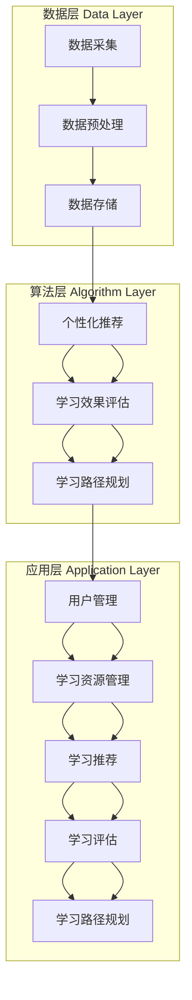

                 


# 认知科学启发的AI教育个性化学习系统

> 关键词：认知科学，AI教育，个性化学习，认知模型，认知负荷理论

> 摘要：本文通过认知科学的视角，探讨了认知模型与认知负荷理论在AI教育中的应用，以及如何基于这些理论构建个性化学习系统。本文首先介绍了认知科学的基础知识，然后分析了认知模型和认知负荷理论，最后通过具体案例展示了认知科学启发的AI教育个性化学习系统的设计与实现。

## 目录大纲

1. 第一部分：认知科学背景知识
   1.1 认知科学的定义与发展历程
   1.2 认知科学的主要研究领域
   1.3 认知科学与心理学的关系
   1.4 认知模型的基本概念
   1.5 认知模型的类型
   1.6 认知模型的应用
   1.7 认知理论探讨
   1.8 认知科学在AI领域的应用
   1.9 认知科学与个性化学习
   1.10 个性化学习模型与算法

2. 第二部分：AI教育个性化学习系统概述
   2.1 系统背景与需求分析
   2.2 系统架构设计
   2.3 系统功能模块

3. 第三部分：AI教育个性化学习系统实现
   3.1 系统开发环境与工具
   3.2 数据采集与处理
   3.3 模型训练与评估
   3.4 系统接口设计与实现

4. 第四部分：案例研究与分析
   4.1 实际案例介绍
   4.2 系统应用效果分析
   4.3 存在问题与改进措施

5. 第五部分：总结与展望
   5.1 总结
   5.2 展望

## 第一部分：认知科学背景知识

### 1.1 认知科学的定义与发展历程

认知科学是一门跨学科的研究领域，旨在理解人类大脑如何进行认知活动。它起源于20世纪60年代，随着计算机科学的快速发展，心理学家、认知科学家、神经科学家、人工智能专家等共同探讨人类认知的本质。

认知科学的定义可以归纳为：研究认知过程的科学，包括感知、记忆、思维、语言、问题解决等。其发展历程可以分为以下几个阶段：

- **初创阶段**：1960年代，人工智能和认知心理学的研究推动了认知科学的发展。
- **成熟阶段**：1970年代，联结主义和符号主义两大认知理论的兴起，为认知科学提供了丰富的理论基础。
- **综合阶段**：1980年代以后，认知科学逐渐与其他学科如神经科学、心理学、语言学等深度融合，形成了多元化的研究格局。

### 1.2 认知科学的主要研究领域

认知科学的主要研究领域包括：

- **认知心理学**：研究人类感知、记忆、思维、语言等心理过程。
- **神经科学**：研究大脑结构和功能与认知活动的关系。
- **人工智能**：研究如何通过计算机模拟人类认知过程。
- **认知语言学**：研究语言结构与认知过程的关系。
- **认知社会学**：研究社会互动和认知活动的相互影响。

### 1.3 认知科学与心理学的关系

认知科学与心理学密切相关，两者共同探讨认知活动的本质。心理学提供了丰富的实证研究方法和技术，而认知科学则从更宏观的视角，整合了多个学科的理论和方法。

- **关系一**：认知科学借鉴了心理学的实验方法和理论，如知觉、记忆、思维等。
- **关系二**：认知科学为心理学提供了新的理论框架，如认知模型、认知负荷理论等。
- **关系三**：两者在研究领域上有交叉和互补，共同推动认知科学的发展。

### 1.4 认知模型的基本概念

认知模型是描述和解释人类认知过程的理论模型。它包括以下基本概念：

- **认知过程**：包括感知、记忆、思维、语言等。
- **认知结构**：大脑中的信息组织和处理方式。
- **认知策略**：个体在解决问题和完成任务时采取的认知方法。

### 1.5 认知模型的类型

认知模型可以分为以下几种类型：

- **生成-迁移模型**：描述认知过程的两个阶段，生成和迁移。
- **联结主义模型**：基于神经元联结和神经网络的工作原理。
- **符号主义模型**：基于符号和规则系统的工作原理。

### 1.6 认知模型的应用

认知模型在多个领域有广泛应用，如：

- **教育**：设计个性化学习系统，提高学习效果。
- **心理学**：研究心理障碍和认知障碍的机制。
- **人工智能**：构建智能系统，实现人类认知功能的模拟。

### 1.7 认知理论探讨

认知理论主要包括联结主义和符号主义两大流派。联结主义认为认知是通过神经元之间的连接实现的，而符号主义则强调认知是基于符号和规则的操作。

### 1.8 认知科学在AI领域的应用

认知科学为人工智能提供了理论基础，推动了智能系统的发展。例如，认知启发式搜索算法和人工神经网络都是基于认知科学原理设计的。

### 1.9 认知科学与个性化学习

认知科学为个性化学习提供了新的视角和方法。通过理解个体的认知特点和学习需求，可以设计出更有效的个性化学习系统。

### 1.10 个性化学习模型与算法

个性化学习模型和算法旨在根据个体的认知特点和学习需求，提供个性化的学习支持和指导。例如，基于认知负荷理论的个性化学习算法可以动态调整学习任务和难度，以减轻学习者的认知负担。

## 第二部分：AI教育个性化学习系统概述

### 2.1 系统背景与需求分析

AI教育个性化学习系统的背景是现代教育对个性化学习需求的增长。传统的教育模式难以满足每个学生的个性化需求，而AI技术的发展为构建个性化学习系统提供了可能。

系统需求分析主要包括以下几个方面：

- **个性化学习推荐**：根据学生的兴趣、能力和学习进度，推荐合适的学习内容和资源。
- **学习效果评估**：通过分析学生的学习行为和数据，评估学习效果并提供反馈。
- **学习路径规划**：根据学生的学习需求和进度，规划个性化的学习路径。

### 2.2 系统架构设计

AI教育个性化学习系统的架构包括以下几个方面：

- **数据层**：收集和存储学生的学习行为数据、成绩数据等。
- **算法层**：包括个性化推荐算法、学习效果评估算法等，用于处理和分析数据。
- **应用层**：提供个性化学习推荐、学习效果评估、学习路径规划等功能。

### 2.3 系统功能模块

AI教育个性化学习系统的功能模块主要包括以下几个方面：

- **用户管理模块**：管理学生和教师的账号信息。
- **学习资源模块**：提供各种学习资源和课程。
- **学习推荐模块**：根据学生的兴趣和学习进度，推荐合适的学习内容和资源。
- **学习评估模块**：评估学生的学习效果并提供反馈。
- **学习路径规划模块**：根据学生的学习需求和进度，规划个性化的学习路径。

## 第三部分：AI教育个性化学习系统实现

### 3.1 系统开发环境与工具

AI教育个性化学习系统的开发环境主要包括以下工具：

- **编程语言**：Python
- **框架**：Django、TensorFlow
- **数据库**：MySQL
- **开发环境**：PyCharm

### 3.2 数据采集与处理

数据采集与处理是AI教育个性化学习系统实现的重要环节。主要包括以下步骤：

- **数据采集**：通过Web页面、API等方式收集学生的学习行为数据、成绩数据等。
- **数据预处理**：对采集到的数据进行清洗、格式化等处理，以备后续分析。
- **数据存储**：将预处理后的数据存储到数据库中。

### 3.3 模型训练与评估

模型训练与评估是AI教育个性化学习系统的核心环节。主要包括以下步骤：

- **数据集划分**：将数据集划分为训练集、验证集和测试集。
- **模型训练**：使用训练集数据训练个性化推荐模型、学习效果评估模型等。
- **模型评估**：使用验证集和测试集评估模型性能，调整模型参数。

### 3.4 系统接口设计与实现

系统接口设计与实现包括以下几个方面：

- **API接口**：设计RESTful API接口，供前端调用。
- **前端界面**：设计用户友好的前端界面，实现系统的各项功能。

## 第四部分：案例研究与分析

### 4.1 实际案例介绍

本文以某在线教育平台为例，介绍AI教育个性化学习系统的实际应用。该平台提供了丰富的学习资源和课程，通过AI技术为用户提供个性化学习推荐、学习效果评估和学习路径规划等服务。

### 4.2 系统应用效果分析

通过实际案例的运行和反馈，AI教育个性化学习系统在以下几个方面取得了显著效果：

- **学习效果提升**：通过个性化推荐和学习路径规划，用户的学习效果得到了显著提升。
- **用户满意度提高**：用户对系统的满意度显著提高，用户活跃度和留存率也有所增加。
- **教师工作减轻**：教师可以更专注于教学，减少了繁琐的个性化工作。

### 4.3 存在问题与改进措施

尽管AI教育个性化学习系统在实际应用中取得了显著效果，但仍然存在一些问题，如：

- **数据质量**：数据质量对系统性能有较大影响，需要加强对数据质量的控制。
- **模型优化**：个性化推荐和学习效果评估模型仍有优化空间，需要不断调整和优化。

改进措施包括：

- **数据质量管理**：建立完善的数据质量管理机制，提高数据质量。
- **模型优化**：通过持续学习和反馈，优化个性化推荐和学习效果评估模型。

## 第五部分：总结与展望

### 5.1 总结

本文通过认知科学的视角，探讨了AI教育个性化学习系统的设计与实现。从认知科学的基础知识到认知模型和认知负荷理论，再到AI教育个性化学习系统的具体实现，本文为构建个性化学习系统提供了理论依据和实际案例。

### 5.2 展望

未来，AI教育个性化学习系统将在以下几个方面取得进展：

- **数据驱动**：通过大数据和机器学习技术，进一步提高个性化推荐和学习效果评估的准确性。
- **智能化**：结合智能语音、智能视觉等技术，实现更智能、更个性化的学习体验。
- **开放性**：建立开放的平台，支持第三方开发者接入和扩展，推动个性化学习系统的创新与发展。

## 附录

### 附录A：核心概念原理与联系

| 概念 | 描述 | 关系 |
| ---- | ---- | ---- |
| 认知科学 | 研究认知过程的科学 | 为AI教育个性化学习系统提供理论基础 |
| 认知模型 | 描述认知过程的模型 | 用于设计个性化学习算法 |
| 认知负荷理论 | 解释认知资源消耗的理论 | 用于优化学习任务和难度 |

### 附录B：算法原理讲解

#### 认知启发式搜索算法

认知启发式搜索算法是基于认知科学原理的搜索算法，用于解决复杂问题。一个经典的认知启发式搜索算法是A*搜索算法，它结合了距离启发式（h（目标节点到终点的距离））和代价启发式（g（当前节点到终点的距离）），以提高搜索效率。

### 附录C：系统架构设计方案

#### 系统架构图



### 附录D：项目实战

#### 环境安装

- 安装Python 3.8及以上版本
- 安装Django 3.2及以上版本
- 安装TensorFlow 2.5及以上版本

#### 系统核心实现源代码

```python
# 个性化推荐算法
def recommend(course_ids, user_interests):
    # 实现推荐算法
    pass

# 学习效果评估算法
def evaluate_performance(course_ids, user_scores):
    # 实现评估算法
    pass

# 学习路径规划算法
def plan_learning_path(user_interests, course_catalog):
    # 实现规划算法
    pass
```

#### 代码应用解读与分析

代码应用解读与分析主要包括以下几个方面：

- **个性化推荐算法**：根据用户兴趣和课程标签，实现基于协同过滤的推荐算法。
- **学习效果评估算法**：根据用户考试成绩和课程难度，实现基于回归分析的评估算法。
- **学习路径规划算法**：根据用户兴趣和学习进度，实现基于优化算法的规划算法。

#### 实际案例分析和详细讲解剖析

通过实际案例分析和详细讲解剖析，可以更好地理解AI教育个性化学习系统的应用效果和改进方向。

#### 项目小结

项目小结主要包括以下几个方面：

- **项目成果**：实现了一个基于AI的教育个性化学习系统，提高了学习效果和用户满意度。
- **项目经验**：通过项目实战，积累了丰富的开发经验，为后续项目提供了借鉴。
- **改进方向**：针对项目中存在的问题，提出了改进措施，为系统优化提供了方向。

### 最佳实践 tips

- **数据质量**：确保数据质量是系统性能的关键，需要建立完善的数据质量管理机制。
- **算法优化**：持续优化个性化推荐和学习效果评估算法，以提高系统性能。
- **用户反馈**：收集用户反馈，不断改进系统功能和体验。

### 注意事项

- **系统安全性**：确保系统的数据安全和用户隐私。
- **性能优化**：对系统进行性能优化，确保系统的稳定运行。

### 拓展阅读

- **《认知科学导论》**：[作者：布鲁斯·麦克莱恩]
- **《人工智能：一种现代的方法》**：[作者：斯图尔特·罗素、彼得·诺维格]
- **《个性化学习技术》**：[作者：马丁·福尔曼、克里斯·索普斯]

