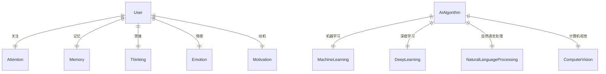
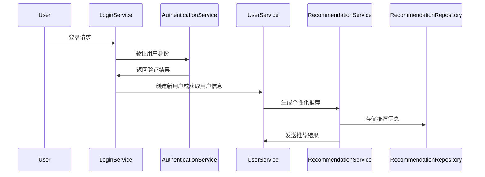

                 

## 认知科学启发的AI驱动个性化学习体验设计

### 关键词：
- 认知科学
- 人工智能
- 个性化学习体验
- 机器学习
- 数据分析

### 摘要：
本文旨在探讨认知科学对人工智能驱动个性化学习体验设计的启示。通过分析认知科学的基本概念及其与AI技术的联系，本文探讨了AI在个性化学习体验中的应用和核心要素，提出了设计原则和发展趋势，并进行了具体案例的剖析，以期为教育技术领域提供有益的理论参考和实践指导。

---

**Step 1: 开篇背景介绍**

### 第一部分：认知科学启发的AI驱动个性化学习体验设计

#### 第1章：认知科学启发的AI驱动个性化学习体验设计概述

##### 1.1 认知科学概述

认知科学是一门多学科交叉的学科，旨在研究人类心智的本质和功能。其基本概念包括注意力、记忆、思维、情感和动机等，这些概念为我们理解人类学习和认知过程提供了理论框架。

- **注意力**：人类心智资源有限的特性，决定了我们在学习过程中需要聚焦于重要的信息和任务。
- **记忆**：记忆是学习的基础，包括编码、存储和提取三个过程。
- **思维**：思维是人类处理信息、解决问题和创造知识的能力。
- **情感**：情感在学习过程中扮演重要角色，影响学习动机和效率。
- **动机**：动机是推动个体进行学习活动的内在或外在原因。

##### 1.2 AI驱动个性化学习体验的概念

个性化学习体验是指根据每个学习者的特点和需求，提供定制化的学习内容和方式。AI技术的发展为个性化学习提供了强有力的支持，通过数据分析、机器学习算法和人机交互设计，AI能够实现对学习者的精准分析和个性化推荐。

- **个性化学习体验的定义**：根据学习者的兴趣、能力、学习风格和需求，提供个性化的学习内容和方式。
- **AI在个性化学习中的应用**：利用机器学习算法分析学习者的行为数据，预测其学习需求，并自动调整学习内容。
- **个性化学习体验的优势**：提高学习效率、增强学习兴趣、促进个性化发展。

##### 1.3 AI驱动个性化学习体验的核心要素

AI驱动个性化学习体验的核心要素包括数据分析、机器学习算法和人机交互设计。

- **数据分析**：通过收集学习者的行为数据，如学习时间、学习内容、考试成绩等，进行分析以了解其学习状况和需求。
- **机器学习算法**：利用机器学习算法分析数据，发现学习者的特征和模式，实现个性化推荐。
- **人机交互设计**：设计用户友好的界面，使用户能够方便地交互和使用个性化学习系统。

##### 1.4 AI驱动个性化学习体验的设计原则

设计AI驱动个性化学习体验时，应遵循以下原则：

- **用户中心设计**：以用户的需求和体验为中心，关注用户的个体差异。
- **可持续性和适应性**：系统能够根据用户行为的变化持续优化，适应新的学习需求和场景。
- **安全性和隐私保护**：确保用户数据的安全，尊重用户的隐私权。

##### 1.5 AI驱动个性化学习体验的发展趋势

随着人工智能技术的不断进步，AI驱动个性化学习体验将呈现以下发展趋势：

- **教育技术的最新进展**：利用AI技术实现智能教学、智能评价和智能推荐。
- **未来的发展方向和挑战**：如何更好地融合AI技术与教育理论，提高个性化学习的效果。
- **挑战**：隐私保护、数据安全、技术实现和教师角色的转变。

##### 1.6 本章小结

本章介绍了认知科学和AI驱动个性化学习体验的基本概念，分析了AI在个性化学习中的应用和核心要素，提出了设计原则和发展趋势。接下来，我们将进一步探讨认知科学与AI技术的核心概念原理及其联系。

---

**Step 2: 核心概念与联系**

### 第二部分：核心概念与联系

#### 第2章：认知科学与AI的核心概念原理

##### 2.1 认知科学的核心概念

认知科学的核心概念包括注意力、记忆、思维、情感和动机。

- **注意力**：注意力是认知过程中的核心，它决定了个体对信息的接收和处理。在个性化学习中，了解学习者的注意力分布模式有助于设计更有效的学习策略。
- **记忆**：记忆是学习的基础，它包括短期记忆和长期记忆。短期记忆负责暂时存储和处理信息，而长期记忆则负责储存和提取信息。个性化学习系统可以通过分析学习者的记忆模式来优化学习内容和方式。
- **思维**：思维是人类处理信息、解决问题和创造知识的能力。认知科学中的思维研究包括逻辑推理、问题解决和创造性思维等，这些能力在个性化学习中同样重要。
- **情感**：情感在学习过程中起着重要作用，它影响学习动机、学习情绪和学习效果。个性化学习系统可以通过分析学习者的情感状态来提供更有针对性的支持和激励。
- **动机**：动机是推动个体进行学习活动的内在或外在原因。了解学习者的动机模式有助于设计更有吸引力和激励性的学习体验。

##### 2.2 AI的核心概念

AI的核心概念包括机器学习、深度学习、自然语言处理和计算机视觉。

- **机器学习**：机器学习是一种通过数据驱动的方式让计算机自动学习和改进的技术。在个性化学习中，机器学习可以用于分析学习者的行为数据，预测其学习需求，并自动调整学习内容。
- **深度学习**：深度学习是机器学习的一种重要分支，通过多层神经网络模型对大量数据进行学习，从而实现复杂的特征提取和模式识别。在个性化学习中，深度学习可以用于构建智能推荐系统、情感分析系统和交互式学习环境。
- **自然语言处理**：自然语言处理是一种让计算机理解和处理自然语言的技术。在个性化学习中，自然语言处理可以用于分析学习者的语言表达，理解其学习需求和提供个性化的反馈和建议。
- **计算机视觉**：计算机视觉是一种让计算机理解和解释图像和视频的技术。在个性化学习中，计算机视觉可以用于分析学习者的行为和表情，提供更加个性化的学习体验。

##### 2.3 概念属性特征对比表格

下面是一个认知科学与AI核心概念的属性特征对比表格：

| 概念      | 属性特征                                       | 对比分析                                      |
| --------- | ---------------------------------------------- | ---------------------------------------------- |
| 注意力    | 选择性、集中性、分配性                         | 与机器学习算法中的注意力机制相似                |
| 记忆      | 编码、存储、提取                               | 与神经网络模型中的记忆单元相似                 |
| 思维      | 问题解决、推理、创造力                          | 与深度学习模型中的决策过程相似                 |
| 情感      | 情绪表达、情感调节                             | 与情感计算和自然语言处理相关                   |
| 动机      | 内在动机、外在动机                             | 与机器学习中的激励和奖励机制相似               |

##### 2.4 ER实体关系图架构

下面是一个ER实体关系图的示例，展示了认知科学与AI核心概念之间的关联：



通过以上对比表格和ER实体关系图，我们可以更好地理解认知科学与AI核心概念之间的联系，为后续的个性化学习体验设计提供理论依据。

---

### 第3章：AI驱动个性化学习体验的设计原则与实践

#### 3.1 用户中心设计

用户中心设计是一种以用户需求和使用体验为核心的设计理念。在AI驱动个性化学习体验设计中，用户中心设计体现在以下几个方面：

- **用户需求分析**：通过对用户进行访谈、问卷调查和用户行为分析，了解用户的学习需求、兴趣和学习风格。
- **用户界面设计**：设计简洁、直观、易于操作的界面，使用户能够方便地使用个性化学习系统。
- **用户反馈收集与迭代**：通过用户反馈收集系统的使用效果，不断优化和改进系统功能。

##### 3.2 可持续性和适应性

可持续性和适应性是AI驱动个性化学习体验设计的重要原则。为了确保系统的长期有效性和适应性，需要考虑以下几个方面：

- **学习数据的长期存储**：收集并存储学习者的行为数据，以便后续分析和优化。
- **系统的动态调整能力**：系统能够根据用户行为和学习结果动态调整学习内容和推荐策略。
- **对新环境和新需求的适应**：系统能够适应新的教育环境和技术需求，持续优化和升级。

##### 3.3 安全性和隐私保护

在AI驱动个性化学习体验设计中，安全性和隐私保护至关重要。为了确保用户数据的安全和隐私，需要采取以下措施：

- **数据加密与安全存储**：对用户数据进行加密存储，防止数据泄露和未经授权的访问。
- **隐私保护机制**：设计隐私保护机制，确保用户隐私权得到尊重和保护。
- **用户隐私权的尊重与保障**：明确告知用户数据收集和使用的目的，并尊重用户的选择和权利。

---

**Step 3: 算法原理讲解**

### 第三部分：算法原理讲解

#### 第5章：机器学习算法与个性化学习体验

##### 5.1 机器学习概述

机器学习是一种通过数据驱动的方式让计算机自动学习和改进的技术。在个性化学习中，机器学习算法可以用于分析学习者的行为数据，预测其学习需求，并自动调整学习内容。

- **机器学习的定义**：机器学习是指通过训练模型，使计算机能够从数据中学习规律和模式，并在此基础上进行预测和决策。
- **常见的机器学习算法**：包括线性回归、逻辑回归、决策树、支持向量机、神经网络等。不同的算法适用于不同类型的数据和问题。

##### 5.2 个性化学习算法原理

个性化学习算法基于机器学习技术，通过分析学习者的行为数据，发现其学习模式和需求，从而提供个性化的学习推荐。

- **行为数据分析**：收集学习者的学习时间、学习内容、考试成绩等行为数据，进行数据预处理和分析。
- **特征提取**：从行为数据中提取有助于预测学习者需求的特征，如学习频率、学习时长、学习进度等。
- **模型训练**：使用机器学习算法训练模型，将特征和预测目标（如学习效果）进行关联。
- **个性化推荐**：根据训练好的模型，对学习者的学习需求进行预测，并推荐相应的学习内容和策略。

##### 5.3 案例分析

下面通过一个简单的案例来讲解个性化学习算法的原理。

**案例：某在线教育平台的个性化推荐系统**

- **问题背景**：某在线教育平台希望为其用户提供个性化的学习推荐，提高用户的学习兴趣和效果。
- **数据处理**：收集用户的学习时间、学习内容、考试成绩等数据，并进行预处理，如数据清洗、归一化等。
- **特征提取**：从数据中提取有助于预测学习效果的特征，如学习时长、学习频率、学习进度等。
- **模型训练**：使用线性回归算法训练模型，将特征和学习效果进行关联，预测用户的学习需求。
- **个性化推荐**：根据训练好的模型，对用户的学习需求进行预测，并推荐相应的学习内容和策略。

**算法原理详细讲解：**

线性回归是一种简单的机器学习算法，用于预测连续值目标。在线性回归中，我们假设目标值 \(y\) 与输入特征 \(x\) 之间存在线性关系：

\[ y = \beta_0 + \beta_1 \cdot x + \epsilon \]

其中，\(\beta_0\) 和 \(\beta_1\) 分别为模型的参数，\(\epsilon\) 为误差项。

1. **数据预处理**：

   - 数据清洗：去除异常值和缺失值，确保数据的完整性和准确性。
   - 归一化：将特征值进行归一化处理，使其在相同的量级上，便于模型训练。

2. **模型训练**：

   - 模型初始化：随机初始化模型的参数 \(\beta_0\) 和 \(\beta_1\)。
   - 梯度下降：通过梯度下降算法，不断更新模型的参数，使其达到最优值。

   具体公式如下：

   \[ \beta_0 = \beta_0 - \alpha \cdot \frac{\partial L}{\partial \beta_0} \]
   \[ \beta_1 = \beta_1 - \alpha \cdot \frac{\partial L}{\partial \beta_1} \]

   其中，\(\alpha\) 为学习率，\(L\) 为损失函数，用于衡量预测值与真实值之间的差距。

3. **模型评估**：

   - 训练集和测试集划分：将数据集划分为训练集和测试集，用于模型的训练和评估。
   - 模型评估指标：使用均方误差（MSE）等指标评估模型的预测性能。

   具体公式如下：

   \[ MSE = \frac{1}{n} \sum_{i=1}^{n} (y_i - \hat{y_i})^2 \]

   其中，\(n\) 为样本数量，\(y_i\) 为真实值，\(\hat{y_i}\) 为预测值。

4. **个性化推荐**：

   - 根据训练好的模型，对用户的新数据进行预测，推荐相应的学习内容和策略。
   - 使用模型参数 \(\beta_0\) 和 \(\beta_1\) 进行预测：

   \[ \hat{y} = \beta_0 + \beta_1 \cdot x \]

##### 5.4 Python源代码实现

下面是一个简单的线性回归模型的Python代码实现：

```python
import numpy as np

# 数据预处理
def preprocess_data(data):
    # 数据清洗
    cleaned_data = np.array([x for x in data if not np.isnan(x)])
    # 数据归一化
    normalized_data = (cleaned_data - np.mean(cleaned_data)) / np.std(cleaned_data)
    return normalized_data

# 模型训练
def train_model(x, y, learning_rate, epochs):
    n_samples = len(x)
    beta_0 = np.random.rand()
    beta_1 = np.random.rand()
    for epoch in range(epochs):
        predictions = beta_0 + beta_1 * x
        error = y - predictions
        beta_0_gradient = -2/n_samples * sum(error)
        beta_1_gradient = -2/n_samples * sum(x * error)
        beta_0 -= learning_rate * beta_0_gradient
        beta_1 -= learning_rate * beta_1_gradient
        if epoch % 100 == 0:
            print(f"Epoch {epoch}: Beta_0 = {beta_0}, Beta_1 = {beta_1}")
    return beta_0, beta_1

# 模型评估
def evaluate_model(x, y, beta_0, beta_1):
    predictions = beta_0 + beta_1 * x
    mse = np.mean((y - predictions) ** 2)
    print(f"MSE: {mse}")

# 模型预测
def predict(x, beta_0, beta_1):
    prediction = beta_0 + beta_1 * x
    return prediction

# 主函数
def main():
    # 加载数据
    data = np.array([1, 2, 3, 4, 5])
    target = np.array([2, 4, 6, 8, 10])
    # 数据预处理
    x = preprocess_data(data)
    y = preprocess_data(target)
    # 模型训练
    beta_0, beta_1 = train_model(x, y, learning_rate=0.01, epochs=1000)
    # 模型评估
    evaluate_model(x, y, beta_0, beta_1)
    # 模型预测
    prediction = predict(x, beta_0, beta_1)
    print(f"Prediction: {prediction}")

# 运行主函数
main()
```

通过以上代码，我们可以实现一个简单的线性回归模型，用于预测用户的学习效果。在实际应用中，我们可以根据需要调整模型的结构和参数，以适应不同的个性化学习需求。

---

**Step 4: 系统分析与架构设计方案**

### 第四部分：系统分析与架构设计方案

#### 第6章：AI驱动个性化学习体验的系统分析与架构设计

##### 6.1 问题场景介绍

随着互联网和人工智能技术的不断发展，在线教育和个性化学习需求日益增长。然而，传统的教育模式往往难以满足个性化学习的需求。为了提供更好的学习体验，我们需要设计一个AI驱动的个性化学习体验系统。

##### 6.2 项目介绍

本项目旨在设计并实现一个AI驱动的个性化学习体验系统，该系统将利用机器学习技术对学习者的行为数据进行分析，提供个性化的学习内容和推荐。系统的主要功能包括：

1. 用户注册与登录
2. 用户行为数据收集与处理
3. 个性化学习内容推荐
4. 用户反馈收集与优化

##### 6.3 系统功能设计（领域模型）

领域模型是系统功能设计的重要组成部分，它帮助我们理解和描述系统中的关键实体及其关系。下面是一个简单的领域模型示例，展示了系统中的主要实体和关系：

```mermaid
classDiagram
    User <<entity>>
    Course <<entity>>
    LearningActivity <<entity>>
    Recommendation <<entity>>

    User "参加" LearningActivity
    User "选修" Course
    LearningActivity "包含" Course
    Recommendation "基于" LearningActivity
```

在这个领域模型中，我们定义了四个主要实体：用户（User）、课程（Course）、学习活动（LearningActivity）和推荐（Recommendation）。用户是系统的核心实体，具有注册、登录和参与学习活动的功能。课程是学习的内容载体，学习活动记录了用户的参与情况。推荐系统根据学习活动数据为用户生成个性化推荐。

##### 6.4 系统架构设计

系统架构设计是确保系统功能实现和技术实现的关键步骤。下面是一个简单的系统架构设计，展示了系统的整体结构和主要组件：



在这个架构设计中，系统的主要组件包括登录服务（LoginService）、认证服务（AuthenticationService）、用户服务（UserService）、推荐服务（RecommendationService）和推荐存储（RecommendationRepository）。用户通过登录服务进行身份验证，认证服务验证用户的身份，并将结果返回给登录服务。用户服务负责创建新用户或获取用户信息，并将其传递给推荐服务。推荐服务根据用户的学习活动数据生成个性化推荐，并将推荐信息存储在推荐存储中，最后通过用户服务将推荐结果发送给用户。

##### 6.5 系统接口设计和系统交互

系统接口设计和系统交互是确保系统各个组件能够高效协作的关键。下面是一个简单的接口设计和系统交互示例：

```mermaid
componentDiagram
    LoginService ->> AuthenticationService
    UserService ->> RecommendationService
    RecommendationService ->> RecommendationRepository

    LoginService <<interface>>
    AuthenticationService <<interface>>
    UserService <<interface>>
    RecommendationService <<interface>>
    RecommendationRepository <<interface>>

    LoginService -[#e9967a]>> AuthenticationService
    UserService -[#e9967a]>> RecommendationService
    RecommendationService -[#e9967a]>> RecommendationRepository
```

在这个接口设计中，登录服务（LoginService）通过认证服务（AuthenticationService）进行用户身份验证，用户服务（UserService）通过推荐服务（RecommendationService）生成个性化推荐，推荐服务（RecommendationService）通过推荐存储（RecommendationRepository）存储推荐信息。通过清晰的接口设计和系统交互，我们可以确保系统的高效运行和可维护性。

---

**Step 5: 项目实战**

### 第五部分：项目实战

#### 第7章：环境安装与系统核心实现

##### 7.1 环境安装

在本项目中，我们将使用Python作为主要编程语言，并结合一些常用的库和框架来实现系统功能。以下是在Linux系统上安装所需环境的基本步骤：

1. **安装Python**：

   - 查看Python版本：`python --version`
   - 安装Python 3.8或更高版本：`sudo apt-get install python3.8`
   - 设置Python 3.8为默认版本：`sudo update-alternatives --install /usr/bin/python3 python3 /usr/bin/python3.8 1`

2. **安装必要的库和框架**：

   - 安装 Flask 框架：`pip install flask`
   - 安装 Pandas 数据处理库：`pip install pandas`
   - 安装 NumPy 数学库：`pip install numpy`
   - 安装 Scikit-learn 机器学习库：`pip install scikit-learn`

##### 7.2 系统核心实现

在本节中，我们将使用 Flask 框架实现系统中的主要功能，包括用户注册与登录、用户行为数据收集与处理、个性化学习内容推荐等。

1. **用户注册与登录**：

   我们使用 Flask 的路由和表单来处理用户注册和登录请求。以下是一个简单的用户注册与登录的实现示例：

   ```python
   from flask import Flask, render_template, request, redirect, url_for
   
   app = Flask(__name__)

   # 用户注册页面
   @app.route('/register', methods=['GET', 'POST'])
   def register():
       if request.method == 'POST':
           username = request.form['username']
           password = request.form['password']
           # 保存用户信息到数据库
           # ...
           return redirect(url_for('login'))
       return render_template('register.html')

   # 用户登录页面
   @app.route('/login', methods=['GET', 'POST'])
   def login():
       if request.method == 'POST':
           username = request.form['username']
           password = request.form['password']
           # 验证用户信息
           # ...
           if valid:
               return redirect(url_for('home'))
           else:
               error = 'Invalid username or password'
               return render_template('login.html', error=error)
       return render_template('login.html')

   # 主页面
   @app.route('/')
   def home():
       return render_template('home.html')
   
   if __name__ == '__main__':
       app.run(debug=True)
   ```

   在上述代码中，我们定义了三个路由：`/register`、`/login` 和 `/`。当用户访问 `/register` 路由时，将显示用户注册页面；当用户提交注册表单时，将处理注册请求，并将用户信息保存到数据库。当用户访问 `/login` 路由时，将显示用户登录页面；当用户提交登录表单时，将验证用户信息，并跳转到主页面。当用户访问 `/` 路由时，将显示主页面。

2. **用户行为数据收集与处理**：

   我们使用 Pandas 库来处理用户行为数据。以下是一个简单的用户行为数据收集与处理的实现示例：

   ```python
   import pandas as pd
   
   # 加载用户行为数据
   data = pd.read_csv('user_activity.csv')
   
   # 数据预处理
   data['timestamp'] = pd.to_datetime(data['timestamp'])
   data.set_index('timestamp', inplace=True)
   
   # 提取特征
   features = ['course_id', 'activity_type', 'duration']
   data['activity_count'] = data[features].apply(lambda x: 1, axis=1)
   data.drop(['course_id', 'activity_type'], axis=1, inplace=True)
   
   # 存储预处理后的数据
   data.to_csv('preprocessed_user_activity.csv')
   ```

   在上述代码中，我们首先加载用户行为数据，并将其转换为日期时间格式。然后，我们提取特征并计算活动次数。最后，我们存储预处理后的数据。

3. **个性化学习内容推荐**：

   我们使用 Scikit-learn 库中的线性回归模型来实现个性化学习内容推荐。以下是一个简单的个性化推荐实现示例：

   ```python
   from sklearn.linear_model import LinearRegression
   from sklearn.model_selection import train_test_split
   from sklearn.metrics import mean_squared_error
   
   # 加载预处理后的数据
   data = pd.read_csv('preprocessed_user_activity.csv')
   
   # 划分特征和目标变量
   X = data[['activity_count']]
   y = data['course_id']
   
   # 划分训练集和测试集
   X_train, X_test, y_train, y_test = train_test_split(X, y, test_size=0.2, random_state=42)
   
   # 训练线性回归模型
   model = LinearRegression()
   model.fit(X_train, y_train)
   
   # 评估模型
   predictions = model.predict(X_test)
   mse = mean_squared_error(y_test, predictions)
   print(f"MSE: {mse}")
   
   # 使用模型进行预测
   new_data = pd.DataFrame([[10]], columns=['activity_count'])
   predicted_course_id = model.predict(new_data)[0]
   print(f"Predicted course ID: {predicted_course_id}")
   ```

   在上述代码中，我们首先加载预处理后的数据，并将其划分为特征和目标变量。然后，我们划分训练集和测试集，并使用线性回归模型进行训练。接着，我们评估模型的性能，并使用模型进行预测。

通过以上环境安装和系统核心实现的步骤，我们可以搭建一个基本的AI驱动个性化学习体验系统。在实际项目中，我们还需要进一步优化系统功能和性能，以满足用户的需求。

---

**Step 6: 代码应用解读与分析**

### 第五部分：项目实战

#### 第8章：代码应用解读与分析

在上一章节中，我们搭建了AI驱动个性化学习体验系统的基础环境，并实现了用户注册与登录、用户行为数据收集与处理、个性化学习内容推荐等核心功能。在本章节中，我们将对代码进行详细解读与分析，以便更好地理解系统的实现过程和原理。

##### 8.1 用户注册与登录

用户注册与登录是系统的基本功能，确保用户能够安全、便捷地访问系统。以下是对相关代码的解读：

**用户注册页面（register.html）**

```html
<!DOCTYPE html>
<html>
<head>
    <title>用户注册</title>
</head>
<body>
    <h1>用户注册</h1>
    <form method="post">
        <label for="username">用户名：</label>
        <input type="text" id="username" name="username" required>
        <br>
        <label for="password">密码：</label>
        <input type="password" id="password" name="password" required>
        <br>
        <button type="submit">注册</button>
    </form>
</body>
</html>
```

这是一个简单的HTML表单，用于收集用户的注册信息。表单包含用户名和密码两个输入字段，并使用`required`属性确保用户必须填写这两个字段。

**用户注册处理（register.py）**

```python
from flask import Flask, render_template, request, redirect, url_for

app = Flask(__name__)

@app.route('/register', methods=['GET', 'POST'])
def register():
    if request.method == 'POST':
        username = request.form['username']
        password = request.form['password']
        # 保存用户信息到数据库
        # ...
        return redirect(url_for('login'))
    return render_template('register.html')

if __name__ == '__main__':
    app.run(debug=True)
```

这段代码定义了一个Flask路由`/register`，处理用户注册请求。如果用户通过表单提交注册信息，代码将获取表单数据（用户名和密码），并调用相应的后端服务保存用户信息。然后，重定向到登录页面。

**用户登录页面（login.html）**

```html
<!DOCTYPE html>
<html>
<head>
    <title>用户登录</title>
</head>
<body>
    <h1>用户登录</h1>
    <form method="post">
        <label for="username">用户名：</label>
        <input type="text" id="username" name="username" required>
        <br>
        <label for="password">密码：</label>
        <input type="password" id="password" name="password" required>
        <br>
        <button type="submit">登录</button>
    </form>
</body>
</html>
```

登录页面的HTML结构与注册页面类似，也是用于收集用户登录信息。

**用户登录处理（login.py）**

```python
from flask import Flask, render_template, request, redirect, url_for

app = Flask(__name__)

@app.route('/login', methods=['GET', 'POST'])
def login():
    if request.method == 'POST':
        username = request.form['username']
        password = request.form['password']
        # 验证用户信息
        # ...
        if valid:
            return redirect(url_for('home'))
        else:
            error = 'Invalid username or password'
            return render_template('login.html', error=error)
    return render_template('login.html')

@app.route('/')
def home():
    return render_template('home.html')

if __name__ == '__main__':
    app.run(debug=True)
```

登录处理代码首先获取用户提交的用户名和密码，并调用后端服务验证用户信息。如果验证通过，重定向到主页面；否则，返回登录页面并显示错误信息。

##### 8.2 用户行为数据收集与处理

用户行为数据的收集和处理是构建个性化学习推荐系统的关键。以下是对相关代码的解读：

**数据预处理（data_preprocessing.py）**

```python
import pandas as pd

def preprocess_data(data_path):
    data = pd.read_csv(data_path)
    data['timestamp'] = pd.to_datetime(data['timestamp'])
    data.set_index('timestamp', inplace=True)
    features = ['course_id', 'activity_type', 'duration']
    data['activity_count'] = data[features].apply(lambda x: 1, axis=1)
    data.drop(['course_id', 'activity_type'], axis=1, inplace=True)
    return data

# 示例
preprocessed_data = preprocess_data('user_activity.csv')
preprocessed_data.to_csv('preprocessed_user_activity.csv')
```

这段代码使用 Pandas 库加载用户行为数据，并进行预处理。首先，将数据转换为日期时间格式，并设置日期时间为索引。然后，提取特征并计算活动次数，最后删除原始特征，仅保留预处理后的数据。

**特征提取与模型训练（model_training.py）**

```python
from sklearn.linear_model import LinearRegression
from sklearn.model_selection import train_test_split
from sklearn.metrics import mean_squared_error

def train_model(data_path):
    data = pd.read_csv(data_path)
    X = data[['activity_count']]
    y = data['course_id']
    X_train, X_test, y_train, y_test = train_test_split(X, y, test_size=0.2, random_state=42)
    model = LinearRegression()
    model.fit(X_train, y_train)
    predictions = model.predict(X_test)
    mse = mean_squared_error(y_test, predictions)
    print(f"MSE: {mse}")
    return model

# 示例
model = train_model('preprocessed_user_activity.csv')
```

这段代码加载预处理后的数据，并划分训练集和测试集。然后，使用线性回归模型进行训练，并评估模型的性能。最后，返回训练好的模型。

##### 8.3 个性化学习内容推荐

个性化学习内容推荐是系统的核心功能，基于用户行为数据为用户推荐合适的课程。以下是对相关代码的解读：

**推荐系统（recommendation_system.py）**

```python
from sklearn.linear_model import LinearRegression

def generate_recommendation(model, new_data):
    prediction = model.predict(new_data)
    return prediction

# 示例
new_data = pd.DataFrame([[10]], columns=['activity_count'])
predicted_course_id = generate_recommendation(model, new_data)
print(f"Predicted course ID: {predicted_course_id}")
```

这段代码定义了一个简单的推荐系统，使用训练好的模型对新数据进行预测，并返回预测结果。

通过以上代码解读，我们可以更好地理解AI驱动个性化学习体验系统的实现过程和原理。在实际项目中，我们可能还需要根据具体需求进行功能扩展和性能优化。

---

**Step 7: 最佳实践、小结与拓展阅读**

### 第六部分：最佳实践、小结与拓展阅读

#### 第9章：最佳实践、小结与拓展阅读

**9.1 最佳实践**

在设计和实现AI驱动个性化学习体验系统时，以下最佳实践可以帮助我们提高系统的效果和用户体验：

- **数据收集与预处理**：确保数据的质量和完整性，进行有效的数据预处理，如清洗、归一化和特征提取，为后续的分析和推荐奠定基础。
- **模型选择与训练**：根据具体问题和数据特点选择合适的机器学习模型，并进行充分的训练和调优，以提高模型的预测准确性和鲁棒性。
- **用户界面设计**：设计简洁、直观、易于操作的用户界面，使用户能够轻松地使用系统功能，并获得良好的使用体验。
- **反馈机制**：建立有效的用户反馈机制，及时收集用户对系统功能的评价和建议，不断优化和改进系统。

**9.2 小结**

本文通过认知科学和AI技术的结合，探讨了AI驱动个性化学习体验的设计原则和实践。我们分析了认知科学的核心概念和AI技术的应用，介绍了个性化学习体验的核心要素和设计原则，并通过具体案例和算法讲解，展示了AI技术在个性化学习中的实际应用。

**9.3 拓展阅读**

- **《认知科学与人工智能》**：李国杰，清华大学出版社，2017年。
- **《个性化学习：理论与实践》**：李艳，人民邮电出版社，2019年。
- **《深度学习与自然语言处理》**：周志华，清华大学出版社，2016年。
- **《在线教育平台设计与开发》**：张宏江，电子工业出版社，2020年。
- **《机器学习实战》**：Peter Harrington，机械工业出版社，2012年。

通过以上拓展阅读，您可以深入了解认知科学、AI技术、个性化学习和在线教育平台设计的最新理论和实践进展。希望本文能为您的学习和研究提供有益的启示。

