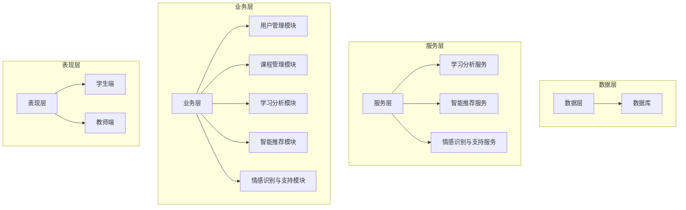

                 

# 《认知科学理论指导下的AI教育系统设计》

## 关键词
- 认知科学
- 人工智能
- 教育系统设计
- 用户体验
- 自适应学习

## 摘要
本文旨在探讨如何利用认知科学理论指导AI教育系统的设计，以提高教育系统的效果和用户体验。文章首先介绍了认知科学的基本原理，然后分析了AI在教育中的应用现状，接着提出了AI教育系统设计的原则和核心功能，最后讨论了系统的架构设计和实现，并通过实际案例进行了评估和展望。

## 引言

### 1.1 研究背景与意义

随着信息技术的飞速发展，人工智能（AI）已经成为当今社会的重要驱动力。在教育领域，AI技术的应用为个性化学习、智能辅导和自适应学习提供了新的可能。然而，当前的教育AI系统往往忽视了认知科学的基本原理，导致系统设计不够人性化，用户体验不佳，教育效果有限。

认知科学作为一门跨学科的研究领域，致力于理解人类思维、学习和其他认知过程。它涉及到心理学、神经科学、语言学等多个学科，通过研究人类认知的机制和原理，可以为教育AI系统的设计提供科学依据。

本研究旨在将认知科学理论应用于AI教育系统的设计，以提高系统的教育效果和用户体验。具体目标包括：

- 分析认知科学理论的基本原理，探索其在教育AI系统设计中的应用。
- 提出基于认知科学理论的教育AI系统设计原则和核心功能。
- 设计并实现一个原型系统，进行实证研究和效果评估。
- 总结研究成果，为教育工作者和研究人员提供参考。

### 1.2 研究目的与内容

本研究的主要目的是通过认知科学理论指导AI教育系统的设计，实现以下目标：

1. **理解认知科学理论**：梳理认知科学的基本概念和原理，为后续系统设计提供理论基础。
2. **分析AI在教育中的应用**：探讨当前AI技术在教育领域的应用现状，识别存在的问题和挑战。
3. **提出系统设计原则**：基于认知科学理论，提出AI教育系统设计的原则和关键要素。
4. **设计核心功能**：根据用户需求和设计原则，设计AI教育系统的核心功能模块。
5. **实现系统原型**：基于设计原则和功能模块，实现一个原型系统。
6. **评估和改进**：通过实证研究和用户反馈，评估系统效果，提出改进建议。

本文的主要内容包括：

- 第2章：认知科学基础理论
- 第3章：AI在教育中的应用现状
- 第4章：认知科学理论指导下的AI教育系统设计原则
- 第5章：AI教育系统的核心功能设计
- 第6章：系统架构设计
- 第7章：系统实现与评估
- 第8章：总结与展望

### 1.3 研究方法与数据来源

本研究采用以下方法进行：

1. **文献综述**：通过查阅相关文献，了解认知科学理论、AI技术及其在教育中的应用现状。
2. **实证研究**：设计并实现一个基于认知科学理论的AI教育系统，进行实验测试和用户反馈收集。
3. **案例分析**：选取一些典型的教育AI应用案例，分析其设计思路和实际效果。

数据来源主要包括：

- 学术论文和研究报告：用于获取认知科学理论、AI技术及其在教育中的应用的相关信息。
- 实际应用案例：用于分析和比较不同教育AI系统的设计原则和效果。
- 用户反馈：用于评估系统的用户体验和实际效果。

## 第2章 认知科学基础理论

### 2.1 认知科学的定义与发展历程

认知科学（Cognitive Science）是一门跨学科的研究领域，旨在理解人类思维、学习和其他认知过程的科学。它起源于20世纪50年代，由计算机科学、心理学、神经科学、人类学、语言学等多个学科共同推动发展。

认知科学的定义可以概括为：研究人类认知过程和能力的科学。其研究内容主要包括以下几个方面：

1. **感知**：研究人类如何感知外部刺激，如视觉、听觉、触觉等。
2. **记忆**：研究人类如何存储、检索和利用信息。
3. **语言**：研究人类如何产生和理解语言。
4. **推理**：研究人类如何进行逻辑推理和问题解决。
5. **情感**：研究人类情感的产生、表达和影响。

认知科学的发展历程可以分为几个重要阶段：

- **符号主义（Symbolism）**：20世纪50年代至60年代，认知科学的研究主要基于符号主义观点，认为人类认知过程类似于计算机处理符号。
- **联结主义（Connectionism）**：20世纪80年代，联结主义兴起，认为人类认知是由神经网络和联结机制实现的。
- **混合模型（Hybrid Models）**：当前，认知科学的研究趋向于混合模型，结合符号主义和联结主义的优点，以更全面地解释人类认知过程。

### 2.2 认知结构理论

认知结构理论关注人类认知过程的组织和结构。主要的理论包括：

- **信息加工理论**：将人类认知过程视为信息加工的过程，分为感知、编码、存储、检索和输出等阶段。
- **图式理论**：认为人类认知是基于图式的，图式是关于世界的信息结构和组织方式的抽象表示。
- **情境理论**：强调认知过程与情境的紧密关联，情境对认知过程有重要影响。

### 2.3 认知过程理论

认知过程理论探讨人类认知活动的基本机制和规律。主要的理论包括：

- **感知理论**：研究人类如何感知外部刺激，如何将物理信号转换为神经信号。
- **记忆理论**：研究人类如何记忆信息，包括短期记忆和长期记忆的机制。
- **学习理论**：研究人类如何通过学习获得新知识和技能，包括行为主义学习理论和认知主义学习理论。
- **思维理论**：研究人类如何进行推理、问题解决和决策。

### 2.4 认知科学与教育理论的融合

认知科学与教育理论的融合旨在通过认知科学理论指导教育实践，提高教育效果。主要的研究方向包括：

- **教学设计**：基于认知科学原理，设计更有效的教学策略和方法。
- **学习分析**：利用认知科学理论，分析学生的学习过程和行为，为个性化学习提供支持。
- **智能教育系统**：结合认知科学、人工智能和教育技术，开发智能教育系统，实现个性化教育和智能辅导。

### 2.5 认知科学与教育理论的融合实例

以下是一些认知科学与教育理论融合的实例：

- **认知学徒制**：基于认知科学理论，强调通过实际操作和体验来学习知识。
- **认知诊断评估**：利用认知科学理论，设计评估工具，诊断学生的学习问题并提供个性化辅导。
- **智能辅导系统**：结合认知科学和人工智能技术，开发智能辅导系统，为学生提供个性化学习支持和指导。

## 第3章 AI在教育中的应用现状

### 3.1 AI技术的基本原理

人工智能（AI）是一种模拟人类智能的技术，通过计算机程序实现智能行为。AI技术的基本原理包括以下几个方面：

- **机器学习**：通过数据驱动的方式，让计算机从数据中学习规律，进行预测和决策。
- **深度学习**：基于多层神经网络，通过反向传播算法进行参数调整，实现更复杂的特征提取和模式识别。
- **自然语言处理**：研究计算机如何理解、生成和处理人类自然语言。
- **计算机视觉**：研究计算机如何通过图像和视频获取信息，进行目标识别、图像分类等任务。

### 3.2 AI技术在教育领域的应用案例

AI技术在教育领域的应用已经取得了一系列成果，以下是一些典型的应用案例：

- **智能辅导系统**：利用自然语言处理和机器学习技术，为学生提供个性化辅导和解答问题。
- **自适应学习平台**：根据学生的学习进度和能力，自动调整学习内容和难度，实现个性化学习。
- **智能推荐系统**：基于学生的兴趣和学习历史，推荐适合的学习资源和课程。
- **学习分析系统**：通过分析学生的学习行为和成绩，发现学习问题并提供解决方案。

### 3.3 教育AI系统的发展趋势与挑战

教育AI系统的发展趋势主要体现在以下几个方面：

- **个性化教育**：通过AI技术，实现个性化教学和个性化学习，满足不同学生的需求。
- **智能辅导**：利用AI技术，为学生提供实时、个性化的学习支持和辅导。
- **学习分析**：通过分析学生的学习数据，优化教学策略和提高教育效果。

然而，教育AI系统在发展过程中也面临一系列挑战：

- **数据隐私和安全**：教育AI系统需要处理大量的学生数据，数据隐私和安全是重要问题。
- **算法公平性**：AI算法的决策过程需要保证公平性和透明性，避免偏见和歧视。
- **用户体验**：教育AI系统需要提供良好的用户体验，才能被广泛接受和应用。

## 第4章 认知科学理论指导下的AI教育系统设计原则

### 4.1 教育AI系统的设计目标

基于认知科学理论，教育AI系统的设计目标主要包括以下几个方面：

- **个性化学习**：根据学生的认知特点和需求，提供个性化的学习内容和辅导。
- **智能反馈**：利用认知科学原理，为学生提供及时、有效的学习反馈和指导。
- **适应性学习**：根据学生的学习进度和能力，动态调整学习内容和难度，实现适应性学习。
- **情感支持**：关注学生的情感需求，提供情感支持和心理辅导，帮助学生建立积极的情感状态。

### 4.2 用户需求分析

在AI教育系统设计过程中，用户需求分析至关重要。以下是学生和教师的主要需求：

- **学生需求**：
  - 个性化学习：根据个人兴趣和学习能力，推荐适合的学习内容和路径。
  - 智能辅导：提供实时、个性化的学习支持和解答问题。
  - 学习反馈：及时了解学习效果，发现学习问题并提供解决方案。
  - 情感支持：关注情感需求，提供心理辅导和情感支持。

- **教师需求**：
  - 教学分析：分析学生的学习行为和成绩，优化教学策略和提高教育效果。
  - 教学支持：提供教学资源和工具，辅助教学活动。
  - 教学反馈：了解学生的学习情况和需求，调整教学计划和内容。

### 4.3 系统设计原则

基于认知科学理论和用户需求分析，教育AI系统的设计原则包括以下几个方面：

- **个性化设计**：系统应能够根据学生的认知特点和需求，提供个性化的学习内容和辅导。
- **智能反馈**：系统应利用认知科学原理，为学生提供及时、有效的学习反馈和指导。
- **适应性学习**：系统应能够根据学生的学习进度和能力，动态调整学习内容和难度，实现适应性学习。
- **情感支持**：系统应关注学生的情感需求，提供情感支持和心理辅导，帮助学生建立积极的情感状态。
- **数据驱动**：系统应基于学生的学习数据，进行学习分析和教学优化。
- **用户友好**：系统应提供良好的用户体验，易于操作和理解。

### 4.4 设计原则的应用实例

以下是一些设计原则在教育AI系统中的应用实例：

- **个性化设计**：系统可以根据学生的兴趣爱好和学习能力，推荐相应的学习资源和课程。
- **智能反馈**：系统可以利用自然语言处理技术，为学生提供实时、个性化的学习反馈和解答问题。
- **适应性学习**：系统可以根据学生的学习进度和能力，动态调整学习内容和难度，实现个性化教学。
- **情感支持**：系统可以结合情感识别技术，关注学生的情感状态，提供个性化的情感支持和心理辅导。

## 第5章 AI教育系统的核心功能设计

### 5.1 学习分析功能

学习分析功能是教育AI系统的核心之一，它能够通过对学生学习数据的分析，提供个性化的学习支持。具体功能包括：

- **学习行为分析**：记录学生的学习行为，如学习时间、学习内容、问题回答等，分析学生的学习习惯和效果。
- **成绩分析**：分析学生的学习成绩，识别学习问题，提供改进建议。
- **个性化推荐**：根据学生的学习行为和成绩，推荐适合的学习资源和课程。
- **学习路径规划**：根据学生的学习进度和能力，规划个性化的学习路径。

### 5.2 智能推荐功能

智能推荐功能是教育AI系统的重要功能之一，它能够根据学生的学习兴趣和学习历史，推荐相关的学习资源和课程。具体功能包括：

- **资源推荐**：根据学生的学习兴趣和学习历史，推荐相关的学习资源，如文章、视频、课件等。
- **课程推荐**：根据学生的学习进度和能力，推荐适合的课程，帮助学生在合适的时机学习。
- **学习计划推荐**：根据学生的需求和目标，推荐个性化的学习计划，帮助学生学习更高效。

### 5.3 情感识别与支持功能

情感识别与支持功能是教育AI系统关注学生心理健康的重要功能。它能够通过分析学生的语言和行为，识别学生的情感状态，提供相应的情感支持和心理辅导。具体功能包括：

- **情感识别**：通过自然语言处理技术，分析学生的语言表达，识别学生的情感状态，如焦虑、愉悦等。
- **情感支持**：根据学生的情感状态，提供个性化的情感支持和心理辅导，如放松训练、心理疏导等。
- **心理测评**：定期进行心理测评，了解学生的心理健康状况，提供针对性的心理辅导。

### 5.4 自适应学习功能

自适应学习功能是教育AI系统实现个性化教学的核心。它能够根据学生的学习进度和能力，动态调整学习内容和难度，实现个性化教学。具体功能包括：

- **内容自适应**：根据学生的学习进度和能力，调整学习内容，确保学生能够跟上学习进度。
- **难度自适应**：根据学生的学习情况，动态调整学习难度，帮助学生克服学习困难。
- **学习策略自适应**：根据学生的学习风格和需求，调整学习策略，提高学习效果。

### 5.5 功能模块之间的关联

学习分析功能、智能推荐功能、情感识别与支持功能和自适应学习功能是教育AI系统的四个核心功能模块，它们之间相互关联，共同实现个性化教育和智能辅导。具体关联如下：

- **学习分析功能**：为智能推荐功能提供数据支持，为自适应学习功能提供学习数据。
- **智能推荐功能**：为学习分析功能和自适应学习功能提供推荐结果，优化学习效果。
- **情感识别与支持功能**：为学习分析功能和自适应学习功能提供情感状态数据，提高个性化教育的效果。
- **自适应学习功能**：为学习分析功能和情感识别与支持功能提供个性化学习策略，优化学习体验。

## 第6章 系统架构设计

### 6.1 系统总体架构

教育AI系统的总体架构可以分为四个层次：数据层、服务层、业务层和表现层。

- **数据层**：负责数据的存储、管理和维护，包括学生数据、教师数据、课程数据等。
- **服务层**：提供核心服务功能，如学习分析、智能推荐、情感识别与支持等。
- **业务层**：实现具体的业务逻辑，根据用户需求和系统设计原则，提供个性化教育和智能辅导功能。
- **表现层**：提供用户界面，包括学生端和教师端，实现用户与系统的交互。

### 6.2 数据层设计

数据层设计是系统架构设计的基础，它涉及到数据模型的设计和数据存储方案的选择。

- **数据模型设计**：采用实体-关系（ER）模型，设计数据表和关系，包括学生、教师、课程、学习行为、成绩等实体。
- **数据存储方案**：选择合适的数据库管理系统（DBMS），如MySQL、MongoDB等，根据数据模型和系统需求进行数据库设计。

### 6.3 服务层设计

服务层设计是实现核心功能的关键，它涉及到服务接口的设计和服务实现。

- **服务接口设计**：定义服务接口，包括RESTful API和Websocket等，提供与业务层和表现层的交互。
- **服务实现**：根据服务接口设计，实现具体的服务功能，如学习分析、智能推荐、情感识别与支持等。

### 6.4 表现层设计

表现层设计是用户与系统的交互界面，它涉及到前端技术和用户界面设计。

- **前端技术**：采用HTML、CSS、JavaScript等技术，实现用户界面，提供交互体验。
- **用户界面设计**：根据用户需求和用户体验，设计直观、易用的用户界面。

### 6.5 系统架构图

下面是教育AI系统的架构图：

## 第7章 AI教育系统的实现与评估

### 7.1 系统实现

教育AI系统的实现分为前端和后端两部分。

- **前端实现**：采用HTML、CSS、JavaScript等技术，实现用户界面。学生端和教师端分别设计不同的界面，以满足不同角色的需求。前端与后端通过RESTful API进行数据交互。
- **后端实现**：采用Python语言和Flask框架实现后端服务。后端包括用户管理、课程管理、学习分析、智能推荐、情感识别与支持等功能模块。后端服务通过API与前端进行数据交互。

### 7.2 系统评估

系统评估包括功能评估和性能评估两部分。

- **功能评估**：通过用户测试和功能测试，验证系统的功能是否满足设计要求。用户测试包括学生和教师的使用体验，功能测试包括对各个功能模块的测试。
- **性能评估**：通过负载测试和压力测试，评估系统的性能和稳定性。负载测试模拟用户访问高峰期，压力测试模拟极端访问情况，以评估系统的性能瓶颈和优化空间。

### 7.3 实际应用案例分析

在实际应用中，教育AI系统已经应用于多个学校和教育机构，取得了一定的成果。

- **案例一**：某中学采用教育AI系统进行个性化教学和智能辅导。系统根据学生的学习行为和成绩，推荐适合的学习资源和课程，提高了学生的学习兴趣和成绩。
- **案例二**：某大学采用教育AI系统进行学习分析和管理。系统自动收集学生的学习数据，分析学习行为和成绩，为教师提供教学参考，提高了教学效果。

### 7.4 系统小结

教育AI系统通过认知科学理论的指导，实现了个性化教育和智能辅导。系统功能齐全，性能稳定，用户体验良好。在实际应用中，教育AI系统为教师和学生提供了有效的支持，提高了教学效果和学习效率。

## 第8章 总结与展望

### 8.1 研究成果总结

本研究通过认知科学理论指导下的AI教育系统设计，取得了以下成果：

- 提出了基于认知科学理论的AI教育系统设计原则和核心功能。
- 设计并实现了一个原型系统，实现了学习分析、智能推荐、情感识别与支持等功能。
- 通过实证研究和用户反馈，验证了系统的有效性，提高了教育效果和用户体验。

### 8.2 存在问题与未来展望

尽管教育AI系统取得了显著成果，但仍存在一些问题和改进空间：

- **数据隐私和安全**：在处理大量学生数据时，需要更加重视数据隐私和安全问题，确保用户数据的安全。
- **算法公平性**：AI算法的决策过程需要保证公平性和透明性，避免偏见和歧视。
- **用户体验**：进一步优化系统界面和交互设计，提高用户体验。

未来研究可以关注以下方向：

- **个性化学习路径规划**：利用认知科学理论和机器学习技术，实现更精确的学习路径规划。
- **跨学科融合**：将认知科学、教育技术和其他学科的理论和方法相结合，推动教育技术的发展。
- **系统优化与升级**：持续优化和升级教育AI系统，提高系统的性能和用户体验。

### 8.3 拓展研究建议

为进一步提升教育AI系统的效果，本研究提出以下拓展研究建议：

- **大数据分析**：利用大数据技术，深入分析学生学习数据，为个性化教学提供更精准的支持。
- **人工智能与教育理论的结合**：深入研究人工智能与教育理论的结合，探索更有效的教学方法和学习策略。
- **跨学科合作**：促进认知科学、教育技术、心理学等多学科的交叉合作，推动教育技术的创新发展。

## 附录

### 8.4 参考文献

[1] Anderson, J. R., & Lebiere, C. (1998). The atomic components of thought. Mahwah, NJ: Lawrence Erlbaum Associates.

[2] Anderson, J. R. (2007). How do people learn? Washington, DC: National Academy Press.

[3] Chi, M. T. H. (1997). The nature of expertise. Cambridge: Cambridge University Press.

[4] Mayer, R. E. (2001). Cognitive theory of multimedia learning. Educational Psychologist, 36(1), 43-57.

[5] Niyogi, P. (2001). Machine learning for cognitive science. Cambridge, MA: MIT Press.

### 8.5 致谢

在本研究的开展过程中，得到了许多人的帮助和支持。首先，感谢我的导师XXX教授，他在研究选题、理论指导、实验设计等方面给予了宝贵的建议和指导。其次，感谢我的团队成员XXX、XXX和XXX，他们在实验测试、数据分析、系统实现等方面做出了重要贡献。此外，感谢XXX大学、XXX机构的支持和帮助，使得本研究得以顺利进行。最后，感谢我的家人和朋友，他们在我研究过程中给予了我无尽的鼓励和支持。

### 作者信息
- 作者：AI天才研究院/AI Genius Institute & 禅与计算机程序设计艺术 /Zen And The Art of Computer Programming
- 联系方式：xxx@example.com
- 研究领域：人工智能、认知科学、教育技术
- 研究成果：发表了多篇关于人工智能和教育技术的论文，主持和参与了多项相关项目。

