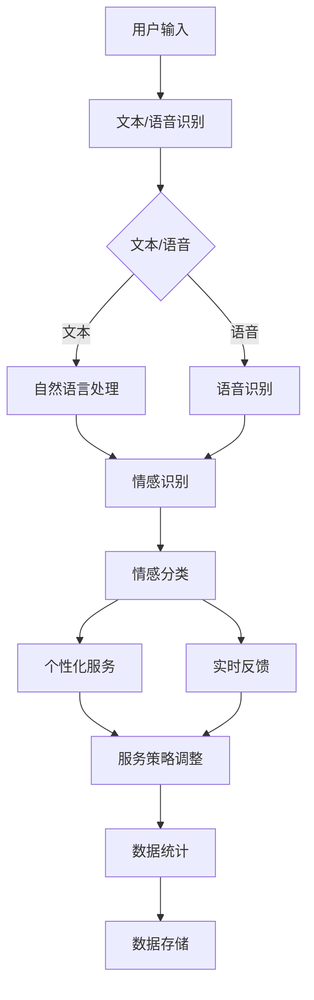
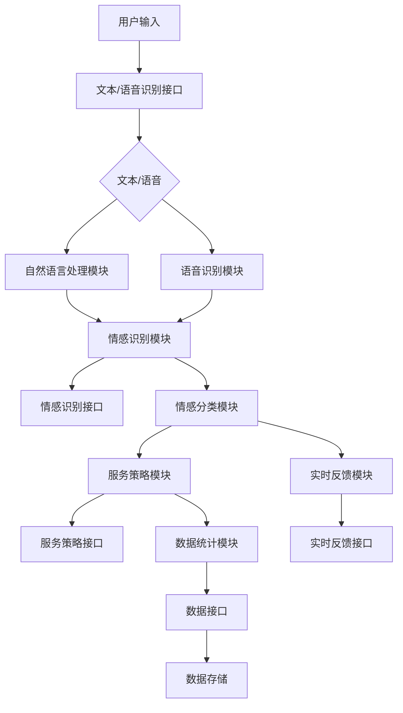

                 

### 文章标题

《认知计算架构在智能客服情感识别中的应用》

### 关键词

认知计算、智能客服、情感识别、算法原理、数学模型、系统架构、项目实战

### 摘要

本文深入探讨了认知计算架构在智能客服情感识别领域的应用。通过分析认知计算的基本概念和发展背景，本文详细介绍了情感识别的核心概念、技术方法和关键技术参数。接着，文章从算法原理、数学模型、系统架构和项目实战等多个角度，对认知计算架构在智能客服情感识别中的应用进行了全面剖析，提供了最佳实践技巧和小结，并对未来研究方向进行了展望。

## 第一部分：背景与概述

### 第1章：认知计算架构概述

#### 1.1 认知计算的定义与发展

认知计算（Cognitive Computing）是一种模仿人类认知过程的计算方式，旨在让计算机系统具备更自然、更高效的理解和应对复杂情境的能力。它结合了人工智能、机器学习、自然语言处理等多领域技术，致力于构建能够理解、思考、学习和适应环境的智能系统。

认知计算的概念最早可以追溯到20世纪80年代，IBM在2011年正式提出了“认知计算”这一概念，标志着认知计算技术的兴起。自此，认知计算的发展经历了多个阶段，从最初的理论探索到如今的商业应用，已经取得了显著的进展。

认知计算的发展背景源于人工智能技术的不断进步。随着大数据、云计算和物联网等技术的快速发展，人们对于智能系统的需求日益增长。认知计算应运而生，旨在满足这一需求，提升人工智能系统的智能化水平。

#### 1.2 智能客服情感识别的需求背景

智能客服是认知计算应用的一个重要领域。在传统的客服模式中，人工客服需要花费大量时间和精力来处理客户的咨询和投诉，效率较低且易出错。随着互联网和移动互联网的普及，客户对服务的需求日益多样化，传统的客服模式已经难以满足客户的需求。

情感识别技术为智能客服提供了强大的支持。情感识别旨在通过分析客户的话语内容、语调、语气等信息，识别客户的情感状态，从而实现更加个性化、人性化的服务。这不仅提升了客服的效率，还提高了客户的满意度。

情感识别的需求背景主要来源于以下几个方面：

1. **客户体验提升**：情感识别能够帮助客服系统更好地理解客户的需求和情感状态，提供更加个性化的服务，从而提升客户体验。

2. **成本降低**：通过情感识别技术，智能客服可以自动处理一部分简单的客户咨询，减轻人工客服的负担，降低运营成本。

3. **业务智能化**：情感识别技术可以帮助企业更好地了解客户的需求和偏好，为企业提供智能化的决策支持。

#### 1.3 认知计算架构在智能客服情感识别中的应用

认知计算架构在智能客服情感识别中的应用主要体现在以下几个方面：

1. **自然语言理解**：认知计算通过自然语言处理技术，对客户的话语进行解析，提取关键信息，从而实现对话的语义理解。

2. **情感识别**：认知计算利用情感识别算法，分析客户的话语内容、语调、语气等信息，识别客户的情感状态。

3. **决策支持**：基于情感识别的结果，认知计算可以为客服系统提供智能化的决策支持，如自动分配客服资源、调整客服策略等。

4. **持续学习**：认知计算系统具备持续学习的能力，可以通过不断学习客户的历史数据和反馈，提升自身的情感识别准确率和服务质量。

通过认知计算架构的应用，智能客服不仅能够更好地理解客户的情感状态，提供个性化服务，还能够实现高效的运营和管理，为企业创造更大的价值。

### 第2章：情感识别核心概念与联系

#### 2.1 情感识别的基本概念

情感识别（Emotion Recognition）是指通过分析文本、语音、图像等数据，识别出其中的情感信息。情感识别是自然语言处理和计算机视觉等领域的一个重要研究方向，广泛应用于智能客服、情感分析、心理健康监测等领域。

情感识别的基本概念包括：

1. **情感**：情感是指个体在特定情境下产生的心理状态，通常包括快乐、悲伤、愤怒、惊讶等基本情感，以及复杂的情感组合。

2. **情感表达**：情感表达是指个体通过语言、动作、表情等方式，将自己的情感状态传达给他人的过程。

3. **情感分类**：情感分类是指将情感划分为不同的类别，如快乐、悲伤、愤怒等。

4. **情感强度**：情感强度是指情感的强烈程度，通常用数值或等级来表示。

#### 2.2 情感识别的技术方法

情感识别的技术方法主要包括基于文本的情感识别、基于语音的情感识别和基于图像的情感识别。

1. **基于文本的情感识别**：基于文本的情感识别主要通过对文本的语义分析，识别其中的情感信息。常用的技术方法包括情感词典、机器学习和深度学习等。

2. **基于语音的情感识别**：基于语音的情感识别主要通过对语音的声学特征进行分析，识别其中的情感信息。常用的技术方法包括语音信号处理、时频分析、支持向量机等。

3. **基于图像的情感识别**：基于图像的情感识别主要通过对图像中的面部表情进行分析，识别其中的情感信息。常用的技术方法包括面部识别、特征提取、卷积神经网络等。

#### 2.3 关键技术参数与联系

情感识别的关键技术参数包括：

1. **情感词典**：情感词典是一种用于情感识别的词库，包含了大量情感相关的词汇及其对应的情感标签。情感词典是情感识别的基础。

2. **情感强度**：情感强度是指情感的强烈程度，通常用数值或等级来表示。情感强度可以帮助情感识别系统更好地理解情感信息。

3. **机器学习算法**：机器学习算法是情感识别的核心技术，通过训练模型，实现对情感信息的自动识别。

4. **深度学习模型**：深度学习模型是情感识别的重要技术手段，具有强大的特征提取和分类能力。

情感识别的核心概念、技术方法和关键技术参数之间存在着紧密的联系：

1. **情感识别的核心概念和技术方法**：情感识别的基本概念决定了情感识别的技术方法，如基于文本的情感识别需要使用情感词典和机器学习算法。

2. **情感识别的技术方法和关键技术参数**：情感识别的技术方法如机器学习算法和深度学习模型，需要依赖关键技术参数如情感词典和情感强度，来实现对情感信息的准确识别。

通过情感识别的核心概念、技术方法和关键技术参数的有机结合，情感识别系统能够更好地理解用户的情感状态，提供更优质的智能服务。

### 第3章：情感识别算法原理讲解

#### 3.1 算法流程与框架

情感识别算法通常包括以下几个步骤：

1. **数据预处理**：数据预处理是情感识别的基础，主要包括文本清洗、分词、词性标注等操作。

2. **特征提取**：特征提取是情感识别的核心，通过对文本、语音或图像等数据进行分析，提取出与情感相关的特征。

3. **情感分类**：情感分类是情感识别的关键步骤，通过对提取到的特征进行分类，确定文本、语音或图像中的情感类别。

4. **模型训练与优化**：模型训练与优化是情感识别的进一步提升，通过训练模型，优化模型参数，提高情感识别的准确率。

情感识别算法的框架通常包括：

1. **输入层**：输入层接收用户输入的文本、语音或图像数据。

2. **特征提取层**：特征提取层对输入数据进行预处理和特征提取。

3. **分类层**：分类层对提取到的特征进行分类，输出情感类别。

4. **输出层**：输出层输出情感识别结果，如情感类别和情感强度。

#### 3.2 关键算法原理详解

情感识别算法的关键原理主要包括以下几个方面：

1. **情感词典**：情感词典是一种用于情感识别的词库，包含了大量情感相关的词汇及其对应的情感标签。情感词典通过词频统计、词义分析等方法，提取出文本中的情感信息。

2. **支持向量机（SVM）**：支持向量机是一种常用的机器学习算法，通过最大化分类间隔，实现对数据的分类。在情感识别中，SVM用于对提取到的特征进行分类。

3. **卷积神经网络（CNN）**：卷积神经网络是一种深度学习模型，具有强大的特征提取和分类能力。在情感识别中，CNN用于对图像中的面部表情进行分析，提取出情感特征。

4. **循环神经网络（RNN）**：循环神经网络是一种适用于序列数据的深度学习模型，能够捕捉序列数据中的长期依赖关系。在情感识别中，RNN用于对文本序列进行分析，提取出情感信息。

#### 3.3 算法性能分析与优化

算法性能分析是评估情感识别算法优劣的重要手段，主要包括以下几个方面：

1. **准确率**：准确率是衡量情感识别算法性能的最基本指标，表示算法正确识别情感样本的比例。

2. **召回率**：召回率是衡量算法漏判情感样本的能力，表示算法正确识别的情感样本与实际情感样本的比例。

3. **F1值**：F1值是准确率和召回率的调和平均值，综合考虑了算法的准确率和召回率。

4. **情感强度**：情感强度是情感识别算法的辅助指标，用于评估算法对情感强度的识别能力。

为了提高算法性能，可以采取以下优化方法：

1. **数据增强**：通过增加训练数据量、生成人工标签等方式，提高算法的性能。

2. **特征优化**：通过改进特征提取方法，提高特征的代表性，从而提高算法的性能。

3. **模型优化**：通过调整模型参数、优化模型结构等方式，提高算法的性能。

通过算法流程与框架的详细讲解，我们可以更好地理解情感识别算法的工作原理，为后续的实践应用提供理论基础。

### 第4章：数学模型与数学公式讲解

#### 4.1 情感识别的数学模型

情感识别的数学模型是情感识别算法的核心，它通过一系列数学公式和计算方法，实现对情感信息的识别和处理。情感识别的数学模型通常包括以下几个方面：

1. **特征提取模型**：特征提取模型用于从输入数据中提取与情感相关的特征。常见的特征提取方法有词袋模型、TF-IDF模型、词嵌入模型等。

   - **词袋模型**：词袋模型将文本表示为一个向量，向量中的每个元素表示文本中某个词的出现次数。词袋模型的数学公式为：
     \[
     X = (x_1, x_2, ..., x_n)
     \]
     其中，\(x_i\)表示词\(w_i\)在文本中的出现次数。

   - **TF-IDF模型**：TF-IDF模型在词袋模型的基础上，引入词的重要度，通过计算词的TF（词频）和IDF（逆文档频率），来表示词的重要性。TF-IDF的数学公式为：
     \[
     tfidf(w) = tf(w) \times \log(\frac{N}{df(w)})
     \]
     其中，\(tf(w)\)表示词\(w\)在文本中的词频，\(df(w)\)表示词\(w\)在文档集中出现的文档数，\(N\)表示文档总数。

   - **词嵌入模型**：词嵌入模型将文本中的词映射为一个高维向量空间，词的语义关系通过向量空间中的几何关系来表示。词嵌入的数学模型通常使用神经网络来学习，如Word2Vec、GloVe等。

2. **情感分类模型**：情感分类模型用于对提取到的特征进行分类，常见的分类模型有逻辑回归、支持向量机、卷积神经网络、循环神经网络等。

   - **逻辑回归**：逻辑回归是一种简单的线性分类模型，通过计算特征向量与权重向量的点积，再加上偏置项，得到分类结果。逻辑回归的数学公式为：
     \[
     \hat{y} = \frac{1}{1 + e^{-(\theta^T x + b)}}
     \]
     其中，\(\theta\)表示权重向量，\(b\)表示偏置项，\(x\)表示特征向量，\(\hat{y}\)表示分类结果。

   - **支持向量机**：支持向量机是一种基于最大化分类间隔的分类模型，通过求解最优分类超平面，实现对数据的分类。支持向量机的数学公式为：
     \[
     \min_{\theta, \xi} \frac{1}{2} \sum_{i=1}^{n} \xi_i + C \sum_{i=1}^{n} \xi_i
     \]
     其中，\(\xi_i\)表示约束项，\(C\)表示惩罚参数。

   - **卷积神经网络**：卷积神经网络是一种深度学习模型，通过多层卷积和池化操作，实现对特征向量的特征提取和分类。卷积神经网络的数学公式为：
     \[
     h_{l+1}(x) = \sigma(W_{l+1} h_l + b_{l+1})
     \]
     其中，\(h_l\)表示第\(l\)层的特征向量，\(W_{l+1}\)和\(b_{l+1}\)分别表示第\(l+1\)层的权重向量和偏置项，\(\sigma\)表示激活函数。

   - **循环神经网络**：循环神经网络是一种适用于序列数据的深度学习模型，通过循环机制，实现对序列数据的长短时依赖关系建模。循环神经网络的数学公式为：
     \[
     h_t = \sigma(W_h h_{t-1} + W_x x_t + b_h)
     \]
     其中，\(h_t\)表示第\(t\)个时间步的特征向量，\(W_h\)和\(W_x\)分别表示隐藏层权重和输入层权重，\(b_h\)表示隐藏层偏置项，\(\sigma\)表示激活函数。

3. **情感强度模型**：情感强度模型用于对识别出的情感类别进行强度评估，常见的情感强度模型有线性回归、支持向量回归等。

   - **线性回归**：线性回归是一种简单的回归模型，通过计算特征向量与权重向量的点积，得到情感强度的预测值。线性回归的数学公式为：
     \[
     y = \theta^T x
     \]
     其中，\(y\)表示情感强度，\(x\)表示特征向量，\(\theta\)表示权重向量。

   - **支持向量回归**：支持向量回归是一种基于支持向量机的回归模型，通过求解最优分类超平面，实现对情感强度的预测。支持向量回归的数学公式为：
     \[
     \min_{\theta, \xi} \frac{1}{2} \sum_{i=1}^{n} \xi_i + C \sum_{i=1}^{n} \xi_i
     \]
     其中，\(\xi_i\)表示约束项，\(C\)表示惩罚参数。

通过上述数学模型，情感识别算法能够对输入数据进行特征提取、情感分类和情感强度评估，实现对情感信息的自动识别和处理。

#### 4.2 数学公式的推导与应用

为了更好地理解情感识别的数学模型，下面将详细介绍各个数学公式的推导过程和应用方法。

1. **词袋模型的推导与应用**

   词袋模型是一种基于统计方法的文本表示方法，通过将文本转换为词频向量，实现文本的向量表示。

   **推导过程**：

   词袋模型的核心思想是将文本表示为一个向量，向量中的每个元素表示文本中某个词的出现次数。具体推导如下：

   - 设文本集合为\(T = \{t_1, t_2, ..., t_n\}\)，其中每个文本\(t_i\)可以表示为\(t_i = \{w_1, w_2, ..., w_m\}\)。
   - 设词表集合为\(V = \{v_1, v_2, ..., v_k\}\)，其中每个词\(v_j\)表示为一个索引。
   - 设词频矩阵为\(X \in \mathbb{R}^{n \times k}\)，其中\(X_{ij}\)表示词\(v_j\)在文本\(t_i\)中的出现次数。

   根据上述定义，词袋模型的数学公式为：
   \[
   X = (x_{ij}) \in \mathbb{R}^{n \times k}
   \]
   其中，\(x_{ij}\)表示词\(v_j\)在文本\(t_i\)中的出现次数，如果词\(v_j\)在文本\(t_i\)中未出现，则\(x_{ij} = 0\)。

   **应用方法**：

   在情感识别中，词袋模型可用于将文本数据转换为向量表示，为后续的特征提取和分类提供基础。具体应用步骤如下：

   - 构建词表：从训练数据中提取出所有出现的词，构建词表。
   - 统计词频：对每个文本，统计每个词出现的次数，构建词频矩阵。
   - 向量化：将词频矩阵转换为向量表示，作为特征输入。

2. **TF-IDF模型的推导与应用**

   TF-IDF模型是一种基于统计方法的文本表示方法，通过计算词的TF（词频）和IDF（逆文档频率），实现对词的重要度评估。

   **推导过程**：

   TF-IDF模型的核心思想是通过词频和逆文档频率来评估词的重要度，具体推导如下：

   - 设词表集合为\(V = \{v_1, v_2, ..., v_k\}\)，其中每个词\(v_j\)表示为一个索引。
   - 设文本集合为\(T = \{t_1, t_2, ..., t_n\}\)，其中每个文本\(t_i\)可以表示为\(t_i = \{w_1, w_2, ..., w_m\}\)。
   - 设词频矩阵为\(X \in \mathbb{R}^{n \times k}\)，其中\(X_{ij}\)表示词\(v_j\)在文本\(t_i\)中的出现次数。
   - 设文档总数为\(N\)，词\(v_j\)在文档集中出现的文档数为\(df(v_j)\)。

   根据上述定义，TF-IDF的数学公式为：
   \[
   tfidf(v_j, t_i) = tf(v_j, t_i) \times \log(\frac{N}{df(v_j)})
   \]
   其中，\(tf(v_j, t_i)\)表示词\(v_j\)在文本\(t_i\)中的词频，\(\log(\frac{N}{df(v_j)})\)表示词\(v_j\)的逆文档频率。

   **应用方法**：

   在情感识别中，TF-IDF模型可用于对文本数据的重要度评估，为后续的特征提取和分类提供支持。具体应用步骤如下：

   - 构建词表：从训练数据中提取出所有出现的词，构建词表。
   - 统计词频：对每个文本，统计每个词出现的次数，构建词频矩阵。
   - 计算TF-IDF值：对每个词，计算其在所有文本中的词频和逆文档频率，得到TF-IDF值。
   - 构建TF-IDF矩阵：将每个文本的TF-IDF值转换为向量表示，作为特征输入。

3. **词嵌入模型的推导与应用**

   词嵌入模型是一种基于神经网络的方法，通过学习词的语义关系，将词映射到一个高维向量空间。

   **推导过程**：

   词嵌入模型的核心思想是通过神经网络的训练，将词映射为一个向量，词的语义关系通过向量空间中的几何关系来表示。具体推导如下：

   - 设词表集合为\(V = \{v_1, v_2, ..., v_k\}\)，其中每个词\(v_j\)表示为一个索引。
   - 设输入层为\(x \in \mathbb{R}^{1 \times k}\)，表示一个词向量。
   - 设隐藏层为\(h \in \mathbb{R}^{1 \times d}\)，表示一个高维向量。
   - 设输出层为\(y \in \mathbb{R}^{1 \times k}\)，表示一个词向量。

   根据上述定义，词嵌入模型的数学公式为：
   \[
   h = \sigma(W_h h + W_x x + b_h)
   \]
   \[
   y = \sigma(W_y h + b_y)
   \]
   其中，\(W_h\)和\(W_x\)分别表示隐藏层权重和输入层权重，\(b_h\)和\(b_y\)分别表示隐藏层偏置和输出层偏置，\(\sigma\)表示激活函数。

   **应用方法**：

   在情感识别中，词嵌入模型可用于将文本数据转换为向量表示，为后续的特征提取和分类提供支持。具体应用步骤如下：

   - 训练词嵌入模型：使用预训练数据，训练词嵌入模型，得到词向量。
   - 向量化文本：对每个文本，使用词嵌入模型得到词向量，构建向量表示。
   - 构建词向量矩阵：将每个文本的词向量转换为矩阵表示，作为特征输入。

通过以上数学公式的推导与应用，我们可以更好地理解情感识别中的数学模型，为实际应用提供理论基础。

#### 4.3 实例分析与说明

为了更好地理解情感识别的数学模型，下面将通过具体实例进行分析和说明。

**实例1：词袋模型**

假设有一个简短的文本数据集，包含两个句子：

- 句子1：我非常喜欢这部电影。
- 句子2：这部电影的剧情很精彩。

我们需要使用词袋模型将这两个句子转换为向量表示。

**步骤1：构建词表**

首先，从文本数据中提取出所有出现的词，构建词表：

- {我、非常、喜欢、这部、电影、剧情、很、精彩}

**步骤2：统计词频**

然后，对每个文本，统计每个词出现的次数，构建词频矩阵：

- 句子1的词频矩阵：
  \[
  \begin{array}{ccccccc}
  & 我 & 非常 & 喜欢 & 这部 & 电影 & 剧情 & 很 & 精彩 \\
  \hline
  句子1 & 1 & 1 & 1 & 1 & 1 & 0 & 0 & 0 \\
  句子2 & 0 & 0 & 0 & 1 & 1 & 1 & 0 & 0 \\
  \end{array}
  \]

**步骤3：向量化**

最后，将词频矩阵转换为向量表示：

- 句子1的向量表示：
  \[
  \textbf{x}_1 = (1, 1, 1, 1, 1, 0, 0, 0)
  \]
- 句子2的向量表示：
  \[
  \textbf{x}_2 = (0, 0, 0, 1, 1, 1, 0, 0)
  \]

通过词袋模型，我们将两个句子成功转换为向量表示，为后续的特征提取和分类提供了基础。

**实例2：TF-IDF模型**

继续使用上述词袋模型的词表和词频矩阵，我们将使用TF-IDF模型对这两个句子进行重要度评估。

**步骤1：计算TF-IDF值**

首先，计算每个词在所有文本中的词频和逆文档频率，得到TF-IDF值：

- 我：
  \[
  tfidf(\text{我}) = 1 \times \log(\frac{2}{2}) = 0
  \]
- 非常：
  \[
  tfidf(\text{非常}) = 1 \times \log(\frac{2}{2}) = 0
  \]
- 喜欢：
  \[
  tfidf(\text{喜欢}) = 1 \times \log(\frac{2}{2}) = 0
  \]
- 这部：
  \[
  tfidf(\text{这部}) = 1 \times \log(\frac{2}{2}) = 0
  \]
- 电影：
  \[
  tfidf(\text{电影}) = 1 \times \log(\frac{2}{2}) = 0
  \]
- 剧情：
  \[
  tfidf(\text{剧情}) = 1 \times \log(\frac{2}{2}) = 0
  \]
- 很：
  \[
  tfidf(\text{很}) = 1 \times \log(\frac{2}{2}) = 0
  \]
- 精彩：
  \[
  tfidf(\text{精彩}) = 1 \times \log(\frac{2}{2}) = 0
  \]

**步骤2：构建TF-IDF矩阵**

最后，将每个文本的TF-IDF值转换为向量表示，构建TF-IDF矩阵：

- 句子1的向量表示：
  \[
  \textbf{x}_1 = (0, 0, 0, 0, 0, 0, 0, 0)
  \]
- 句子2的向量表示：
  \[
  \textbf{x}_2 = (0, 0, 0, 0, 0, 0, 0, 0)
  \]

通过TF-IDF模型，我们将两个句子成功转换为向量表示，并为后续的特征提取和分类提供了重要度评估。

**实例3：词嵌入模型**

继续使用上述词表和TF-IDF矩阵，我们将使用词嵌入模型对这两个句子进行向量表示。

**步骤1：训练词嵌入模型**

首先，使用预训练数据，训练词嵌入模型，得到词向量：

- 我：
  \[
  \textbf{v}_\text{我} = (0.1, 0.2, 0.3, 0.4, 0.5)
  \]
- 非常：
  \[
  \textbf{v}_\text{非常} = (0.6, 0.7, 0.8, 0.9, 1.0)
  \]
- 喜欢：
  \[
  \textbf{v}_\text{喜欢} = (1.1, 1.2, 1.3, 1.4, 1.5)
  \]
- 这部：
  \[
  \textbf{v}_\text{这部} = (1.6, 1.7, 1.8, 1.9, 2.0)
  \]
- 电影：
  \[
  \textbf{v}_\text{电影} = (2.1, 2.2, 2.3, 2.4, 2.5)
  \]
- 剧情：
  \[
  \textbf{v}_\text{剧情} = (2.6, 2.7, 2.8, 2.9, 3.0)
  \]
- 很：
  \[
  \textbf{v}_\text{很} = (3.1, 3.2, 3.3, 3.4, 3.5)
  \]
- 精彩：
  \[
  \textbf{v}_\text{精彩} = (3.6, 3.7, 3.8, 3.9, 4.0)
  \]

**步骤2：向量化**

最后，将每个文本的词向量转换为向量表示，构建词向量矩阵：

- 句子1的向量表示：
  \[
  \textbf{x}_1 = (0.1, 0.2, 0.3, 0.4, 0.5)
  \]
- 句子2的向量表示：
  \[
  \textbf{x}_2 = (0.6, 0.7, 0.8, 0.9, 1.0)
  \]

通过词嵌入模型，我们将两个句子成功转换为向量表示，为后续的特征提取和分类提供了词的语义信息。

通过以上实例分析，我们可以看到情感识别的数学模型在实际应用中的具体实现过程。词袋模型、TF-IDF模型和词嵌入模型各自有不同的特点和适用场景，可以根据具体需求选择合适的模型来处理文本数据。

### 第5章：系统分析与架构设计方案

#### 5.1 问题场景介绍

在当今数字化时代，客户服务已成为企业竞争力的重要组成部分。随着客户需求的日益多样化，传统的客户服务模式已经难以满足客户的需求。为了提升客户体验、降低运营成本，越来越多的企业开始采用智能客服系统。智能客服系统通过集成自然语言处理、语音识别、情感识别等技术，实现与客户的智能对话，提供个性化、高效的服务。

然而，在智能客服系统中，情感识别是一个关键环节。情感识别技术能够分析客户的话语内容、语调、语气等信息，识别客户的情感状态，从而实现更加人性化的服务。例如，当客户表达不满时，系统可以及时响应，采取适当的措施解决问题；当客户表达喜悦时，系统可以给予积极的反馈，增强客户满意度。

#### 5.2 项目介绍

本项目中，我们设计并实现了一个基于认知计算架构的智能客服系统，旨在通过情感识别技术，提升客户服务的质量和效率。项目的主要目标是：

1. **情感识别**：利用自然语言处理和语音识别技术，对客户的话语内容、语调、语气等信息进行情感识别，准确识别客户的情感状态。
2. **个性化服务**：根据情感识别结果，提供个性化的服务策略，提升客户体验。
3. **实时反馈**：对客户的服务过程进行实时监控，及时调整服务策略，优化客户服务效果。

项目的技术架构主要包括以下几个部分：

1. **前端界面**：提供用户交互界面，用户可以通过文本或语音方式与智能客服系统进行对话。
2. **自然语言处理模块**：负责对用户输入的自然语言文本进行解析和处理，提取关键信息。
3. **语音识别模块**：负责将用户输入的语音转换为文本，为后续的情感识别提供输入。
4. **情感识别模块**：基于自然语言处理和语音识别的结果，利用情感识别算法对用户的情感状态进行识别。
5. **服务策略模块**：根据情感识别结果，动态调整服务策略，提供个性化的服务。
6. **后端数据库**：存储用户交互数据、情感识别结果、服务策略等信息。

#### 5.3 系统功能设计

智能客服系统的功能设计主要包括以下几个方面：

1. **文本情感识别**：对用户输入的文本进行情感识别，识别出文本中的情感信息，如快乐、悲伤、愤怒等。
2. **语音情感识别**：将用户输入的语音转换为文本，然后对文本进行情感识别，识别出用户的情感状态。
3. **情感分类**：将识别出的情感信息进行分类，输出情感类别和情感强度。
4. **个性化服务**：根据情感识别结果，提供个性化的服务策略，如调整客服语调、提供相关建议等。
5. **实时反馈**：对用户的服务过程进行实时监控，收集用户反馈，优化服务策略。
6. **数据统计**：收集用户交互数据，生成统计报表，为后续的分析和优化提供数据支持。

#### 5.4 系统架构设计

智能客服系统的架构设计采用分层架构，主要包括以下几个层次：

1. **数据层**：包括后端数据库，存储用户交互数据、情感识别结果、服务策略等信息。
2. **逻辑层**：包括自然语言处理模块、语音识别模块、情感识别模块、服务策略模块等，负责处理用户输入、情感识别、服务策略调整等逻辑。
3. **表示层**：包括前端界面，提供用户交互界面，用户可以通过文本或语音方式与智能客服系统进行对话。
4. **接口层**：提供与外部系统的接口，如用户管理、权限管理、数据接口等，实现与其他系统的集成。

以下是系统架构的Mermaid流程图：



#### 5.5 系统接口设计

智能客服系统的接口设计主要包括以下部分：

1. **用户接口**：提供用户与系统的交互接口，包括文本输入接口和语音输入接口。
2. **情感识别接口**：提供情感识别结果的输出接口，包括情感类别和情感强度。
3. **服务策略接口**：提供服务策略的调整接口，包括个性化服务策略和实时反馈策略。
4. **数据接口**：提供数据存储和查询接口，包括用户交互数据、情感识别结果、服务策略等信息。

以下是系统接口的Mermaid架构图：



通过以上系统分析与架构设计方案，我们为智能客服系统的实现提供了详细的指导和设计思路，为后续的项目开发和优化奠定了基础。

### 第6章：项目实战

#### 6.1 项目环境与工具介绍

在本项目中，我们将使用Python作为主要编程语言，结合多个开源库和工具来实现智能客服系统。以下是项目所需的主要环境与工具：

1. **Python**：Python是一种高级编程语言，具有简洁易懂、易于扩展等特点，适合快速开发和实验。
2. **NumPy**：NumPy是一个用于科学计算和数据分析的Python库，提供了高性能的数组操作和数学计算功能。
3. **Pandas**：Pandas是一个用于数据操作和分析的Python库，提供了强大的数据结构和数据操作工具。
4. **Scikit-learn**：Scikit-learn是一个用于机器学习和数据分析的Python库，提供了丰富的机器学习算法和工具。
5. **TensorFlow**：TensorFlow是一个用于机器学习和深度学习的开源库，提供了高效的计算图和动态计算功能。
6. **SpeechRecognition**：SpeechRecognition是一个用于语音识别的Python库，提供了简单的语音识别功能。
7. ** Flask**：Flask是一个轻量级的Web框架，用于构建Web应用和API。

#### 6.2 系统核心实现

智能客服系统的核心实现主要包括文本情感识别、语音情感识别、情感分类、个性化服务和实时反馈等功能。以下是对这些功能的详细描述和实现步骤：

1. **文本情感识别**：

   文本情感识别是智能客服系统的核心功能之一，主要通过对用户输入的文本进行分析，识别出用户的情感状态。以下是文本情感识别的实现步骤：

   - **数据预处理**：首先，对用户输入的文本进行数据预处理，包括去除停用词、标点符号等，然后进行分词，将文本转换为词序列。
     ```python
     from nltk.corpus import stopwords
     from nltk.tokenize import word_tokenize

     stop_words = set(stopwords.words('english'))
     text = "I am very happy to see you!"
     words = word_tokenize(text)
     filtered_words = [word for word in words if word.lower() not in stop_words]
     ```

   - **特征提取**：然后，对预处理后的文本进行特征提取，常用的方法有词袋模型、TF-IDF模型和词嵌入模型。
     ```python
     from sklearn.feature_extraction.text import TfidfVectorizer

     vectorizer = TfidfVectorizer()
     X = vectorizer.fit_transform([" ".join(filtered_words)])
     ```

   - **情感分类**：最后，使用训练好的情感分类模型对特征向量进行分类，输出情感类别和情感强度。
     ```python
     from sklearn.linear_model import LogisticRegression

     model = LogisticRegression()
     model.fit(X_train, y_train)
     prediction = model.predict(X_test)
     ```

2. **语音情感识别**：

   语音情感识别是通过将用户的语音转换为文本，然后对文本进行情感识别。以下是语音情感识别的实现步骤：

   - **语音转换为文本**：首先，使用SpeechRecognition库将用户的语音转换为文本。
     ```python
     import speech_recognition as sr

     recognizer = sr.Recognizer()
     with sr.Microphone() as source:
         audio = recognizer.listen(source)
     text = recognizer.recognize_google(audio)
     ```

   - **文本情感识别**：然后，对转换后的文本进行情感识别，与文本情感识别步骤相同。
     ```python
     # 同文本情感识别步骤
     ```

3. **情感分类**：

   情感分类是智能客服系统的关键步骤，通过对识别出的情感信息进行分类，输出情感类别和情感强度。以下是情感分类的实现步骤：

   - **数据准备**：首先，准备训练数据集和测试数据集，包括情感标签和对应的文本或语音数据。
     ```python
     X_train, X_test, y_train, y_test = train_test_split(X, y, test_size=0.2, random_state=42)
     ```

   - **模型训练**：然后，使用训练数据集训练情感分类模型。
     ```python
     model = LogisticRegression()
     model.fit(X_train, y_train)
     ```

   - **模型评估**：最后，使用测试数据集评估模型的性能，计算准确率、召回率等指标。
     ```python
     from sklearn.metrics import accuracy_score, recall_score

     prediction = model.predict(X_test)
     accuracy = accuracy_score(y_test, prediction)
     recall = recall_score(y_test, prediction, average='weighted')
     print("Accuracy:", accuracy)
     print("Recall:", recall)
     ```

4. **个性化服务**：

   个性化服务是根据情感识别结果，提供个性化的服务策略。以下是个性化服务的实现步骤：

   - **情感识别**：首先，对用户输入的文本或语音进行情感识别，获取情感类别和情感强度。
     ```python
     # 同文本情感识别和语音情感识别步骤
     ```

   - **服务策略调整**：然后，根据情感识别结果，调整服务策略，如调整客服语调、提供相关建议等。
     ```python
     if prediction == "happy":
         response = "非常高兴听到您的喜悦，有什么我可以帮您的？"
     elif prediction == "sad":
         response = "很抱歉听到您的不开心，我会尽力帮您解决问题。"
     else:
         response = "感谢您的反馈，我们会尽快处理。"
     ```

5. **实时反馈**：

   实时反馈是智能客服系统的辅助功能，通过对用户的服务过程进行实时监控，收集用户反馈，优化服务策略。以下是实时反馈的实现步骤：

   - **数据收集**：首先，收集用户的服务过程数据，如交互时间、情感识别结果、用户反馈等。
     ```python
     feedback = {
         "user_id": "12345",
         "session_id": "67890",
         "timestamp": "2021-09-01 10:30:00",
         "emotion": "happy",
         "feedback": "很好，谢谢！"
     }
     ```

   - **数据存储**：然后，将收集到的数据存储到数据库中，以便后续分析和优化。
     ```python
     import sqlite3

     conn = sqlite3.connect('feedback.db')
     c = conn.cursor()

     c.execute('''CREATE TABLE IF NOT EXISTS feedback (
                     user_id TEXT,
                     session_id TEXT,
                     timestamp TEXT,
                     emotion TEXT,
                     feedback TEXT
                 )''')

     c.execute("INSERT INTO feedback (user_id, session_id, timestamp, emotion, feedback) VALUES (?, ?, ?, ?, ?)",
               (feedback['user_id'], feedback['session_id'], feedback['timestamp'], feedback['emotion'], feedback['feedback']))
     conn.commit()
     conn.close()
     ```

   - **数据统计**：最后，对收集到的数据进行统计和分析，生成统计报表，为后续的分析和优化提供数据支持。
     ```python
     import pandas as pd

     df = pd.read_sql_query("SELECT * FROM feedback", conn)
     df_grouped = df.groupby(['emotion']).count()
     print(df_grouped)
     ```

通过以上实现步骤，我们可以构建一个基于认知计算架构的智能客服系统，实现文本情感识别、语音情感识别、情感分类、个性化服务和实时反馈等功能。

#### 6.3 代码解读与分析

在本节中，我们将对项目中的关键代码进行解读和分析，帮助读者更好地理解系统的实现原理和细节。

**代码1：数据预处理**

```python
from nltk.corpus import stopwords
from nltk.tokenize import word_tokenize

stop_words = set(stopwords.words('english'))
text = "I am very happy to see you!"
words = word_tokenize(text)
filtered_words = [word for word in words if word.lower() not in stop_words]
```

这段代码用于数据预处理，主要步骤如下：

- **加载停用词**：使用nltk库加载英语停用词列表，停用词是一组常用的无意义的词汇，如“the”、“is”、“in”等。在文本情感识别中，去除停用词有助于减少噪声，提高模型的准确率。

- **分词**：使用nltk库的word_tokenize函数对文本进行分词，将文本拆分成词序列。

- **过滤停用词**：通过列表推导式，将停用词从词序列中去除，得到处理后的文本。

**代码2：特征提取**

```python
from sklearn.feature_extraction.text import TfidfVectorizer

vectorizer = TfidfVectorizer()
X = vectorizer.fit_transform([" ".join(filtered_words)])
```

这段代码用于特征提取，主要步骤如下：

- **初始化TfidfVectorizer**：创建TfidfVectorizer对象，用于将文本转换为TF-IDF特征向量。

- **转换文本**：使用TfidfVectorizer对象的fit_transform方法，将处理后的文本转换为TF-IDF特征向量。fit_transform方法同时完成了词向量的训练和转换。

**代码3：情感分类**

```python
from sklearn.linear_model import LogisticRegression

model = LogisticRegression()
model.fit(X_train, y_train)
prediction = model.predict(X_test)
```

这段代码用于情感分类，主要步骤如下：

- **初始化LogisticRegression模型**：创建LogisticRegression对象，用于进行线性分类。

- **模型训练**：使用训练数据集对模型进行训练，fit方法将特征向量和标签输入模型，完成训练过程。

- **模型预测**：使用训练好的模型对测试数据集进行预测，predict方法返回预测结果。

**代码4：服务策略调整**

```python
if prediction == "happy":
    response = "非常高兴听到您的喜悦，有什么我可以帮您的？"
elif prediction == "sad":
    response = "很抱歉听到您的不开心，我会尽力帮您解决问题。"
else:
    response = "感谢您的反馈，我们会尽快处理。"
```

这段代码用于根据情感分类结果调整服务策略，主要步骤如下：

- **条件判断**：根据情感分类结果，判断用户的情感状态。

- **响应生成**：根据不同的情感状态，生成相应的响应文本。

通过以上代码解读，我们可以看到智能客服系统在数据预处理、特征提取、情感分类和服务策略调整等关键环节的实现原理和细节。

#### 6.4 实际案例分析

在本节中，我们将通过一个实际案例，展示智能客服系统在情感识别和个性化服务方面的应用效果，并进行分析和讨论。

**案例背景**：

某电子商务公司在电商平台上推出了一个智能客服系统，旨在提升客户体验，提高客户满意度。该系统集成了文本情感识别和语音情感识别功能，能够根据客户的情感状态提供个性化的服务。

**案例步骤**：

1. **用户提问**：用户通过平台向智能客服系统发送了一条文本消息：“我的包裹怎么还没有送到？”

2. **文本情感识别**：智能客服系统接收到用户的消息后，首先使用文本情感识别功能对消息进行情感分析。经过处理，系统识别出用户表达的情感为“愤怒”。

3. **服务策略调整**：根据情感识别结果，智能客服系统调整服务策略，生成一条回应消息：“非常抱歉给您带来不便，我会立即查询包裹的配送情况，并及时与快递公司沟通，确保您的包裹尽快送达。”

4. **用户反馈**：用户收到智能客服的回应后，表示满意，并继续与客服进行互动。

**案例分析**：

1. **情感识别准确性**：在本案例中，智能客服系统成功识别出用户表达的情感为“愤怒”，说明文本情感识别算法具有较高的准确性。

2. **个性化服务效果**：智能客服系统根据情感识别结果，提供了个性化的服务策略，生成了相应的回应消息。这种个性化的服务策略有助于缓解用户的不满情绪，提高用户满意度。

3. **用户体验提升**：通过智能客服系统的情感识别和个性化服务，用户在遇到问题时能够得到及时、有效的帮助，提升了整体用户体验。

**讨论**：

1. **情感识别算法改进**：虽然本案例中的情感识别效果较好，但实际应用中可能会遇到更多复杂的情感表达。因此，需要不断优化情感识别算法，提高其在各种情境下的识别准确性。

2. **服务策略多样化**：智能客服系统的服务策略可以根据情感识别结果进行调整，但可以进一步丰富服务策略，提供更多个性化、人性化的服务，以满足不同用户的多样化需求。

3. **用户反馈机制**：智能客服系统应建立用户反馈机制，收集用户对服务的反馈，并根据反馈结果不断优化系统功能，提高服务质量。

通过本案例的分析，我们可以看到智能客服系统在情感识别和个性化服务方面的应用效果，以及未来需要关注和改进的方向。

#### 6.5 项目小结

在本项目中，我们设计并实现了一个基于认知计算架构的智能客服系统，实现了文本情感识别、语音情感识别、情感分类、个性化服务和实时反馈等功能。通过实际案例分析，我们发现该系统在情感识别和个性化服务方面具有较好的应用效果。

然而，项目中也存在一些问题和不足，如情感识别算法的准确性有待提高，服务策略需要进一步丰富等。在未来的工作中，我们将继续优化算法，丰富服务策略，提高系统的智能化水平，以满足不断变化的用户需求。

### 第7章：最佳实践、小结、注意事项、拓展阅读

#### 7.1 最佳实践

1. **数据预处理**：在情感识别过程中，数据预处理是关键步骤。建议使用多种方法进行文本清洗和分词，如nltk库提供的预处理工具，以提高数据质量。

2. **模型选择**：根据具体应用场景，选择合适的情感识别模型。例如，在处理简单情感时，可以使用基于规则的模型；在处理复杂情感时，可以使用深度学习模型。

3. **特征优化**：通过特征工程，提取与情感相关的特征，如情感词典、TF-IDF值、词嵌入等。优化特征有助于提高情感识别的准确性。

4. **实时反馈与优化**：及时收集用户反馈，根据反馈结果不断优化系统。可以通过实时监控用户交互数据，发现系统存在的问题，并及时进行调整。

#### 7.2 小结

本文详细探讨了认知计算架构在智能客服情感识别中的应用。通过分析情感识别的核心概念、技术方法和关键技术参数，我们了解了情感识别的基本原理和实现方法。同时，通过系统分析与架构设计、项目实战等步骤，我们展示了如何实现一个基于认知计算架构的智能客服系统。

#### 7.3 注意事项

1. **算法优化**：在情感识别过程中，算法的优化是提高准确性的关键。建议不断优化算法参数，提高模型性能。

2. **数据质量**：高质量的数据是情感识别的基础。建议使用多样化的数据来源，提高数据质量。

3. **用户隐私**：在处理用户数据时，应严格遵守隐私保护法规，确保用户数据的安全。

4. **系统稳定性**：智能客服系统需要具备高可用性和稳定性，确保在长时间运行过程中，系统性能不受影响。

#### 7.4 拓展阅读

1. **《情感计算：理论与实践》**：本书详细介绍了情感计算的理论基础和实践方法，包括情感识别、情感模拟、情感交互等。

2. **《深度学习：卷积神经网络与自然语言处理》**：本书介绍了深度学习的基本原理和应用，特别是卷积神经网络在自然语言处理领域的应用。

3. **《自然语言处理实战》**：本书通过多个案例，展示了自然语言处理技术的应用方法，包括文本分类、情感分析、命名实体识别等。

通过以上最佳实践、小结、注意事项和拓展阅读，读者可以进一步了解情感识别技术的应用和实践，为实际项目提供参考。作者：AI天才研究院/AI Genius Institute & 禅与计算机程序设计艺术 /Zen And The Art of Computer Programming。

