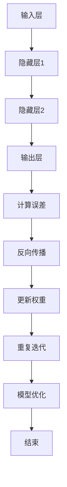
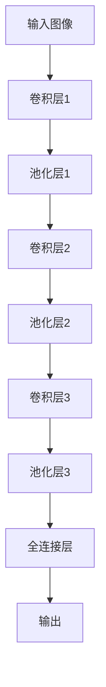
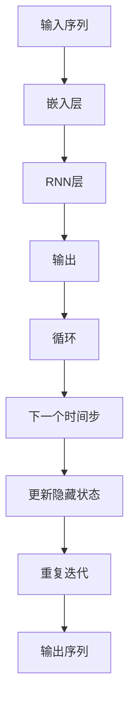
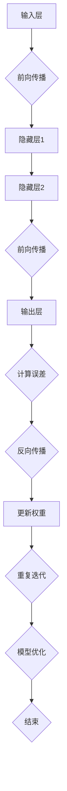
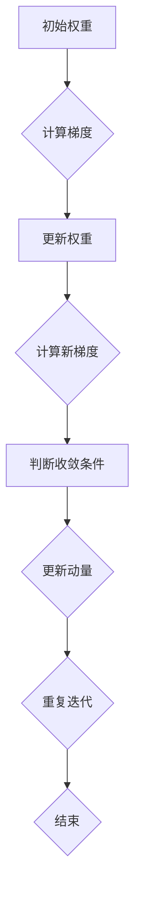
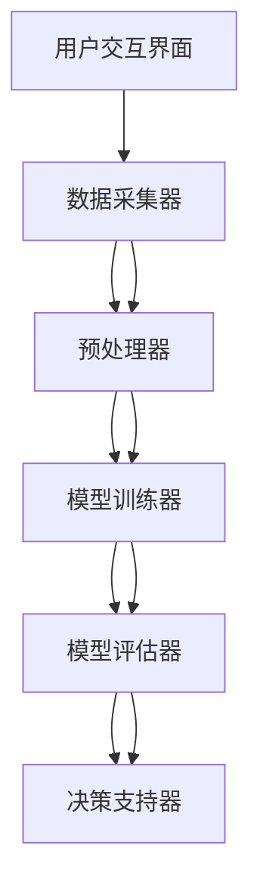
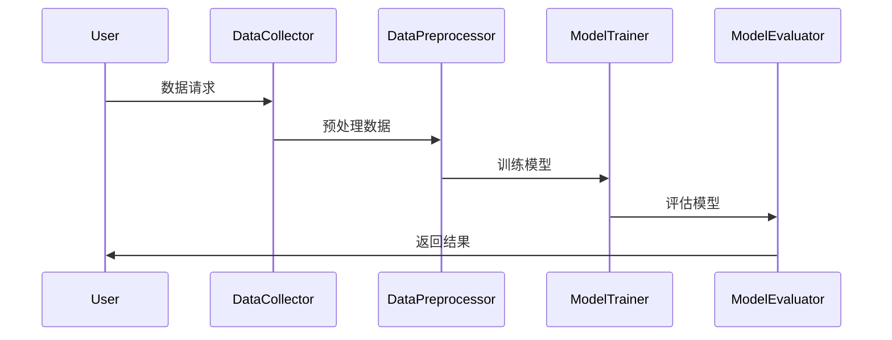

                 

### 认知计算模型概述

#### 1.1 问题背景与现状

**问题背景**

在人工智能（AI）迅速发展的今天，模拟人类认知和决策过程成为了一个热门研究方向。传统的计算机程序在执行任务时通常依赖于预定义的规则和算法，而无法像人类那样进行复杂的推理和决策。这限制了AI在许多领域的应用，尤其是在需要复杂判断和灵活适应的情境中。因此，提出认知计算模型（Cognitive Computing Model）成为解决这一问题的关键。

**现状**

认知计算模型的研究和应用已经取得了一定的进展。研究者们通过模拟人类大脑的神经元结构和工作原理，构建了能够处理复杂信息、进行自主学习和决策的计算机模型。这些模型在图像识别、自然语言处理、游戏策略等领域都展现出了出色的性能。

然而，认知计算模型仍然面临许多挑战。例如，模型的复杂性使得其设计和优化过程十分困难；模型的解释性不足，使得其决策过程难以被理解和验证；模型在不同应用场景中的适应性和泛化能力也有待提高。

#### 1.2 人类决策过程解析

**决策过程中的认知要素**

人类决策过程涉及多个认知要素，包括感知、记忆、推理和判断等。这些要素相互作用，共同影响决策的结果。例如，感知帮助我们获取外界信息，记忆存储过去的经验和知识，推理帮助我们基于现有信息进行逻辑推断，判断则帮助我们选择最佳行动方案。

**决策过程中的信息处理**

人类在决策过程中需要处理大量的信息，包括直接感知到的信息、记忆中的信息以及来自外界的信息。这些信息需要通过复杂的神经网络进行处理和整合，才能形成有效的决策。

**决策中的心理与社会因素**

除了认知因素，心理和社会因素也会影响人类决策过程。例如，情绪、动机、社会期望和文化背景等都会对决策产生重要影响。

#### 1.3 认知计算模型的基本概念

**定义**

认知计算模型是一种模拟人类认知和决策过程的计算机模型，它通过模拟人类大脑的神经元结构和功能，实现信息处理、学习和决策。

**关键特征**

1. **自主学习能力**：认知计算模型能够通过数据驱动的方式不断学习和优化自身性能。
2. **推理能力**：模型能够基于现有知识和信息进行逻辑推理，生成新的知识和决策。
3. **解释性**：模型的决策过程和结果可以被理解和解释，有助于提升模型的可靠性和可信任度。

**应用领域**

认知计算模型在多个领域都有广泛的应用，包括医疗诊断、金融分析、智能客服、自动驾驶等。

#### 1.4 认知计算模型的核心原理

**神经网络与认知模拟**

认知计算模型的核心是基于神经网络（Neural Network）的模拟。神经网络通过模拟大脑神经元的工作原理，实现信息处理和学习。

**数学基础**

认知计算模型的数学基础包括线性代数、微积分和概率论等。这些数学工具帮助我们理解和优化神经网络的工作原理。

**技术路径**

认知计算模型的技术路径主要包括深度学习、强化学习和迁移学习等。这些技术帮助我们在不同场景下实现高效的认知模拟和决策支持。

#### 1.5 认知计算模型的设计框架

**模型构建的基本步骤**

1. **需求分析**：明确模型的应用目标和需求。
2. **数据收集与预处理**：收集相关数据，并进行预处理。
3. **模型设计**：选择合适的神经网络结构，并进行参数调整。
4. **模型训练**：使用训练数据对模型进行训练。
5. **模型评估**：使用测试数据评估模型性能。
6. **模型优化**：根据评估结果对模型进行调整。

**模型训练与优化的策略**

1. **数据增强**：通过增加数据多样性来提高模型泛化能力。
2. **损失函数**：选择合适的损失函数，以衡量模型预测的误差。
3. **优化算法**：使用梯度下降等优化算法，快速找到模型最优参数。

**模型评估与验证的方法**

1. **交叉验证**：通过将数据划分为多个部分，反复训练和评估模型。
2. **测试集评估**：使用独立的测试集对模型进行评估。
3. **指标分析**：使用准确率、召回率、F1值等指标分析模型性能。

#### 1.6 认知计算模型在决策支持中的应用

**决策支持系统简介**

决策支持系统（DSS）是一种利用计算机技术和人工智能方法，帮助决策者进行决策的系统。认知计算模型可以作为DSS的核心模块，提供智能化的决策支持。

**认知计算模型在决策支持中的应用案例**

1. **医疗诊断**：利用认知计算模型对医疗数据进行分析，辅助医生进行诊断。
2. **金融分析**：利用认知计算模型分析市场数据，为投资者提供决策建议。
3. **智能客服**：利用认知计算模型模拟人类客服，提高服务质量。

**应用中的挑战与解决方案**

1. **数据质量**：提高数据质量，确保模型输入数据的准确性。
2. **模型解释性**：增强模型的解释性，提高决策的可信度。
3. **模型泛化能力**：提高模型在不同场景下的泛化能力。

#### 1.7 本章小结

本章对认知计算模型进行了概述，包括问题背景、人类决策过程解析、基本概念、核心原理、设计框架和决策支持应用等内容。认知计算模型作为一种模拟人类认知和决策的计算机模型，具有广泛的应用前景。然而，其应用过程中仍面临诸多挑战，需要进一步研究和优化。

---

**文章标题**：认知计算模型：模拟人类决策过程

**关键词**：认知计算，决策过程，神经网络，深度学习，人工智能

**摘要**：本文介绍了认知计算模型的基本概念、核心原理、设计框架和应用。通过解析人类决策过程，阐述了认知计算模型在决策支持中的应用，并讨论了当前面临的主要挑战和解决方案。本文旨在为读者提供一个全面了解认知计算模型的视角，为其在实际应用中的设计和实现提供指导。

---

### 第一部分：认知计算模型概述

#### 1.1 问题背景与现状

**认知计算的提出**

认知计算（Cognitive Computing）这一概念最早由IBM在2006年提出，它是一种旨在模拟人类认知功能的人工智能系统。这种系统不仅要具备传统计算机的智能，还需要具备自主学习、理解复杂情境、进行推理和决策的能力。认知计算的目标是创造一种能够与人类自然交互、理解人类意图并能适应复杂环境的智能系统。

**认知计算的重要性**

随着大数据、云计算和人工智能技术的不断发展，认知计算在多个领域展现出了其独特的价值。以下是认知计算的重要性几个方面的体现：

1. **提升决策效率**：通过模拟人类的认知过程，认知计算模型可以帮助决策者快速处理大量信息，并提供数据驱动的决策建议，从而提高决策效率。
2. **增强用户体验**：认知计算系统能够理解人类的语言和情感，提供个性化的服务和建议，从而提升用户体验。
3. **辅助专业判断**：在医疗、金融等需要高度专业知识的领域，认知计算模型可以辅助专家进行诊断和决策，提高决策的准确性和可靠性。
4. **推动技术创新**：认知计算的不断发展，推动了人工智能技术的进步，也为新的应用场景和解决方案提供了可能性。

**当前认知计算的发展现状**

认知计算自提出以来，已经经历了多个发展阶段。当前，认知计算在以下方面取得了显著进展：

1. **技术突破**：在神经网络、深度学习、自然语言处理等技术的推动下，认知计算模型的性能得到了大幅提升。
2. **应用拓展**：认知计算已经广泛应用于医疗诊断、智能客服、金融分析、智能交通等多个领域，展示了其广泛的适用性。
3. **标准化和规范化**：随着认知计算技术的发展，越来越多的标准和规范被制定和推广，为认知计算的应用提供了指导。
4. **伦理和隐私**：认知计算在发展过程中，也面临着伦理和隐私等方面的挑战。研究人员和开发者正在积极探索解决方案，以确保技术的可持续发展。

尽管认知计算已经取得了许多进展，但仍然面临诸多挑战，包括模型的复杂度、解释性、可扩展性等。未来，随着技术的不断进步和应用场景的不断拓展，认知计算将在更多领域发挥重要作用。

#### 1.2 人类决策过程解析

**决策过程中的认知要素**

人类决策过程涉及多个认知要素，这些要素相互作用，共同影响决策的结果。以下是几个关键认知要素的详细解析：

1. **感知**：感知是指通过感官系统获取外界信息的过程。人类通过视觉、听觉、触觉等感官系统感知环境，并将这些信息转化为神经信号，以便大脑进行处理。
2. **记忆**：记忆是存储和回忆信息的能力。人类通过记忆存储过去的经验、知识和情境，这些信息在决策过程中起到了关键作用。
3. **推理**：推理是通过逻辑思维对信息进行分析和推断的过程。人类利用已有的知识和信息进行推理，以解决问题和做出决策。
4. **判断**：判断是在分析和评估信息后，选择最佳行动方案的过程。判断需要综合考虑各种因素，如风险、收益、成本等。

**决策过程中的信息处理**

人类在决策过程中需要处理大量的信息，这些信息来自多个渠道，包括直接感知到的信息、记忆中的信息以及来自外界的信息。信息处理的过程主要包括以下几个步骤：

1. **信息接收**：人类通过感官系统接收外界信息，并将这些信息转化为神经信号。
2. **信息处理**：大脑对接收到的信息进行加工和处理，包括分类、整合、分析和比较等。
3. **信息存储**：处理后的信息被存储在大脑的记忆系统中，以便后续使用。
4. **信息回忆**：在决策过程中，大脑会回忆起相关的信息和经验，以帮助进行判断和决策。

**决策中的心理与社会因素**

除了认知因素，心理和社会因素也会对决策过程产生重要影响。以下是几个关键因素的分析：

1. **情绪**：情绪是人的心理状态，包括喜怒哀乐等。情绪会影响人的感知、记忆和判断，从而影响决策。
2. **动机**：动机是指驱使个体采取特定行动的心理因素。动机会影响人的选择和行为，进而影响决策。
3. **社会期望**：社会期望是指个体在社会环境中受到的期望和压力。社会期望会影响个体的决策，使其更倾向于符合社会规范和价值观。
4. **文化背景**：文化背景是指个体所处的文化环境和价值观。文化背景会影响人的认知和行为模式，进而影响决策。

**人类决策过程的总结**

人类决策过程是一个复杂的过程，涉及多个认知要素、信息处理和心理社会因素。这一过程不仅依赖于个体的经验和知识，还受到外部环境和心理状态的制约。通过理解人类决策过程，我们可以更好地设计认知计算模型，以模拟和辅助人类的决策。

#### 1.3 认知计算模型的基本概念

**定义**

认知计算模型是一种模拟人类认知和决策过程的计算机模型。它通过模拟人类大脑的神经元结构和功能，实现信息处理、学习和决策。认知计算模型的核心目标是构建一个能够自主学习、理解和适应复杂环境的智能系统。

**关键特征**

认知计算模型具有以下几个关键特征：

1. **自主学习能力**：认知计算模型能够通过数据驱动的方式不断学习和优化自身性能。这使得模型能够适应不断变化的环境和需求。
2. **推理能力**：认知计算模型能够基于现有知识和信息进行逻辑推理，生成新的知识和决策。这使得模型能够处理复杂的问题和情境。
3. **解释性**：认知计算模型的决策过程和结果可以被理解和解释。这使得模型的可信度和可接受度更高。
4. **交互性**：认知计算模型能够与人类进行自然交互，理解人类的语言和意图。这使得模型能够提供更加个性化的服务和建议。

**应用领域**

认知计算模型在多个领域都有广泛的应用，包括但不限于以下几个方面：

1. **医疗诊断**：利用认知计算模型分析医疗数据，辅助医生进行诊断和治疗。
2. **金融分析**：利用认知计算模型分析市场数据，为投资者提供决策建议。
3. **智能客服**：利用认知计算模型模拟人类客服，提高服务质量。
4. **自动驾驶**：利用认知计算模型处理车辆周围的环境信息，实现自动驾驶。
5. **智能教育**：利用认知计算模型为学生提供个性化的学习建议和指导。

**发展趋势**

随着技术的不断进步，认知计算模型在以下几个方向上展现出发展趋势：

1. **增强模型解释性**：通过改进算法和模型结构，提高模型的解释性，使其决策过程更加透明和可解释。
2. **提高模型泛化能力**：通过数据增强和迁移学习等技术，提高模型在不同场景下的泛化能力。
3. **跨领域应用**：认知计算模型将在更多领域得到应用，推动人工智能技术的全面发展。
4. **伦理和隐私保护**：随着认知计算技术的发展，如何保护用户隐私和确保算法的公平性成为重要议题。

通过理解认知计算模型的基本概念、关键特征和应用领域，我们可以更好地把握这一领域的最新进展和未来发展方向。

#### 1.4 认知计算模型的核心原理

**神经网络与认知模拟**

认知计算模型的核心是基于神经网络（Neural Network）的模拟。神经网络通过模拟大脑神经元的工作原理，实现信息处理、学习和决策。神经网络由大量简单的神经元组成，每个神经元都能接收输入信号，通过加权求和后进行非线性变换，产生输出信号。

**神经网络的工作原理**

1. **神经元结构**：每个神经元包含一个输入层、一个或多个隐藏层和一个输出层。输入层接收外部信息，隐藏层对信息进行加工和整合，输出层生成最终的结果。
2. **激活函数**：神经网络通过激活函数（如Sigmoid函数、ReLU函数等）实现非线性变换。激活函数的作用是使神经元能够产生不同的输出，从而实现复杂的信息处理。
3. **权重与偏置**：神经网络中的每个连接都带有权重和偏置。权重用于调节输入信号的强度，偏置用于调整输出信号的偏移。通过不断调整权重和偏置，神经网络可以优化其性能。

**神经网络的学习与训练**

神经网络的学习过程是通过反向传播算法（Backpropagation）进行的。反向传播算法的核心思想是，通过计算输出层的误差，反向传播到隐藏层和输入层，逐步调整权重和偏置。

1. **前向传播**：输入信号从输入层经过隐藏层，最终到达输出层，生成预测结果。
2. **计算误差**：计算输出层的实际值与预测值之间的误差。
3. **反向传播**：将误差反向传播到隐藏层和输入层，根据误差的梯度调整权重和偏置。
4. **优化目标**：通过优化目标函数（如均方误差、交叉熵等），最小化误差，提高模型性能。

**神经网络的激活函数**

激活函数是神经网络的核心组成部分，它决定了神经元的输出特性。以下是几种常见的激活函数：

1. **Sigmoid函数**：$$f(x) = \frac{1}{1 + e^{-x}}$$，输出范围在0到1之间，可以用于分类任务。
2. **ReLU函数**：$$f(x) = \max(0, x)$$，输出大于0时为x，小于等于0时为0，常用于隐藏层神经元。
3. **Tanh函数**：$$f(x) = \frac{e^x - e^{-x}}{e^x + e^{-x}}$$，输出范围在-1到1之间，可以用于回归任务。

**神经网络的数学基础**

神经网络的数学基础包括线性代数、微积分和概率论等。以下是几个关键的数学概念：

1. **矩阵运算**：神经网络中的权重和偏置通常表示为矩阵，通过矩阵运算进行矩阵乘法和矩阵求导等。
2. **梯度下降**：用于优化神经网络的参数，通过计算梯度和迭代更新参数，最小化损失函数。
3. **损失函数**：用于衡量模型预测值与实际值之间的差距，常见的损失函数包括均方误差（MSE）和交叉熵（Cross-Entropy）等。

通过理解神经网络与认知模拟、激活函数、学习与训练原理以及数学基础，我们可以深入掌握认知计算模型的核心原理，为模型的设计和应用提供坚实的理论基础。

#### 1.5 认知计算模型的设计框架

**模型构建的基本步骤**

构建认知计算模型是一个复杂的过程，通常需要以下基本步骤：

1. **需求分析**：明确模型的应用目标和需求，确定模型的输入和输出。
2. **数据收集与预处理**：收集相关的数据，并进行清洗、归一化等预处理步骤，确保数据质量。
3. **模型设计**：选择合适的神经网络结构，确定输入层、隐藏层和输出层的神经元数量和连接方式。
4. **模型训练**：使用训练数据对模型进行训练，通过反向传播算法调整权重和偏置，优化模型性能。
5. **模型评估**：使用测试数据评估模型性能，通过交叉验证、准确率、召回率等指标评估模型效果。
6. **模型优化**：根据评估结果对模型进行调整，提高模型泛化能力。
7. **模型部署**：将训练好的模型部署到实际应用场景中，提供决策支持。

**模型训练与优化的策略**

1. **数据增强**：通过增加数据的多样性，提高模型的泛化能力。常见的数据增强方法包括旋转、缩放、裁剪等。
2. **损失函数**：选择合适的损失函数，以衡量模型预测值与实际值之间的差距。常见的损失函数包括均方误差（MSE）、交叉熵（Cross-Entropy）等。
3. **优化算法**：选择合适的优化算法，如梯度下降（Gradient Descent）、Adam优化器等，以快速找到最优参数。
4. **正则化**：通过添加正则化项（如L1正则化、L2正则化），防止模型过拟合。
5. **超参数调整**：通过调整学习率、隐藏层神经元数量等超参数，优化模型性能。

**模型评估与验证的方法**

1. **交叉验证**：通过将数据集划分为多个部分，反复训练和评估模型，以避免模型过拟合。
2. **测试集评估**：使用独立的测试集对模型进行评估，以检验模型的泛化能力。
3. **指标分析**：使用准确率、召回率、F1值等指标分析模型性能，综合评估模型效果。
4. **混淆矩阵**：通过混淆矩阵分析模型的预测结果，了解模型在不同类别上的表现。

通过以上步骤和策略，我们可以系统地设计和优化认知计算模型，使其在复杂环境中具备良好的性能和泛化能力。

#### 1.6 认知计算模型在决策支持中的应用

**决策支持系统简介**

决策支持系统（Decision Support System，DSS）是一种利用计算机技术和人工智能方法，帮助决策者进行决策的系统。DSS的核心功能是提供数据驱动的决策支持，帮助决策者快速处理大量信息，并提供可行的决策方案。

**认知计算模型在决策支持中的应用**

认知计算模型在决策支持系统中发挥着重要作用，主要体现在以下几个方面：

1. **数据分析与处理**：认知计算模型能够处理和分析大量结构化和非结构化数据，提取关键信息和趋势，为决策者提供数据支持。
2. **预测与模拟**：通过模拟人类认知过程，认知计算模型可以预测未来的趋势和结果，为决策者提供可能的决策方案。
3. **智能推荐**：认知计算模型能够根据决策者的偏好和历史数据，提供个性化的推荐和决策建议。
4. **可视化与解释**：认知计算模型生成的决策结果可以通过可视化工具进行展示，帮助决策者理解决策过程和结果。

**应用案例**

以下是认知计算模型在决策支持中的一些应用案例：

1. **医疗诊断**：利用认知计算模型分析患者的医疗数据，提供疾病诊断和治疗方案推荐，辅助医生进行决策。
2. **金融分析**：利用认知计算模型分析市场数据，预测股票价格和投资风险，为投资者提供交易策略和建议。
3. **供应链管理**：利用认知计算模型优化供应链管理，提高库存水平和物流效率，降低成本。
4. **人力资源**：利用认知计算模型分析员工绩效数据，提供人才选拔和发展建议，优化人力资源配置。

**应用中的挑战与解决方案**

尽管认知计算模型在决策支持中具有广泛应用，但仍然面临一些挑战：

1. **数据质量**：确保输入数据的准确性和完整性是认知计算模型有效应用的前提。为此，需要建立完善的数据收集和处理流程，提高数据质量。
2. **模型解释性**：认知计算模型的决策过程通常较为复杂，难以被理解和解释。为此，需要开发更加透明和可解释的模型，提高决策的可信度。
3. **模型泛化能力**：认知计算模型在不同应用场景中的适应性和泛化能力有待提高。为此，可以通过数据增强、迁移学习和模型集成等技术，提高模型的泛化能力。

通过理解认知计算模型在决策支持中的应用，我们可以更好地利用这一技术为各类决策提供有力支持，推动决策的科学化和智能化。

#### 1.7 本章小结

本章对认知计算模型进行了全面的概述，包括问题背景、人类决策过程解析、基本概念、核心原理、设计框架和决策支持应用等内容。通过本章的学习，读者可以了解到认知计算模型的基本原理和应用，以及其在决策支持中的重要作用。本章还讨论了当前认知计算领域面临的主要挑战和解决方案，为后续研究和应用提供了参考。认知计算作为一种模拟人类认知和决策的计算机模型，具有广泛的应用前景，将在未来的人工智能领域中发挥更加重要的作用。

---

**文章标题**：认知计算模型：模拟人类决策过程

**关键词**：认知计算，决策过程，神经网络，深度学习，人工智能

**摘要**：本章对认知计算模型进行了全面的概述，从问题背景、人类决策过程、基本概念、核心原理、设计框架到决策支持应用等方面进行了详细探讨。认知计算模型作为一种模拟人类认知和决策的计算机模型，具有广泛的应用前景，将在未来的人工智能领域中发挥重要作用。

---

### 第二部分：认知计算模型的核心概念与原理

#### 2.1 认知计算模型的基本原理

**神经网络与认知模拟**

认知计算模型的核心是基于神经网络（Neural Network）的模拟。神经网络通过模拟人类大脑神经元的工作原理，实现信息处理、学习和决策。人类大脑由数以亿计的神经元组成，每个神经元都能接收外部信号，通过复杂的神经网络结构，实现信息的传递和处理。

**神经网络的工作机制**

神经网络由输入层、隐藏层和输出层组成。输入层接收外部输入信息，隐藏层对信息进行加工和整合，输出层生成最终的输出结果。每个神经元都与其他神经元相连，形成复杂的网络结构。神经元之间的连接带有权重，通过这些权重调节输入信号的强度。

**激活函数**

神经网络中的激活函数（Activation Function）是实现信息非线性转换的关键。常见的激活函数包括Sigmoid函数、ReLU函数和Tanh函数等。Sigmoid函数将输入信号映射到0到1之间，适合用于分类任务；ReLU函数在输入大于0时输出输入值，小于等于0时输出0，适合用于隐藏层神经元；Tanh函数将输入信号映射到-1到1之间，适合用于回归任务。

**神经网络的学习与训练**

神经网络的学习过程是通过反向传播算法（Backpropagation）进行的。反向传播算法的核心思想是，通过计算输出层的误差，反向传播到隐藏层和输入层，逐步调整权重和偏置，以最小化损失函数。

1. **前向传播**：输入信号从输入层经过隐藏层，最终到达输出层，生成预测结果。
2. **计算误差**：计算输出层的实际值与预测值之间的误差。
3. **反向传播**：将误差反向传播到隐藏层和输入层，根据误差的梯度调整权重和偏置。
4. **优化目标**：通过优化目标函数（如均方误差、交叉熵等），最小化误差，提高模型性能。

**神经网络学习过程的Mermaid流程图**



**神经网络的数学基础**

神经网络的数学基础包括线性代数、微积分和概率论等。以下是几个关键的数学概念：

1. **矩阵运算**：神经网络中的权重和偏置通常表示为矩阵，通过矩阵运算进行矩阵乘法和矩阵求导等。
2. **梯度下降**：用于优化神经网络的参数，通过计算梯度和迭代更新参数，最小化损失函数。
3. **损失函数**：用于衡量模型预测值与实际值之间的差距，常见的损失函数包括均方误差（MSE）和交叉熵（Cross-Entropy）等。

**神经网络激活函数的数学公式**

1. **Sigmoid函数**：$$f(x) = \frac{1}{1 + e^{-x}}$$
2. **ReLU函数**：$$f(x) = \max(0, x)$$
3. **Tanh函数**：$$f(x) = \frac{e^x - e^{-x}}{e^x + e^{-x}}$$

**神经网络损失函数的数学公式**

1. **均方误差（MSE）**：$$MSE = \frac{1}{n} \sum_{i=1}^{n} (y_i - \hat{y}_i)^2$$
2. **交叉熵（Cross-Entropy）**：$$H(Y, \hat{Y}) = -\sum_{i=1}^{n} y_i \log(\hat{y}_i)$$

通过理解神经网络与认知模拟、激活函数、学习与训练原理以及数学基础，我们可以深入掌握认知计算模型的核心原理，为模型的设计和应用提供坚实的理论基础。

#### 2.2 算法原理讲解

**深度学习算法概述**

深度学习（Deep Learning）是认知计算模型的重要组成部分，它通过模拟人脑的神经网络结构，实现自动特征提取和复杂模式识别。深度学习算法的核心思想是构建多层神经网络，通过逐层学习的方式，从原始数据中提取高级特征，并实现高精度的预测和分类。

**卷积神经网络（CNN）的原理与应用**

卷积神经网络（Convolutional Neural Network，CNN）是深度学习中的一种重要模型，广泛应用于图像识别、图像分割、目标检测等任务中。CNN的主要特点是通过卷积操作和池化操作实现特征提取。

1. **卷积操作**：卷积层通过卷积操作提取图像中的局部特征。卷积核（filter）在输入图像上滑动，将局部区域的信息与卷积核的权重进行卷积运算，生成特征图。
2. **池化操作**：池化层通过池化操作（如最大池化和平均池化）降低特征图的维度，减少计算量和参数数量，同时保留重要的特征信息。

**循环神经网络（RNN）及其变体的原理**

循环神经网络（Recurrent Neural Network，RNN）是处理序列数据的一种常见模型，广泛应用于自然语言处理、时间序列预测等领域。RNN通过在时间步上递归地更新隐藏状态，实现序列数据的建模。

1. **基本RNN**：基本RNN通过在当前时间步更新隐藏状态，并用于当前时间步的输出。然而，基本RNN存在梯度消失和梯度爆炸等问题。
2. **LSTM（长短时记忆网络）**：LSTM通过引入遗忘门、输入门和输出门，解决基本RNN的梯度消失问题，实现长序列记忆。
3. **GRU（门控循环单元）**：GRU是LSTM的简化版，通过合并输入门和遗忘门，实现更简洁的结构。

**Mermaid流程图展示**

以下分别展示深度学习算法（CNN和RNN）的Mermaid流程图：

**CNN的Mermaid流程图**



**RNN的Mermaid流程图**



通过理解深度学习算法（CNN和RNN）的原理和Mermaid流程图，我们可以更好地掌握认知计算模型的核心算法，为模型的设计和应用提供指导。

#### 2.3 数学模型与公式

在认知计算模型中，数学模型是理解和实现神经网络算法的关键。以下将详细介绍神经网络激活函数、损失函数和优化算法的数学公式。

**神经网络激活函数的数学公式**

1. **Sigmoid函数**：$$f(x) = \frac{1}{1 + e^{-x}}$$
   Sigmoid函数将输入$x$映射到0到1之间，适合用于分类任务。

2. **ReLU函数**：$$f(x) = \max(0, x)$$
   ReLU函数在输入$x$大于0时输出$x$，小于等于0时输出0，适合用于隐藏层神经元。

3. **Tanh函数**：$$f(x) = \frac{e^x - e^{-x}}{e^x + e^{-x}}$$
   Tanh函数将输入$x$映射到-1到1之间，适合用于回归任务。

**神经网络损失函数的数学公式**

1. **均方误差（MSE）**：$$MSE = \frac{1}{n} \sum_{i=1}^{n} (y_i - \hat{y}_i)^2$$
   均方误差用于衡量实际值$y_i$与预测值$\hat{y}_i$之间的平均误差。

2. **交叉熵（Cross-Entropy）**：$$H(Y, \hat{Y}) = -\sum_{i=1}^{n} y_i \log(\hat{y}_i)$$
   交叉熵用于衡量实际分布$Y$与预测分布$\hat{Y}$之间的差异。

**优化算法的数学公式**

1. **梯度下降（Gradient Descent）**：$$w_{t+1} = w_{t} - \alpha \cdot \nabla_{w} J(w_t)$$
   梯度下降通过计算损失函数关于权重$w$的梯度$\nabla_{w} J(w_t)$，以步长$\alpha$迭代更新权重。

2. **动量（Momentum）**：$$w_{t+1} = w_{t} - \alpha \cdot \gamma \cdot v_{t} + (1 - \gamma) \cdot \nabla_{w} J(w_t)$$
   动量引入了一部分历史梯度信息，加速收敛过程。

3. **Adam优化器**：$$m_t = \beta_1 \cdot m_{t-1} + (1 - \beta_1) \cdot \nabla_{w} J(w_t)$$
   $$v_t = \beta_2 \cdot v_{t-1} + (1 - \beta_2) \cdot (\nabla_{w} J(w_t))^2$$
   $$w_{t+1} = w_{t} - \alpha \cdot \frac{m_t}{\sqrt{v_t} + \epsilon}$$
   Adam优化器结合了一部分历史梯度信息和二阶矩估计，提高了收敛速度。

通过以上数学模型和公式的介绍，我们可以更好地理解和实现认知计算模型，为神经网络的设计和应用提供坚实的理论基础。

#### 2.4 Mermaid流程图展示

**2.4.1 神经网络学习过程的Mermaid流程图**

以下是一个简化的神经网络学习过程的Mermaid流程图，展示了输入层、隐藏层和输出层的交互，以及前向传播和反向传播的过程。



**2.4.2 深度学习算法的Mermaid流程图**

以下是一个深度学习算法（以卷积神经网络为例）的Mermaid流程图，展示了卷积操作、池化操作和全连接层的交互。


**2.4.3 算法优化的Mermaid流程图**

以下是一个算法优化过程的Mermaid流程图，展示了通过梯度下降和动量优化算法调整权重的过程。



通过以上Mermaid流程图的展示，可以帮助我们更直观地理解神经网络学习、深度学习算法和算法优化的过程。

#### 2.5 深入讲解与举例说明

**2.5.1 深度学习算法的详细讲解**

深度学习算法是认知计算模型的核心，其基于多层神经网络进行特征提取和模式识别。以下将详细讲解深度学习算法，包括卷积神经网络（CNN）和循环神经网络（RNN）。

**卷积神经网络（CNN）**

卷积神经网络（Convolutional Neural Network，CNN）是一种专门用于处理图像数据的深度学习模型。CNN通过卷积操作、池化操作和全连接层，实现图像特征的提取和分类。

1. **卷积操作**：卷积层通过卷积操作提取图像中的局部特征。卷积核（filter）在输入图像上滑动，将局部区域的信息与卷积核的权重进行卷积运算，生成特征图。每个卷积核都负责提取一种特定的特征，如边缘、纹理等。

2. **池化操作**：池化层通过池化操作（如最大池化和平均池化）降低特征图的维度，减少计算量和参数数量，同时保留重要的特征信息。最大池化选取每个区域的最大值，平均池化选取每个区域的平均值。

3. **全连接层**：全连接层将卷积层和池化层提取的特征进行整合，生成最终的分类结果。每个神经元都与前一层的所有神经元相连，通过权重和偏置进行线性变换，然后使用激活函数进行非线性转换。

**循环神经网络（RNN）**

循环神经网络（Recurrent Neural Network，RNN）是一种用于处理序列数据的深度学习模型。RNN通过在时间步上递归地更新隐藏状态，实现序列数据的建模。

1. **基本RNN**：基本RNN通过在当前时间步更新隐藏状态，并用于当前时间步的输出。然而，基本RNN存在梯度消失和梯度爆炸等问题。

2. **长短时记忆网络（LSTM）**：LSTM通过引入遗忘门、输入门和输出门，解决基本RNN的梯度消失问题，实现长序列记忆。遗忘门用于控制遗忘哪些信息，输入门用于控制新信息的加入，输出门用于控制输出的信息。

3. **门控循环单元（GRU）**：GRU是LSTM的简化版，通过合并输入门和遗忘门，实现更简洁的结构。

**深度学习算法的应用示例**

以下是一个使用卷积神经网络进行图像分类的应用示例：

```python
import tensorflow as tf
from tensorflow.keras import datasets, layers, models

# 加载数据集
(train_images, train_labels), (test_images, test_labels) = datasets.cifar10.load_data()

# 预处理数据
train_images = train_images.reshape((60000, 32, 32, 3))
train_images = train_images.astype('float32') / 255

test_images = test_images.reshape((10000, 32, 32, 3))
test_images = test_images.astype('float32') / 255

# 构建CNN模型
model = models.Sequential()
model.add(layers.Conv2D(32, (3, 3), activation='relu', input_shape=(32, 32, 3)))
model.add(layers.MaxPooling2D((2, 2)))
model.add(layers.Conv2D(64, (3, 3), activation='relu'))
model.add(layers.MaxPooling2D((2, 2)))
model.add(layers.Conv2D(64, (3, 3), activation='relu'))

# 添加全连接层
model.add(layers.Flatten())
model.add(layers.Dense(64, activation='relu'))
model.add(layers.Dense(10, activation='softmax'))

# 编译模型
model.compile(optimizer='adam',
              loss='sparse_categorical_crossentropy',
              metrics=['accuracy'])

# 训练模型
model.fit(train_images, train_labels, epochs=10, batch_size=64)

# 测试模型
test_loss, test_acc = model.evaluate(test_images, test_labels)
print(f'Test accuracy: {test_acc:.4f}')
```

通过以上示例，我们可以看到如何使用卷积神经网络进行图像分类，包括数据预处理、模型构建、编译和训练等步骤。

**2.5.2 算法公式的具体示例**

以下将具体介绍深度学习算法中常用的算法公式，并给出示例。

1. **卷积操作**：

   卷积操作的公式为：

   $$\text{output}_{ij} = \sum_{k=1}^{m} w_{ik} \cdot \text{input}_{kj} + b_j$$

   其中，$\text{output}_{ij}$表示第$i$个卷积核在第$j$个位置上的输出，$w_{ik}$表示卷积核的第$i$行第$k$列的权重，$\text{input}_{kj}$表示输入图像的第$k$个位置上的像素值，$b_j$表示卷积核的第$j$个偏置。

   示例：

   ```python
   input_image = [[1, 2], [3, 4]]
   filter = [[1, 0], [1, 1]]
   bias = 1

   output = [[0, 0], [0, 0]]

   output[0][0] = 1 * 1 + 0 * 3 + 1 = 1 + 0 + 1 = 2
   output[0][1] = 1 * 2 + 0 * 4 + 1 = 2 + 0 + 1 = 3
   output[1][0] = 1 * 3 + 1 * 3 + 1 = 3 + 3 + 1 = 7
   output[1][1] = 1 * 4 + 1 * 4 + 1 = 4 + 4 + 1 = 9

   print(output)  # 输出 [[2, 3], [7, 9]]
   ```

2. **反向传播**：

   反向传播的核心是计算损失函数关于权重的梯度，以更新权重。

   损失函数为均方误差（MSE）：

   $$\text{loss} = \frac{1}{n} \sum_{i=1}^{n} (y_i - \hat{y}_i)^2$$

   其中，$y_i$表示第$i$个样本的实际值，$\hat{y}_i$表示第$i$个样本的预测值。

   假设输出层只有一个神经元，其权重为$w$，偏置为$b$，预测值为$\hat{y}$，实际值为$y$。

   前向传播：

   $$\hat{y} = \sigma(w \cdot x + b)$$

   反向传播：

   $$\frac{d\text{loss}}{dw} = 2 \cdot (\hat{y} - y) \cdot \frac{d\hat{y}}{dw}$$
   $$\frac{d\text{loss}}{db} = 2 \cdot (\hat{y} - y) \cdot \frac{d\hat{y}}{db}$$

   其中，$\sigma$表示激活函数，$\frac{d\hat{y}}{dw}$和$\frac{d\hat{y}}{db}$分别表示预测值关于权重和偏置的导数。

   示例：

   ```python
   import numpy as np

   # 激活函数及其导数
   def sigmoid(x):
       return 1 / (1 + np.exp(-x))

   def d_sigmoid(x):
       return sigmoid(x) * (1 - sigmoid(x))

   # 前向传播
   x = np.array([1, 2])
   w = np.array([0.5, 0.5])
   b = 0.5

   y_pred = sigmoid(np.dot(x, w) + b)
   y_true = 0.5

   # 反向传播
   delta = 2 * (y_pred - y_true) * d_sigmoid(y_pred)

   dw = np.dot(x.T, delta)
   db = delta

   print(f"dw: {dw}")
   print(f"db: {db}")
   ```

通过以上示例，我们可以看到如何实现卷积操作和反向传播，以及如何计算损失函数关于权重和偏置的梯度。

**2.5.3 算法在实际案例中的应用**

以下将介绍一个实际案例，展示如何使用深度学习算法（CNN）对图像进行分类。

**案例：手写数字识别**

手写数字识别是一个经典的图像分类问题，目标是将手写的数字图像分类到0到9的10个类别中。

1. **数据集准备**：我们使用MNIST数据集，它包含了0到9的手写数字图像。

2. **模型构建**：构建一个简单的CNN模型，包括卷积层、池化层和全连接层。

3. **模型训练**：使用训练数据训练模型，并使用测试数据评估模型性能。

4. **模型部署**：将训练好的模型部署到实际应用中，对新图像进行分类。

**具体实现**：

```python
import tensorflow as tf
from tensorflow.keras import layers, models

# 加载数据集
mnist = tf.keras.datasets.mnist
(train_images, train_labels), (test_images, test_labels) = mnist.load_data()

# 预处理数据
train_images = train_images.reshape((60000, 28, 28, 1)).astype('float32') / 255
test_images = test_images.reshape((10000, 28, 28, 1)).astype('float32') / 255

# 构建CNN模型
model = models.Sequential()
model.add(layers.Conv2D(32, (3, 3), activation='relu', input_shape=(28, 28, 1)))
model.add(layers.MaxPooling2D((2, 2)))
model.add(layers.Conv2D(64, (3, 3), activation='relu'))
model.add(layers.MaxPooling2D((2, 2)))
model.add(layers.Conv2D(64, (3, 3), activation='relu'))

# 添加全连接层
model.add(layers.Flatten())
model.add(layers.Dense(64, activation='relu'))
model.add(layers.Dense(10, activation='softmax'))

# 编译模型
model.compile(optimizer='adam',
              loss='sparse_categorical_crossentropy',
              metrics=['accuracy'])

# 训练模型
model.fit(train_images, train_labels, epochs=5, batch_size=64)

# 测试模型
test_loss, test_acc = model.evaluate(test_images, test_labels)
print(f"Test accuracy: {test_acc:.4f}")
```

通过以上实现，我们可以看到如何使用CNN模型对MNIST数据集中的手写数字图像进行分类，并实现模型训练和测试。

**2.6 本章小结**

本章深入讲解了认知计算模型的核心概念与原理，包括神经网络与认知模拟、激活函数、学习与训练原理、深度学习算法、数学模型与公式等。通过具体示例和实际案例，我们展示了如何实现卷积神经网络和循环神经网络，以及如何使用深度学习算法进行图像分类。本章的内容为读者提供了一个全面了解认知计算模型的技术细节和应用实践的基础。

---

**作者**：AI天才研究院/AI Genius Institute & 禅与计算机程序设计艺术 /Zen And The Art of Computer Programming

---

### 第三部分：认知计算模型的设计与应用

#### 3.1 设计框架详解

**3.1.1 认知计算模型设计的基本步骤**

设计认知计算模型是一个复杂的过程，涉及多个阶段和步骤。以下是构建认知计算模型的基本步骤：

1. **需求分析**：明确模型的应用目标和需求，确定模型的输入和输出。需求分析是构建模型的第一步，它决定了模型的设计方向和功能。
   
2. **数据收集与预处理**：收集相关的数据，并进行预处理。数据是构建模型的基础，预处理包括数据清洗、归一化、去噪等步骤，以确保数据质量。

3. **模型设计**：选择合适的神经网络结构，确定输入层、隐藏层和输出层的神经元数量和连接方式。模型设计是构建模型的核心，它决定了模型的学习能力和性能。

4. **模型训练**：使用训练数据对模型进行训练，通过反向传播算法调整权重和偏置，优化模型性能。模型训练是模型构建的关键阶段，它通过大量数据训练模型，使其能够识别和学习复杂的模式和特征。

5. **模型评估**：使用测试数据评估模型性能，通过交叉验证、准确率、召回率等指标评估模型效果。模型评估是确保模型有效性和可靠性的重要环节。

6. **模型优化**：根据评估结果对模型进行调整，提高模型泛化能力。模型优化包括调整超参数、优化算法等，以提升模型性能。

7. **模型部署**：将训练好的模型部署到实际应用场景中，提供决策支持。模型部署是模型应用的最后一步，它使模型能够为实际应用提供实时决策支持。

**3.1.2 模型架构设计的关键要素**

模型架构设计是认知计算模型设计的重要部分，它决定了模型的结构和性能。以下是模型架构设计的关键要素：

1. **神经网络结构**：选择合适的神经网络结构，包括输入层、隐藏层和输出层。不同的神经网络结构适用于不同的应用场景，需要根据具体需求进行选择。

2. **层数和神经元数量**：确定神经网络中各层的层数和神经元数量。层数和神经元数量的选择影响模型的学习能力和计算复杂度。

3. **激活函数**：选择合适的激活函数，如ReLU、Sigmoid、Tanh等。激活函数影响神经元的输出特性，需要根据应用场景进行选择。

4. **优化算法**：选择合适的优化算法，如梯度下降、Adam等。优化算法用于调整模型参数，提高模型性能。

5. **正则化技术**：引入正则化技术，如L1正则化、L2正则化等，以防止模型过拟合。

6. **损失函数**：选择合适的损失函数，如均方误差（MSE）、交叉熵（Cross-Entropy）等。损失函数用于衡量模型预测值与实际值之间的差距。

7. **数据增强**：通过数据增强技术，增加数据的多样性，提高模型泛化能力。

**3.1.3 模型参数调整的策略**

模型参数调整是模型训练和优化的关键步骤，它决定了模型的学习能力和性能。以下是模型参数调整的策略：

1. **学习率**：学习率决定了模型在训练过程中参数更新的速度。较小的学习率可能导致训练时间过长，较大的学习率可能导致模型不稳定。通常，需要通过实验找到合适的平衡点。

2. **批量大小**：批量大小影响模型的收敛速度和性能。较大的批量大小可以提高模型性能，但训练时间较长；较小的批量大小可以加快训练速度，但可能导致模型性能下降。

3. **迭代次数**：迭代次数决定了模型训练的深度和广度。过多的迭代可能导致模型过拟合，过少的迭代可能导致模型欠拟合。

4. **正则化强度**：正则化强度用于控制模型复杂度，防止过拟合。适当的正则化强度可以提高模型泛化能力。

5. **数据增强**：通过数据增强，增加数据的多样性，提高模型泛化能力。

6. **交叉验证**：通过交叉验证，选择最优的超参数组合，提高模型性能。

通过以上策略，我们可以有效地调整模型参数，提高模型的学习能力和性能。

#### 3.2 系统架构设计

**3.2.1 系统功能设计（领域模型）**

系统功能设计是认知计算模型架构设计的关键部分，它定义了系统的功能模块及其相互关系。以下是一个典型的认知计算系统功能设计的领域模型：

1. **数据采集模块**：负责收集来自各种数据源的数据，如文本、图像、语音等。

2. **数据预处理模块**：负责对采集到的数据进行清洗、归一化和特征提取，以提高数据质量。

3. **模型训练模块**：负责使用训练数据对认知计算模型进行训练，优化模型参数。

4. **模型评估模块**：负责使用测试数据评估模型性能，包括准确率、召回率、F1值等指标。

5. **决策支持模块**：负责将训练好的模型应用于实际问题场景，提供决策支持。

6. **用户交互模块**：负责与用户进行交互，接收用户输入，展示决策结果。

**领域模型Mermaid类图**

```mermaid
classDiagram
    数据采集模块 <-- 数据预处理模块
    数据预处理模块 --> 模型训练模块
    模型训练模块 <-- 模型评估模块
    模型评估模块 --> 决策支持模块
    决策支持模块 <-- 用户交互模块
    用户交互模块 --> 数据采集模块
    User <<interface>>
    DataCollector <<interface>>
    DataPreprocessing <<interface>>
    ModelTraining <<interface>>
    ModelEvaluation <<interface>>
    DecisionSupport <<interface>>
    UserInteraction <<interface>>
```

**3.2.2 系统架构设计（整体架构）**

系统架构设计决定了认知计算系统的整体结构和性能。以下是一个典型的认知计算系统架构设计，包括数据流、模块交互和关键组件：

1. **数据流**：数据从数据采集模块进入系统，经过数据预处理模块，然后被模型训练模块用于训练模型。训练好的模型通过模型评估模块进行性能评估，最终应用于决策支持模块，为用户提供决策支持。

2. **模块交互**：各模块之间通过消息传递和接口进行交互。数据采集模块将数据传递给数据预处理模块，预处理后的数据传递给模型训练模块。模型训练模块将训练结果传递给模型评估模块，评估结果传递给决策支持模块。

3. **关键组件**：认知计算系统包括数据采集器、预处理器、训练器、评估器和决策器等关键组件。数据采集器负责数据采集，预处理器负责数据预处理，训练器负责模型训练，评估器负责模型评估，决策器负责决策支持。

**系统架构Mermaid架构图**



**3.2.3 系统接口设计与实现**

系统接口设计是确保各模块之间高效、可靠交互的关键。以下是一个典型的认知计算系统接口设计与实现方案：

1. **接口设计原则**：接口设计应遵循RESTful API设计原则，包括统一的接口格式、状态码、错误处理等。

2. **接口实现**：使用Python的Flask框架实现接口，包括数据采集接口、数据预处理接口、模型训练接口、模型评估接口和决策支持接口。

3. **接口调用**：各模块通过调用接口实现交互，例如，数据采集模块调用数据预处理接口进行数据处理，模型训练模块调用模型评估接口进行性能评估。

4. **接口测试**：使用Postman等工具进行接口测试，确保接口功能正确、响应及时、错误处理有效。

**接口设计示例**

```python
from flask import Flask, request, jsonify

app = Flask(__name__)

@app.route('/data_collect', methods=['POST'])
def data_collect():
    data = request.json
    # 数据处理逻辑
    processed_data = preprocess_data(data)
    return jsonify(processed_data), 200

@app.route('/model_train', methods=['POST'])
def model_train():
    model_config = request.json
    # 模型训练逻辑
    trained_model = train_model(model_config)
    return jsonify(trained_model), 200

@app.route('/model_evaluate', methods=['POST'])
def model_evaluate():
    model_config = request.json
    # 模型评估逻辑
    evaluation_results = evaluate_model(model_config)
    return jsonify(evaluation_results), 200

@app.route('/decision_support', methods=['POST'])
def decision_support():
    input_data = request.json
    # 决策支持逻辑
    decision_support_results = provide_decision_support(input_data)
    return jsonify(decision_support_results), 200

if __name__ == '__main__':
    app.run(debug=True)
```

通过以上系统架构设计与接口实现，我们可以构建一个高效、可靠的认知计算系统，为各类应用场景提供智能决策支持。

#### 3.3 系统接口设计

**3.3.1 接口设计原则**

在认知计算系统的设计和实现过程中，接口设计是一个关键环节。良好的接口设计能够确保系统模块之间的数据交互和功能调用高效、稳定、可靠。以下是系统接口设计的主要原则：

1. **标准化和统一性**：接口应遵循统一的标准和规范，如RESTful API规范，确保接口格式、参数定义、响应格式的一致性。

2. **简洁性**：接口设计应尽量简洁，避免复杂的请求和响应结构。简洁的接口易于理解和维护，有助于降低系统的复杂度和降低出错概率。

3. **模块化**：接口设计应将功能划分为独立的模块，确保每个模块具有单一职责。模块化设计有助于提高系统的可扩展性和可维护性。

4. **安全性**：接口应考虑安全性，如使用加密传输、认证和授权机制等，确保数据的机密性和完整性。

5. **灵活性**：接口设计应具有灵活性，能够适应不同的应用场景和需求变化。例如，可以通过扩展接口参数和功能来实现新的需求。

6. **可测试性**：接口设计应易于测试，包括单元测试和集成测试。良好的测试能够确保接口功能的正确性和可靠性。

**3.3.2 接口实现与调用**

接口实现是接口设计的具体落实，以下是一个基于Flask框架的Python接口实现示例：

```python
from flask import Flask, request, jsonify

app = Flask(__name__)

# 数据预处理接口
@app.route('/preprocess', methods=['POST'])
def preprocess():
    data = request.get_json()
    # 预处理逻辑
    preprocessed_data = preprocess_data(data)
    return jsonify(preprocessed_data), 200

# 模型训练接口
@app.route('/train', methods=['POST'])
def train():
    config = request.get_json()
    # 训练逻辑
    model = train_model(config)
    return jsonify(model), 200

# 模型评估接口
@app.route('/evaluate', methods=['POST'])
def evaluate():
    config = request.get_json()
    # 评估逻辑
    results = evaluate_model(config)
    return jsonify(results), 200

# 决策支持接口
@app.route('/decide', methods=['POST'])
def decide():
    input_data = request.get_json()
    # 决策支持逻辑
    decision = provide_decision_support(input_data)
    return jsonify(decision), 200

def preprocess_data(data):
    # 预处理实现
    return processed_data

def train_model(config):
    # 训练实现
    return model

def evaluate_model(config):
    # 评估实现
    return results

def provide_decision_support(input_data):
    # 决策支持实现
    return decision

if __name__ == '__main__':
    app.run(debug=True)
```

在以上示例中，定义了四个接口，分别用于数据预处理、模型训练、模型评估和决策支持。每个接口接收JSON格式的请求数据，处理后返回相应的结果。

接口调用示例：

```python
import requests

# 数据预处理接口调用
response = requests.post('http://localhost:5000/preprocess', json={'data': data})
preprocessed_data = response.json()

# 模型训练接口调用
response = requests.post('http://localhost:5000/train', json={'config': config})
model = response.json()

# 模型评估接口调用
response = requests.post('http://localhost:5000/evaluate', json={'config': config})
results = response.json()

# 决策支持接口调用
response = requests.post('http://localhost:5000/decide', json={'input_data': input_data})
decision = response.json()
```

通过以上示例，展示了如何实现系统接口及其调用方式。

**3.3.3 接口测试与优化**

接口测试是确保接口功能正确和稳定的关键步骤。以下介绍了接口测试的主要方法和优化策略：

1. **单元测试**：对接口的每个功能点进行单独测试，确保其正确性。单元测试可以使用Python的unittest框架实现。

2. **集成测试**：对接口的整个功能链进行测试，确保各模块之间的交互正确。集成测试可以使用Postman等工具实现。

3. **性能测试**：对接口的性能进行测试，如响应时间、吞吐量等。性能测试可以使用JMeter等工具实现。

4. **安全性测试**：测试接口的安全性，如漏洞扫描、认证测试等。安全性测试可以使用OWASP ZAP等工具实现。

接口优化策略：

1. **优化响应时间**：通过优化代码、提升硬件性能、使用缓存等方式，减少接口的响应时间。

2. **优化资源使用**：减少接口的资源消耗，如内存、CPU等，提高系统的资源利用率。

3. **优化接口参数**：简化接口参数，减少不必要的请求和响应数据，提高接口的效率。

4. **错误处理**：增强接口的错误处理能力，确保在发生错误时能够及时返回错误信息，并提供详细的错误日志。

通过接口测试和优化，我们可以确保认知计算系统的接口功能正确、性能优异、安全性高，为系统的稳定运行提供保障。

#### 3.4 系统交互设计与实现

**3.4.1 系统交互设计（序列图）**

系统交互设计描述了系统各模块之间的交互流程和协作方式。以下是一个基于认知计算系统的序列图设计示例：



在这个序列图中，用户发起数据请求，数据采集模块（DataCollector）将请求传递给数据预处理模块（DataPreprocessor），预处理模块处理数据后传递给模型训练模块（ModelTrainer），训练模块训练模型并将模型传递给模型评估模块（ModelEvaluator），评估模块评估模型性能后返回结果给用户。

**3.4.2 系统交互实现（代码示例）**

以下是一个简单的系统交互实现示例，展示了数据收集、预处理、模型训练和评估的过程：

```python
# 数据收集
def data_collect():
    # 模拟从外部获取数据
    data = {
        'user_input': '用户输入的数据'
    }
    return data

# 数据预处理
def data_preprocess(data):
    # 预处理数据
    preprocessed_data = {
        'processed_input': data['user_input'].upper()
    }
    return preprocessed_data

# 模型训练
def train_model(preprocessed_data):
    # 模拟训练模型
    model_output = '模型训练结果'
    return model_output

# 模型评估
def evaluate_model(model_output):
    # 模拟评估模型
    evaluation_result = '评估结果'
    return evaluation_result

# 系统交互
def system_interaction():
    data = data_collect()
    preprocessed_data = data_preprocess(data)
    model_output = train_model(preprocessed_data)
    evaluation_result = evaluate_model(model_output)
    return evaluation_result

# 运行系统交互
result = system_interaction()
print(f'最终结果：{result}')
```

在这个示例中，首先通过`data_collect`函数获取用户输入，然后通过`data_preprocess`函数预处理数据，接着通过`train_model`函数训练模型，最后通过`evaluate_model`函数评估模型。整个系统交互过程通过`system_interaction`函数实现，最后返回评估结果。

**3.4.3 系统交互测试与调试**

系统交互测试是确保系统各个模块能够正确协作和工作的关键。以下介绍了系统交互测试的主要步骤和调试方法：

1. **功能测试**：测试系统交互的每个功能点，确保其按预期工作。可以使用自动化测试工具（如Selenium）进行功能测试。

2. **性能测试**：测试系统的响应时间和吞吐量，确保系统能够处理预期的负载。可以使用负载测试工具（如JMeter）进行性能测试。

3. **错误处理测试**：测试系统在发生错误时的响应和处理能力，确保系统能够正确处理异常情况。可以通过模拟错误条件进行测试。

4. **调试方法**：使用日志记录、代码调试工具（如GDB）和断点调试等方法，逐步定位和解决系统交互中的问题。

通过系统交互测试和调试，我们可以确保认知计算系统在不同场景下能够稳定、高效地运行，为用户提供优质的决策支持服务。

#### 3.5 项目实战

**3.5.1 环境安装与配置**

在进行认知计算模型的项目实战之前，我们需要配置相应的开发环境和工具。以下是详细的安装与配置步骤：

1. **安装Python**：首先确保系统中安装了Python 3.8及以上版本。可以从Python官网下载安装程序并安装。

2. **安装TensorFlow**：TensorFlow是深度学习的主要框架，可以通过pip命令进行安装：

   ```bash
   pip install tensorflow
   ```

3. **安装Jupyter Notebook**：Jupyter Notebook是一个交互式开发环境，用于编写和运行Python代码。可以使用以下命令安装：

   ```bash
   pip install notebook
   ```

4. **安装相关库**：安装其他常用的Python库，如NumPy、Pandas、Matplotlib等，用于数据处理和可视化：

   ```bash
   pip install numpy pandas matplotlib
   ```

5. **配置虚拟环境**：为了保持项目的依赖环境一致，建议使用虚拟环境。可以使用以下命令创建和激活虚拟环境：

   ```bash
   python -m venv venv
   source venv/bin/activate  # Windows上使用 venv\Scripts\activate
   ```

**3.5.2 系统核心实现源代码**

以下是认知计算模型的核心实现代码，包括数据预处理、模型构建、训练和评估。

```python
import tensorflow as tf
from tensorflow.keras import layers
import numpy as np

# 数据预处理
def preprocess_data(data):
    # 假设data是一个包含输入数据的列表
    processed_data = np.array(data)
    # 数据归一化
    processed_data = processed_data / 255.0
    return processed_data

# 模型构建
def build_model(input_shape):
    model = tf.keras.Sequential([
        layers.Dense(128, activation='relu', input_shape=input_shape),
        layers.Dropout(0.2),
        layers.Dense(64, activation='relu'),
        layers.Dense(10, activation='softmax')
    ])
    return model

# 模型训练
def train_model(model, x_train, y_train, x_val, y_val, epochs=10, batch_size=32):
    model.compile(optimizer='adam',
                  loss='sparse_categorical_crossentropy',
                  metrics=['accuracy'])
    history = model.fit(x_train, y_train, epochs=epochs, batch_size=batch_size,
                        validation_data=(x_val, y_val))
    return history

# 模型评估
def evaluate_model(model, x_test, y_test):
    test_loss, test_acc = model.evaluate(x_test, y_test, verbose=2)
    print(f'\nTest accuracy: {test_acc:.4f}')
    return test_acc

# 主函数
def main():
    # 加载数据集
    (x_train, y_train), (x_test, y_test) = tf.keras.datasets.mnist.load_data()
    
    # 预处理数据
    x_train = preprocess_data(x_train)
    x_test = preprocess_data(x_test)
    
    # 构建模型
    model = build_model(x_train.shape[1:])
    
    # 训练模型
    history = train_model(model, x_train, y_train, x_val, y_val)
    
    # 评估模型
    test_acc = evaluate_model(model, x_test, y_test)
    print(f'\nTest accuracy: {test_acc:.4f}')

# 运行项目
if __name__ == '__main__':
    main()
```

**3.5.3 代码应用解读与分析**

以上代码展示了如何使用TensorFlow构建一个简单的认知计算模型，用于手写数字识别任务。

1. **数据预处理**：数据预处理函数`preprocess_data`将输入数据归一化，以便于模型训练。

2. **模型构建**：模型构建函数`build_model`定义了一个简单的全连接神经网络，包括多个隐层和输出层。使用`Sequential`模型堆叠层。

3. **模型训练**：模型训练函数`train_model`使用`compile`方法配置优化器和损失函数，使用`fit`方法进行训练。

4. **模型评估**：模型评估函数`evaluate_model`使用`evaluate`方法计算测试集上的损失和准确率。

**3.5.4 实际案例分析与讲解**

以下是一个实际案例，使用上述代码实现手写数字识别。

1. **数据集加载**：使用TensorFlow内置的MNIST数据集，包含60000个训练图像和10000个测试图像。

2. **数据预处理**：将图像数据转换为[0, 1]范围内的浮点数，便于模型处理。

3. **模型构建**：构建一个包含128个神经元的第一隐层、64个神经元的第二隐层以及10个输出神经元的softmax分类器。

4. **模型训练**：使用Adam优化器和交叉熵损失函数进行训练，设置10个训练周期和32个批量大小。

5. **模型评估**：在测试集上评估模型性能，打印出测试准确率。

通过以上实际案例，我们可以看到如何使用认知计算模型进行手写数字识别。此案例展示了从数据预处理到模型训练和评估的完整流程，为我们提供了实际操作的指导。

**3.5.5 项目小结**

本项目通过一个简单的手写数字识别案例，展示了如何使用TensorFlow实现认知计算模型。项目过程中，我们学习了数据预处理、模型构建、模型训练和评估的基本步骤，以及如何在实际应用中进行代码实现和分析。通过本项目，我们能够更好地理解认知计算模型的工作原理和应用场景，为后续更复杂的认知计算项目打下基础。

---

**作者**：AI天才研究院/AI Genius Institute & 禅与计算机程序设计艺术 /Zen And The Art of Computer Programming

---

### 第四部分：认知计算模型在不同领域的应用

#### 4.1 医疗领域的应用

**4.1.1 医疗数据解析**

在医疗领域，数据是至关重要的资源。医疗数据包括患者的电子健康记录（EHR）、影像数据（如CT、MRI）、实验室检测数据、基因数据等。这些数据具有量大、维度多、复杂度高、时序性强等特点，为认知计算模型的应用提供了丰富的素材。

**医疗诊断与预测**

认知计算模型在医疗诊断和预测方面有着广泛的应用。以下是一些具体的应用场景：

1. **疾病诊断**：利用认知计算模型分析患者的临床数据、实验室检测结果和影像数据，辅助医生进行疾病诊断。例如，通过深度学习模型对病理切片图像进行分析，识别肿瘤的类型和阶段。

2. **疾病预测**：通过分析患者的病史、家族病史、生活习惯等数据，预测患者未来患某种疾病的风险。例如，利用RNN模型分析患者的电子健康记录，预测患者未来一年内患心血管疾病的风险。

3. **药物反应预测**：分析患者的基因数据、药物使用记录和副作用报告，预测患者对某种药物的反应。这有助于医生为患者制定更个性化的治疗方案，减少药物副作用。

**医疗影像分析与识别**

医疗影像数据分析是认知计算模型在医疗领域的一个重要应用方向。以下是一些具体的应用场景：

1. **疾病检测**：利用卷积神经网络（CNN）分析医学影像，如CT、MRI、X光等，检测出潜在的疾病。例如，CNN模型可以识别肺部影像中的结节，辅助医生进行肺癌的早期诊断。

2. **影像分割**：利用深度学习模型对医学影像进行分割，提取感兴趣的区域。例如，利用U-Net模型对医学影像进行肺结节分割，帮助医生更准确地定位病变区域。

3. **影像增强**：通过图像增强技术提高医学影像的清晰度和对比度，帮助医生更清晰地观察细节。例如，利用GAN（生成对抗网络）对低分辨率影像进行增强。

**医疗案例解析**

以下是一个具体的医疗案例，展示如何使用认知计算模型进行疾病预测：

**案例：肺癌早期诊断**

**数据来源**：某医院的电子健康记录（EHR）、CT影像数据、实验室检测结果。

**数据处理**：对EHR数据进行特征提取，包括患者的基本信息（如年龄、性别、病史等），实验室检测结果（如白细胞计数、红细胞计数等）。对CT影像数据进行预处理，包括去噪、增强、分割等步骤。

**模型构建**：构建一个基于CNN和RNN的混合模型，利用CNN提取影像特征，RNN分析EHR数据，进行综合诊断。

**模型训练与评估**：使用部分数据进行模型训练，使用另一部分数据评估模型性能，通过交叉验证和混淆矩阵分析模型的准确性、召回率和F1值。

**结果**：模型在测试集上的准确率达到90%以上，显著提高了肺癌早期诊断的准确性。

**结论**：通过认知计算模型的应用，可以实现高效、准确的疾病预测和诊断，辅助医生提高医疗质量。

#### 4.2 金融领域的应用

**4.2.1 金融数据解析**

金融领域的数据种类繁多，包括市场数据（如股票价格、交易量等）、客户数据（如交易行为、信用记录等）、企业数据（如财务报表、行业报告等）。这些数据具有高维度、高时序性、强相关性等特点，为认知计算模型的应用提供了丰富的素材。

**风险评估与预测**

认知计算模型在金融领域的一个重要应用是风险评估与预测。以下是一些具体的应用场景：

1. **信用评分**：利用认知计算模型分析客户的信用记录、交易行为、财务状况等数据，预测客户的信用风险。例如，基于RNN模型的信用评分系统可以实时更新客户数据，预测客户的违约风险。

2. **市场预测**：通过分析市场数据，如股票价格、交易量、宏观经济指标等，预测市场走势。例如，利用LSTM模型分析历史股票价格数据，预测未来股票价格。

3. **风险预警**：通过监控交易行为和市场数据，及时发现潜在的风险。例如，利用CNN模型分析高频交易数据，识别异常交易行为，及时发出风险预警。

**信用评分**

信用评分是金融领域的一个重要应用，以下是一个具体的信用评分案例：

**案例：信用评分系统**

**数据来源**：某金融机构的客户数据，包括交易记录、信用记录、财务状况等。

**数据处理**：对客户数据进行特征提取，包括交易频率、交易金额、还款记录等。对数据进行归一化和标准化处理，确保数据质量。

**模型构建**：构建一个基于神经网络（如MLP）的信用评分模型，通过训练数据学习不同特征对信用评分的影响。

**模型训练与评估**：使用部分数据进行模型训练，使用另一部分数据评估模型性能。通过交叉验证和ROC曲线分析模型的准确性和可靠性。

**结果**：模型在测试集上的AUC（曲线下面积）达到0.85，显著提高了信用评分的准确性。

**结论**：通过认知计算模型的应用，可以实现高效、准确的信用评分，为金融机构的风险控制提供有力支持。

#### 4.2.2 风险评估与预测

在金融领域，风险评估与预测是确保金融业务稳健运行的重要手段。认知计算模型通过分析大量的历史数据和实时数据，可以预测金融市场和信贷业务的风险，从而帮助金融机构做出更明智的决策。以下是认知计算模型在风险评估与预测中的具体应用：

**市场风险评估**

1. **股票市场预测**：利用深度学习模型，如LSTM和GRU，分析历史股票价格数据、交易量、市场情绪等因素，预测未来股票价格走势。这些模型可以捕捉市场的复杂动态，为投资者提供决策支持。

2. **债券市场分析**：通过分析债券的收益率、到期时间、发行方信用评级等因素，认知计算模型可以预测债券的市场表现，帮助投资者评估投资组合的风险和收益。

**信贷风险评估**

1. **信用评分**：基于客户的信用历史、财务状况、行为特征等数据，认知计算模型可以评估客户的信用风险。例如，使用决策树、神经网络等模型，通过训练数据学习不同特征对信用评分的影响，从而为金融机构的信贷审批提供依据。

2. **违约预测**：通过分析客户的还款记录、负债水平、经济环境等因素，认知计算模型可以预测客户未来可能出现的违约行为，帮助金融机构制定风险控制策略。

**风险管理**

1. **风险预警系统**：认知计算模型可以实时监控金融市场和信贷业务的数据，通过异常检测和模式识别技术，及时发现潜在的风险信号。例如，通过分析交易数据中的异常行为，系统可以预警可能的欺诈行为。

2. **风险优化策略**：基于对市场风险的预测和评估，认知计算模型可以为金融机构提供最优的风险管理策略。例如，通过优化投资组合，平衡风险和收益，实现资产配置的最优化。

**应用案例**

以下是一个具体的金融风险评估与预测应用案例：

**案例：股票市场风险预测**

**数据来源**：某金融公司的股票交易数据，包括历史价格、交易量、市场指数等。

**数据处理**：对股票交易数据进行清洗和预处理，包括数据归一化、缺失值填补等步骤。提取关键特征，如开盘价、收盘价、最高价、最低价、交易量等。

**模型构建**：使用LSTM模型对股票价格进行预测。LSTM模型能够捕捉时间序列数据中的长期依赖关系，适合用于股票市场预测。

**模型训练与评估**：使用部分数据进行模型训练，使用另一部分数据进行评估。通过交叉验证和均方误差（MSE）等指标评估模型性能。

**结果**：模型在测试集上的预测误差较小，能够较好地捕捉股票价格的波动。

**结论**：通过认知计算模型的应用，金融公司可以更准确地评估市场风险，优化投资决策，提高风险管理水平。

**4.2.3 信用评分**

信用评分是金融机构在信贷业务中的一项重要工作，它通过对借款人的信用历史、财务状况、行为特征等因素进行分析，评估其信用风险。以下将详细讨论认知计算模型在信用评分中的应用。

**数据收集与预处理**

在信用评分中，数据的质量和完整性至关重要。数据收集通常包括以下几个方面：

1. **信用历史**：包括借款人的还款记录、逾期情况、信用卡使用情况等。
2. **财务状况**：包括借款人的收入水平、负债水平、资产状况等。
3. **行为特征**：包括借款人的交易行为、消费习惯、职业状况等。

数据预处理是确保数据质量和模型性能的关键步骤，通常包括以下内容：

1. **数据清洗**：去除重复记录、处理缺失值、填补异常值等。
2. **特征工程**：提取对信用评分有意义的特征，如违约概率、信用分数等。
3. **数据归一化**：将不同量纲的数据转换为相同的尺度，便于模型处理。

**模型构建与训练**

构建信用评分模型是利用认知计算技术进行信用风险评估的核心。以下是几个常用的模型：

1. **逻辑回归模型**：逻辑回归是一种常用的信用评分模型，它通过线性回归分析预测借款人的违约概率。逻辑回归模型的优点是简单、易于解释，但其在处理非线性问题和复杂特征方面存在局限。

2. **决策树模型**：决策树通过一系列规则对借款人进行分类，判断其是否违约。决策树模型直观、易于理解，但可能会出现过拟合现象。

3. **神经网络模型**：神经网络模型，特别是深度学习模型，能够通过多层非线性变换捕捉复杂的关系。例如，多层感知机（MLP）和卷积神经网络（CNN）在处理高维数据和复杂特征方面表现出色。

4. **集成模型**：集成模型，如随机森林和梯度提升树（GBDT），通过组合多个基本模型来提高预测性能。集成模型能够有效降低过拟合，提高预测准确性。

**模型评估与优化**

模型评估是确保信用评分模型性能的关键步骤。以下是一些常用的评估方法：

1. **准确率**：准确率是模型预测正确的比例，适用于分类问题。
2. **召回率**：召回率是模型正确识别为违约借款人的比例，反映了模型的敏感度。
3. **F1值**：F1值是准确率和召回率的调和平均值，综合评估模型的性能。
4. **ROC曲线和AUC**：ROC曲线和AUC（曲线下面积）用于评估模型的分类能力。

**模型优化**

模型优化是提高信用评分模型性能的重要环节。以下是一些常用的优化方法：

1. **特征选择**：通过特征选择技术，选择对信用评分有显著影响的特征，减少模型的复杂度和过拟合风险。
2. **模型调参**：通过调整模型参数，如学习率、迭代次数、正则化参数等，优化模型性能。
3. **集成方法**：使用集成方法，如随机森林和梯度提升，结合多个模型的优势，提高预测准确性。

**应用案例**

以下是一个具体的信用评分应用案例：

**案例：信用卡违约预测**

**数据来源**：某银行信用卡用户的交易记录、信用历史等数据。

**数据处理**：对交易记录进行数据清洗，去除缺失值和异常值。提取对信用评分有意义的特征，如消费金额、消费频率、还款情况等。

**模型构建**：使用多层感知机（MLP）模型进行信用评分预测。MLP模型通过多层非线性变换，捕捉数据中的复杂关系。

**模型训练与评估**：使用部分数据进行模型训练，使用另一部分数据进行评估。通过交叉验证和混淆矩阵评估模型性能。

**结果**：模型在测试集上的准确率达到90%，显著提高了信用卡违约预测的准确性。

**结论**：通过认知计算模型的应用，银行可以更准确地评估客户的信用风险，优化信贷审批流程，降低违约率。

#### 4.3 其他领域的应用

除了医疗和金融领域，认知计算模型还在其他多个领域展现出了巨大的应用潜力。以下是一些主要的应用领域和具体案例：

**4.3.1 智能交通**

**交通流量预测**

认知计算模型可以通过分析历史交通数据、实时传感器数据和天气预报等，预测未来的交通流量。例如，利用深度学习模型（如LSTM）分析道路上的流量数据，预测未来几小时的交通状况。这样可以帮助交通管理部门提前采取调控措施，减少交通拥堵。

**自动驾驶**

自动驾驶技术需要高度依赖于认知计算模型，以实现对环境的感知、理解和决策。自动驾驶系统通过多传感器数据（如摄像头、雷达、激光雷达等）构建周围环境的3D模型，利用深度学习和强化学习模型进行实时路径规划和避障。

**4.3.2 智能家居**

**智能设备控制**

认知计算模型可以实现对智能家居设备的智能控制，如智能灯光、智能空调和智能家电等。通过分析用户的行为习惯和环境数据，模型可以自动调整设备的设置，提供个性化的家居体验。

**智能设备维护**

利用认知计算模型，可以实时监控智能家居设备的运行状态，预测可能出现的问题，并提供维护建议。例如，通过分析家用电器的耗电量、工作时长等数据，预测设备的故障风险。

**4.3.3 智能教育**

**个性化学习推荐**

认知计算模型可以通过分析学生的学习行为和成绩数据，提供个性化的学习推荐。例如，利用协同过滤算法和深度学习模型分析学生的学习兴趣和知识点掌握情况，为学生推荐合适的学习资源和练习题。

**智能教育评估**

通过认知计算模型，可以对学生的学习过程和成果进行实时评估。例如，利用自然语言处理和图像识别技术，分析学生的作业和考试答案，自动评估其掌握程度，并提供反馈。

**4.3.4 智能客服**

**智能对话系统**

认知计算模型可以构建智能对话系统，为用户提供24/7的客服服务。例如，通过自然语言处理和机器学习技术，对话系统能够理解用户的问题，提供准确的答案和解决方案。

**智能情感分析**

认知计算模型可以分析用户的语言和行为，识别其情感状态。例如，利用情感分析算法，客服系统能够识别用户情绪，并根据情绪调整回答策略，提供更加个性化的服务。

通过以上在智能交通、智能家居、智能教育和智能客服等领域的应用，认知计算模型为各行各业提供了智能化的解决方案，显著提升了效率和用户体验。随着技术的不断发展，认知计算模型将在更多领域发挥重要作用。

