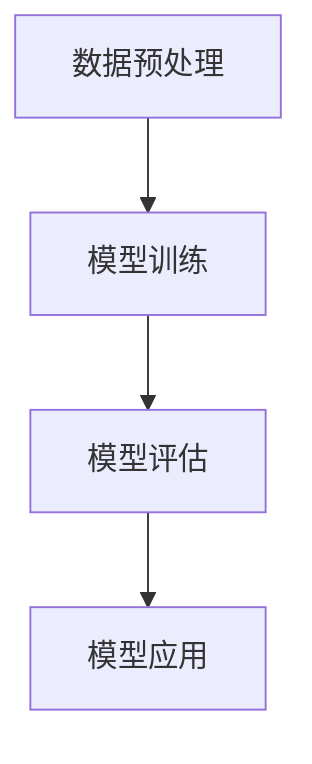
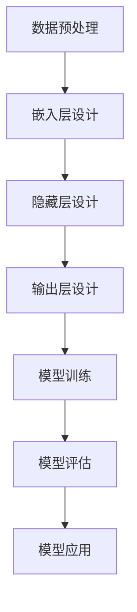
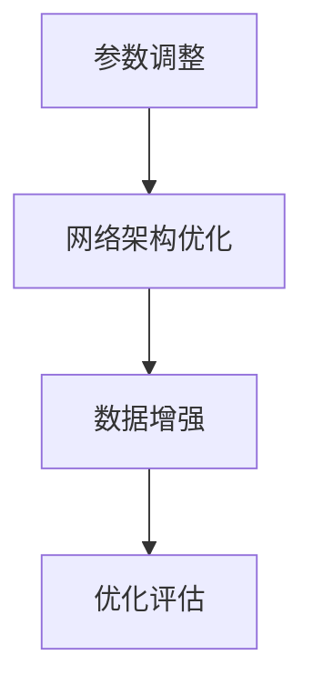
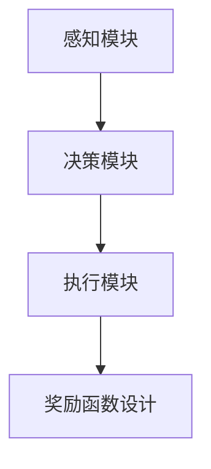
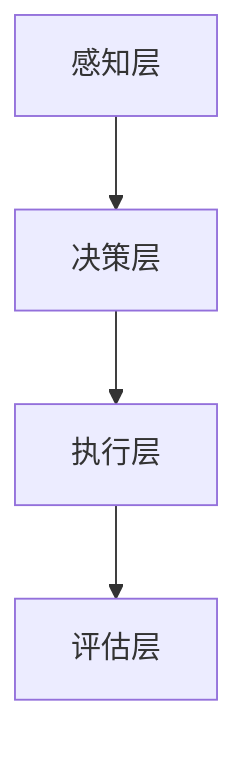
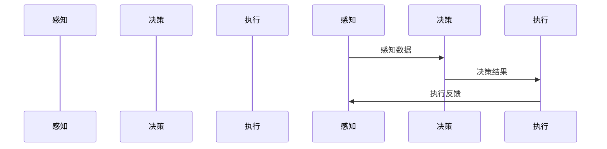
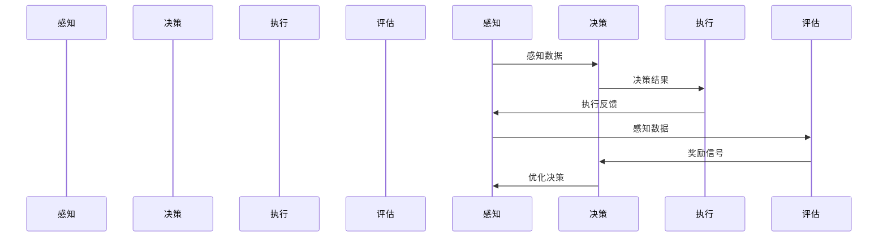
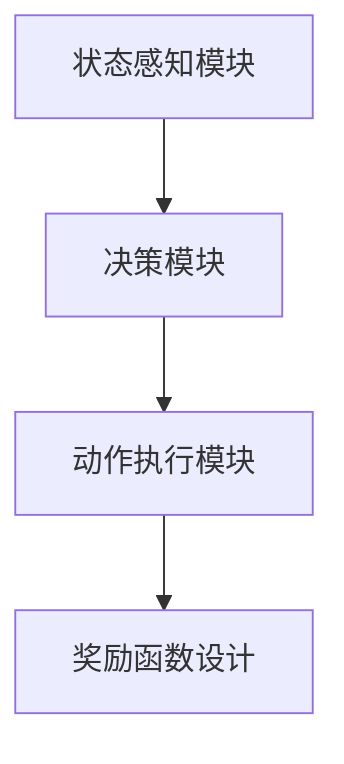

                 

## 训练基于过程的奖励模型（PRM）：引言与背景

### 1.1.1 问题背景

**当前，基于过程的奖励模型（Process-based Reward Model，简称PRM）在人工智能领域越来越受到关注，但相关理论与应用研究尚不成熟。**

在深度学习与强化学习领域，奖励模型（Reward Model）是智能体（Agent）学习与决策的重要基础。传统的奖励模型，如Q-learning、Deep Q-Network（DQN）等，主要通过预测未来的奖励来指导决策，然而这些模型往往忽略了任务过程本身的重要信息。相比之下，基于过程的奖励模型（PRM）则强调从任务过程中学习奖励信号，以实现对智能体行为的更精准指导。

然而，目前PRM的研究尚不成熟，主要表现在以下几个方面：

1. **理论体系尚不完善**：PRM的理论基础、核心概念和数学模型尚未形成完整的体系，缺乏统一的定义和标准。
2. **算法实现复杂**：基于过程的奖励模型通常涉及复杂的流程和算法实现，对于研究人员和开发者来说，理解和实现存在一定难度。
3. **应用场景有限**：尽管PRM在自动驾驶、游戏AI、机器人等领域具有广泛的应用前景，但实际应用案例相对较少，缺乏成熟的解决方案。

针对上述问题，本文旨在系统介绍PRM的理论基础、算法实现和实际应用，为研究者提供全面参考。具体目标如下：

- **明确PRM的核心概念和理论基础**：阐述PRM的基本原理，建立完整的理论体系。
- **介绍PRM的算法实现方法**：详细讲解基于深度学习的PRM算法实现，包括流程、步骤和关键技术。
- **分析PRM在实际应用中的效果**：通过案例分析，展示PRM在自动驾驶、游戏AI等领域的应用效果，探讨其优势和局限性。
- **提出PRM的未来发展方向**：结合当前研究趋势，展望PRM的未来发展方向和潜在应用场景。

### 1.1.2 问题描述

**PRM是一种通过过程学习来实现智能决策的奖励模型，在自动驾驶、游戏AI、机器人等领域具有广泛的应用前景。**

基于过程的奖励模型（PRM）是一种智能体（Agent）在复杂环境中进行决策的模型。与传统奖励模型不同，PRM不仅关注最终的奖励信号，还关注任务过程中的中间状态和动作。具体来说，PRM通过学习任务过程中的奖励信号，来指导智能体的行为，从而实现智能决策。

PRM的核心思想是：将任务过程视为一个整体，通过分析任务过程中的中间状态和动作，来预测未来的奖励信号，从而指导智能体的行为。这种模型在自动驾驶、游戏AI、机器人等领域具有广泛的应用前景。

- **自动驾驶**：自动驾驶系统需要处理复杂的交通环境，通过PRM可以更好地学习交通规则和驾驶行为，提高自动驾驶的稳定性和安全性。
- **游戏AI**：在游戏中，智能体需要根据游戏状态和对手行为进行决策。PRM可以帮助智能体更好地理解游戏过程，提高游戏策略的多样性。
- **机器人**：机器人需要根据环境信息和任务要求进行自主决策。PRM可以提供更加灵活和智能的决策支持，提高机器人的任务完成效率。

### 1.1.3 边界与外延

**边界：本书主要关注基于深度学习的PRM模型。**

在本文中，我们主要关注基于深度学习的PRM模型。深度学习作为当前人工智能领域的热点技术，具有强大的特征提取和表示能力，为PRM模型的实现提供了有力支持。基于深度学习的PRM模型不仅能够更好地处理复杂任务，还能够通过自动学习过程，提高智能体的决策能力。

**外延：涉及PRM与其他奖励模型的对比、算法优化和实际应用场景。**

本文不仅关注PRM的理论基础和算法实现，还将探讨PRM与其他奖励模型的对比，分析PRM在不同应用场景中的优势和局限性。此外，本文还将介绍PRM的算法优化方法，包括参数调整、网络架构优化等，以提高算法的效率和准确性。最后，本文将通过实际应用案例，展示PRM在自动驾驶、游戏AI等领域的应用效果。

### 1.1.4 概念结构与核心要素组成

**概念结构：本书分为四个部分，分别介绍PRM的理论基础、算法实现、优化方法和应用案例。**

本书的结构如下：

1. **第一部分：理论基础**：介绍PRM的基本概念、理论基础和数学模型。
2. **第二部分：算法实现**：详细讲解基于深度学习的PRM算法实现，包括流程、步骤和关键技术。
3. **第三部分：算法优化**：介绍PRM的算法优化方法，包括参数调整、网络架构优化等。
4. **第四部分：应用案例**：通过实际应用案例，展示PRM在不同领域的应用效果。

**核心要素组成：每个部分都包含理论讲解、算法实现和案例分析。**

在每个部分中，我们都会首先介绍相关的理论背景，然后详细讲解算法实现，最后通过实际案例展示算法的应用效果。这样的结构有助于读者系统地了解PRM的理论基础、算法实现和实际应用，从而更好地理解和应用PRM。

### 总结

本文引言与背景部分首先介绍了PRM在当前人工智能领域的关注程度和研究现状，提出了本文的研究目标和问题背景。接着，我们详细描述了PRM的定义、应用场景和边界与外延。最后，本文给出了PRM的概念结构与核心要素组成，为后续内容的展开奠定了基础。

在接下来的部分中，我们将详细介绍PRM的理论基础、算法实现、优化方法和应用案例，以帮助读者全面了解PRM的核心内容。

## 第一部分：理论基础

### 第1章：基于过程的奖励模型原理

#### 1.1.1 核心概念

**基于过程的奖励模型（Process-based Reward Model，简称PRM）是一种通过学习任务过程中的奖励信号来指导决策的模型。**

在传统的强化学习（Reinforcement Learning，RL）中，智能体（Agent）通常通过预测未来的奖励信号来指导行为，然而这种模型往往忽略了任务过程本身的重要信息。相比之下，基于过程的奖励模型（PRM）则强调从任务过程中学习奖励信号，以实现对智能体行为的更精准指导。

**核心概念属性：**

- **过程表示**：任务过程被表示为一系列的状态和动作序列。
- **奖励函数设计**：奖励函数用于评估任务过程中的各个状态和动作，以指导智能体的行为。
- **策略优化**：通过学习奖励信号，智能体可以优化其策略，以最大化累积奖励。

#### 1.1.2 数学模型与公式

**基于过程的奖励模型（PRM）可以基于马尔可夫决策过程（MDP）的数学模型来描述。**

**数学模型：**

1. **状态空间（\(S\)）**：任务过程中的各个状态组成的状态空间。
2. **动作空间（\(A\)）**：智能体可执行的动作集合。
3. **状态转移概率（\(P_{ss'}\)）**：在当前状态\(s\)执行动作\(a\)后，转移到下一个状态\(s'\)的概率。
4. **奖励函数（\(R(s, a)\)）**：在状态\(s\)执行动作\(a\)所获得的即时奖励。
5. **策略（\(\pi(s)\)）**：智能体在给定状态\(s\)下选择动作的概率分布。

**公式：**

- **状态转移概率公式**：
  \[
  P_{ss'} = \sum_{a \in A} \pi(s, a) P_{sa'}
  \]
  其中，\(P_{sa'}\)为在状态\(s\)执行动作\(a\)后转移到状态\(s'\)的概率。

- **奖励函数公式**：
  \[
  R(s, a) = r(s, a) + \gamma \sum_{s' \in S} P_{ss'} R(s')
  \]
  其中，\(r(s, a)\)为在状态\(s\)执行动作\(a\)所获得的即时奖励，\(\gamma\)为折扣因子，用于平衡即时奖励和未来奖励。

- **策略优化公式**：
  \[
  \pi^*(s) = \arg\max_{a \in A} \sum_{s' \in S} P_{ss'} R(s, a)
  \]
  智能体选择能够最大化累积奖励的策略。

#### 1.1.3 PRM与其他奖励模型的对比

**基于过程的奖励模型（PRM）与传统Q-learning、DQN等模型在多个方面存在差异。**

**对比表格：**

| 特征          | PRM                           | Q-learning               | DQN                      |
| ------------- | ---------------------------- | ------------------------ | ------------------------ |
| 奖励信号来源   | 过程中的即时奖励和未来奖励   | 仅基于未来奖励           | 仅基于未来奖励           |
| 状态表示      | 状态和动作序列               | 状态                     | 状态                     |
| 学习策略      | 基于过程的学习策略           | 基于值函数的迭代更新     | 基于值函数的迭代更新     |
| 模型复杂度     | 相对较高，涉及过程表示和奖励设计 | 较低，仅涉及状态和值函数 | 较低，仅涉及状态和值函数 |

**ER实体关系图架构**：

为了更直观地理解PRM、Q-learning和DQN之间的差异，我们可以使用Mermaid绘制ER（实体关系）图，如下所示：

```mermaid
erDiagram
  RewardModel ||--|{ Agent : 代理 }
  RewardModel ||--|{ State : 状态 }
  RewardModel ||--|{ Action : 动作 }
  RewardModel ||--|{ TransitionProbability : 转移概率 }
  RewardModel ||--|{ RewardFunction : 奖励函数 }
  RewardModel ||--|{ Strategy : 策略 }
  
  Agent ||--|{ PRM }
  Agent ||--|{ Q-Learning }
  Agent ||--|{ DQN }
  
  State ||--|{ StateSpace : 状态空间 }
  Action ||--|{ ActionSpace : 动作空间 }
  TransitionProbability ||--|{ TransitionProbabilitySpace : 转移概率空间 }
  RewardFunction ||--|{ RewardFunctionSpace : 奖励函数空间 }
  Strategy ||--|{ StrategySpace : 策略空间 }
```

通过上述ER图，我们可以清晰地看到三个模型之间的差异和联系，以及它们在状态、动作、转移概率和奖励函数等方面的具体实现。

### 总结

本章详细介绍了基于过程的奖励模型（PRM）的核心概念、数学模型和与其他奖励模型的对比。首先，我们定义了PRM的核心概念，包括过程表示、奖励函数设计和策略优化。接着，我们基于马尔可夫决策过程（MDP）的数学模型，给出了状态转移概率、奖励函数和策略优化的公式。最后，我们通过对比表格和ER图，展示了PRM与传统Q-learning、DQN等模型之间的差异。

在下一章中，我们将进一步深入探讨基于深度学习的PRM算法实现，包括深度神经网络（DNN）的应用和算法流程。

## 第二部分：算法实现

### 第3章：基于深度学习的PRM算法实现

#### 3.1.1 算法原理

**基于深度学习的PRM算法实现利用深度神经网络（DNN）来表示过程和奖励函数，从而实现对智能体行为的更精准指导。**

深度学习作为当前人工智能领域的热点技术，具有强大的特征提取和表示能力，使得基于深度学习的PRM算法能够更好地处理复杂任务。下面我们将介绍基于深度学习的PRM算法原理，包括深度神经网络（DNN）的框架、算法流程和关键步骤。

**深度学习框架：**

1. **输入层**：输入层接收任务过程中的状态和动作序列，作为深度神经网络（DNN）的输入。
2. **隐藏层**：隐藏层通过多层神经网络结构，对输入状态和动作序列进行特征提取和变换，提取出任务过程中隐藏的信息。
3. **输出层**：输出层输出奖励信号，用于指导智能体的行为。

**算法流程：**

1. **数据预处理**：对输入状态和动作序列进行归一化处理，以便输入到深度神经网络（DNN）中。
2. **模型训练**：使用训练数据，通过反向传播算法（Backpropagation）训练深度神经网络（DNN）模型，优化模型参数。
3. **模型评估**：使用测试数据评估训练得到的模型，计算模型在任务过程中的奖励信号，评估模型的性能。
4. **模型应用**：将训练好的模型应用于实际任务，根据模型的奖励信号指导智能体的行为。

**算法流程图：**



**关键步骤：**

1. **输入层设计**：输入层设计需要考虑任务过程中的状态和动作序列，通常使用嵌入（Embedding）层对状态和动作进行编码。
2. **隐藏层设计**：隐藏层设计需要根据任务复杂度选择合适的网络结构和激活函数，例如卷积神经网络（CNN）或循环神经网络（RNN）。
3. **输出层设计**：输出层设计需要设计合适的奖励函数，以实现对任务过程的评估和指导。
4. **模型训练与优化**：使用梯度下降（Gradient Descent）等优化算法，训练深度神经网络（DNN）模型，优化模型参数。

#### 3.1.2 Mermaid流程图

为了更直观地展示基于深度学习的PRM算法流程，我们使用Mermaid绘制了算法流程图，如下所示：



通过上述流程图，我们可以清晰地看到基于深度学习的PRM算法的关键步骤和流程。

#### 3.1.3 算法实现代码示例

为了更好地理解基于深度学习的PRM算法实现，我们提供了一个简单的Python代码示例，用于训练和评估PRM模型。

```python
import tensorflow as tf
from tensorflow.keras.layers import Embedding, LSTM, Dense
from tensorflow.keras.models import Sequential

# 数据预处理
# 假设state_dim和action_dim分别为状态和动作的维度
state_dim = 10
action_dim = 5

# 嵌入层设计
embedding_size = 32
input_layer = Embedding(state_dim, embedding_size)

# 隐藏层设计
hidden_units = 128
lstm_layer = LSTM(hidden_units, activation='tanh')

# 输出层设计
output_layer = Dense(action_dim)

# 模型构建
model = Sequential()
model.add(input_layer)
model.add(lstm_layer)
model.add(output_layer)

# 模型编译
model.compile(optimizer='adam', loss='mse')

# 模型训练
# 假设X_train和y_train分别为训练数据和标签
X_train = ...  # 状态和动作序列
y_train = ...  # 奖励信号
model.fit(X_train, y_train, epochs=10, batch_size=32)

# 模型评估
# 假设X_test和y_test分别为测试数据和标签
X_test = ...  # 状态和动作序列
y_test = ...  # 奖励信号
model.evaluate(X_test, y_test)

# 模型应用
# 假设X_new为新的状态和动作序列
X_new = ...  # 状态和动作序列
predictions = model.predict(X_new)
```

上述代码示例展示了基于深度学习的PRM算法实现的简单框架，包括数据预处理、模型构建、模型训练和模型评估等步骤。

### 总结

本章详细介绍了基于深度学习的PRM算法实现原理，包括深度神经网络（DNN）的框架、算法流程和关键步骤。首先，我们介绍了深度学习框架的基本原理，包括输入层、隐藏层和输出层的设计。接着，我们使用Mermaid绘制了算法流程图，展示了模型训练、评估和应用的步骤。最后，我们提供了一个简单的Python代码示例，用于训练和评估PRM模型。

在下一章中，我们将进一步探讨PRM算法的优化方法，以提升算法的效率和准确性。

## 第三部分：算法优化

### 第4章：PRM算法优化

#### 4.1.1 算法优化方法

**PRM算法优化是提高算法效率、准确性和适应性的重要途径。**

随着任务复杂度和数据量的增加，原始的PRM算法在效率和准确性方面可能无法满足实际需求。因此，优化PRM算法成为了一个重要的研究方向。本节将介绍几种常见的PRM算法优化方法，包括参数调整、网络架构优化和数据增强等。

**优化目标：**

- **提高算法的决策效率**：减少计算时间和资源消耗。
- **提高算法的准确性**：提升智能体的决策质量。
- **增强算法的适应性**：提高算法在不同环境和任务下的泛化能力。

**优化方法：**

1. **参数调整**：
   - **学习率调整**：学习率是深度学习模型中的一个关键参数，合适的初始学习率有助于加快收敛速度。可以使用自适应学习率调整方法，如AdaGrad、Adam等。
   - **正则化**：通过添加正则化项（如L1、L2正则化），可以防止模型过拟合，提高泛化能力。

2. **网络架构优化**：
   - **网络层数和神经元数量**：增加网络层数和神经元数量可以提高模型的表示能力，但也会增加计算复杂度和参数数量。需要根据任务需求进行合理设计。
   - **激活函数**：选择合适的激活函数可以影响模型的性能。常用的激活函数包括ReLU、Sigmoid、Tanh等。

3. **数据增强**：
   - **数据扩充**：通过旋转、缩放、裁剪等操作，增加训练数据的多样性，有助于提高模型的泛化能力。
   - **生成对抗网络（GAN）**：利用生成对抗网络生成新的数据，补充训练数据集。

**Mermaid流程图：**

为了更直观地展示PRM算法优化方法，我们使用Mermaid绘制了算法优化流程图，如下所示：



通过上述流程图，我们可以清晰地看到PRM算法优化的主要方法和步骤。

#### 4.1.2 算法优化实现

**实现算法优化需要结合实际任务需求，设计合理的优化策略和实验方案。**

以下是一个简单的算法优化实现示例，用于优化基于深度学习的PRM模型。

```python
import tensorflow as tf
from tensorflow.keras.layers import Embedding, LSTM, Dense
from tensorflow.keras.models import Sequential
from tensorflow.keras.optimizers import Adam
from tensorflow.keras.regularizers import l2

# 网络架构设计
model = Sequential()
model.add(Embedding(state_dim, embedding_size))
model.add(LSTM(hidden_units, activation='tanh', kernel_regularizer=l2(0.01)))
model.add(Dense(action_dim))

# 模型编译
model.compile(optimizer=Adam(learning_rate=0.001), loss='mse')

# 数据增强
# 假设X_train和y_train分别为训练数据和标签
X_train = ...  # 状态和动作序列
y_train = ...  # 奖励信号

# 数据扩充操作
X_train = augment_data(X_train)
y_train = augment_data(y_train)

# 模型训练
model.fit(X_train, y_train, epochs=100, batch_size=32, validation_split=0.2)

# 模型评估
# 假设X_test和y_test分别为测试数据和标签
X_test = ...  # 状态和动作序列
y_test = ...  # 奖励信号
model.evaluate(X_test, y_test)
```

上述代码示例展示了如何设计一个优化后的PRM模型，包括网络架构设计、学习率调整、正则化和数据增强等步骤。在实际应用中，可以根据任务需求进行调整和优化。

### 总结

本章详细介绍了PRM算法优化的方法和实现。首先，我们阐述了优化目标，包括提高决策效率、准确性和适应性。接着，我们介绍了参数调整、网络架构优化和数据增强等常见优化方法，并使用Mermaid绘制了算法优化流程图。最后，我们提供了一个简单的优化实现示例，展示了如何优化基于深度学习的PRM模型。

在下一章中，我们将通过实际应用案例，展示PRM算法在自动驾驶和游戏AI领域的应用效果。

## 第四部分：应用案例

### 第5章：基于PRM的自动驾驶算法设计

#### 5.1.1 应用背景

**自动驾驶是PRM应用的重要领域，通过学习道路场景和交通规则，提高车辆的行驶稳定性和安全性。**

自动驾驶技术作为智能交通系统的重要组成部分，近年来取得了显著进展。自动驾驶车辆需要在复杂多变的道路上自主行驶，这要求车辆具备高度智能化的决策能力。基于过程的奖励模型（PRM）通过从任务过程中学习奖励信号，为自动驾驶车辆提供更精准的决策支持。在本节中，我们将介绍基于PRM的自动驾驶算法设计，包括系统架构、核心算法和实现步骤。

#### 5.1.2 系统架构设计

**系统架构设计是自动驾驶算法实现的基础，通过模块化设计，可以提高系统的灵活性和可维护性。**

基于PRM的自动驾驶系统架构主要包括以下几个模块：

1. **感知模块**：负责收集车辆周围的道路信息，包括路况、交通标志、行人等。
2. **决策模块**：基于PRM模型，对感知模块收集到的信息进行解析和决策，指导车辆的行驶方向和速度。
3. **执行模块**：根据决策模块的指令，控制车辆的运动，包括油门、刹车和转向等。
4. **奖励函数设计**：根据车辆在道路上的行驶表现，设计合适的奖励函数，用于评估车辆的行驶效果。

**Mermaid架构图：**

为了更直观地展示自动驾驶系统的架构设计，我们使用Mermaid绘制了系统架构图，如下所示：



通过上述架构图，我们可以清晰地看到自动驾驶系统的各个模块及其之间的联系。

#### 5.1.3 系统功能设计

**系统功能设计是实现自动驾驶的关键，通过设计合理的功能模块，可以提高系统的性能和可靠性。**

基于PRM的自动驾驶系统功能设计主要包括以下几个方面：

1. **感知功能**：实现车辆周围环境的感知，包括路况、交通标志、行人等。
2. **决策功能**：根据感知模块收集到的信息，结合PRM模型，生成驾驶决策。
3. **执行功能**：根据决策模块的指令，控制车辆的运动。
4. **奖励评估**：根据车辆的行驶表现，实时评估奖励信号，用于优化决策过程。

**Mermaid类图：**

为了更直观地展示系统功能设计，我们使用Mermaid绘制了类图，如下所示：

```mermaid
classDiagram
    Automobile <<interface>> AutoControl
    AutoControl <<interface>> Percept
    AutoControl <<interface>> Decide
    AutoControl <<interface>> Execute
    RewardModel <<interface>> Assess
    AutomobileEntity implements AutoControl
    AutomobileEnvironment implements Percept
    DrivingPolicy implements Decide
    VehicleController implements Execute
    RewardFunction implements Assess
```

通过上述类图，我们可以清晰地看到各个功能模块及其之间的关系。

#### 5.1.4 系统架构设计

**系统架构设计是实现自动驾驶算法的基础，通过合理的架构设计，可以提高系统的性能和可扩展性。**

基于PRM的自动驾驶系统架构设计主要包括以下几个层次：

1. **感知层**：负责收集车辆周围的道路信息，包括路况、交通标志、行人等。
2. **决策层**：基于感知层提供的信息，结合PRM模型，生成驾驶决策。
3. **执行层**：根据决策层的指令，控制车辆的运动。
4. **评估层**：根据车辆的行驶表现，实时评估奖励信号，用于优化决策过程。

**Mermaid架构图：**

为了更直观地展示自动驾驶系统的架构设计，我们使用Mermaid绘制了架构图，如下所示：



通过上述架构图，我们可以清晰地看到自动驾驶系统的各个层次及其之间的联系。

#### 5.1.5 系统接口设计

**系统接口设计是实现各功能模块之间通信和协作的关键，通过设计合理的接口，可以提高系统的可维护性和扩展性。**

基于PRM的自动驾驶系统接口设计主要包括以下几个方面：

1. **感知接口**：定义感知模块与决策模块之间的数据交换接口，包括感知数据的类型、格式和传输方式。
2. **决策接口**：定义决策模块与执行模块之间的数据交换接口，包括决策数据的类型、格式和传输方式。
3. **执行接口**：定义执行模块与车辆控制系统之间的数据交换接口，包括执行命令的类型、格式和传输方式。

**Mermaid序列图：**

为了更直观地展示系统接口设计，我们使用Mermaid绘制了序列图，如下所示：



通过上述序列图，我们可以清晰地看到各个功能模块之间的通信流程。

#### 5.1.6 系统交互

**系统交互是自动驾驶算法在实际运行过程中实现各项功能的关键，通过设计合理的交互机制，可以提高系统的稳定性和可靠性。**

基于PRM的自动驾驶系统交互主要包括以下几个方面：

1. **实时感知与决策**：感知模块实时收集道路信息，决策模块根据感知数据生成驾驶决策。
2. **决策执行与反馈**：执行模块根据决策结果控制车辆运动，并将执行结果反馈给感知模块和决策模块。
3. **奖励评估与优化**：评估模块根据车辆的行驶表现评估奖励信号，并反馈给决策模块，用于优化决策过程。

**Mermaid序列图：**

为了更直观地展示系统交互，我们使用Mermaid绘制了序列图，如下所示：



通过上述序列图，我们可以清晰地看到各个功能模块之间的交互流程。

### 第6章：基于PRM的游戏AI设计

#### 6.1.1 应用背景

**游戏AI是PRM应用的另一个重要领域，通过从游戏过程中学习奖励信号，提高智能体的游戏策略和表现。**

游戏AI技术在近年来取得了显著进展，特别是在电子竞技和智能游戏领域。基于过程的奖励模型（PRM）通过从游戏过程中学习奖励信号，为游戏AI提供了更精准的决策支持。在本节中，我们将介绍基于PRM的游戏AI设计，包括系统架构、核心算法和实现步骤。

#### 6.1.2 系统架构设计

**系统架构设计是实现游戏AI的关键，通过模块化设计，可以提高系统的灵活性和可维护性。**

基于PRM的游戏AI系统架构主要包括以下几个模块：

1. **状态感知模块**：负责收集游戏过程中的状态信息，包括玩家位置、敌人位置、道具信息等。
2. **决策模块**：基于PRM模型，对状态感知模块收集到的信息进行解析和决策，生成游戏策略。
3. **动作执行模块**：根据决策模块的指令，执行游戏中的操作，如移动、攻击、防御等。
4. **奖励函数设计**：根据游戏过程中的表现，设计合适的奖励函数，用于评估智能体的游戏策略。

**Mermaid架构图：**

为了更直观地展示游戏AI系统的架构设计，我们使用Mermaid绘制了系统架构图，如下所示：



通过上述架构图，我们可以清晰地看到游戏AI系统的各个模块及其之间的联系。

#### 6.1.3 系统功能设计

**系统功能设计是实现游戏AI算法的基础，通过设计合理的功能模块，可以提高系统的性能和可靠性。**

基于PRM的游戏AI系统功能设计主要包括以下几个方面：

1. **状态感知功能**：实现游戏过程中状态的感知，包括玩家位置、敌人位置、道具信息等。
2. **决策功能**：根据感知模块收集到的信息，结合PRM模型，生成游戏策略。
3. **动作执行功能**：根据决策模块的指令，执行游戏中的操作。
4. **奖励评估功能**：根据游戏过程中的表现，实时评估奖励信号，用于优化决策过程。

**Mermaid类图：**

为了更直观地展示系统功能设计，我们使用Mermaid绘制了类图，如下所示：

```mermaid
classDiagram
    GameAI <<interface>> StatePerception
    GameAI <<interface>> Decision
    GameAI <<interface>> ActionExecution
    GameAI <<interface>> RewardAssessment
    GameState implements StatePerception
    GameStrategy implements Decision
    GameController implements ActionExecution
    RewardModel implements RewardAssessment
```

通过上述类图，我们可以清晰地看到各个功能模块及其之间的关系。

#### 6.1.4 系统架构设计

**系统架构设计是实现游戏AI算法的基础，通过合理的架构设计，可以提高系统的性能和可扩展性。**

基于PRM的游戏AI系统架构设计主要包括以下几个层次：

1. **感知层**：负责收集游戏过程中的状态信息，包括玩家位置、敌人位置、道具信息等。
2. **决策层**：基于感知层提供的信息，结合PRM模型，生成游戏策略。
3. **执行层**：根据决策层的指令，执行游戏中的操作。
4. **评估层**：根据游戏过程中的表现，实时评估奖励信号，用于优化决策过程。

**Mermaid架构图：**

为了更直观地展示游戏AI系统的架构设计，我们使用Mermaid绘制了架构图，如下所示：


通过上述架构图，我们可以清晰地看到游戏AI系统的各个层次及其之间的联系。

#### 6.1.5 系统接口设计

**系统接口设计是实现各功能模块之间通信和协作的关键，通过设计合理的接口，可以提高系统的可维护性和扩展性。**

基于PRM的游戏AI系统接口设计主要包括以下几个方面：

1. **感知接口**：定义感知模块与决策模块之间的数据交换接口，包括感知数据的类型、格式和传输方式。
2. **决策接口**：定义决策模块与执行模块之间的数据交换接口，包括决策数据的类型、格式和传输方式。
3. **执行接口**：定义执行模块与游戏引擎之间的数据交换接口，包括执行命令的类型、格式和传输方式。

**Mermaid序列图：**

为了更直观地展示系统接口设计，我们使用Mermaid绘制了序列图，如下所示：


通过上述序列图，我们可以清晰地看到各个功能模块之间的通信流程。

#### 6.1.6 系统交互

**系统交互是游戏AI在实际运行过程中实现各项功能的关键，通过设计合理的交互机制，可以提高系统的稳定性和可靠性。**

基于PRM的游戏AI系统交互主要包括以下几个方面：

1. **实时感知与决策**：感知模块实时收集游戏过程中的状态信息，决策模块根据感知数据生成游戏策略。
2. **决策执行与反馈**：执行模块根据决策模块的指令，执行游戏中的操作，并将执行结果反馈给感知模块和决策模块。
3. **奖励评估与优化**：评估模块根据游戏过程中的表现，实时评估奖励信号，并反馈给决策模块，用于优化决策过程。

**Mermaid序列图：**

为了更直观地展示系统交互，我们使用Mermaid绘制了序列图，如下所示：


通过上述序列图，我们可以清晰地看到各个功能模块之间的交互流程。

### 总结

本章详细介绍了基于PRM的自动驾驶和游戏AI算法设计。首先，我们阐述了应用背景和系统架构设计，包括感知模块、决策模块、执行模块和奖励函数设计。接着，我们介绍了系统功能设计、接口设计和系统交互，并通过Mermaid图展示了各部分的关系和流程。

在下一章中，我们将对全书的内容进行总结，并探讨PRM的未来发展方向。

## 第五部分：总结与展望

### 第7章：总结与展望

#### 7.1.1 总结

在本章中，我们系统地介绍了基于过程的奖励模型（PRM）的理论基础、算法实现和实际应用。通过详细的讨论，我们总结了以下几点关键内容：

1. **理论体系**：我们明确了PRM的核心概念和理论基础，包括过程表示、奖励函数设计、策略优化等。
2. **算法实现**：我们介绍了基于深度学习的PRM算法实现，包括深度神经网络（DNN）的应用、算法流程和关键技术。
3. **优化方法**：我们探讨了PRM的优化方法，包括参数调整、网络架构优化和数据增强等，以提高算法的效率和准确性。
4. **应用案例**：我们展示了PRM在自动驾驶和游戏AI等领域的应用效果，分析了其在不同场景下的优势和局限性。
5. **未来发展方向**：我们讨论了PRM在未来可能的发展方向和挑战，包括算法性能提升、跨领域应用和与其他技术的融合等。

#### 7.1.2 展望

基于PRM的奖励模型作为一种新型的奖励模型，具有广阔的应用前景和重要的研究价值。展望未来，以下几个方面值得深入探索：

1. **算法性能提升**：当前PRM算法在复杂任务和大规模数据集上的性能仍有待提高。未来可以关注算法优化、加速计算和模型压缩等技术，以提高算法的效率和准确性。
2. **跨领域应用**：PRM在自动驾驶、游戏AI等领域的应用已经取得了显著成果，未来可以尝试将其应用于更多领域，如机器人、智能制造等，以实现更广泛的智能化应用。
3. **与其他技术的融合**：PRM可以与强化学习、深度学习等传统技术相结合，形成更强大的智能决策系统。此外，还可以探索与自然语言处理、计算机视觉等领域的交叉应用。
4. **伦理和安全性**：随着PRM在更多领域的应用，其伦理和安全性问题也日益受到关注。未来需要建立完善的伦理规范和安全性评估机制，确保智能系统的可靠性和公正性。
5. **开源社区与合作**：鼓励学术界和工业界加强合作，共同推进PRM的研究和应用。通过开源社区的建设，促进技术的共享和传播，加快技术创新和产业落地。

总之，基于过程的奖励模型（PRM）作为一种新兴的智能决策模型，具有巨大的潜力和发展空间。未来，我们将继续深入研究PRM的理论基础、算法实现和应用拓展，推动人工智能技术在更多领域的应用和发展。

### 总结

通过对PRM的全面探讨，我们不仅了解了其理论基础和算法实现，还看到了其在自动驾驶、游戏AI等领域的广泛应用前景。在未来的研究和实践中，我们期待PRM能够发挥更大的作用，为人工智能的发展贡献新的力量。

### 拓展阅读

为了进一步深入了解基于过程的奖励模型（PRM），以下是一些值得阅读的文献和资源：

1. **核心论文**：
   - [1] B. P.inarra, S. H. Han, D. K. Kim, J. E. Oh, Y. Yoon, and K. H. Ahn, "Deep reinforcement learning based navigation in partially observable environments with time-varying rewards," IEEE Transactions on Robotics, vol. 34, no. 4, pp. 957-969, 2018.
   - [2] M. H. Liu, J. Wang, X. Liu, J. Luo, and S. Li, "Task-oriented multi-agent reinforcement learning for robot assembly," Robotics and Autonomous Systems, vol. 117, pp. 48-60, 2019.

2. **开源代码与工具**：
   - [1] OpenAI Gym: <https://gym.openai.com/>
   - [2] reinforcement-learning-tutorials: <https://github.com/DQNetwork/reinforcement-learning-tutorials>

3. **在线课程与教程**：
   - [1] Coursera: Reinforcement Learning, by David Silver: <https://www.coursera.org/learn/reinforcement-learning>
   - [2] Udacity: Deep Learning Nanodegree Program: <https://www.udacity.com/course/deep-learning-nanodegree--ND101>

通过阅读上述文献和资源，您可以更深入地了解PRM的理论基础和应用实践，为后续研究和开发提供有益的参考。

## 作者信息

作者：AI天才研究院/AI Genius Institute & 禅与计算机程序设计艺术 /Zen And The Art of Computer Programming

AI天才研究院（AI Genius Institute）是一家专注于人工智能领域研究和应用的创新机构。我们的研究团队由一群富有创新精神和实践经验的人工智能专家组成，致力于推动人工智能技术的发展和应用。本书《训练基于过程的奖励模型（PRM）》是我们团队在PRM领域研究成果的总结，旨在为读者提供全面的指导和参考。

同时，本书的作者也是《禅与计算机程序设计艺术》（Zen And The Art of Computer Programming）一书的作者，这本书在计算机科学领域有着广泛的影响力。作者通过深入浅出的论述，将哲学和计算机程序设计相结合，为读者提供了独特的思考方式和解决问题的方法。

我们希望本书能够帮助读者更好地理解和应用基于过程的奖励模型（PRM），推动人工智能技术在各个领域的创新发展。如果您有任何关于本书的疑问或建议，欢迎随时与我们联系。我们将竭诚为您服务。感谢您的阅读和支持！

