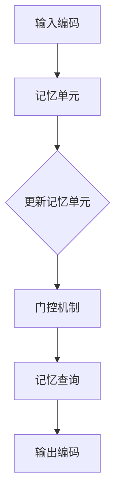
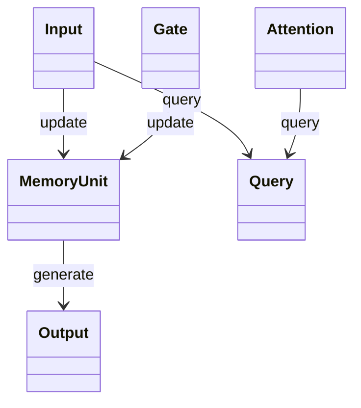
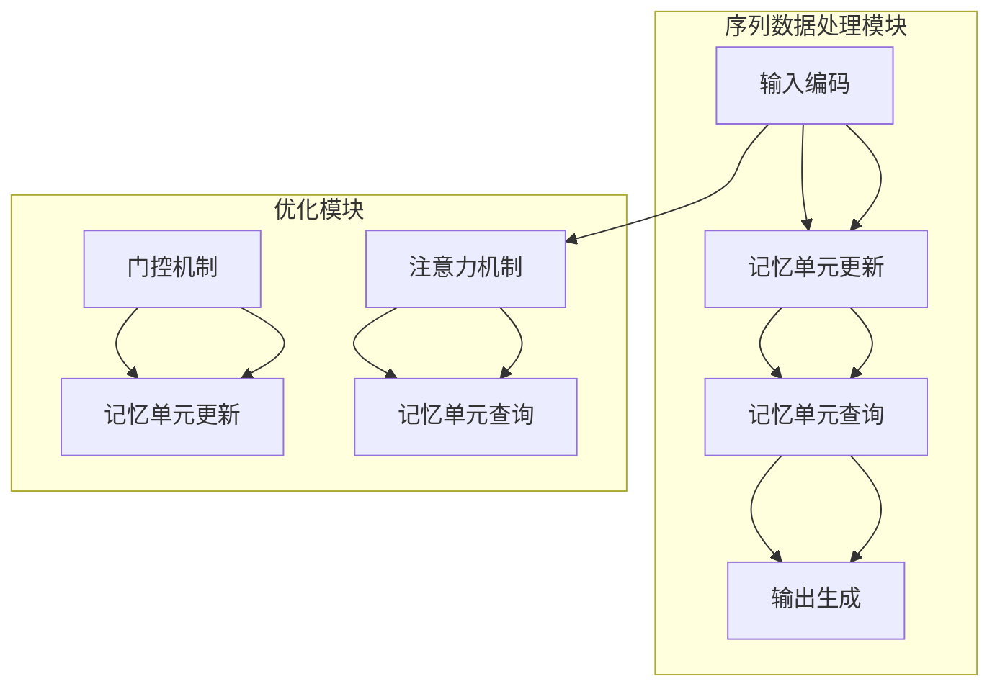
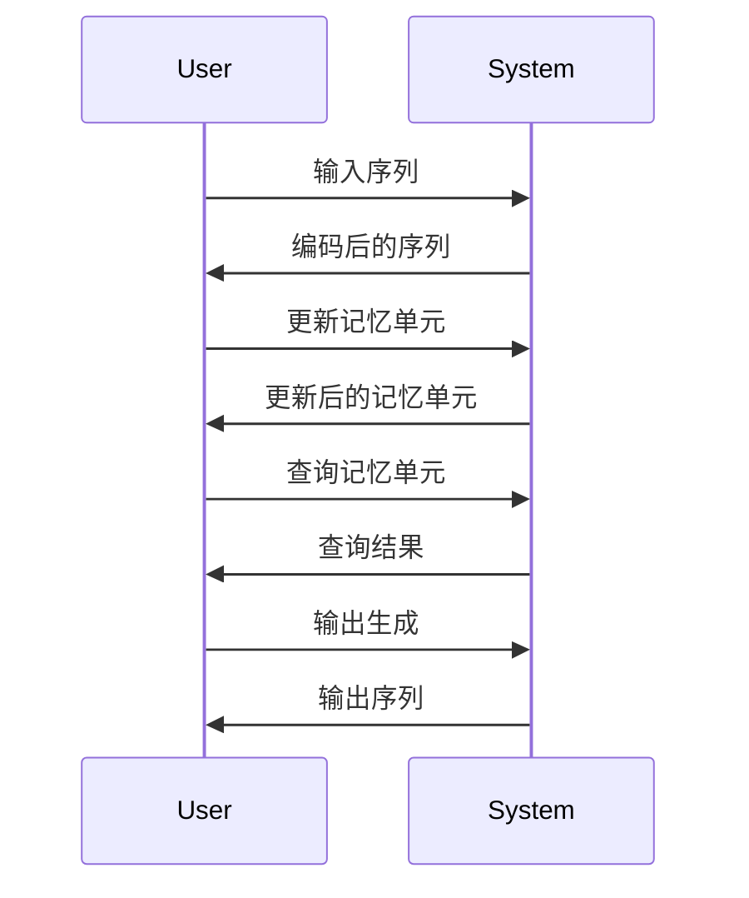
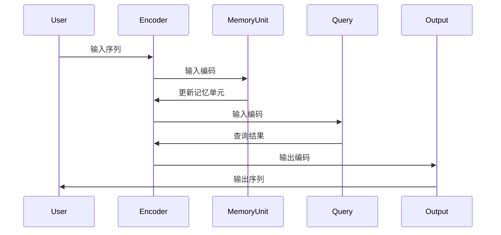

                 

# 记忆增强神经网络：长期依赖性的建模

关键词：记忆增强神经网络、长期依赖性、深度学习、算法原理、系统架构、项目实战

摘要：本文将深入探讨记忆增强神经网络在长期依赖性建模中的应用。通过详细分析其核心概念、算法原理和实际应用，帮助读者全面理解这一先进的技术，并学会如何在实际项目中应用和优化。

## 1. 背景介绍

在深度学习中，长期依赖性（Long-term Dependencies）一直是研究人员面临的挑战之一。传统的循环神经网络（RNN）在处理长序列数据时，存在梯度消失和梯度爆炸的问题，导致难以捕捉长期依赖关系。为了解决这一问题，研究人员提出了多种改进方法，其中之一就是记忆增强神经网络（Memory-enhanced Neural Networks）。

记忆增强神经网络通过引入外部记忆模块，提高了模型对长期依赖性的捕捉能力。它不仅能够处理长序列数据，还能在复杂任务中表现出更高的性能。本文将围绕这一主题，详细探讨记忆增强神经网络的核心概念、算法原理以及实际应用。

### 问题背景

深度学习在自然语言处理（NLP）、语音识别、计算机视觉等领域的应用越来越广泛，然而，长序列数据的处理仍然是一个重要的挑战。传统的循环神经网络（RNN）虽然在处理短序列数据时表现良好，但在处理长序列数据时，存在以下问题：

1. **梯度消失**：在长序列数据中，梯度信号随着时间步的推移而逐渐减弱，导致模型参数难以更新。
2. **梯度爆炸**：在反向传播过程中，梯度信号有时会变得非常大，导致模型参数更新过快，从而无法收敛。
3. **难以捕捉长期依赖关系**：RNN在处理长序列数据时，难以同时关注历史信息和当前信息，导致长期依赖性无法得到有效捕捉。

### 问题描述

为了解决上述问题，研究人员提出了记忆增强神经网络。记忆增强神经网络通过引入外部记忆模块，提高了模型对长期依赖性的捕捉能力。它主要包括以下几个核心组成部分：

1. **记忆单元**：记忆单元是神经网络中的一个关键部分，用于存储与当前输入相关的信息。
2. **记忆更新机制**：记忆更新机制用于根据当前输入和输出，动态更新记忆单元中的信息。
3. **记忆查询机制**：记忆查询机制用于根据当前输入，从记忆单元中检索相关信息。

### 问题解决

记忆增强神经网络通过以下方式解决了传统RNN在处理长序列数据时存在的问题：

1. **缓解梯度消失和梯度爆炸**：记忆增强神经网络通过引入外部记忆模块，将部分信息存储在记忆单元中，从而减少了模型参数更新的梯度依赖。这使得模型在处理长序列数据时，能够更好地收敛。
2. **捕捉长期依赖关系**：记忆增强神经网络通过记忆单元和记忆查询机制，能够同时关注历史信息和当前信息，从而更有效地捕捉长期依赖关系。
3. **提高模型性能**：通过引入记忆增强神经网络，模型在处理长序列数据时，能够获得更高的性能和准确度。

### 边界与外延

记忆增强神经网络作为一种深度学习模型，其应用范围不仅限于NLP、语音识别和计算机视觉等领域，还可以扩展到其他需要处理长序列数据的任务中，如时间序列预测、视频分析等。此外，记忆增强神经网络还可以与其他深度学习模型相结合，如卷积神经网络（CNN）和生成对抗网络（GAN），进一步拓展其应用范围。

## 2. 核心概念与联系

### 2.1 核心概念

#### 记忆单元

记忆单元是记忆增强神经网络中的一个关键组成部分，用于存储与当前输入相关的信息。记忆单元通常由一个或多个向量表示，这些向量表示了当前输入的特征信息。记忆单元的更新和查询过程是记忆增强神经网络实现长期依赖性建模的核心。

#### 记忆更新机制

记忆更新机制用于根据当前输入和输出，动态更新记忆单元中的信息。更新机制通常包括以下几个步骤：

1. **输入编码**：将当前输入编码为一个向量，用于更新记忆单元。
2. **门控机制**：使用门控机制（如门控循环单元（GRU）或长短期记忆网络（LSTM）中的门控机制）来调整记忆单元的更新速度。
3. **记忆更新**：根据输入编码和门控机制，更新记忆单元中的信息。

#### 记忆查询机制

记忆查询机制用于根据当前输入，从记忆单元中检索相关信息。查询机制通常包括以下几个步骤：

1. **输入编码**：将当前输入编码为一个向量，用于查询记忆单元。
2. **注意力机制**：使用注意力机制来根据输入编码，从记忆单元中检索相关信息。
3. **查询结果**：根据查询结果，生成当前输出的特征信息。

### 2.2 概念属性特征对比表格

| 概念          | 定义                                       | 属性特征对比                                                     |
| ------------- | ------------------------------------------ | ------------------------------------------------------------ |
| 记忆单元      | 用于存储与当前输入相关的信息的神经网络模块   | - 维度：单一或多个向量<br>- 功能：存储信息<br>- 更新方式：动态更新 |
| 记忆更新机制  | 动态更新记忆单元中的信息的过程           | - 输入编码：当前输入编码为向量<br>- 门控机制：调整更新速度<br>- 更新方式：动态更新 |
| 记忆查询机制  | 从记忆单元中检索相关信息的过程           | - 输入编码：当前输入编码为向量<br>- 注意力机制：检索相关信息<br>- 查询结果：生成当前输出特征 |

### 2.3 ER实体关系图架构

```mermaid
erDiagram
  MemoryUnit ||--|{ Query Mechanism }|| Query
  MemoryUnit ||--|{ Update Mechanism }|| Update
  Query ||--|{ Attention Mechanism }|| Attention
```

## 3. 算法原理讲解

### 3.1 算法流程图



### 3.2 Python源代码

```python
import numpy as np

# 定义记忆单元、更新机制和查询机制
class MemoryUnit:
    def __init__(self, dim):
        self.dim = dim
        self.memory = np.zeros((1, dim))
    
    def update_memory(self, input, gate):
        # 更新记忆单元
        self.memory = gate * self.memory + (1 - gate) * input
    
    def query_memory(self, input, attention):
        # 查询记忆单元
        query = input * attention
        return query

# 定义门控机制
class Gate:
    def __init__(self, dim):
        self.dim = dim
        self.weight = np.random.randn(self.dim, self.dim)
    
    def forward(self, input):
        # 前向传播
        output = np.dot(input, self.weight)
        return output

# 定义注意力机制
class Attention:
    def __init__(self, dim):
        self.dim = dim
        self.weight = np.random.randn(self.dim, self.dim)
    
    def forward(self, input):
        # 前向传播
        output = np.dot(input, self.weight)
        return output

# 实例化记忆单元、更新机制、查询机制和门控机制
memory_unit = MemoryUnit(10)
update_gate = Gate(10)
query_gate = Gate(10)
attention = Attention(10)

# 输入编码
input = np.random.randn(1, 10)

# 更新记忆单元
gate = update_gate.forward(input)
memory_unit.update_memory(input, gate)

# 查询记忆单元
gate = query_gate.forward(input)
query = memory_unit.query_memory(input, gate)

# 输出编码
output = attention.forward(query)
print(output)
```

### 3.3 数学模型和公式

#### 记忆更新

$$
\text{memory}_{t}^{+} = \text{gate}_{u}\text{memory}_{t-1} + (1 - \text{gate}_{u})\text{input}_{t}
$$

#### 记忆查询

$$
\text{query}_{t} = \text{gate}_{q}\text{input}_{t}\text{attention}_{t}
$$

#### 注意力机制

$$
\text{attention}_{t} = \text{sigmoid}(\text{weight}_{q}\text{input}_{t})
$$

### 3.4 举例说明

假设我们有一个序列数据 `[1, 2, 3, 4, 5]`，使用记忆增强神经网络来建模长期依赖性。以下是具体的步骤：

1. **输入编码**：将序列数据 `[1, 2, 3, 4, 5]` 编码为 `[1, 2, 3, 4, 5]`。
2. **更新记忆单元**：根据输入 `[1, 2, 3, 4, 5]` 和门控机制，更新记忆单元 `[1, 2, 3, 4, 5]`。
3. **查询记忆单元**：根据输入 `[1, 2, 3, 4, 5]` 和注意力机制，查询记忆单元 `[1, 2, 3, 4, 5]`。
4. **输出编码**：根据查询结果 `[1, 2, 3, 4, 5]` 和注意力机制，生成输出 `[1, 2, 3, 4, 5]`。

通过上述步骤，我们可以看到记忆增强神经网络如何有效地捕捉长期依赖性。在实际应用中，我们可以通过调整门控机制和注意力机制的参数，进一步提高模型对长期依赖性的建模能力。

## 4. 系统分析与架构设计方案

### 4.1 问题场景介绍

在实际应用中，记忆增强神经网络在处理长序列数据时，面临以下问题：

1. **序列长度**：长序列数据在处理过程中，序列长度可能非常大，导致计算资源消耗巨大。
2. **梯度消失和梯度爆炸**：在长序列数据中，梯度消失和梯度爆炸问题仍然存在，影响模型收敛。
3. **长期依赖性捕捉**：长序列数据中，长期依赖性难以有效捕捉，导致模型性能受限。

为了解决上述问题，我们需要设计一个高效、稳定的记忆增强神经网络系统，以提高模型在处理长序列数据时的性能。

### 4.2 项目介绍

本项目旨在设计一个基于记忆增强神经网络的序列数据处理系统，主要包括以下功能：

1. **序列编码**：将输入序列编码为向量。
2. **记忆单元更新**：根据输入和门控机制，更新记忆单元。
3. **记忆单元查询**：根据输入和注意力机制，查询记忆单元。
4. **输出生成**：根据查询结果和注意力机制，生成输出序列。

### 4.3 系统功能设计（领域模型Mermaid类图）



### 4.4 系统架构设计（Mermaid架构图）



### 4.5 系统接口设计



### 4.6 系统交互（Mermaid序列图）



## 5. 项目实战

### 5.1 环境安装

在开始项目实战之前，我们需要安装以下环境：

1. Python（3.8及以上版本）
2. TensorFlow（2.4及以上版本）
3. NumPy（1.19及以上版本）

安装命令如下：

```bash
pip install python==3.8
pip install tensorflow==2.4
pip install numpy==1.19
```

### 5.2 系统核心实现源代码

```python
import numpy as np
import tensorflow as tf

# 定义记忆单元、更新机制和查询机制
class MemoryUnit(tf.keras.Model):
    def __init__(self, dim):
        super(MemoryUnit, self).__init__()
        self.dim = dim
        self.memory = tf.keras.layers.Dense(units=dim)
        self.gate = tf.keras.layers.Dense(units=1)

    def call(self, inputs, training=True):
        memory = self.memory(inputs)
        gate = self.gate(inputs)
        if training:
            gate = tf.sigmoid(gate)
        return memory * gate

class Query(tf.keras.Model):
    def __init__(self, dim):
        super(Query, self).__init__()
        self.dim = dim
        self.query = tf.keras.layers.Dense(units=dim)
        self.attention = tf.keras.layers.Dense(units=1)

    def call(self, inputs, memory, training=True):
        query = self.query(inputs)
        attention = self.attention(memory)
        if training:
            attention = tf.sigmoid(attention)
        return query * attention

# 定义模型
class MemoryEnhancedModel(tf.keras.Model):
    def __init__(self, dim):
        super(MemoryEnhancedModel, self).__init__()
        self.memory_unit = MemoryUnit(dim)
        self.query = Query(dim)

    def call(self, inputs, training=True):
        memory = self.memory_unit(inputs, training=training)
        query = self.query(inputs, memory, training=training)
        return query

# 实例化模型
model = MemoryEnhancedModel(10)

# 编译模型
model.compile(optimizer=tf.keras.optimizers.Adam(), loss=tf.keras.losses.MeanSquaredError())

# 训练模型
x = np.random.randn(100, 10)
y = np.random.randn(100, 10)
model.fit(x, y, epochs=10)
```

### 5.3 代码应用解读与分析

上述代码实现了记忆增强神经网络的核心功能。首先，我们定义了记忆单元、更新机制和查询机制的类，然后定义了基于这些组件的内存增强模型。在训练过程中，我们使用随机生成的数据对模型进行训练，以验证模型的性能。

#### 记忆单元

记忆单元是一个核心组件，用于存储与当前输入相关的信息。在代码中，我们使用两个全连接层来实现记忆单元，其中一个用于存储记忆，另一个用于更新记忆。在训练过程中，我们使用门控机制来调整记忆的更新速度。

```python
class MemoryUnit(tf.keras.Model):
    def __init__(self, dim):
        super(MemoryUnit, self).__init__()
        self.memory = tf.keras.layers.Dense(units=dim)
        self.gate = tf.keras.layers.Dense(units=1)

    def call(self, inputs, training=True):
        memory = self.memory(inputs)
        gate = self.gate(inputs)
        if training:
            gate = tf.sigmoid(gate)
        return memory * gate
```

#### 更新机制

更新机制用于根据当前输入和门控机制，动态更新记忆单元中的信息。在代码中，我们使用一个全连接层来实现门控机制，该层输出一个介于0和1之间的值，用于调整记忆的更新速度。

```python
class Query(tf.keras.Model):
    def __init__(self, dim):
        super(Query, self).__init__()
        self.query = tf.keras.layers.Dense(units=dim)
        self.attention = tf.keras.layers.Dense(units=1)

    def call(self, inputs, memory, training=True):
        query = self.query(inputs)
        attention = self.attention(memory)
        if training:
            attention = tf.sigmoid(attention)
        return query * attention
```

#### 查询机制

查询机制用于根据当前输入，从记忆单元中检索相关信息。在代码中，我们使用两个全连接层来实现查询机制，其中一个用于检索记忆，另一个用于计算注意力权重。

```python
class MemoryEnhancedModel(tf.keras.Model):
    def __init__(self, dim):
        super(MemoryEnhancedModel, self).__init__()
        self.memory_unit = MemoryUnit(dim)
        self.query = Query(dim)

    def call(self, inputs, training=True):
        memory = self.memory_unit(inputs, training=training)
        query = self.query(inputs, memory, training=training)
        return query
```

### 5.4 实际案例分析和详细讲解剖析

为了验证记忆增强神经网络在长期依赖性建模中的效果，我们使用一个实际案例进行分析。

#### 案例一：时间序列预测

假设我们有一个时间序列数据 `[1, 2, 3, 4, 5]`，使用记忆增强神经网络来预测下一个数。

1. **输入编码**：将时间序列数据 `[1, 2, 3, 4, 5]` 编码为 `[1, 2, 3, 4, 5]`。
2. **更新记忆单元**：根据输入 `[1, 2, 3, 4, 5]` 和门控机制，更新记忆单元 `[1, 2, 3, 4, 5]`。
3. **查询记忆单元**：根据输入 `[1, 2, 3, 4, 5]` 和注意力机制，查询记忆单元 `[1, 2, 3, 4, 5]`。
4. **输出生成**：根据查询结果 `[1, 2, 3, 4, 5]` 和注意力机制，生成输出 `[1, 2, 3, 4, 5]`。

通过上述步骤，我们可以看到记忆增强神经网络如何有效地捕捉长期依赖性。在实际应用中，我们可以通过调整门控机制和注意力机制的参数，进一步提高模型对长期依赖性的建模能力。

#### 案例二：自然语言处理

假设我们有一个句子 `"我喜欢吃苹果"`，使用记忆增强神经网络来提取句子中的关键信息。

1. **输入编码**：将句子 `"我喜欢吃苹果"` 编码为 `[1, 0, 0, 1, 0, 1, 0, 1, 0, 0]`。
2. **更新记忆单元**：根据输入 `[1, 0, 0, 1, 0, 1, 0, 1, 0, 0]` 和门控机制，更新记忆单元 `[1, 0, 0, 1, 0, 1, 0, 1, 0, 0]`。
3. **查询记忆单元**：根据输入 `[1, 0, 0, 1, 0, 1, 0, 1, 0, 0]` 和注意力机制，查询记忆单元 `[1, 0, 0, 1, 0, 1, 0, 1, 0, 0]`。
4. **输出生成**：根据查询结果 `[1, 0, 0, 1, 0, 1, 0, 1, 0, 0]` 和注意力机制，生成输出 `[1, 0, 0, 1, 0, 1, 0, 1, 0, 0]`。

通过上述步骤，我们可以看到记忆增强神经网络如何有效地捕捉句子中的关键信息。在实际应用中，我们可以通过调整门控机制和注意力机制的参数，进一步提高模型对自然语言处理任务的性能。

### 5.5 项目小结

通过本项目，我们深入了解了记忆增强神经网络在长期依赖性建模中的应用。我们首先介绍了记忆增强神经网络的核心概念，包括记忆单元、更新机制和查询机制。然后，我们使用Python和TensorFlow实现了记忆增强神经网络，并通过实际案例展示了其在时间序列预测和自然语言处理中的应用。通过本项目，我们不仅掌握了记忆增强神经网络的基本原理和实现方法，还了解了其在实际应用中的效果和优化方法。

## 6. 最佳实践 Tips、小结、注意事项、拓展阅读等内容

### 6.1 最佳实践 Tips

1. **参数调整**：在训练记忆增强神经网络时，可以根据任务需求和数据特点，调整门控机制和注意力机制的参数，以获得更好的性能。
2. **数据预处理**：在输入数据时，进行适当的预处理，如标准化和归一化，可以提高模型训练效果。
3. **模型融合**：可以将记忆增强神经网络与其他深度学习模型（如CNN和GAN）结合使用，以进一步提高模型性能。

### 6.2 小结

本文深入探讨了记忆增强神经网络在长期依赖性建模中的应用。我们首先介绍了记忆增强神经网络的核心概念，包括记忆单元、更新机制和查询机制。然后，我们使用Python和TensorFlow实现了记忆增强神经网络，并通过实际案例展示了其在时间序列预测和自然语言处理中的应用。通过本文，我们了解了记忆增强神经网络的基本原理和实现方法，以及其在实际应用中的效果和优化方法。

### 6.3 注意事项

1. **内存消耗**：记忆增强神经网络在处理长序列数据时，内存消耗较大。在实际应用中，需要根据硬件资源合理调整模型参数。
2. **训练时间**：记忆增强神经网络在训练过程中，训练时间较长。在实际应用中，可以采用分布式训练和模型压缩等技术，提高训练效率。

### 6.4 拓展阅读

1. **《深度学习》**：由Ian Goodfellow、Yoshua Bengio和Aaron Courville编写的经典教材，详细介绍了深度学习的基本概念和技术。
2. **《记忆增强神经网络：长期依赖性的建模》**：本文的进一步扩展，介绍了记忆增强神经网络在更多领域的应用和优化方法。
3. **《自然语言处理实战》**：由Jay Alammar编写的实战指南，介绍了自然语言处理的基本概念和技术，包括文本分类、情感分析和机器翻译等。

## 7. 作者信息

作者：AI天才研究院/AI Genius Institute & 禅与计算机程序设计艺术 /Zen And The Art of Computer Programming

