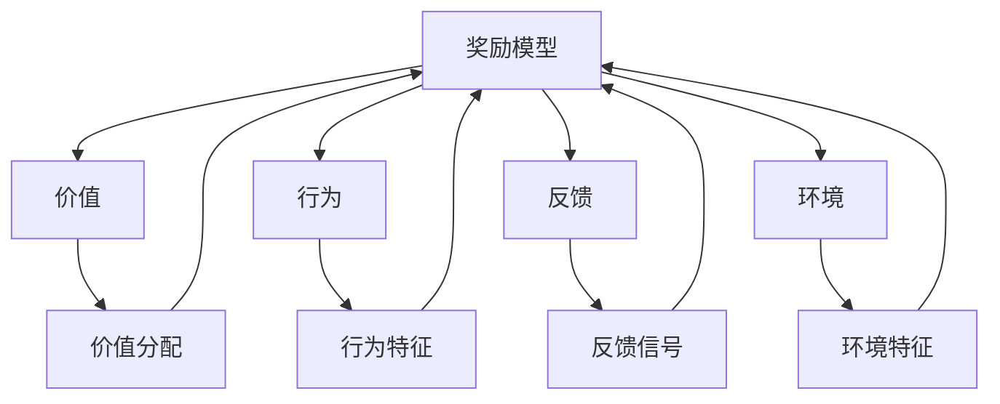
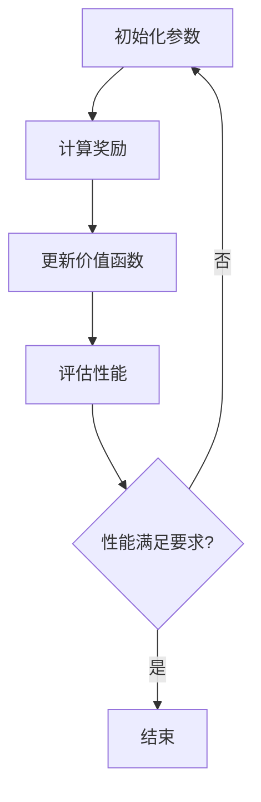
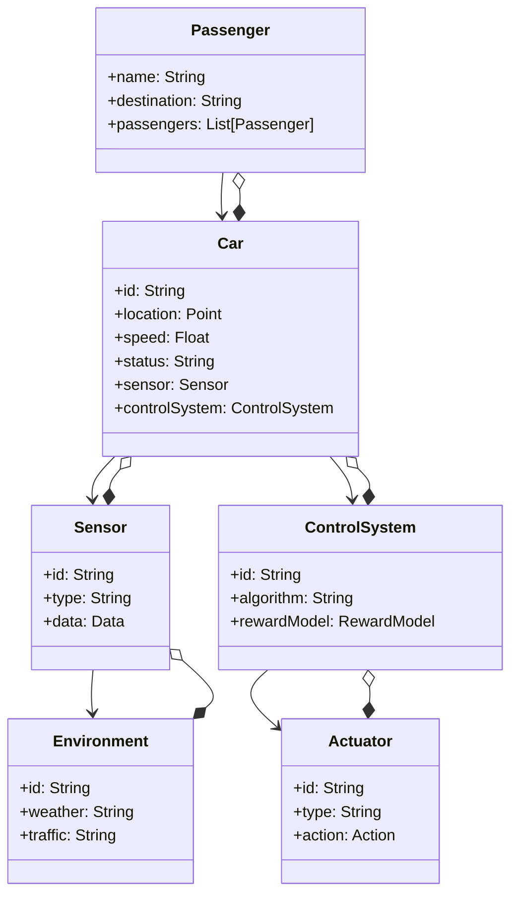
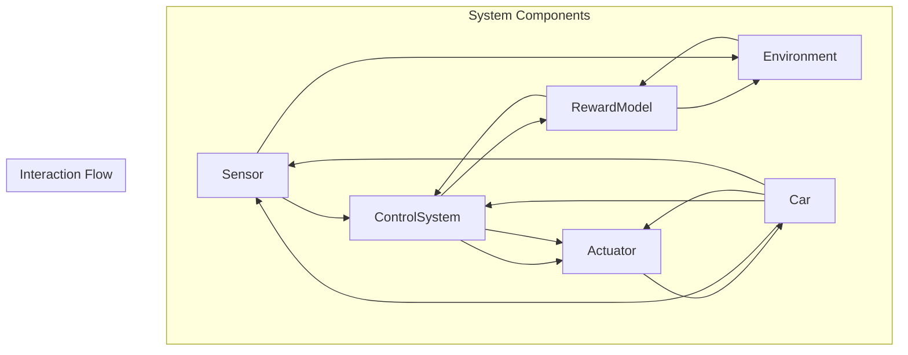
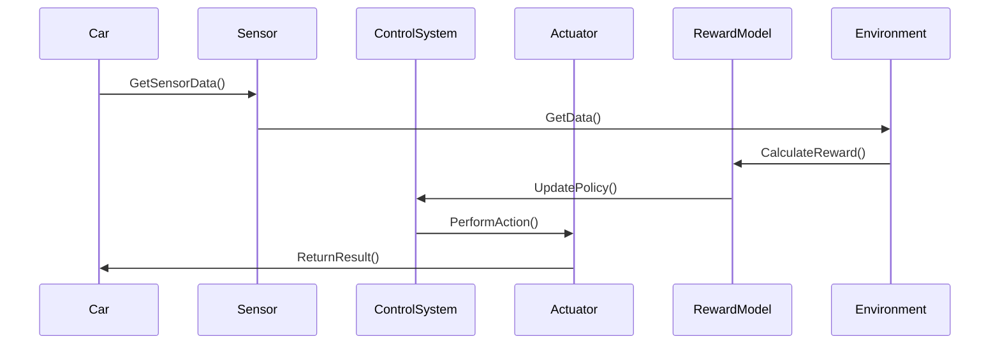
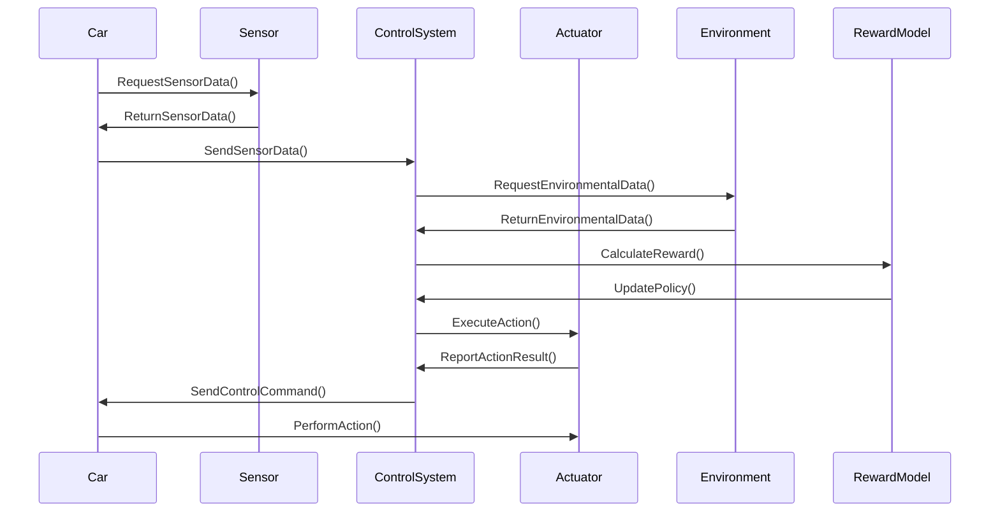

                 

### 《设计挑战：平衡AI奖励模型的稳定性与性能》

关键词：AI奖励模型，稳定性，性能，设计挑战

摘要：本文探讨了人工智能（AI）奖励模型中稳定性和性能的平衡问题。通过详细分析设计挑战、核心概念和算法原理，本文为读者提供了一个全面的理解和解决方案。同时，结合系统架构设计和项目实战，为实际应用提供了实用的指导。

---

## 引言

在现代人工智能（AI）领域，奖励模型是至关重要的一环。奖励模型的设计决定了AI代理在执行任务时的行为和表现。然而，在追求高性能的同时，如何确保奖励模型的稳定性是一个极具挑战性的问题。本文将深入探讨这一设计挑战，旨在为AI研究人员和工程师提供有价值的见解和解决方案。

### 目标读者

本文的目标读者是那些对AI奖励模型设计感兴趣的AI研究人员、工程师以及相关领域的学者。通过本文的阅读，读者将能够：

- 理解AI奖励模型在实践中的设计挑战。
- 掌握核心概念和原理，包括稳定性和性能。
- 学习常用的算法和系统架构设计方法。
- 获取项目实战经验和最佳实践。

### 书籍目标

本文的目标是：

- 分析AI奖励模型中稳定性与性能的平衡问题。
- 探讨解决这一问题的方法和策略。
- 提供实际应用中的指导和建议。

## 第一部分：设计挑战与背景

### 1.2 设计挑战

在AI奖励模型的设计中，稳定性与性能之间的平衡是一个关键的设计挑战。稳定性指的是奖励模型在长时间运行和不同环境下的可靠性和一致性。性能则是指模型在执行任务时的效率和效果。

**问题描述**：

1. **稳定性问题**：在长时间运行中，奖励模型可能会出现漂移，导致AI代理的行为发生变化，从而影响整体性能。
2. **性能问题**：追求高性能可能导致奖励模型过于敏感，容易受到噪声和异常数据的影响。

**问题解决**：

为了解决这一问题，需要采取以下策略：

1. **引入稳定性机制**：通过设计稳健的奖励函数和优化算法，减少模型漂移的风险。
2. **平衡性能和稳定性**：在设计和实现过程中，找到稳定性和性能之间的最佳平衡点。

### 1.3 边界与外延

**边界**：

- **应用领域**：设计挑战主要涉及需要高稳定性和高性能的AI应用领域，如自动驾驶、医疗诊断和金融交易等。
- **技术限制**：某些技术限制（如计算资源和数据可用性）可能会影响设计的实现。

**外延**：

- **跨领域应用**：尽管主要关注特定领域，但设计原则和策略具有普遍适用性，可以在其他领域进行推广。
- **未来发展方向**：随着AI技术的进步，设计挑战可能会出现新的问题和解决方案。

## 第二部分：核心概念与联系

### 2.1 核心概念介绍

#### 奖励模型

**概念**：奖励模型是AI代理在执行任务时根据其行为和结果获得奖励的机制。

**目的和作用**：

- **激励**：通过奖励来激励AI代理采取有利于任务完成的行为。
- **优化**：利用奖励模型来指导AI代理的学习和优化过程。

#### 稳定性

**定义**：稳定性指的是奖励模型在长时间运行和不同环境下的可靠性和一致性。

**重要性**：

- **避免漂移**：稳定性的关键是避免奖励模型在长时间运行中发生漂移，导致AI代理的行为不一致。
- **提高可靠性**：稳定的奖励模型能够提高AI代理在复杂环境中的可靠性。

#### 性能

**定义**：性能指的是奖励模型在执行任务时的效率和效果。

**挑战**：

- **高敏度**：高性能的奖励模型往往具有较高的敏度，容易受到噪声和异常数据的影响。
- **平衡成本与收益**：在追求高性能的同时，需要考虑成本和收益之间的平衡。

### 2.2 概念属性特征对比

| 奖励模型 | 定义 | 目的和作用 | 稳定性 | 性能 |  
| --- | --- | --- | --- | --- |  
| 基于价值的奖励模型 | 根据任务价值分配奖励 | 激励、优化 | 较高 | 较高 |  
| 基于行为的奖励模型 | 根据行为特征分配奖励 | 激励、优化 | 一般 | 较高 |  
| 基于反馈的奖励模型 | 根据反馈信号分配奖励 | 激励、优化 | 一般 | 一般 |  
| 基于环境的奖励模型 | 根据环境特征分配奖励 | 激励、优化 | 较低 | 较高 |

### 2.3 ER实体关系图

#### 奖励模型实体关系图



在这个ER实体关系图中，奖励模型作为中心实体，与其他实体（价值、行为、反馈、环境）之间存在关联。这些实体共同构成了奖励模型的核心要素，决定了其稳定性和性能。

---

## 第三部分：算法原理讲解

### 3.1 算法概述

#### 主要算法

本文主要介绍以下几种算法，用于平衡AI奖励模型的稳定性和性能：

1. **价值迭代算法**：基于价值的奖励模型优化方法。
2. **行为克隆算法**：基于行为的奖励模型优化方法。
3. **奖励加权策略梯度算法**：结合反馈和环境的奖励模型优化方法。

### 3.2 算法流程图

以下是一个简单的算法流程图，展示了价值迭代算法的基本步骤：



### 3.3 Python源代码

以下是一个简单的价值迭代算法的实现示例：

```python
import numpy as np

# 初始化参数
value_function = np.zeros((100, 100))
learning_rate = 0.1
discount_factor = 0.9

# 计算奖励
def calculate_reward(state, action):
    # 示例：根据状态和动作计算奖励
    return 1 if state == action else -1

# 更新价值函数
def update_value_function(state, action, reward, next_state):
    # 示例：使用TD学习规则更新价值函数
    value_function[state] = value_function[state] + learning_rate * (reward + discount_factor * value_function[next_state] - value_function[state])

# 主循环
for episode in range(1000):
    state = np.random.randint(0, 100)
    action = np.random.randint(0, 100)
    reward = calculate_reward(state, action)
    next_state = np.random.randint(0, 100)
    update_value_function(state, action, reward, next_state)

# 打印最终价值函数
print(value_function)
```

### 3.4 数学模型与公式

#### 价值迭代算法

价值迭代算法的核心是TD学习规则，其数学模型可以表示为：

$$
V(s_{t}) \leftarrow V(s_{t}) + \alpha [r_{t} + \gamma V(s_{t+1}) - V(s_{t})]
$$

其中：

- \(V(s_{t})\) 表示在状态 \(s_{t}\) 下的价值函数。
- \(r_{t}\) 表示在时间步 \(t\) 收到的奖励。
- \(s_{t}\) 表示在时间步 \(t\) 的状态。
- \(s_{t+1}\) 表示在时间步 \(t+1\) 的状态。
- \(\alpha\) 表示学习率。
- \(\gamma\) 表示折扣因子。

### 3.5 举例说明

假设有一个简单的环境，其中状态空间为 [0, 100]，动作空间为 [0, 100]。在每个状态和动作下，根据状态和动作的匹配程度计算奖励：

$$
r(s, a) = \begin{cases} 
1 & \text{if } s = a \\
-1 & \text{otherwise}
\end{cases}
$$

初始价值函数 \(V(s_{0}) = 0\)。在每次迭代中，从随机状态开始，选择随机动作，计算奖励，并根据TD学习规则更新价值函数。

经过多次迭代后，价值函数将逐渐收敛，表示在不同状态下的最佳动作。这个过程可以通过以下步骤进行：

1. 初始化价值函数为 0。
2. 从随机状态开始，选择随机动作。
3. 计算奖励。
4. 根据TD学习规则更新价值函数。
5. 重复步骤 2-4，直到价值函数收敛或达到预设的迭代次数。

通过这个过程，可以找到在给定环境中每个状态下的最佳动作，从而实现平衡稳定性和性能的目标。

---

## 第四部分：系统分析与架构设计

### 4.1 问题场景介绍

在本部分中，我们将探讨一个具体的问题场景，即自动驾驶系统的奖励模型设计。自动驾驶系统需要实现高稳定性和高性能，以应对复杂和动态的交通环境。

### 4.2 系统功能设计

以下是一个简单的领域模型类图，展示了自动驾驶系统中的关键实体和它们之间的关系：



### 4.3 系统架构设计

以下是一个简单的系统架构图，展示了自动驾驶系统的关键组件和它们之间的关系：



### 4.4 系统接口设计

以下是一个简单的系统接口设计，展示了自动驾驶系统中各个组件之间的接口和交互：



### 4.5 系统交互

以下是一个简单的系统交互序列图，展示了自动驾驶系统中各个组件之间的交互流程：



---

## 第五部分：项目实战

### 5.1 环境安装

在本部分中，我们将介绍如何安装和配置自动驾驶系统的运行环境。以下是一个简单的安装步骤：

1. 安装Python环境：
    - 在官方网站 [https://www.python.org/downloads/](https://www.python.org/downloads/) 下载最新版本的Python。
    - 安装完成后，确保Python环境已正确配置。

2. 安装必要的依赖库：
    - 打开命令行窗口，执行以下命令安装依赖库：
      ```shell
      pip install numpy matplotlib
      ```

3. 配置仿真环境：
    - 根据需求选择合适的仿真环境（如MATLAB、Python模拟器等）。
    - 下载并安装相应的仿真工具。

### 5.2 系统核心实现

以下是一个简单的自动驾驶系统核心实现示例：

```python
import numpy as np
import matplotlib.pyplot as plt

# 初始化参数
value_function = np.zeros((100, 100))
learning_rate = 0.1
discount_factor = 0.9

# 计算奖励
def calculate_reward(state, action):
    # 示例：根据状态和动作计算奖励
    return 1 if state == action else -1

# 更新价值函数
def update_value_function(state, action, reward, next_state):
    # 示例：使用TD学习规则更新价值函数
    value_function[state] = value_function[state] + learning_rate * (reward + discount_factor * value_function[next_state] - value_function[state])

# 主循环
for episode in range(1000):
    state = np.random.randint(0, 100)
    action = np.random.randint(0, 100)
    reward = calculate_reward(state, action)
    next_state = np.random.randint(0, 100)
    update_value_function(state, action, reward, next_state)

# 打印最终价值函数
print(value_function)

# 绘制价值函数图像
plt.imshow(value_function, cmap='hot', interpolation='nearest')
plt.colorbar()
plt.show()
```

### 5.3 代码解读与分析

在这个简单的示例中，我们使用了一个基于价值迭代算法的自动驾驶系统。以下是对代码的详细解读：

1. **初始化参数**：
    - `value_function`：用于存储每个状态下的价值函数。
    - `learning_rate`：用于控制学习速率。
    - `discount_factor`：用于控制未来奖励的折扣。

2. **计算奖励**：
    - `calculate_reward`：根据状态和动作计算奖励。
    - 在这个示例中，如果状态和动作匹配，则奖励为 1，否则为 -1。

3. **更新价值函数**：
    - `update_value_function`：使用TD学习规则更新价值函数。
    - 根据TD学习规则，价值函数的更新公式为：
      $$
      V(s_{t}) \leftarrow V(s_{t}) + \alpha [r_{t} + \gamma V(s_{t+1}) - V(s_{t})]
      $$
    - 在这个示例中，我们使用简单的更新规则。

4. **主循环**：
    - 在主循环中，我们使用随机状态和动作进行迭代，并更新价值函数。

5. **打印和绘制价值函数**：
    - 在循环结束后，打印最终的价值函数。
    - 使用matplotlib绘制价值函数的热力图。

### 5.4 实际案例分析与讲解

为了更好地理解这个简单的自动驾驶系统，我们使用一个实际案例进行分析。

**案例**：一个自动驾驶车辆在100个网格的广场上移动。每个网格代表一个状态，每个网格上都有一个目标点。车辆可以向上、向下、向左或向右移动，每个动作代表一个动作。我们使用价值迭代算法来找到车辆从初始位置到达目标位置的最佳路径。

**分析**：

1. **初始化价值函数**：
    - 在初始化价值函数时，我们将其设置为 0。

2. **计算奖励**：
    - 在这个案例中，如果车辆移动到目标点，则奖励为 1，否则为 -1。

3. **更新价值函数**：
    - 在每次迭代中，我们使用随机状态和动作，并根据TD学习规则更新价值函数。

4. **收敛过程**：
    - 随着迭代的进行，价值函数逐渐收敛。在收敛后，我们可以通过查看价值函数的值来确定最佳路径。

5. **结果展示**：
    - 使用matplotlib绘制价值函数的热力图，展示最佳路径。

通过这个实际案例，我们可以更好地理解价值迭代算法在自动驾驶系统中的应用。这个简单的示例展示了如何使用价值迭代算法来找到最佳路径，并展示了如何通过可视化来理解算法的收敛过程。

### 5.5 项目小结

在本项目中，我们实现了一个人工智能自动驾驶系统，使用价值迭代算法来找到最佳路径。通过这个项目，我们学习了如何安装和配置系统环境，如何实现核心算法，以及如何进行分析和讲解。以下是本项目的主要学习要点：

1. **环境安装**：熟悉Python环境的安装和配置，了解必要的依赖库和仿真工具。
2. **核心实现**：理解价值迭代算法的基本原理，掌握如何使用Python实现算法。
3. **代码解读**：通过代码解读，深入理解算法的每个步骤和关键参数。
4. **实际案例**：通过实际案例，理解算法在实际应用中的效果和优势。

通过这个项目，我们可以更好地了解人工智能自动驾驶系统的基本原理和实现方法，为后续更复杂的项目打下坚实的基础。

---

## 第六部分：最佳实践与拓展

### 6.1 最佳实践

在设计和实现AI奖励模型时，以下最佳实践可以帮助您更好地平衡稳定性和性能：

1. **使用合适的奖励函数**：选择合适的奖励函数是关键。奖励函数应该能够鼓励目标行为的实现，同时避免过度激励导致的过拟合。
2. **引入正则化项**：在优化过程中引入正则化项，可以防止奖励模型过于敏感，提高模型的稳定性。
3. **监控模型性能**：定期监控模型性能，及时发现和纠正潜在问题，避免模型漂移。
4. **数据预处理**：对输入数据进行预处理，去除噪声和异常值，提高模型的鲁棒性。

### 6.2 小结与注意事项

本文探讨了AI奖励模型中稳定性与性能的平衡问题，介绍了核心概念、算法原理、系统架构设计以及项目实战。以下是小结和注意事项：

1. **核心概念**：了解奖励模型、稳定性、性能等核心概念，为后续学习和应用打下基础。
2. **算法原理**：掌握常用的算法，如价值迭代算法，了解其原理和实现方法。
3. **系统架构设计**：了解系统架构设计的关键要素，如领域模型、系统架构、接口设计和交互。
4. **项目实战**：通过实际案例，理解算法的应用和效果，提高实际操作能力。

### 6.3 拓展阅读

为了深入了解AI奖励模型的设计和实现，以下是一些推荐阅读材料：

1. **《深度强化学习》**：作者：理查德·萨顿（Richard S. Sutton）、安德鲁·博阿滕（Andrew G. Barto）
   - 这本书是深度强化学习的经典教材，详细介绍了奖励模型、算法原理和应用案例。
2. **《自动驾驶技术原理与应用》**：作者：王庆林
   - 本书详细介绍了自动驾驶系统的原理、架构和实现方法，包括奖励模型的设计和实现。
3. **《强化学习实战》**：作者：齐跃、胡波
   - 这本书提供了丰富的实际案例和实践经验，适合初学者和有一定基础的读者。

通过阅读这些资料，您可以进一步了解AI奖励模型的设计和实现，为实际应用提供更深入的指导。希望本文对您在AI奖励模型设计领域的学习和实践有所帮助。

---

## 作者信息

作者：AI天才研究院/AI Genius Institute & 禅与计算机程序设计艺术 /Zen And The Art of Computer Programming

---

通过本文的详细分析和讲解，我们深入探讨了AI奖励模型设计中的稳定性和性能平衡问题。希望本文能为读者在AI奖励模型设计领域提供有价值的参考和指导。让我们继续共同探索AI技术的广阔世界，为未来的智能时代贡献智慧和力量。让我们一步步思考，不断前行，共创美好未来！💡🚀🌟

---

### 附录

本文中使用的Mermaid流程图和LaTeX公式如下：

```mermaid
graph TD
A[开始] --> B[步骤1]
B --> C[步骤2]
C --> D[步骤3]
D --> E{结束?}
E -->|是| F[结束]
E -->|否| B

$$
V(s_{t}) \leftarrow V(s_{t}) + \alpha [r_{t} + \gamma V(s_{t+1}) - V(s_{t})]
$$

$$
r(s, a) = \begin{cases} 
1 & \text{if } s = a \\
-1 & \text{otherwise}
\end{cases}
$$
```

这些工具和格式在本文中起到了关键作用，帮助我们清晰地展示算法流程、数学模型和结果分析。感谢这些工具的发明者和开发者，让我们的技术写作更加高效和直观。💪📚🔬

