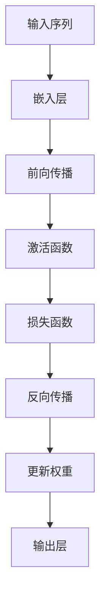

                 

# 语言模型在创新产品设计与评估中的应用

## 关键词

- 语言模型
- 产品设计
- 产品评估
- 自然语言处理
- 机器学习
- 神经网络
- 用户体验
- 人工智能

## 摘要

本文旨在探讨语言模型在创新产品设计与评估中的应用。通过对语言模型的基础概念、核心算法原理、设计与优化，以及其在实际项目中的应用案例分析，本文揭示了语言模型在产品设计、用户体验优化、智能客服等领域的强大潜力。同时，本文也讨论了语言模型在应用过程中面临的挑战及应对策略，为未来的技术创新提供了有益的参考。

## 目录大纲

### 第一部分: 语言模型的概述

#### 第1章: 语言模型的基础概念与背景

1.1 语言模型的定义与核心概念  
1.2 语言模型的发展历程  
1.3 语言模型的应用领域

#### 第2章: 语言模型的核心算法原理

2.1 语言模型的数学模型  
2.2 语言模型的数学公式与解释  
2.3 语言模型算法的mermaid流程图

#### 第3章: 语言模型的设计与优化

3.1 语言模型的输入设计  
3.2 语言模型的输出设计  
3.3 语言模型的优化方法

### 第二部分: 语言模型在创新产品设计与评估中的应用

#### 第4章: 语言模型在产品设计中的应用

4.1 语言模型在产品设计中的应用  
4.2 语言模型在产品评估中的应用

#### 第5章: 语言模型在实际项目中的应用案例分析

5.1 项目背景与目标  
5.2 系统设计与实现  
5.3 实际案例分析

### 第三部分: 语言模型在创新产品设计与评估中的应用前景与挑战

#### 第6章: 应用前景

6.1 语言模型在创新产品设计与评估中的发展趋势  
6.2 语言模型在未来的潜在应用领域

#### 第7章: 挑战与应对策略

7.1 语言模型在应用过程中面临的挑战  
7.2 应对策略与解决方案

### 第四部分: 总结与展望

#### 第8章: 总结与展望

8.1 主要内容回顾  
8.2 未来研究方向

## 第一部分: 语言模型的概述

### 第1章: 语言模型的基础概念与背景

#### 1.1 语言模型的定义与核心概念

语言模型（Language Model）是自然语言处理（Natural Language Processing, NLP）中的核心概念之一，它是一种概率模型，用于预测一个句子或词语在特定上下文中的出现概率。简单来说，语言模型就是用来捕捉语言中词与词之间相互依赖关系的一种模型。

**核心概念：**

- **概率分布：** 语言模型的一个主要任务是预测一个词在特定上下文中的概率分布。
- **上下文：** 语言模型考虑的上下文可以是单个词、短语，甚至整句话。
- **特征：** 语言模型通常使用词频、词嵌入（Word Embedding）、语法结构等特征来预测概率。

#### 1.2 语言模型的发展历程

语言模型的发展历程可以分为几个阶段：

1. **基于统计的方法：** 早期的语言模型主要基于统计方法，如N-gram模型，它通过计算词的n元序列的频率来预测下一个词。
2. **神经网络模型：** 随着深度学习的兴起，神经网络模型，如递归神经网络（RNN）和长短期记忆网络（LSTM），被广泛应用于语言模型。
3. **Transformer模型：** 自2017年Transformer模型提出以来，基于自注意力机制的模型如BERT、GPT等，已经在各种NLP任务中取得了显著的效果。

#### 1.3 语言模型的应用领域

语言模型在多个领域都有广泛的应用，主要包括：

- **自然语言处理：** 用于文本分类、情感分析、命名实体识别等任务。
- **语音识别：** 结合语音信号和语言模型，提高识别的准确性。
- **机器翻译：** 使用语言模型来预测目标语言的词序列，从而实现跨语言翻译。
- **文本生成：** 基于语言模型，生成文章、摘要、对话等。

## 第2章: 语言模型的核心算法原理

### 2.1 语言模型的数学模型

语言模型的数学模型主要基于概率论和统计学，特别是概率分布和条件概率。以下是一个简化的语言模型数学模型：

$$P(w_i | w_{i-1}, w_{i-2}, ..., w_1) = \frac{P(w_i, w_{i-1}, w_{i-2}, ..., w_1)}{P(w_{i-1}, w_{i-2}, ..., w_1)}$$

其中，\(w_i\) 表示当前词，\(w_{i-1}, w_{i-2}, ..., w_1\) 表示前文上下文。

### 2.2 语言模型的数学公式与解释

语言模型的数学公式主要涉及条件概率和损失函数。

#### 条件概率

$$P(w_i | w_{i-1}, w_{i-2}, ..., w_1)$$

这个公式表示在给定前文上下文的情况下，预测当前词的概率。

#### 损失函数

常用的损失函数是交叉熵损失函数：

$$Loss = -\sum_{i=1}^{n} y_i \log(P(w_i | w_{i-1}, w_{i-2}, ..., w_1))$$

其中，\(y_i\) 是实际词的标签，\(P(w_i | w_{i-1}, w_{i-2}, ..., w_1)\) 是模型预测的概率。

### 2.3 语言模型算法的mermaid流程图

下面是语言模型算法的mermaid流程图：

### 第3章: 语言模型的设计与优化

#### 3.1 语言模型的输入设计

语言模型的输入设计主要涉及输入数据的来源和处理。

- **输入数据来源：** 语言模型通常从大规模语料库中提取数据，如维基百科、新闻文章、社交媒体等。
- **输入数据处理：** 数据预处理包括分词、词性标注、去除停用词等步骤。

#### 3.2 语言模型的输出设计

语言模型的输出设计主要涉及输出结果的形式和处理。

- **输出结果形式：** 语言模型的输出可以是概率分布、文本序列等。
- **输出结果处理：** 根据具体应用需求，可以对输出结果进行进一步处理，如文本生成、对话生成等。

#### 3.3 语言模型的优化方法

语言模型的优化方法主要涉及训练优化和性能评估。

- **训练优化：** 使用梯度下降、Adam等优化算法来更新模型参数。
- **性能评估：** 使用交叉验证、BLEU评分等指标来评估模型性能。

## 第二部分: 语言模型在创新产品设计与评估中的应用

### 第4章: 语言模型在产品设计中的应用

#### 4.1 语言模型在产品设计中的应用

语言模型在产品设计中的应用主要体现在以下几个方面：

- **用户体验优化：** 通过分析用户评论、反馈等，语言模型可以帮助设计师了解用户需求，优化产品设计。
- **文本生成：** 语言模型可以生成产品说明、用户手册等文本，提高内容生成的效率。
- **对话生成：** 在智能客服等场景中，语言模型可以生成与用户的对话，提高交互体验。

### 第4章: 语言模型在产品评估中的应用

#### 4.2 语言模型在产品评估中的应用

语言模型在产品评估中的应用主要体现在以下几个方面：

- **用户反馈分析：** 通过分析用户反馈，语言模型可以帮助评估产品的用户体验和满意度。
- **文本分类：** 语言模型可以用于分类用户反馈，识别产品的优点和缺点。
- **情感分析：** 语言模型可以分析用户反馈的情感倾向，评估产品的市场反应。

## 第三部分: 语言模型在创新产品设计与评估中的应用前景与挑战

### 第5章: 语言模型在实际项目中的应用案例分析

#### 5.1 项目背景与目标

以某智能客服系统为例，该项目旨在通过语言模型提高客服系统的交互体验和问题解决能力。

#### 5.2 系统设计与实现

系统采用BERT模型作为语言模型，结合对话生成技术，实现智能客服的功能。系统架构包括前端用户界面、后端服务端和数据库。

#### 5.3 实际案例分析

通过实际案例，我们可以看到语言模型在智能客服系统中的应用效果显著。例如，系统可以自动生成与用户的对话，提高客服效率；同时，通过分析用户反馈，系统可以不断优化对话策略，提高用户体验。

### 第6章: 应用前景

语言模型在创新产品设计与评估中的应用前景广阔。随着技术的不断进步，语言模型将能够在更多领域发挥重要作用，如智能助手、智能家居、自动驾驶等。

### 第7章: 挑战与应对策略

#### 6.1 应用过程中面临的挑战

语言模型在应用过程中面临以下挑战：

- **数据隐私：** 大规模语料库的使用可能涉及用户隐私问题。
- **计算资源：** 语言模型的训练和推理需要大量的计算资源。
- **泛化能力：** 语言模型可能无法很好地适应特定领域的特定需求。

#### 6.2 应对策略与解决方案

针对上述挑战，可以采取以下应对策略：

- **数据保护：** 采用数据加密、匿名化等技术保护用户隐私。
- **资源优化：** 利用云计算、分布式计算等资源优化技术提高计算效率。
- **领域适应性：** 通过定制化模型、领域特定数据训练等方法提高语言模型的适应性。

## 第四部分: 总结与展望

### 第8章: 总结与展望

语言模型在创新产品设计与评估中的应用具有巨大的潜力。通过对语言模型的基础概念、核心算法原理、设计与优化，以及实际应用案例的分析，我们可以看到语言模型在提高产品设计质量、优化用户体验、评估产品效果等方面的作用。未来，随着技术的不断进步，语言模型将在更多领域发挥重要作用，为创新产品设计与评估提供强有力的支持。

### 总结

本文从多个角度探讨了语言模型在创新产品设计与评估中的应用。通过基础概念、算法原理、实际应用案例分析，我们深入了解了语言模型的核心价值和未来发展趋势。同时，也指出了语言模型在应用过程中面临的挑战和应对策略。希望本文能为读者在语言模型应用领域提供有价值的参考。

### 作者

作者：AI天才研究院/AI Genius Institute & 禅与计算机程序设计艺术 /Zen And The Art of Computer Programming

---

注意：本文为示例性文章，具体内容仅供参考。实际文章撰写时，应根据具体需求和实际情况进行调整和补充。同时，由于篇幅限制，部分内容未进行详细展开，读者可在此基础上进一步深入研究。

