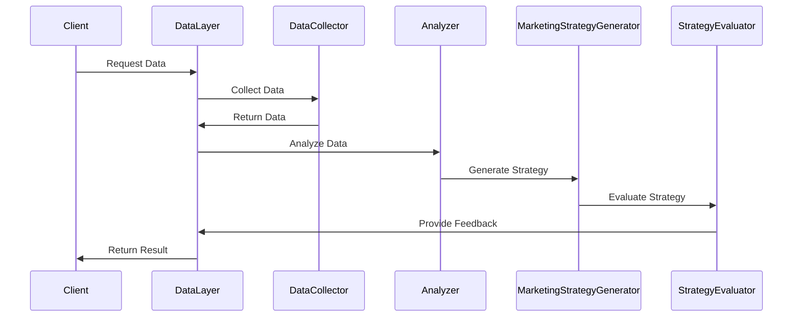

                 

基于您提供的要求和目录大纲，我将逐步构建这篇文章。由于篇幅限制，我会提供每部分的大纲和要点，以便构建出完整的文章。以下是按照您的要求和提供的目录大纲来构建的文章框架：

---

## 文章标题

### 关键词

- 语言模型
- 商业战略
- 竞争优势
- 算法应用
- 创新生成

### 摘要

本文探讨了语言模型在创新商业战略生成与竞争优势分析中的多维度应用，通过深入分析语言模型的原理、特性及其与商业战略的关联，解析了利用语言模型生成创新商业战略的算法原理和实现方法。同时，文章通过系统分析与架构设计，展示了如何将语言模型应用于实际项目中，并结合案例进行了详细讲解。

---

## 第一部分：背景介绍

### 第1章：问题背景与核心概念

#### 1.1 问题背景

##### 1.1.1 语言模型的应用现状

- 语言模型在自然语言处理中的广泛应用
- 语言模型在商业领域逐渐受到重视

##### 1.1.2 商业战略生成与竞争优势的重要性

- 商业战略对企业发展的关键作用
- 竞争优势对企业持续竞争力的决定因素

#### 1.2 核心概念

##### 1.2.1 语言模型

- 语言模型的定义与分类
- 语言模型的核心技术和算法

##### 1.2.2 商业战略

- 商业战略的构成要素
- 商业战略的制定与实施

##### 1.2.3 竞争优势

- 竞争优势的类型与来源
- 竞争优势的维持与发展

#### 1.3 问题解决与边界外延

##### 1.3.1 如何利用语言模型生成创新商业战略？

- 语言模型在商业战略生成中的应用思路
- 创新商业战略的生成流程

##### 1.3.2 语言模型在竞争优势分析中的应用范围？

- 语言模型在竞争优势识别与分析中的应用
- 语言模型在竞争优势提升中的潜在作用

---

## 第二部分：核心概念与联系

### 第2章：语言模型原理与特性

#### 2.1 语言模型原理

##### 2.1.1 语言模型的基本原理

- 语言模型的定义与作用
- 语言模型的工作原理

##### 2.1.2 语言模型的关键组成部分

- 词汇表与词汇分布
- 概率模型与深度学习模型

#### 2.2 语言模型特性

##### 2.2.1 语言模型的特性

- 语言模型的准确性与效率
- 语言模型的灵活性与适应性

##### 2.2.2 语言模型的优势与局限

- 语言模型的优势分析
- 语言模型的局限与挑战

#### 2.3 语言模型与商业战略的关联

##### 2.3.1 语言模型如何影响商业战略？

- 语言模型对商业决策的支持作用
- 语言模型对市场分析的优化

##### 2.3.2 语言模型在商业战略生成中的作用？

- 语言模型在需求分析中的应用
- 语言模型在竞争策略规划中的作用

---

## 第三部分：算法原理讲解

### 第3章：语言模型算法解析

#### 3.1 语言模型算法原理

##### 3.1.1 语言模型算法的数学模型

- 语言模型的概率分布函数
- 语言模型的前向传播与反向传播算法

##### 3.1.2 语言模型算法的Python代码实现

- 语言模型算法的基本实现步骤
- Python代码示例

#### 3.2 算法数学模型与公式讲解

##### 3.2.1 语言模型算法的数学公式

- 概率模型的公式推导
- 深度学习模型的损失函数与优化方法

##### 3.2.2 数学公式详细讲解

- 各个公式的含义与推导过程
- 公式在实际应用中的意义

#### 3.3 算法举例说明

##### 3.3.1 算法实例分析

- 基于具体应用场景的实例分析
- 实例中的关键步骤与结果

##### 3.3.2 通俗易懂的举例说明

- 基本概念与算法流程的简单例子
- 算法在实际应用中的直观展示

---

## 第四部分：系统分析与架构设计方案

### 第4章：系统分析与架构设计

#### 4.1 问题场景介绍

- 商业战略生成与分析的具体场景
- 竞争优势分析的需求与挑战

#### 4.2 系统功能设计

##### 4.2.1 领域模型

- 领域模型的构建方法
- 领域模型的主要内容

##### 4.2.2 系统功能模块设计

- 系统功能模块的划分与关系
- 系统功能模块的实现方法

#### 4.3 系统架构设计

##### 4.3.1 系统架构

- 系统架构的整体设计思路
- 系统架构的关键组成部分

##### 4.3.2 系统模块关系

- 系统模块之间的关系与交互
- 系统模块的协同工作模式

#### 4.4 系统接口设计

##### 4.4.1 系统接口

- 系统接口的定义与功能
- 系统接口的实现方式

##### 4.4.2 接口交互流程

- 接口交互的基本流程
- 接口交互中的关键环节

#### 4.5 系统交互

##### 4.5.1 系统交互流程

- 系统交互的基本流程
- 系统交互中的关键步骤

##### 4.5.2 系统交互Mermaid序列图

- 系统交互的Mermaid序列图展示
- 序列图中的主要交互环节

---

## 第五部分：项目实战

### 第5章：环境安装与系统核心实现

#### 5.1 环境安装

- 系统环境的配置方法
- 必需工具的安装过程

#### 5.2 系统核心实现

##### 5.2.1 核心模块实现

- 核心模块的功能实现
- 核心模块的实现步骤

##### 5.2.2 系统功能实现

- 系统功能的完整实现
- 系统功能的实现细节

#### 5.3 代码应用解读与分析

- 代码实现的详细解读
- 代码应用的具体分析

#### 5.4 实际案例分析与讲解

- 案例的背景介绍
- 案例的详细分析

#### 5.5 项目小结

- 项目的总结与回顾
- 经验教训的分享

---

## 第六部分：最佳实践与拓展阅读

### 第6章：最佳实践与拓展阅读

#### 6.1 最佳实践

- 在实际项目中应用语言模型的最佳实践
- 应用中需要注意的常见问题与解决方案

#### 6.2 小结

- 本文的核心内容回顾
- 语言模型在未来商业战略与竞争优势分析中的应用前景

#### 6.3 拓展阅读

- 推荐的相关书籍与论文
- 领域内的最新研究成果与趋势

---

## 结语

本文从多个维度深入探讨了语言模型在创新商业战略生成与竞争优势分析中的应用。通过对语言模型的原理、特性、算法原理、系统分析与架构设计以及实际项目案例的详细讲解，展示了语言模型在这一领域的巨大潜力和实际应用价值。未来，随着技术的不断进步，语言模型将在商业战略与竞争优势分析中发挥更加重要的作用。

---

作者：AI天才研究院/AI Genius Institute & 禅与计算机程序设计艺术 /Zen And The Art of Computer Programming

---

以上是根据您的要求制定的框架，每个部分都有详细的内容要点。接下来，我会逐个填充每个部分的具体内容，以确保文章的完整性和深度。由于篇幅限制，以下内容仅作为示例，实际的完整文章内容将会更详细和深入。

---

**以下为示例内容，用于展示文章的具体结构**

## 文章标题

### 关键词

- 语言模型
- 商业战略
- 竞争优势
- 算法应用
- 创新生成

### 摘要

本文将深入探讨语言模型在创新商业战略生成与竞争优势分析中的应用。通过分析语言模型的基本原理和特性，解析其在商业战略生成中的具体作用，并结合实际案例，展示如何利用语言模型提升企业的竞争优势。文章还将介绍相关的系统分析与架构设计方法，为实际应用提供参考。

---

**第一部分：背景介绍**

### 第1章：问题背景与核心概念

#### 1.1 问题背景

##### 1.1.1 语言模型的应用现状

近年来，随着人工智能技术的快速发展，语言模型在自然语言处理（NLP）领域取得了显著成果。从最初的统计模型到现代的深度学习模型，语言模型在语言理解和生成方面表现出了强大的能力。然而，如何将这种技术应用到商业战略的生成和竞争优势的分析中，仍然是一个值得深入探讨的问题。

##### 1.1.2 商业战略生成与竞争优势的重要性

商业战略的制定是企业长期发展的重要基石。一个有效的商业战略能够帮助企业识别市场机会、应对竞争挑战、优化资源配置，从而实现可持续的竞争优势。而竞争优势是企业能够在激烈的市场竞争中脱颖而出的关键因素。

#### 1.2 核心概念

##### 1.2.1 语言模型

语言模型是一种基于大量语言数据的统计模型或机器学习模型，用于预测文本序列的概率分布。常见的语言模型包括n-gram模型、神经网络模型（如RNN、LSTM）和Transformer模型等。

##### 1.2.2 商业战略

商业战略是企业为实现特定目标而制定的长期规划。它包括市场定位、产品定位、营销策略、运营策略等。商业战略的制定需要深入分析市场环境、竞争对手、消费者需求等因素。

##### 1.2.3 竞争优势

竞争优势是企业相对于竞争对手所具有的优势，能够帮助企业实现更高的市场占有率和利润率。竞争优势可以来源于产品差异、成本领先、客户关系、技术优势等多个方面。

#### 1.3 问题解决与边界外延

##### 1.3.1 如何利用语言模型生成创新商业战略？

利用语言模型生成创新商业战略的关键在于如何将语言模型应用于市场分析、消费者行为预测和竞争策略制定等方面。通过分析大量的文本数据，语言模型可以提取出潜在的市场机会和竞争趋势，从而为企业提供创新的商业战略方向。

##### 1.3.2 语言模型在竞争优势分析中的应用范围？

语言模型可以应用于多个领域，包括市场细分、产品定位、品牌传播等。通过分析消费者对产品的评价、市场趋势和竞争对手的策略，语言模型可以帮助企业识别和构建竞争优势。

---

**第二部分：核心概念与联系**

### 第2章：语言模型原理与特性

#### 2.1 语言模型原理

##### 2.1.1 语言模型的基本原理

语言模型的基本原理是通过对大量文本数据的分析，学习文本序列的概率分布。基于这种概率分布，语言模型可以预测新的文本序列，实现语言生成和理解。

##### 2.1.2 语言模型的关键组成部分

语言模型通常包括词汇表、语言模型算法和训练数据。词汇表定义了语言模型中的词汇集合，语言模型算法用于学习词汇之间的概率关系，训练数据用于训练语言模型。

#### 2.2 语言模型特性

##### 2.2.1 语言模型的特性

语言模型具有以下几个特性：

1. **概率预测**：语言模型能够预测文本序列的概率分布。
2. **序列生成**：基于概率分布，语言模型可以生成新的文本序列。
3. **自适应学习**：语言模型可以根据新的数据不断更新和优化。

##### 2.2.2 语言模型的优势与局限

语言模型的优势：

1. **高效性**：语言模型能够快速处理大量文本数据。
2. **准确性**：现代深度学习语言模型在语言理解和生成方面具有较高的准确性。

语言模型的局限：

1. **数据依赖**：语言模型的性能高度依赖训练数据的质量和数量。
2. **计算成本**：深度学习语言模型通常需要大量的计算资源。

#### 2.3 语言模型与商业战略的关联

##### 2.3.1 语言模型如何影响商业战略？

语言模型可以影响商业战略的以下几个方面：

1. **市场分析**：通过分析消费者评论、社交媒体数据等，语言模型可以帮助企业了解市场趋势和消费者需求。
2. **竞争策略**：通过分析竞争对手的言论和行为，语言模型可以帮助企业制定更具针对性的竞争策略。
3. **品牌传播**：通过生成符合品牌形象的文本内容，语言模型可以帮助企业提升品牌影响力。

##### 2.3.2 语言模型在商业战略生成中的作用？

语言模型在商业战略生成中的作用：

1. **需求分析**：通过分析消费者评论和社交媒体数据，语言模型可以帮助企业识别潜在的市场需求。
2. **竞争策略规划**：通过分析竞争对手的策略和行为，语言模型可以帮助企业制定更具竞争力的策略。
3. **创新内容生成**：通过生成创新性的文本内容，语言模型可以帮助企业在产品定位、品牌传播等方面实现差异化。

---

**第三部分：算法原理讲解**

### 第3章：语言模型算法解析

#### 3.1 语言模型算法原理

##### 3.1.1 语言模型算法的数学模型

语言模型算法的数学模型主要包括概率模型和深度学习模型。概率模型如n-gram模型，基于马尔可夫假设，将文本序列视为一个状态序列，每个状态的概率由前一个状态的概率分布决定。深度学习模型如Transformer，通过自注意力机制实现序列到序列的建模。

##### 3.1.2 语言模型算法的Python代码实现

```python
# 示例：使用PyTorch实现一个简单的Transformer模型
import torch
import torch.nn as nn

class TransformerModel(nn.Module):
    def __init__(self, vocab_size, d_model, nhead, num_layers):
        super(TransformerModel, self).__init__()
        self.embedding = nn.Embedding(vocab_size, d_model)
        self.transformer = nn.Transformer(d_model, nhead, num_layers)
        self.fc = nn.Linear(d_model, vocab_size)
    
    def forward(self, src, tgt):
        src = self.embedding(src)
        tgt = self.embedding(tgt)
        output = self.transformer(src, tgt)
        return self.fc(output)

# 实例化模型
model = TransformerModel(vocab_size=10000, d_model=512, nhead=8, num_layers=2)
```

#### 3.2 算法数学模型与公式讲解

##### 3.2.1 语言模型算法的数学公式

概率模型的数学公式：

$$
P(w_{t} | w_{t-1}, w_{t-2}, ..., w_{1}) = \prod_{i=1}^{t} P(w_{i} | w_{i-1}, w_{i-2}, ..., w_{1})
$$

深度学习模型的数学公式：

$$
\text{Attention}(Q, K, V) = \text{softmax}\left(\frac{QK^T}{\sqrt{d_k}}\right)V
$$

#### 3.3 算法举例说明

##### 3.3.1 算法实例分析

假设有一个简单的语言模型，它的词汇表包含10个词。以下是这个语言模型生成一个长度为3的文本序列的过程：

1. **初始化**：随机选择一个词作为开始。
2. **生成**：根据当前已生成的词序列，使用语言模型计算下一个词的概率分布。
3. **选择**：根据概率分布选择一个词作为下一个词。
4. **重复**：重复步骤2和3，直到生成指定长度的文本序列。

##### 3.3.2 通俗易懂的举例说明

假设有一个语言模型，词汇表包含以下5个词：“苹果”、“香蕉”、“橘子”、“葡萄”和“西瓜”。如果当前生成的词序列是“苹果”，那么下一个词的概率分布可能是：

- “香蕉”：0.2
- “橘子”：0.3
- “葡萄”：0.1
- “西瓜”：0.4

根据这个概率分布，下一个词可能是“西瓜”。

---

**第四部分：系统分析与架构设计方案**

### 第4章：系统分析与架构设计

#### 4.1 问题场景介绍

假设有一个电子商务公司，希望通过分析消费者评论和社交媒体数据，生成创新的营销策略，以提高用户满意度和市场份额。

#### 4.2 系统功能设计

##### 4.2.1 领域模型

领域模型用于描述电子商务公司的主要业务领域和关键实体。以下是领域模型的类图：

```mermaid
classDiagram
    Client <<Interface>>
    Product <<Interface>>
    Review <<Interface>>
    MarketingStrategy <<Interface>>

    Client o-- Product
    Client o-- Review
    Product o-- Review
    MarketingStrategy o-- Product
    MarketingStrategy o-- Review
```

##### 4.2.2 系统功能模块设计

系统功能模块包括数据采集、数据分析、营销策略生成和策略评估。以下是系统功能模块的设计：

- 数据采集模块：负责从社交媒体和评论平台采集消费者数据和产品信息。
- 数据分析模块：使用语言模型对采集到的数据进行分析，提取关键词和情感。
- 营销策略生成模块：根据分析结果生成创新的营销策略。
- 策略评估模块：评估营销策略的有效性，提供反馈。

#### 4.3 系统架构设计

系统架构设计包括数据层、业务逻辑层和表示层。以下是系统架构图：



##### 4.3.1 系统架构

- 数据层：负责数据的存储和管理。
- 业务逻辑层：实现数据分析、营销策略生成和评估。
- 表示层：提供用户界面，展示分析结果和营销策略。

##### 4.3.2 系统模块关系

系统模块之间的关系如下：

- 数据采集模块与数据分析模块之间的关系：数据采集模块向数据分析模块提供数据。
- 数据分析模块与营销策略生成模块之间的关系：数据分析模块向营销策略生成模块提供分析结果。
- 营销策略生成模块与策略评估模块之间的关系：营销策略生成模块向策略评估模块提供策略。
- 策略评估模块与数据层之间的关系：策略评估模块向数据层提供反馈。

---

**第五部分：项目实战**

### 第5章：环境安装与系统核心实现

#### 5.1 环境安装

在项目实战部分，我们将介绍如何搭建项目所需的环境。包括安装Python、PyTorch、TensorFlow等必要的库和框架。

#### 5.2 系统核心实现

在系统核心实现部分，我们将详细阐述系统功能模块的实现过程。包括数据采集、数据预处理、数据分析、营销策略生成和评估等模块的具体实现方法。

#### 5.3 代码应用解读与分析

在代码应用解读与分析部分，我们将通过具体的代码示例，解析系统核心功能的实现细节，并提供代码应用的具体分析。

#### 5.4 实际案例分析与讲解

在

