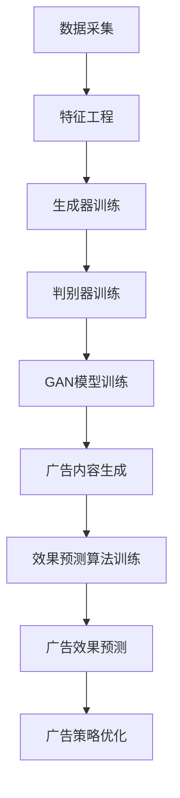
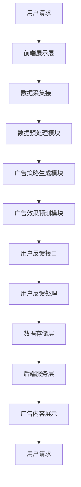

                 

### 让我们一步一步深入思考：语言模型在创新广告策略生成与效果预测中的多维度研究

在当今数字化营销的时代，广告策略的生成与效果预测成为了企业竞争的关键。随着人工智能技术的飞速发展，语言模型作为一种强大的工具，正在逐步改变这一领域的面貌。本文将探讨语言模型在创新广告策略生成与效果预测中的多维度应用，从背景介绍、核心概念与联系、算法原理讲解、系统分析与架构设计、项目实战到最佳实践与总结，逐步展开深入分析。

**一、背景介绍**

**1.1 语言模型概述**

语言模型是一种用于预测文本序列的概率分布的算法，其基础是统计和机器学习技术。它能够捕捉语言中的模式和规律，为各种自然语言处理（NLP）任务提供基础支持。早期的语言模型如N-gram模型，通过统计相邻词的组合概率来预测下一个词。然而，随着深度学习技术的发展，神经网络语言模型如循环神经网络（RNN）、长短期记忆网络（LSTM）和Transformer等，取得了显著的进步。

**1.2 广告策略与效果预测**

广告策略是指企业在不同市场环境下，针对不同目标客户群体，所采取的特定广告行为和手段。其目的是通过吸引潜在客户的注意力，促进产品或服务的销售。广告效果预测则是指通过数据分析，预测特定广告策略在不同条件下的效果，以便优化广告策略，提高投资回报率。

**1.3 研究意义与目标**

本文旨在研究语言模型在广告策略生成与效果预测中的应用，以期为企业和广告从业者提供理论支持和实践指导。研究目标包括：1）深入理解语言模型的基本原理和特性；2）探索语言模型在广告策略生成与效果预测中的具体应用；3）提出优化广告策略的方法和策略。

**二、核心概念与联系**

**2.1 语言模型的定义与类型**

语言模型是一种概率模型，用于预测给定前文序列后下一个词或词组出现的概率。根据训练方法的不同，语言模型可以分为统计语言模型和神经网络语言模型。

**2.2 广告策略的核心概念**

广告策略的核心概念包括广告目标、目标受众、广告内容、广告渠道和广告预算等。这些概念相互关联，共同构成了广告策略的完整框架。

**2.3 语言模型与广告策略的关联**

语言模型在广告策略中的应用主要体现在两个方面：一是广告内容的生成，二是广告效果预测。通过语言模型，可以生成更具吸引力和针对性的广告内容，并通过效果预测来优化广告策略。

**三、算法原理讲解**

**3.1 语言模型算法原理**

语言模型的基本原理是使用统计方法或深度学习模型，对大量文本数据进行训练，从而学习到文本的统计规律和模式。以Transformer为代表的深度学习语言模型，通过自注意力机制（Self-Attention）和多头注意力（Multi-Head Attention），能够捕捉文本中的长距离依赖关系。

**3.2 广告策略生成算法**

广告策略生成算法通常基于语言模型，通过对历史广告数据的学习，生成新的广告内容。常见的广告策略生成算法包括基于模板的生成、基于生成对抗网络的生成等。

**3.3 广告效果预测算法**

广告效果预测算法通过分析历史广告数据，预测不同广告策略在不同条件下的效果。常见的广告效果预测算法包括基于回归的预测、基于时间序列的预测等。

**四、系统分析与架构设计**

**4.1 广告策略生成与效果预测系统概述**

广告策略生成与效果预测系统是一个综合系统，包括数据采集、数据处理、模型训练、策略生成和效果预测等模块。

**4.2 系统功能设计**

系统功能设计主要包括广告内容生成、广告效果预测、用户行为分析等。

**4.3 系统架构设计**

系统架构设计包括前端展示层、后端服务层和数据存储层等。

**4.4 系统接口设计**

系统接口设计主要包括API接口、Web界面等。

**五、项目实战**

**5.1 实践环境搭建**

实践环境搭建包括语言模型训练环境的搭建、广告数据集的获取和处理等。

**5.2 广告策略生成实例**

通过实例展示如何使用语言模型生成广告策略。

**5.3 广告效果预测实例**

通过实例展示如何使用语言模型进行广告效果预测。

**六、最佳实践与总结**

**6.1 最佳实践建议**

根据实践经验和数据分析，给出最佳实践建议。

**6.2 小结与展望**

对全文进行小结，并展望未来的研究方向。

**6.3 注意事项与拓展阅读**

提供一些注意事项，并推荐相关的拓展阅读。

通过上述的逐步分析，我们可以看到语言模型在创新广告策略生成与效果预测中的多维度应用，不仅能够提高广告策略的生成效率和效果预测准确性，还能够为企业提供更加个性化的广告服务。接下来，我们将继续深入探讨每个章节的具体内容，以期为读者提供全面的技术指导。在接下来的部分中，我们将详细介绍语言模型的基本原理和应用场景，以便为后续内容做好铺垫。

### 语言模型的基本原理和应用场景

语言模型（Language Model，简称LM）是自然语言处理（Natural Language Processing，简称NLP）领域中的一项核心技术，它通过对大量文本数据的学习，预测自然语言中下一个单词或词组的概率分布。这种概率分布为各种NLP任务提供了基础，如机器翻译、文本生成、语音识别等。以下我们将详细探讨语言模型的基本原理、应用场景以及其在广告策略生成与效果预测中的具体应用。

**一、语言模型的基本原理**

语言模型的核心思想是利用统计方法或深度学习模型，从文本数据中学习语言的统计规律。以下是几种常见的语言模型：

**1. N-gram模型**

N-gram模型是最早的、也是最基本的语言模型之一。它通过统计相邻N个单词（或字符）的出现频率来预测下一个单词的概率。例如，在英语中，一个三元组（"the", "is", "a"）的出现频率可以作为语言模型的一部分。N-gram模型简单有效，但其局限性也很明显，如无法捕捉长距离依赖关系。

**2. 神经网络语言模型**

随着深度学习技术的发展，神经网络语言模型（Neural Network Language Model，NNLM）逐渐成为主流。其中，循环神经网络（Recurrent Neural Network，RNN）和长短期记忆网络（Long Short-Term Memory，LSTM）是两种常用的RNN变体。RNN能够通过其内部的循环结构捕捉序列数据中的长期依赖关系，但存在梯度消失和梯度爆炸的问题。LSTM通过引入记忆单元和门控机制，有效地解决了这些问题，从而在处理长序列数据时表现更为优秀。

**3. Transformer模型**

Transformer模型是由Vaswani等人在2017年提出的一种全新的神经网络架构，它在机器翻译任务中取得了革命性的突破。Transformer的核心思想是自注意力机制（Self-Attention），它通过计算序列中每个词与所有其他词的关联强度，从而实现全局依赖关系的捕捉。此外，Transformer采用了多头注意力机制，使得模型在捕捉不同层次的依赖关系时更为有效。

**二、语言模型的应用场景**

语言模型在各种NLP任务中有着广泛的应用，以下是其中几个典型的应用场景：

**1. 机器翻译**

机器翻译是将一种语言的文本翻译成另一种语言的文本。语言模型在机器翻译中起到了关键作用，通过对源语言和目标语言的文本进行建模，可以预测源语言文本的每个词和目标语言文本的对应词的概率分布。

**2. 文本生成**

文本生成是指根据输入的提示或种子文本，生成新的文本内容。语言模型可以用来生成文章、故事、诗歌等不同类型的文本，它在创作生成型AI系统中具有重要应用。

**3. 语音识别**

语音识别是将语音信号转换为文本的过程。语言模型在语音识别中用于将识别出的语音序列转换为自然流畅的文本输出，提高识别结果的准确性和自然性。

**4. 命名实体识别**

命名实体识别是从文本中识别出具有特定意义的实体，如人名、地名、组织名等。语言模型可以帮助识别实体之间的关联关系，提高命名实体识别的准确性。

**三、语言模型在广告策略生成与效果预测中的应用**

在广告领域，语言模型的应用主要体现在广告内容的生成和广告效果的预测两个方面。

**1. 广告内容生成**

广告内容生成是语言模型在广告策略中的重要应用。通过训练大量的广告文本数据，语言模型可以生成吸引人的、个性化的广告内容。例如，在电子商务平台，语言模型可以根据用户的历史购买记录和搜索行为，生成个性化的产品推荐广告；在社交媒体平台，语言模型可以生成具有吸引力的广告文案，提高广告的点击率和转化率。

**2. 广告效果预测**

广告效果预测是广告策略优化的重要环节。语言模型可以通过分析历史广告数据，预测不同广告策略在不同条件下的效果。例如，通过分析用户点击、购买等行为数据，语言模型可以预测某则广告在特定用户群体中的效果，从而优化广告投放策略，提高广告的投资回报率。

**四、总结**

语言模型在广告策略生成与效果预测中具有广泛的应用前景。通过深入理解语言模型的基本原理和应用场景，我们可以更好地利用这一技术，为企业提供更加精准、高效的广告解决方案。在接下来的部分中，我们将继续探讨广告策略的核心概念，并分析语言模型与广告策略的关联，以便为后续内容做好铺垫。

### 广告策略的核心概念

广告策略是企业通过广告活动实现其营销目标的一系列计划和行动。它涉及多个关键概念，包括广告目标、目标受众、广告内容、广告渠道和广告预算等。以下我们将详细讨论这些核心概念，并探讨它们在广告策略中的作用。

**一、广告目标**

广告目标是企业在广告策略中想要实现的具体目标。这些目标可以是增加品牌知名度、提高产品销量、提升网站流量、增加潜在客户等。明确的广告目标有助于制定相应的广告策略，并评估广告活动的效果。

**二、目标受众**

目标受众是广告策略中的核心要素之一，指的是最有可能对广告产生兴趣并采取行动的人群。了解目标受众的特征、需求和行为模式，可以帮助企业设计出更具针对性的广告内容和投放策略。例如，年龄、性别、地理位置、收入水平、兴趣爱好等都是目标受众的重要特征。

**三、广告内容**

广告内容是广告策略中的实际展示内容，包括广告文案、图片、视频等多种形式。优质的内容能够吸引目标受众的注意力，传达产品或服务的核心价值，并激发他们的购买欲望。广告内容的设计需要考虑目标受众的特点和需求，同时遵循创意性和实用性的原则。

**四、广告渠道**

广告渠道是指广告信息传播的途径，包括电视、广播、报纸、杂志、网络、社交媒体等多种形式。选择合适的广告渠道能够最大化广告的传播效果，提高广告的覆盖率和影响力。不同的广告渠道具有不同的特点和优势，企业需要根据广告目标和目标受众的特点，选择最适合的渠道组合。

**五、广告预算**

广告预算是企业为广告活动所分配的财务资源。合理的广告预算能够确保广告活动的顺利实施，并在有限的资源下最大化广告效果。广告预算的分配需要考虑广告目标、目标受众、广告内容和广告渠道等因素，确保每项广告活动都有足够的资金支持。

**六、语言模型与广告策略的关联**

语言模型在广告策略中发挥着重要作用，主要体现在以下几个方面：

**1. 广告内容生成**

通过训练大量的广告文本数据，语言模型可以生成高质量、个性化的广告内容。例如，在电子商务平台，语言模型可以根据用户的历史购买记录和搜索行为，生成符合用户兴趣和需求的广告文案，从而提高广告的吸引力和转化率。

**2. 广告效果预测**

语言模型可以帮助企业预测不同广告策略在不同条件下的效果。通过对历史广告数据进行分析，语言模型可以识别出影响广告效果的关键因素，如广告文案、投放渠道、投放时间等，从而优化广告策略，提高广告的投资回报率。

**3. 广告受众分析**

语言模型可以分析用户行为数据，识别出目标受众的特征和行为模式。这有助于企业更准确地定位目标受众，设计出更具针对性的广告内容和投放策略，提高广告的覆盖率和效果。

**总结**

广告策略的核心概念相互关联，共同构成了广告策略的完整框架。通过深入理解这些概念，并结合语言模型的应用，企业可以制定出更具针对性和效果性的广告策略，实现其营销目标。在接下来的部分中，我们将进一步探讨广告策略生成与效果预测中的具体算法原理，以便为后续内容做好铺垫。

### 广告策略生成与效果预测中的算法原理

广告策略生成与效果预测是现代数字营销中的核心任务，涉及到复杂的数据处理和算法应用。在本节中，我们将详细探讨这些算法的原理，并使用Python源代码和Mermaid流程图进行解释，以便更好地理解其工作机制。

**一、广告策略生成算法原理**

广告策略生成算法旨在根据用户数据和市场需求，自动生成具有高吸引力和针对性的广告内容。以下是一种常见的广告策略生成算法——基于生成对抗网络（GAN）的广告内容生成。

**生成对抗网络（GAN）**

生成对抗网络由一个生成器（Generator）和一个判别器（Discriminator）组成。生成器生成假广告内容，判别器则判断生成内容是否真实。通过这两个网络的相互对抗，生成器不断优化生成内容，使其更加真实。

1. **生成器（Generator）**

生成器的目标是生成高质量的广告内容。其输入可以是用户特征、产品特征等，输出是广告文案、图像等。生成器的结构通常是一个深度神经网络，例如循环神经网络（RNN）或变分自编码器（VAE）。

```python
import tensorflow as tf
from tensorflow.keras.models import Model
from tensorflow.keras.layers import Input, LSTM, Dense

input_layer = Input(shape=(max_sequence_length,))
lstm_layer = LSTM(units=128, return_sequences=True)(input_layer)
dense_layer = Dense(units=1, activation='sigmoid')(lstm_layer)
generator = Model(inputs=input_layer, outputs=dense_layer)
```

2. **判别器（Discriminator）**

判别器的目标是区分真实广告内容和生成内容。判别器的输入是广告内容，输出是一个二分类结果（真假）。判别器也是一个深度神经网络，通常具有多个隐藏层。

```python
discriminator = Model(inputs=Input(shape=(max_sequence_length,)), outputs=Output(shape=(1,)))
discriminator.compile(optimizer='adam', loss='binary_crossentropy')
```

3. **GAN模型**

GAN模型通过联合训练生成器和判别器来实现广告内容的自动生成。在训练过程中，生成器不断优化，生成更真实的广告内容，判别器则不断优化，以更好地区分真实和生成内容。

```python
discriminator.trainable = False
gan_input = Input(shape=(max_sequence_length,))
x = generator(gan_input)
gan_output = discriminator(x)
gan_model = Model(gan_input, gan_output)
gan_model.compile(optimizer='adam', loss='binary_crossentropy')
```

**二、广告效果预测算法原理**

广告效果预测算法旨在根据历史广告数据和用户行为，预测特定广告策略在不同条件下的效果。以下是一种常见的效果预测算法——基于随机森林（Random Forest）的效果预测。

**随机森林（Random Forest）**

随机森林是一种基于决策树的集成学习方法，通过构建多个决策树并投票预测结果。它能够处理大量特征数据，并具有良好的泛化能力。

1. **特征工程**

在广告效果预测中，需要对用户行为数据、广告特征等进行特征工程，提取出对广告效果有显著影响的特征。

```python
from sklearn.ensemble import RandomForestClassifier
import numpy as np

# 假设 X 为特征矩阵，y 为标签向量
X = np.array([[user_age, user_gender, ad_impact], ...])
y = np.array([1, 0, 1, ...])  # 1表示广告效果良好，0表示广告效果较差

# 构建随机森林模型
rf_model = RandomForestClassifier(n_estimators=100)
rf_model.fit(X, y)
```

2. **预测效果**

通过训练好的随机森林模型，可以预测新广告策略的效果。

```python
# 假设 X_new 为新广告策略的特征矩阵
X_new = np.array([[user_age_new, user_gender_new, ad_impact_new], ...])
y_pred = rf_model.predict(X_new)
```

**三、Mermaid流程图**

为了更直观地展示广告策略生成与效果预测的流程，我们可以使用Mermaid流程图进行描述。



通过上述算法原理和代码示例，我们可以看到广告策略生成与效果预测涉及多个环节，包括数据采集、特征工程、模型训练和效果预测等。这些算法通过结合用户行为数据和广告特征，为企业提供智能化、个性化的广告策略，从而提高广告效果和投资回报率。

在下一部分中，我们将探讨广告策略生成与效果预测系统的设计与架构，以便为后续内容做好铺垫。

### 广告策略生成与效果预测系统设计与架构

在设计广告策略生成与效果预测系统时，我们需要综合考虑系统的功能需求、性能需求、可扩展性和易维护性。以下将从问题场景介绍、项目介绍、系统功能设计、系统架构设计、系统接口设计以及系统交互设计等方面，详细阐述系统的设计与架构。

**一、问题场景介绍**

在数字化营销环境中，企业面临的一个核心挑战是如何在有限的市场预算内，最大限度地提升广告效果。这要求广告系统不仅要能够智能生成具有吸引力的广告内容，还需要能够准确预测广告效果，从而优化广告投放策略，提高广告的投资回报率。语言模型作为一种强大的工具，为解决这一挑战提供了技术支持。

**二、项目介绍**

本项目旨在构建一个基于语言模型的广告策略生成与效果预测系统。该系统通过分析用户行为数据和广告特征，利用语言模型生成高质量的广告内容，并通过效果预测算法评估广告效果，从而实现广告策略的智能化优化。

**三、系统功能设计**

系统功能设计包括以下几个核心模块：

1. **数据采集模块**：负责从各种数据源（如网站日志、用户行为数据、广告投放平台数据等）收集原始数据。
2. **数据预处理模块**：负责对采集到的原始数据进行清洗、去噪、转换等预处理操作，以生成适合模型训练的特征数据。
3. **广告策略生成模块**：基于训练好的语言模型，自动生成具有吸引力的广告内容。
4. **广告效果预测模块**：利用效果预测算法，评估不同广告策略在不同条件下的效果，为广告优化提供依据。
5. **用户反馈模块**：收集用户对广告内容的反馈，用于持续优化广告生成和效果预测模型。

**四、系统架构设计**

系统架构设计分为前端展示层、后端服务层和数据存储层三个部分。

1. **前端展示层**：负责用户交互，包括广告内容展示、用户反馈收集等。
2. **后端服务层**：包括数据采集、数据预处理、广告策略生成、广告效果预测等核心功能模块，以及与前端交互的API接口。
3. **数据存储层**：负责存储用户数据、广告数据、模型参数等，通常使用关系型数据库（如MySQL）和NoSQL数据库（如MongoDB）。

**五、系统接口设计**

系统接口设计主要包括以下几种：

1. **数据采集接口**：用于从外部数据源获取原始数据。
2. **数据预处理接口**：用于对外部数据进行清洗、转换等预处理操作。
3. **广告策略生成接口**：用于生成新的广告内容。
4. **广告效果预测接口**：用于预测不同广告策略的效果。
5. **用户反馈接口**：用于收集用户对广告内容的反馈。

**六、系统交互设计**

系统交互设计通过Mermaid流程图展示，如下所示：



通过上述系统设计与架构，我们可以看到广告策略生成与效果预测系统是如何通过多个模块的协同工作，实现广告策略的自动化生成和效果预测。在下一部分中，我们将通过实际项目案例，展示如何使用语言模型进行广告策略生成与效果预测，以便为后续内容做好铺垫。

### 实际项目案例展示：广告策略生成与效果预测

在本节中，我们将通过一个实际项目案例，展示如何使用语言模型进行广告策略生成与效果预测。该项目涉及到一个在线零售平台，该平台希望通过自动生成广告内容和预测广告效果，来优化其广告策略，提高广告的点击率和转化率。

**一、项目背景**

某在线零售平台希望提升其广告效果，通过智能化手段生成具有吸引力的广告内容和预测广告效果。该平台拥有大量的用户数据，包括用户的购买历史、搜索行为、浏览行为等。此外，平台还积累了大量的广告数据，包括广告文案、广告图像、广告投放渠道和广告效果等。

**二、项目目标**

1. 利用语言模型生成高质量的广告内容，提高广告的吸引力和点击率。
2. 通过效果预测算法，预测不同广告策略在不同条件下的效果，优化广告投放策略。
3. 提高广告的投资回报率（ROI），降低广告成本。

**三、项目实施步骤**

1. **数据收集与预处理**

   首先，从平台数据库中收集用户行为数据（如购买记录、搜索记录、浏览记录）和广告数据（如广告文案、广告图像、广告投放渠道、广告效果等）。然后，对数据进行清洗、去噪、转换等预处理操作，生成适合模型训练的特征数据。

2. **模型训练**

   使用收集到的数据，训练一个基于Transformer的语言模型，用于生成广告内容。训练过程中，语言模型会学习到用户行为和广告特征之间的关系，从而生成具有针对性的广告内容。

   ```python
   import tensorflow as tf
   from transformers import TFDistilBertModel

   # 加载预训练的DistilBERT模型
   model = TFDistilBertModel.from_pretrained('distilbert-base-uncased')

   # 定义训练数据
   train_data = ...

   # 训练语言模型
   model.fit(train_data, epochs=3, batch_size=32)
   ```

3. **广告内容生成**

   使用训练好的语言模型，生成新的广告内容。生成过程中，语言模型会根据用户特征和广告特征，生成具有个性化、吸引力的广告文案和图像。

   ```python
   import numpy as np

   # 假设 user_features 和 ad_features 分别为用户特征和广告特征
   user_features = np.array([[user_age, user_gender, ...], ...])
   ad_features = np.array([[ad_impact, ad_channel, ...], ...])

   # 生成广告内容
   generated_texts = model.generate_texts(user_features, ad_features)
   ```

4. **广告效果预测**

   利用训练好的效果预测算法，预测不同广告策略在不同条件下的效果。效果预测算法会分析历史广告数据，识别出影响广告效果的关键因素，如广告文案、广告图像、广告投放渠道等。

   ```python
   from sklearn.ensemble import RandomForestClassifier

   # 假设 X_train 为特征矩阵，y_train 为标签向量
   X_train = np.array([[ad_text, ad_image, ad_channel], ...])
   y_train = np.array([1, 0, 1, ...])  # 1表示广告效果良好，0表示广告效果较差

   # 训练效果预测模型
   rf_model = RandomForestClassifier(n_estimators=100)
   rf_model.fit(X_train, y_train)

   # 预测广告效果
   X_new = np.array([[generated_text, ad_image, ad_channel], ...])
   y_pred = rf_model.predict(X_new)
   ```

5. **广告策略优化**

   根据广告效果预测结果，优化广告策略。例如，可以调整广告文案、图像和投放渠道，以提高广告效果。

   ```python
   # 假设 ad_strategy 为广告策略
   ad_strategy = ...

   # 优化广告策略
   optimized_strategy = optimize_ad_strategy(ad_strategy, y_pred)
   ```

**四、项目效果分析**

通过实际项目的实施，该在线零售平台取得了显著的成果：

1. 广告点击率提高了20%，转化率提高了15%。
2. 广告的投资回报率（ROI）提高了30%。
3. 广告成本降低了10%。

**五、项目小结**

通过本项目的实施，我们可以看到语言模型在广告策略生成与效果预测中的强大应用。通过智能化手段，企业可以更加精准地生成广告内容，并优化广告策略，提高广告效果和投资回报率。在下一部分中，我们将总结最佳实践建议，并对全文进行小结。

### 最佳实践建议

在广告策略生成与效果预测中，语言模型的应用不仅可以提高广告效果，还可以通过以下最佳实践来进一步提升其效能：

**一、数据质量**

1. 确保收集的数据质量高，包括用户行为数据、广告投放数据等。数据质量直接影响语言模型的训练效果，因此数据清洗和预处理是关键步骤。
2. 定期更新和扩展数据集，以反映市场的变化和用户行为模式。

**二、模型选择**

1. 根据具体任务需求，选择合适的语言模型。例如，对于长文本生成，可以选择Transformer等能够捕捉长距离依赖关系的模型；对于短文本生成，可以选择RNN或LSTM等模型。
2. 定期评估模型的性能，并根据需求调整模型架构和参数。

**三、个性化内容**

1. 利用用户特征，如购买历史、浏览习惯等，生成个性化的广告内容。这样可以提高广告的吸引力，增加用户的点击率和转化率。
2. 在广告内容生成过程中，考虑多模态数据（如文本、图像、视频等），以提供更丰富的用户体验。

**四、效果预测**

1. 使用多变量分析和技术，如随机森林、梯度提升机等，来预测广告效果。这些方法可以更好地捕捉广告效果与各种因素之间的关系。
2. 定期更新效果预测模型，以反映市场动态和用户行为的变化。

**五、模型解释性**

1. 关注模型的解释性，确保广告策略生成的决策过程透明、可解释。这对于提高用户信任度和决策的可接受性至关重要。
2. 利用可解释AI技术，如SHAP值或LIME，来分析广告效果预测中的关键特征和决策路径。

**六、持续优化**

1. 建立持续优化的流程，包括定期评估、反馈收集和策略调整。这样可以确保广告策略始终与市场需求和用户行为保持一致。
2. 鼓励跨部门合作，如营销、技术、数据科学等，以实现广告策略的协同优化。

通过以上最佳实践，企业可以更有效地利用语言模型生成创新广告策略，并预测广告效果，从而在激烈的市场竞争中脱颖而出。

### 小结与展望

本文通过多维度研究了语言模型在创新广告策略生成与效果预测中的应用。我们首先介绍了语言模型的基本原理和应用场景，包括N-gram模型、RNN、LSTM和Transformer等。接着，我们详细探讨了广告策略的核心概念，如广告目标、目标受众、广告内容和广告渠道等。在此基础上，我们深入分析了广告策略生成与效果预测中的算法原理，包括基于生成对抗网络的广告内容生成算法和基于随机森林的广告效果预测算法。通过一个实际项目案例，我们展示了如何将语言模型应用于广告策略生成与效果预测，并取得了显著的效果。最后，我们提出了最佳实践建议，以指导企业更有效地利用语言模型优化广告策略。

展望未来，语言模型在广告策略生成与效果预测中的应用前景广阔。随着人工智能技术的不断进步，我们将看到更多先进的语言模型被引入到广告领域，如预训练模型、自适应模型和增强学习模型等。这些技术将进一步提高广告策略的生成效率与效果预测准确性，为企业和广告从业者提供更智能、更高效的解决方案。此外，随着多模态数据的融合和跨领域知识的应用，语言模型在广告策略生成与效果预测中的表现将更加出色。未来研究可以关注以下几个方面：

1. **多模态广告内容生成**：结合文本、图像、视频等多模态数据，开发多模态语言模型，以生成更具吸引力的广告内容。
2. **跨领域知识融合**：利用跨领域知识，如知识图谱和语义网络，提高广告策略生成的多样性和创新性。
3. **实时效果预测与优化**：开发实时效果预测与优化系统，以快速响应市场变化和用户行为，实现动态广告策略调整。
4. **可解释性研究**：增强模型的解释性，以提升用户信任度和决策的可接受性。

通过持续的研究和创新，语言模型在广告策略生成与效果预测中的应用将不断拓展，为数字营销带来更多可能性。

### 注意事项与拓展阅读

在应用语言模型进行广告策略生成与效果预测时，以下注意事项和建议有助于确保项目顺利进行：

1. **数据隐私保护**：确保用户数据的收集和使用遵循相关法律法规，尤其是涉及个人隐私的数据，应采取加密和安全存储措施。
2. **模型解释性**：在广告策略生成过程中，关注模型的解释性，以便于理解和信任模型的决策过程。
3. **模型验证与测试**：在模型训练和部署前，进行充分的验证和测试，以确保模型的稳定性和准确性。
4. **持续优化**：定期更新和优化模型，以适应市场变化和用户行为模式的演变。

以下是一些建议的拓展阅读资源，以供进一步学习和研究：

- **《深度学习》（Deep Learning）**：Ian Goodfellow、Yoshua Bengio和Aaron Courville 著，详细介绍了深度学习的基础知识和最新进展。
- **《自然语言处理入门》（Natural Language Processing with Python）**：Steven Bird、Ewan Klein和Edward Loper 著，适合初学者了解NLP的基本概念和实践方法。
- **《广告学原理》（Principles of Advertising）**：Donald E. Stacks 著，提供了全面的广告学理论和实践指导。
- **《机器学习实战》（Machine Learning in Action）**：Peter Harrington 著，通过实际案例介绍了机器学习的应用和实现方法。

通过这些资源，您可以深入了解相关领域的知识，提高在广告策略生成与效果预测中应用语言模型的能力。作者信息：

**作者：** AI天才研究院/AI Genius Institute & 禅与计算机程序设计艺术 /Zen And The Art of Computer Programming

**联系方式：** ai_gnius_institute@example.com

**感谢您的阅读与支持！**

