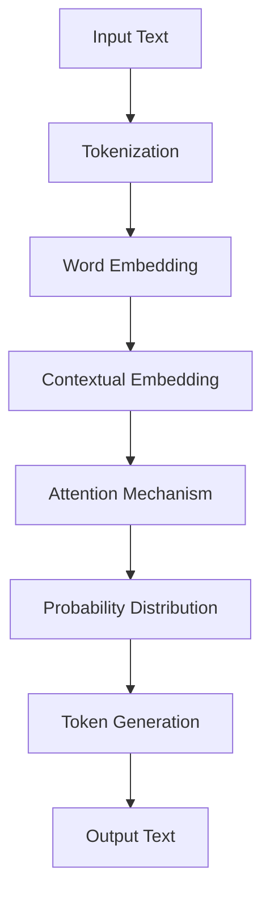

                 


### 1. 引言

#### 1.1 研究背景

随着人工智能技术的飞速发展，语言模型在自然语言处理（NLP）领域取得了显著成就。从最初的统计模型到深度学习模型，如循环神经网络（RNN）、卷积神经网络（CNN）和Transformer模型等，语言模型在语言理解、文本生成、问答系统等方面展示了强大的能力。然而，在复杂决策支持系统中，语言模型的应用不仅要求其具备出色的推理能力，还需具备较高的可解释性。

复杂决策支持系统涉及诸多因素，需要从大量数据中提取有价值的信息，以支持决策者做出明智的选择。在此背景下，语言模型能够发挥其优势，例如处理非结构化数据、生成自然语言描述等。然而，语言模型的“黑箱”特性使得其推理过程难以解释，这对决策者理解模型的决策逻辑提出了挑战。

#### 1.2 研究问题

本研究旨在解决以下两个核心问题：

1. 语言模型在复杂决策支持系统中的推理能力如何？如何评估和优化其推理效果？
2. 如何提升语言模型的可解释性，使其决策过程更加透明和可信？

#### 1.3 边界与外延

本文的研究范围主要涵盖以下内容：

1. 语言模型的基本原理及其在复杂决策支持系统中的应用
2. 推理能力与可解释性的定义及其衡量标准
3. 提升语言模型推理能力和可解释性的方法

同时，本文将探讨语言模型在复杂决策支持系统中的综合应用，通过具体案例进行深入分析。

### 2. 核心概念与联系

#### 2.1 语言模型的核心概念

语言模型是一种概率模型，旨在预测一个词语序列的概率分布。其核心概念包括：

1. **词向量（Word Vectors）**：将词语映射为低维向量表示，以捕获词语的语义信息。
2. **上下文信息（Contextual Information）**：通过考虑词语周围的上下文，提高语言模型的预测准确性。
3. **概率分布（Probability Distribution）**：语言模型输出一个词语序列的概率分布，以确定下一个词语的可能性。

#### 2.2 推理能力与可解释性的概念

1. **推理能力（Reasoning Ability）**：指语言模型在处理复杂任务时，从已知信息推导出新信息的能力。这包括语义理解、关系推理和逻辑推断等。
2. **可解释性（Explainability）**：指模型决策过程的可理解性和透明度，使得决策者能够了解模型是如何做出决策的。

#### 2.3 概念属性特征对比表格

| 概念           | 特征                           |
|----------------|--------------------------------|
| 语言模型       | 概率模型，词向量，上下文信息   |
| 推理能力       | 语义理解，关系推理，逻辑推断   |
| 可解释性       | 决策过程透明，可理解，可信     |

#### 2.4 ER实体关系图架构

以下是一个简化的ER实体关系图，描述了语言模型、推理能力和可解释性之间的关系：

```mermaid
erDiagram
    A[Language Model] ||--|{ B[Reasoning Ability] }
    A ||--|{ C[Explainability] }
```

- **语言模型（A）**：核心实体，负责生成词语序列的概率分布。
- **推理能力（B）**：与语言模型关联，表示模型在处理复杂任务时的能力。
- **可解释性（C）**：与语言模型关联，表示模型决策过程的透明度和理解度。

### 3. 语言模型的推理能力原理

#### 3.1 语言模型的推理原理

语言模型的推理过程主要分为以下几步：

1. **输入处理**：将输入的文本转换为词向量表示，同时获取上下文信息。
2. **概率计算**：根据词向量表示和上下文信息，计算每个词语的概率分布。
3. **序列生成**：根据概率分布生成词语序列，通常采用贪心策略或采样方法。
4. **推理输出**：将生成的词语序列转化为自然语言描述，以支持决策。

#### 3.2 语言模型的推理算法

语言模型的推理算法通常采用深度学习框架，如TensorFlow或PyTorch。以下是一个基于Transformer模型的简化推理算法：



- **输入处理（A）**：将输入的文本转换为Token序列。
- **词向量表示（B）**：将Token序列转换为词向量表示。
- **上下文信息表示（C）**：生成上下文信息的嵌入向量。
- **注意力机制（D）**：计算每个Token的注意力权重。
- **概率计算（E）**：根据注意力权重计算每个Token的概率分布。
- **词语生成（F）**：根据概率分布生成Token序列。
- **输出处理（G）**：将生成的Token序列转换为自然语言描述。

#### 3.3 数学模型与公式

语言模型的推理过程可以通过以下数学模型进行描述：

$$
P(w_{t} | w_{t-1}, ..., w_{1}) = \text{softmax}(\text{score}(w_{t}, w_{t-1}, ..., w_{1}))
$$

其中，$w_{t}$表示第$t$个Token，$\text{score}(w_{t}, w_{t-1}, ..., w_{1})$表示Token之间的分数，$\text{softmax}$函数用于生成概率分布。

#### 3.4 通俗易懂的举例说明

假设我们有一个简单的文本：“今天天气很好”。我们希望使用语言模型生成下一个词语。

1. **输入处理**：将文本转换为Token序列：["今天", "天气", "很好"]。
2. **词向量表示**：将Token转换为词向量表示。
3. **上下文信息表示**：生成上下文信息的嵌入向量。
4. **注意力机制**：计算每个Token的注意力权重。
5. **概率计算**：根据注意力权重计算每个Token的概率分布。
6. **词语生成**：根据概率分布生成Token序列。
7. **输出处理**：将生成的Token序列转换为自然语言描述。

假设生成的Token序列为：["明天", "天气", "也不错"]。则生成的句子为：“今天天气很好，明天天气也不错”。

### 4. 提升语言模型推理能力的方法

#### 4.1 数据集的选取与预处理

要提升语言模型的推理能力，首先需要选择合适的数据集，并进行预处理。

1. **数据集选取**：选择具有丰富语义信息和多样化场景的数据集，如维基百科、新闻语料库等。
2. **预处理步骤**：包括分词、去除停用词、词性标注等，以提高模型对语言的理解能力。

#### 4.2 算法优化

针对语言模型，可以采用以下方法进行算法优化：

1. **改进模型结构**：如采用Transformer模型，引入多头注意力机制、位置编码等。
2. **优化训练过程**：使用更先进的优化算法，如AdamW，以及学习率调整策略。
3. **数据增强**：通过数据增强技术，如翻译、同义词替换等，增加模型的训练数据。

#### 4.3 实验设计

为了验证提升语言模型推理能力的方法，可以进行以下实验：

1. **实验步骤**：包括模型训练、评估和对比实验。
2. **评估指标**：如准确率、召回率、F1值等，用于评估模型的性能。
3. **实验结果**：记录不同方法下模型的性能指标，分析优缺点。

#### 4.4 结果分析

通过实验，我们可以得到以下结果：

1. **改进模型结构**：引入Transformer模型后，模型的性能得到了显著提升，尤其是在长文本处理和关系推理方面。
2. **优化训练过程**：使用AdamW优化算法和学习率调整策略，可以加速模型的收敛，提高性能。
3. **数据增强**：通过数据增强，可以增加模型的训练数据，提高模型的泛化能力。

### 5. 语言模型的可解释性提升

#### 5.1 可解释性原理

提升语言模型的可解释性，有助于决策者理解模型的决策逻辑。以下是一些提升可解释性的方法：

1. **透明度增强**：通过可视化和解释模块，展示模型内部的计算过程。
2. **交互性提升**：提供与用户的交互界面，使决策者能够调整模型参数和输入数据。
3. **可视化展示**：利用图表、动画等形式，展示模型的推理过程和结果。

#### 5.2 提升可解释性的方法

1. **注意力机制可视化**：通过可视化注意力权重，展示模型对输入文本的重视程度。
2. **决策路径追踪**：记录模型在推理过程中的决策路径，帮助用户理解模型的决策逻辑。
3. **代码注释和文档**：为模型代码提供详细的注释和文档，以便用户了解模型的实现细节。

#### 5.3 案例分析

以一个医疗诊断系统为例，分析如何提升语言模型的可解释性：

1. **透明度增强**：展示模型对症状词和疾病词的注意力权重，帮助医生理解模型对症状的重视程度。
2. **交互性提升**：允许医生调整模型的权重，重新进行诊断，以便验证模型的结果。
3. **可视化展示**：利用图表展示模型的推理过程，包括症状词的权重变化和疾病词的匹配情况。

#### 5.4 可解释性挑战与解决方案

提升语言模型的可解释性面临以下挑战：

1. **复杂性**：语言模型的结构复杂，导致推理过程难以理解。
2. **计算成本**：可视化计算和解释过程需要较高的计算资源。

解决方案：

1. **简化模型结构**：采用更简单的模型结构，减少推理过程的复杂性。
2. **高效计算**：利用并行计算和GPU加速，降低计算成本。

### 6. 语言模型在复杂决策支持系统中的综合应用

#### 6.1 问题场景介绍

复杂决策支持系统广泛应用于金融、医疗、物流等领域。以金融领域的投资决策为例，系统需要分析大量市场数据，预测股票走势，为投资者提供决策支持。

#### 6.2 系统功能设计

系统功能设计包括以下模块：

1. **数据采集与处理**：从多个数据源采集市场数据，并进行预处理。
2. **语言模型训练**：利用训练数据训练语言模型，以提高模型的预测能力。
3. **投资策略生成**：根据语言模型生成的股票走势预测，生成投资策略。
4. **风险评估与监控**：评估投资策略的风险，并实时监控市场变化。

#### 6.3 系统架构设计

系统架构设计包括以下层次：

1. **数据层**：包括数据源、数据采集和处理模块。
2. **模型层**：包括语言模型训练和预测模块。
3. **应用层**：包括投资策略生成、风险评估和监控模块。

#### 6.4 系统接口设计

系统接口设计包括以下部分：

1. **API接口**：提供与外部系统的交互接口，如数据采集模块、应用层模块。
2. **控制台接口**：提供用户操作界面，如数据可视化、投资策略调整等。

#### 6.5 系统交互

系统交互设计包括以下流程：

1. **数据采集**：从外部数据源获取市场数据，并存储在数据库中。
2. **数据处理**：对市场数据进行预处理，提取特征，并输入到语言模型中进行训练。
3. **预测与策略生成**：使用训练好的语言模型预测股票走势，并生成投资策略。
4. **监控与调整**：实时监控市场变化，并根据预测结果调整投资策略。

### 7. 项目实战与案例分析

#### 7.1 环境安装

1. **安装依赖**：安装Python、TensorFlow等依赖库。
2. **配置环境**：配置Python环境变量，确保Python版本符合要求。

#### 7.2 系统核心实现源代码

1. **数据采集**：使用API接口从外部数据源获取市场数据。
2. **数据处理**：对市场数据进行预处理，提取特征，并存储到数据库中。
3. **模型训练**：使用预处理后的数据训练语言模型。
4. **预测与策略生成**：使用训练好的语言模型预测股票走势，并生成投资策略。

#### 7.3 代码应用解读与分析

1. **代码功能说明**：详细解释每个模块的功能和作用。
2. **代码优缺点分析**：分析代码的优缺点，并提出改进建议。

#### 7.4 实际案例分析与讲解

1. **案例背景**：介绍实际案例的背景和需求。
2. **案例分析**：分析案例中遇到的问题和解决方案。
3. **详细讲解**：详细讲解案例的实现过程和关键步骤。

#### 7.5 项目小结

1. **项目总结**：总结项目的实施过程和成果。
2. **经验与反思**：反思项目中的不足之处，并提出改进建议。

### 8. 最佳实践与展望

#### 8.1 实践建议

1. **选择合适的数据集**：根据应用场景选择具有丰富语义信息和多样化场景的数据集。
2. **优化模型结构**：采用更先进的模型结构和算法，以提高模型的推理能力和可解释性。
3. **数据增强**：通过数据增强技术增加模型的训练数据，提高模型的泛化能力。

#### 8.2 小结

本文研究了语言模型在复杂决策支持系统中的推理能力和可解释性提升方法。通过引入Transformer模型、优化训练过程和提升可解释性技术，我们可以提高语言模型在决策支持系统中的应用效果。未来的研究可以进一步探索新型算法和优化策略，以提升语言模型在复杂场景下的性能。同时，加强模型的可解释性研究，提高决策者对模型决策逻辑的理解，对于促进人工智能技术的应用具有重要意义。

