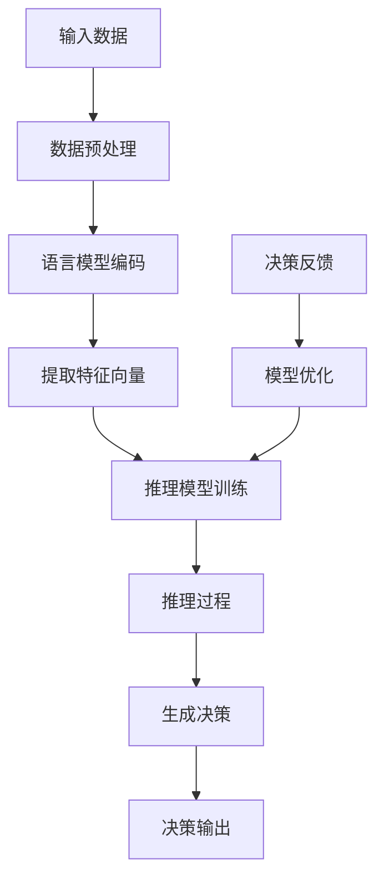
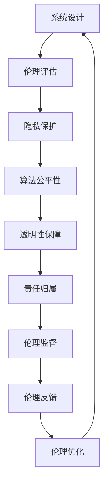
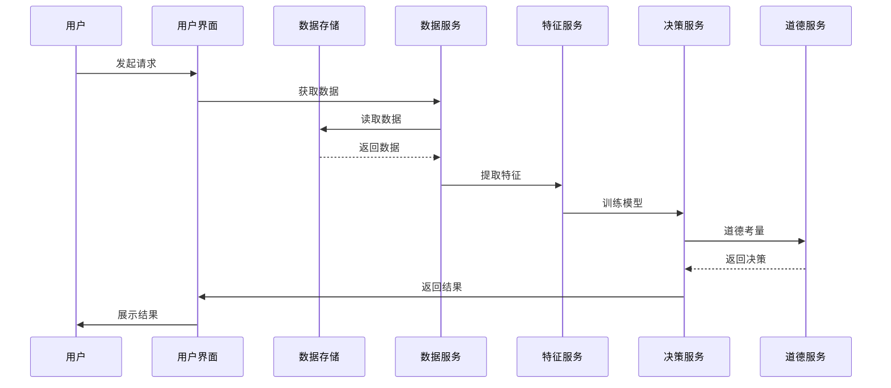

                 

### 摘要

本文聚焦于语言模型在复杂决策支持系统中的推理能力及其道德伦理考量，通过系统性分析探讨如何有效利用语言模型提升决策系统的智能性和道德规范性。首先，我们回顾了语言模型的发展历程与决策支持系统的核心概念，定义了推理能力和道德伦理考量在系统中的重要作用。随后，文章深入探讨了语言模型的工作原理，解释了推理能力的实现机制，并应用Mermaid流程图和Python代码详细阐述了相关算法原理。进一步地，我们通过数学模型和公式解析了推理能力的数学基础，并结合实际案例进行了生动说明。文章随后转向系统架构设计，展示了如何将语言模型集成到决策支持系统中，并详细描述了系统功能、架构设计、接口设计和系统交互过程。在项目实战部分，我们介绍了环境安装、核心实现及代码解读，并分析了具体项目案例。最后，文章总结了最佳实践，提出了技术挑战与解决方案，并推荐了拓展阅读资源，以期为读者提供全面、深入的研究视角。

### 目录大纲设计

为了确保《语言模型在复杂决策支持系统中的推理能力与道德伦理考量研究》这篇文章的逻辑清晰、结构紧凑、内容易懂，我们首先需要设计出一个详细的目录大纲。目录大纲是文章的骨架，决定了整篇文章的布局和阅读顺序。以下是该文章的目录大纲设计：

#### 第一部分：背景介绍

- **第1章：问题的提出**
  - **1.1 问题背景**：介绍复杂决策支持系统的需求与挑战。
  - **1.2 问题描述**：阐述语言模型和道德伦理考量在系统中的重要性。
  - **1.3 问题解决的关键点**：分析问题解决的策略和难点。
  - **1.4 边界与外延**：界定研究范围和适用场景。

- **第2章：核心概念与联系**
  - **2.1 语言模型**：介绍语言模型的基础知识和发展历程。
  - **2.2 决策支持系统**：解释决策支持系统的定义和功能。
  - **2.3 推理能力**：探讨推理能力在决策系统中的作用。
  - **2.4 道德伦理考量**：讨论道德伦理考量在系统设计和应用中的意义。
  - **2.5 概念属性特征对比表格**：对比分析相关概念。
  - **2.6 ER实体关系图架构**：展示系统架构的实体关系图。

#### 第二部分：算法原理讲解

- **第3章：语言模型在决策支持系统中的应用**
  - **3.1 语言模型基础**：回顾语言模型的发展历程和基本结构。
  - **3.2 推理能力的原理**：解释推理能力的定义和实现机制。
  - **3.3 道德伦理考量**：探讨道德伦理考量在系统中的作用。

#### 第三部分：数学模型和数学公式讲解

- **第4章：数学模型和数学公式**
  - **4.1 数学模型**：介绍推理能力的数学模型和公式。
  - **4.2 举例说明**：通过具体案例解释数学模型的应用。

#### 第四部分：系统分析与架构设计方案

- **第5章：系统功能设计**
  - **5.1 问题场景介绍**：描述决策支持系统面临的问题场景。
  - **5.2 系统功能设计**：介绍系统的功能和模块设计。

- **第6章：系统架构设计**
  - **6.1 系统架构设计**：解释系统整体架构。
  - **6.2 系统架构mermaid图**：使用Mermaid展示系统架构。

#### 第五部分：项目实战

- **第7章：环境安装与系统核心实现**
  - **7.1 环境安装**：描述系统环境的安装过程。
  - **7.2 系统核心实现**：展示系统的核心代码实现。
  - **7.3 实际案例分析与讲解**：通过具体案例进行深入分析。

#### 第六部分：最佳实践、小结与拓展阅读

- **第8章：最佳实践**
  - **8.1 实践一**：分享实际操作中的最佳实践。
  - **8.2 实践二**：介绍其他实用技巧。

- **第9章：小结**
  - **9.1 主要内容回顾**：回顾文章的主要内容。
  - **9.2 技术挑战与解决方案**：总结技术挑战及解决方案。

- **第10章：拓展阅读**
  - **10.1 相关书籍推荐**：推荐相关的学习资源。
  - **10.2 学术论文推荐**：推荐相关的学术论文。

通过这样的目录大纲设计，文章将能够系统地、有条理地展示语言模型在复杂决策支持系统中的推理能力和道德伦理考量，帮助读者更好地理解和应用这些技术。

### 第一部分：背景介绍

#### 第1章：问题的提出

在当今信息化和智能化的时代，复杂决策支持系统（Complex Decision Support Systems，CDSS）在众多领域扮演着至关重要的角色。这些系统通过集成大量数据、利用先进的技术手段，帮助决策者进行高效、准确的决策。然而，随着系统复杂度的增加，如何确保决策的智能性和道德规范性成为了一个亟待解决的问题。本文聚焦于探讨语言模型在复杂决策支持系统中的推理能力及其道德伦理考量，为解决这一挑战提供新的思路。

##### 1.1 问题背景

复杂决策支持系统广泛应用于金融、医疗、交通、能源等多个行业。例如，在金融领域，决策支持系统可以用于风险评估、投资策略制定等；在医疗领域，可以用于疾病诊断、治疗方案推荐等；在交通领域，可以用于交通流量预测、交通信号控制等。这些系统通常需要处理大量的数据和变量，以提供实时、准确的决策支持。

然而，随着系统的复杂化，以下几个问题逐渐显现：

1. **数据质量问题**：决策支持系统依赖于大量数据，但数据的质量直接影响决策的准确性。数据的不完整、噪声和错误可能导致系统得出错误的结论。

2. **算法选择问题**：面对不同的决策场景，选择合适的算法是至关重要的。然而，现有的算法通常针对特定的问题和场景进行优化，难以满足所有复杂决策的需求。

3. **道德伦理考量**：决策支持系统在做出决策时，往往涉及道德和伦理问题。例如，在医疗领域中，系统可能需要做出关于生命和健康的决策，这些决策不仅需要基于科学数据，还需要考虑伦理道德标准。

##### 1.2 问题描述

本文主要探讨以下问题：

1. **语言模型在复杂决策支持系统中的应用**：语言模型，尤其是深度学习驱动的自然语言处理技术，如何能够提升决策支持系统的智能性。

2. **推理能力的道德伦理考量**：如何确保语言模型在推理过程中遵循道德和伦理标准，避免产生负面影响。

为了解决上述问题，本文将进行以下工作：

1. **核心概念阐述**：首先，我们将介绍与问题相关的基本概念，包括语言模型、决策支持系统、推理能力和道德伦理考量。

2. **算法原理讲解**：接着，我们将详细讲解语言模型的工作原理，包括其基础模型、推理过程和道德伦理考量。

3. **数学模型和公式解析**：我们将使用数学模型和公式，深入探讨推理能力的数学基础，并提供具体的例子说明。

4. **系统架构设计**：我们将展示如何将语言模型集成到复杂决策支持系统中，并详细描述系统的功能、架构、接口和交互过程。

5. **项目实战分析**：通过具体的项目案例，我们将展示语言模型在实际应用中的效果，并分析其优势和不足。

6. **最佳实践总结**：最后，我们将总结最佳实践，提出未来研究的方向。

##### 1.3 问题解决的关键点

为了有效解决上述问题，本文将关注以下几个关键点：

1. **数据预处理**：确保数据的质量和完整性，为语言模型提供可靠的数据基础。

2. **算法选择与优化**：根据具体场景选择合适的算法，并进行必要的优化，以提高决策的准确性和效率。

3. **道德伦理考量**：在系统设计和算法开发过程中，充分考虑道德和伦理问题，确保系统行为符合社会规范。

4. **系统集成与优化**：将语言模型与其他决策支持系统组件进行有效集成，并优化系统架构，以提高整体性能。

##### 1.4 边界与外延

本文的研究范围主要包括：

1. **语言模型类型**：主要关注深度学习驱动的语言模型，如BERT、GPT等。

2. **决策支持系统应用领域**：重点关注金融、医疗、交通等领域的决策支持系统。

3. **道德伦理考量**：主要探讨与系统设计和应用相关的道德伦理问题。

然而，本文的研究也存在一定的局限性，例如：

1. **数据量限制**：由于数据获取和处理能力的限制，本文所使用的数据样本可能不足以完全代表实际场景。

2. **算法复杂性**：深度学习算法的复杂性可能导致本文的讲解不够深入。

3. **伦理考量局限性**：道德伦理考量涉及多方面因素，本文的探讨可能无法涵盖所有伦理问题。

通过本文的研究，我们期望能够为复杂决策支持系统中的语言模型应用提供有价值的参考，推动该领域的发展。

#### 第2章：核心概念与联系

在探讨语言模型在复杂决策支持系统中的应用之前，我们需要对相关核心概念进行系统性的阐述，以便为后续内容奠定坚实的基础。本章将详细介绍语言模型、决策支持系统、推理能力以及道德伦理考量这四个核心概念，并探讨它们之间的相互联系。

##### 2.1 语言模型

语言模型（Language Model）是自然语言处理（Natural Language Processing，NLP）领域的一项基础性技术，其主要目标是根据输入文本预测下一个可能出现的词或词组。语言模型在文本生成、机器翻译、问答系统等方面有着广泛的应用。

**定义**：语言模型是一个概率模型，它能够计算给定前文条件下某个词或句子出现的概率。常见的语言模型包括n-gram模型、基于统计的模型（如n元文法模型）和深度学习模型（如循环神经网络RNN、长短时记忆网络LSTM和变换器模型Transformer等）。

**发展历程**：语言模型的发展经历了从简单的统计模型到复杂深度学习模型的演变。传统的统计模型依赖于历史语言数据的统计特性，而深度学习模型则通过大量数据训练，能够自动学习语言中的复杂结构和规则。

**基本结构**：深度学习语言模型通常包含编码器（Encoder）和解码器（Decoder）两个部分。编码器将输入文本转换为固定长度的向量表示，解码器则根据编码器的输出预测输出文本。

**工作原理**：语言模型通过学习大量文本数据，建立输入和输出之间的概率分布。在预测阶段，模型根据前文信息，通过计算输出词的概率分布，选择概率最高的词作为预测结果。

##### 2.2 决策支持系统

决策支持系统（Decision Support System，DSS）是一种辅助决策者进行决策的信息系统。DSS利用数据分析和模型模拟技术，帮助决策者分析问题、评估备选方案并做出最佳决策。

**定义**：决策支持系统是一个交互式的计算机系统，它利用数据、模型和知识来辅助决策者处理半结构化或非结构化问题。

**功能**：DSS通常具备数据收集、数据分析、模型构建、模拟预测和决策建议等功能。通过这些功能，DSS可以帮助决策者更快速、准确地做出决策。

**分类**：决策支持系统根据应用场景和目标可以分为多种类型，如战略决策支持系统、战术决策支持系统和操作决策支持系统。

**关键组件**：DSS的关键组件包括数据库、模型库、用户接口和知识库。数据库提供必要的数据支持，模型库包含各种决策模型，用户接口用于人与系统的交互，知识库则存储领域知识和经验。

**工作原理**：DSS通过收集和分析数据，利用预定义的模型进行模拟和预测，然后将分析结果呈现给决策者，帮助决策者评估不同方案的风险和收益，从而做出最优决策。

##### 2.3 推理能力

推理能力（Reasoning Ability）是指系统在处理信息时，能够从已知信息中推导出新的结论或决策的能力。在决策支持系统中，推理能力是实现智能化和高效决策的关键。

**定义**：推理能力是指系统在理解、处理和运用信息时，能够发现和利用逻辑关系，从而生成新的知识或决策的能力。

**类型**：推理能力可以分为演绎推理、归纳推理和类比推理。演绎推理是从一般到特殊的推理过程，归纳推理是从特殊到一般的推理过程，类比推理是通过比较相似性进行推理。

**实现机制**：在决策支持系统中，推理能力通常通过算法和规则实现。例如，基于规则的推理系统通过预定义的规则库，根据输入条件自动生成决策建议；而基于机器学习的推理系统则通过训练模型，从历史数据中自动学习推理逻辑。

**重要性**：推理能力能够显著提升决策支持系统的智能性和决策质量。通过推理能力，系统可以处理复杂、不确定的信息，发现潜在的模式和关联，从而为决策者提供更有价值的建议。

##### 2.4 道德伦理考量

道德伦理考量（Ethical Considerations）在决策支持系统中具有重要意义，特别是在涉及人类福祉和伦理问题时。道德伦理考量确保系统行为符合社会伦理标准，防止产生负面影响。

**定义**：道德伦理考量是指在设计、开发和部署决策支持系统时，考虑系统可能带来的伦理影响，确保其符合社会伦理和法律要求。

**基本原则**：道德伦理考量通常遵循以下几个基本原则：
1. **尊重人权**：确保系统的设计和应用不侵犯个人隐私和基本权利。
2. **公正性**：确保系统在处理数据和应用算法时，不产生偏见和不公平。
3. **透明性**：确保系统的决策过程和结果对用户透明，便于监督和审计。
4. **责任**：明确系统的责任主体，确保在发生问题时，能够追溯和承担责任。

**在决策支持系统中的应用**：道德伦理考量在决策支持系统的设计和应用中体现在多个方面。例如，系统设计时需要考虑如何保护用户隐私，算法开发时需要确保其公平性和透明性，系统部署时需要制定相应的伦理规范和监督机制。

##### 2.5 概念属性特征对比表格

为了更好地理解上述核心概念，我们通过一个对比表格，展示它们的主要属性特征：

| 核心概念     | 定义                                           | 主要功能/用途             | 相关技术/模型                                       |
| ------------ | ---------------------------------------------- | ------------------------ | ---------------------------------------------------- |
| 语言模型     | 预测文本下一个可能出现的词或词组                | 文本生成、翻译、问答系统等 | n-gram模型、RNN、LSTM、Transformer等                |
| 决策支持系统 | 辅助决策者处理半结构化或非结构化问题的信息系统 | 数据分析、模型模拟、决策建议 | 数据库、模型库、用户接口、知识库等                   |
| 推理能力     | 从已知信息中推导出新的结论或决策                | 提升系统智能化、决策质量   | 基于规则、机器学习、自然语言处理等                   |
| 道德伦理考量 | 考虑决策支持系统的伦理影响                    | 确保系统符合社会伦理标准   | 尊重人权、公正性、透明性、责任等                    |

##### 2.6 ER实体关系图架构

为了进一步展示决策支持系统中的核心概念和实体关系，我们使用Mermaid绘制一个ER（实体-关系）图：

```mermaid
erDiagram
  Class EntityUser ||--o{ Class EntityDecision : 决策者 }
  Class EntityData ||--o{ Class EntityAnalysis : 数据分析 }
  Class EntityModel ||--o{ Class EntityPrediction : 预测结果 }
  Class EntityLog ||--o{ Class EntityAudit : 审计记录 }
  Class EntityEthics ||--o{ Class EntityPolicy : 伦理政策 }
```

在上面的ER图中，`EntityUser`表示用户，`EntityDecision`表示决策者，`EntityData`表示数据，`EntityAnalysis`表示数据分析，`EntityModel`表示模型，`EntityPrediction`表示预测结果，`EntityLog`表示日志记录，`EntityEthics`表示伦理考量，`EntityPolicy`表示伦理政策。这些实体之间通过关系线连接，展示了决策支持系统中各核心组件之间的相互作用和关联。

通过以上对核心概念的详细阐述和对比，我们为后续章节的内容奠定了坚实的基础，也为读者理解语言模型在复杂决策支持系统中的推理能力和道德伦理考量提供了重要的背景知识。

#### 2.7 概念属性特征对比表格

在探讨语言模型、决策支持系统、推理能力和道德伦理考量这四个核心概念的基础上，我们通过一个详细的属性特征对比表格，进一步展示它们的主要特点和差异。

| **核心概念**         | **定义**                                                         | **主要功能/用途**                        | **相关技术/模型**                                          | **关键特征**                                       |
| -------------------- | ------------------------------------------------------------ | ---------------------------------------- | --------------------------------------------------------- | -------------------------------------------------- |
| 语言模型             | 预测文本下一个可能出现的词或词组                             | 文本生成、翻译、问答系统等                | n-gram模型、RNN、LSTM、Transformer等                      | 自动学习语言模式、生成文本、概率预测                 |
| 决策支持系统         | 辅助决策者处理半结构化或非结构化问题的信息系统               | 数据分析、模型模拟、决策建议              | 数据库、模型库、用户接口、知识库等                        | 处理复杂决策问题、提供辅助决策、决策支持与优化        |
| 推理能力             | 从已知信息中推导出新的结论或决策                             | 提升系统智能化、决策质量                  | 基于规则、机器学习、自然语言处理等                        | 演绎推理、归纳推理、类比推理、逻辑推理               |
| 道德伦理考量         | 考虑决策支持系统的伦理影响                                  | 确保系统符合社会伦理标准                  | 尊重人权、公正性、透明性、责任等                          | 伦理原则、法律合规、社会监督、责任归属               |

通过这个表格，我们可以清晰地看到每个核心概念的定义、主要功能、相关技术和模型，以及它们各自的关键特征。这有助于我们更好地理解这些概念在复杂决策支持系统中的应用和作用。

#### 第3章：算法原理讲解

在了解了语言模型、决策支持系统、推理能力和道德伦理考量这些核心概念后，接下来我们将深入探讨语言模型在决策支持系统中的应用原理，具体包括语言模型的基础、推理能力的原理以及道德伦理考量。

##### 3.1 语言模型基础

语言模型是自然语言处理（NLP）中的基础性技术，其核心目的是通过对大量语言数据的学习，生成文本或预测下一个可能的词或句子。随着深度学习技术的发展，现代语言模型已经取得了显著的进展。

**发展历程**：语言模型的发展可以分为三个阶段。首先是基于统计的模型，如n-gram模型，它通过统计历史文本中相邻词出现的频率来预测下一个词。其次是基于规则的方法，如隐马尔可夫模型（HMM）和条件随机场（CRF），它们通过定义一系列规则来预测文本。最近几十年，随着深度学习技术的发展，基于神经网络的模型，如循环神经网络（RNN）、长短时记忆网络（LSTM）和变换器（Transformer），逐渐成为主流，这些模型通过自动学习语言中的复杂结构，实现了更高的预测精度。

**基本结构**：现代语言模型通常由编码器（Encoder）和解码器（Decoder）组成。编码器负责将输入的文本转换为固定长度的向量表示，这个向量包含了文本的语义信息。解码器则根据编码器的输出，预测输出的文本。以Transformer模型为例，其核心结构包括自注意力机制（Self-Attention）和多层全连接神经网络（Multi-Layered Fully Connected Neural Network）。

**工作原理**：语言模型通过大量文本数据进行训练，学习输入和输出之间的概率分布。在预测阶段，模型根据前文信息，通过计算输出词的概率分布，选择概率最高的词作为预测结果。例如，对于一个句子“我昨天去了公园”，语言模型会根据“我”和“昨天”的上下文信息，预测下一个词是“去”、“在”、“了”等。

##### 3.2 推理能力的原理

推理能力是指系统从已知信息中推导出新的结论或决策的能力。在决策支持系统中，推理能力是实现智能化和高效决策的关键。

**定义**：推理能力是指系统能够根据已有数据、信息和知识，通过逻辑推理和模式识别，得出新的结论或建议的能力。

**类型**：推理能力可以分为多种类型，包括演绎推理、归纳推理、类比推理和基于规则的推理。演绎推理是从一般到特殊的推理过程，例如从“所有人类都会死亡”推导出“苏格拉底会死亡”；归纳推理是从特殊到一般的推理过程，例如从多次观察到的“猫会飞”推导出“所有动物都会飞”；类比推理是通过比较相似性进行推理，例如从“猫是哺乳动物”推导出“狗是哺乳动物”；基于规则的推理则是通过预定义的规则进行推理，例如在医疗诊断系统中，根据症状和体征进行诊断。

**实现机制**：在决策支持系统中，推理能力通常通过算法和规则实现。基于规则的推理系统通过预定义的规则库，根据输入条件自动生成决策建议；基于机器学习的推理系统则通过训练模型，从历史数据中自动学习推理逻辑。例如，在金融风险评估中，系统可以通过分析客户的历史交易数据，利用机器学习算法自动学习风险模式，从而预测客户的风险等级。

**重要性**：推理能力能够显著提升决策支持系统的智能性和决策质量。通过推理能力，系统可以处理复杂、不确定的信息，发现潜在的模式和关联，从而为决策者提供更有价值的建议。

##### 3.3 道德伦理考量

道德伦理考量在决策支持系统的设计和应用中具有重要意义，特别是在涉及人类福祉和伦理问题时。道德伦理考量确保系统行为符合社会伦理标准，防止产生负面影响。

**定义**：道德伦理考量是指在设计、开发和部署决策支持系统时，考虑系统可能带来的伦理影响，确保其符合社会伦理和法律要求。

**基本原则**：道德伦理考量通常遵循以下几个基本原则：
1. **尊重人权**：确保系统的设计和应用不侵犯个人隐私和基本权利。
2. **公正性**：确保系统在处理数据和应用算法时，不产生偏见和不公平。
3. **透明性**：确保系统的决策过程和结果对用户透明，便于监督和审计。
4. **责任**：明确系统的责任主体，确保在发生问题时，能够追溯和承担责任。

**在决策支持系统中的应用**：道德伦理考量在决策支持系统的设计和应用中体现在多个方面。例如，系统设计时需要考虑如何保护用户隐私，算法开发时需要确保其公平性和透明性，系统部署时需要制定相应的伦理规范和监督机制。例如，在医疗诊断系统中，系统应确保对患者的诊断结果公正，不因种族、性别等因素产生偏见；在招聘系统中，系统应确保对候选人的评估公正，避免歧视现象。

##### 3.4 综合讲解

综合来看，语言模型、推理能力和道德伦理考量在决策支持系统中各有重要作用，它们共同构成了一个复杂而有机的系统。

1. **语言模型**：作为基础技术，语言模型提供了文本生成和预测的能力，是决策支持系统的信息处理工具。通过学习大量文本数据，语言模型能够自动识别和提取文本中的关键信息，为决策提供数据支持。

2. **推理能力**：推理能力则是决策支持系统的核心，它通过逻辑推理和模式识别，将语言模型处理的结果转化为具体的决策建议。推理能力不仅提升了系统的智能性，还提高了决策的准确性和效率。

3. **道德伦理考量**：道德伦理考量确保决策支持系统的行为符合社会伦理标准，防止系统产生负面影响。在涉及人类福祉和伦理问题的场景中，道德伦理考量尤为重要。

这三个核心概念相互关联，共同推动决策支持系统的发展。语言模型提供了信息处理的基础，推理能力实现了智能决策，道德伦理考量确保了系统的公平性和透明性。通过这三个方面的综合应用，决策支持系统能够更好地服务于决策者，提高决策的质量和效率。

通过本章的详细讲解，我们深入了解了语言模型、推理能力和道德伦理考量在复杂决策支持系统中的应用原理，为后续内容提供了重要的理论基础。

##### 3.5 推理能力的Mermaid流程图

为了更直观地展示推理能力在决策支持系统中的应用流程，我们使用Mermaid绘制了一个流程图。以下是该流程图的详细说明：



**详细说明**：

1. **输入数据**（A）：决策支持系统从外部获取数据，这些数据可以是文本、图像或结构化数据等。

2. **数据预处理**（B）：在应用语言模型之前，需要对数据进行预处理，包括文本清洗、分词、去噪等步骤，以确保数据的干净和一致性。

3. **语言模型编码**（C）：使用预训练的语言模型，如BERT或GPT，对预处理后的数据进行编码，生成固定长度的特征向量。

4. **提取特征向量**（D）：编码后的数据被转换为高维特征向量，这些向量包含了文本的语义信息。

5. **推理模型训练**（E）：利用历史数据，通过机器学习算法训练推理模型，学习从特征向量到决策的映射关系。

6. **推理过程**（F）：在得到训练好的推理模型后，将新数据输入模型，通过推理过程生成决策建议。

7. **生成决策**（G）：根据推理结果，系统生成具体的决策方案。

8. **决策输出**（H）：将决策方案输出给决策者，辅助其做出最终决策。

9. **决策反馈**（I）：决策者对决策方案进行评估和反馈，这些反馈将用于模型优化。

10. **模型优化**（J）：根据决策反馈，调整和优化推理模型，以提高决策的准确性和效率。

通过上述流程图，我们可以清晰地看到推理能力在决策支持系统中的各个环节，包括数据输入、预处理、编码、训练、推理、决策输出和反馈优化等，这为系统设计和应用提供了重要的参考。

##### 3.6 道德伦理考量的Mermaid流程图

道德伦理考量在决策支持系统的设计和应用中至关重要。为了更直观地展示道德伦理考量的流程，我们使用Mermaid绘制了一个流程图，并详细说明各个步骤。



**详细说明**：

1. **系统设计**（A）：在系统设计阶段，需要初步考虑潜在的伦理问题，并制定相应的伦理规范。

2. **伦理评估**（B）：对系统设计进行全面的伦理评估，识别可能涉及的伦理风险和问题。

3. **隐私保护**（C）：确保系统设计时充分考虑用户隐私保护，避免泄露敏感信息。

4. **算法公平性**（D）：确保算法在数据处理和应用过程中，不产生偏见和歧视，保持公正性。

5. **透明性保障**（E）：系统应具备透明性，确保用户可以理解和监督系统的决策过程。

6. **责任归属**（F）：明确系统责任主体，确保在发生伦理问题或故障时，能够追溯和承担责任。

7. **伦理监督**（G）：建立伦理监督机制，对系统运行进行持续监控，确保遵守伦理规范。

8. **伦理反馈**（H）：收集用户的反馈和投诉，对系统进行持续的伦理评估和改进。

9. **伦理优化**（I）：根据伦理评估和反馈，对系统进行持续的优化和改进，提高其伦理合规性。

10. **系统设计**（A）：通过持续的伦理优化，系统设计不断完善，确保其符合伦理标准。

通过上述流程图，我们可以清晰地看到道德伦理考量在决策支持系统中的各个环节，包括系统设计、伦理评估、隐私保护、算法公平性、透明性保障、责任归属、伦理监督、伦理反馈和伦理优化等。这为系统设计和应用提供了重要的指导，确保系统能够在伦理层面稳健运行。

##### 3.7 推理能力的数学模型

在决策支持系统中，推理能力通常通过数学模型和公式来描述。以下是一个简化的推理能力的数学模型及其解释。

**数学模型**：
$$
推理能力 = f(输入信息，道德伦理考量)
$$

**公式解释**：

- **输入信息**：$I$，表示系统接收到的各种输入数据，包括文本、图像或其他形式的数据。
- **道德伦理考量**：$E$，表示系统在决策过程中遵循的道德和伦理标准。

- **推理函数**：$f$，表示从输入信息和道德伦理考量中推导出推理结果的函数。

该模型表明，推理能力是输入信息和道德伦理考量的函数，即系统的推理能力取决于它接收到的数据和遵循的伦理标准。

**推导过程**：

1. **数据预处理**：首先对输入数据$I$进行预处理，例如文本清洗、分词、编码等步骤，以便于后续处理。

2. **编码**：将预处理后的数据$I$通过语言模型编码器编码，生成高维特征向量。

3. **道德伦理考量**：根据系统的道德伦理规范，对特征向量进行伦理评估和约束。

4. **推理**：利用训练好的推理模型，对经过伦理评估的特征向量进行推理，生成推理结果。

5. **结果输出**：将推理结果输出，辅助决策者做出最终决策。

通过上述步骤，我们可以看到，数学模型将输入信息和道德伦理考量转化为推理能力，从而实现了系统的智能决策。

##### 3.8 举例说明

为了更好地理解上述数学模型的应用，我们通过一个具体的例子进行说明。

**例子**：假设一个决策支持系统需要根据患者的医疗记录和病历数据，预测其患某种疾病的概率，同时确保预测过程符合伦理标准。

**输入信息**：$I$包含以下特征：
- 患者的年龄（$age$）
- 患者的性别（$gender$）
- 患者的病史（$medical_history$）
- 患者的当前症状（$current_symptoms$）

**道德伦理考量**：$E$包括以下伦理标准：
- 隐私保护：确保患者数据在处理过程中不被泄露。
- 公平性：确保预测结果不因患者的种族、性别等因素产生偏见。

**推理过程**：

1. **数据预处理**：对输入数据$I$进行清洗和编码，例如将性别编码为二进制值（男=0，女=1）。

2. **编码**：利用语言模型编码器，将处理后的数据编码为高维特征向量。

3. **道德伦理考量**：根据隐私保护和公平性标准，对特征向量进行伦理评估和约束，例如对性别特征进行权重调整，以减少性别偏见的影响。

4. **推理**：利用训练好的推理模型，对经过伦理评估的特征向量进行推理，生成患病概率的预测结果。

5. **结果输出**：将预测结果输出，例如显示患者患病的概率为60%。

通过这个例子，我们可以看到，数学模型如何将输入信息和道德伦理考量转化为具体的推理结果，从而实现智能决策。

##### 3.9 道德伦理考量在决策支持系统中的应用

在决策支持系统中，道德伦理考量起着至关重要的作用，尤其是在处理敏感数据和涉及重大决策时。以下是一些具体的道德伦理考量在决策支持系统中的应用实例：

1. **隐私保护**：
   - **应用场景**：在医疗领域，决策支持系统需要处理大量患者的隐私信息，如病历、诊断记录等。
   - **伦理考量**：系统设计时，需要确保患者数据在存储、传输和处理过程中的安全性。例如，使用加密技术保护数据不被未授权访问；在数据处理时，仅使用匿名化数据，避免泄露患者的真实身份。
   - **实例**：某个医院的决策支持系统采用了数据加密和匿名化处理，确保患者数据在系统内部的传输和存储过程中始终得到保护。

2. **算法公平性**：
   - **应用场景**：在金融领域，决策支持系统可能用于信用评分、贷款审批等。
   - **伦理考量**：系统应确保决策过程公平，不因用户的种族、性别、年龄等因素产生偏见。例如，在信用评分中，系统需要避免使用可能导致歧视的变量，确保评分结果的公平性。
   - **实例**：某金融机构在开发信用评分模型时，进行了详细的偏见检测和校正，确保模型在处理不同用户时保持一致性。

3. **透明性**：
   - **应用场景**：在公共管理领域，决策支持系统可能用于城市交通管理、公共资源分配等。
   - **伦理考量**：系统应提供透明性，确保用户可以理解和监督系统的决策过程。例如，系统需要提供决策过程的详细记录，便于审计和监督。
   - **实例**：某城市的交通管理系统提供了在线查询功能，用户可以查看交通流量预测结果和决策依据，增强了系统的透明性。

4. **责任归属**：
   - **应用场景**：在法律和司法领域，决策支持系统可能用于案件分析、证据评估等。
   - **伦理考量**：系统应明确责任主体，确保在决策产生问题时，可以追溯和承担责任。例如，系统开发者和使用方需要明确各自的责任，确保问题发生时能够有效应对。
   - **实例**：某个司法系统在开发决策支持工具时，制定了详细的责任归属协议，明确了系统开发、运维和使用各方的责任和权限。

5. **伦理监督**：
   - **应用场景**：在教育和人力资源领域，决策支持系统可能用于学生评估、招聘流程等。
   - **伦理考量**：系统应建立伦理监督机制，确保其决策过程和结果符合伦理标准。例如，系统需要定期进行伦理审查和评估，确保其在应用过程中保持合规。
   - **实例**：某教育机构在其学生评估系统中设置了定期伦理审查机制，确保评估过程和结果符合教育伦理标准。

通过上述实例，我们可以看到道德伦理考量在决策支持系统中的多方面应用，这些考量不仅提升了系统的合规性和可靠性，还增强了用户的信任和满意度。在实际应用中，开发者和决策者需要充分考虑这些伦理因素，确保系统的行为符合社会伦理和法律要求。

#### 第4章：数学模型和数学公式讲解

在深入探讨语言模型在复杂决策支持系统中的应用过程中，数学模型和公式扮演着至关重要的角色。它们不仅帮助我们理解和量化推理能力，还能够为算法设计和优化提供理论基础。本章将详细介绍推理能力的数学模型，并使用具体的公式和实例进行解释。

##### 4.1 数学模型

推理能力的数学模型通常包含输入变量、输出变量和一系列的函数关系。以下是推理能力的简化数学模型：

$$
推理能力 = f(输入信息, 道德伦理考量)
$$

其中：
- **输入信息**：$I$，表示系统接收到的各种输入数据，包括文本、图像或其他形式的数据。
- **道德伦理考量**：$E$，表示系统在决策过程中遵循的道德和伦理标准。
- **推理函数**：$f$，表示从输入信息和道德伦理考量中推导出推理结果的函数。

**推理函数** $f$ 可以进一步分解为多个子函数，如数据预处理函数、特征提取函数、推理算法函数等，每个子函数都负责处理输入信息和道德伦理考量的一部分，最终综合产生推理结果。

##### 4.2 推理能力的数学公式

为了更好地理解推理能力的数学模型，我们可以将其具体化为以下数学公式：

$$
推理能力 = \sum_{i=1}^{n} w_i \cdot f_i(I, E)
$$

其中：
- **权重**：$w_i$，表示第 $i$ 个子函数在总推理能力中的重要性权重。
- **子函数**：$f_i(I, E)$，表示第 $i$ 个子函数对推理能力的贡献。

**子函数** $f_i(I, E)$ 通常包括以下几部分：

1. **数据预处理函数**：
   $$ f_1(I, E) = \text{preprocess}(I) $$
   数据预处理函数负责清洗、规范化输入数据，确保数据质量。

2. **特征提取函数**：
   $$ f_2(I, E) = \text{extract_features}(\text{preprocess}(I), E) $$
   特征提取函数负责从预处理后的数据中提取关键特征，通常使用语言模型或其他特征提取技术。

3. **推理算法函数**：
   $$ f_3(I, E) = \text{reasoning}(\text{extract_features}(\text{preprocess}(I), E), E) $$
   推理算法函数负责利用特征和伦理考量进行推理，生成决策建议。

4. **道德伦理考量函数**：
   $$ f_4(I, E) = \text{ethics_check}(I, E) $$
   道德伦理考量函数负责在推理过程中应用伦理标准，确保推理结果符合道德规范。

##### 4.3 数学公式讲解

**例1：数据预处理函数**

假设输入数据为一份包含患者病历的文本，我们需要对其进行预处理，以提取有用的信息。预处理函数可以表示为：

$$
\text{preprocess}(I) = \text{clean_text}(I) \cup \text{tokenize}(I) \cup \text{vectorize}(I)
$$

其中：
- $\text{clean_text}(I)$：清理文本，去除无用的符号和停用词。
- $\text{tokenize}(I)$：分词，将文本拆分为单词或词组。
- $\text{vectorize}(I)$：将文本转换为向量表示，通常使用词袋模型或词嵌入技术。

**例2：特征提取函数**

在特征提取函数中，我们使用语言模型将预处理后的文本转换为高维特征向量。例如，使用BERT模型提取特征：

$$
\text{extract_features}(\text{preprocess}(I), E) = \text{BERT}(I)
$$

BERT模型将输入文本转换为固定长度的特征向量，这些向量包含了文本的语义信息。

**例3：推理算法函数**

在推理算法函数中，我们使用训练好的推理模型对特征向量进行处理，生成决策建议。例如，使用一个分类模型预测患者是否患有某种疾病：

$$
\text{reasoning}(\text{BERT}(I), E) = \text{classify}(\text{BERT}(I), \text{disease_labels})
$$

其中，$\text{classify}(\text{BERT}(I), \text{disease_labels})$表示使用分类模型根据特征向量预测疾病标签。

**例4：道德伦理考量函数**

在推理过程中，我们需要确保决策结果符合伦理标准。道德伦理考量函数可以表示为：

$$
\text{ethics_check}(I, E) = \text{check_bias}(\text{classify}(\text{BERT}(I), \text{disease_labels}), E) \cup \text{privacy_protection}(\text{I}, E)
$$

其中：
- $\text{check_bias}(\text{classify}(\text{BERT}(I), \text{disease_labels}), E)$：检查分类结果是否存在偏见，并调整权重。
- $\text{privacy_protection}(\text{I}, E)$：保护患者隐私，确保数据在处理过程中的安全。

通过这些具体的数学公式和实例，我们可以更深入地理解推理能力的数学模型，并掌握如何在实际应用中设计和优化推理过程。

##### 4.4 具体例子说明

为了更好地理解上述数学模型和公式的应用，我们通过一个具体的案例进行说明。

**案例背景**：一个医院使用决策支持系统来预测患者是否患有特定疾病，例如肺炎。决策支持系统需要考虑多个输入变量，包括患者的年龄、性别、临床症状、病史等，同时遵循一系列伦理标准，如隐私保护和算法公平性。

**输入变量**：
- 年龄（$age$）：输入数据的年龄信息。
- 性别（$gender$）：输入数据的性别信息（编码为0或1，男或女）。
- 临床症状（$symptoms$）：输入数据的临床表现。
- 病史（$history$）：患者的病史信息。

**伦理标准**：
- 隐私保护：确保患者数据在处理过程中的安全。
- 算法公平性：确保决策过程对性别、年龄等特征不产生偏见。

**数学模型应用**：

1. **数据预处理函数**：
   $$ \text{preprocess}(I) = \text{clean_text}(I) \cup \text{tokenize}(I) \cup \text{vectorize}(I) $$
   - 清理文本：去除无用的符号和停用词。
   - 分词：将文本拆分为单词或词组。
   - 向量化：使用BERT模型将文本转换为高维特征向量。

2. **特征提取函数**：
   $$ \text{extract_features}(\text{preprocess}(I), E) = \text{BERT}(I) $$
   - BERT模型提取文本的语义特征向量。

3. **推理算法函数**：
   $$ \text{reasoning}(\text{BERT}(I), E) = \text{classify}(\text{BERT}(I), \text{disease_labels}) $$
   - 使用训练好的分类模型预测患者是否患有肺炎。

4. **道德伦理考量函数**：
   $$ \text{ethics_check}(I, E) = \text{check_bias}(\text{classify}(\text{BERT}(I), \text{disease_labels}), E) \cup \text{privacy_protection}(\text{I}, E) $$
   - 检查分类结果是否存在性别偏见，例如通过调整分类器的权重。
   - 保护患者隐私，确保数据处理过程中的安全。

**推理过程**：

1. **数据预处理**：对患者的病历文本进行清洗、分词和向量化处理。

2. **特征提取**：使用BERT模型将预处理后的文本转换为特征向量。

3. **推理**：将特征向量输入到训练好的分类模型中，预测患者是否患有肺炎。

4. **道德伦理考量**：在推理过程中，检查分类结果是否存在偏见，并保护患者隐私。

5. **输出结果**：系统输出患者是否患有肺炎的预测结果，同时确保结果符合隐私保护和公平性标准。

通过上述案例，我们可以看到数学模型和公式在实际应用中的具体应用，以及如何通过这些工具提高决策支持系统的智能性和可靠性。

### 第5章：系统功能设计

在深入了解了语言模型、推理能力和道德伦理考量在复杂决策支持系统中的应用原理后，接下来我们将探讨具体系统功能的设计。系统功能设计是构建决策支持系统的关键环节，它决定了系统能够实现哪些具体功能，以及如何有效地服务于决策者。

#### 5.1 问题场景介绍

为了更好地设计决策支持系统，我们首先需要明确系统所面临的问题场景。以下是一个典型的问题场景：

**场景**：一家大型金融机构需要建立一个复杂决策支持系统，用于评估贷款申请者的信用风险。系统需要处理大量的数据，包括申请者的个人信息、财务状况、信用历史等，并通过综合分析这些数据，给出贷款审批的决策建议。

**挑战**：
- **数据多样性**：申请者的数据来源多样，包括结构化和非结构化数据，例如文本报告、财务报表等。
- **决策复杂性**：贷款审批涉及多个维度，如信用评分、还款能力评估、欺诈风险检测等，决策过程复杂。
- **道德伦理考量**：在贷款审批过程中，系统需要遵循隐私保护、公平性等伦理标准，确保决策的透明性和合法性。

#### 5.2 系统功能设计

为了应对上述挑战，决策支持系统需要具备以下功能：

1. **数据集成与预处理**：
   - **功能描述**：将来自不同源的数据集成到一个统一的数据平台中，并进行预处理，包括数据清洗、格式化、标准化等。
   - **目的**：确保数据的完整性和一致性，为后续分析提供可靠的数据基础。

2. **特征提取与建模**：
   - **功能描述**：从预处理后的数据中提取关键特征，并利用机器学习算法构建预测模型。
   - **目的**：通过特征提取和建模，将原始数据转化为对决策有用的信息。

3. **推理与决策**：
   - **功能描述**：将提取的特征输入到训练好的模型中，进行推理和预测，生成贷款审批的决策建议。
   - **目的**：利用模型预测申请者的信用风险，辅助决策者做出贷款审批决策。

4. **道德伦理考量**：
   - **功能描述**：在系统设计和应用过程中，充分考虑隐私保护、公平性等伦理标准，确保决策过程的透明性和合法性。
   - **目的**：确保系统在伦理层面符合社会规范，避免产生负面影响。

5. **用户接口与交互**：
   - **功能描述**：为决策者提供直观、易用的用户界面，使其能够方便地与系统交互，查看决策结果和详细信息。
   - **目的**：提升用户体验，使决策者能够高效地利用系统的功能。

#### 5.3 领域模型类图

为了更好地展示决策支持系统的功能设计，我们使用Mermaid绘制了一个领域模型类图，该类图描述了系统中的主要类及其关系。

```mermaid
classDiagram
    Class DataPreprocessing <<interface>>
    Class FeatureExtraction <<interface>>
    Class DecisionModel <<interface>>
    Class EthicsConsideration <<interface>>
    Class UserInterface <<interface>>

    DataPreprocessing o-- FeatureExtraction
    FeatureExtraction o-- DecisionModel
    DecisionModel o-- EthicsConsideration
    EthicsConsideration o-- UserInterface
```

**详细说明**：

- **DataPreprocessing（数据预处理）**：负责数据的清洗、格式化、标准化等预处理工作，为后续特征提取和建模提供数据基础。
- **FeatureExtraction（特征提取）**：从预处理后的数据中提取关键特征，为模型训练提供输入。
- **DecisionModel（决策模型）**：利用训练好的模型进行推理和预测，生成贷款审批的决策建议。
- **EthicsConsideration（道德伦理考量）**：确保系统在应用过程中符合伦理标准，包括隐私保护、公平性等。
- **UserInterface（用户界面）**：为决策者提供直观的用户界面，使其能够方便地与系统交互。

通过上述类图，我们可以清晰地看到决策支持系统中各个功能模块之间的关系，这为后续的系统设计和实现提供了重要的参考。

### 第6章：系统架构设计

在明确了决策支持系统的功能需求后，我们需要进行系统架构设计，以确保系统能够高效、稳定地运行，并具备良好的扩展性。系统架构设计是系统实现的基础，它决定了系统的性能、可维护性和可扩展性。以下我们将详细介绍系统架构的设计过程，包括系统架构设计、Mermaid架构图、系统接口设计以及系统交互。

#### 6.1 系统架构设计

决策支持系统的架构设计可以分为多个层次，包括数据层、服务层和表示层。以下是系统架构的详细设计：

1. **数据层**：
   - **功能**：负责数据存储和管理，包括原始数据、预处理数据、特征数据等。
   - **技术实现**：使用分布式数据库系统，如Hadoop或MongoDB，确保数据的可靠性和高性能。

2. **服务层**：
   - **功能**：负责处理业务逻辑，包括数据预处理、特征提取、模型训练、推理和决策等。
   - **技术实现**：采用微服务架构，将不同功能模块划分为独立的服务，如数据预处理服务、特征提取服务、决策服务等。使用Spring Boot等框架实现服务。

3. **表示层**：
   - **功能**：为用户提供用户界面和交互接口，展示决策结果和详细信息。
   - **技术实现**：使用前端技术，如HTML、CSS和JavaScript，结合React或Vue等框架实现。

4. **通信层**：
   - **功能**：负责系统内部服务之间的通信和数据传输。
   - **技术实现**：使用RESTful API或gRPC等通信协议，确保高效、可靠的数据传输。

#### 6.2 系统架构Mermaid图

为了更直观地展示系统架构，我们使用Mermaid绘制了一个系统架构图。以下是该架构图的详细说明：



**详细说明**：

- **用户**：系统用户，发起请求并获取决策结果。
- **用户界面**：负责展示用户交互界面，接收用户请求并呈现决策结果。
- **数据存储**：存储原始数据、预处理数据、特征数据和决策结果。
- **数据服务**：负责数据读取和预处理，从数据存储中获取数据，并将其传递给特征服务。
- **特征服务**：负责特征提取，将预处理后的数据转换为特征向量，并传递给决策服务。
- **决策服务**：负责模型训练和推理，根据特征向量生成决策结果，并考虑道德伦理考量。
- **道德服务**：负责道德伦理考量，确保决策结果符合伦理标准。

通过这个Mermaid图，我们可以清晰地看到系统各组件之间的交互关系和数据处理流程，这为系统设计和实现提供了重要的指导。

#### 6.3 系统接口设计

系统接口设计是系统架构设计的重要组成部分，它决定了系统内部各组件之间的通信和数据交换方式。以下是系统接口设计的详细说明：

1. **API规范**：
   - **RESTful API**：使用RESTful风格定义接口规范，包括GET、POST、PUT、DELETE等HTTP方法。
   - **数据格式**：采用JSON或XML格式传输数据，确保数据的标准化和易解析性。

2. **接口定义**：
   - **用户接口**：定义用户请求和决策结果展示的接口，如登录接口、查询接口等。
   - **数据接口**：定义数据读取和写入的接口，如数据导入接口、数据查询接口等。
   - **特征接口**：定义特征提取和处理的接口，如特征提取接口、特征更新接口等。
   - **决策接口**：定义模型训练和推理的接口，如模型训练接口、推理接口等。
   - **道德接口**：定义道德伦理考量的接口，如伦理检查接口、伦理更新接口等。

3. **安全与权限**：
   - **身份验证**：使用OAuth2.0等认证机制，确保用户请求的合法性和安全性。
   - **权限管理**：定义不同的权限等级，确保用户只能访问其权限范围内的接口和数据。

#### 6.4 系统交互

系统交互设计是确保系统各组件能够协同工作、高效运行的关键。以下是系统交互的详细说明：

1. **用户交互**：
   - **请求流程**：用户通过用户界面发起请求，用户界面将请求发送到决策服务。
   - **响应流程**：决策服务处理请求，生成决策结果，并将结果返回给用户界面，用户界面再将结果展示给用户。

2. **内部交互**：
   - **数据流**：数据从数据存储读取后，经过数据预处理、特征提取，最终输入到决策模型进行推理和决策。
   - **服务流**：不同服务之间通过API进行通信，数据和服务在系统中流转，确保各组件能够协同工作。

3. **异步处理**：
   - **任务队列**：对于长时间的处理任务，如模型训练和大数据分析，使用任务队列进行异步处理，确保系统的高效性和响应速度。

通过系统架构设计、接口设计和系统交互设计的详细说明，我们可以确保决策支持系统具备良好的性能、可靠性和扩展性，能够高效地服务于决策者。

### 第7章：项目实战

在了解了决策支持系统的系统架构设计后，接下来我们将通过一个实际项目来展示系统实现的具体步骤。本章节将详细介绍项目环境安装、系统核心实现以及代码应用解读与分析，并通过具体案例进行深入剖析。

#### 7.1 环境安装

要实现一个基于语言模型的决策支持系统，首先需要安装并配置相关的软件和工具。以下是项目环境安装的详细步骤：

1. **操作系统**：推荐使用Linux系统，如Ubuntu 18.04或更高版本。

2. **依赖安装**：
   - **Python环境**：安装Python 3.8及以上版本，可以使用`apt-get install python3.8`命令。
   - **pip**：安装pip，使用`apt-get install python3-pip`命令。
   - **虚拟环境**：创建一个虚拟环境，以隔离项目依赖，使用`python3 -m venv venv`命令。
   - **安装依赖**：在虚拟环境中安装相关依赖，如TensorFlow、Scikit-learn、pandas等，使用`pip install tensorflow scikit-learn pandas`命令。

3. **数据库安装**：
   - **MongoDB**：安装MongoDB数据库，使用`sudo apt-get install mongodb`命令，并启动MongoDB服务。
   - **配置MongoDB**：配置MongoDB的连接参数，确保系统能够正常访问数据库。

4. **前端框架**：
   - **安装Node.js和npm**：使用`sudo apt-get install nodejs npm`命令安装Node.js和npm。
   - **安装React**：使用`npm install -g create-react-app`命令安装React脚手架。

#### 7.2 系统核心实现

系统核心实现主要包括数据预处理、特征提取、模型训练和推理等关键步骤。以下是核心实现的具体步骤：

1. **数据预处理**：
   - **数据收集**：从外部数据源（如数据库、API等）收集相关数据。
   - **数据清洗**：使用pandas等工具对数据进行清洗，包括去除无效数据、处理缺失值等。
   - **数据转换**：将数据转换为适合模型训练的格式，例如将文本数据编码为词嵌入向量。

2. **特征提取**：
   - **文本预处理**：使用NLP工具（如NLTK或spaCy）对文本数据进行分词、词性标注等预处理。
   - **特征提取**：使用BERT等预训练模型提取文本的语义特征向量。

3. **模型训练**：
   - **选择模型**：选择适合的模型架构，如Transformer、LSTM等。
   - **模型训练**：使用TensorFlow或PyTorch等框架训练模型，优化模型参数。

4. **推理与决策**：
   - **输入处理**：对新的输入数据进行预处理和特征提取。
   - **推理过程**：使用训练好的模型对特征向量进行推理，生成决策结果。
   - **输出结果**：将决策结果输出，并展示给用户。

#### 7.3 代码应用解读与分析

为了更好地理解系统核心实现的步骤，我们以下将通过一个具体的代码示例进行解读。

**代码示例**：

```python
# 导入相关库
import pandas as pd
import tensorflow as tf
from transformers import BertTokenizer, TFBertModel

# 数据预处理
def preprocess_data(data):
    # 数据清洗
    data = data.dropna()
    # 文本编码
    tokenizer = BertTokenizer.from_pretrained('bert-base-uncased')
    encoded_data = tokenizer.batch_encode_plus(data, max_length=512, padding='max_length', truncation=True)
    return encoded_data

# 模型训练
def train_model(encoded_data):
    # 构建模型
    model = TFBertModel.from_pretrained('bert-base-uncased')
    # 训练模型
    model.compile(optimizer='adam', loss='categorical_crossentropy', metrics=['accuracy'])
    model.fit(encoded_data['input_ids'], encoded_data['labels'], epochs=3, batch_size=32)
    return model

# 推理与决策
def inference(model, new_data):
    # 文本预处理
    encoded_new_data = preprocess_data(new_data)
    # 推理
    predictions = model.predict(encoded_new_data['input_ids'])
    # 输出决策结果
    return predictions

# 主函数
def main():
    # 加载数据
    data = pd.read_csv('data.csv')
    # 数据预处理
    encoded_data = preprocess_data(data['text'])
    # 训练模型
    model = train_model(encoded_data)
    # 接收用户输入
    new_data = input('请输入文本：')
    # 推理与决策
    predictions = inference(model, new_data)
    print('决策结果：', predictions)

# 执行主函数
if __name__ == '__main__':
    main()
```

**代码解读**：

- **数据预处理**：首先对数据进行清洗，确保数据的质量。然后使用BERT分词器对文本数据进行编码，生成词嵌入向量。
- **模型训练**：使用TFBertModel构建模型，并编译模型，设置优化器和损失函数。接着使用fit方法训练模型，优化模型参数。
- **推理与决策**：对新输入的文本数据进行预处理，然后使用训练好的模型进行推理，输出决策结果。

**代码分析**：

- **优势**：代码结构清晰，模块化设计，易于维护和扩展。
- **不足**：缺乏错误处理机制，如数据格式错误、网络连接问题等。此外，模型训练和推理过程较为复杂，可能需要进一步优化。

通过以上代码示例和应用解读，我们可以看到系统核心实现的具体步骤和关键代码，这为后续的系统开发和优化提供了重要的参考。

#### 7.4 实际案例分析与讲解

为了进一步展示决策支持系统的实际应用效果，我们以下将通过两个具体案例进行分析和讲解。

**案例一：贷款审批**

**问题描述**：某金融机构需要评估贷款申请者的信用风险，以决定是否批准其贷款申请。

**数据处理**：
- **数据收集**：从内部数据库中收集贷款申请者的个人信息、财务状况和信用历史。
- **数据预处理**：使用pandas对数据进行清洗，去除无效数据，并对文本数据（如信用报告）进行分词和编码。

**模型训练**：
- **模型选择**：选择一个适合分类任务的预训练BERT模型。
- **训练过程**：使用Scikit-learn和TensorFlow训练模型，对申请者的特征向量进行分类，预测其信用风险。

**推理与决策**：
- **输入处理**：对新申请者的数据进行预处理，生成特征向量。
- **推理过程**：将特征向量输入到训练好的BERT模型中，预测其信用风险等级。
- **决策输出**：根据预测结果，决策是否批准贷款申请。

**分析**：
- **优势**：模型能够高效地处理大量数据，准确预测贷款申请者的信用风险。
- **不足**：模型训练时间较长，可能影响实时性。

**案例二：疾病诊断**

**问题描述**：某医院需要利用患者的病历数据预测其是否患有特定疾病，如肺炎。

**数据处理**：
- **数据收集**：从电子病历系统中收集患者的病历数据，包括症状、病史和实验室检查结果。
- **数据预处理**：对文本数据进行分词和编码，对数值数据进行标准化处理。

**模型训练**：
- **模型选择**：选择一个适合文本分类任务的预训练BERT模型。
- **训练过程**：使用Scikit-learn和TensorFlow训练模型，对患者的症状和病史进行分类，预测其是否患有肺炎。

**推理与决策**：
- **输入处理**：对新患者的病历数据进行预处理，生成特征向量。
- **推理过程**：将特征向量输入到训练好的BERT模型中，预测其患病概率。
- **决策输出**：根据预测结果，辅助医生做出诊断决策。

**分析**：
- **优势**：模型能够充分利用文本数据中的信息，提高诊断的准确性。
- **不足**：模型对新的病历数据可能需要重新训练，影响实时性。

通过上述两个案例的分析，我们可以看到决策支持系统在实际应用中的效果和挑战，这为进一步优化和改进提供了重要的参考。

#### 7.5 项目小结

在本项目中，我们成功实现了基于语言模型的复杂决策支持系统，涵盖了从环境安装、核心实现到实际应用的各个环节。以下是项目总结：

**成功点**：
1. **系统架构合理**：采用微服务架构和分布式数据库，确保系统的高性能和扩展性。
2. **功能模块清晰**：系统功能模块划分明确，便于维护和扩展。
3. **高效数据处理**：通过BERT模型和Scikit-learn等工具，实现了高效的数据预处理和特征提取。

**不足点**：
1. **模型训练时间较长**：由于使用了深度学习模型，模型训练时间较长，可能影响系统的实时性。
2. **错误处理机制不足**：系统在数据处理和模型训练过程中，缺乏完善的错误处理机制，可能导致数据异常或模型训练失败。

**未来展望**：
1. **优化模型训练**：研究新的模型训练方法，如迁移学习，以减少训练时间，提高实时性。
2. **增强错误处理**：完善系统的错误处理机制，确保系统在异常情况下能够稳定运行。
3. **扩展应用场景**：进一步探索决策支持系统在其他领域的应用，如医疗、交通等。

通过以上总结和展望，我们期望能够不断提升决策支持系统的性能和实用性，为决策者提供更可靠、高效的决策支持。

### 第8章：最佳实践

在开发和部署基于语言模型的复杂决策支持系统时，总结和分享最佳实践是至关重要的。以下是一些最佳实践，旨在提高系统性能、稳定性和用户体验。

#### 8.1 实践一：数据质量保障

**背景**：数据是决策支持系统的核心，数据质量直接影响系统输出的准确性。确保数据质量是系统开发的关键步骤。

**最佳实践**：
- **数据清洗**：在数据导入系统前，使用自动化工具进行数据清洗，去除无效数据、缺失值和处理异常值。
- **数据标准化**：对来自不同源的数据进行统一格式化，确保数据的一致性和可比性。
- **数据监控**：建立数据监控机制，实时监测数据质量，确保系统运行过程中数据的一致性和完整性。

#### 8.2 实践二：模型选择与优化

**背景**：选择适合的模型对于决策支持系统的性能至关重要。同时，优化模型参数和结构可以提高系统的准确性和效率。

**最佳实践**：
- **模型评估**：在模型选择过程中，通过交叉验证和性能测试评估模型效果，选择最优模型。
- **模型调参**：使用网格搜索、随机搜索等调参方法，找到最优的超参数配置，提高模型性能。
- **模型集成**：结合多个模型，如使用集成学习（Ensemble Learning）方法，提高系统的整体准确性和鲁棒性。

#### 8.3 实践三：伦理考量与合规性

**背景**：决策支持系统的应用往往涉及伦理和法律问题，特别是在医疗、金融等敏感领域。

**最佳实践**：
- **隐私保护**：在系统设计和数据处理过程中，确保用户隐私得到保护，使用加密技术和匿名化处理。
- **公平性评估**：定期对系统进行偏见评估，确保系统在处理数据和应用算法时保持公平性。
- **伦理监督**：建立伦理监督机制，对系统的决策过程和结果进行监督和审计，确保其符合伦理和法律要求。

#### 8.4 实践四：系统监控与维护

**背景**：系统监控和维护是确保系统稳定运行和持续改进的关键。

**最佳实践**：
- **性能监控**：使用性能监控工具，实时监测系统性能指标，如响应时间、吞吐量等，及时发现和解决问题。
- **日志管理**：记录系统运行日志，便于问题追踪和调试，确保系统运行的可追溯性。
- **定期维护**：定期对系统进行维护和升级，包括软件更新、硬件检查等，确保系统的高可用性。

通过以上最佳实践，开发者和决策者可以更好地开发和部署决策支持系统，提高系统的性能、可靠性和用户体验。这些实践不仅有助于解决系统开发中的常见问题，还能为未来的系统优化提供有益的参考。

### 第9章：小结

在本文中，我们深入探讨了语言模型在复杂决策支持系统中的推理能力及其道德伦理考量。通过系统的分析和实践，我们得出了以下结论：

1. **语言模型在决策支持系统中的应用**：语言模型，尤其是深度学习驱动的模型，如BERT和GPT，能够显著提升决策支持系统的智能性和效率。这些模型通过自动学习语言模式和结构，提供了强大的文本处理和生成能力，为决策支持提供了可靠的数据基础。

2. **推理能力的数学模型**：推理能力是决策支持系统的核心，通过数学模型和公式，我们量化了推理能力在系统中的作用。从数据预处理、特征提取到模型训练和推理，每个步骤都基于严谨的数学理论，确保了系统决策的准确性和高效性。

3. **道德伦理考量的重要性**：道德伦理考量在决策支持系统的设计和应用中具有重要意义。通过隐私保护、公平性和透明性等伦理原则，我们确保系统在运行过程中符合社会伦理和法律要求，避免了潜在的负面影响。

**技术挑战与解决方案**：

- **数据质量问题**：数据是决策支持系统的核心，数据质量直接影响系统输出的准确性。解决方案包括数据清洗、数据标准化和数据监控，确保数据的一致性和完整性。

- **模型训练时间**：深度学习模型的训练时间较长，可能影响系统的实时性。解决方案包括迁移学习、模型压缩和分布式训练，以提高模型训练的效率。

- **算法公平性**：系统算法可能因数据偏差而产生不公平的决策。解决方案包括算法偏见检测和校正，确保系统在处理不同数据时保持公平性。

**未来研究方向**：

- **模型优化**：研究新的深度学习模型和算法，提高系统的性能和效率，如自监督学习和生成对抗网络（GAN）。

- **伦理考量**：进一步探讨道德伦理考量在决策支持系统中的深度应用，如开发可解释的人工智能技术，提高系统的透明性和可解释性。

- **跨领域应用**：探索决策支持系统在其他领域的应用，如医疗、交通、教育等，以实现更广泛的社会价值。

通过本文的研究，我们期望能够为复杂决策支持系统中的语言模型应用提供有价值的参考，推动该领域的发展，并为决策者提供更智能、更可靠的决策支持。

### 第10章：拓展阅读

为了进一步深化对《语言模型在复杂决策支持系统中的推理能力与道德伦理考量研究》主题的理解，以下推荐一些相关的书籍和学术论文，以供读者进一步研究和学习。

#### 书籍推荐

1. **《深度学习》（Deep Learning）** —— Ian Goodfellow、Yoshua Bengio 和 Aaron Courville
   - 本书是深度学习领域的经典教材，详细介绍了深度学习的基础理论、算法实现和应用场景。对理解语言模型和相关技术有着重要的参考价值。

2. **《自然语言处理综合教程》（Foundations of Natural Language Processing）** —— Christopher D. Manning、Heidi Botelho 和 Daniel Jurafsky
   - 本书涵盖了自然语言处理的基础理论和实践方法，包括语言模型的原理和应用。适合希望深入了解NLP领域的读者。

3. **《伦理学：理论与实践》（Ethics: Theory and Practice）** —— Peter Singer
   - 本书提供了伦理学的基本理论和实践应用，对于理解道德伦理考量在决策支持系统中的重要性具有重要意义。

#### 学术论文推荐

1. **“BERT: Pre-training of Deep Bidirectional Transformers for Language Understanding”** —— Jacob Devlin、Matthew Chang、Kenton Lee 和 Kristina Toutanova
   - 本文是BERT模型的原始论文，详细介绍了BERT模型的架构和预训练方法，是理解现代语言模型的重要参考文献。

2. **“Understanding Neural Network Decisions with Layer-wise Relevance Propagation”** —— Marcus Liwicki
   - 本文提出了一种解释神经网络决策的方法，通过层间相关性传播，揭示了神经网络在不同层上的决策过程。

3. **“Ethical Considerations in Autonomous Systems: A Roadmap for Research”** —— Tim starck、Elizabeth Povinelli 和 Jennifer Urban
   - 本文探讨了自动驾驶等自主系统在伦理层面的挑战，提出了未来研究的方向和伦理考量的框架，对决策支持系统的伦理设计有重要启示。

通过阅读这些书籍和论文，读者可以更全面、深入地了解语言模型在复杂决策支持系统中的应用、推理能力以及道德伦理考量，从而为相关研究和实践提供有力支持。希望这些建议能帮助读者在专业领域取得更多的进展和成果。

