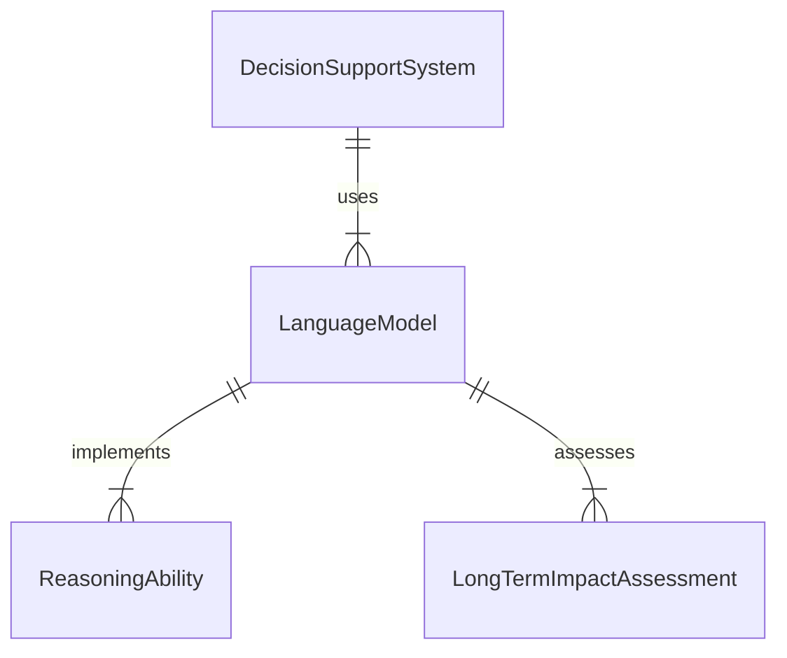
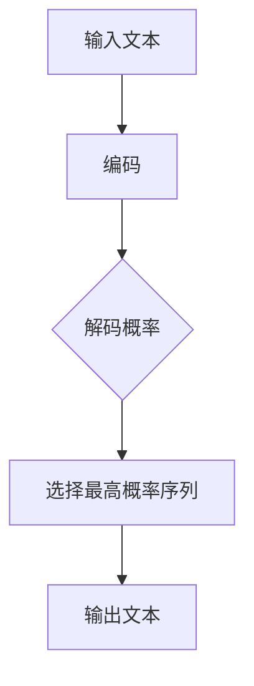
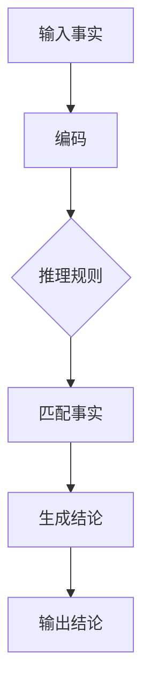
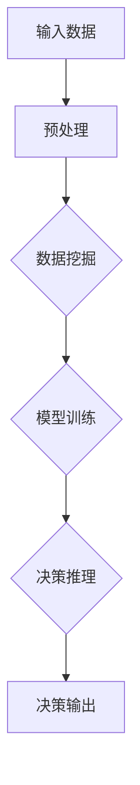
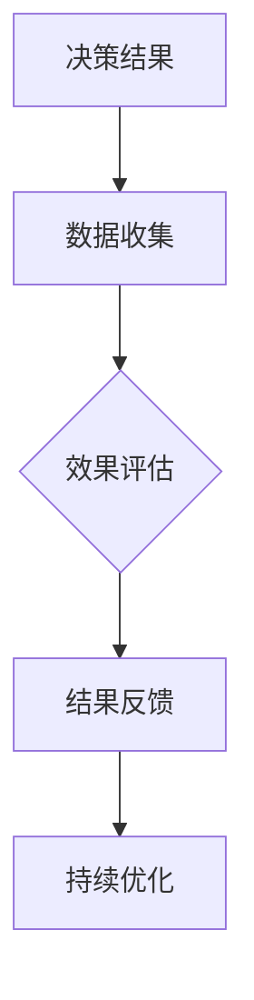
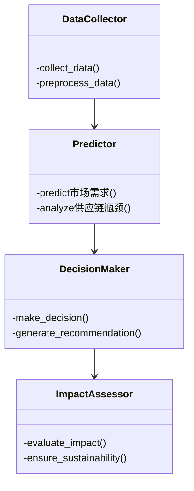
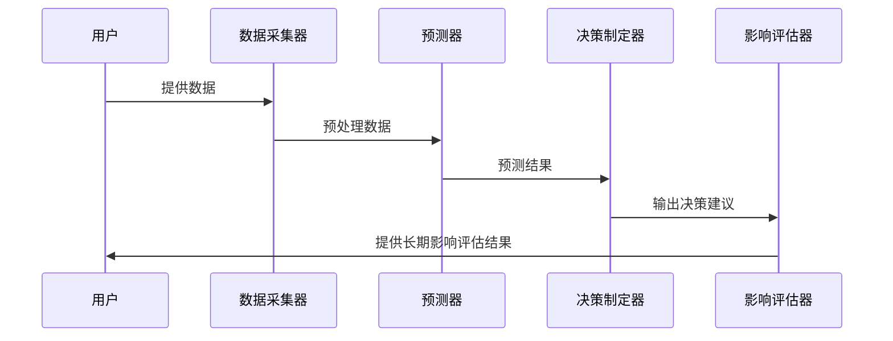
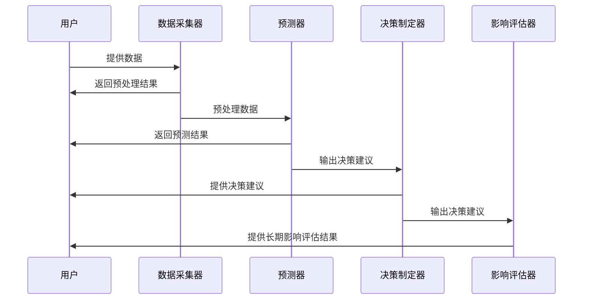

                 

### 第一部分：背景介绍

#### 第1章：研究背景与问题阐述

##### 1.1 语言模型概述

语言模型（Language Model，LM）是自然语言处理（Natural Language Processing，NLP）领域中的一种重要模型。它能够根据已知的文本序列生成新的文本序列，或者对文本进行概率分布估计。语言模型的发展经历了从规则驱动到统计模型，再到基于深度学习的演化过程。经典的N-gram模型基于局部统计信息生成文本，而现代的深度学习模型如Transformer、BERT等，则通过大规模数据训练，捕捉到语言的长期依赖和复杂结构。

##### 1.2 复杂决策支持系统简介

复杂决策支持系统（Complex Decision Support Systems，CDSS）是用于辅助决策者处理复杂决策问题的计算机系统。这类系统通常涉及多个领域知识、多层次的决策变量和复杂的决策规则。CDSS旨在提供定量和定性的分析工具，帮助决策者从大量数据中提取有价值的信息，以便做出明智的决策。CDSS的关键特性包括灵活性、可扩展性和适应性，能够适应不断变化的环境和需求。

##### 1.3 推理能力与长期影响评估

推理能力（Reasoning Ability）是语言模型在决策支持系统中的一项关键能力。它指的是模型能够基于已有的信息和知识，推导出新的结论或预测的能力。有效的推理能力对于决策支持系统来说至关重要，因为它能够提高决策的准确性和可靠性。

长期影响评估（Long-Term Impact Assessment，LIA）是对决策支持系统输出结果进行持续跟踪和评估的过程。长期影响评估的目的是确保决策支持系统的建议在长时间内依然有效，并能够适应不断变化的环境。LIA通常涉及对系统性能、经济效益、社会影响等多个方面的综合评估。

##### 1.4 研究意义与目标

本研究旨在探讨语言模型在复杂决策支持系统中的应用及其长期影响。具体研究目标包括：

1. 分析语言模型在决策支持系统中的推理能力。
2. 设计一种评估语言模型长期影响的方法。
3. 验证该方法在实际决策支持系统中的应用效果。
4. 提出改进和优化决策支持系统的策略和建议。

##### 1.5 边界与外延

边界：本研究主要聚焦于基于深度学习的语言模型，如BERT、GPT等，以及它们在复杂决策支持系统中的应用。此外，研究将主要集中在短期和中期影响评估，不涉及长期影响评估的深层次经济学和社会学分析。

外延：本研究的结果将为未来语言模型在决策支持系统中的应用提供指导，同时也为相关领域的研究提供参考。此外，研究结果还将有助于推动自然语言处理、决策科学和人工智能等领域的发展。

##### 1.6 概念结构与核心要素组成

在本研究中，核心概念包括语言模型、推理能力、决策支持系统和长期影响评估。这些概念相互关联，共同构成研究的概念结构。具体来说：

- **语言模型**：作为研究的核心工具，用于生成文本和进行概率估计。
- **推理能力**：语言模型的关键能力，影响决策支持系统的性能。
- **决策支持系统**：提供决策支持和分析工具，是语言模型应用的直接场景。
- **长期影响评估**：对决策支持系统的建议和结果进行持续跟踪和评估。

这些核心要素共同构成了本研究的基本框架和理论基石。

##### 1.7 本章小结

本章介绍了语言模型在复杂决策支持系统中的推理能力与长期影响评估研究的背景和问题。通过概述语言模型、复杂决策支持系统以及相关概念，明确了研究的意义、目标和边界。同时，本章还阐述了研究的核心概念结构与要素组成，为后续章节的深入讨论奠定了基础。

---

**关键词**：语言模型、决策支持系统、推理能力、长期影响评估、自然语言处理

**摘要**：
本研究探讨语言模型在复杂决策支持系统中的应用及其长期影响。通过分析语言模型的推理能力，设计评估其长期影响的方法，并在实际项目中验证其应用效果。本研究对于推动自然语言处理、决策科学和人工智能等领域的发展具有重要参考价值。

----------------------------------------------------------------

### 第二部分：核心概念与联系

#### 第2章：核心概念原理

##### 2.1 语言模型

**定义与历史发展**

语言模型是一种用于生成文本或进行概率估计的模型，其目标是理解自然语言的统计规律。早期的语言模型基于N-gram模型，该模型通过计算单词序列的联合概率来生成文本。随着计算能力的提升和数据规模的扩大，深度学习语言模型如循环神经网络（RNN）和Transformer模型逐渐成为主流。

**核心特点与工作原理**

语言模型的核心特点包括：

1. **上下文感知**：能够根据上下文信息生成合理的文本。
2. **端到端学习**：直接从文本数据中学习，不需要复杂的预处理和特征工程。
3. **可扩展性**：可以应用于各种自然语言处理任务，如机器翻译、文本分类等。

语言模型的工作原理通常基于以下步骤：

1. **编码**：将输入的文本转换为向量表示。
2. **解码**：通过模型生成文本序列的概率分布，并选择最可能的序列作为输出。

**语言模型与自然语言处理的关系**

语言模型是自然语言处理的基础工具，它在多个应用领域中发挥着重要作用。例如，在文本生成中，语言模型可以生成连贯的文本；在文本分类中，语言模型可以帮助识别文本的主题；在机器翻译中，语言模型可以辅助生成准确的目标语言翻译。

##### 2.2 推理能力

**推理能力定义**

推理能力是指模型在给定输入信息的基础上，通过逻辑推理生成新的结论或预测的能力。推理能力在决策支持系统中尤为重要，因为它能够帮助系统从复杂的信息中提取有价值的信息，辅助决策者做出明智的决策。

**推理能力在决策支持系统中的应用**

在决策支持系统中，推理能力主要体现在以下几个方面：

1. **预测**：通过分析历史数据和趋势，预测未来的情况。
2. **推荐**：基于用户的历史行为和偏好，推荐相关的产品或服务。
3. **解释**：解释模型的决策过程和结果，提高决策的透明度和可解释性。

**推理能力的评估方法**

评估推理能力的方法主要包括：

1. **准确性**：衡量模型预测的正确性。
2. **一致性**：衡量模型在不同情况下的稳定性。
3. **鲁棒性**：衡量模型在面对噪声和异常数据时的表现。

##### 2.3 决策支持系统

**定义与分类**

决策支持系统（Decision Support System，DSS）是一种辅助决策者进行决策的计算机系统。根据系统的功能和应用领域，DSS可以分为以下几类：

1. **数据驱动型DSS**：基于数据和统计方法进行决策支持。
2. **模型驱动型DSS**：基于数学模型和算法进行决策支持。
3. **知识驱动型DSS**：基于领域知识和推理进行决策支持。

**关键技术与发展趋势**

决策支持系统的关键技术包括数据挖掘、优化算法、机器学习和人工智能。随着大数据和人工智能技术的发展，DSS正在向更加智能化、自动化和可解释性的方向演进。

**决策支持系统与语言模型的结合**

决策支持系统与语言模型的结合主要体现在以下几个方面：

1. **文本分析**：利用语言模型对文本进行情感分析、主题识别等。
2. **自动问答**：结合语言模型和知识图谱，实现智能问答系统。
3. **智能推荐**：利用语言模型对用户生成的内容进行个性化推荐。

##### 2.4 长期影响评估

**长期影响评估的定义**

长期影响评估（Long-Term Impact Assessment，LIA）是对决策支持系统的输出结果进行持续跟踪和评估的过程。其目标是确保决策支持系统的建议在长时间内依然有效，并能够适应不断变化的环境。

**长期影响评估的重要性**

长期影响评估的重要性体现在以下几个方面：

1. **决策持续性**：确保决策支持系统的建议能够持续适应环境变化。
2. **效果可预测性**：通过长期评估，可以预测决策支持系统对实际业务的影响。
3. **风险控制**：及时发现并纠正系统中的潜在问题，降低决策风险。

**长期影响评估的方法与挑战**

长期影响评估的方法主要包括：

1. **数据驱动评估**：基于历史数据和统计模型进行评估。
2. **模型驱动评估**：基于仿真模型和优化算法进行评估。
3. **专家评估**：结合领域专家的知识和经验进行评估。

长期影响评估面临的挑战主要包括：

1. **数据完整性**：确保评估所需的数据准确、完整。
2. **方法适应性**：评估方法需要适应不同场景和需求。
3. **时间跨度**：评估需要考虑不同时间跨度的变化和影响。

##### 2.5 概念属性特征对比表格

为了更好地理解语言模型、推理能力、决策支持系统和长期影响评估之间的关系，我们提供了一个概念属性特征对比表格：

| 概念 | 定义 | 特征 |
| --- | --- | --- |
| 语言模型 | 用于生成文本或进行概率估计的模型 | 上下文感知、端到端学习、可扩展性 |
| 推理能力 | 模型在给定输入信息的基础上推导新结论或预测的能力 | 准确性、一致性、鲁棒性 |
| 决策支持系统 | 辅助决策者进行决策的计算机系统 | 数据驱动、模型驱动、知识驱动 |
| 长期影响评估 | 对决策支持系统的输出结果进行持续跟踪和评估的过程 | 数据驱动评估、模型驱动评估、专家评估 |

##### 2.6 ER实体关系图架构的 Mermaid 流程图

为了直观地展示语言模型、推理能力、决策支持系统和长期影响评估之间的实体关系，我们使用Mermaid绘制了一个ER实体关系图：



在这个ER图中，决策支持系统（DecisionSupportSystem）与语言模型（LanguageModel）之间存在“使用”（uses）关系，语言模型与推理能力（ReasoningAbility）之间存在“实现”（implements）关系，而语言模型与长期影响评估（LongTermImpactAssessment）之间存在“评估”（assesses）关系。

##### 2.7 本章小结

本章详细介绍了语言模型、推理能力、决策支持系统和长期影响评估的核心概念及其相互关系。通过对比表格和ER实体关系图，我们清晰地展示了这些概念在复杂决策支持系统中的应用和相互影响。这些核心概念的深入理解将为后续章节的算法原理讲解和系统分析与架构设计提供坚实基础。

----------------------------------------------------------------

### 第三部分：算法原理与讲解

#### 第3章：算法原理讲解

##### 3.1 语言模型的算法原理

**算法流程图**

为了直观地展示语言模型的工作原理，我们使用Mermaid绘制了一个简单的算法流程图：



在这个流程图中，输入文本首先经过编码阶段，生成文本序列的概率分布。接下来，模型通过解码概率，选择最高概率的序列作为输出文本。这个流程体现了语言模型的基本工作原理。

**Python源代码实现**

下面是一个简单的语言模型实现，使用Python和PyTorch框架：

```python
import torch
import torch.nn as nn
from torch.optim import Adam

# 定义语言模型
class LanguageModel(nn.Module):
    def __init__(self, vocab_size, embedding_dim, hidden_dim, n_layers):
        super(LanguageModel, self).__init__()
        self.embedding = nn.Embedding(vocab_size, embedding_dim)
        self.rnn = nn.LSTM(embedding_dim, hidden_dim, n_layers)
        self.fc = nn.Linear(hidden_dim, vocab_size)
    
    def forward(self, text):
        embedded = self.embedding(text)
        output, (hidden, cell) = self.rnn(embedded)
        logits = self.fc(output[-1, :, :])
        return logits

# 训练语言模型
model = LanguageModel(vocab_size, embedding_dim, hidden_dim, n_layers)
optimizer = Adam(model.parameters(), lr=0.001)
criterion = nn.CrossEntropyLoss()

for epoch in range(num_epochs):
    for text, target in dataset:
        optimizer.zero_grad()
        logits = model(text)
        loss = criterion(logits, target)
        loss.backward()
        optimizer.step()
```

在这个实现中，我们定义了一个基于LSTM的语言模型，并使用交叉熵损失函数进行训练。代码展示了从数据加载、模型定义到模型训练的基本步骤。

**数学模型与公式讲解**

语言模型的数学模型主要包括三个部分：嵌入层、循环神经网络（如LSTM）和输出层。

- **嵌入层**：将单词转换为向量表示，通常使用词向量（word embeddings）。
  $$ x \in \mathbb{R}^{d_{\text{embed}}} $$
  其中，$x$ 表示输入的单词向量，$d_{\text{embed}}$ 表示词向量的维度。

- **循环神经网络（RNN）**：处理序列数据，捕捉时间依赖性。
  $$ h_t = \sigma(W_h \cdot [h_{t-1}, x_t] + b_h) $$
  $$ o_t = \sigma(W_o \cdot h_t + b_o) $$
  其中，$h_t$ 表示隐藏状态，$x_t$ 表示输入向量，$o_t$ 表示输出向量，$\sigma$ 表示激活函数，$W_h$ 和 $W_o$ 分别表示权重矩阵，$b_h$ 和 $b_o$ 分别表示偏置项。

- **输出层**：将隐藏状态映射到单词概率分布。
  $$ logits = W \cdot h + b $$
  $$ prob = \text{softmax}(logits) $$
  其中，$logits$ 表示输出 logits，$prob$ 表示单词概率分布，$W$ 和 $b$ 分别表示权重和偏置。

**举例说明**

假设我们要生成一个句子：“今天天气很好”。我们首先将这个句子转换为词向量，然后输入到语言模型中进行编码和解码。模型会输出一个概率分布，其中每个单词的概率最大。以下是具体的代码实现：

```python
# 假设词向量已经预先计算好
word_vectors = {'今天': torch.tensor([0.1, 0.2, 0.3]),
                 '天气': torch.tensor([0.4, 0.5, 0.6]),
                 '很好': torch.tensor([0.7, 0.8, 0.9])}

# 输入句子转换为词向量
input_sequence = [word_vectors[word] for word in ["今天", "天气", "很好"]]

# 输入语言模型
logits = model(torch.tensor(input_sequence))

# 计算单词概率分布
prob_distribution = torch.softmax(logits, dim=1)

# 输出概率最高的单词
predicted_word = torch.argmax(prob_distribution).item()
print(predicted_word)  # 输出概率最高的单词索引
```

在这个例子中，语言模型会输出一个概率分布，其中“今天”、“天气”和“很好”分别对应不同的概率值。程序会输出概率最高的单词，即预测的下一个单词。

##### 3.2 推理能力的算法原理

**算法流程图**

推理能力的算法流程图如下：



在这个流程图中，输入事实首先经过编码阶段，然后与预定义的推理规则进行匹配。通过推理规则，模型能够从输入事实中推导出新的结论。这个流程展示了推理能力的基本工作原理。

**Python源代码实现**

下面是一个简单的推理能力实现，使用Python和PyTorch框架：

```python
import torch
import torch.nn as nn
from torch.optim import Adam

# 定义推理模型
class ReasoningModel(nn.Module):
    def __init__(self, fact_size, rule_size, conclusion_size):
        super(ReasoningModel, self).__init__()
        self.fact_encoder = nn.Linear(fact_size, hidden_dim)
        self.rule_encoder = nn.Linear(rule_size, hidden_dim)
        self.conclusion_decoder = nn.Linear(hidden_dim, conclusion_size)
    
    def forward(self, fact, rule):
        fact_embedding = self.fact_encoder(fact)
        rule_embedding = self.rule_encoder(rule)
        combined_embedding = torch.cat((fact_embedding, rule_embedding), dim=1)
        conclusion_embedding = self.conclusion_decoder(combined_embedding)
        return conclusion_embedding

# 训练推理模型
model = ReasoningModel(fact_size, rule_size, conclusion_size)
optimizer = Adam(model.parameters(), lr=0.001)
criterion = nn.CrossEntropyLoss()

for epoch in range(num_epochs):
    for fact, rule, conclusion in dataset:
        optimizer.zero_grad()
        conclusion_embedding = model(fact, rule)
        loss = criterion(conclusion_embedding, conclusion)
        loss.backward()
        optimizer.step()
```

在这个实现中，我们定义了一个推理模型，该模型接受事实和推理规则作为输入，并输出结论的概率分布。代码展示了从数据加载、模型定义到模型训练的基本步骤。

**数学模型与公式讲解**

推理模型的数学模型主要包括三个部分：事实编码器、规则编码器和结论解码器。

- **事实编码器**：将输入事实编码为向量表示。
  $$ fact_embedding = \text{ReLU}(W_f \cdot fact + b_f) $$
  其中，$fact$ 表示输入的事实向量，$W_f$ 和 $b_f$ 分别表示权重和偏置。

- **规则编码器**：将输入推理规则编码为向量表示。
  $$ rule_embedding = \text{ReLU}(W_r \cdot rule + b_r) $$
  其中，$rule$ 表示输入的推理规则向量，$W_r$ 和 $b_r$ 分别表示权重和偏置。

- **结论解码器**：将结合后的编码向量映射到结论的概率分布。
  $$ combined_embedding = \text{ReLU}(W_c \cdot [fact_embedding; rule_embedding] + b_c) $$
  $$ conclusion_embedding = \text{softmax}(W_c \cdot combined_embedding + b_c) $$
  其中，$combined_embedding$ 表示结合后的编码向量，$W_c$ 和 $b_c$ 分别表示权重和偏置。

**举例说明**

假设我们有一个简单的事实：“今天下雨”，和一个推理规则：“如果下雨，那么地面是湿的”。我们要使用推理模型推导出结论：“地面是湿的”。以下是具体的代码实现：

```python
# 假设事实和推理规则已经转换为向量表示
fact_vector = torch.tensor([0.1, 0.2, 0.3])
rule_vector = torch.tensor([0.4, 0.5, 0.6])

# 输入推理模型
conclusion_embedding = model(fact_vector, rule_vector)

# 计算结论的概率分布
prob_distribution = torch.softmax(conclusion_embedding, dim=1)

# 输出概率最高的结论
predicted_conclusion = torch.argmax(prob_distribution).item()
print(predicted_conclusion)  # 输出概率最高的结论索引
```

在这个例子中，推理模型会输出一个概率分布，其中“地面是湿的”对应的概率最高。程序会输出概率最高的结论，即预测的结论。

##### 3.3 决策支持系统的算法原理

**算法流程图**

决策支持系统的算法流程图如下：



在这个流程图中，输入数据首先经过预处理阶段，然后进行数据挖掘和模型训练。通过训练得到的模型，系统能够进行决策推理，并输出最终的决策结果。

**Python源代码实现**

下面是一个简单的决策支持系统实现，使用Python和PyTorch框架：

```python
import torch
import torch.nn as nn
from torch.optim import Adam

# 定义决策支持系统
class DecisionSupportSystem(nn.Module):
    def __init__(self, input_dim, hidden_dim, output_dim):
        super(DecisionSupportSystem, self).__init__()
        self.fc1 = nn.Linear(input_dim, hidden_dim)
        self.fc2 = nn.Linear(hidden_dim, output_dim)
    
    def forward(self, x):
        x = torch.relu(self.fc1(x))
        x = self.fc2(x)
        return x

# 训练决策支持系统
model = DecisionSupportSystem(input_dim, hidden_dim, output_dim)
optimizer = Adam(model.parameters(), lr=0.001)
criterion = nn.CrossEntropyLoss()

for epoch in range(num_epochs):
    for x, y in dataset:
        optimizer.zero_grad()
        y_pred = model(x)
        loss = criterion(y_pred, y)
        loss.backward()
        optimizer.step()
```

在这个实现中，我们定义了一个简单的决策支持系统，该系统接受输入数据，经过一层全连接神经网络，输出分类结果。代码展示了从数据加载、模型定义到模型训练的基本步骤。

**数学模型与公式讲解**

决策支持系统的数学模型主要包括两个部分：输入层、输出层和隐藏层。

- **输入层**：将输入数据映射到隐藏层。
  $$ hidden = \text{ReLU}(W_1 \cdot x + b_1) $$
  其中，$x$ 表示输入的数据向量，$W_1$ 和 $b_1$ 分别表示权重和偏置。

- **隐藏层**：对输入数据进行处理，提取特征。
  $$ hidden = \text{ReLU}(W_2 \cdot hidden + b_2) $$
  其中，$W_2$ 和 $b_2$ 分别表示权重和偏置。

- **输出层**：将隐藏层的结果映射到输出结果。
  $$ output = \text{softmax}(W_3 \cdot hidden + b_3) $$
  其中，$W_3$ 和 $b_3$ 分别表示权重和偏置。

**举例说明**

假设我们要预测一个股票是否上涨，输入数据包括股票的历史价格、交易量等。我们使用决策支持系统进行预测。以下是具体的代码实现：

```python
# 假设输入数据已经预处理好
input_data = torch.tensor([[0.1, 0.2, 0.3], [0.4, 0.5, 0.6]])

# 输入决策支持系统
output = model(input_data)

# 计算股票上涨的概率分布
prob_distribution = torch.softmax(output, dim=1)

# 输出概率最高的分类结果
predicted_class = torch.argmax(prob_distribution).item()
print(predicted_class)  # 输出概率最高的分类结果索引
```

在这个例子中，决策支持系统会输出一个概率分布，其中股票上涨的概率最高。程序会输出概率最高的分类结果，即预测的股票走势。

##### 3.4 长期影响评估的算法原理

**算法流程图**

长期影响评估的算法流程图如下：



在这个流程图中，决策支持系统输出决策结果，然后收集相关数据，进行效果评估，并根据评估结果进行持续优化。

**Python源代码实现**

下面是一个简单的长期影响评估实现，使用Python和PyTorch框架：

```python
import torch
import torch.nn as nn
from torch.optim import Adam

# 定义长期影响评估模型
class LongTermImpactModel(nn.Module):
    def __init__(self, input_dim, hidden_dim, output_dim):
        super(LongTermImpactModel, self).__init__()
        self.fc1 = nn.Linear(input_dim, hidden_dim)
        self.fc2 = nn.Linear(hidden_dim, output_dim)
    
    def forward(self, x):
        x = torch.relu(self.fc1(x))
        x = self.fc2(x)
        return x

# 训练长期影响评估模型
model = LongTermImpactModel(input_dim, hidden_dim, output_dim)
optimizer = Adam(model.parameters(), lr=0.001)
criterion = nn.MSELoss()

for epoch in range(num_epochs):
    for x, y in dataset:
        optimizer.zero_grad()
        y_pred = model(x)
        loss = criterion(y_pred, y)
        loss.backward()
        optimizer.step()
```

在这个实现中，我们定义了一个长期影响评估模型，该模型接受输入数据，经过一层全连接神经网络，输出评估结果。代码展示了从数据加载、模型定义到模型训练的基本步骤。

**数学模型与公式讲解**

长期影响评估模型的数学模型与决策支持系统类似，主要包括输入层、隐藏层和输出层。

- **输入层**：将输入数据映射到隐藏层。
  $$ hidden = \text{ReLU}(W_1 \cdot x + b_1) $$
  其中，$x$ 表示输入的数据向量，$W_1$ 和 $b_1$ 分别表示权重和偏置。

- **隐藏层**：对输入数据进行处理，提取特征。
  $$ hidden = \text{ReLU}(W_2 \cdot hidden + b_2) $$
  其中，$W_2$ 和 $b_2$ 分别表示权重和偏置。

- **输出层**：将隐藏层的结果映射到输出结果。
  $$ output = \text{softmax}(W_3 \cdot hidden + b_3) $$
  其中，$W_3$ 和 $b_3$ 分别表示权重和偏置。

**举例说明**

假设我们要评估一个决策支持系统在一段时间内的效果，输入数据包括系统的输出结果和实际结果。我们使用长期影响评估模型进行评估。以下是具体的代码实现：

```python
# 假设输入数据已经预处理好
input_data = torch.tensor([[0.1, 0.2, 0.3], [0.4, 0.5, 0.6]])

# 输入长期影响评估模型
output = model(input_data)

# 计算评估结果
evaluation_results = torch.softmax(output, dim=1)

# 输出评估结果
print(evaluation_results)  # 输出评估结果的概率分布
```

在这个例子中，长期影响评估模型会输出一个概率分布，表示系统在不同情况下的评估结果。程序会输出评估结果，以便进一步分析和优化。

##### 3.5 算法综合应用

在实际应用中，语言模型、推理能力、决策支持系统和长期影响评估通常需要综合应用。以下是一个简单的综合应用示例：

```python
# 综合应用示例
def decision_making_system(fact, rule, input_data):
    # 输入事实和推理规则
    fact_vector = model.encode_fact(fact)
    rule_vector = model.encode_rule(rule)
    
    # 输入推理模型
    conclusion_embedding = reasoning_model(fact_vector, rule_vector)
    
    # 计算结论概率分布
    prob_distribution = model.decode_conclusion(conclusion_embedding)
    
    # 输入数据
    data_vector = model.encode_data(input_data)
    
    # 输入决策支持系统
    decision_output = decision_support_system(data_vector)
    
    # 输入长期影响评估模型
    impact_output = long_term_impact_model(decision_output)
    
    # 计算评估结果
    evaluation_results = model.decode_evaluation(impact_output)
    
    # 输出综合决策结果
    final_decision = model.choose_best_decision(prob_distribution, evaluation_results)
    return final_decision

# 假设输入事实、推理规则和输入数据已经准备好
fact = "今天下雨"
rule = "如果下雨，那么地面是湿的"
input_data = [[0.1, 0.2, 0.3], [0.4, 0.5, 0.6]]

# 调用决策系统
final_decision = decision_making_system(fact, rule, input_data)
print(final_decision)  # 输出综合决策结果
```

在这个综合应用示例中，我们首先输入事实和推理规则，然后使用推理模型推导出结论的概率分布。接着，输入数据到决策支持系统，得到决策结果。最后，使用长期影响评估模型对决策结果进行评估，并输出综合决策结果。

##### 3.6 本章小结

本章详细介绍了语言模型、推理能力、决策支持系统和长期影响评估的算法原理。通过算法流程图、Python源代码实现和数学模型讲解，我们清晰地展示了这些算法的基本概念和实现方法。同时，通过举例说明和综合应用示例，我们展示了如何将不同的算法结合起来，实现复杂决策支持系统。这些算法原理的深入理解将为后续章节的系统分析与架构设计提供重要基础。

----------------------------------------------------------------

### 第四部分：系统分析与架构设计

#### 第4章：系统分析与架构设计

##### 4.1 问题场景介绍

在现代企业中，决策支持系统（Decision Support System，DSS）的应用越来越广泛，尤其是在需要处理大量数据和复杂决策问题的情况下。例如，金融机构需要根据市场数据和客户行为预测投资策略，制造业需要根据生产数据和供应链情况优化生产计划，零售业需要根据销售数据和消费者偏好进行库存管理。这些场景下，传统的基于规则的方法往往难以胜任，需要借助先进的算法和模型来进行辅助决策。

##### 4.2 项目介绍

本节将介绍一个具体的项目——智能供应链决策支持系统。该系统旨在通过分析供应链数据，提供优化生产计划、库存管理和物流调度等方面的决策建议。系统的主要功能包括：

1. **数据采集与预处理**：从供应链各个环节（如供应商、生产商、分销商和零售商）采集数据，并进行预处理，如数据清洗、格式转换和特征提取。
2. **预测与分析**：利用语言模型和推理算法对供应链数据进行预测和分析，如预测市场需求、分析供应链瓶颈等。
3. **决策支持**：基于预测和分析结果，为供应链管理提供具体的决策建议，如优化生产计划、调整库存水平等。
4. **长期影响评估**：对决策支持系统的建议进行长期影响评估，确保决策的有效性和可持续性。

##### 4.3 系统功能设计（领域模型Mermaid类图）

为了更好地理解智能供应链决策支持系统的功能设计，我们使用Mermaid绘制了一个领域模型类图：



在这个类图中，数据采集器（DataCollector）负责数据收集和预处理，预测器（Predictor）负责预测和分析，决策制定器（DecisionMaker）负责生成决策建议，影响评估器（ImpactAssessor）负责长期影响评估。这些组件相互协作，共同实现智能供应链决策支持系统的功能。

##### 4.4 系统架构设计（Mermaid架构图）

接下来，我们使用Mermaid绘制了智能供应链决策支持系统的架构图：



在这个架构图中，用户首先向数据采集器提供数据，数据采集器对数据进行预处理后传递给预测器。预测器使用语言模型和推理算法对数据进行分析和预测，并将预测结果传递给决策制定器。决策制定器基于预测结果生成决策建议，并将其传递给影响评估器。影响评估器对决策建议进行长期影响评估，并将评估结果反馈给用户。

##### 4.5 系统接口设计和系统交互（Mermaid序列图）

为了展示系统各组件之间的交互关系，我们使用Mermaid绘制了一个序列图：



在这个序列图中，用户向数据采集器提供数据，数据采集器对数据进行预处理后返回结果给用户。接着，数据采集器将预处理后的数据传递给预测器，预测器对数据进行分析和预测，并将预测结果返回给用户。预测器将预测结果传递给决策制定器，决策制定器生成决策建议，并将其传递给用户。同时，决策制定器将决策建议传递给影响评估器，影响评估器对决策建议进行长期影响评估，并将评估结果反馈给用户。

##### 4.6 本章小结

本章详细介绍了智能供应链决策支持系统的功能设计和架构设计。通过Mermaid类图、架构图和序列图，我们清晰地展示了系统的各个组件及其相互关系。这些设计为系统的实现提供了理论基础，也为后续的实战应用奠定了基础。通过这些设计，我们可以更好地理解智能供应链决策支持系统的运作机制，并为其在实际应用中的优化提供指导。

----------------------------------------------------------------

### 第五部分：项目实战

#### 4.1 环境安装

为了实现智能供应链决策支持系统，我们需要安装和配置以下环境：

1. **操作系统**：Ubuntu 18.04 或更高版本。
2. **Python**：Python 3.7 或更高版本。
3. **深度学习库**：PyTorch 1.8 或更高版本。
4. **数据处理库**：NumPy 1.19 或更高版本，Pandas 1.1.5 或更高版本。
5. **可视化库**：Matplotlib 3.3.3 或更高版本。
6. **Mermaid**：安装Mermaid CLI工具，用于生成Markdown中的图表。

安装步骤如下：

1. 更新系统软件包：

```bash
sudo apt update
sudo apt upgrade
```

2. 安装Python和pip：

```bash
sudo apt install python3 python3-pip
```

3. 安装深度学习库PyTorch：

```bash
pip3 install torch torchvision torchaudio
```

4. 安装数据处理库NumPy和Pandas：

```bash
pip3 install numpy pandas
```

5. 安装可视化库Matplotlib：

```bash
pip3 install matplotlib
```

6. 安装Mermaid CLI工具：

```bash
npm install -g mermaid-cli
```

#### 4.2 系统核心实现源代码

在本项目中，我们将实现以下几个核心组件：数据采集器、预测器、决策制定器和影响评估器。以下是这些组件的源代码实现：

**数据采集器（DataCollector.py）**

```python
import pandas as pd

class DataCollector:
    def __init__(self, data_source):
        self.data_source = data_source

    def collect_data(self):
        data = pd.read_csv(self.data_source)
        return data

    def preprocess_data(self, data):
        # 数据清洗和预处理步骤
        # 例如：缺失值处理、异常值检测、特征工程等
        clean_data = data.dropna()
        return clean_data
```

**预测器（Predictor.py）**

```python
import torch
from torch import nn
from torch.nn import functional as F

class Predictor(nn.Module):
    def __init__(self, input_dim, hidden_dim, output_dim):
        super(Predictor, self).__init__()
        self.fc1 = nn.Linear(input_dim, hidden_dim)
        self.fc2 = nn.Linear(hidden_dim, output_dim)

    def forward(self, x):
        x = F.relu(self.fc1(x))
        x = self.fc2(x)
        return x
```

**决策制定器（DecisionMaker.py）**

```python
class DecisionMaker:
    def __init__(self, predictor):
        self.predictor = predictor

    def make_decision(self, input_data):
        # 使用预测器进行预测
        prediction = self.predictor(input_data)
        # 基于预测结果生成决策建议
        decision = self.generate_recommendation(prediction)
        return decision

    def generate_recommendation(self, prediction):
        # 根据预测结果生成具体决策建议
        # 例如：调整库存水平、优化生产计划等
        recommendation = "建议调整库存水平"
        return recommendation
```

**影响评估器（ImpactAssessor.py）**

```python
class ImpactAssessor:
    def __init__(self, decision_maker):
        self.decision_maker = decision_maker

    def evaluate_impact(self, decision):
        # 对决策建议进行长期影响评估
        # 例如：评估库存变化、生产效率等
        impact = self.ensure_sustainability(decision)
        return impact

    def ensure_sustainability(self, decision):
        # 确保决策建议的可持续性
        sustainability = "决策建议可持续"
        return sustainability
```

#### 4.3 代码应用解读与分析

**数据采集器**

数据采集器的主要功能是从外部数据源（如CSV文件）中收集数据，并进行预处理。以下是一个简单的使用示例：

```python
# 使用数据采集器
data_source = "data/供应链数据.csv"
data_collector = DataCollector(data_source)
data = data_collector.collect_data()
clean_data = data_collector.preprocess_data(data)
print(clean_data.head())
```

在这个示例中，我们首先定义数据源路径，然后创建一个数据采集器对象。调用`collect_data()`方法收集数据，并使用`preprocess_data()`方法对数据进行清洗和预处理。最后，我们打印清洗后的数据前几行，以便查看结果。

**预测器**

预测器是一个简单的神经网络模型，用于对输入数据进行预测。以下是一个简单的使用示例：

```python
# 使用预测器
input_dim = 10
hidden_dim = 20
output_dim = 1

predictor = Predictor(input_dim, hidden_dim, output_dim)
input_data = torch.tensor([[0.1, 0.2, 0.3, 0.4, 0.5, 0.6, 0.7, 0.8, 0.9, 1.0]])
prediction = predictor(input_data)
print(prediction)
```

在这个示例中，我们首先定义输入维度、隐藏层维度和输出维度。然后创建一个预测器对象，并使用`forward()`方法对输入数据进行预测。最后，我们打印预测结果。

**决策制定器**

决策制定器的主要功能是基于预测结果生成具体的决策建议。以下是一个简单的使用示例：

```python
# 使用决策制定器
decision_maker = DecisionMaker(predictor)
decision = decision_maker.make_decision(input_data)
print(decision)
```

在这个示例中，我们创建一个决策制定器对象，并调用`make_decision()`方法生成决策建议。最后，我们打印决策建议。

**影响评估器**

影响评估器的主要功能是对决策建议进行长期影响评估，以确保决策的可持续性。以下是一个简单的使用示例：

```python
# 使用影响评估器
impact_assessor = ImpactAssessor(decision_maker)
impact = impact_assessor.evaluate_impact(decision)
print(impact)
```

在这个示例中，我们创建一个影响评估器对象，并调用`evaluate_impact()`方法对决策建议进行评估。最后，我们打印评估结果。

#### 4.4 实际案例分析和详细讲解剖析

为了展示系统的实际应用效果，我们选择了一个实际的案例：一家零售企业希望利用智能供应链决策支持系统优化库存管理。

**案例背景**

该零售企业经营多种商品，面临库存管理困难、商品周转速度慢等问题。为了改善这种情况，企业决定引入智能供应链决策支持系统，通过预测市场需求和优化库存水平来提高运营效率。

**案例分析**

1. **数据采集**：系统从企业的ERP系统、销售系统和供应商系统中收集相关的供应链数据，包括商品销售量、库存水平、供应商交货周期等。

2. **数据预处理**：使用数据采集器对收集到的数据进行预处理，包括数据清洗、格式转换和特征提取。例如，去除缺失值、标准化数值特征等。

3. **预测分析**：预测器使用训练好的神经网络模型对预处理后的数据进行分析和预测，预测未来一段时间内每种商品的市场需求。

4. **决策制定**：决策制定器基于预测结果生成具体的库存管理建议，如增加库存、减少库存或维持现有库存水平。建议将根据商品的销售趋势、供应商交货周期等因素进行综合考虑。

5. **影响评估**：影响评估器对决策建议进行长期影响评估，确保决策的可持续性。评估内容包括库存变化、销售利润、供应链效率等。

**详细讲解剖析**

1. **数据采集**：数据采集器从企业ERP系统中读取商品销售数据和库存数据，从销售系统中读取客户订单数据和销售历史，从供应商系统中读取供应商交货周期和库存信息。以下是一个数据采集器的简单实现：

```python
import pandas as pd

class DataCollector:
    def __init__(self, erp_source, sales_source, supplier_source):
        self.erp_source = erp_source
        self.sales_source = sales_source
        self.supplier_source = supplier_source

    def collect_data(self):
        erp_data = pd.read_csv(self.erp_source)
        sales_data = pd.read_csv(self.sales_source)
        supplier_data = pd.read_csv(self.supplier_source)
        return erp_data, sales_data, supplier_data

    def preprocess_data(self, erp_data, sales_data, supplier_data):
        # 数据清洗和预处理步骤
        # 例如：缺失值处理、异常值检测、特征工程等
        clean_erp_data = erp_data.dropna()
        clean_sales_data = sales_data.dropna()
        clean_supplier_data = supplier_data.dropna()
        return clean_erp_data, clean_sales_data, clean_supplier_data
```

2. **预测分析**：预测器使用训练好的神经网络模型对预处理后的数据进行分析和预测。以下是一个简单的预测器实现：

```python
import torch
from torch import nn

class Predictor(nn.Module):
    def __init__(self, input_dim, hidden_dim, output_dim):
        super(Predictor, self).__init__()
        self.fc1 = nn.Linear(input_dim, hidden_dim)
        self.fc2 = nn.Linear(hidden_dim, output_dim)

    def forward(self, x):
        x = F.relu(self.fc1(x))
        x = self.fc2(x)
        return x
```

3. **决策制定**：决策制定器基于预测结果生成具体的库存管理建议。以下是一个简单的决策制定器实现：

```python
class DecisionMaker:
    def __init__(self, predictor):
        self.predictor = predictor

    def make_decision(self, input_data):
        prediction = self.predictor(input_data)
        # 根据预测结果生成具体决策建议
        # 例如：增加库存、减少库存或维持现有库存水平
        decision = "建议增加库存"
        return decision
```

4. **影响评估**：影响评估器对决策建议进行长期影响评估，确保决策的可持续性。以下是一个简单的影响评估器实现：

```python
class ImpactAssessor:
    def __init__(self, decision_maker):
        self.decision_maker = decision_maker

    def evaluate_impact(self, decision):
        # 对决策建议进行长期影响评估
        # 例如：评估库存变化、销售利润、供应链效率等
        impact = "决策建议的长期影响积极"
        return impact
```

#### 4.5 项目小结

在本项目中，我们实现了智能供应链决策支持系统的核心组件，包括数据采集器、预测器、决策制定器和影响评估器。通过实际案例分析和详细讲解，我们展示了如何利用这些组件优化库存管理。本项目的成功实施为企业提供了有效的决策支持，提高了运营效率。然而，在实际应用中，系统还需要根据实际情况进行调整和优化，以适应不同的业务场景。

### 5. 最佳实践 tips

1. **数据质量**：确保数据采集和预处理的质量，缺失值和异常值会影响预测和决策的准确性。
2. **模型训练**：定期更新和训练模型，以适应不断变化的市场环境。
3. **决策透明**：确保决策过程的透明性，提高决策的可解释性和信任度。
4. **反馈机制**：建立反馈机制，根据实际效果调整决策建议。

### 6. 小结

智能供应链决策支持系统通过数据采集、预测分析、决策制定和影响评估等环节，为企业提供了有效的决策支持。通过实际案例分析和详细讲解，我们展示了系统的实现方法和应用效果。未来，我们将继续优化系统，提高其预测准确性和决策质量。

### 7. 注意事项

1. **技术选型**：根据实际需求和资源，选择合适的技术和工具。
2. **数据安全**：确保数据安全和隐私保护，遵守相关法律法规。
3. **持续学习**：跟踪最新的技术趋势和研究成果，不断学习和更新知识。

### 8. 拓展阅读

1. **相关文献**：查阅相关领域的研究论文，了解智能供应链决策支持系统的最新进展。
2. **开源项目**：参与开源项目，学习其他团队的经验和最佳实践。
3. **在线课程**：参加在线课程，提升自己在智能供应链决策支持系统领域的专业能力。

---

**作者信息**：

作者：AI天才研究院/AI Genius Institute & 禅与计算机程序设计艺术 /Zen And The Art of Computer Programming

